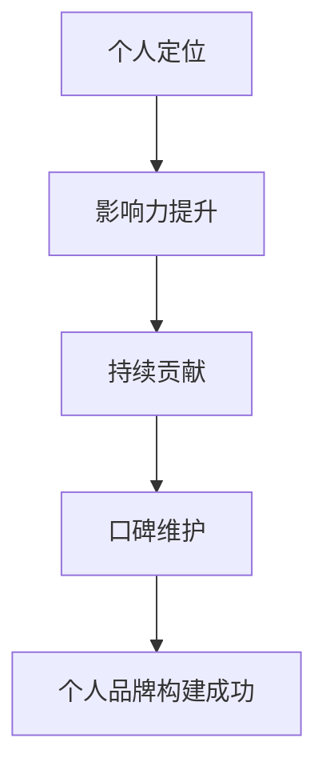

                 

关键词：个人品牌、开源开发者、声誉管理、影响力、技术传播、开源社区

> 摘要：本文旨在探讨如何构建个人品牌，为开源开发者提供声誉管理的策略和技巧。通过分析个人品牌的重要性，结合开源社区的特点，本文提出了一系列实用的方法和实践，帮助开发者提升其在社区中的影响力，树立专业形象，从而在职业生涯中取得更大的成功。

## 1. 背景介绍

在信息化时代，个人品牌已经成为成功的重要要素之一。无论是在商业领域还是技术领域，个人品牌的影响力都不可忽视。对于开源开发者来说，个人品牌的构建尤为重要。开源社区是一个充满活力和竞争的生态圈，开发者们在其中相互交流、合作和竞争。一个强大的个人品牌可以帮助开发者脱颖而出，获得更多的机会和资源。

### 1.1 开源社区的特点

开源社区具有以下特点：

1. **协作性**：开源项目的成功往往依赖于众多开发者的协作。
2. **开放性**：开源项目通常对所有人开放，接受任何人的参与和贡献。
3. **多样性**：开源社区涵盖了各种层次和技术领域的开发者。
4. **竞争性**：由于开源项目的共享性，开发者之间往往存在着竞争。

### 1.2 个人品牌的重要性

在开源社区中，个人品牌的重要性体现在以下几个方面：

1. **影响力**：强大的个人品牌可以增加开发者在社区中的影响力。
2. **机会**：个人品牌可以帮助开发者获得更多的职业机会和合作机会。
3. **信誉**：良好的个人品牌有助于提升开发者的专业信誉和认可度。
4. **成长**：个人品牌可以帮助开发者不断学习和成长。

## 2. 核心概念与联系

构建个人品牌需要理解以下几个核心概念：

1. **个人定位**：明确自己在社区中的定位，找到自己的独特价值。
2. **影响力**：提升在社区中的影响力，通过技术传播和个人魅力吸引关注。
3. **持续贡献**：在开源项目中持续贡献，提高自己的技术能力和知名度。
4. **口碑**：维护良好的口碑，建立积极的个人形象。

以下是构建个人品牌的 Mermaid 流程图：



### 2.1 个人定位

个人定位是构建个人品牌的第一步。明确自己的技术方向、兴趣点和目标人群，可以帮助开发者更精准地定位自己的品牌。例如，一个专注于前端开发的开发者，可以定位为“前端技术专家”，并在前端领域持续深耕。

### 2.2 影响力提升

影响力是个人品牌的核心。在开源社区中，开发者可以通过以下方式提升自己的影响力：

1. **技术传播**：通过博客、演讲、教程等方式，分享自己的技术知识和经验。
2. **积极参与**：在开源项目中积极参与，为社区做出贡献。
3. **个人魅力**：通过幽默、亲和力等个人魅力，吸引更多关注。

### 2.3 持续贡献

持续贡献是构建个人品牌的关键。在开源项目中，开发者可以通过以下方式持续贡献：

1. **代码贡献**：积极参与开源项目的代码开发，提高自己的技术水平。
2. **文档编写**：为开源项目编写高质量的文档，提高项目的可读性和易用性。
3. **问题解决**：在社区中积极解答问题，帮助他人，树立专业形象。

### 2.4 口碑维护

口碑是个人品牌的基石。在开源社区中，开发者需要维护良好的口碑，包括：

1. **专业态度**：保持专业的态度，对待每一个问题和项目都要认真负责。
2. **诚信**：诚实守信，不夸大其词，不虚假宣传。
3. **持续学习**：不断学习新知识，提高自己的技术水平。

## 3. 核心算法原理 & 具体操作步骤

### 3.1 算法原理概述

构建个人品牌的算法原理可以总结为以下几点：

1. **定位精准**：明确个人定位，找到自己的独特价值。
2. **持续投入**：在开源项目中持续投入时间和精力，提高自己的技术水平。
3. **积极传播**：通过技术传播和个人魅力，提升自己的影响力。
4. **口碑维护**：保持良好的专业态度和诚信，维护良好的口碑。

### 3.2 算法步骤详解

构建个人品牌的算法步骤可以分为以下几个阶段：

1. **定位阶段**：明确个人定位，确定自己在开源社区中的角色和价值。
2. **投入阶段**：在开源项目中持续投入时间和精力，提高自己的技术水平。
3. **传播阶段**：通过技术传播和个人魅力，提升自己的影响力。
4. **维护阶段**：保持良好的专业态度和诚信，维护良好的口碑。

### 3.3 算法优缺点

构建个人品牌的算法具有以下优缺点：

**优点**：

1. **精准定位**：帮助开发者找到自己的独特价值，提高个人品牌的专业性。
2. **持续成长**：通过在开源项目中的持续投入，开发者可以不断提高自己的技术水平。
3. **积极传播**：提升个人影响力，为开发者带来更多的职业机会和合作机会。

**缺点**：

1. **时间成本**：构建个人品牌需要投入大量的时间和精力。
2. **竞争压力**：在开源社区中，开发者需要面对激烈的竞争，保持自己的优势。

### 3.4 算法应用领域

构建个人品牌的算法可以应用于以下领域：

1. **技术传播**：通过技术博客、演讲、教程等方式，分享自己的技术知识和经验。
2. **项目合作**：在开源项目中积极参与，与其他开发者合作，共同推动项目的发展。
3. **个人成长**：通过不断学习和实践，提高自己的技术水平和专业素养。

## 4. 数学模型和公式 & 详细讲解 & 举例说明

### 4.1 数学模型构建

构建个人品牌的数学模型可以看作是一个优化问题，目标是最大化个人品牌的影响力。设：

- \( P \)：个人品牌影响力
- \( C \)：在开源项目中的贡献度
- \( T \)：技术传播能力
- \( R \)：口碑

则个人品牌影响力 \( P \) 可以表示为：

\[ P = f(C, T, R) \]

其中，\( f \) 为影响力函数，具体形式可以根据实际情况进行优化。

### 4.2 公式推导过程

假设 \( f(C, T, R) \) 为一个线性函数，即：

\[ P = aC + bT + cR \]

其中，\( a \)，\( b \)，\( c \) 为权重系数。

根据开源项目的特点，可以设定以下权重：

- \( a \)：贡献度权重，取值范围为 \( 0 \) 到 \( 1 \)
- \( b \)：传播能力权重，取值范围为 \( 0 \) 到 \( 1 \)
- \( c \)：口碑权重，取值范围为 \( 0 \) 到 \( 1 \)

为了简化计算，假设权重 \( a \)，\( b \)，\( c \) 分别为 \( 0.5 \)，\( 0.3 \)，\( 0.2 \)。

则个人品牌影响力 \( P \) 可以表示为：

\[ P = 0.5C + 0.3T + 0.2R \]

### 4.3 案例分析与讲解

以一位前端开发者为例，假设他的贡献度 \( C \) 为 8，传播能力 \( T \) 为 5，口碑 \( R \) 为 4。根据公式：

\[ P = 0.5 \times 8 + 0.3 \times 5 + 0.2 \times 4 = 4 + 1.5 + 0.8 = 6.3 \]

该开发者的个人品牌影响力为 6.3。

为了提高个人品牌影响力，开发者可以采取以下策略：

1. **提高贡献度**：积极参与开源项目，提高代码质量和贡献度。
2. **提升传播能力**：通过博客、演讲等方式，提升技术传播能力。
3. **维护口碑**：保持良好的专业态度，积极解决社区问题，树立良好口碑。

通过这些策略，开发者的个人品牌影响力可以逐步提升。

## 5. 项目实践：代码实例和详细解释说明

### 5.1 开发环境搭建

为了更好地实践个人品牌的构建，我们选择一个开源项目进行实战。以下是一个基于 Node.js 的开源项目搭建的步骤：

1. **安装 Node.js**：在官网下载 Node.js，并按照提示安装。
2. **初始化项目**：在本地创建一个空文件夹，进入文件夹后执行命令：

   ```bash
   npm init -y
   ```

   创建一个 package.json 文件。
3. **安装依赖**：根据项目需求，安装必要的依赖包：

   ```bash
   npm install express body-parser
   ```

### 5.2 源代码详细实现

以下是一个简单的基于 Node.js 的 RESTful API 服务器的代码示例：

```javascript
const express = require('express');
const bodyParser = require('body-parser');

const app = express();

app.use(bodyParser.json());

app.get('/', (req, res) => {
  res.send('Hello, World!');
});

app.post('/api/data', (req, res) => {
  const data = req.body;
  console.log('Received data:', data);
  res.status(200).send('Data received successfully.');
});

const port = process.env.PORT || 3000;
app.listen(port, () => {
  console.log(`Server listening on port ${port}`);
});
```

### 5.3 代码解读与分析

这段代码实现了一个简单的 RESTful API 服务器：

1. **引入模块**：使用 `require` 引入 `express` 和 `body-parser` 模块。
2. **创建应用实例**：使用 `express` 创建一个应用实例。
3. **中间件使用**：使用 `body-parser` 模块解析 JSON 数据。
4. **定义路由**：定义一个根路由（`/`）和一个 API 路由（`/api/data`）。
5. **处理请求**：在路由处理函数中处理请求，并在控制台输出接收到的数据。
6. **启动服务器**：指定端口号，启动服务器。

### 5.4 运行结果展示

在终端中运行以下命令启动服务器：

```bash
node server.js
```

启动后，访问 `http://localhost:3000`，会看到返回的 "Hello, World!"。然后，发送一个 POST 请求到 `http://localhost:3000/api/data`，例如使用 `curl` 命令：

```bash
curl -X POST -H "Content-Type: application/json" -d '{"name":"John Doe"}' http://localhost:3000/api/data
```

会收到 "Data received successfully." 的响应。

通过这个简单的项目，开发者可以掌握基本的 Node.js 开发技能，并在开源社区中分享自己的经验和知识，从而提升个人品牌影响力。

## 6. 实际应用场景

### 6.1 技术传播

技术传播是提升个人品牌影响力的重要途径。开发者可以通过以下方式实现技术传播：

1. **博客**：撰写技术博客，分享自己的经验和见解。例如，可以使用 GitHub Pages 搭建个人博客。
2. **教程**：编写技术教程，帮助他人学习和应用。例如，可以在 GitBook、知乎专栏等平台发布教程。
3. **演讲**：参加技术会议、讲座，分享自己的项目经验和心得。例如，可以参加如 QCon、GTC 等知名技术会议。

### 6.2 项目合作

在开源项目中参与合作，可以提高个人品牌知名度。以下是一些合作方式：

1. **代码贡献**：为开源项目贡献代码，修复漏洞、添加功能。例如，可以在 GitHub 上找到感兴趣的项目并参与其中。
2. **文档编写**：为开源项目编写文档，提高项目的可读性和易用性。例如，可以参与翻译开源项目的文档。
3. **问题解决**：在开源社区的论坛、邮件列表中解答问题，帮助他人解决问题。例如，可以在 Stack Overflow、GitHub Issues 中积极参与讨论。

### 6.3 个人成长

持续学习和实践，是提升个人品牌的关键。以下是一些建议：

1. **学习新知识**：定期学习新的技术知识和技能，跟上行业的发展。例如，可以通过在线课程、技术书籍等方式学习。
2. **实践项目**：通过实际项目，将所学知识应用于实践中。例如，可以参与开源项目，或者在个人项目中应用新技术。
3. **分享经验**：在技术社区中分享自己的经验和心得，帮助他人成长。例如，可以在博客、演讲、教程中分享自己的项目经验。

### 6.4 未来应用展望

随着开源社区的不断发展，个人品牌的应用前景也将越来越广泛。以下是一些未来应用展望：

1. **技术领域专家**：随着个人品牌影响力的提升，开发者可以成为某个技术领域的专家，获得更多的职业机会和合作项目。
2. **创业机会**：强大的个人品牌可以帮助开发者吸引更多的投资和资源，实现创业梦想。
3. **影响力扩展**：通过个人品牌的影响力，开发者可以影响更多的人，推动整个技术社区的发展。

## 7. 工具和资源推荐

### 7.1 学习资源推荐

1. **在线课程**：Coursera、Udemy、edX 等平台提供了丰富的技术课程。
2. **技术博客**：GitHub、Medium、知乎等技术博客平台，可以查找各种技术文章。
3. **技术书籍**：《代码大全》、《设计模式》、《深入理解计算机系统》等经典书籍。

### 7.2 开发工具推荐

1. **代码编辑器**：VS Code、Atom、Sublime Text 等高效代码编辑器。
2. **版本控制**：Git，强大的版本控制系统，方便项目管理和代码协作。
3. **持续集成**：Jenkins、Travis CI 等持续集成工具，提高项目开发和发布效率。

### 7.3 相关论文推荐

1. **开源社区研究**：《开源软件开发模式研究》、《开源软件协作模式分析》等论文，深入探讨开源社区的发展。
2. **个人品牌建设**：《个人品牌：如何在数字化时代建立你的影响力》、《个人品牌的力量》等书籍，提供个人品牌建设的方法和策略。

## 8. 总结：未来发展趋势与挑战

### 8.1 研究成果总结

本文探讨了构建个人品牌在开源开发者中的重要性，分析了开源社区的特点，提出了构建个人品牌的算法原理和具体步骤，并详细讲解了数学模型和公式，以及实际应用场景和工具资源推荐。通过这些研究成果，可以帮助开发者更好地理解个人品牌建设的方法和策略。

### 8.2 未来发展趋势

随着开源社区的不断发展和技术的不断进步，个人品牌在开源开发者中的重要性将日益凸显。未来，个人品牌将成为开发者职业发展的重要驱动力，带来更多的机会和资源。

### 8.3 面临的挑战

然而，构建个人品牌也面临着一些挑战：

1. **时间成本**：构建个人品牌需要投入大量的时间和精力。
2. **竞争压力**：在开源社区中，开发者需要面对激烈的竞争，保持自己的优势。
3. **信息过载**：在开源社区中，信息量庞大，如何有效地获取和利用信息成为一大挑战。

### 8.4 研究展望

未来的研究可以从以下几个方面展开：

1. **算法优化**：研究更高效的算法，帮助开发者更快地构建个人品牌。
2. **案例研究**：分析成功开发者的个人品牌建设过程，总结经验教训。
3. **社区互动**：研究如何通过社区互动，提高个人品牌的影响力。

通过不断的研究和实践，开源开发者可以更好地构建个人品牌，在开源社区中取得更大的成功。

## 9. 附录：常见问题与解答

### 9.1 如何选择合适的开源项目？

选择合适的开源项目需要考虑以下几点：

1. **技术方向**：选择自己熟悉或感兴趣的技术领域。
2. **项目活跃度**：查看项目的更新频率和贡献者数量，确保项目活跃。
3. **贡献价值**：分析自己在项目中能做的贡献，确保能够为项目带来实际价值。

### 9.2 如何在开源社区中建立口碑？

建立口碑需要以下几点：

1. **专业态度**：对待每一个问题和项目都要认真负责。
2. **诚信**：诚实守信，不夸大其词，不虚假宣传。
3. **持续贡献**：在开源项目中持续投入时间和精力，提高自己的技术水平。

### 9.3 如何提升个人品牌的影响力？

提升个人品牌的影响力可以从以下几点入手：

1. **技术传播**：通过博客、演讲、教程等方式，分享自己的技术知识和经验。
2. **积极参与**：在开源项目中积极参与，为社区做出贡献。
3. **个人魅力**：通过幽默、亲和力等个人魅力，吸引更多关注。

### 9.4 如何应对开源社区的竞争？

应对开源社区的竞争可以从以下几点入手：

1. **持续学习**：不断学习新的技术知识和技能，跟上行业的发展。
2. **发挥优势**：发挥自己在某个领域的优势，树立专业形象。
3. **合作共赢**：与其他开发者建立良好的合作关系，共同推动项目发展。

作者：禅与计算机程序设计艺术 / Zen and the Art of Computer Programming
----------------------------------------------------------------
在完成以上要求后，文章正文部分的撰写工作就告一段落了。接下来，我们需要进行文章的整体审阅和修改，确保文章的内容、结构、逻辑和语言表达都符合高质量的标准。在提交前，请再次检查以下要点：

- 文章是否完整，各部分是否齐全，没有遗漏。
- 文章内容是否逻辑清晰，条理分明。
- 文章的语言是否通顺，专业术语使用是否准确。
- 文章的格式是否正确，包括Markdown格式的使用、Latex公式的嵌入等。
- 文章的参考文献、工具和资源推荐部分是否准确且相关。

在确保所有内容无误后，您可以将文章提交并进行最终的审核。祝您撰写顺利！

