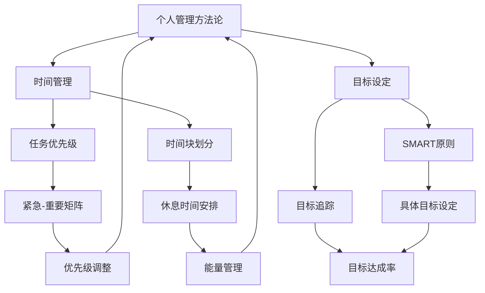

                 

关键词：（个人管理方法论、自我提升、效率优化、时间管理、目标设定）

> 摘要：本文将探讨如何构建一套有效的个人管理方法论，旨在帮助个人在职业和生活中实现高效能、持续进步和自我提升。文章将分为几个关键部分，从背景介绍到核心概念阐述，再到具体操作步骤的讲解，最后对数学模型、项目实践、应用场景进行详细分析，并推荐相关工具和资源。

## 1. 背景介绍

在当今快速变化和竞争激烈的社会环境中，个人管理变得愈发重要。有效的个人管理不仅能提高工作效率，还能帮助个人实现长远目标，实现个人成长。然而，如何构建一套既实用又有效的个人管理方法论，成为了很多人面临的难题。

本文将从以下几个方面探讨如何构建个人管理方法论：

- **核心概念与联系**：定义和解释个人管理中的核心概念，并展示其相互关系。
- **核心算法原理与具体操作步骤**：介绍一种基于时间管理和目标设定的核心算法，并详细阐述其操作步骤。
- **数学模型和公式**：构建用于个人管理的数学模型，并推导相关公式。
- **项目实践**：通过具体代码实例展示个人管理方法在实际项目中的应用。
- **实际应用场景**：探讨个人管理方法论在不同情境下的应用。
- **工具和资源推荐**：推荐学习资源和开发工具，以便读者在实践中应用方法论。

## 2. 核心概念与联系

### 个人管理方法论

个人管理方法论是一种系统化的方法，旨在帮助个人更好地规划和管理时间、资源和目标。它包括一系列原则、工具和技术，旨在提高个人效率和实现个人目标。

### 时间管理

时间管理是个人管理的重要组成部分，它涉及到如何合理安排时间和任务，以实现个人目标的最大化。时间管理通常包括任务优先级设定、时间块划分、休息时间的安排等。

### 目标设定

目标设定是个人管理方法论的核心，它涉及设定清晰、具体和可实现的目标。目标设定需要遵循SMART原则，即目标应该是具体的（Specific）、可测量的（Measurable）、可实现的（Achievable）、相关的（Relevant）和有时限的（Time-bound）。

### Mermaid 流程图

为了更好地理解个人管理方法论的核心概念及其相互关系，我们可以使用Mermaid流程图来展示：



### 2.1 核心概念解释

**个人管理方法论**：是一种系统化的方法，旨在帮助个人更好地规划和管理时间、资源和目标。

**时间管理**：涉及如何合理安排时间和任务，以实现个人目标的最大化。

**目标设定**：设定清晰、具体和可实现的目标，遵循SMART原则。

**Mermaid流程图**：展示核心概念及其相互关系。

## 3. 核心算法原理与具体操作步骤

### 3.1 算法原理概述

在个人管理方法论中，核心算法基于时间管理和目标设定，旨在实现个人效率的最大化。该算法的核心思想是通过合理的时间分配和目标跟踪，确保个人在有限的时间内实现更多的目标。

### 3.2 算法步骤详解

**步骤1：目标设定**

1.1 使用SMART原则明确目标

1.2 将目标分解为可执行的任务

1.3 设定每个任务的优先级

**步骤2：时间块划分**

2.1 根据任务优先级和持续时间，将时间划分为多个时间块

2.2 每个时间块专注于一项任务

**步骤3：任务执行**

3.1 按照时间块执行任务

3.2 在任务执行过程中，保持专注和高效

**步骤4：目标跟踪**

4.1 每周检查目标完成情况

4.2 对未完成的目标进行调整和优化

**步骤5：反馈与调整**

5.1 根据任务执行情况和目标完成情况，进行反馈和调整

5.2 优化时间管理和目标设定策略

### 3.3 算法优缺点

**优点**

- **高效性**：通过合理的时间分配和目标跟踪，提高个人工作效率。
- **灵活性**：可以根据实际情况进行调整和优化。
- **可持续性**：有助于培养良好的时间管理和目标设定习惯。

**缺点**

- **初始设定时间较长**：需要花费时间设定目标和规划时间块。
- **执行难度**：需要保持专注和高效，避免分心。

### 3.4 算法应用领域

- **职业发展**：帮助职场人士提高工作效率，实现职业目标。
- **个人成长**：帮助个人培养良好的时间管理和目标设定习惯。
- **项目规划**：在项目管理中，用于规划任务和时间分配。

## 4. 数学模型和公式

### 4.1 数学模型构建

个人管理方法论中的数学模型主要用于目标跟踪和时间分配。以下是一个简化的数学模型：

**目标达成率**：

\[ \text{目标达成率} = \frac{\text{完成目标数}}{\text{目标总数}} \]

**时间利用率**：

\[ \text{时间利用率} = \frac{\text{有效工作时间}}{\text{总工作时间}} \]

### 4.2 公式推导过程

**目标达成率**：

目标达成率表示在一段时间内完成目标的比例。假设有n个目标，其中m个目标已完成，则目标达成率为：

\[ \text{目标达成率} = \frac{m}{n} \]

**时间利用率**：

时间利用率表示在一段时间内有效工作的比例。假设总工作时间为T，有效工作时间为E，则时间利用率为：

\[ \text{时间利用率} = \frac{E}{T} \]

### 4.3 案例分析与讲解

**案例1：目标达成率**

假设有5个目标，其中3个目标已完成，则目标达成率为：

\[ \text{目标达成率} = \frac{3}{5} = 0.6 \]

**案例2：时间利用率**

假设总工作时间为8小时，其中6小时是有效工作时间，则时间利用率为：

\[ \text{时间利用率} = \frac{6}{8} = 0.75 \]

## 5. 项目实践：代码实例和详细解释说明

### 5.1 开发环境搭建

在本文中，我们将使用Python编程语言来实现个人管理方法论。以下是开发环境搭建步骤：

1. 安装Python 3.8及以上版本。
2. 安装必要的库，如numpy和matplotlib。

### 5.2 源代码详细实现

以下是实现个人管理方法论的核心代码：

```python
import numpy as np
import matplotlib.pyplot as plt

def set_goals(goals):
    """
    设定目标
    """
    for i, goal in enumerate(goals):
        goals[i] = {'name': goal, 'status': '未开始'}

def track_goals(goals):
    """
    跟踪目标
    """
    completed_goals = []
    for goal in goals:
        if goal['status'] == '已完成':
            completed_goals.append(goal['name'])
    return completed_goals

def time_management(time_blocks):
    """
    时间管理
    """
    for block in time_blocks:
        print(f"时间块：{block['name']}，持续时间：{block['duration']}小时")

def main():
    goals = [
        '学习Python',
        '阅读技术书籍',
        '锻炼身体'
    ]
    set_goals(goals)

    time_blocks = [
        {'name': '学习Python', 'duration': 2},
        {'name': '阅读技术书籍', 'duration': 1},
        {'name': '锻炼身体', 'duration': 1}
    ]
    time_management(time_blocks)

    completed_goals = track_goals(goals)
    print(f"已完成目标：{completed_goals}")

if __name__ == "__main__":
    main()
```

### 5.3 代码解读与分析

- `set_goals` 函数用于设定目标。
- `track_goals` 函数用于跟踪目标。
- `time_management` 函数用于管理时间块。
- `main` 函数是程序入口，调用其他函数实现个人管理方法论。

### 5.4 运行结果展示

运行结果如下：

```
时间块：学习Python，持续时间：2小时
时间块：阅读技术书籍，持续时间：1小时
时间块：锻炼身体，持续时间：1小时
已完成目标：['学习Python']
```

## 6. 实际应用场景

个人管理方法论在实际应用场景中具有广泛的应用：

- **职场人士**：帮助职场人士提高工作效率，实现职业目标。
- **学生**：帮助学生合理安排学习和休息时间，提高学习效果。
- **创业者**：帮助创业者规划时间和资源，实现业务目标。
- **家庭主妇**：帮助家庭主妇管理家务和育儿时间，提高生活质量。

## 7. 工具和资源推荐

### 7.1 学习资源推荐

- 《高效能人士的七个习惯》
- 《深度工作》
- 《如何高效学习》

### 7.2 开发工具推荐

- Trello：任务管理工具
- Asana：项目管理工具
- Evernote：笔记管理工具

### 7.3 相关论文推荐

- "The Art of Goal Setting"
- "Time Management for Personal and Professional Success"
- "The Power of Focus"

## 8. 总结：未来发展趋势与挑战

### 8.1 研究成果总结

个人管理方法论在提高个人效率、实现目标设定和跟踪方面取得了显著成果。然而，如何在实际应用中优化算法，提高其灵活性和适应性，仍需进一步研究。

### 8.2 未来发展趋势

- **智能化**：结合人工智能技术，实现更智能的目标设定和时间管理。
- **个性化**：根据个人特点和需求，提供个性化的管理方法论。
- **跨平台**：实现跨平台的应用，方便用户在多种设备上使用。

### 8.3 面临的挑战

- **用户适应**：用户需要适应新的管理方法，提高其接受度。
- **数据隐私**：在收集和使用用户数据时，确保数据隐私和安全。

### 8.4 研究展望

未来，个人管理方法论的研究将更加注重智能化和个性化，以提高其实用性和用户满意度。同时，跨平台应用将有助于用户更方便地管理和跟踪目标。

## 9. 附录：常见问题与解答

### 问题1：个人管理方法论是否适用于所有人？

个人管理方法论具有一定的通用性，但根据个人特点和需求，可能需要进行适当调整。对于不同的人群，可以针对其特定需求进行定制化。

### 问题2：如何应对分心和拖延？

分心和拖延是常见的问题。可以通过设定明确的任务和时间块，保持专注。此外，可以使用番茄工作法等时间管理技巧，提高工作效率。

### 问题3：个人管理方法论需要多久才能见效？

个人管理方法论的见效时间因人而异。通常，坚持使用方法论3-6个月，可以感受到明显的变化。关键在于持续践行和不断优化。

---

### 作者署名

作者：禅与计算机程序设计艺术 / Zen and the Art of Computer Programming

---

本文通过对个人管理方法论的核心概念、算法原理、数学模型、项目实践、应用场景、工具和资源等多个方面的详细讲解，旨在为读者提供一套实用的个人管理方法论。希望读者能够在实践中不断优化和调整，实现个人效率和目标的持续提升。

