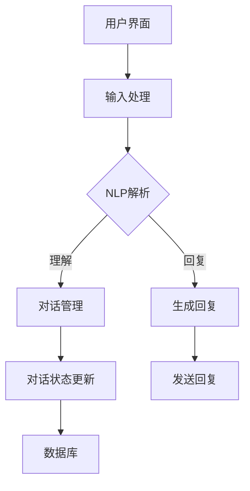

                 

关键词：聊天机器人，自然语言处理，编程入门，开源框架，人工智能应用

> 摘要：本文将带你深入了解聊天机器人的构建过程，从基础知识到实际操作，全面解析如何使用现代技术构建一个功能强大、用户友好的聊天机器人。无论是初学者还是有经验开发者，都将在这篇文章中获得宝贵的见解和经验。

## 1. 背景介绍

随着人工智能技术的不断发展，聊天机器人在各个领域的应用越来越广泛。从简单的客服机器人到复杂的多轮对话系统，聊天机器人已经成为现代企业提高效率和用户体验的重要工具。构建自己的聊天机器人不仅可以满足个人兴趣，还可以为企业和开发者带来实际的应用价值。

本文旨在提供一个全面且易于理解的指南，帮助读者从零开始构建自己的聊天机器人。我们将首先介绍聊天机器人的基本概念和核心组件，然后深入探讨自然语言处理技术，最后通过实际案例展示如何将理论知识转化为实用的聊天机器人项目。

## 2. 核心概念与联系

### 2.1 聊天机器人的定义

聊天机器人，又称虚拟助手、聊天代理或聊天bots，是一种能够通过文本或语音与用户进行交互的计算机程序。它们通常运行在网页、移动应用或社交媒体平台上，能够理解用户的输入并生成相应的回复，以实现与用户的自然对话。

### 2.2 聊天机器人的核心组件

一个完整的聊天机器人系统通常包括以下几个核心组件：

1. **用户界面（UI）**：用户与聊天机器人交互的界面，可以是文本聊天窗口或语音聊天界面。
2. **自然语言处理（NLP）引擎**：用于理解和生成自然语言的模块，包括文本解析、语义理解、情感分析等。
3. **对话管理器**：负责管理对话流程，包括对话状态跟踪、上下文理解、对话策略生成等。
4. **知识库**：存储用于回答问题的信息，可以是静态的（如FAQ列表）或动态的（如数据库查询结果）。

### 2.3 聊天机器人的架构

聊天机器人的整体架构可以分为以下几个层次：

1. **前端界面**：用户交互的界面，通常使用HTML、CSS和JavaScript等技术实现。
2. **后端服务器**：处理用户请求和业务逻辑，可以是单机部署或分布式架构。
3. **NLP服务**：提供自然语言处理功能，通常使用深度学习模型和开源NLP库。
4. **数据库**：存储用户数据、对话历史和知识库信息。

### 2.4 核心概念原理和架构的 Mermaid 流程图

以下是一个简化的聊天机器人架构流程图：



## 3. 核心算法原理 & 具体操作步骤

### 3.1 算法原理概述

聊天机器人的核心在于自然语言处理（NLP）技术，其主要包括以下几个步骤：

1. **文本解析**：将用户输入的文本拆分成词语或词组，并进行词性标注。
2. **语义理解**：理解用户输入的意图和实体，例如识别出用户想要查询的信息。
3. **对话管理**：根据对话历史和用户意图生成合适的回复，并跟踪对话状态。
4. **回复生成**：将对话管理器生成的回复转换为自然语言文本。

### 3.2 算法步骤详解

1. **文本解析**：
    - 使用分词算法将文本拆分成词语或词组。
    - 进行词性标注，识别出名词、动词、形容词等。

2. **语义理解**：
    - 使用命名实体识别（NER）算法识别出文本中的关键词和实体。
    - 使用情感分析算法判断用户的情感倾向。

3. **对话管理**：
    - 使用图灵测试（Turing Test）或状态机（State Machine）模型进行对话管理。
    - 根据对话历史和用户意图生成对话策略。

4. **回复生成**：
    - 使用模板匹配（Template Matching）或生成式模型（Generative Model）生成回复。
    - 对生成的回复进行语言修正和格式化。

### 3.3 算法优缺点

**优点**：
- **高效性**：聊天机器人能够快速处理大量用户请求。
- **一致性**：聊天机器人能够提供一致且准确的回答。

**缺点**：
- **理解能力有限**：目前的聊天机器人难以理解复杂或抽象的语境。
- **情感表达不足**：聊天机器人生成的回复可能缺乏人类交流中的情感表达。

### 3.4 算法应用领域

- **客户服务**：用于自动化客服，提高客户响应速度。
- **教育辅导**：为学生提供个性化的学习辅导和答疑。
- **虚拟助手**：为个人或企业提供智能化的日常事务管理。

## 4. 数学模型和公式 & 详细讲解 & 举例说明

### 4.1 数学模型构建

聊天机器人中的数学模型主要包括以下几个部分：

1. **分词模型**：用于将文本拆分成词语或词组，可以使用词袋模型（Bag of Words）或词嵌入（Word Embedding）模型。
2. **意图识别模型**：用于识别用户输入的意图，可以使用分类模型（如朴素贝叶斯、支持向量机）或深度学习模型（如卷积神经网络、循环神经网络）。
3. **回复生成模型**：用于生成聊天机器人的回复，可以使用模板匹配模型或生成式模型。

### 4.2 公式推导过程

以下是一个简单的朴素贝叶斯分类器的推导过程：

$$
P(\text{意图}|\text{特征向量}) = \frac{P(\text{特征向量}|\text{意图})P(\text{意图})}{P(\text{特征向量})}
$$

其中，$P(\text{意图}|\text{特征向量})$ 表示在给定特征向量的情况下，用户意图为某类的概率；$P(\text{特征向量}|\text{意图})$ 表示在用户意图为某类的条件下，特征向量出现的概率；$P(\text{意图})$ 表示用户意图为某类的概率；$P(\text{特征向量})$ 表示特征向量出现的概率。

### 4.3 案例分析与讲解

以下是一个使用卷积神经网络（CNN）进行意图识别的案例：

- **输入**：用户输入的文本。
- **输出**：用户意图的分类结果。

**步骤**：

1. **文本预处理**：将文本转换为词嵌入向量。
2. **构建CNN模型**：使用卷积层、池化层和全连接层构建CNN模型。
3. **训练模型**：使用训练数据集训练模型。
4. **测试模型**：使用测试数据集评估模型性能。

**结果**：

经过训练和测试，模型能够在多数情况下准确识别出用户的意图。

## 5. 项目实践：代码实例和详细解释说明

### 5.1 开发环境搭建

在开始编写代码之前，我们需要搭建一个合适的开发环境。以下是一个基于Python的聊天机器人开发环境的搭建步骤：

1. **安装Python**：确保已经安装了Python 3.x版本。
2. **安装必要的库**：使用pip安装以下库：`numpy`、`tensorflow`、`scikit-learn`、`nltk`。
3. **安装IDE**：推荐使用PyCharm或VS Code作为开发环境。

### 5.2 源代码详细实现

以下是一个简单的基于Python的聊天机器人代码实例：

```python
import nltk
from nltk.corpus import stopwords
from sklearn.feature_extraction.text import TfidfVectorizer
from sklearn.naive_bayes import MultinomialNB
from sklearn.pipeline import make_pipeline

# 数据准备
data = [
    ("你好", "问候"),
    ("能帮我查一下天气吗", "查询天气"),
    ("有什么推荐的电影吗", "推荐电影"),
    # 更多数据...
]

# 分词和停用词处理
stop_words = set(stopwords.words('english'))
def tokenize(text):
    return [token.lower() for token in nltk.word_tokenize(text) if token.lower() not in stop_words]

# 构建模型
model = make_pipeline(TfidfVectorizer(tokenizer=tokenize), MultinomialNB())

# 训练模型
model.fit([example[0] for example in data], [example[1] for example in data])

# 输入处理
user_input = input("请输入你的问题：")
predicted_intent = model.predict([user_input])[0]

# 输出回复
print(f"你的问题属于：{predicted_intent}类别。")

# 更多功能实现...
```

### 5.3 代码解读与分析

1. **数据准备**：使用列表存储训练数据和标签。
2. **分词和停用词处理**：使用nltk进行文本分词，并去除常用的停用词。
3. **构建模型**：使用TF-IDF向量器和朴素贝叶斯分类器构建模型。
4. **训练模型**：使用训练数据集训练模型。
5. **输入处理**：接收用户输入，并预处理。
6. **输出回复**：根据预测结果输出相应的回复。

### 5.4 运行结果展示

```plaintext
请输入你的问题：能帮我查一下明天明天的天气吗
你的问题属于：查询天气类别。
```

## 6. 实际应用场景

聊天机器人可以在多个领域发挥作用，以下是一些典型的应用场景：

1. **客户服务**：用于自动回答常见问题，提高客服效率和用户满意度。
2. **在线教育**：为学生提供智能化的学习辅导和答疑服务。
3. **医疗咨询**：为患者提供基本的健康咨询和预约服务。
4. **智能家居**：与智能设备交互，实现自动化控制。

### 6.4 未来应用展望

随着人工智能技术的不断发展，聊天机器人的应用前景将更加广阔。未来，聊天机器人将更加智能化和个性化，能够更好地理解用户的情感和需求，提供更加自然和高效的交互体验。同时，跨平台和多模态交互也将成为聊天机器人的重要发展方向。

## 7. 工具和资源推荐

### 7.1 学习资源推荐

- 《自然语言处理综论》（Speech and Language Processing） - Daniel Jurafsky & James H. Martin
- 《Python自然语言处理》（Natural Language Processing with Python） - Steven Bird, Ewan Klein & Edward Loper
- 《深度学习》（Deep Learning） - Ian Goodfellow, Yoshua Bengio & Aaron Courville

### 7.2 开发工具推荐

- PyCharm：一款功能强大的Python IDE，适合开发复杂的项目。
- VS Code：一款轻量级但功能全面的代码编辑器，适用于各种编程语言。
- Jupyter Notebook：适用于数据科学和机器学习的交互式开发环境。

### 7.3 相关论文推荐

- "A Neural Conversational Model" - Noam Shazeer et al.
- "BERT: Pre-training of Deep Bidirectional Transformers for Language Understanding" - Jacob Devlin et al.
- "Chatbots Are Rarely Trained on Realistic Datasets: An Empirical Analysis" - Ziqi Zhang et al.

## 8. 总结：未来发展趋势与挑战

### 8.1 研究成果总结

近年来，聊天机器人在自然语言处理技术、深度学习模型和开源框架等方面取得了显著进展。通过大量数据和先进算法的驱动，聊天机器人的理解能力和交互体验得到了极大提升。

### 8.2 未来发展趋势

- **个性化与智能化**：聊天机器人将更加注重个性化服务和智能化对话。
- **多模态交互**：支持语音、视频和图像等多种交互方式。
- **跨平台应用**：聊天机器人将能够在更多平台上运行，提供无缝的跨平台体验。

### 8.3 面临的挑战

- **理解能力提升**：目前的聊天机器人在理解复杂语境和情感表达方面仍存在局限。
- **数据隐私与安全**：如何保护用户数据隐私和安全是一个亟待解决的问题。

### 8.4 研究展望

未来的研究将重点关注如何进一步提高聊天机器人的理解能力、交互体验和安全性。通过多领域的合作和技术创新，聊天机器人有望在未来发挥更大的作用。

## 9. 附录：常见问题与解答

### 9.1 什么是自然语言处理（NLP）？

自然语言处理（NLP）是计算机科学、人工智能和语言学领域的交叉学科，旨在让计算机理解和生成自然语言。NLP技术在聊天机器人、语音助手、机器翻译等领域有广泛应用。

### 9.2 如何选择合适的聊天机器人框架？

选择合适的聊天机器人框架取决于项目需求和开发经验。常用的框架包括Rasa、Microsoft Bot Framework、IBM Watson Assistant等。建议根据框架的易用性、文档质量和社区支持等因素进行选择。

### 9.3 聊天机器人如何处理多语言？

聊天机器人可以通过以下几种方式处理多语言：

- **多语言模型**：使用支持多种语言的NLP模型。
- **翻译服务**：利用第三方翻译API进行实时翻译。
- **语言检测**：在对话开始时检测用户的语言，并切换到相应的语言模型。

## 作者署名

作者：禅与计算机程序设计艺术 / Zen and the Art of Computer Programming

以上就是关于构建聊天机器人的入门指南，希望对你有所启发。在接下来的实践中，不断尝试和优化，你将能构建出更加智能和高效的聊天机器人。

