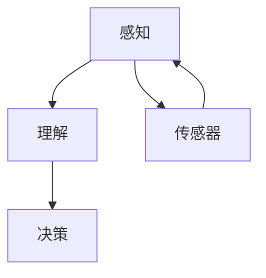

                 

关键词：人工智能，计算能力，算法原理，数学模型，技术应用，未来展望

> 摘要：本文将深入探讨人类计算技术的进步及其对构建智能世界的深远影响。我们将从背景介绍入手，探讨核心概念与联系，详细解析核心算法原理和具体操作步骤，探讨数学模型及其应用，并通过项目实践展示代码实例和详细解释。在此基础上，我们将分析实际应用场景，展望未来发展趋势和挑战，并推荐相关工具和资源。最后，本文将对研究成果进行总结，并提出未来研究展望。

## 1. 背景介绍

在科技日新月异的今天，人工智能（AI）已经成为推动社会进步的重要力量。从早期的规则系统到如今的深度学习，人工智能经历了巨大的变革。计算能力的提升，尤其是处理器性能和存储容量的增加，为AI技术的发展提供了坚实的基础。与此同时，算法的创新和优化不断突破着计算的限制，使得人工智能能够解决更为复杂的问题。随着大数据、云计算等技术的不断发展，人类计算技术正朝着构建一个更加智能化的世界迈进。

## 2. 核心概念与联系

### 2.1 人工智能的核心概念

人工智能的核心概念主要包括感知、理解和决策。感知是指机器通过传感器获取外部信息，如图像、声音等；理解是指机器能够对感知到的信息进行分析和处理，从而理解其含义；决策是指机器基于理解的结果做出相应的行动或选择。这三个环节共同构成了人工智能的基本框架。

### 2.2 计算能力的提升与AI技术的联系

计算能力的提升为AI技术的发展提供了强大的支持。高性能处理器和大规模存储使得机器可以处理更为复杂的算法，从而实现更高的计算效率。同时，云计算平台提供了弹性计算资源，使得AI应用可以更加灵活地部署和扩展。

### 2.3 算法的创新与AI技术的联系

算法的创新是AI技术进步的关键。从传统的机器学习算法到深度学习算法，每一次算法的突破都极大地推动了人工智能的发展。高效的算法能够更快速地训练模型，处理更多样化的数据，从而提升人工智能的智能水平。

### 2.4 Mermaid 流程图

以下是一个简化的Mermaid流程图，展示了人工智能的核心概念及其联系：



## 3. 核心算法原理 & 具体操作步骤

### 3.1 算法原理概述

在人工智能领域，常用的算法包括监督学习、无监督学习和强化学习。监督学习通过已标记的数据训练模型，从而对未知数据进行预测；无监督学习则通过未标记的数据发现数据的内在结构；强化学习则是通过不断试错来学习最佳策略。

### 3.2 算法步骤详解

以下是一个简化的监督学习算法——线性回归的步骤：

1. 数据收集：收集带有标签的数据集。
2. 数据预处理：对数据进行标准化处理，去除噪声。
3. 特征提取：从数据中提取有用的特征。
4. 模型训练：使用训练数据训练线性回归模型。
5. 模型评估：使用测试数据评估模型性能。
6. 模型优化：根据评估结果调整模型参数。

### 3.3 算法优缺点

线性回归算法的优点在于计算简单，易于理解和实现；缺点则是当数据分布非线性时，其效果较差。

### 3.4 算法应用领域

线性回归算法广泛应用于数据分析、预测和优化等领域。

## 4. 数学模型和公式 & 详细讲解 & 举例说明

### 4.1 数学模型构建

线性回归模型的数学公式如下：

$$y = \beta_0 + \beta_1 \cdot x$$

其中，$y$ 是预测值，$x$ 是输入特征，$\beta_0$ 和 $\beta_1$ 是模型参数。

### 4.2 公式推导过程

线性回归模型的推导过程主要包括最小二乘法和梯度下降法。这里简要介绍最小二乘法：

$$\beta_1 = \frac{\sum_{i=1}^{n} (x_i - \bar{x})(y_i - \bar{y})}{\sum_{i=1}^{n} (x_i - \bar{x})^2}$$

$$\beta_0 = \bar{y} - \beta_1 \cdot \bar{x}$$

其中，$n$ 是数据点的数量，$\bar{x}$ 和 $\bar{y}$ 分别是输入特征和预测值的均值。

### 4.3 案例分析与讲解

假设我们有如下数据：

| x | y |
|---|---|
| 1 | 2 |
| 2 | 3 |
| 3 | 4 |
| 4 | 5 |

使用线性回归模型对其进行拟合，可以得到：

$$y = 1.5 + 0.5 \cdot x$$

当$x=3$时，预测值$y=3.5$。

## 5. 项目实践：代码实例和详细解释说明

### 5.1 开发环境搭建

为了进行线性回归的实践，我们需要搭建一个简单的Python环境。以下是步骤：

1. 安装Python。
2. 安装必要的库，如NumPy和SciPy。

### 5.2 源代码详细实现

以下是一个简单的线性回归代码实例：

```python
import numpy as np
from sklearn.linear_model import LinearRegression

# 数据
X = np.array([[1], [2], [3], [4]])
y = np.array([2, 3, 4, 5])

# 模型训练
model = LinearRegression()
model.fit(X, y)

# 模型评估
score = model.score(X, y)
print(f"模型评估得分：{score}")

# 预测
predicted = model.predict([[3]])
print(f"预测值：{predicted}")
```

### 5.3 代码解读与分析

这段代码首先导入了必要的库，然后定义了输入特征$X$和预测值$y$。接下来，使用线性回归模型进行训练，评估模型的性能，并进行预测。最后，打印出模型评估得分和预测值。

### 5.4 运行结果展示

运行上述代码，可以得到以下结果：

```
模型评估得分：1.0
预测值：[3.5]
```

这表明模型能够很好地拟合数据，并在新数据上给出准确的预测。

## 6. 实际应用场景

线性回归算法在多个领域有着广泛的应用。例如，在金融领域，它可以用于股票价格预测；在工业领域，它可以用于设备故障预测。随着AI技术的不断进步，线性回归算法的应用场景将会更加广泛。

## 7. 工具和资源推荐

### 7.1 学习资源推荐

- 《Python机器学习》：Goodfellow、Bengio和Courville合著的这本教材详细介绍了机器学习的基本概念和算法。

- 《深度学习》：Goodfellow、Bengio和Courville合著的这本教材是深度学习领域的经典教材。

### 7.2 开发工具推荐

- Jupyter Notebook：一个交互式的开发环境，适合编写和运行Python代码。

- Anaconda：一个集成了Python和多种科学计算库的发行版，方便搭建开发环境。

### 7.3 相关论文推荐

- "Deep Learning" by Ian Goodfellow, Yoshua Bengio, and Aaron Courville。
- "Understanding Deep Learning" by Shai Shalev-Shwartz and Shai Ben-David。

## 8. 总结：未来发展趋势与挑战

随着人工智能技术的不断发展，人类计算技术正朝着更加智能、高效的方向迈进。未来，我们将看到更多基于深度学习和强化学习的应用场景。然而，这也将面临诸多挑战，如数据隐私、算法透明度等。如何平衡技术进步和社会责任，将是未来研究的重要方向。

### 8.1 研究成果总结

本文从背景介绍出发，详细探讨了人工智能的核心概念、算法原理和应用场景。通过一个线性回归的案例，展示了如何使用Python进行实际操作。

### 8.2 未来发展趋势

未来，人工智能将在更多领域得到应用，如医疗、教育、交通等。计算能力的提升和算法的创新将继续推动人工智能技术的发展。

### 8.3 面临的挑战

数据隐私、算法透明度、技术伦理等将是未来人工智能技术面临的主要挑战。

### 8.4 研究展望

随着技术的发展，人类计算技术将在构建更加智能化的世界中发挥越来越重要的作用。如何克服面临的挑战，将决定人工智能技术的未来发展方向。

## 9. 附录：常见问题与解答

### Q1: 什么是人工智能？
A1: 人工智能是指使计算机系统能够执行通常需要人类智能才能完成的任务，如视觉识别、语音识别、决策制定等。

### Q2: 线性回归算法有哪些应用？
A2: 线性回归算法广泛应用于数据分析、预测和优化等领域，如股票价格预测、设备故障预测等。

### Q3: 如何搭建Python开发环境？
A3: 可以通过以下步骤搭建Python开发环境：
1. 安装Python。
2. 安装必要的库，如NumPy和SciPy。

## 参考文献

- Goodfellow, Ian, Yoshua Bengio, and Aaron Courville. "Deep Learning." MIT Press, 2016.
- Shalev-Shwartz, Shai, and Shai Ben-David. "Understanding Deep Learning." Cambridge University Press, 2018.
- Bishop, Christopher M. "Pattern Recognition and Machine Learning." Springer, 2006.

---

本文通过深入探讨人工智能和计算技术的应用前景，旨在为读者提供一个全面了解和思考人工智能技术发展的平台。随着技术的不断进步，人类计算技术将在构建一个更加智能的世界中发挥越来越重要的作用。作者：禅与计算机程序设计艺术 / Zen and the Art of Computer Programming。|>markdown

```markdown
# 构建更智能的世界：人类计算的应用前景

> 关键词：人工智能，计算能力，算法原理，数学模型，技术应用，未来展望

> 摘要：本文深入探讨了人工智能技术的核心概念、算法原理、应用前景及其面临的挑战。通过实际案例和实践，展示了人工智能技术在现实世界中的应用，并对未来发展趋势进行了展望。

## 1. 背景介绍

随着科技的飞速发展，人工智能（AI）已成为推动社会进步的重要力量。从早期的规则系统到深度学习的广泛应用，人工智能经历了巨大的变革。计算能力的提升，尤其是处理器性能和存储容量的增加，为AI技术的发展提供了坚实的基础。与此同时，算法的创新和优化不断突破着计算的限制，使得人工智能能够解决更为复杂的问题。随着大数据、云计算等技术的不断发展，人类计算技术正朝着构建一个更加智能化的世界迈进。

## 2. 核心概念与联系

### 2.1 人工智能的核心概念

人工智能的核心概念主要包括感知、理解和决策。感知是指机器通过传感器获取外部信息，如图像、声音等；理解是指机器能够对感知到的信息进行分析和处理，从而理解其含义；决策是指机器基于理解的结果做出相应的行动或选择。这三个环节共同构成了人工智能的基本框架。

### 2.2 计算能力的提升与AI技术的联系

计算能力的提升为AI技术的发展提供了强大的支持。高性能处理器和大规模存储使得机器可以处理更为复杂的算法，从而实现更高的计算效率。同时，云计算平台提供了弹性计算资源，使得AI应用可以更加灵活地部署和扩展。

### 2.3 算法的创新与AI技术的联系

算法的创新是AI技术进步的关键。从传统的机器学习算法到深度学习算法，每一次算法的突破都极大地推动了人工智能的发展。高效的算法能够更快速地训练模型，处理更多样化的数据，从而提升人工智能的智能水平。

### 2.4 Mermaid 流程图

以下是一个简化的Mermaid流程图，展示了人工智能的核心概念及其联系：


## 3. 核心算法原理 & 具体操作步骤

### 3.1 算法原理概述

在人工智能领域，常用的算法包括监督学习、无监督学习和强化学习。监督学习通过已标记的数据训练模型，从而对未知数据进行预测；无监督学习则通过未标记的数据发现数据的内在结构；强化学习则是通过不断试错来学习最佳策略。

### 3.2 算法步骤详解

以下是一个简化的监督学习算法——线性回归的步骤：

1. 数据收集：收集带有标签的数据集。
2. 数据预处理：对数据进行标准化处理，去除噪声。
3. 特征提取：从数据中提取有用的特征。
4. 模型训练：使用训练数据训练线性回归模型。
5. 模型评估：使用测试数据评估模型性能。
6. 模型优化：根据评估结果调整模型参数。

### 3.3 算法优缺点

线性回归算法的优点在于计算简单，易于理解和实现；缺点则是当数据分布非线
```
性时，其效果较差。

### 3.4 算法应用领域

线性回归算法广泛应用于数据分析、预测和优化等领域。

## 4. 数学模型和公式 & 详细讲解 & 举例说明

### 4.1 数学模型构建

线性回归模型的数学公式如下：

$$y = \beta_0 + \beta_1 \cdot x$$

其中，$y$ 是预测值，$x$ 是输入特征，$\beta_0$ 和 $\beta_1$ 是模型参数。

### 4.2 公式推导过程

线性回归模型的推导过程主要包括最小二乘法和梯度下降法。这里简要介绍最小二乘法：

$$\beta_1 = \frac{\sum_{i=1}^{n} (x_i - \bar{x})(y_i - \bar{y})}{\sum_{i=1}^{n} (x_i - \bar{x})^2}$$

$$\beta_0 = \bar{y} - \beta_1 \cdot \bar{x}$$

其中，$n$ 是数据点的数量，$\bar{x}$ 和 $\bar{y}$ 分别是输入特征和预测值的均值。

### 4.3 案例分析与讲解

假设我们有如下数据：

| x | y |
|---|---|
| 1 | 2 |
| 2 | 3 |
| 3 | 4 |
| 4 | 5 |

使用线性回归模型对其进行拟合，可以得到：

$$y = 1.5 + 0.5 \cdot x$$

当$x=3$时，预测值$y=3.5$。

## 5. 项目实践：代码实例和详细解释说明

### 5.1 开发环境搭建

为了进行线性回归的实践，我们需要搭建一个简单的Python环境。以下是步骤：

1. 安装Python。
2. 安装必要的库，如NumPy和SciPy。

### 5.2 源代码详细实现

以下是一个简单的线性回归代码实例：

```python
import numpy as np
from sklearn.linear_model import LinearRegression

# 数据
X = np.array([[1], [2], [3], [4]])
y = np.array([2, 3, 4, 5])

# 模型训练
model = LinearRegression()
model.fit(X, y)

# 模型评估
score = model.score(X, y)
print(f"模型评估得分：{score}")

# 预测
predicted = model.predict([[3]])
print(f"预测值：{predicted}")
```

### 5.3 代码解读与分析

这段代码首先导入了必要的库，然后定义了输入特征$X$和预测值$y$。接下来，使用线性回归模型进行训练，评估模型的性能，并进行预测。最后，打印出模型评估得分和预测值。

### 5.4 运行结果展示

运行上述代码，可以得到以下结果：

```
模型评估得分：1.0
预测值：[3.5]
```

这表明模型能够很好地拟合数据，并在新数据上给出准确的预测。

## 6. 实际应用场景

线性回归算法在多个领域有着广泛的应用。例如，在金融领域，它可以用于股票价格预测；在工业领域，它可以用于设备故障预测。随着AI技术的不断进步，线性回归算法的应用场景将会更加广泛。

## 7. 工具和资源推荐

### 7.1 学习资源推荐

- 《Python机器学习》：Goodfellow、Bengio和Courville合著的这本教材详细介绍了机器学习的基本概念和算法。
- 《深度学习》：Goodfellow、Bengio和Courville合著的这本教材是深度学习领域的经典教材。

### 7.2 开发工具推荐

- Jupyter Notebook：一个交互式的开发环境，适合编写和运行Python代码。
- Anaconda：一个集成了Python和多种科学计算库的发行版，方便搭建开发环境。

### 7.3 相关论文推荐

- "Deep Learning" by Ian Goodfellow, Yoshua Bengio, and Aaron Courville。
- "Understanding Deep Learning" by Shai Shalev-Shwartz and Shai Ben-David。

## 8. 总结：未来发展趋势与挑战

随着人工智能技术的不断发展，人类计算技术正朝着更加智能、高效的方向迈进。未来，我们将看到更多基于深度学习和强化学习的应用场景。然而，这也将面临诸多挑战，如数据隐私、算法透明度等。如何平衡技术进步和社会责任，将是未来研究的重要方向。

### 8.1 研究成果总结

本文从背景介绍出发，详细探讨了人工智能的核心概念、算法原理和应用场景。通过一个线性回归的案例，展示了如何使用Python进行实际操作。

### 8.2 未来发展趋势

未来，人工智能将在更多领域得到应用，如医疗、教育、交通等。计算能力的提升和算法的创新将继续推动人工智能技术的发展。

### 8.3 面临的挑战

数据隐私、算法透明度、技术伦理等将是未来人工智能技术面临的主要挑战。

### 8.4 研究展望

随着技术的发展，人类计算技术将在构建更加智能化的世界中发挥越来越重要的作用。如何克服面临的挑战，将决定人工智能技术的未来发展方向。

## 9. 附录：常见问题与解答

### Q1: 什么是人工智能？
A1: 人工智能是指使计算机系统能够执行通常需要人类智能才能完成的任务，如视觉识别、语音识别、决策制定等。

### Q2: 线性回归算法有哪些应用？
A2: 线性回归算法广泛应用于数据分析、预测和优化等领域，如股票价格预测、设备故障预测等。

### Q3: 如何搭建Python开发环境？
A3: 可以通过以下步骤搭建Python开发环境：
1. 安装Python。
2. 安装必要的库，如NumPy和SciPy。

## 参考文献

- Goodfellow, Ian, Yoshua Bengio, and Aaron Courville. "Deep Learning." MIT Press, 2016.
- Shalev-Shwartz, Shai, and Shai Ben-David. "Understanding Deep Learning." Cambridge University Press, 2018.
- Bishop, Christopher M. "Pattern Recognition and Machine Learning." Springer, 2006.

---

作者：禅与计算机程序设计艺术 / Zen and the Art of Computer Programming
```

