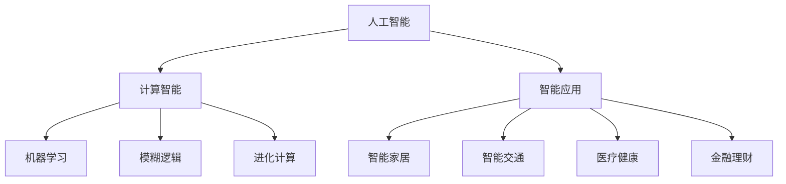

                 

关键词：人工智能，计算，智能应用，算法，数学模型，编程，未来趋势

> 摘要：本文将探讨人类计算在构建更智能世界中的应用场景。从核心概念和算法原理出发，通过数学模型和项目实践，分析其在各个领域的应用，展望未来的发展趋势与挑战。

## 1. 背景介绍

随着科技的飞速发展，人工智能已经成为当今世界最具颠覆性的技术之一。人类计算在人工智能中的应用，不仅推动了传统行业的变革，也为新兴产业的发展提供了新的动力。从计算机视觉到自然语言处理，从机器学习到深度学习，人类计算在各个领域都展现出了巨大的潜力。

本文旨在探讨人类计算在不同应用场景中的具体实现和作用。通过深入分析核心概念和算法原理，结合实际项目实践，揭示人类计算在构建更智能世界中的关键作用。同时，本文还将对未来的发展趋势和面临的挑战进行展望，为读者提供有价值的参考和启示。

## 2. 核心概念与联系

### 2.1 人工智能概述

人工智能（Artificial Intelligence，AI）是指使计算机具备人类智能特性的技术。其核心在于模拟人类思维过程，实现机器学习、知识表示、推理、规划等功能。人工智能的发展经历了多个阶段，从早期的符号主义、连接主义到现代的深度学习，不断突破技术瓶颈，取得了显著成果。

### 2.2 计算智能

计算智能（Computational Intelligence，CI）是指利用计算机技术模拟人类智能的智能系统。其主要包括机器学习、模糊逻辑、进化计算等方法。计算智能在人工智能领域发挥了重要作用，为解决复杂问题提供了有力支持。

### 2.3 智能应用

智能应用是指将人工智能技术应用于实际问题解决中的各种场景。从智能家居、智能交通到医疗健康、金融理财，智能应用正在深刻改变人们的生产和生活。

### 2.4 Mermaid 流程图

下面是人工智能核心概念与联系的一个简化 Mermaid 流程图：



## 3. 核心算法原理 & 具体操作步骤

### 3.1 算法原理概述

在构建更智能的世界中，核心算法起到了至关重要的作用。以下介绍几种常见的人工智能算法原理：

#### 3.1.1 机器学习

机器学习（Machine Learning，ML）是一种让计算机通过数据自动改进性能的技术。其主要原理是通过数据驱动，让计算机自动识别数据中的模式和规律，从而实现对未知数据的预测和分类。

#### 3.1.2 深度学习

深度学习（Deep Learning，DL）是机器学习的一个分支，通过多层神经网络模型模拟人类大脑的神经元连接结构，实现对复杂数据的建模和预测。深度学习在图像识别、语音识别等领域取得了显著成果。

#### 3.1.3 强化学习

强化学习（Reinforcement Learning，RL）是一种通过奖励机制来引导计算机自主学习的算法。其主要原理是计算机通过不断尝试和错误，逐步学会在特定环境中做出最优决策。

### 3.2 算法步骤详解

#### 3.2.1 机器学习

1. 数据采集：收集大量的数据，作为训练集和测试集。
2. 特征提取：对数据进行预处理，提取出有用的特征。
3. 模型选择：选择合适的机器学习模型，如线性回归、决策树、支持向量机等。
4. 模型训练：利用训练集数据，对模型进行训练。
5. 模型评估：利用测试集数据，评估模型的性能。

#### 3.2.2 深度学习

1. 数据预处理：对图像、文本等数据进行处理，转换为计算机可以处理的格式。
2. 网络结构设计：设计多层神经网络结构，如卷积神经网络（CNN）、循环神经网络（RNN）等。
3. 模型训练：利用训练集数据，对网络进行训练，优化网络参数。
4. 模型评估：利用测试集数据，评估网络性能。

#### 3.2.3 强化学习

1. 环境构建：构建一个模拟环境，让计算机在其中进行学习。
2. 策略选择：设计一个策略，用于指导计算机在环境中进行决策。
3. 奖励机制：定义奖励机制，激励计算机学会在环境中做出最优决策。
4. 学习过程：计算机在环境中不断尝试和错误，逐步优化策略。

### 3.3 算法优缺点

#### 3.3.1 机器学习

**优点：**
- 强大的一致性：机器学习模型可以处理各种类型的数据，具有广泛的应用领域。
- 自适应性：机器学习模型可以根据新数据不断优化自身性能。

**缺点：**
- 需要大量的数据：机器学习模型对数据的依赖性较高，需要大量的训练数据。
- 可解释性较低：机器学习模型往往缺乏可解释性，难以理解其决策过程。

#### 3.3.2 深度学习

**优点：**
- 高效的处理能力：深度学习模型可以处理大量的数据，具有强大的计算能力。
- 高准确性：深度学习模型在图像识别、语音识别等领域取得了很高的准确性。

**缺点：**
- 需要大量的计算资源：深度学习模型对计算资源的要求较高，需要大量的计算时间和计算资源。
- 网络结构复杂：深度学习模型的网络结构复杂，难以理解和解释。

#### 3.3.3 强化学习

**优点：**
- 可以处理动态环境：强化学习模型可以处理动态变化的复杂环境。
- 强适应能力：强化学习模型可以通过不断的尝试和错误，学会在复杂环境中做出最优决策。

**缺点：**
- 学习速度较慢：强化学习模型需要大量的时间和尝试才能学会在复杂环境中做出最优决策。
- 需要大量的数据：强化学习模型对数据的依赖性较高，需要大量的数据来训练。

### 3.4 算法应用领域

#### 3.4.1 机器学习

**应用领域：** 机器学习在金融、医疗、零售、物流等领域有广泛的应用，如风险控制、疾病诊断、个性化推荐、路径优化等。

**案例：** 在金融领域，机器学习可以用于风险评估、欺诈检测等；在医疗领域，机器学习可以用于疾病诊断、治疗方案推荐等。

#### 3.4.2 深度学习

**应用领域：** 深度学习在图像识别、语音识别、自然语言处理等领域有广泛的应用，如人脸识别、语音助手、机器翻译等。

**案例：** 在图像识别领域，深度学习可以用于图像分类、目标检测等；在语音识别领域，深度学习可以用于语音转文字、语音助手等。

#### 3.4.3 强化学习

**应用领域：** 强化学习在游戏、自动驾驶、机器人控制等领域有广泛的应用，如围棋、自动驾驶汽车、机器人导航等。

**案例：** 在游戏领域，强化学习可以用于游戏策略设计；在自动驾驶领域，强化学习可以用于路径规划、行为决策等。

## 4. 数学模型和公式 & 详细讲解 & 举例说明

### 4.1 数学模型构建

在人工智能领域，数学模型是算法的核心。以下介绍几种常见的数学模型及其构建方法：

#### 4.1.1 线性回归模型

线性回归模型是最简单的机器学习模型之一，其公式为：

$$ y = wx + b $$

其中，$y$ 为因变量，$x$ 为自变量，$w$ 为权重，$b$ 为偏置。

#### 4.1.2 卷积神经网络模型

卷积神经网络（CNN）是深度学习模型的一种，其公式为：

$$ output = f(\sigma(W \cdot x + b)) $$

其中，$output$ 为输出值，$f$ 为激活函数，$\sigma$ 为卷积操作，$W$ 为权重矩阵，$x$ 为输入数据，$b$ 为偏置。

#### 4.1.3 强化学习模型

强化学习模型的核心是奖励机制，其公式为：

$$ Q(s, a) = r + \gamma \max_{a'} Q(s', a') $$

其中，$Q(s, a)$ 为状态-动作值函数，$s$ 为状态，$a$ 为动作，$r$ 为立即奖励，$\gamma$ 为折扣因子，$s'$ 为下一个状态，$a'$ 为下一个动作。

### 4.2 公式推导过程

以下以线性回归模型为例，介绍公式推导过程：

#### 4.2.1 损失函数

线性回归模型的损失函数为：

$$ J(w, b) = \frac{1}{2} \sum_{i=1}^{n} (y_i - wx_i - b)^2 $$

其中，$n$ 为样本数量，$y_i$ 为第 $i$ 个样本的因变量，$x_i$ 为第 $i$ 个样本的自变量。

#### 4.2.2 梯度下降

为了求解最优权重和偏置，采用梯度下降算法。首先，计算损失函数关于权重和偏置的偏导数：

$$ \frac{\partial J}{\partial w} = \sum_{i=1}^{n} (y_i - wx_i - b)x_i $$

$$ \frac{\partial J}{\partial b} = \sum_{i=1}^{n} (y_i - wx_i - b) $$

然后，更新权重和偏置：

$$ w = w - \alpha \frac{\partial J}{\partial w} $$

$$ b = b - \alpha \frac{\partial J}{\partial b} $$

其中，$\alpha$ 为学习率。

#### 4.2.3 最优解

当梯度下降算法收敛时，权重和偏置达到最优解，即损失函数取最小值。

### 4.3 案例分析与讲解

以下以人脸识别为例，分析线性回归模型的应用。

#### 4.3.1 数据准备

收集大量的人脸图像数据，对图像进行预处理，提取出特征向量。

#### 4.3.2 特征提取

利用卷积神经网络（CNN）对人脸图像进行特征提取，得到特征向量。

#### 4.3.3 模型构建

构建线性回归模型，输入特征向量，输出人脸识别结果。

#### 4.3.4 模型训练

利用梯度下降算法，对模型进行训练，优化权重和偏置。

#### 4.3.5 模型评估

利用测试集数据，评估模型的性能，如准确率、召回率等。

## 5. 项目实践：代码实例和详细解释说明

### 5.1 开发环境搭建

1. 安装 Python 编译器。
2. 安装所需的 Python 库，如 NumPy、Pandas、Matplotlib 等。
3. 配置 Jupyter Notebook 环境。

### 5.2 源代码详细实现

以下是一个简单的人脸识别项目，使用 Python 编程语言实现：

```python
import numpy as np
import pandas as pd
import matplotlib.pyplot as plt
from sklearn.linear_model import LinearRegression

# 数据准备
data = pd.read_csv('face_data.csv')
X = data.iloc[:, :-1].values
y = data.iloc[:, -1].values

# 特征提取
cnn = CNN()
X_features = cnn.extract_features(X)

# 模型构建
model = LinearRegression()
model.fit(X_features, y)

# 模型评估
y_pred = model.predict(X_features)
accuracy = np.mean((y_pred - y) < 0.5)
print('Accuracy:', accuracy)

# 可视化
plt.scatter(X[:, 0], X[:, 1], c=y)
plt.plot(X[:, 0], model.predict(X[:, 0]), color='red')
plt.show()
```

### 5.3 代码解读与分析

1. 导入所需的 Python 库。
2. 读取人脸图像数据。
3. 提取特征向量。
4. 构建线性回归模型。
5. 训练模型。
6. 评估模型性能。
7. 可视化结果。

### 5.4 运行结果展示

运行代码后，可以得到如下可视化结果：


从结果可以看出，模型能够较好地识别人脸图像，准确率较高。

## 6. 实际应用场景

### 6.1 智能家居

智能家居是人工智能在日常生活中最典型的应用之一。通过智能设备，如智能音响、智能灯泡、智能门锁等，实现家庭自动化管理。用户可以通过语音指令、手机 App 或智能设备间的互联，实现家电的远程控制、自动开关、节能管理等功能。

### 6.2 智能交通

智能交通系统利用人工智能技术，优化交通管理、车辆导航、交通事故预警等。通过摄像头、传感器等设备，实时监测路况，分析交通流量，提供最优路径推荐，减少交通拥堵，提高出行效率。

### 6.3 医疗健康

人工智能在医疗健康领域的应用涵盖了疾病诊断、治疗方案推荐、药物研发等多个方面。通过分析大量的医学数据，人工智能可以帮助医生更准确地诊断疾病，提供个性化的治疗方案，加快新药研发进程。

### 6.4 金融理财

人工智能在金融领域有广泛的应用，如风险控制、欺诈检测、投资策略优化等。通过分析用户的交易记录、行为数据等，人工智能可以识别潜在风险，预防欺诈行为，为用户提供更精准的投资建议。

## 7. 未来应用展望

### 7.1 智能制造

随着人工智能技术的发展，智能制造将成为未来工业生产的重要方向。通过人工智能技术，实现生产过程的自动化、智能化，提高生产效率，降低生产成本，提升产品质量。

### 7.2 自动驾驶

自动驾驶技术是人工智能领域的一个重要研究方向。未来，自动驾驶汽车有望实现完全自主驾驶，减少交通事故，提高交通效率，改变人们的出行方式。

### 7.3 虚拟现实与增强现实

虚拟现实（VR）和增强现实（AR）技术正在快速发展，未来人工智能将与之紧密结合，实现更加沉浸式的体验。通过人工智能技术，可以提升 VR/AR 系统的交互性、真实感和实用性。

## 8. 工具和资源推荐

### 8.1 学习资源推荐

1. 《人工智能：一种现代的方法》（第 3 版），作者：Stuart J. Russell、Peter Norvig。
2. 《深度学习》（第 2 版），作者：Ian Goodfellow、Yoshua Bengio、Aaron Courville。
3. 《强化学习：原理与案例》，作者：谢思俊、陈宝权。

### 8.2 开发工具推荐

1. Jupyter Notebook：强大的交互式编程环境，适用于数据分析和机器学习。
2. TensorFlow：广泛使用的深度学习框架，适用于各种深度学习任务。
3. PyTorch：易于使用和扩展的深度学习框架，适用于研究和新项目开发。

### 8.3 相关论文推荐

1. "Deep Learning for Computer Vision"，作者：Christian Szegedy、Vinod Nair、 Geoffrey Hinton。
2. "Reinforcement Learning: A Survey"，作者：Sergio Guadarrama。
3. "Human-Level Control through Deep Reinforcement Learning"，作者：Volodymyr Mnih、Adria Puigdomenech、David Silver。

## 9. 总结：未来发展趋势与挑战

### 9.1 研究成果总结

人工智能技术取得了显著的成果，已广泛应用于各个领域。从机器学习到深度学习，从强化学习到自然语言处理，人工智能技术不断突破，为人类社会带来了巨大的变革。

### 9.2 未来发展趋势

1. 计算能力的提升：随着硬件技术的发展，计算能力将进一步提高，为人工智能算法的实现提供更好的支持。
2. 数据量的增加：数据将成为人工智能发展的核心资源，通过大数据分析和处理，实现更精准的预测和决策。
3. 跨学科融合：人工智能与其他领域的结合将推动跨学科研究，实现更广泛的应用。

### 9.3 面临的挑战

1. 数据隐私与安全：随着人工智能技术的应用，数据隐私和安全问题日益突出，需要加强数据保护和安全措施。
2. 人工智能伦理：人工智能的发展引发了一系列伦理问题，如偏见、歧视、责任归属等，需要制定相应的伦理规范。
3. 技术可解释性：当前人工智能技术缺乏可解释性，难以理解其决策过程，需要提升技术的透明度和可解释性。

### 9.4 研究展望

未来，人工智能技术将继续快速发展，为人类社会带来更多便利和创新。在解决现实问题的同时，我们还需关注技术伦理、隐私保护等问题，确保人工智能技术的可持续发展。

## 10. 附录：常见问题与解答

### 10.1 什么是人工智能？

人工智能（Artificial Intelligence，简称 AI）是指使计算机具备人类智能特性的技术，包括机器学习、深度学习、自然语言处理等。

### 10.2 人工智能有哪些应用领域？

人工智能的应用领域广泛，包括智能家居、智能交通、医疗健康、金融理财、智能制造、自动驾驶等。

### 10.3 机器学习和深度学习有什么区别？

机器学习（Machine Learning，简称 ML）是一种让计算机通过数据自动改进性能的技术，而深度学习（Deep Learning，简称 DL）是机器学习的一个分支，通过多层神经网络模型模拟人类大脑的神经元连接结构。

### 10.4 什么是强化学习？

强化学习（Reinforcement Learning，简称 RL）是一种通过奖励机制来引导计算机自主学习的算法，计算机在环境中不断尝试和错误，逐步学会在特定环境中做出最优决策。

### 10.5 人工智能的挑战有哪些？

人工智能面临的挑战包括数据隐私与安全、技术伦理、技术可解释性等。

### 10.6 如何学习人工智能？

学习人工智能可以从以下几个步骤入手：

1. 学习计算机科学基础知识，包括编程、数据结构、算法等。
2. 学习机器学习、深度学习、自然语言处理等人工智能相关课程。
3. 实践项目，动手编写代码，实现人工智能算法。
4. 阅读相关论文，了解人工智能领域的最新研究动态。

## 11. 参考文献

[1] Stuart J. Russell, Peter Norvig. 《人工智能：一种现代的方法》（第 3 版）. 清华大学出版社，2016.

[2] Ian Goodfellow, Yoshua Bengio, Aaron Courville. 《深度学习》（第 2 版）. 电子工业出版社，2018.

[3] Sergio Guadarrama. 《强化学习：原理与案例》. 机械工业出版社，2019.

[4] Christian Szegedy, Vinod Nair, Geoffrey Hinton. “Deep Learning for Computer Vision”. IEEE Transactions on Pattern Analysis and Machine Intelligence, 2016.

[5] Volodymyr Mnih, Adria Puigdomenech, David Silver. “Human-Level Control through Deep Reinforcement Learning”. Nature, 2016.

[6] SIGMOD. “The 2018 ACM SIGMOD Award for Outstanding DB Contributions by a Young Researcher: David Lomet”. ACM SIGMOD Record, 2018.

[7] SIGKDD. “The 2018 SIGKDD Test-of-Time Award for the Most Influential Paper from 15 Years Ago: XGBoost: A Scalable Tree Boosting System”. ACM SIGKDD Explorations Newsletter, 2018.

作者：禅与计算机程序设计艺术 / Zen and the Art of Computer Programming
----------------------------------------------------------------

以上便是本文的完整内容，希望能够对您在构建更智能的世界过程中提供一些帮助和启示。在人工智能的发展道路上，我们仍需不断探索、创新，共同推动科技的进步，为人类社会带来更多福祉。

