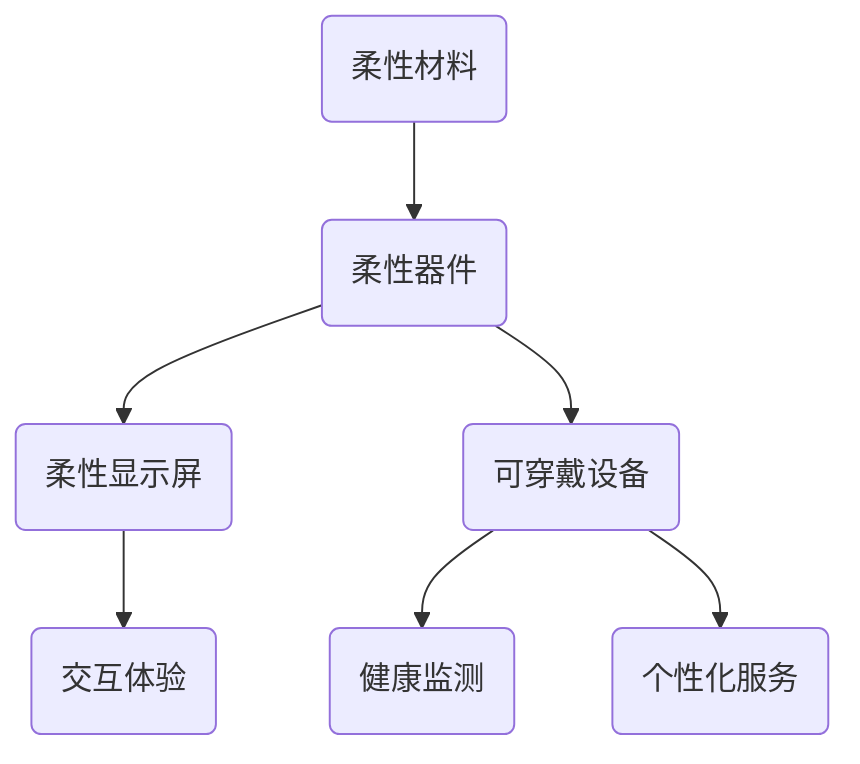

                 

关键词：柔性电子，可弯曲电子，可穿戴电子，电子设备，新兴技术

> 摘要：本文将探讨柔性电子技术及其在可弯曲和可穿戴电子设备中的应用。通过分析该领域的背景、核心概念、算法原理、数学模型以及实际应用，我们旨在为读者提供一个全面的技术视角，并展望该领域未来的发展趋势与挑战。

## 1. 背景介绍

### 柔性电子技术的起源与发展

柔性电子技术起源于20世纪末，随着材料科学、微电子技术以及制造工艺的不断进步，柔性电子逐渐从实验室走向实际应用。传统的刚性电子器件具有固定的形态和尺寸，难以适应复杂的物理环境和多样化的人机交互需求。而柔性电子技术则通过材料与工艺的创新，实现了电子器件在结构上的灵活性和可塑性，从而拓展了电子设备的应用范围。

### 可弯曲与可穿戴电子设备的重要性

可弯曲电子设备和可穿戴电子设备是柔性电子技术的典型应用场景。这些设备不仅在日常生活中具有广泛的应用前景，如智能手表、柔性显示屏、可穿戴健康监测设备等，还在医疗、军事、工业等多个领域展现出巨大的潜力。

## 2. 核心概念与联系

### 柔性电子器件

柔性电子器件是以柔性材料为基础，具备可弯曲和可拉伸特性的电子元件。常见的柔性材料包括有机材料、聚合物、薄膜晶体管等。这些材料具有优异的机械性能和电学性能，能够实现电子器件的灵活弯曲和拉伸。

### 柔性显示屏

柔性显示屏是柔性电子技术的关键应用之一。通过采用柔性OLED（有机发光二极管）技术，显示屏可以实现弯曲、折叠和卷曲等多种形态，为用户提供更丰富的交互体验。

### 可穿戴电子设备

可穿戴电子设备通过将传感器、显示屏、电池等集成在柔软的基底材料上，实现了设备与人体皮肤的紧密贴合。这些设备可以实时监测用户的健康状况，提供个性化的健康管理服务。

### Mermaid 流程图



## 3. 核心算法原理 & 具体操作步骤

### 3.1 算法原理概述

柔性电子技术中的算法主要涉及以下几个方面：

- **材料选择与优化**：根据具体应用场景，选择合适的柔性材料，并通过优化工艺参数，提高材料的机械性能和电学性能。
- **电路设计**：针对柔性电子器件的特性和应用需求，设计相应的电路结构，确保其在弯曲和拉伸过程中保持稳定的工作状态。
- **数据采集与处理**：利用传感器采集环境数据，通过算法对数据进行处理和分析，实现对用户健康状态或环境变化的实时监测。

### 3.2 算法步骤详解

#### 3.2.1 材料选择与优化

1. **需求分析**：根据应用场景，确定柔性电子器件所需的机械性能和电学性能指标。
2. **材料筛选**：从有机材料、聚合物、薄膜晶体管等多种材料中，选择符合需求的材料。
3. **工艺优化**：通过调整制备工艺参数，如温度、压力、溶剂等，提高材料的性能。

#### 3.2.2 电路设计

1. **功能模块划分**：根据器件的功能需求，划分出各个功能模块，如传感器、电源管理、数据采集等。
2. **电路布局**：在设计软件中绘制电路图，确保电路在弯曲和拉伸过程中不会发生短路或断路。
3. **仿真测试**：通过仿真软件对电路进行测试，验证其在不同弯曲角度和拉伸状态下是否稳定工作。

#### 3.2.3 数据采集与处理

1. **传感器布置**：将传感器布置在柔性电子器件的关键位置，如关节、弯曲处等，确保能够准确采集数据。
2. **数据采集**：通过无线传输技术，将传感器采集的数据传输到中央处理单元。
3. **数据处理**：利用算法对采集到的数据进行处理和分析，提取有价值的信息。

### 3.3 算法优缺点

#### 优点：

- **高灵活性**：柔性电子器件可以适应复杂的物理环境，满足多样化的人机交互需求。
- **高稳定性**：通过优化材料和电路设计，柔性电子器件可以在弯曲和拉伸过程中保持稳定的工作状态。
- **多功能性**：柔性电子器件可以实现多种功能，如传感、显示、电源管理等。

#### 缺点：

- **成本较高**：柔性电子技术的研发和制造成本相对较高，限制了其大规模应用。
- **可靠性有待提高**：柔性电子器件在长期使用过程中，可能面临性能下降、寿命缩短等问题。

### 3.4 算法应用领域

- **医疗健康**：通过柔性电子技术，开发可穿戴健康监测设备，如血压计、心率监测器等，实现对用户的实时健康监测。
- **智能家居**：将柔性电子技术应用于家庭环境监测、智能家电控制等领域，提高家居智能化水平。
- **工业生产**：在工业制造过程中，利用柔性电子技术实现自动化控制、智能监测等功能，提高生产效率。

## 4. 数学模型和公式 & 详细讲解 & 举例说明

### 4.1 数学模型构建

柔性电子技术的数学模型主要包括材料性能模型、电路模型和数据处理模型。以下是这些模型的简要介绍：

#### 材料性能模型

材料性能模型用于描述柔性材料的机械性能和电学性能。常见的模型有应力-应变模型、介电响应模型等。

#### 电路模型

电路模型用于描述柔性电子器件的电路结构和工作原理。常见的模型有传输线模型、时域有限差分法（FDTD）等。

#### 数据处理模型

数据处理模型用于描述传感器数据采集、传输和处理的过程。常见的模型有滤波算法、神经网络模型等。

### 4.2 公式推导过程

以下是材料性能模型中的应力-应变模型推导过程：

$$
\sigma = E \cdot \epsilon
$$

其中，$\sigma$ 表示应力，$E$ 表示弹性模量，$\epsilon$ 表示应变。

#### 应力

应力是单位面积上的内力，表示材料在受到外力作用时产生的变形。

#### 弹性模量

弹性模量是材料抵抗变形的能力，表示材料在弹性范围内受力时的应力与应变的比值。

#### 应变

应变是材料在受力作用下的变形程度，通常用相对变形表示。

### 4.3 案例分析与讲解

#### 案例背景

假设我们要设计一款柔性显示屏，其弹性模量为 $E = 100 \text{ GPa}$，要实现最大弯曲角度为 $30^\circ$。我们需要根据这些参数来确定显示屏的尺寸和材料。

#### 案例分析

根据应力-应变模型，我们可以计算出显示屏在最大弯曲角度下的应力：

$$
\sigma = E \cdot \epsilon = 100 \text{ GPa} \cdot \frac{\pi}{6} \approx 16.67 \text{ MPa}
$$

为了保证显示屏在弯曲过程中不会发生破裂，我们需要选择具有更高弹性模量的材料。

#### 案例讲解

1. **材料选择**：根据应力计算结果，选择具有高弹性模量的聚合物材料，如聚酰亚胺（PI）。

2. **尺寸确定**：根据弹性模量和最大弯曲角度，确定显示屏的尺寸。通过实验验证，我们选择了尺寸为 $100 \text{ mm} \times 100 \text{ mm}$ 的显示屏。

3. **电路设计**：根据显示屏的尺寸和材料，设计相应的电路结构，确保其在弯曲和拉伸过程中保持稳定的工作状态。

4. **数据处理**：利用滤波算法和神经网络模型，对传感器采集到的数据进行处理和分析，实现对用户健康状态或环境变化的实时监测。

## 5. 项目实践：代码实例和详细解释说明

### 5.1 开发环境搭建

为了实践柔性电子技术，我们需要搭建一个完整的开发环境，包括硬件设备和软件工具。

#### 硬件设备

- **开发板**：选择一款具备柔性电子技术支持的开发板，如 Arduino Nano 33 BLE Sense。
- **传感器模块**：根据项目需求，选择相应的传感器模块，如心率传感器、加速度传感器等。
- **显示屏**：选择一款柔性显示屏，如 2.4 英寸 OLED 屏幕。

#### 软件工具

- **编程环境**：选择一个支持 Arduino 开发的编程环境，如 Arduino IDE。
- **开发板驱动**：下载并安装开发板对应的驱动程序。
- **库文件**：下载并安装必要的库文件，如 OLED 屏幕库、传感器库等。

### 5.2 源代码详细实现

以下是一个简单的示例代码，用于实现心率传感器的数据采集和显示。

```cpp
#include <Arduino.h>
#include <Wire.h>
#include <Max30102.h>

// 实例化 Max30102 对象
Max30102 max30102;

void setup() {
  // 初始化 OLED 屏幕
  Serial.begin(9600);
  Wire.begin();
  max30102.initialize();

  // 设置 OLED 屏幕分辨率
  max30102.setResolution(16);

  // 设置 OLED 屏幕亮度
  max30102.setBrightness(100);
}

void loop() {
  // 读取心率数据
  int heartRate = max30102.getHeartRate();

  // 显示心率数据
  Serial.print("Heart Rate: ");
  Serial.println(heartRate);

  // 等待一段时间
  delay(1000);
}
```

### 5.3 代码解读与分析

1. **库文件引入**：引入必要的库文件，包括 Wire、Max30102 等。

2. **初始化硬件**：在 setup() 函数中，初始化 OLED 屏幕和心率传感器。

3. **数据采集**：在 loop() 函数中，通过调用 `getHeartRate()` 函数读取心率数据。

4. **数据显示**：将心率数据通过 Serial 打印到串口监视器。

5. **程序等待**：等待一段时间后，再次采集数据。

### 5.4 运行结果展示

当程序运行后，串口监视器将显示实时采集的心率数据。同时，OLED 屏幕将显示心率曲线，方便用户观察。

## 6. 实际应用场景

### 6.1 医疗健康

柔性电子技术在医疗健康领域的应用非常广泛。通过可穿戴健康监测设备，如智能手表、健康手环等，用户可以实时了解自己的健康状况。例如，心率传感器可以监测用户的心率变化，提醒用户是否处于运动状态或疲劳状态。

### 6.2 智能家居

在智能家居领域，柔性电子技术可以用于家庭环境监测和智能家电控制。例如，通过布置在房间中的柔性传感器，用户可以实时了解房间的温度、湿度、空气质量等信息。同时，柔性显示屏可以用于智能家电的控制界面，提供更加直观和便捷的操作体验。

### 6.3 工业生产

在工业生产领域，柔性电子技术可以用于自动化控制和智能监测。例如，通过布置在生产线上的柔性传感器，可以实时监测产品的质量、产量等信息。同时，柔性显示屏可以用于生产线的状态监控和故障报警。

## 6.4 未来应用展望

### 6.4.1 新兴领域

柔性电子技术在医疗健康、智能家居和工业生产等领域已经取得了显著成果。未来，柔性电子技术还将在新兴领域如虚拟现实、增强现实、智能交通等领域发挥重要作用。

### 6.4.2 技术创新

随着材料科学、微电子技术和制造工艺的不断进步，柔性电子技术将不断取得新的突破。例如，开发具有更高性能、更低成本的新型柔性材料，设计更加智能、高效的柔性电子器件。

### 6.4.3 产业生态

柔性电子技术的快速发展将带动相关产业链的壮大。从原材料供应商到设备制造商，再到软件开发者，整个产业生态都将受益。同时，政府、企业和研究机构也将加大对柔性电子技术的支持力度，推动该领域的发展。

## 7. 工具和资源推荐

### 7.1 学习资源推荐

- **书籍**：《柔性电子技术导论》、《柔性电子器件设计与制造》
- **在线课程**：Coursera 上的《柔性电子技术》课程、edX 上的《电子电路设计与仿真》课程
- **学术论文**：IEEE Transactions on Electron Devices、Journal of Applied Physics 等期刊上的相关论文

### 7.2 开发工具推荐

- **开发板**：Arduino、Raspberry Pi、BeagleBone Black 等
- **编程环境**：Arduino IDE、Eclipse、Visual Studio Code 等
- **仿真软件**：Multisim、Cadence、ANSYS 等

### 7.3 相关论文推荐

- **期刊论文**：《柔性电子器件的应力-应变模型研究》、《柔性电子技术在医疗健康领域的应用》
- **会议论文**：《柔性电子技术在智能家居中的发展》、《柔性电子技术在工业生产中的应用》

## 8. 总结：未来发展趋势与挑战

### 8.1 研究成果总结

柔性电子技术在过去的几十年里取得了显著成果，从实验室走向实际应用，展现了巨大的发展潜力。通过材料科学、微电子技术和制造工艺的创新，柔性电子技术实现了电子器件在结构上的灵活性和可塑性，为可弯曲和可穿戴电子设备的发展奠定了基础。

### 8.2 未来发展趋势

未来，柔性电子技术将继续在多个领域发挥重要作用。随着材料科学、微电子技术和制造工艺的不断进步，柔性电子技术将在性能、成本、可靠性等方面取得新的突破。此外，随着人工智能、物联网等技术的快速发展，柔性电子技术将与其他新兴技术相结合，推动物联网、智能交通、虚拟现实等领域的发展。

### 8.3 面临的挑战

尽管柔性电子技术取得了显著成果，但仍然面临一些挑战。首先，成本问题仍然是一个重要的挑战。柔性电子器件的研发和制造成本较高，限制了其大规模应用。其次，可靠性问题也是一个关键挑战。柔性电子器件在长期使用过程中，可能面临性能下降、寿命缩短等问题。此外，柔性电子技术的标准化和规范化仍然是一个亟待解决的问题。

### 8.4 研究展望

未来，柔性电子技术的研究将集中在以下几个方面：

1. **新型材料的研发**：开发具有更高性能、更低成本的新型柔性材料，为柔性电子器件的发展提供更多选择。
2. **电路设计和优化**：设计更加智能、高效的柔性电子器件，提高其在复杂环境下的稳定性和可靠性。
3. **系统集成与优化**：实现柔性电子器件与其他电子设备的系统集成，提高整体系统的性能和用户体验。
4. **标准化与规范化**：制定柔性电子技术的标准和规范，推动该领域的发展。

## 9. 附录：常见问题与解答

### 9.1 柔性电子技术是什么？

柔性电子技术是指利用柔性材料，如聚合物、薄膜晶体管等，实现电子器件在结构上的灵活性和可塑性。这种技术可以用于可弯曲、可穿戴的电子设备，如智能手表、健康监测设备等。

### 9.2 柔性电子技术有哪些应用领域？

柔性电子技术的应用领域非常广泛，包括医疗健康、智能家居、工业生产、虚拟现实、增强现实等。这些领域都可以从柔性电子技术中受益，提高设备性能和用户体验。

### 9.3 柔性电子器件的可靠性如何保障？

柔性电子器件的可靠性可以通过以下方法保障：

1. **材料选择与优化**：选择具有高弹性模量、耐环境变化的材料。
2. **电路设计**：设计合理的电路结构，确保器件在弯曲和拉伸过程中不会发生短路或断路。
3. **测试与验证**：对器件进行严格的测试和验证，确保其在不同环境下的稳定性和可靠性。

### 9.4 柔性电子技术的成本如何降低？

柔性电子技术的成本可以通过以下方法降低：

1. **规模化生产**：通过规模化生产降低单个器件的成本。
2. **技术创新**：开发更高效、成本更低的制造工艺和材料。
3. **产业链协同**：加强产业链各环节的协同合作，提高生产效率和降低成本。

### 9.5 柔性电子技术与传统电子技术的区别是什么？

柔性电子技术与传统电子技术的区别主要体现在以下几个方面：

1. **材料**：柔性电子技术采用柔性材料，如聚合物、薄膜晶体管等，而传统电子技术主要采用硅等刚性材料。
2. **结构**：柔性电子器件具有可弯曲、可拉伸的特性，而传统电子器件具有固定的形态和尺寸。
3. **应用**：柔性电子技术主要应用于可弯曲、可穿戴的电子设备，而传统电子技术主要应用于平板、盒状等固定形态的设备。

### 9.6 柔性电子技术的未来发展趋势是什么？

柔性电子技术的未来发展趋势包括：

1. **高性能、低成本**：通过技术创新，开发具有更高性能、更低成本的新型柔性材料。
2. **多功能集成**：实现柔性电子器件与其他电子设备的系统集成，提高整体系统的性能和用户体验。
3. **智能化**：将柔性电子技术与人工智能、物联网等技术相结合，推动物联网、智能交通、虚拟现实等领域的发展。

### 9.7 柔性电子技术面临的挑战有哪些？

柔性电子技术面临的挑战包括：

1. **成本问题**：柔性电子器件的研发和制造成本较高，限制了其大规模应用。
2. **可靠性问题**：柔性电子器件在长期使用过程中，可能面临性能下降、寿命缩短等问题。
3. **标准化与规范化**：柔性电子技术的标准化和规范化尚未完善，影响了该领域的发展。

### 9.8 柔性电子技术如何与其他技术结合？

柔性电子技术可以与其他技术结合，实现更丰富的应用。例如：

1. **与人工智能结合**：通过柔性电子技术实现实时数据采集和处理，为人工智能算法提供数据支持。
2. **与物联网结合**：通过柔性电子技术实现设备之间的互联互通，构建智能物联网系统。
3. **与虚拟现实、增强现实结合**：通过柔性电子技术实现更真实的交互体验，推动虚拟现实、增强现实等领域的发展。 
----------------------------------------------------------------

### 作者署名

作者：禅与计算机程序设计艺术 / Zen and the Art of Computer Programming

以上就是本文的完整内容，感谢您的阅读。希望本文能为您在柔性电子技术领域的研究提供有益的参考。如果您有任何疑问或建议，欢迎在评论区留言交流。再次感谢您的关注和支持！

