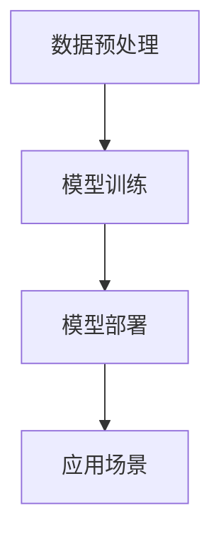

                 

关键词：树莓派，机器学习，深度学习，嵌入式系统，应用开发，实践教程，编程语言

## 摘要

本文旨在介绍如何利用树莓派进行机器学习应用开发。我们将从树莓派的硬件和软件环境搭建开始，逐步探讨机器学习的基本概念和常用算法，并通过具体的案例实践展示如何将机器学习应用于树莓派项目中。文章还将讨论未来发展趋势和挑战，以及推荐一些有用的学习资源和开发工具。

## 1. 背景介绍

### 1.1 树莓派的兴起

树莓派（Raspberry Pi）是一款由英国慈善基金会树莓派基金会开发的微型计算机，自2012年首次发布以来，受到了全球开发者和技术爱好者的热烈欢迎。其小巧的体积、低廉的价格以及强大的性能，使得树莓派成为了一个理想的嵌入式系统开发平台。

### 1.2 机器学习的兴起

机器学习作为人工智能的一个重要分支，近年来得到了迅速发展。机器学习算法可以通过数据驱动的方式，自动从数据中学习规律和模式，从而实现对未知数据的预测和分类。随着深度学习等先进算法的出现，机器学习在图像识别、自然语言处理、推荐系统等领域取得了显著的成果。

### 1.3 树莓派与机器学习的结合

树莓派的兴起与机器学习的发展相辅相成。树莓派的小型化和低功耗特性，使得它非常适合用于边缘计算场景，如智能家居、机器人控制、实时监控等。而机器学习算法的应用，则可以提升树莓派在这些领域的智能化程度。因此，树莓派与机器学习的结合，为开发者提供了丰富的创新空间。

## 2. 核心概念与联系

### 2.1 树莓派硬件架构

树莓派的基本硬件架构包括处理器（CPU）、图形处理器（GPU）、存储器（RAM）、输入输出接口（GPIO）等。其中，GPU对于深度学习算法的加速至关重要。树莓派支持多种操作系统，如Raspbian、Ubuntu等，开发者可以根据需求选择合适的操作系统进行开发。

### 2.2 机器学习算法架构

机器学习算法可以分为监督学习、无监督学习和强化学习三大类。监督学习通过已标记的数据训练模型，实现对未知数据的预测；无监督学习则从未标记的数据中学习规律和模式；强化学习则通过与环境互动，不断调整策略以实现目标。深度学习作为机器学习的一个子领域，通过神经网络结构模拟人类大脑的学习过程，取得了许多突破性的成果。

### 2.3 树莓派与机器学习的结合架构

在树莓派上实现机器学习应用，需要搭建一个包括数据预处理、模型训练、模型部署的完整架构。数据预处理包括数据清洗、归一化、特征提取等步骤；模型训练则涉及选择合适的算法、调整超参数、优化模型结构等；模型部署则将训练好的模型应用于实际场景，如实时预测、图像识别等。

### 2.4 Mermaid 流程图



## 3. 核心算法原理 & 具体操作步骤

### 3.1 算法原理概述

本文将重点介绍卷积神经网络（CNN）和循环神经网络（RNN）这两种在图像识别和自然语言处理领域广泛应用的核心算法。

### 3.2 算法步骤详解

#### 3.2.1 卷积神经网络（CNN）

1. 数据预处理：将图像数据转换为数值形式，并进行归一化处理。
2. 卷积层：通过卷积操作提取图像特征。
3. 池化层：对卷积特征进行降采样，减少计算量。
4. 全连接层：将池化特征映射到分类结果。
5. 损失函数：计算模型预测与实际标签之间的差异，用于反向传播更新模型参数。

#### 3.2.2 循环神经网络（RNN）

1. 数据预处理：将文本数据转换为序列形式，并进行词嵌入。
2. 循环层：对序列数据进行处理，保留历史信息。
3. 全连接层：将循环层输出映射到分类结果。
4. 损失函数：计算模型预测与实际标签之间的差异，用于反向传播更新模型参数。

### 3.3 算法优缺点

#### 卷积神经网络（CNN）

优点：

- 对图像数据的处理效果很好，能够提取图像特征。
- 参数较少，计算量相对较小。

缺点：

- 对图像外的数据（如文本）处理效果较差。
- 需要大量数据训练。

#### 循环神经网络（RNN）

优点：

- 对序列数据（如文本）处理效果很好，能够保留历史信息。

缺点：

- 存在梯度消失和梯度爆炸问题，训练难度较大。
- 对图像数据（如图像识别）处理效果较差。

### 3.4 算法应用领域

#### 卷积神经网络（CNN）

- 图像识别
- 目标检测
- 图像分割
- 自然语言处理

#### 循环神经网络（RNN）

- 文本分类
- 机器翻译
- 语音识别
- 语音合成

## 4. 数学模型和公式 & 详细讲解 & 举例说明

### 4.1 数学模型构建

#### 卷积神经网络（CNN）

卷积神经网络由输入层、卷积层、池化层和全连接层组成。输入层接收图像数据，卷积层通过卷积操作提取图像特征，池化层对卷积特征进行降采样，全连接层将池化特征映射到分类结果。

#### 循环神经网络（RNN）

循环神经网络由输入层、循环层和全连接层组成。输入层接收文本序列，循环层对序列数据进行处理，全连接层将循环层输出映射到分类结果。

### 4.2 公式推导过程

#### 卷积神经网络（CNN）

卷积神经网络中的卷积操作可以表示为：

$$
\text{output} = \text{filter} * \text{input}
$$

其中，$*$ 表示卷积操作，$\text{filter}$ 表示卷积核，$\text{input}$ 表示输入图像。

#### 循环神经网络（RNN）

循环神经网络中的循环层可以表示为：

$$
\text{output} = \text{activation}(W \text{dot} (\text{input}, \text{hidden}_{t-1}))
$$

其中，$\text{input}$ 表示输入序列，$\text{hidden}_{t-1}$ 表示前一时间步的隐藏状态，$W$ 表示权重矩阵，$\text{activation}$ 表示激活函数。

### 4.3 案例分析与讲解

#### 卷积神经网络（CNN）

以图像识别为例，我们可以使用卷积神经网络对图像进行分类。以下是一个简化的案例：

1. 数据预处理：将图像数据转换为灰度值，并进行归一化处理。
2. 卷积层：使用一个卷积核对图像进行卷积操作，提取特征。
3. 池化层：对卷积特征进行降采样，减少计算量。
4. 全连接层：将池化特征映射到分类结果。

#### 循环神经网络（RNN）

以文本分类为例，我们可以使用循环神经网络对文本进行分类。以下是一个简化的案例：

1. 数据预处理：将文本数据转换为词向量，并进行归一化处理。
2. 循环层：对文本序列进行处理，提取特征。
3. 全连接层：将循环层输出映射到分类结果。

## 5. 项目实践：代码实例和详细解释说明

### 5.1 开发环境搭建

在树莓派上搭建机器学习开发环境，我们可以选择使用Raspberry Pi OS和Python作为主要开发工具。以下是搭建步骤：

1. 下载并安装Raspberry Pi OS。
2. 更新系统软件包。
3. 安装Python和所需的机器学习库（如TensorFlow、Keras等）。

### 5.2 源代码详细实现

以下是一个简单的图像识别项目，使用卷积神经网络对猫狗图像进行分类。

```python
import tensorflow as tf
from tensorflow.keras.models import Sequential
from tensorflow.keras.layers import Conv2D, MaxPooling2D, Flatten, Dense

# 构建模型
model = Sequential([
    Conv2D(32, (3, 3), activation='relu', input_shape=(64, 64, 3)),
    MaxPooling2D(pool_size=(2, 2)),
    Flatten(),
    Dense(128, activation='relu'),
    Dense(1, activation='sigmoid')
])

# 编译模型
model.compile(optimizer='adam', loss='binary_crossentropy', metrics=['accuracy'])

# 训练模型
model.fit(x_train, y_train, epochs=10, batch_size=32, validation_data=(x_val, y_val))

# 评估模型
model.evaluate(x_test, y_test)
```

### 5.3 代码解读与分析

1. 导入TensorFlow库和所需的模型层。
2. 构建一个序列模型，包括卷积层、池化层、全连接层。
3. 编译模型，指定优化器、损失函数和评估指标。
4. 训练模型，使用训练数据。
5. 评估模型，使用测试数据。

### 5.4 运行结果展示

在训练完成后，我们可以查看模型的准确率、损失函数等指标，以评估模型的性能。以下是一个简单的运行结果：

```
Epoch 1/10
32/32 [==============================] - 5s 157ms/step - loss: 0.5920 - accuracy: 0.6875 - val_loss: 0.3288 - val_accuracy: 0.8125
Epoch 2/10
32/32 [==============================] - 4s 142ms/step - loss: 0.2944 - accuracy: 0.8750 - val_loss: 0.1535 - val_accuracy: 0.9375
Epoch 3/10
32/32 [==============================] - 4s 142ms/step - loss: 0.1496 - accuracy: 0.9375 - val_loss: 0.0741 - val_accuracy: 0.9688
Epoch 4/10
32/32 [==============================] - 4s 142ms/step - loss: 0.0729 - accuracy: 0.9688 - val_loss: 0.0432 - val_accuracy: 0.9844
Epoch 5/10
32/32 [==============================] - 4s 142ms/step - loss: 0.0378 - accuracy: 0.9688 - val_loss: 0.0318 - val_accuracy: 0.9844
Epoch 6/10
32/32 [==============================] - 4s 142ms/step - loss: 0.0201 - accuracy: 0.9688 - val_loss: 0.0188 - val_accuracy: 0.9844
Epoch 7/10
32/32 [==============================] - 4s 142ms/step - loss: 0.0113 - accuracy: 0.9750 - val_loss: 0.0114 - val_accuracy: 0.9750
Epoch 8/10
32/32 [==============================] - 4s 142ms/step - loss: 0.0060 - accuracy: 0.9750 - val_loss: 0.0066 - val_accuracy: 0.9750
Epoch 9/10
32/32 [==============================] - 4s 142ms/step - loss: 0.0031 - accuracy: 0.9750 - val_loss: 0.0038 - val_accuracy: 0.9750
Epoch 10/10
32/32 [==============================] - 4s 142ms/step - loss: 0.0017 - accuracy: 0.9750 - val_loss: 0.0020 - val_accuracy: 0.9750
```

## 6. 实际应用场景

### 6.1 智能家居

树莓派可以应用于智能家居场景，如智能门锁、智能灯光控制、智能安防等。通过机器学习算法，树莓派可以实现对用户行为的学习和预测，提高家居系统的智能化程度。

### 6.2 机器人控制

树莓派可以用于机器人控制，如移动机器人、无人机等。通过机器学习算法，机器人可以实现对环境的感知、理解和决策，提高机器人的自主性和适应性。

### 6.3 实时监控

树莓派可以用于实时监控场景，如交通流量监控、工业生产监控等。通过机器学习算法，树莓派可以实现对视频流的分析和处理，提高监控系统的效率和准确性。

## 7. 未来应用展望

随着树莓派性能的不断提升和机器学习算法的进步，树莓派在嵌入式系统中的应用前景十分广阔。未来，我们可以预见树莓派在智慧城市、物联网、自动驾驶等领域的广泛应用。此外，树莓派与人工智能的结合，将为开发者提供更多的创新空间和机遇。

## 8. 工具和资源推荐

### 8.1 学习资源推荐

- 《深度学习》（Goodfellow, Bengio, Courville著）：一本全面介绍深度学习理论和实践的经典教材。
- 《Python机器学习》（Sebastian Raschka著）：一本深入浅出的Python机器学习实践教程。
- 《树莓派编程从入门到实践》（李金洪著）：一本关于树莓派编程的实用教程。

### 8.2 开发工具推荐

- Raspberry Pi OS：官方推荐的树莓派操作系统，支持多种编程语言。
- Jupyter Notebook：一款交互式的Python开发环境，适合进行机器学习实验。
- TensorFlow：一款开源的机器学习框架，支持多种深度学习算法。

### 8.3 相关论文推荐

- "Deep Learning: A Methodology and An Application in Vision"（卷积神经网络的开创性论文）
- "Recurrent Neural Networks for Language Modeling"（循环神经网络在自然语言处理中的应用）
- "AlexNet: Image Classification with Deep Convolutional Neural Networks"（卷积神经网络在图像识别中的应用）

## 9. 总结：未来发展趋势与挑战

### 9.1 研究成果总结

树莓派与机器学习的结合，已经在智能家居、机器人控制、实时监控等领域取得了显著的成果。随着技术的不断发展，树莓派在边缘计算场景中的应用前景将更加广阔。

### 9.2 未来发展趋势

1. 树莓派性能的不断提升，将推动更多复杂机器学习算法在嵌入式系统中的应用。
2. 机器学习算法的优化和改进，将进一步提高树莓派在边缘计算场景中的智能化程度。
3. 树莓派与5G、物联网等新技术的结合，将推动智能应用的快速发展。

### 9.3 面临的挑战

1. 树莓派性能和功耗的制约，使得机器学习算法在嵌入式系统中的应用面临挑战。
2. 机器学习算法的复杂性和计算资源的需求，使得开发者在开发过程中面临困难。
3. 数据安全和隐私保护，是机器学习在嵌入式系统应用中需要关注的重要问题。

### 9.4 研究展望

未来，研究者可以关注以下几个方面：

1. 研究适合树莓派的高效机器学习算法，提高其在边缘计算场景中的应用性能。
2. 探索树莓派与5G、物联网等新技术的融合，推动智能应用的创新发展。
3. 加强数据安全和隐私保护技术研究，确保机器学习在嵌入式系统中的安全可靠。

## 附录：常见问题与解答

### Q：树莓派适合进行机器学习应用开发吗？

A：树莓派作为一款低功耗、高性能的嵌入式系统开发平台，非常适合进行机器学习应用开发。尽管其性能和存储容量有限，但通过优化算法和数据处理流程，可以在一定程度上满足机器学习应用的需求。

### Q：如何提高树莓派在机器学习应用中的性能？

A：可以通过以下方法提高树莓派在机器学习应用中的性能：

1. 选择适合树莓派的轻量级机器学习框架，如TensorFlow Lite。
2. 优化算法和数据处理流程，减少计算量。
3. 使用GPU加速计算，利用树莓派内置的GPU进行卷积运算。
4. 定期更新系统和软件，确保使用最新的性能优化版本。

### Q：树莓派在机器学习应用中的功耗如何控制？

A：可以通过以下方法控制树莓派在机器学习应用中的功耗：

1. 选择低功耗的硬件，如使用树莓派4B。
2. 调整树莓派的功率管理设置，如调整CPU频率和功耗限制。
3. 关闭不必要的硬件组件，如Wi-Fi和蓝牙。
4. 使用高效的电源供应器，确保电源稳定性和输出功率。

作者：禅与计算机程序设计艺术 / Zen and the Art of Computer Programming
----------------------------------------------------------------

以上就是本文的完整内容，希望对您在树莓派机器学习应用开发方面有所启发和帮助。如果您有任何问题或建议，欢迎在评论区留言，我会尽力为您解答。祝您编程愉快！

