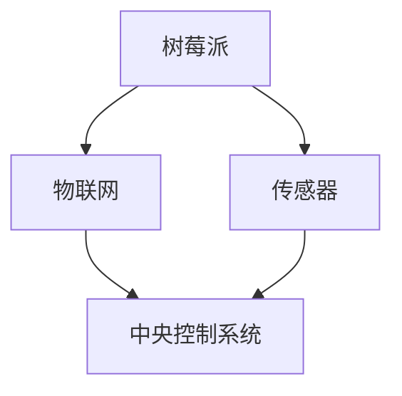

                 

关键词：树莓派、智能家居、物联网、硬件编程、嵌入式系统、Python开发、传感器集成

> 摘要：本文将介绍如何利用树莓派构建一个智能家居中心，实现家庭自动化。通过学习本文章，读者将了解树莓派的基本知识、硬件选型、软件安装、传感器集成以及自动化控制的实现，从而迈出智能家居的第一步。

## 1. 背景介绍

智能家居是一个快速发展的领域，通过将家庭设备与互联网连接，可以实现远程控制、自动化管理等功能。树莓派因其低成本、高性能和易用性，成为了智能家居项目中的热门选择。本文将围绕树莓派，介绍如何构建一个智能家居中心。

## 2. 核心概念与联系

在构建智能家居中心的过程中，我们需要了解以下几个核心概念：

- **树莓派**：一款基于Linux操作系统的微型计算机，具有高性能和低功耗的特点。
- **物联网（IoT）**：通过互联网将各种设备连接起来，实现数据的实时传输和交互。
- **传感器**：用于检测环境参数的设备，如温度、湿度、光照等。
- **嵌入式系统**：将计算机技术、电子技术和传感器技术集成在一起，实现特定功能的系统。

以下是构建智能家居中心的基本架构：



## 3. 核心算法原理 & 具体操作步骤

### 3.1 算法原理概述

在智能家居中心的建设中，核心算法主要涉及以下几个方面：

- **数据采集与处理**：通过传感器获取环境数据，并对其进行处理。
- **远程控制**：通过互联网实现设备的远程控制。
- **自动化控制**：根据预设规则，自动执行相应的操作。

### 3.2 算法步骤详解

1. **硬件选型**：根据需求选择合适的树莓派型号和传感器。
2. **软件安装**：在树莓派上安装操作系统和所需软件。
3. **传感器集成**：连接传感器并编写代码读取数据。
4. **远程控制**：配置无线网络并实现远程访问。
5. **自动化控制**：编写控制逻辑，实现设备的自动化控制。

### 3.3 算法优缺点

**优点**：
- **低成本**：树莓派和传感器价格相对较低，适合预算有限的项目。
- **灵活性**：可以根据需求自定义控制逻辑。
- **易扩展**：可以轻松添加更多设备和功能。

**缺点**：
- **安全性**：可能存在安全漏洞，需要加强安全防护。
- **功耗**：虽然树莓派功耗低，但长时间运行仍需考虑电源稳定性。

### 3.4 算法应用领域

- **家庭**：实现家庭设备的自动化控制，提高生活质量。
- **商业**：用于监控和控制商业设施，提高运营效率。
- **农业**：监控农作物生长环境，实现精准农业。

## 4. 数学模型和公式 & 详细讲解 & 举例说明

在智能家居中心的建设中，数学模型和公式主要用于数据分析和处理。以下是一个简单的温度控制模型：

### 4.1 数学模型构建

假设温度控制的目标是在20°C左右，当温度高于25°C时，开启制冷设备；当温度低于15°C时，开启加热设备。

### 4.2 公式推导过程

$$
\text{控制逻辑} = \begin{cases}
\text{开启制冷设备}, & \text{如果温度} > 25°C \\
\text{开启加热设备}, & \text{如果温度} < 15°C \\
\text{保持当前状态}, & \text{否则}
\end{cases}
$$

### 4.3 案例分析与讲解

假设当前温度为23°C，根据上述公式，应开启制冷设备。如果温度下降至18°C，则应关闭制冷设备，保持当前状态。

## 5. 项目实践：代码实例和详细解释说明

### 5.1 开发环境搭建

在开始项目实践之前，我们需要搭建开发环境。以下是树莓派的开发环境搭建步骤：

1. **安装操作系统**：从官网下载Raspbian操作系统并安装到SD卡中。
2. **连接网络**：使用网线或无线网络连接树莓派。
3. **安装所需软件**：通过命令行安装Python、Wi-Fi驱动等软件。

### 5.2 源代码详细实现

以下是一个简单的温度传感器读取与控制的Python代码实例：

```python
import RPi.GPIO as GPIO
import time

# 定义传感器引脚
temp_pin = 21

# 初始化GPIO
GPIO.setmode(GPIO.BCM)
GPIO.setup(temp_pin, GPIO.IN)

def read_temp():
    # 读取温度传感器数据
    temp_value = GPIO.input(temp_pin)
    return temp_value

def control_temp(temp_value):
    # 控制温度
    if temp_value > 25:
        print("开启制冷设备")
    elif temp_value < 15:
        print("开启加热设备")
    else:
        print("保持当前状态")

# 主程序
try:
    while True:
        temp_value = read_temp()
        control_temp(temp_value)
        time.sleep(1)
except KeyboardInterrupt:
    pass
finally:
    GPIO.cleanup()
```

### 5.3 代码解读与分析

- **GPIO库**：用于控制树莓派的GPIO引脚。
- **read_temp()函数**：读取温度传感器的数据。
- **control_temp()函数**：根据温度值控制设备。
- **主程序**：循环读取温度值并执行控制逻辑。

### 5.4 运行结果展示

运行代码后，根据温度值将实时显示相应的控制命令。

## 6. 实际应用场景

树莓派在智能家居中的应用场景非常广泛，以下是一些实际应用示例：

- **智能照明**：通过传感器检测环境光线，自动调节灯光亮度。
- **智能安防**：通过传感器检测门窗开关，实现入侵报警。
- **智能温控**：根据室内温度自动调节空调和暖气。
- **智能园艺**：监控土壤湿度，自动浇水。

## 7. 工具和资源推荐

### 7.1 学习资源推荐

- **树莓派官方文档**：https://www.raspberrypi.org/documentation/
- **Python官方文档**：https://docs.python.org/3/
- **Arduino官方文档**：https://www.arduino.cc/en/HomePage

### 7.2 开发工具推荐

- **Thonny**：一款适合初学者的Python集成开发环境。
- **PyCharm**：一款功能强大的Python IDE。
- **Arduino IDE**：适用于Arduino开发的集成开发环境。

### 7.3 相关论文推荐

- **《物联网架构与实现技术》**
- **《智能家居系统设计与实现》**
- **《基于树莓派的智能监控系统设计》**

## 8. 总结：未来发展趋势与挑战

随着物联网技术的不断发展，智能家居市场前景广阔。未来智能家居将更加智能化、个性化，实现真正的“智慧生活”。然而，在发展的过程中也面临以下挑战：

- **安全性**：智能家居设备可能成为黑客攻击的目标，需要加强安全防护。
- **兼容性**：智能家居设备种类繁多，需要实现不同设备之间的互操作性。
- **功耗**：智能家居设备需要长时间运行，需要优化功耗设计。

## 9. 附录：常见问题与解答

### 问题1：树莓派为什么选择BCM模式而不是板载模式？

**解答**：BCM模式是基于树莓派处理器中的BCM2835芯片引脚编号，而板载模式是基于树莓派板子上的物理引脚编号。BCM模式可以更好地适应各种扩展板和模块，提高兼容性。

### 问题2：如何降低树莓派的功耗？

**解答**：可以通过以下方式降低树莓派的功耗：
- 选择低功耗的电源适配器。
- 禁用无用的硬件功能，如无线网卡。
- 使用深度睡眠模式，降低CPU频率。

---

**作者：禅与计算机程序设计艺术 / Zen and the Art of Computer Programming**<|endofassistant|>

