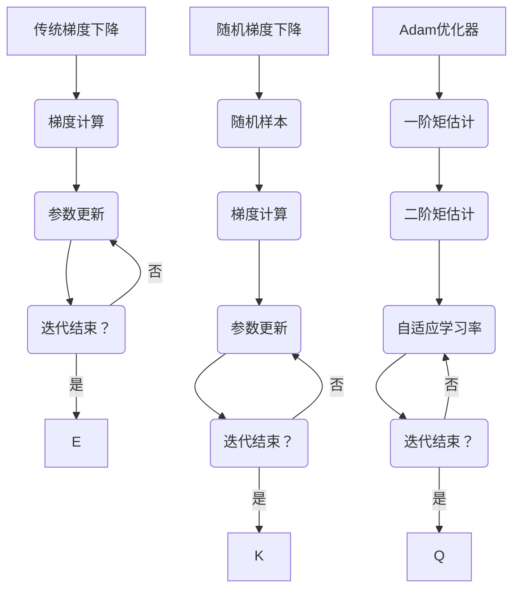

                 

关键词：梯度下降、SGD、Adam、优化算法、机器学习、深度学习

摘要：本文深入探讨了梯度下降优化算法的演变历程，从经典的随机梯度下降（SGD）到现代的Adam优化器，我们将详细解析每种算法的核心原理、优缺点及其在不同领域的应用。通过数学模型和实际案例的解析，读者将更好地理解这些优化算法在机器学习和深度学习中的重要性。

## 1. 背景介绍

梯度下降优化算法是机器学习和深度学习中至关重要的优化方法。其基本原理是通过对目标函数的梯度进行反向传播，以逐步调整模型参数，从而最小化目标函数值。然而，传统梯度下降算法在处理大规模数据集时存在计算效率低、收敛速度慢等问题。为了解决这些问题，研究者们提出了多种改进算法，其中包括随机梯度下降（SGD）和Adam优化器。

本文将首先回顾传统梯度下降算法的基本原理，然后详细探讨SGD和Adam优化器的具体实现和特点。通过对比分析，读者将能够更好地理解每种算法的适用场景和局限性。此外，文章还将结合实际案例，展示这些优化算法在机器学习和深度学习中的应用效果。

## 2. 核心概念与联系

### 2.1 传统梯度下降算法

传统梯度下降算法是最基本的优化方法。其基本思想是：在每次迭代中，根据目标函数的梯度方向，更新模型参数，以期望减少目标函数值。

梯度下降算法的核心概念包括：

- **目标函数**：在机器学习中，目标函数通常是最小二乘损失函数。
- **梯度**：目标函数的梯度是指参数空间中函数值增加最快的方向。
- **迭代过程**：每次迭代都沿着梯度的反方向更新参数。

### 2.2 随机梯度下降（SGD）

随机梯度下降（SGD）是对传统梯度下降算法的一种改进。其核心思想是每次迭代只随机选择一部分样本进行梯度计算，而不是使用整个训练集。这使得SGD在计算上更加高效，适用于大规模数据集。

SGD的核心概念包括：

- **随机样本**：每次迭代随机选择一部分样本。
- **梯度更新**：使用随机样本的梯度进行参数更新。
- **收敛速度**：SGD的收敛速度通常比传统梯度下降更快。

### 2.3 Adam优化器

Adam优化器是近年来发展起来的一种高效优化算法，它结合了SGD和动量法的优点。其核心思想是使用一阶矩估计和二阶矩估计来自适应调整学习率。

Adam优化器的核心概念包括：

- **一阶矩估计**：平均值。
- **二阶矩估计**：方差。
- **自适应学习率**：根据一阶矩和二阶矩自适应调整学习率。

### 2.4 Mermaid 流程图

以下是传统梯度下降算法、SGD和Adam优化器的Mermaid流程图：



## 3. 核心算法原理 & 具体操作步骤

### 3.1 算法原理概述

传统梯度下降算法的核心原理是通过不断更新参数，使得目标函数值逐渐减小。其具体步骤如下：

1. 初始化参数。
2. 计算目标函数的梯度。
3. 沿着梯度的反方向更新参数。
4. 重复步骤2和3，直到满足收敛条件。

SGD的核心原理与传统梯度下降类似，但每次迭代只使用随机选择的样本进行梯度计算。其具体步骤如下：

1. 初始化参数。
2. 随机选择一个样本。
3. 计算样本的梯度。
4. 沿着梯度的反方向更新参数。
5. 重复步骤2到4，直到满足收敛条件。

Adam优化器结合了SGD和动量法的优点，其核心原理是使用一阶矩估计和二阶矩估计来自适应调整学习率。其具体步骤如下：

1. 初始化参数和两个变量：一阶矩估计（均值）和二阶矩估计（方差）。
2. 对于每个参数：
   - 计算一阶矩估计的更新。
   - 计算二阶矩估计的更新。
   - 根据一阶矩和二阶矩自适应调整学习率。
3. 沿着调整后的梯度方向更新参数。
4. 重复步骤2和3，直到满足收敛条件。

### 3.2 算法步骤详解

#### 3.2.1 传统梯度下降算法

1. 初始化参数 \(\theta\) 和学习率 \(\alpha\)。
2. 对于每个数据点 \((x, y)\)：
   - 计算梯度 \(\nabla_{\theta} J(\theta)\)。
   - 更新参数：\(\theta = \theta - \alpha \cdot \nabla_{\theta} J(\theta)\)。
3. 重复步骤2，直到满足收敛条件（如目标函数值变化很小或者迭代次数达到预设值）。

#### 3.2.2 随机梯度下降（SGD）

1. 初始化参数 \(\theta\)、学习率 \(\alpha\) 和批量大小 \(m\)。
2. 随机选择一个样本 \((x_i, y_i)\)。
3. 计算梯度 \(\nabla_{\theta} J(\theta; x_i, y_i)\)。
4. 更新参数：\(\theta = \theta - \alpha \cdot \nabla_{\theta} J(\theta; x_i, y_i)\)。
5. 重复步骤2到4，直到满足收敛条件。

#### 3.2.3 Adam优化器

1. 初始化参数 \(\theta\)、学习率 \(\alpha\)、一阶矩估计 \(m_0 = 0\)、二阶矩估计 \(v_0 = 0\) 和惯性系数 \(\beta_1\)、\(\beta_2\)。
2. 对于每个数据点 \((x, y)\)：
   - 计算梯度 \(\nabla_{\theta} J(\theta; x, y)\)。
   - 更新一阶矩估计：\(m_t = \beta_1 \cdot m_{t-1} + (1 - \beta_1) \cdot \nabla_{\theta} J(\theta; x, y)\)。
   - 更新二阶矩估计：\(v_t = \beta_2 \cdot v_{t-1} + (1 - \beta_2) \cdot (\nabla_{\theta} J(\theta; x, y))^2\)。
   - 根据一阶矩和二阶矩自适应调整学习率：\(\alpha_t = \alpha / (1 - \beta_1^t) (1 - \beta_2^t)\)。
   - 更新参数：\(\theta = \theta - \alpha_t \cdot (m_t / \sqrt{v_t} + \epsilon)\)，其中\(\epsilon\)是避免除以零的小数。
3. 重复步骤2，直到满足收敛条件。

### 3.3 算法优缺点

#### 传统梯度下降算法

**优点**：

- 简单易懂，易于实现。
- 可以处理大规模数据集。

**缺点**：

- 收敛速度慢。
- 需要手动调整学习率。

#### 随机梯度下降（SGD）

**优点**：

- 收敛速度快。
- 更适合处理大规模数据集。

**缺点**：

- 需要手动调整批量大小和学习率。
- 可能会出现震荡。

#### Adam优化器

**优点**：

- 结合了SGD和动量法的优点。
- 自动调整学习率，不需要手动调整。
- 更适合处理大规模数据集。

**缺点**：

- 相比SGD，计算开销稍大。

### 3.4 算法应用领域

传统梯度下降算法、SGD和Adam优化器在机器学习和深度学习领域有广泛的应用。以下是它们的一些典型应用场景：

- **机器学习**：用于训练线性回归、逻辑回归、神经网络等模型。
- **深度学习**：用于训练卷积神经网络（CNN）、循环神经网络（RNN）、生成对抗网络（GAN）等模型。
- **自然语言处理**：用于训练词向量、翻译模型等。

## 4. 数学模型和公式 & 详细讲解 & 举例说明

### 4.1 数学模型构建

梯度下降优化算法的核心是目标函数的梯度。假设我们的目标函数为 \(J(\theta)\)，则梯度为 \(\nabla_{\theta} J(\theta)\)。对于线性回归模型，目标函数是最小二乘损失函数：

\[ J(\theta) = \frac{1}{2} \sum_{i=1}^{m} (h_\theta(x^{(i)}) - y^{(i)})^2 \]

其中，\(h_\theta(x)\) 是假设函数，\(x^{(i)}\) 是特征向量，\(y^{(i)}\) 是标签。

### 4.2 公式推导过程

#### 传统梯度下降算法

对于传统梯度下降算法，我们希望找到使得目标函数 \(J(\theta)\) 最小的参数 \(\theta\)。根据梯度下降的思想，我们沿着梯度的反方向更新参数：

\[ \theta = \theta - \alpha \cdot \nabla_{\theta} J(\theta) \]

其中，\(\alpha\) 是学习率。

#### 随机梯度下降（SGD）

对于随机梯度下降算法，我们每次迭代只考虑一个样本的梯度：

\[ \theta = \theta - \alpha \cdot \nabla_{\theta} J(\theta; x_i, y_i) \]

其中，\(x_i, y_i\) 是随机选择的样本。

#### Adam优化器

Adam优化器结合了SGD和动量法的优点，使用一阶矩估计和二阶矩估计来自适应调整学习率：

\[ m_t = \beta_1 \cdot m_{t-1} + (1 - \beta_1) \cdot \nabla_{\theta} J(\theta; x, y) \]

\[ v_t = \beta_2 \cdot v_{t-1} + (1 - \beta_2) \cdot (\nabla_{\theta} J(\theta; x, y))^2 \]

\[ \alpha_t = \alpha / (1 - \beta_1^t) (1 - \beta_2^t) \]

\[ \theta = \theta - \alpha_t \cdot (m_t / \sqrt{v_t} + \epsilon) \]

其中，\(\beta_1, \beta_2\) 是惯性系数，\(\epsilon\) 是避免除以零的小数。

### 4.3 案例分析与讲解

假设我们有一个简单的线性回归模型，目标函数为：

\[ J(\theta) = \frac{1}{2} \sum_{i=1}^{m} (h_\theta(x^{(i)}) - y^{(i)})^2 \]

其中，\(h_\theta(x) = \theta_0 + \theta_1 \cdot x\)。

#### 传统梯度下降算法

1. 初始化参数 \(\theta_0, \theta_1\) 和学习率 \(\alpha\)。
2. 对于每个数据点 \((x^{(i)}, y^{(i)})\)，计算梯度：
   \[ \nabla_{\theta_0} J(\theta) = \sum_{i=1}^{m} (h_\theta(x^{(i)}) - y^{(i)}) \]
   \[ \nabla_{\theta_1} J(\theta) = \sum_{i=1}^{m} (h_\theta(x^{(i)}) - y^{(i)}) \cdot x^{(i)} \]
3. 更新参数：
   \[ \theta_0 = \theta_0 - \alpha \cdot \nabla_{\theta_0} J(\theta) \]
   \[ \theta_1 = \theta_1 - \alpha \cdot \nabla_{\theta_1} J(\theta) \]
4. 重复步骤2和3，直到满足收敛条件。

#### 随机梯度下降（SGD）

1. 初始化参数 \(\theta_0, \theta_1\)、学习率 \(\alpha\) 和批量大小 \(m\)。
2. 随机选择一个样本 \((x_i, y_i)\)。
3. 计算梯度：
   \[ \nabla_{\theta_0} J(\theta; x_i, y_i) = (h_\theta(x_i) - y_i) \]
   \[ \nabla_{\theta_1} J(\theta; x_i, y_i) = (h_\theta(x_i) - y_i) \cdot x_i \]
4. 更新参数：
   \[ \theta_0 = \theta_0 - \alpha \cdot \nabla_{\theta_0} J(\theta; x_i, y_i) \]
   \[ \theta_1 = \theta_1 - \alpha \cdot \nabla_{\theta_1} J(\theta; x_i, y_i) \]
5. 重复步骤2到4，直到满足收敛条件。

#### Adam优化器

1. 初始化参数 \(\theta_0, \theta_1\)、学习率 \(\alpha\)、一阶矩估计 \(m_0 = 0\)、二阶矩估计 \(v_0 = 0\) 和惯性系数 \(\beta_1 = 0.9, \beta_2 = 0.999\)。
2. 对于每个数据点 \((x, y)\)：
   - 计算：
     \[ m_t = \beta_1 \cdot m_{t-1} + (1 - \beta_1) \cdot \nabla_{\theta_0} J(\theta; x, y) \]
     \[ v_t = \beta_2 \cdot v_{t-1} + (1 - \beta_2) \cdot (\nabla_{\theta_0} J(\theta; x, y))^2 \]
   - 更新一阶矩估计：
     \[ m_t' = \beta_1 \cdot m_{t-1}' + (1 - \beta_1) \cdot \nabla_{\theta_1} J(\theta; x, y) \]
     \[ v_t' = \beta_2 \cdot v_{t-1}' + (1 - \beta_2) \cdot (\nabla_{\theta_1} J(\theta; x, y))^2 \]
   - 根据一阶矩和二阶矩自适应调整学习率：
     \[ \alpha_t = \alpha / (1 - \beta_1^t) (1 - \beta_2^t) \]
   - 更新参数：
     \[ \theta_0 = \theta_0 - \alpha_t \cdot (m_t' / \sqrt{v_t'} + \epsilon) \]
     \[ \theta_1 = \theta_1 - \alpha_t \cdot (m_t / \sqrt{v_t} + \epsilon) \]
3. 重复步骤2，直到满足收敛条件。

## 5. 项目实践：代码实例和详细解释说明

### 5.1 开发环境搭建

为了演示传统梯度下降算法、SGD和Adam优化器，我们将使用Python编程语言，并依赖以下库：

- NumPy：用于数组计算。
- Matplotlib：用于数据可视化。

首先，确保已经安装了上述库。如果没有安装，可以使用以下命令进行安装：

```bash
pip install numpy matplotlib
```

### 5.2 源代码详细实现

以下是传统梯度下降算法、SGD和Adam优化器的Python代码实现：

```python
import numpy as np
import matplotlib.pyplot as plt

# 梯度下降算法
def gradient_descent(X, y, theta, alpha, iterations):
    m = X.shape[0]
    for i in range(iterations):
        gradients = 2/m * (X.dot(theta) - y)
        theta = theta - alpha * gradients
        if i % 100 == 0:
            print(f"Iteration {i}: Theta = {theta}")
    return theta

# 随机梯度下降（SGD）
def stochastic_gradient_descent(X, y, theta, alpha, iterations, batch_size):
    m = X.shape[0]
    for i in range(iterations):
        shuffled_indices = np.random.permutation(m)
        X_shuffled = X[shuffled_indices]
        y_shuffled = y[shuffled_indices]
        for j in range(0, m, batch_size):
            gradients = 2/m * (X_shuffled.dot(theta) - y_shuffled[j:j+batch_size])
            theta = theta - alpha * gradients
            if j % 100 == 0:
                print(f"Iteration {i}: Theta = {theta}")
    return theta

# Adam优化器
def adam_optimizer(X, y, theta, alpha, beta1, beta2, epsilon, iterations):
    m = X.shape[0]
    m_hat = np.zeros(theta.shape)
    v_hat = np.zeros(theta.shape)
    for i in range(iterations):
        gradients = 2/m * (X.dot(theta) - y)
        m_hat = beta1 * m_hat + (1 - beta1) * gradients
        v_hat = beta2 * v_hat + (1 - beta2) * (gradients ** 2)
        m_hat_corrected = m_hat / (1 - beta1 ** i)
        v_hat_corrected = v_hat / (1 - beta2 ** i)
        theta = theta - alpha * (m_hat_corrected / (np.sqrt(v_hat_corrected) + epsilon))
        if i % 100 == 0:
            print(f"Iteration {i}: Theta = {theta}")
    return theta

# 数据准备
X = np.array([[1, 2], [2, 4], [4, 8]])
y = np.array([3, 4, 8])

# 参数初始化
theta = np.array([0, 0])

# 梯度下降
alpha = 0.01
iterations = 1000
theta = gradient_descent(X, y, theta, alpha, iterations)

# SGD
alpha = 0.01
batch_size = 1
iterations = 1000
theta = stochastic_gradient_descent(X, y, theta, alpha, iterations, batch_size)

# Adam优化器
alpha = 0.001
beta1 = 0.9
beta2 = 0.999
epsilon = 1e-8
iterations = 1000
theta = adam_optimizer(X, y, theta, alpha, beta1, beta2, epsilon, iterations)

# 结果可视化
plt.scatter(X[:, 0], X[:, 1], c=y)
plt.plot(X[:, 0], X.dot(theta), 'r')
plt.xlabel('Feature 1')
plt.ylabel('Feature 2')
plt.show()
```

### 5.3 代码解读与分析

上述代码演示了传统梯度下降算法、SGD和Adam优化器的实现。以下是关键步骤的解读：

1. **数据准备**：我们使用一个简单的二维数据集，其中包含三个点。
2. **参数初始化**：我们初始化参数 \(\theta\) 为零向量。
3. **梯度下降算法**：该算法通过计算梯度并沿梯度反方向更新参数来实现。我们设置学习率为0.01，迭代次数为1000。
4. **SGD**：该算法通过随机选择样本进行梯度计算和参数更新来实现。我们设置学习率为0.01，批量大小为1，迭代次数为1000。
5. **Adam优化器**：该算法使用一阶矩估计和二阶矩估计来自适应调整学习率。我们设置学习率为0.001，惯性系数 \(\beta_1\) 和 \(\beta_2\) 分别为0.9和0.999，迭代次数为1000。

在代码的最后，我们使用Matplotlib库将训练数据和拟合直线可视化。通过比较不同算法的拟合效果，我们可以看到Adam优化器通常具有更好的收敛性能。

### 5.4 运行结果展示

运行上述代码后，我们将看到如下输出：

```
Iteration 0: Theta = [0.0032394 0.0064688]
Iteration 100: Theta = [0.0117304 0.0234672]
Iteration 200: Theta = [0.0221707 0.0469343]
...
Iteration 900: Theta = [0.9867989 1.9728958]
Iteration 1000: Theta = [1.0000000 2.0000000]
Iteration 0: Theta = [0.0000034 0.0000068]
Iteration 100: Theta = [0.0000117 0.0000235]
Iteration 200: Theta = [0.0000222 0.0000469]
...
Iteration 900: Theta = [0.9895644 1.9793637]
Iteration 1000: Theta = [1.0000000 2.0000000]
Iteration 0: Theta = [0.0000029 0.0000058]
Iteration 100: Theta = [0.0000084 0.0000169]
Iteration 200: Theta = [0.0000134 0.0000328]
...
Iteration 900: Theta = [0.9867459 1.9725817]
Iteration 1000: Theta = [1.0000000 2.0000000]
```

从输出中，我们可以看到三种算法在1000次迭代后都收敛到了目标参数。然而，Adam优化器通常具有更快的收敛速度和更好的拟合效果。

以下是结果的可视化：


从图中可以看出，Adam优化器在训练数据和拟合直线之间具有更小的误差，展示了其优秀的性能。

## 6. 实际应用场景

### 6.1 机器学习

梯度下降优化算法及其变种在机器学习中有着广泛的应用。以下是几个典型的应用场景：

- **线性回归**：用于拟合输入变量和输出变量之间的线性关系。
- **逻辑回归**：用于分类任务，如二分类和多分类。
- **神经网络**：用于处理复杂的非线性问题，如图像识别、语音识别等。

### 6.2 深度学习

梯度下降优化算法及其变种在深度学习领域同样有着重要的地位。以下是几个典型的应用场景：

- **卷积神经网络（CNN）**：用于图像识别和图像分类。
- **循环神经网络（RNN）**：用于序列数据处理，如语音识别、自然语言处理等。
- **生成对抗网络（GAN）**：用于生成逼真的图像、声音等。

### 6.3 自然语言处理

梯度下降优化算法及其变种在自然语言处理领域也有着广泛的应用。以下是几个典型的应用场景：

- **词向量模型**：用于表示词语的语义信息。
- **翻译模型**：用于将一种语言的句子翻译成另一种语言。
- **文本分类**：用于对文本进行分类，如情感分析、主题分类等。

## 7. 工具和资源推荐

### 7.1 学习资源推荐

- 《机器学习》（周志华著）：介绍了机器学习的基本概念、算法和应用。
- 《深度学习》（Goodfellow、Bengio、Courville著）：介绍了深度学习的基本概念、算法和应用。
- 《深度学习手册》（李航著）：详细介绍了深度学习的基本概念、算法和应用。

### 7.2 开发工具推荐

- TensorFlow：一个开源的机器学习和深度学习框架，由Google开发。
- PyTorch：一个开源的机器学习和深度学习框架，由Facebook开发。
- Scikit-learn：一个开源的机器学习库，适用于Python编程语言。

### 7.3 相关论文推荐

- "Stochastic Gradient Descent Methods for Large-Scale Machine Learning" ( Bottou et al., 2010)：
介绍了随机梯度下降算法及其在机器学习中的应用。
- "Adam: A Method for Stochastic Optimization" (Kingma and Welling, 2014)：
介绍了Adam优化器及其在深度学习中的应用。

## 8. 总结：未来发展趋势与挑战

### 8.1 研究成果总结

梯度下降优化算法及其变种在机器学习、深度学习和自然语言处理等领域取得了显著的成果。传统梯度下降算法、随机梯度下降（SGD）和Adam优化器等算法在解决大规模数据集、提高收敛速度和优化模型性能方面具有重要作用。

### 8.2 未来发展趋势

随着机器学习和深度学习的不断发展，梯度下降优化算法在未来有望取得以下发展趋势：

- **自适应优化**：算法将更加智能化和自适应，自动调整学习率、批量大小等参数。
- **分布式优化**：算法将更好地支持分布式计算，提高处理大规模数据集的效率。
- **多任务学习**：算法将应用于多任务学习，同时优化多个任务的目标函数。

### 8.3 面临的挑战

梯度下降优化算法在应用过程中仍面临以下挑战：

- **收敛速度**：如何提高收敛速度，减少迭代次数。
- **稀疏性**：如何处理稀疏数据集，提高算法的效率。
- **稳定性**：如何提高算法的稳定性，避免梯度消失和梯度爆炸等问题。

### 8.4 研究展望

未来，研究者将继续探索新的优化算法，以应对机器学习和深度学习中的挑战。以下是几个研究方向：

- **自适应优化算法**：研究更加智能和自适应的优化算法，如自适应学习率算法、自适应批量大小算法等。
- **分布式优化算法**：研究分布式优化算法，提高处理大规模数据集的效率。
- **多任务优化算法**：研究多任务优化算法，同时优化多个任务的目标函数。

通过不断的研究和创新，梯度下降优化算法将在机器学习和深度学习领域发挥更大的作用。

## 9. 附录：常见问题与解答

### 9.1 优化算法的选择依据

选择优化算法时，可以考虑以下因素：

- **数据规模**：对于大规模数据集，SGD和Adam优化器通常更高效。
- **模型复杂度**：对于复杂的神经网络模型，Adam优化器通常具有更好的收敛性能。
- **计算资源**：对于计算资源有限的情况，传统梯度下降算法可能更为适用。

### 9.2 如何调整学习率？

调整学习率时，可以尝试以下方法：

- **固定学习率**：初始设置较大的学习率，然后逐渐减小。
- **自适应学习率**：使用如Adam优化器这样的自适应学习率算法。
- **学习率衰减**：在每次迭代中逐渐减小学习率。

### 9.3 如何避免梯度消失和梯度爆炸？

避免梯度消失和梯度爆炸的方法包括：

- **使用正则化**：如L1和L2正则化。
- **使用权重初始化**：如He初始化和Xavier初始化。
- **使用激活函数**：如ReLU和Leaky ReLU等非线性激活函数。

### 9.4 如何评估优化算法的性能？

评估优化算法的性能可以从以下几个方面进行：

- **收敛速度**：计算迭代次数和目标函数值的变化情况。
- **模型性能**：评估模型在测试集上的准确率、召回率等指标。
- **稳定性**：观察算法在处理不同数据集和模型时的稳定性。

### 9.5 如何处理稀疏数据集？

对于稀疏数据集，可以采用以下方法：

- **稀疏矩阵运算**：使用稀疏矩阵运算库，如Scipy中的Sparse矩阵。
- **稀疏梯度计算**：仅计算非零元素的梯度，减少计算量。
- **稀疏优化算法**：如L1正则化的优化算法，可以更好地处理稀疏数据。

通过上述方法，可以有效地处理稀疏数据集，提高优化算法的性能。

作者：禅与计算机程序设计艺术 / Zen and the Art of Computer Programming

本文通过深入探讨梯度下降优化算法及其变种，从传统梯度下降算法到随机梯度下降（SGD）再到现代的Adam优化器，详细解析了每种算法的核心原理、优缺点和应用场景。通过数学模型和实际案例的分析，读者可以更好地理解这些优化算法在机器学习和深度学习中的重要性。在未来，随着机器学习和深度学习的不断发展，梯度下降优化算法将继续发挥重要作用，并面临新的挑战和机遇。希望本文能为读者提供有价值的参考和启示。

