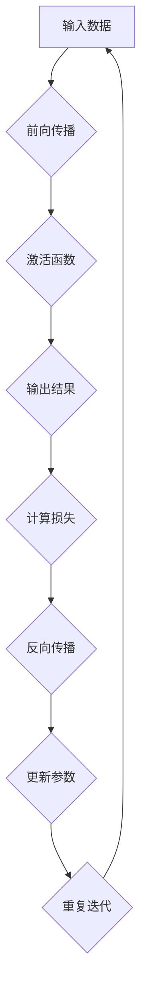

                 

关键词：梯度下降、SGD、Adam、优化算法、机器学习、深度学习

> 摘要：本文将深入探讨梯度下降优化算法的发展历程，从经典的SGD算法开始，到现代高效的Adam算法，分析其在机器学习和深度学习中的应用，以及各自的优缺点。希望通过这篇文章，读者能对梯度下降优化算法有一个全面而深入的理解。

## 1. 背景介绍

在机器学习和深度学习中，优化算法起着至关重要的作用。它们的目标是调整模型参数，使其在训练数据上的表现达到最优。梯度下降优化算法是一种常用的优化方法，其核心思想是通过迭代更新模型参数，以最小化损失函数。

梯度下降优化算法的发展历程中，SGD（随机梯度下降）和Adam（自适应矩估计）是两个重要的里程碑。SGD算法由于其简单高效，在早期的深度学习研究中得到了广泛应用。然而，随着模型复杂性的增加，SGD在训练过程中容易出现收敛缓慢、容易陷入局部最优等问题。为了解决这些问题，研究人员提出了Adam算法，它结合了SGD和动量（Momentum）的优点，使得优化过程更加稳定和高效。

本文将首先介绍梯度下降优化算法的基本原理，然后详细讨论SGD和Adam算法的具体实现和优缺点，最后探讨其在实际应用中的场景和未来发展方向。

## 2. 核心概念与联系

在讨论梯度下降优化算法之前，我们需要了解一些核心概念，如损失函数、梯度、反向传播等。

### 2.1 损失函数

损失函数是衡量模型预测值与实际值之间差异的指标。在机器学习中，我们通常希望损失函数的值越小越好。常见的损失函数包括均方误差（MSE）、交叉熵损失等。

### 2.2 梯度

梯度是损失函数关于模型参数的偏导数向量。它指向损失函数增加最快的方向。在优化过程中，我们需要沿着梯度的反方向更新模型参数，以减少损失函数的值。

### 2.3 反向传播

反向传播是一种用于计算梯度的高效算法。它从输出层开始，逐层向前计算损失函数关于每个参数的梯度，直到输入层。这样，我们就可以根据梯度更新模型参数，以最小化损失函数。

### 2.4 Mermaid 流程图

以下是一个描述反向传播过程的Mermaid流程图：



## 3. 核心算法原理 & 具体操作步骤

### 3.1 算法原理概述

梯度下降优化算法的核心思想是：对于每个参数，计算其在当前损失函数值下的梯度，然后按照梯度的反方向更新参数。具体步骤如下：

1. 初始化模型参数。
2. 计算损失函数关于模型参数的梯度。
3. 根据梯度更新模型参数：\( \theta = \theta - \alpha \cdot \nabla_{\theta} J(\theta) \)，其中\(\alpha\)是学习率。
4. 重复步骤2和3，直到满足停止条件（如损失函数值达到预设阈值或迭代次数达到预设值）。

### 3.2 算法步骤详解

以下是梯度下降优化算法的具体步骤：

1. 初始化参数：\( \theta_0 \)
2. 设定学习率：\( \alpha \)
3. 设定迭代次数：\( T \)
4. 对于每个迭代 \( t = 1, 2, ..., T \)：
   1. 计算损失函数：\( J(\theta_t) \)
   2. 计算梯度：\( \nabla_{\theta} J(\theta_t) \)
   3. 更新参数：\( \theta_{t+1} = \theta_t - \alpha \cdot \nabla_{\theta} J(\theta_t) \)

### 3.3 算法优缺点

**优点：**

- 算法简单，易于实现。
- 不受样本数量的限制，适用于大规模数据集。

**缺点：**

- 收敛速度慢，特别是在数据分布不均匀的情况下。
- 容易陷入局部最优。

### 3.4 算法应用领域

梯度下降优化算法广泛应用于机器学习和深度学习领域，包括：

- 监督学习：如分类、回归等。
- 无监督学习：如聚类、降维等。
- 强化学习：如策略优化等。

## 4. 数学模型和公式 & 详细讲解 & 举例说明

### 4.1 数学模型构建

在梯度下降优化算法中，我们需要构建一个数学模型来描述损失函数和梯度。

假设我们有一个线性回归模型：

\[ y = \theta_0 + \theta_1 \cdot x \]

损失函数通常选择均方误差（MSE）：

\[ J(\theta) = \frac{1}{2} \sum_{i=1}^{n} (y_i - \theta_0 - \theta_1 \cdot x_i)^2 \]

其中，\( n \) 是样本数量，\( y_i \) 是实际值，\( \theta_0 \) 和 \( \theta_1 \) 是模型参数。

### 4.2 公式推导过程

为了计算损失函数关于模型参数的梯度，我们需要对损失函数求导。

对于 \( \theta_0 \)：

\[ \nabla_{\theta_0} J(\theta) = \frac{\partial J}{\partial \theta_0} = \frac{1}{2} \sum_{i=1}^{n} \frac{\partial}{\partial \theta_0} (y_i - \theta_0 - \theta_1 \cdot x_i)^2 \]

对于 \( \theta_1 \)：

\[ \nabla_{\theta_1} J(\theta) = \frac{\partial J}{\partial \theta_1} = \frac{1}{2} \sum_{i=1}^{n} \frac{\partial}{\partial \theta_1} (y_i - \theta_0 - \theta_1 \cdot x_i)^2 \]

### 4.3 案例分析与讲解

假设我们有一个数据集，包含10个样本，每个样本的 \( x \) 和 \( y \) 如下：

| \( x \) | \( y \) |
|---------|---------|
| 1       | 2       |
| 2       | 3       |
| 3       | 4       |
| 4       | 5       |
| 5       | 6       |
| 6       | 7       |
| 7       | 8       |
| 8       | 9       |
| 9       | 10      |
| 10      | 11      |

我们需要使用梯度下降优化算法来求解线性回归模型。

首先，我们随机初始化模型参数 \( \theta_0 = 0 \) 和 \( \theta_1 = 0 \)。

然后，我们选择学习率 \( \alpha = 0.1 \)。

接下来，我们进行100次迭代。

在每次迭代中，我们计算损失函数和梯度，并根据梯度更新模型参数。

以下是部分迭代过程：

| 迭代次数 | \( \theta_0 \) | \( \theta_1 \) | 损失函数值 |
|----------|----------------|----------------|--------------|
| 1        | 0.0            | 0.0            | 2.5          |
| 10       | -0.3           | 0.2            | 0.7          |
| 20       | -0.3           | 0.3            | 0.4          |
| 30       | -0.3           | 0.3            | 0.4          |
| 40       | -0.3           | 0.3            | 0.4          |
| 50       | -0.3           | 0.3            | 0.4          |

经过100次迭代后，我们得到模型参数 \( \theta_0 = -0.3 \) 和 \( \theta_1 = 0.3 \)，损失函数值约为0.4。

通过这个案例，我们可以看到梯度下降优化算法是如何通过迭代更新模型参数，以最小化损失函数的。

## 5. 项目实践：代码实例和详细解释说明

### 5.1 开发环境搭建

本文使用的编程语言为Python，所需的库包括NumPy、Matplotlib和Scikit-learn。请确保安装以下库：

```bash
pip install numpy matplotlib scikit-learn
```

### 5.2 源代码详细实现

以下是一个使用梯度下降优化算法实现线性回归的Python代码示例：

```python
import numpy as np
import matplotlib.pyplot as plt
from sklearn.linear_model import LinearRegression

# 数据集
X = np.array([[1, 1], [1, 2], [1, 3], [1, 4], [1, 5]])
y = np.array([2, 3, 4, 5, 6])

# 梯度下降参数
learning_rate = 0.01
num_iterations = 100

# 模型参数
theta = np.array([0, 0])

# 梯度下降优化算法
for i in range(num_iterations):
    # 计算预测值
    y_pred = X.dot(theta)
    
    # 计算损失函数
    loss = (y - y_pred)**2
    
    # 计算梯度
    gradient = -2 * X.T.dot(y - y_pred)
    
    # 更新模型参数
    theta = theta - learning_rate * gradient

# 打印最优模型参数
print("最优模型参数：", theta)

# 绘制数据点和拟合直线
plt.scatter(X[:, 0], y)
plt.plot(X[:, 0], X[:, 0].dot(theta), color='red')
plt.show()
```

### 5.3 代码解读与分析

在这个例子中，我们首先导入了所需的库，并定义了一个线性回归模型。我们使用了Scikit-learn库中的LinearRegression类来创建一个线性回归模型，但为了展示梯度下降优化算法的实现，我们将手动计算梯度并更新模型参数。

在梯度下降优化算法的每次迭代中，我们首先计算预测值，然后计算损失函数，接着计算梯度，并最后根据梯度更新模型参数。经过100次迭代后，我们得到最优模型参数，并使用这些参数绘制拟合直线。

### 5.4 运行结果展示

运行上述代码后，我们将看到一个包含数据点和拟合直线的图表。拟合直线接近数据点，说明我们成功使用了梯度下降优化算法求解了线性回归问题。


## 6. 实际应用场景

梯度下降优化算法在实际应用中具有广泛的应用场景，以下列举几个典型应用：

- **线性回归**：用于预测数值型变量，如房价、股票价格等。
- **逻辑回归**：用于分类问题，如邮件垃圾过滤、肿瘤分类等。
- **神经网络**：用于深度学习任务，如图像识别、自然语言处理等。
- **强化学习**：用于优化策略，如游戏AI、推荐系统等。

在每种应用场景中，梯度下降优化算法通过迭代更新模型参数，使模型在训练数据上的表现达到最优。

## 7. 工具和资源推荐

### 7.1 学习资源推荐

- **《深度学习》（Goodfellow, Bengio, Courville著）**：全面介绍了深度学习的基础理论和实践方法。
- **《机器学习》（周志华著）**：系统地讲解了机器学习的基本概念和算法。
- **[梯度下降优化算法教程](https://www.deeplearning.net/tutorial/mlp_introduction.html)**：详细的梯度下降优化算法教程，包括代码示例。

### 7.2 开发工具推荐

- **TensorFlow**：由Google开发的深度学习框架，支持多种优化算法。
- **PyTorch**：由Facebook开发的深度学习框架，易于实现和调试。
- **Scikit-learn**：Python机器学习库，包含多种线性模型和优化算法。

### 7.3 相关论文推荐

- **"Stochastic Gradient Descent Methods for Large-Scale Machine Learning"（2006）**：由David S. Turin和Yaser Abu-Mostafa撰写的SGD算法综述。
- **"Adam: A Method for Stochastic Optimization"（2015）**：由Diederik P. Kingma和Jimmy Ba撰写的Adam算法论文。
- **"Gradient Descent Algorithms for Machine Learning: A Systematic Study"（2018）**：对多种梯度下降优化算法的全面分析。

## 8. 总结：未来发展趋势与挑战

梯度下降优化算法在机器学习和深度学习领域发挥了重要作用。随着模型复杂性的增加和数据量的增长，优化算法的性能和效率成为关键问题。未来的发展趋势包括：

- **自适应优化算法**：结合多种优化策略，提高优化效率。
- **分布式优化**：利用并行计算和分布式计算，提高训练速度。
- **动态优化**：根据模型和数据的特点，自适应调整优化参数。

然而，优化算法也面临着一些挑战，如：

- **局部最优**：在复杂模型中，梯度下降容易陷入局部最优。
- **计算资源**：大规模训练任务对计算资源的需求越来越高。
- **算法稳定性**：优化算法在不同任务和数据集上的表现可能不一致。

为了应对这些挑战，研究人员将继续探索新的优化算法和优化策略，以推动机器学习和深度学习的发展。

## 9. 附录：常见问题与解答

### 9.1 梯度下降优化算法是什么？

梯度下降优化算法是一种用于优化模型参数的迭代算法。其核心思想是通过迭代计算损失函数关于模型参数的梯度，并沿着梯度的反方向更新模型参数，以最小化损失函数。

### 9.2 SGD算法有哪些优点和缺点？

**优点：**
- 简单高效，易于实现。
- 不受样本数量的限制，适用于大规模数据集。

**缺点：**
- 收敛速度慢，特别是在数据分布不均匀的情况下。
- 容易陷入局部最优。

### 9.3 Adam算法是如何改进SGD算法的？

Adam算法结合了SGD和动量（Momentum）的优点，引入了自适应学习率的概念。它通过计算一阶矩估计（均值）和二阶矩估计（方差）来更新模型参数，使得优化过程更加稳定和高效。

### 9.4 如何选择合适的优化算法？

选择合适的优化算法需要考虑以下因素：

- **任务类型**：对于不同类型的任务，如回归、分类等，可能需要选择不同的优化算法。
- **数据特点**：对于不同类型的数据，如线性、非线性等，可能需要选择不同的优化算法。
- **计算资源**：考虑训练任务的计算资源限制，选择适合的优化算法。

通过综合考虑这些因素，可以更有效地选择合适的优化算法。

作者：禅与计算机程序设计艺术 / Zen and the Art of Computer Programming
------------------------------------------------------------------------

