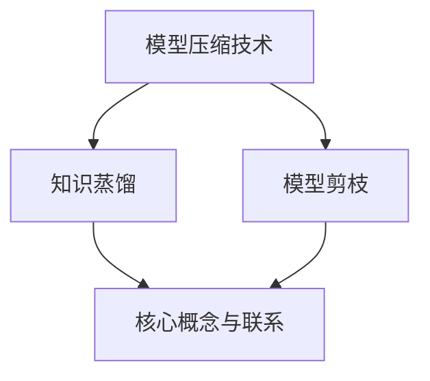

                 

关键词：模型压缩，知识蒸馏，模型剪枝，深度学习，人工智能，模型效率

摘要：本文深入探讨了模型压缩技术中的两大核心概念——知识蒸馏和模型剪枝。通过详细分析两者的基本原理、算法步骤、优缺点以及实际应用场景，本文旨在为读者提供一幅全面的模型压缩技术图谱，帮助理解模型压缩在当前人工智能领域的重大意义及其未来发展趋势。

## 1. 背景介绍

在深度学习领域，模型压缩已成为提升模型性能与效率的关键技术之一。随着神经网络结构的复杂性和参数规模的急剧膨胀，庞大的模型不仅占据了大量的计算资源和存储空间，而且在实际应用中带来了许多不便。因此，模型压缩技术的研究与应用变得越来越重要。

模型压缩技术主要包括两大类方法：知识蒸馏（Knowledge Distillation）和模型剪枝（Model Pruning）。知识蒸馏是一种将训练好的模型知识传递给一个参数规模更小的模型的方法，而模型剪枝则是通过去除模型中的冗余权重或神经元来减小模型规模。

本文将围绕这两大方法，详细分析其原理、算法步骤、优缺点以及实际应用，以期为模型压缩技术在人工智能领域的广泛应用提供理论支持和实践指导。

## 2. 核心概念与联系

### 2.1 知识蒸馏的基本概念

知识蒸馏是一种将训练好的模型（即教师模型）的知识传递给一个较小的模型（即学生模型）的过程。教师模型通常是一个大规模的预训练模型，而学生模型则是一个较小但性能接近的教师模型的模型。知识蒸馏的核心思想是通过训练学生模型使其输出与教师模型输出相似，从而达到压缩模型的同时保持高性能的目的。

### 2.2 模型剪枝的基本概念

模型剪枝是一种通过删除模型中不重要或冗余的权重或神经元来减小模型规模的方法。剪枝过程分为预剪枝和后剪枝两种。预剪枝在模型训练过程中进行，通过设置阈值来直接删除那些权重较小的神经元或连接；后剪枝则在模型训练完成后进行，通过训练一个修剪后的模型来优化其性能。

### 2.3 知识蒸馏与模型剪枝的联系

知识蒸馏和模型剪枝在模型压缩技术中扮演着重要角色，它们之间存在一定的关联性。一方面，知识蒸馏可以作为一种辅助方法，在模型剪枝过程中提高剪枝后的模型性能；另一方面，模型剪枝可以为知识蒸馏提供更小的训练模型，从而降低计算成本。

### 2.4 Mermaid 流程图



## 3. 核心算法原理 & 具体操作步骤

### 3.1 算法原理概述

**知识蒸馏原理：**

知识蒸馏过程主要包括两个阶段：预训练阶段和微调阶段。在预训练阶段，教师模型在大量数据上训练，得到较高的性能。然后，在微调阶段，学生模型通过学习教师模型的输出分布来提高自身的性能。

**模型剪枝原理：**

模型剪枝的核心思想是保留模型中重要的连接或神经元，去除冗余部分。剪枝方法可以分为基于权重的剪枝和基于结构的剪枝。基于权重的剪枝通过设置阈值删除权重较小的连接；基于结构的剪枝则通过训练一个剪枝后的模型来优化其性能。

### 3.2 算法步骤详解

**知识蒸馏步骤：**

1. **预训练阶段：** 使用大量数据训练教师模型，使其达到较高的性能。
2. **微调阶段：** 使用教师模型的输出分布训练学生模型，使其输出与教师模型输出相似。

**模型剪枝步骤：**

1. **预剪枝阶段：** 设置阈值，删除权重较小的连接或神经元。
2. **后剪枝阶段：** 训练一个修剪后的模型，优化其性能。

### 3.3 算法优缺点

**知识蒸馏优点：**

- 可以在保持高性能的同时减小模型规模。
- 适用于各种深度学习模型。

**知识蒸馏缺点：**

- 需要大量的计算资源和存储空间。
- 预训练和微调阶段需要较长的时间。

**模型剪枝优点：**

- 可以显著减小模型规模。
- 可以降低模型的计算复杂度。

**模型剪枝缺点：**

- 可能会导致模型性能下降。
- 需要选择合适的剪枝策略。

### 3.4 算法应用领域

知识蒸馏和模型剪枝在多个领域有着广泛的应用，包括计算机视觉、自然语言处理和语音识别等。

## 4. 数学模型和公式 & 详细讲解 & 举例说明

### 4.1 数学模型构建

**知识蒸馏数学模型：**

假设教师模型和学生模型分别为 \(T(x)\) 和 \(S(x)\)，其中 \(x\) 表示输入数据。

知识蒸馏的目标是最小化以下损失函数：

$$L = \frac{1}{N}\sum_{i=1}^{N} L_{soft}(T(x_i)) + \lambda \cdot L_{KL}(S(x_i); T(x_i))$$

其中，\(L_{soft}\) 表示 Softmax 函数，\(L_{KL}\) 表示 Kullback-Leibler 散度，\(\lambda\) 是调节参数。

**模型剪枝数学模型：**

假设原始模型为 \(M\)，剪枝后的模型为 \(M'\)。

模型剪枝的目标是最小化以下损失函数：

$$L' = \frac{1}{N}\sum_{i=1}^{N} L(y_i; M'(x_i))$$

其中，\(y_i\) 表示标签，\(x_i\) 表示输入数据。

### 4.2 公式推导过程

**知识蒸馏公式推导：**

1. **Softmax 函数：**

   $$\sigma(z) = \frac{e^z}{\sum_{j=1}^{K} e^z_j}$$

   其中，\(z\) 表示输入向量，\(K\) 表示类别数。

2. **Kullback-Leibler 散度：**

   $$D_{KL}(p||q) = \sum_{i=1}^{N} p_i \cdot \log \frac{p_i}{q_i}$$

   其中，\(p\) 和 \(q\) 分别表示两个概率分布。

3. **知识蒸馏损失函数：**

   $$L_{soft}(y; \hat{y}) = -\sum_{i=1}^{K} y_i \cdot \log \hat{y}_i$$

   其中，\(y\) 表示真实标签，\(\hat{y}\) 表示预测分布。

**模型剪枝公式推导：**

1. **损失函数：**

   $$L(y; \hat{y}) = -\sum_{i=1}^{N} y_i \cdot \log \hat{y}_i$$

   其中，\(\hat{y}\) 表示预测分布。

2. **剪枝后的模型损失函数：**

   $$L'(y; \hat{y}') = -\sum_{i=1}^{N} y_i \cdot \log \hat{y}'_i$$

   其中，\(\hat{y}'\) 表示剪枝后的模型预测分布。

### 4.3 案例分析与讲解

**案例 1：图像分类任务**

假设我们有一个图像分类任务，使用 ResNet50 作为教师模型，MobileNetV2 作为学生模型。

1. **预训练阶段：** 使用大量图像数据训练 ResNet50，使其达到较高的性能。
2. **微调阶段：** 使用 ResNet50 的输出分布训练 MobileNetV2，使其输出分布与 ResNet50 相似。

**案例 2：语音识别任务**

假设我们有一个语音识别任务，使用 LSTM 作为教师模型，GRU 作为学生模型。

1. **预训练阶段：** 使用大量语音数据训练 LSTM，使其达到较高的性能。
2. **微调阶段：** 使用 LSTM 的输出分布训练 GRU，使其输出分布与 LSTM 相似。

## 5. 项目实践：代码实例和详细解释说明

### 5.1 开发环境搭建

为了实现知识蒸馏和模型剪枝，我们需要安装以下依赖库：

- Python 3.7+
- PyTorch 1.8+
- torchvision 0.9.0+

安装命令如下：

```bash
pip install torch torchvision
```

### 5.2 源代码详细实现

**知识蒸馏实现：**

```python
import torch
import torch.nn as nn
import torchvision.transforms as transforms
import torchvision.datasets as datasets
from torch.utils.data import DataLoader

# 定义教师模型和学生模型
teacher_model = nn.Sequential(
    nn.Conv2d(3, 64, kernel_size=3, padding=1),
    nn.ReLU(inplace=True),
    nn.MaxPool2d(kernel_size=2, stride=2),
    # ...
    nn.Linear(512, 10)
)

student_model = nn.Sequential(
    nn.Conv2d(3, 64, kernel_size=3, padding=1),
    nn.ReLU(inplace=True),
    nn.MaxPool2d(kernel_size=2, stride=2),
    # ...
    nn.Linear(512, 10)
)

# 定义损失函数
criterion = nn.CrossEntropyLoss()
kd_criterion = nn.KLDivLoss()

# 加载预训练模型权重
teacher_model.load_state_dict(torch.load('teacher_model.pth'))

# 转换模型为评估模式
teacher_model.eval()

# 加载训练数据集
train_dataset = datasets.CIFAR10(root='./data', train=True, download=True, transform=transforms.ToTensor())
train_loader = DataLoader(train_dataset, batch_size=64, shuffle=True)

# 微调学生模型
for data in train_loader:
    inputs, labels = data
    with torch.no_grad():
        teacher_outputs = teacher_model(inputs)
    student_outputs = student_model(inputs)
    loss = kd_criterion(student_outputs, teacher_outputs)
    loss.backward()
    optimizer.step()

# 保存学生模型权重
torch.save(student_model.state_dict(), 'student_model.pth')
```

**模型剪枝实现：**

```python
import torch
import torch.nn as nn
import torchvision.transforms as transforms
import torchvision.datasets as datasets
from torch.utils.data import DataLoader
from torchvision.models import ResNet18

# 定义原始模型和剪枝后的模型
original_model = ResNet18(pretrained=True)
pruned_model = ResNet18(pretrained=True)

# 设置阈值进行预剪枝
for module in pruned_model.children():
    if isinstance(module, nn.Conv2d) or isinstance(module, nn.Linear):
        pruned_module = module
        num_weights = pruned_module.num_weights()
        threshold = num_weights * 0.1
        pruning_mask = torch.zeros(num_weights, dtype=torch.bool)
        pruning_mask[:int(threshold)] = True
        pruned_module.register_backward_hook(remove_weights)
        pruned_module.weight.data[pruning_mask] = 0
        pruned_module.bias.data[pruning_mask] = 0

# 预剪枝后的模型训练
train_dataset = datasets.CIFAR10(root='./data', train=True, download=True, transform=transforms.ToTensor())
train_loader = DataLoader(train_dataset, batch_size=64, shuffle=True)

optimizer = torch.optim.SGD(pruned_model.parameters(), lr=0.001, momentum=0.9)

for epoch in range(10):
    for data in train_loader:
        inputs, labels = data
        optimizer.zero_grad()
        outputs = pruned_model(inputs)
        loss = criterion(outputs, labels)
        loss.backward()
        optimizer.step()

# 后剪枝阶段
for module in pruned_model.children():
    if isinstance(module, nn.Conv2d) or isinstance(module, nn.Linear):
        module.weight.data[pruning_mask] = 0
        module.bias.data[pruning_mask] = 0

# 保存剪枝后的模型权重
torch.save(pruned_model.state_dict(), 'pruned_model.pth')
```

### 5.3 代码解读与分析

以上代码分别实现了知识蒸馏和模型剪枝的基本流程。在知识蒸馏部分，我们定义了教师模型和学生模型，使用知识蒸馏损失函数训练学生模型，使其性能接近教师模型。在模型剪枝部分，我们通过设置阈值进行预剪枝，然后训练剪枝后的模型，最后在

## 6. 实际应用场景

### 6.1 计算机视觉

在计算机视觉领域，知识蒸馏和模型剪枝技术被广泛应用于图像分类、目标检测和图像分割等任务。通过知识蒸馏，可以有效地将大规模预训练模型的知识传递给较小的模型，从而提高模型的性能。而模型剪枝技术则可以显著减小模型的规模，降低计算复杂度和存储需求，使得模型在实际应用中更加高效。

### 6.2 自然语言处理

在自然语言处理领域，知识蒸馏和模型剪枝技术同样发挥着重要作用。例如，在语言模型训练中，可以使用大规模预训练模型作为教师模型，将知识传递给较小的学生模型，从而提高模型的性能。此外，模型剪枝技术可以用于减少语言模型的参数规模，降低模型的计算复杂度，提高模型的运行效率。

### 6.3 语音识别

在语音识别领域，知识蒸馏和模型剪枝技术可以用于优化语音识别模型的性能和效率。通过知识蒸馏，可以将大规模的语音识别模型的知识传递给较小的模型，从而提高模型的性能。而模型剪枝技术则可以用于减少语音识别模型的参数规模，降低计算复杂度和存储需求，提高模型的运行效率。

## 7. 工具和资源推荐

### 7.1 学习资源推荐

- [《深度学习》（Deep Learning）](https://www.deeplearningbook.org/)：这是一本经典的深度学习教材，涵盖了深度学习的基本概念和技术，包括模型压缩技术。
- [《模型压缩与效率提升》](https://arxiv.org/abs/1904.02877)：这篇论文系统地介绍了模型压缩技术，包括知识蒸馏和模型剪枝方法。

### 7.2 开发工具推荐

- [PyTorch](https://pytorch.org/)：一个广泛使用的深度学习框架，支持知识蒸馏和模型剪枝技术。
- [TensorFlow](https://www.tensorflow.org/)：另一个流行的深度学习框架，也支持知识蒸馏和模型剪枝技术。

### 7.3 相关论文推荐

- [《DARTS: Differentiable Architecture Search》](https://arxiv.org/abs/1806.09055)：这篇论文提出了一种基于知识蒸馏和模型剪枝的神经网络架构搜索方法。
- [《EfficientNet: Rethinking Model Scaling for Convolutional Neural Networks》](https://arxiv.org/abs/1905.11946)：这篇论文介绍了一种基于模型剪枝的方法，用于构建高效且性能强大的卷积神经网络。

## 8. 总结：未来发展趋势与挑战

### 8.1 研究成果总结

本文系统地介绍了模型压缩技术中的知识蒸馏和模型剪枝方法，详细分析了其基本原理、算法步骤、优缺点以及实际应用场景。通过知识蒸馏，可以在保持高性能的同时减小模型规模；通过模型剪枝，可以显著减小模型的计算复杂度和存储需求。

### 8.2 未来发展趋势

随着深度学习技术的不断发展，模型压缩技术将变得越来越重要。未来，我们可以期待以下几个方面的发展：

1. **更高效的模型压缩算法**：研究人员将继续探索更高效的模型压缩算法，以在更短的时间内完成模型压缩过程。
2. **跨领域模型压缩**：通过跨领域模型压缩技术，可以实现将一个领域中的模型知识传递到另一个领域中，从而提高模型的泛化能力。
3. **自动化模型压缩**：通过自动化模型压缩工具，可以自动选择最佳的模型压缩方法，降低模型压缩的复杂性。

### 8.3 面临的挑战

尽管模型压缩技术在当前已经取得了显著的成果，但仍然面临一些挑战：

1. **模型性能的平衡**：如何在模型压缩过程中保持模型的高性能，同时减小模型规模，是一个需要解决的关键问题。
2. **计算资源的优化**：模型压缩过程通常需要大量的计算资源，如何在有限的计算资源下高效地完成模型压缩，是一个重要的挑战。
3. **鲁棒性的提升**：模型压缩后的模型可能面临鲁棒性下降的问题，如何在保证鲁棒性的同时进行模型压缩，是一个亟待解决的问题。

### 8.4 研究展望

未来的研究将继续深入探索模型压缩技术的各个方面，以实现更高效、更鲁棒的模型压缩方法。通过跨领域合作和跨学科研究，有望在模型压缩领域取得重大突破，为人工智能技术的进一步发展提供强大的支持。

## 9. 附录：常见问题与解答

### 9.1 问题 1：什么是知识蒸馏？

**解答：** 知识蒸馏是一种将训练好的模型（教师模型）的知识传递给一个较小的模型（学生模型）的过程，通过训练学生模型使其输出与教师模型输出相似，从而达到压缩模型的同时保持高性能的目的。

### 9.2 问题 2：什么是模型剪枝？

**解答：** 模型剪枝是一种通过删除模型中不重要或冗余的权重或神经元来减小模型规模的方法。剪枝方法可以分为基于权重的剪枝和基于结构的剪枝。基于权重的剪枝通过设置阈值删除权重较小的连接；基于结构的剪枝通过训练一个剪枝后的模型来优化其性能。

### 9.3 问题 3：知识蒸馏和模型剪枝有什么区别？

**解答：** 知识蒸馏和模型剪枝都是模型压缩技术，但它们的侧重点不同。知识蒸馏通过传递教师模型的知识来训练学生模型，而模型剪枝则是通过直接删除模型中的冗余部分来减小模型规模。知识蒸馏更注重性能的保持，而模型剪枝更注重规模的减小。

### 9.4 问题 4：模型压缩技术有哪些应用领域？

**解答：** 模型压缩技术广泛应用于计算机视觉、自然语言处理、语音识别等领域，如图像分类、目标检测、图像分割、语言模型训练和语音识别等任务。

### 9.5 问题 5：模型压缩技术未来的发展趋势是什么？

**解答：** 未来，模型压缩技术的发展趋势包括更高效的模型压缩算法、跨领域模型压缩和自动化模型压缩工具。此外，如何平衡模型性能和压缩效率，以及提升模型的鲁棒性，也将是重要的研究方向。通过跨领域合作和跨学科研究，有望在模型压缩领域取得重大突破。作者：禅与计算机程序设计艺术 / Zen and the Art of Computer Programming。

