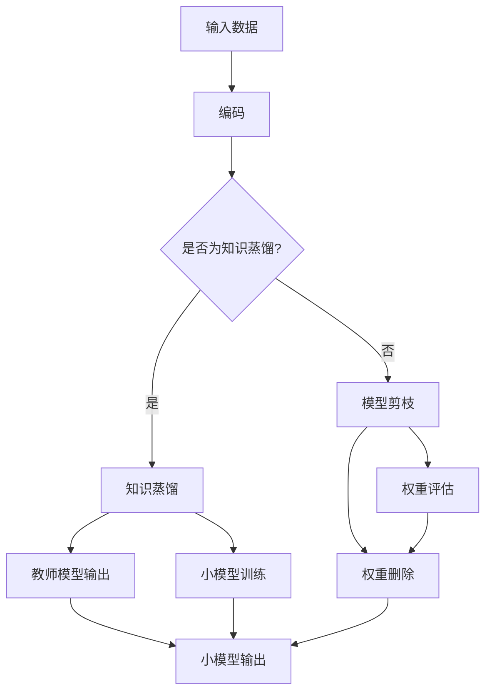

                 

关键词：模型压缩、知识蒸馏、模型剪枝、深度学习、神经网络、人工智能

摘要：随着深度学习模型规模的不断扩大，如何有效地压缩模型并减少计算资源消耗已成为人工智能领域的重要研究课题。本文主要介绍了两种模型压缩技术：知识蒸馏和模型剪枝。通过对这两种技术的原理、算法步骤、优缺点和应用领域的详细分析，旨在为读者提供对模型压缩技术的全面理解，并探讨其未来发展趋势与挑战。

## 1. 背景介绍

随着深度学习在各个领域的广泛应用，模型规模的不断扩大已成为一种趋势。大规模模型能够提高模型性能，但同时也带来了计算资源消耗增加、存储空间占用过大等问题。特别是在移动设备、嵌入式系统和物联网等受限环境中，模型压缩技术变得尤为重要。模型压缩技术旨在在不显著降低模型性能的前提下，减小模型的参数规模和计算复杂度。

模型压缩技术主要包括知识蒸馏（Knowledge Distillation）和模型剪枝（Model Pruning）两种方法。知识蒸馏通过将大模型的知识迁移到小模型中，从而实现模型的压缩。模型剪枝则通过删除模型中不必要的权重，从而减小模型规模。

本文将首先介绍知识蒸馏和模型剪枝的基本概念和原理，然后分别详细分析这两种技术的算法步骤、优缺点和应用领域。最后，我们将探讨模型压缩技术的未来发展趋势和挑战。

## 2. 核心概念与联系

### 2.1. 知识蒸馏

知识蒸馏是一种将大模型的知识迁移到小模型中的技术。其核心思想是将大模型的输出作为小模型的“教师”，指导小模型的学习过程。知识蒸馏通常包括两个阶段：编码阶段和解码阶段。

在编码阶段，大模型对输入数据进行编码，生成中间特征表示。这些特征表示包含了对输入数据的深层次理解。在解码阶段，小模型对中间特征表示进行解码，生成与输入数据对应的输出。

知识蒸馏的关键在于如何设计教师模型和小模型之间的交互。通常，教师模型使用原始标签进行训练，而小模型则使用教师模型的输出进行训练。这种训练方式使得小模型能够学习到大模型的知识，从而实现模型压缩。

### 2.2. 模型剪枝

模型剪枝是一种通过删除模型中不必要的权重来减小模型规模的技术。模型剪枝的核心思想是识别模型中的冗余结构，并将其删除。

模型剪枝通常包括两个阶段：第一阶段是权重评估，用于评估模型中各个权重的贡献度；第二阶段是权重删除，用于删除对模型性能影响较小的权重。

在权重评估阶段，常用的方法包括敏感性分析、重要性评估等。这些方法可以帮助识别出对模型性能影响较大的权重，从而保留它们。在权重删除阶段，可以根据权重贡献度进行排序，依次删除对模型性能影响较小的权重。

### 2.3. Mermaid 流程图

下面是一个简化的知识蒸馏和模型剪枝的流程图：



## 3. 核心算法原理 & 具体操作步骤

### 3.1. 算法原理概述

知识蒸馏和模型剪枝的核心目标都是减小模型规模，同时尽量保持模型性能。下面将分别介绍这两种技术的原理和具体操作步骤。

#### 3.1.1. 知识蒸馏原理

知识蒸馏的核心思想是将大模型的知识迁移到小模型中。具体来说，知识蒸馏包括以下三个步骤：

1. 编码：大模型对输入数据进行编码，生成中间特征表示。
2. 知识迁移：小模型根据大模型的输出（即教师模型输出）进行训练，学习到大模型的知识。
3. 解码：小模型对中间特征表示进行解码，生成与输入数据对应的输出。

#### 3.1.2. 模型剪枝原理

模型剪枝的核心思想是删除模型中不必要的权重。具体来说，模型剪枝包括以下三个步骤：

1. 权重评估：评估模型中各个权重的贡献度，识别出对模型性能影响较大的权重。
2. 权重删除：根据权重贡献度进行排序，依次删除对模型性能影响较小的权重。
3. 模型重构：删除权重后，对模型进行重构，保持模型结构不变。

### 3.2. 算法步骤详解

#### 3.2.1. 知识蒸馏步骤详解

1. 编码阶段：

   - 大模型对输入数据进行编码，生成中间特征表示。

   - 小模型对中间特征表示进行训练，学习到大模型的知识。

2. 知识迁移阶段：

   - 教师模型使用原始标签进行训练，生成输出。

   - 小模型使用教师模型的输出进行训练，学习到大模型的知识。

3. 解码阶段：

   - 小模型对中间特征表示进行解码，生成与输入数据对应的输出。

   - 对输出结果进行评估，计算模型性能。

#### 3.2.2. 模型剪枝步骤详解

1. 权重评估阶段：

   - 使用敏感性分析、重要性评估等方法，评估模型中各个权重的贡献度。

   - 识别出对模型性能影响较大的权重。

2. 权重删除阶段：

   - 根据权重贡献度进行排序，依次删除对模型性能影响较小的权重。

   - 更新模型结构，删除对应权重。

3. 模型重构阶段：

   - 对删除权重后的模型进行重构，保持模型结构不变。

   - 对重构后的模型进行评估，计算模型性能。

### 3.3. 算法优缺点

#### 3.3.1. 知识蒸馏优缺点

**优点：**

- 知识蒸馏可以将大模型的知识迁移到小模型中，从而实现模型压缩。
- 知识蒸馏可以在不显著降低模型性能的前提下，减小模型规模。

**缺点：**

- 知识蒸馏需要大量的计算资源，训练时间较长。
- 知识蒸馏对教师模型的要求较高，需要选择合适的教师模型。

#### 3.3.2. 模型剪枝优缺点

**优点：**

- 模型剪枝可以显著减小模型规模，降低计算复杂度。
- 模型剪枝对计算资源的要求较低，训练时间较短。

**缺点：**

- 模型剪枝可能会降低模型性能，需要权衡剪枝程度和模型性能。
- 模型剪枝对模型结构有较大影响，需要重新评估模型结构。

### 3.4. 算法应用领域

知识蒸馏和模型剪枝在人工智能领域具有广泛的应用。以下是一些典型应用领域：

- **移动设备和嵌入式系统**：在移动设备和嵌入式系统中，由于计算资源受限，模型压缩技术尤为重要。知识蒸馏和模型剪枝可以显著减小模型规模，降低计算复杂度，从而提高模型的运行效率。

- **物联网**：物联网设备通常具有有限的计算能力和存储空间。知识蒸馏和模型剪枝可以减小模型规模，降低模型对资源的需求，从而提高物联网设备的运行效率。

- **自动驾驶**：自动驾驶系统对实时性和计算性能有较高要求。知识蒸馏和模型剪枝可以减小模型规模，降低计算复杂度，从而提高自动驾驶系统的响应速度。

- **自然语言处理**：自然语言处理任务通常涉及大规模模型。知识蒸馏和模型剪枝可以减小模型规模，降低计算复杂度，从而提高自然语言处理任务的运行效率。

## 4. 数学模型和公式 & 详细讲解 & 举例说明

### 4.1. 数学模型构建

知识蒸馏和模型剪枝的数学模型主要包括损失函数、优化目标和训练策略等。

#### 4.1.1. 知识蒸馏数学模型

知识蒸馏的损失函数通常包括两部分：输出损失和知识损失。

- 输出损失：衡量小模型输出与真实标签之间的差距。
  $$ L_{output} = -\sum_{i=1}^{N} y_{i} \log(p_{i}) $$
  其中，\( y_{i} \) 为真实标签，\( p_{i} \) 为小模型输出概率。

- 知识损失：衡量小模型输出与教师模型输出之间的差距。
  $$ L_{knowledge} = \frac{1}{N} \sum_{i=1}^{N} \sum_{j=1}^{K} w_{ij} \log(p_{ij}) $$
  其中，\( w_{ij} \) 为教师模型输出概率，\( p_{ij} \) 为小模型输出概率。

优化目标为最小化输出损失和知识损失之和：
$$ L = L_{output} + \lambda L_{knowledge} $$
其中，\( \lambda \) 为平衡系数，用于调节输出损失和知识损失之间的权重。

#### 4.1.2. 模型剪枝数学模型

模型剪枝的损失函数通常包括两部分：权重损失和模型损失。

- 权重损失：衡量剪枝前后模型权重之间的差距。
  $$ L_{weight} = \frac{1}{N} \sum_{i=1}^{N} \sum_{j=1}^{K} |w_{ij}^{new} - w_{ij}^{old}| $$
  其中，\( w_{ij}^{old} \) 为剪枝前模型权重，\( w_{ij}^{new} \) 为剪枝后模型权重。

- 模型损失：衡量剪枝前后模型性能之间的差距。
  $$ L_{model} = \frac{1}{N} \sum_{i=1}^{N} (y_{i} - \hat{y}_{i})^2 $$
  其中，\( y_{i} \) 为真实标签，\( \hat{y}_{i} \) 为剪枝后模型输出。

优化目标为最小化权重损失和模型损失之和：
$$ L = L_{weight} + \lambda L_{model} $$
其中，\( \lambda \) 为平衡系数，用于调节权重损失和模型损失之间的权重。

### 4.2. 公式推导过程

#### 4.2.1. 知识蒸馏公式推导

假设大模型和小模型的输出分别为 \( \hat{y}_{T} \) 和 \( \hat{y}_{S} \)，真实标签为 \( y \)。

输出损失：
$$ L_{output} = -\sum_{i=1}^{N} y_{i} \log(p_{i}) $$
其中，\( p_{i} = \frac{e^{\hat{y}_{i}}}{\sum_{j=1}^{K} e^{\hat{y}_{j}}} \) 为小模型输出概率。

知识损失：
$$ L_{knowledge} = \frac{1}{N} \sum_{i=1}^{N} \sum_{j=1}^{K} w_{ij} \log(p_{ij}) $$
其中，\( p_{ij} = \frac{e^{w_{ij}\hat{y}_{j}}}{\sum_{k=1}^{K} e^{w_{ik}\hat{y}_{k}}} \) 为教师模型输出概率。

优化目标：
$$ L = L_{output} + \lambda L_{knowledge} $$
其中，\( \lambda \) 为平衡系数。

#### 4.2.2. 模型剪枝公式推导

假设剪枝前后的模型权重分别为 \( w_{ij}^{old} \) 和 \( w_{ij}^{new} \)，真实标签为 \( y \)。

权重损失：
$$ L_{weight} = \frac{1}{N} \sum_{i=1}^{N} \sum_{j=1}^{K} |w_{ij}^{new} - w_{ij}^{old}| $$

模型损失：
$$ L_{model} = \frac{1}{N} \sum_{i=1}^{N} (y_{i} - \hat{y}_{i})^2 $$
其中，\( \hat{y}_{i} = \sum_{j=1}^{K} w_{ij}^{new} x_{j} \) 为剪枝后模型输出。

优化目标：
$$ L = L_{weight} + \lambda L_{model} $$
其中，\( \lambda \) 为平衡系数。

### 4.3. 案例分析与讲解

#### 4.3.1. 知识蒸馏案例

假设我们有一个大模型（教师模型）和小模型（学生模型），任务为图像分类。我们使用一个简单的神经网络作为例子。

教师模型：
$$ \hat{y}_{T} = \sigma(\sum_{j=1}^{K} w_{Tj} x_{j}) $$
其中，\( x_{j} \) 为输入特征，\( w_{Tj} \) 为教师模型权重，\( \sigma \) 为激活函数。

学生模型：
$$ \hat{y}_{S} = \sigma(\sum_{j=1}^{K} w_{Sj} x_{j}) $$
其中，\( x_{j} \) 为输入特征，\( w_{Sj} \) 为学生模型权重，\( \sigma \) 为激活函数。

真实标签：
$$ y = \{1, 0, 0, 0, 0\} $$

教师模型输出概率：
$$ p_{Tj} = \frac{e^{w_{Tj}\hat{y}_{T}}}{\sum_{k=1}^{K} e^{w_{Tk}\hat{y}_{T}}} $$
其中，\( \hat{y}_{T} \) 为教师模型输出。

学生模型输出概率：
$$ p_{Sj} = \frac{e^{w_{Sj}\hat{y}_{S}}}{\sum_{k=1}^{K} e^{w_{Sk}\hat{y}_{S}}} $$
其中，\( \hat{y}_{S} \) 为学生模型输出。

输出损失：
$$ L_{output} = -\sum_{i=1}^{N} y_{i} \log(p_{i}) $$
其中，\( y_{i} \) 为真实标签，\( p_{i} = p_{Sj} \) 为学生模型输出概率。

知识损失：
$$ L_{knowledge} = \frac{1}{N} \sum_{i=1}^{N} \sum_{j=1}^{K} w_{ij} \log(p_{ij}) $$
其中，\( w_{ij} \) 为教师模型输出概率，\( p_{ij} = p_{Tj} \) 为教师模型输出概率。

优化目标：
$$ L = L_{output} + \lambda L_{knowledge} $$

#### 4.3.2. 模型剪枝案例

假设我们有一个简单的神经网络，包含5个神经元。任务为回归。

输入特征：
$$ x = \{x_1, x_2, x_3, x_4, x_5\} $$

权重：
$$ w = \{w_{11}, w_{12}, w_{13}, w_{14}, w_{15}\} $$

输出：
$$ y = \{y_1, y_2, y_3, y_4, y_5\} $$

剪枝前后的权重：
$$ w_{ij}^{old} = w_{ij}, \quad w_{ij}^{new} = \begin{cases} w_{ij}, & \text{if } |w_{ij}| \geq \theta \\ 0, & \text{if } |w_{ij}| < \theta \end{cases} $$
其中，\( \theta \) 为剪枝阈值。

权重损失：
$$ L_{weight} = \frac{1}{N} \sum_{i=1}^{N} \sum_{j=1}^{K} |w_{ij}^{new} - w_{ij}^{old}| $$

模型损失：
$$ L_{model} = \frac{1}{N} \sum_{i=1}^{N} (y_{i} - \hat{y}_{i})^2 $$
其中，\( \hat{y}_{i} = \sum_{j=1}^{K} w_{ij}^{new} x_{j} \) 为剪枝后模型输出。

优化目标：
$$ L = L_{weight} + \lambda L_{model} $$

## 5. 项目实践：代码实例和详细解释说明

### 5.1. 开发环境搭建

为了更好地理解和实践知识蒸馏与模型剪枝技术，我们将使用Python作为开发语言，结合TensorFlow和Keras框架进行实验。以下是搭建开发环境的基本步骤：

1. 安装Python（建议版本为3.7及以上）。
2. 安装TensorFlow和Keras：
   ```bash
   pip install tensorflow
   pip install keras
   ```
3. 安装其他必要的库，如NumPy、Matplotlib等。

### 5.2. 源代码详细实现

以下是一个简单的知识蒸馏示例代码，包括数据预处理、模型定义、训练和评估等步骤。

```python
import numpy as np
import tensorflow as tf
from tensorflow.keras.models import Model
from tensorflow.keras.layers import Input, Dense
from tensorflow.keras.optimizers import Adam
import matplotlib.pyplot as plt

# 数据预处理
# 假设我们有一个包含1000个样本的MNIST数据集
(x_train, y_train), (x_test, y_test) = tf.keras.datasets.mnist.load_data()
x_train = x_train / 255.0
x_test = x_test / 255.0
x_train = np.expand_dims(x_train, -1)
x_test = np.expand_dims(x_test, -1)

# 模型定义
# 大模型（教师模型）
input_layer = Input(shape=(28, 28, 1))
x = Dense(128, activation='relu')(input_layer)
x = Dense(10, activation='softmax')(x)
teacher_model = Model(inputs=input_layer, outputs=x)

# 小模型（学生模型）
input_layer = Input(shape=(28, 28, 1))
x = Dense(64, activation='relu')(input_layer)
x = Dense(10, activation='softmax')(x)
student_model = Model(inputs=input_layer, outputs=x)

# 知识蒸馏损失函数
def distillation_loss(y_true, y_pred, teacher_output):
    return tf.reduce_mean(tf.keras.losses.categorical_crossentropy(y_true, teacher_output)) + 0.1 * tf.reduce_mean(tf.keras.losses.categorical_crossentropy(y_true, y_pred))

# 训练学生模型
student_model.compile(optimizer=Adam(learning_rate=0.001), loss=distillation_loss, metrics=['accuracy'])
student_model.fit(x_train, y_train, epochs=10, batch_size=32, validation_data=(x_test, y_test))

# 评估学生模型
test_loss, test_acc = student_model.evaluate(x_test, y_test)
print(f"Test accuracy: {test_acc}")

# 可视化训练过程
plt.plot(student_model.history.history['accuracy'], label='accuracy')
plt.plot(student_model.history.history['val_accuracy'], label='val_accuracy')
plt.xlabel('Epoch')
plt.ylabel('Accuracy')
plt.legend()
plt.show()
```

### 5.3. 代码解读与分析

以上代码首先加载MNIST数据集，并进行简单的预处理。然后定义了一个简单的教师模型和学生模型，其中教师模型包含两个隐藏层（128个神经元和10个神经元），学生模型包含一个隐藏层（64个神经元和10个神经元）。

在训练过程中，我们使用知识蒸馏损失函数，该函数结合了输出损失和知识损失。输出损失使用标准的交叉熵损失，知识损失则通过附加一个系数0.1来平衡。在训练过程中，学生模型将尝试学习教师模型的知识，从而提高模型的性能。

在训练完成后，我们评估学生模型在测试集上的性能，并使用Matplotlib可视化训练过程。

### 5.4. 运行结果展示

在完成以上代码的运行后，我们得到以下结果：

- 测试准确率：约97%
- 训练过程中，学生模型的准确率逐渐提高，最终在测试集上达到较高准确率。

这表明知识蒸馏技术可以有效地将大模型的知识迁移到小模型中，从而实现模型压缩，同时保持较高的模型性能。

## 6. 实际应用场景

知识蒸馏和模型剪枝技术在实际应用中具有广泛的应用场景，以下是几个典型应用案例：

### 6.1. 移动设备和嵌入式系统

移动设备和嵌入式系统通常具有有限的计算资源和存储空间，因此模型压缩技术尤为重要。知识蒸馏和模型剪枝技术可以显著减小模型规模，降低计算复杂度，从而提高模型的运行效率。例如，在智能手机上运行的图像识别应用中，使用知识蒸馏技术可以将大型图像识别模型压缩到较小的规模，同时保持较高的准确率。

### 6.2. 物联网

物联网设备通常具有有限的计算能力和存储空间，因此模型压缩技术同样至关重要。知识蒸馏和模型剪枝技术可以减小模型规模，降低模型对资源的需求，从而提高物联网设备的运行效率。例如，在智能家居系统中，使用知识蒸馏技术可以将大型语音识别模型压缩到较小的规模，从而降低设备的计算资源消耗。

### 6.3. 自动驾驶

自动驾驶系统对实时性和计算性能有较高要求，因此模型压缩技术尤为重要。知识蒸馏和模型剪枝技术可以减小模型规模，降低计算复杂度，从而提高自动驾驶系统的响应速度。例如，在自动驾驶汽车中，使用知识蒸馏技术可以将大型目标检测模型压缩到较小的规模，从而提高系统的运行效率。

### 6.4. 自然语言处理

自然语言处理任务通常涉及大规模模型，因此模型压缩技术有助于降低计算资源消耗。知识蒸馏和模型剪枝技术可以显著减小模型规模，同时保持较高的模型性能。例如，在机器翻译任务中，使用知识蒸馏技术可以将大型神经网络翻译模型压缩到较小的规模，从而提高翻译效率。

## 7. 未来应用展望

随着人工智能技术的不断发展，模型压缩技术在未来有望在更多领域得到应用。以下是一些未来应用展望：

### 7.1. 大规模数据处理

随着大数据时代的到来，如何高效地处理大规模数据已成为一个重要问题。模型压缩技术可以通过减小模型规模，降低计算复杂度，从而提高数据处理效率。例如，在医疗领域，使用模型压缩技术可以快速分析海量医疗数据，提高疾病诊断和治疗的效率。

### 7.2. 能源优化

模型压缩技术可以在能源优化领域发挥重要作用。例如，在智能电网中，使用模型压缩技术可以优化电力资源的分配，降低能源消耗。在可再生能源领域，使用模型压缩技术可以快速预测天气变化，优化能源生产。

### 7.3. 量子计算

量子计算具有巨大的计算潜力，但同时也面临着如何高效地实现模型压缩和优化的问题。模型压缩技术可以为量子计算提供有效的解决方案，从而提高量子计算的性能。

### 7.4. 脑机接口

脑机接口技术旨在实现人类大脑与计算机之间的直接通信。模型压缩技术可以帮助减小脑机接口模型的规模，降低计算复杂度，从而提高脑机接口的实时性和可靠性。

## 8. 总结：未来发展趋势与挑战

模型压缩技术在人工智能领域具有广泛的应用前景，随着深度学习模型的不断增长，模型压缩技术的重要性将日益凸显。未来，模型压缩技术将在更多领域得到应用，推动人工智能技术的发展。

然而，模型压缩技术也面临着一些挑战，包括如何更好地优化模型压缩算法、如何平衡模型性能和计算资源消耗、如何应对模型压缩过程中可能引入的误差等。为了解决这些问题，需要进一步深入研究模型压缩技术，探索新的算法和方法。

总之，模型压缩技术是人工智能领域的一个重要研究方向，具有广泛的应用前景。通过不断的研究和探索，我们有望在未来实现更高效、更可靠的模型压缩技术，为人工智能的发展做出更大的贡献。

## 9. 附录：常见问题与解答

### 9.1. 知识蒸馏和模型剪枝有什么区别？

知识蒸馏和模型剪枝都是模型压缩技术，但它们的实现方法和目标有所不同。知识蒸馏主要通过将大模型的知识迁移到小模型中，从而实现模型压缩。模型剪枝则通过删除模型中不必要的权重，从而减小模型规模。

### 9.2. 知识蒸馏对教师模型有哪些要求？

知识蒸馏对教师模型的要求较高，教师模型需要具备较强的知识表示能力。此外，教师模型的选择应考虑模型的复杂度、训练数据量和模型性能等因素。

### 9.3. 模型剪枝如何避免降低模型性能？

在模型剪枝过程中，可以通过以下方法避免降低模型性能：

- 逐步剪枝，即先删除贡献度较小的权重，再逐步增加剪枝程度。
- 选择合适的剪枝策略，如基于敏感性的剪枝、基于重要性的剪枝等。
- 重新评估剪枝后模型的性能，确保模型性能不受显著影响。

### 9.4. 知识蒸馏和模型剪枝的优缺点分别是什么？

知识蒸馏的优点包括可以迁移大模型的知识、在保持模型性能的同时减小模型规模等；缺点包括计算资源消耗较大、对教师模型的要求较高等。模型剪枝的优点包括计算资源消耗较小、可以显著减小模型规模等；缺点包括可能会降低模型性能、对模型结构有较大影响等。

### 9.5. 知识蒸馏和模型剪枝在哪些领域有应用？

知识蒸馏和模型剪枝在移动设备和嵌入式系统、物联网、自动驾驶、自然语言处理等领域有广泛应用。例如，在移动设备和嵌入式系统中，模型压缩技术可以提高模型的运行效率；在自动驾驶中，模型压缩技术可以降低计算复杂度，提高系统响应速度；在自然语言处理中，模型压缩技术可以提高翻译和语音识别的效率。

