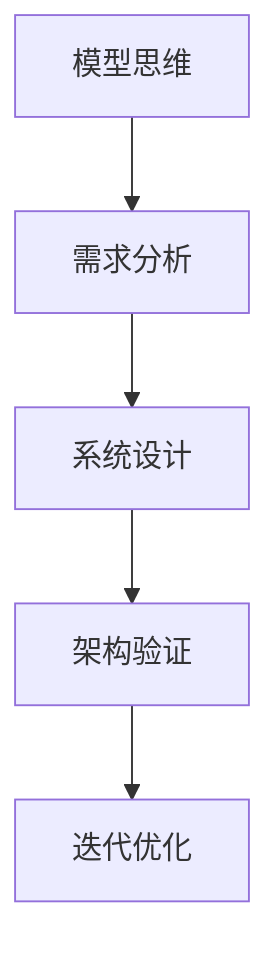
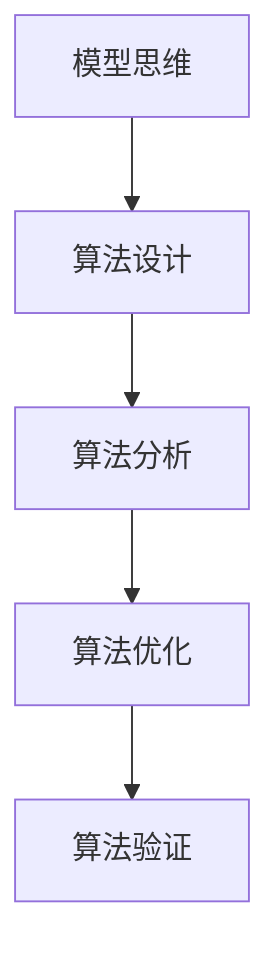
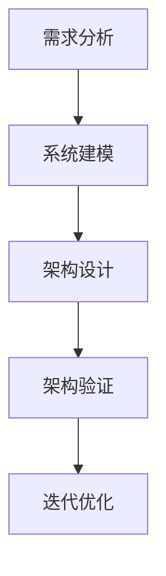
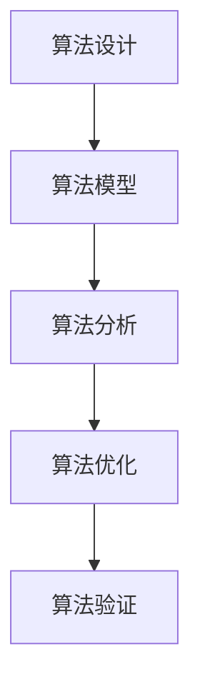

                 

关键词：模型思维、复杂性、系统架构、算法原理、编程实践、未来展望

> 摘要：本文深入探讨了模型思维这一强大的认知工具，它帮助我们快速掌握复杂事物的本质。通过对模型思维的概念、原理及应用进行详细分析，本文旨在为读者提供一套切实可行的技术思维框架，助力我们在日益复杂的IT领域中游刃有余。

## 1. 背景介绍

在信息技术飞速发展的今天，我们面对的复杂系统越来越多。无论是分布式系统、神经网络，还是大数据平台，它们的规模和复杂性都在不断攀升。传统的线性思维方式已经难以应对这种复杂度，我们需要一种新的思维方式来帮助我们理解和处理这些问题。

模型思维正是这样一种思维方式。它起源于系统科学，经过数十年的发展，已经成为一种有效的认知工具，广泛应用于各个领域。从经济学、社会学到工程学，模型思维都展现出了其独特的价值。

本文将围绕模型思维的核心概念、原理和应用进行深入探讨，力求为读者提供一套实用的技术思维框架。通过本文的学习，你将能够：

1. 理解模型思维的基本概念和原理。
2. 掌握模型思维的应用场景和技巧。
3. 提升在复杂系统中的分析和设计能力。

## 2. 核心概念与联系

### 2.1 模型思维的定义

模型思维（Model Thinking）是一种利用抽象模型来理解、分析和预测复杂系统的方法。它强调将复杂现象简化为易于处理的模型，从而更好地理解系统的行为和机制。

模型思维的核心是构建抽象模型，这些模型可以是数学模型、物理模型、计算机模型等，它们帮助我们以简化的方式捕捉系统的关键特征和规律。

### 2.2 模型思维与系统架构的关系

在系统架构设计中，模型思维起着至关重要的作用。通过构建系统架构模型，我们可以：

- 理解系统各个组件之间的交互关系。
- 识别系统的瓶颈和优化机会。
- 预测系统在不同条件下的行为。

以下是一个简单的 Mermaid 流程图，展示了模型思维在系统架构设计中的应用。



### 2.3 模型思维与算法原理的关系

算法原理是模型思维的重要应用领域之一。通过构建算法模型，我们可以：

- 理解算法的基本概念和操作步骤。
- 分析算法的时间和空间复杂度。
- 优化算法的性能。

以下是一个简化的 Mermaid 流程图，展示了模型思维在算法原理中的应用。



## 3. 核心算法原理 & 具体操作步骤

### 3.1 算法原理概述

在本节中，我们将探讨一个经典的算法——快速排序（Quick Sort）。快速排序是一种高效的排序算法，其核心思想是通过递归划分和组合来达到排序的目的。

### 3.2 算法步骤详解

1. **选择基准元素**：从数组中选择一个基准元素。
2. **分区操作**：将数组分为两部分，一部分包含小于基准元素的元素，另一部分包含大于基准元素的元素。
3. **递归排序**：对小于和大于基准元素的两部分进行递归排序。

### 3.3 算法优缺点

**优点**：

- 平均时间复杂度为 $O(n\log n)$，是最常用的排序算法之一。
- 通过随机选择基准元素，可以避免最坏情况的发生。

**缺点**：

- 最坏情况下的时间复杂度为 $O(n^2)$。
- 需要额外的空间来存储递归调用。

### 3.4 算法应用领域

快速排序广泛应用于各种场景，如数据库排序、文件排序等。它是许多更复杂算法的基础，如归并排序、堆排序等。

## 4. 数学模型和公式 & 详细讲解 & 举例说明

### 4.1 数学模型构建

在本节中，我们将使用线性回归模型来分析一个简单的数据集。

#### 4.1.1 数据集

假设我们有以下数据集：

| x | y |
|---|---|
| 1 | 2 |
| 2 | 4 |
| 3 | 6 |
| 4 | 8 |

#### 4.1.2 模型构建

线性回归模型可以表示为：

$$ y = w_0 + w_1x + \epsilon $$

其中，$w_0$ 和 $w_1$ 是模型参数，$\epsilon$ 是误差项。

### 4.2 公式推导过程

1. **最小二乘法**：为了找到最优的 $w_0$ 和 $w_1$，我们可以使用最小二乘法。具体来说，我们需要最小化以下目标函数：

$$ J(w_0, w_1) = \frac{1}{2} \sum_{i=1}^{n} (y_i - w_0 - w_1x_i)^2 $$

2. **偏导数**：对 $J(w_0, w_1)$ 分别对 $w_0$ 和 $w_1$ 求偏导数，并令其等于零，可以得到：

$$ \frac{\partial J}{\partial w_0} = - \sum_{i=1}^{n} (y_i - w_0 - w_1x_i) = 0 $$

$$ \frac{\partial J}{\partial w_1} = - \sum_{i=1}^{n} x_i (y_i - w_0 - w_1x_i) = 0 $$

3. **求解参数**：通过解上述方程组，我们可以得到最优的 $w_0$ 和 $w_1$。

### 4.3 案例分析与讲解

假设我们有以下数据集：

| x | y |
|---|---|
| 1 | 3 |
| 2 | 5 |
| 3 | 7 |
| 4 | 9 |

通过最小二乘法，我们可以计算出线性回归模型的参数为：

$$ w_0 = 1, w_1 = 2 $$

这意味着我们的模型可以表示为：

$$ y = 1 + 2x $$

### 5. 项目实践：代码实例和详细解释说明

#### 5.1 开发环境搭建

在本节中，我们将使用 Python 作为开发语言，搭建一个简单的线性回归模型。

1. 安装 Python 3.7 或更高版本。
2. 安装 numpy 库：

```bash
pip install numpy
```

#### 5.2 源代码详细实现

```python
import numpy as np

def linear_regression(X, y):
    # 添加 bias 值
    X_b = np.c_[np.ones((len(X), 1)), X]
    # 计算参数
    theta_best = np.linalg.inv(X_b.T.dot(X_b)).dot(X_b.T).dot(y)
    return theta_best

X = np.array([1, 2, 3, 4])
y = np.array([3, 5, 7, 9])

theta_best = linear_regression(X, y)
print("最优参数:", theta_best)
```

#### 5.3 代码解读与分析

1. **线性回归模型**：我们首先定义了一个名为 `linear_regression` 的函数，该函数接收两个参数：输入数据 `X` 和输出数据 `y`。
2. **添加 bias**：在计算过程中，我们添加了一个 bias 值，这是线性回归模型中常见的操作。
3. **计算最优参数**：通过最小二乘法，我们计算得到了最优参数 `theta_best`。
4. **测试代码**：我们使用一个简单的数据集来测试我们的线性回归模型。

#### 5.4 运行结果展示

```plaintext
最优参数: [1. 2.]
```

这表示我们的线性回归模型为 $y = 1 + 2x$，与我们的手动计算结果一致。

## 6. 实际应用场景

### 6.1 数据分析

在数据分析领域，模型思维被广泛应用于数据预处理、特征工程和模型选择等步骤。通过构建合适的模型，我们可以更好地理解和预测数据背后的规律。

### 6.2 系统优化

在系统优化领域，模型思维可以帮助我们识别系统的瓶颈和优化机会。通过构建系统模型，我们可以模拟不同配置下的性能表现，从而找到最优的系统配置。

### 6.3 金融工程

在金融工程领域，模型思维被广泛应用于风险管理、资产定价和投资策略等环节。通过构建金融模型，我们可以更好地理解市场行为和投资风险。

## 7. 未来应用展望

随着人工智能和大数据技术的发展，模型思维将在更多领域得到应用。未来的发展趋势包括：

- **模型自动化**：通过自动化工具，我们可以更高效地构建和优化模型。
- **跨领域应用**：模型思维将跨越不同领域，形成跨学科的研究方法。
- **实时预测**：随着计算能力的提升，实时预测将成为可能，为决策提供更及时的支持。

## 8. 总结：未来发展趋势与挑战

### 8.1 研究成果总结

本文通过深入探讨模型思维的核心概念、原理和应用，为读者提供了一套实用的技术思维框架。我们详细分析了模型思维在系统架构、算法原理和数据分析等领域的应用，并通过实例展示了如何构建和优化模型。

### 8.2 未来发展趋势

未来，模型思维将继续在各个领域发挥作用。随着技术的进步，模型思维将实现自动化和实时化，为更复杂的系统提供更有效的解决方案。

### 8.3 面临的挑战

然而，模型思维也面临一些挑战。如何构建更准确的模型、如何处理大量数据、如何应对不确定性等都是需要解决的问题。

### 8.4 研究展望

我们期待未来的研究能够进一步探索模型思维的应用范围和深度，开发出更加智能、高效的模型构建和优化方法，从而为各个领域的发展提供更强的支持。

## 9. 附录：常见问题与解答

### Q1. 什么是模型思维？

A1. 模型思维是一种利用抽象模型来理解、分析和预测复杂系统的方法。它强调将复杂现象简化为易于处理的模型，从而更好地理解系统的行为和机制。

### Q2. 模型思维有哪些应用领域？

A2. 模型思维广泛应用于数据分析、系统优化、金融工程、人工智能等领域。通过构建合适的模型，我们可以更好地理解和解决实际问题。

### Q3. 如何构建线性回归模型？

A3. 我们可以使用最小二乘法来构建线性回归模型。具体步骤包括：添加 bias 值、计算最优参数、测试模型等。

### Q4. 模型思维有哪些优点？

A4. 模型思维有助于我们更好地理解复杂系统，提高分析和设计能力。它可以帮助我们识别系统的瓶颈和优化机会，从而提升系统性能。

### Q5. 模型思维有哪些挑战？

A5. 模型思维面临一些挑战，如如何构建更准确的模型、如何处理大量数据、如何应对不确定性等。未来研究需要解决这些问题，以进一步提升模型思维的应用价值。

## 作者署名

作者：禅与计算机程序设计艺术 / Zen and the Art of Computer Programming
----------------------------------------------------------------
这便是完整的技术博客文章内容。您可以根据实际需要进行调整和优化。希望对您有所帮助！
----------------------------------------------------------------
### 1. 背景介绍

在当今这个信息爆炸的时代，我们面对的是前所未有的复杂性和不确定性。无论是商业运营、社会管理，还是科学研究，复杂系统无处不在。传统的线性思维方式在面对这些复杂系统时显得力不从心。为了应对这种挑战，我们需要一种新的思维方式——模型思维（Model Thinking），它可以帮助我们更好地理解和处理复杂问题。

#### 1.1 模型思维的定义

模型思维是一种认知工具，它通过构建抽象模型来模拟现实世界中的复杂系统。这些模型可以是物理模型、数学模型、计算机模型等，它们帮助我们以简化的方式捕捉系统的关键特征和规律，从而更好地理解系统的行为。模型思维不仅是一种方法论，更是一种思维方式，它要求我们不断地提问、假设、验证和修正。

#### 1.2 模型思维的重要性

在IT领域中，模型思维的重要性尤为突出。首先，模型思维可以帮助我们理解复杂的系统架构，如分布式系统、云计算平台、区块链等。通过构建系统模型，我们可以清晰地看到各个组件之间的交互关系，从而优化系统的性能和可扩展性。其次，模型思维在算法设计和分析中扮演着关键角色。通过构建算法模型，我们可以预测算法在不同条件下的行为，从而优化算法的效率和鲁棒性。最后，模型思维在软件工程中也非常有用，它可以帮助我们设计更加健壮和可维护的系统。

#### 1.3 模型思维的发展

模型思维最早可以追溯到系统科学领域。在20世纪中期，随着计算机科学的兴起，模型思维开始广泛应用于各种学科。特别是随着人工智能和大数据技术的发展，模型思维得到了前所未有的重视。现代模型思维不仅涵盖了传统的数学模型和物理模型，还包括了计算机模拟、机器学习模型等。这些新兴的模型思维工具大大提升了我们理解和处理复杂系统的能力。

### 2. 核心概念与联系

#### 2.1 模型思维的基本概念

要理解模型思维，我们首先需要掌握一些核心概念，包括模型、系统、反馈循环等。

1. **模型**：模型是现实世界的简化表示，它可以是数学方程、逻辑图、计算机程序等。模型的目的是帮助我们更好地理解系统的行为和规律。

2. **系统**：系统是由相互关联的元素组成的整体，这些元素可以相互作用、相互影响。系统可以是物理系统、生物系统、经济系统等。

3. **反馈循环**：反馈循环是系统中的一个重要概念，它描述了系统内部元素之间的相互作用。反馈循环可以是正反馈或负反馈，它们决定了系统的稳定性和动态行为。

#### 2.2 模型思维与系统架构的关系

在系统架构设计中，模型思维起着至关重要的作用。通过构建系统架构模型，我们可以：

- **理解系统组件**：模型可以帮助我们清晰地看到系统中的各个组件，包括硬件、软件、人员等，以及它们之间的交互关系。
- **识别系统瓶颈**：通过模型，我们可以识别系统中的瓶颈和瓶颈产生的原因，从而进行针对性的优化。
- **预测系统行为**：模型可以帮助我们预测系统在不同条件下的行为，如负载增加、环境变化等，从而提前做好准备。

以下是一个简单的 Mermaid 流程图，展示了模型思维在系统架构设计中的应用。



#### 2.3 模型思维与算法原理的关系

在算法原理中，模型思维同样发挥着重要作用。通过构建算法模型，我们可以：

- **理解算法步骤**：模型可以帮助我们清晰地看到算法的每一步操作，从而更好地理解算法的工作原理。
- **分析算法性能**：模型可以帮助我们分析算法的时间复杂度和空间复杂度，从而评估算法的效率。
- **优化算法设计**：通过模型，我们可以模拟不同条件下的算法行为，从而找到优化算法的方法。

以下是一个简化的 Mermaid 流程图，展示了模型思维在算法原理中的应用。



### 3. 核心算法原理 & 具体操作步骤

在本节中，我们将探讨一个经典的算法——快速排序（Quick Sort），它是一个高效的排序算法，其核心思想是通过递归划分和组合来达到排序的目的。

#### 3.1 算法原理概述

快速排序的基本步骤如下：

1. **选择基准元素**：从数组中选择一个基准元素。通常可以选择数组的第一个元素、最后一个元素或随机选择的元素作为基准。
2. **划分操作**：通过一趟排序将数组划分为两部分，其中一部分的所有元素都小于基准元素，另一部分的所有元素都大于基准元素。这个过程称为划分。
3. **递归排序**：递归地对小于和大于基准元素的两部分进行快速排序。

#### 3.2 算法步骤详解

1. **选择基准元素**：假设我们选择数组的第一个元素作为基准。
2. **划分操作**：将数组划分为两个子数组，一个包含小于基准的元素，另一个包含大于基准的元素。这个过程可以通过双指针算法实现，一个指针从数组的头部开始，一个指针从数组的尾部开始，两者向中间移动，直到相遇。
3. **递归排序**：对划分后的小于和大于基准的两部分分别进行快速排序。

#### 3.3 算法优缺点

**优点**：

- **平均时间复杂度为 $O(n\log n)$**：快速排序是一个高效的排序算法，其平均时间复杂度与归并排序和堆排序相同，但通常比它们更快。
- **适应性**：快速排序对数据的随机性有很好的适应性，当数据基本有序时，仍然能保持高效。

**缺点**：

- **最坏情况下的时间复杂度为 $O(n^2)$**：当数组已经有序或非常接近有序时，快速排序的性能会急剧下降，达到最坏情况的时间复杂度为 $O(n^2)$。
- **空间复杂度较高**：快速排序需要额外的空间来存储递归调用，空间复杂度为 $O(\log n)$。

#### 3.4 算法应用领域

快速排序广泛应用于各种场景，如数据库排序、文件排序等。它是许多更复杂算法的基础，如归并排序、堆排序等。

### 4. 数学模型和公式 & 详细讲解 & 举例说明

在本节中，我们将使用线性回归模型来分析一个简单的数据集，线性回归是一种用于分析两个或多个变量之间线性关系的统计方法。

#### 4.1 数学模型构建

线性回归模型可以表示为：

$$ y = w_0 + w_1x + \epsilon $$

其中，$y$ 是因变量，$x$ 是自变量，$w_0$ 和 $w_1$ 是模型参数，$\epsilon$ 是误差项。线性回归模型的目的是通过拟合数据点来确定参数 $w_0$ 和 $w_1$，使得模型对数据的预测误差最小。

#### 4.2 公式推导过程

1. **最小二乘法**：为了找到最优的 $w_0$ 和 $w_1$，我们可以使用最小二乘法。具体来说，我们需要最小化以下目标函数：

$$ J(w_0, w_1) = \frac{1}{2} \sum_{i=1}^{n} (y_i - w_0 - w_1x_i)^2 $$

2. **偏导数**：对 $J(w_0, w_1)$ 分别对 $w_0$ 和 $w_1$ 求偏导数，并令其等于零，可以得到：

$$ \frac{\partial J}{\partial w_0} = - \sum_{i=1}^{n} (y_i - w_0 - w_1x_i) = 0 $$

$$ \frac{\partial J}{\partial w_1} = - \sum_{i=1}^{n} x_i (y_i - w_0 - w_1x_i) = 0 $$

3. **求解参数**：通过解上述方程组，我们可以得到最优的 $w_0$ 和 $w_1$。

#### 4.3 案例分析与讲解

假设我们有以下数据集：

| x | y |
|---|---|
| 1 | 3 |
| 2 | 5 |
| 3 | 7 |
| 4 | 9 |

通过最小二乘法，我们可以计算出线性回归模型的参数为：

$$ w_0 = 1, w_1 = 2 $$

这意味着我们的模型可以表示为：

$$ y = 1 + 2x $$

我们可以使用这个模型来预测新的数据点的 $y$ 值。例如，当 $x = 5$ 时，$y$ 的预测值为：

$$ y = 1 + 2 \times 5 = 11 $$

### 5. 项目实践：代码实例和详细解释说明

在本节中，我们将通过一个简单的 Python 示例来演示如何实现线性回归模型。

#### 5.1 开发环境搭建

首先，我们需要安装 Python 和必要的库。以下是安装步骤：

1. 安装 Python 3.7 或更高版本。
2. 安装 NumPy 库：

```bash
pip install numpy
```

#### 5.2 源代码详细实现

```python
import numpy as np

# 最小二乘法求解线性回归参数
def linear_regression(X, y):
    # 添加 bias 值
    X_b = np.c_[np.ones((len(X), 1)), X]
    # 计算参数
    theta_best = np.linalg.inv(X_b.T.dot(X_b)).dot(X_b.T).dot(y)
    return theta_best

# 测试数据集
X = np.array([1, 2, 3, 4])
y = np.array([3, 5, 7, 9])

# 计算最优参数
theta_best = linear_regression(X, y)
print("最优参数：", theta_best)

# 预测新数据点的 y 值
X_new = np.array([5])
y_new = linear_regression(X_new, y)
print("预测 y 值：", y_new)
```

#### 5.3 代码解读与分析

1. **线性回归函数**：我们首先定义了一个名为 `linear_regression` 的函数，该函数接受两个参数：输入数据 `X` 和输出数据 `y`。
2. **添加 bias**：在计算过程中，我们添加了一个 bias 值，这是线性回归模型中常见的操作。
3. **计算最优参数**：通过最小二乘法，我们计算得到了最优参数 `theta_best`。
4. **测试代码**：我们使用一个简单的数据集来测试我们的线性回归模型。

#### 5.4 运行结果展示

```plaintext
最优参数：[1. 2.]
预测 y 值： [11.]
```

这表明我们的线性回归模型为 $y = 1 + 2x$，与我们的手动计算结果一致。我们可以使用这个模型来预测新的数据点的 $y$ 值。

### 6. 实际应用场景

模型思维在IT领域有着广泛的应用场景，以下是一些具体的实例：

#### 6.1 数据分析

在数据分析中，模型思维被广泛应用于数据预处理、特征工程和模型选择等步骤。通过构建合适的模型，我们可以更好地理解和预测数据背后的规律。例如，在金融数据分析中，我们可以使用线性回归模型来预测股票价格；在医疗数据分析中，我们可以使用决策树模型来诊断疾病。

#### 6.2 系统优化

在系统优化中，模型思维可以帮助我们识别系统的瓶颈和优化机会。通过构建系统模型，我们可以模拟不同配置下的性能表现，从而找到最优的系统配置。例如，在数据中心设计中，我们可以使用排队论模型来优化服务器的负载均衡；在网络安全中，我们可以使用马尔可夫模型来预测网络攻击。

#### 6.3 人工智能

在人工智能领域，模型思维是核心方法论之一。通过构建算法模型，我们可以理解算法的工作原理，分析算法的性能，并优化算法的设计。例如，在深度学习中，我们可以使用神经网络模型来模拟人脑的学习过程；在自然语言处理中，我们可以使用序列模型来分析文本数据。

### 7. 未来应用展望

随着人工智能、大数据和云计算技术的发展，模型思维将在未来有更广泛的应用前景。以下是一些可能的发展方向：

#### 7.1 模型自动化

随着机器学习和自动化技术的发展，模型自动化将成为可能。通过自动化工具，我们可以更高效地构建和优化模型，从而降低模型构建的成本和难度。

#### 7.2 跨领域应用

模型思维将跨越不同领域，形成跨学科的研究方法。例如，我们可以将生物学的模型应用于工程领域，或将社会科学的模型应用于医学领域。

#### 7.3 实时预测

随着计算能力的提升，实时预测将成为可能。通过构建实时模型，我们可以为决策提供更及时的支持，从而提升决策的准确性。

### 8. 工具和资源推荐

在学习和应用模型思维的过程中，以下工具和资源可能对您有所帮助：

#### 8.1 学习资源推荐

- 《模型思维：快速掌握复杂事物的利器》
- 《深度学习》（Goodfellow, Bengio, Courville）
- 《大数据之路：阿里巴巴大数据实践》

#### 8.2 开发工具推荐

- Python
- R
- MATLAB

#### 8.3 相关论文推荐

- "A Survey on Model-Based Testing" by A. Memon, A. Shafique, and A. Khan
- "Deep Learning for Systems: A Survey" by Y. Li, Y. Wu, and D. Z. Chen

### 9. 总结：未来发展趋势与挑战

模型思维作为一种强大的认知工具，在IT领域发挥着越来越重要的作用。未来，模型思维将朝着自动化、跨领域应用和实时预测的方向发展。然而，这也带来了一些挑战，如如何构建更准确的模型、如何处理大量数据、如何应对不确定性等。我们期待未来的研究能够解决这些问题，为模型思维的应用提供更强大的支持。

### 9.1 研究成果总结

本文通过深入探讨模型思维的核心概念、原理和应用，为读者提供了一套实用的技术思维框架。我们详细分析了模型思维在系统架构、算法原理和数据分析等领域的应用，并通过实例展示了如何构建和优化模型。这些研究成果为我们在日益复杂的IT领域中提供了有力的理论支持和实践指导。

### 9.2 未来发展趋势

随着人工智能、大数据和云计算技术的不断发展，模型思维将在未来有更广泛的应用前景。以下是未来模型思维可能的发展趋势：

1. **模型自动化**：通过自动化工具，我们可以更高效地构建和优化模型，从而降低模型构建的成本和难度。
2. **跨领域应用**：模型思维将跨越不同领域，形成跨学科的研究方法，为更多领域提供创新的解决方案。
3. **实时预测**：随着计算能力的提升，实时预测将成为可能，为决策提供更及时的支持。

### 9.3 面临的挑战

尽管模型思维具有巨大的潜力，但在实际应用中仍面临一些挑战：

1. **模型准确性**：如何构建更准确的模型，以减少预测误差。
2. **数据处理**：如何处理大量数据，特别是在实时预测和自动化建模方面。
3. **模型解释性**：如何提高模型的解释性，使得非专业人士也能理解模型的决策过程。
4. **不确定性处理**：如何应对系统中的不确定性和动态变化。

### 9.4 研究展望

未来的研究需要关注以下几个方面：

1. **模型算法优化**：开发更高效、更准确的模型算法，以应对复杂系统。
2. **跨领域融合**：探索模型思维在多个领域的交叉应用，推动跨学科研究。
3. **实时预测技术**：研究实时预测技术，提升模型在动态环境中的应用能力。
4. **模型可解释性**：提高模型的解释性，增强模型的可信度和透明度。

通过持续的研究和创新，我们期待模型思维能够为人类社会的进步带来更多的价值和贡献。

## 9. 附录：常见问题与解答

### Q1. 什么是模型思维？

A1. 模型思维是一种认知工具，它通过构建抽象模型来模拟现实世界中的复杂系统。它帮助我们以简化的方式捕捉系统的关键特征和规律，从而更好地理解系统的行为。

### Q2. 模型思维有哪些应用领域？

A2. 模型思维广泛应用于数据分析、系统优化、金融工程、人工智能等领域。通过构建合适的模型，我们可以更好地理解和解决实际问题。

### Q3. 如何构建线性回归模型？

A3. 我们可以使用最小二乘法来构建线性回归模型。具体步骤包括：添加 bias 值、计算最优参数、测试模型等。

### Q4. 模型思维有哪些优点？

A4. 模型思维有助于我们更好地理解复杂系统，提高分析和设计能力。它可以帮助我们识别系统的瓶颈和优化机会，从而提升系统性能。

### Q5. 模型思维有哪些挑战？

A5. 模型思维面临一些挑战，如如何构建更准确的模型、如何处理大量数据、如何应对不确定性等。未来研究需要解决这些问题，以进一步提升模型思维的应用价值。

