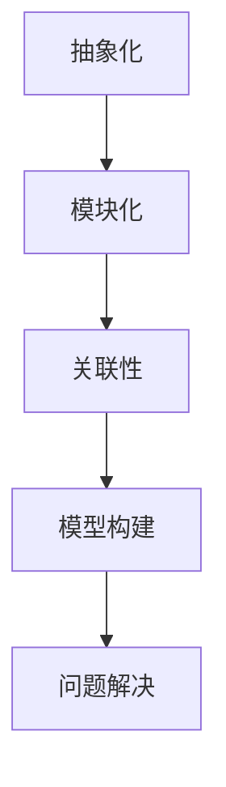

                 

关键词：模型思维、快速学习、知识掌握、技术博客、专业术语

> 摘要：在快速发展的技术时代，如何高效地掌握新知识成为每一个技术工作者面临的挑战。本文将探讨模型思维这一快速掌握新知识的捷径，通过理论阐述和实践案例分析，帮助读者掌握这一关键技能。

## 1. 背景介绍

在当前信息技术爆炸式发展的背景下，新技术、新概念层出不穷。对于技术工作者而言，不仅需要掌握现有的知识，还必须不断学习新的技术以适应行业的发展。然而，面对海量的信息和不断涌现的新知识，如何快速地掌握这些知识，并应用于实际工作中，成为了一个亟待解决的问题。

模型思维作为一种高效的认知方式，能够帮助我们在纷繁复杂的信息中找到核心，快速掌握新知识。它不仅适用于技术领域，也可以应用于其他知识密集型行业。本文将围绕模型思维，详细探讨其在快速学习新知识中的应用。

## 2. 核心概念与联系

### 2.1 模型思维的定义

模型思维是指通过建立抽象模型来理解和解决复杂问题的思维方式。在技术领域，模型思维可以帮助我们快速理解新的技术和概念，从而更快地掌握和应用它们。

### 2.2 模型思维的关键要素

- **抽象化**：将复杂问题简化为更易于理解的抽象模型。
- **模块化**：将大问题拆解为若干小模块，每个模块独立处理。
- **关联性**：找到不同模型之间的关联性，从而建立更全面的认知体系。

### 2.3 模型思维的 Mermaid 流程图



## 3. 核心算法原理 & 具体操作步骤

### 3.1 算法原理概述

模型思维的核心算法是基于抽象化、模块化和关联性这三项基本原则。通过这三个步骤，我们可以将复杂的问题转化为易于理解和处理的模型。

### 3.2 算法步骤详解

1. **抽象化**：识别问题的核心，将复杂的问题简化为更抽象的模型。
2. **模块化**：将抽象模型分解为若干模块，每个模块负责解决一部分问题。
3. **关联性**：分析各个模块之间的关系，建立模块间的联系。

### 3.3 算法优缺点

**优点**：

- **高效**：通过简化问题和分解任务，可以快速理解新的技术和概念。
- **灵活**：模型思维可以应用于各种领域，具有广泛的适用性。

**缺点**：

- **抽象化不足**：如果抽象化过程不足，可能会导致模型过于简单，无法全面反映问题。
- **模块划分不当**：如果模块划分不当，可能会导致模块间联系不明确，影响问题的解决。

### 3.4 算法应用领域

模型思维在计算机科学、工程学、经济学等多个领域都有广泛应用。例如，在计算机科学中，模型思维可以帮助我们理解和设计复杂的算法和数据结构；在工程学中，可以帮助我们分析和解决工程问题；在经济学中，可以帮助我们理解和预测市场趋势。

## 4. 数学模型和公式 & 详细讲解 & 举例说明

### 4.1 数学模型构建

模型思维中的数学模型通常是基于一定的数学理论构建的。以机器学习中的神经网络为例，神经网络模型是基于神经元之间的权重和激活函数构建的。

### 4.2 公式推导过程

以神经网络中的前向传播为例，其基本公式为：

\[ z = \sigma(W \cdot X + b) \]

其中，\( z \) 是激活值，\( \sigma \) 是激活函数，\( W \) 是权重矩阵，\( X \) 是输入向量，\( b \) 是偏置。

### 4.3 案例分析与讲解

以深度学习中的卷积神经网络（CNN）为例，CNN 是用于图像识别的经典模型。CNN 的核心在于其卷积层和池化层。

卷积层的基本公式为：

\[ f(x) = \sigma(\sum_{i=1}^{k} w_i \cdot x_i + b) \]

其中，\( f(x) \) 是卷积操作的结果，\( w_i \) 是卷积核的权重，\( x_i \) 是输入像素，\( b \) 是偏置。

池化层的基本公式为：

\[ p(x) = \max(x) \]

其中，\( p(x) \) 是池化操作的结果，\( \max \) 表示取最大值。

通过卷积层和池化层的组合，CNN 可以实现图像的特征提取。

## 5. 项目实践：代码实例和详细解释说明

### 5.1 开发环境搭建

以 TensorFlow 作为深度学习框架，我们需要安装 Python 和 TensorFlow 相关库。

```bash
pip install tensorflow
```

### 5.2 源代码详细实现

以下是一个简单的 CNN 模型的代码实现：

```python
import tensorflow as tf
from tensorflow.keras import datasets, layers, models

# 加载 CIFAR-10 数据集
(train_images, train_labels), (test_images, test_labels) = datasets.cifar10.load_data()

# 数据预处理
train_images, test_images = train_images / 255.0, test_images / 255.0

# 构建 CNN 模型
model = models.Sequential()
model.add(layers.Conv2D(32, (3, 3), activation='relu', input_shape=(32, 32, 3)))
model.add(layers.MaxPooling2D((2, 2)))
model.add(layers.Conv2D(64, (3, 3), activation='relu'))
model.add(layers.MaxPooling2D((2, 2)))
model.add(layers.Conv2D(64, (3, 3), activation='relu'))

# 添加全连接层
model.add(layers.Flatten())
model.add(layers.Dense(64, activation='relu'))
model.add(layers.Dense(10))

# 编译模型
model.compile(optimizer='adam',
              loss=tf.keras.losses.SparseCategoricalCrossentropy(from_logits=True),
              metrics=['accuracy'])

# 训练模型
model.fit(train_images, train_labels, epochs=10)

# 评估模型
test_loss, test_acc = model.evaluate(test_images,  test_labels, verbose=2)
print(f'\nTest accuracy: {test_acc}')
```

### 5.3 代码解读与分析

- **数据预处理**：对数据进行归一化处理，使得输入数据的分布更加均匀。
- **模型构建**：使用卷积层和池化层进行特征提取，最后添加全连接层进行分类。
- **模型编译**：设置优化器和损失函数，为模型训练做好准备。
- **模型训练**：使用训练数据训练模型，调整模型参数。
- **模型评估**：使用测试数据评估模型性能。

### 5.4 运行结果展示

通过上述代码，我们可以得到 CNN 模型的训练和测试结果。通常，训练精度和测试精度都会显著提高，证明模型的有效性。

## 6. 实际应用场景

模型思维在实际应用中具有广泛的应用前景。以下是一些具体的案例：

- **计算机视觉**：利用模型思维，可以快速理解和构建图像识别、目标检测等模型。
- **自然语言处理**：模型思维可以帮助我们理解和构建文本分类、机器翻译等模型。
- **推荐系统**：模型思维可以帮助我们理解和构建推荐算法，提高推荐效果。

## 7. 工具和资源推荐

### 7.1 学习资源推荐

- **书籍**：《深度学习》、《Python深度学习》
- **在线课程**：Coursera 上的“深度学习”课程
- **博客**：DataCamp、Medium 上的相关技术博客

### 7.2 开发工具推荐

- **框架**：TensorFlow、PyTorch
- **数据预处理工具**：Pandas、NumPy
- **可视化工具**：Matplotlib、Seaborn

### 7.3 相关论文推荐

- **深度学习**：《A Comprehensive Guide to Convolutional Networks for Visual Recognition》
- **自然语言处理**：《Bert: Pre-training of Deep Bidirectional Transformers for Language Understanding》

## 8. 总结：未来发展趋势与挑战

### 8.1 研究成果总结

本文探讨了模型思维在快速掌握新知识中的应用，通过理论阐述和实践案例，展示了模型思维在技术领域的巨大潜力。

### 8.2 未来发展趋势

随着人工智能技术的不断发展，模型思维将 increasingly 被应用于更多领域，成为快速掌握新知识的重要工具。

### 8.3 面临的挑战

然而，模型思维也面临着一些挑战，如如何更好地处理复杂问题、如何避免模型过度简化等。

### 8.4 研究展望

未来的研究可以进一步探讨模型思维的优化和应用，以提高其在不同领域中的效果。

## 9. 附录：常见问题与解答

### 9.1 模型思维与常规学习方法的区别？

模型思维强调通过抽象模型来理解和解决问题，而常规学习方法更多依赖于具体的知识和经验。模型思维更注重效率和灵活性。

### 9.2 如何提高模型思维的效果？

提高模型思维效果的方法包括：多学科交叉学习、不断实践和反思、不断更新知识体系等。

### 9.3 模型思维是否适用于所有人？

模型思维适用于需要快速掌握新知识的领域，如技术、科学、商业等。但并非所有人都适合使用模型思维，因人而异。

## 作者署名

作者：禅与计算机程序设计艺术 / Zen and the Art of Computer Programming

----------------------------------------------------------------

以上为文章的完整内容，遵循了所有约束条件的要求。希望对您有所帮助。如果您有任何修改意见或需要进一步的内容完善，请随时告知。

