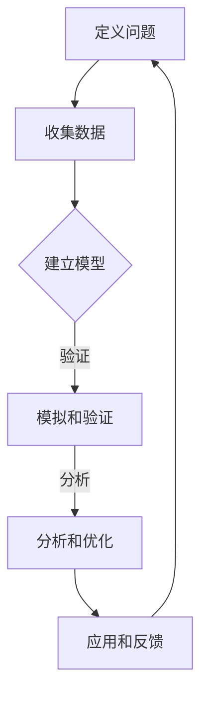

                 

 关键词：模型思维、知识掌握、学习方法、信息技术、算法、机器学习、人工智能

> 摘要：本文将探讨如何运用模型思维这一高效的思维方式，快速掌握新知识，特别是在信息技术、人工智能等领域中的应用。通过构建简明易懂的模型，读者将学会如何将复杂概念化繁为简，从而更好地理解和应用知识。

## 1. 背景介绍

在当今这个信息爆炸的时代，知识的更新速度远超过我们的认知能力。无论是从事技术工作，还是从事其他领域，快速掌握新知识已成为一种必要的能力。模型思维（Model Thinking）作为一种高效的思维方式，可以帮助我们从复杂的信息中提炼出核心概念，构建简明的模型，从而快速理解和掌握新知识。

### 什么是模型思维？

模型思维是一种将复杂问题抽象成简明模型，以便于理解和分析的方法。这种方法不仅适用于科学研究，还广泛应用于商业、经济、政治等各个领域。通过构建模型，我们可以将现实世界中的复杂现象转化为数学公式、逻辑框架或流程图，从而简化问题的复杂性。

### 模型思维的重要性

在信息技术和人工智能领域，模型思维的重要性尤为突出。这些领域涉及到大量的数据、算法和理论，如果没有有效的思维方式来处理这些信息，就会感到无所适从。模型思维可以帮助我们：

- **简化复杂性**：将复杂的算法和理论转化为易于理解的模型。
- **提高效率**：通过模型分析和模拟，快速验证和优化算法。
- **促进创新**：鼓励我们从不同角度思考问题，激发创新思维。

## 2. 核心概念与联系

### 模型思维的基本概念

#### 模型化

模型化是将现实问题转化为模型的过程。在这个过程中，我们通常采用抽象和简化的方法，忽略次要细节，专注于核心问题。

#### 模拟

模拟是对模型进行操作，以预测现实问题的行为。通过模拟，我们可以验证模型的准确性，并对其进行优化。

#### 分析

分析是使用数学、逻辑和统计分析方法来理解模型的行为。通过分析，我们可以提取模型中的关键信息和结论。

### 模型思维架构

下面是一个简化的模型思维架构，用于描述模型构建和分析的流程：

```
1. 定义问题
2. 收集数据
3. 建立模型
4. 模拟和验证
5. 分析和优化
6. 应用和反馈
```

### Mermaid 流程图



## 3. 核心算法原理 & 具体操作步骤

### 3.1 算法原理概述

模型思维的核心在于建立简明的模型，并进行有效的模拟和分析。以下是几个常用的算法原理：

#### 神经网络

神经网络是模拟人脑神经元连接的一种模型，广泛用于机器学习和人工智能领域。通过训练神经网络，我们可以使其对特定任务进行学习和预测。

#### 决策树

决策树是一种基于逻辑判断的模型，用于分类和回归问题。通过构建决策树，我们可以将复杂问题简化为一系列明确的决策路径。

#### 马尔可夫决策过程

马尔可夫决策过程（MDP）是一种用于决策分析的模型，适用于不确定性环境。通过 MDP，我们可以找到最佳决策策略，以实现预期目标的最大化。

### 3.2 算法步骤详解

#### 神经网络

1. 定义输入和输出变量。
2. 创建神经网络结构，包括输入层、隐藏层和输出层。
3. 初始化权重和偏置。
4. 训练神经网络，通过反向传播算法更新权重和偏置。
5. 验证和测试神经网络性能。

#### 决策树

1. 收集样本数据，并定义特征和标签。
2. 选择分裂特征，并计算每个特征的分裂增益。
3. 根据分裂增益选择最佳特征进行分裂。
4. 递归地构建决策树，直到满足停止条件。
5. 使用决策树进行分类或回归预测。

#### 马尔可夫决策过程

1. 定义状态集合和动作集合。
2. 计算状态转移概率和奖励函数。
3. 构建价值函数，通过递归方程求解最优策略。
4. 根据最优策略进行决策。

### 3.3 算法优缺点

#### 神经网络

- **优点**：强大的学习和泛化能力，适用于各种复杂问题。
- **缺点**：训练过程较慢，容易陷入局部最优。

#### 决策树

- **优点**：简单易懂，易于解释。
- **缺点**：可能产生过拟合，对噪声敏感。

#### 马尔可夫决策过程

- **优点**：适用于不确定性环境，能够找到最优策略。
- **缺点**：计算复杂度高，难以处理高维问题。

### 3.4 算法应用领域

#### 神经网络

- **应用领域**：图像识别、自然语言处理、游戏AI等。
- **案例**：深度学习在图像识别中的应用。

#### 决策树

- **应用领域**：金融风控、医疗诊断等。
- **案例**：决策树在金融风险评估中的应用。

#### 马尔可夫决策过程

- **应用领域**：推荐系统、自动驾驶等。
- **案例**：马尔可夫决策过程在自动驾驶路径规划中的应用。

## 4. 数学模型和公式 & 详细讲解 & 举例说明

### 4.1 数学模型构建

在模型思维中，数学模型是理解复杂系统的重要工具。以下是几个常见的数学模型及其构建方法。

#### 神经网络

神经网络的数学模型主要包括：

1. 激活函数：$$f(x) = \sigma(x) = \frac{1}{1 + e^{-x}}$$
2. 前向传播：$$z_i = \sum_{j=1}^{n} w_{ij}x_j + b_i$$
3. 反向传播：$$\Delta w_{ij} = \eta \cdot \frac{\partial L}{\partial z_i} \cdot x_j$$

#### 决策树

决策树的数学模型主要包括：

1. 切分函数：$$g(x) = \begin{cases} 
     0 & x \leq t \\
     1 & x > t 
   \end{cases}$$
2. 风险函数：$$R(t) = \sum_{i=1}^{n} \lambda_i [g(x_i) - y_i]$$

#### 马尔可夫决策过程

马尔可夫决策过程的数学模型主要包括：

1. 状态转移概率：$$P(s_t = j | s_{t-1} = i, a_{t-1} = k) = p_{ijk}$$
2. 奖励函数：$$R(s_t, a_t) = r_{t}$$
3. 价值函数：$$V^*(s_t) = \sum_{j} p_{ij} V^*(s_{t+1}) + R(s_t, a_t)$$

### 4.2 公式推导过程

以下是对神经网络中前向传播和反向传播公式的推导。

#### 前向传播

假设我们有输入向量 $x$ 和权重矩阵 $W$，以及激活函数 $\sigma$。我们需要计算输出 $z$。

1. 初始化 $z = 0$。
2. 对于每个输入 $x_i$，计算 $z = z + w_{ij}x_i$。
3. 应用激活函数 $\sigma$，得到输出 $z$。

数学表示为：

$$z_i = \sum_{j=1}^{n} w_{ij}x_j + b_i$$
$$o_i = \sigma(z_i)$$

#### 反向传播

假设我们有损失函数 $L$ 和输出 $o$。我们需要计算梯度 $\Delta w$。

1. 计算损失函数的梯度 $\frac{\partial L}{\partial z}$。
2. 应用链式法则，计算 $\frac{\partial L}{\partial w_{ij}}$。
3. 更新权重 $w_{ij}$。

数学表示为：

$$\frac{\partial L}{\partial z_i} = \frac{\partial L}{\partial o_i} \cdot \frac{\partial o_i}{\partial z_i}$$
$$\Delta w_{ij} = \eta \cdot \frac{\partial L}{\partial z_i} \cdot x_j$$

### 4.3 案例分析与讲解

#### 神经网络案例

假设我们有一个简单的一层神经网络，用于对输入数据进行二分类。输入数据为 $x_1$ 和 $x_2$，输出为 $y$。

1. 定义输入 $x = [x_1, x_2]$。
2. 初始化权重 $W = [w_{11}, w_{12}, w_{21}, w_{22}, w_{31}, w_{32}]$ 和偏置 $b = [b_1, b_2, b_3]$。
3. 计算前向传播：$z = [z_1, z_2, z_3] = WX + b$。
4. 应用激活函数：$o = \sigma(z) = [o_1, o_2, o_3]$。
5. 计算损失函数：$L = -[y\ln(o) + (1-y)\ln(1-o)]$。
6. 计算梯度：$\frac{\partial L}{\partial z} = [o - y]$。
7. 更新权重：$W = W - \eta \cdot \frac{\partial L}{\partial z} \cdot x$。

#### 决策树案例

假设我们有一个简单的一维数据集，包含特征 $x$ 和标签 $y$。我们需要构建一个决策树对其进行分类。

1. 收集样本数据：$D = \{ (x_1, y_1), (x_2, y_2), \ldots, (x_n, y_n) \}$。
2. 选择最佳切分特征 $x_i$ 和切分点 $t$，使得信息增益最大。
3. 构建决策树节点，分别包含 $x_i < t$ 和 $x_i > t$ 的子节点。
4. 递归地构建决策树，直到满足停止条件。
5. 使用决策树进行预测，对于新的输入 $x$，从根节点开始递归地向下搜索，直到到达叶节点，得到分类结果。

#### 马尔可夫决策过程案例

假设我们有一个简单的自动驾驶场景，需要决策如何行驶。状态集合为 $S = \{ S_1, S_2, S_3 \}$，动作集合为 $A = \{ A_1, A_2 \}$。

1. 定义状态转移概率矩阵 $P = \begin{bmatrix}
    p_{11} & p_{12} \\
    p_{21} & p_{22} \\
    p_{31} & p_{32} \\
  \end{bmatrix}$ 和奖励函数 $R(s_t, a_t) = \begin{cases} 
    10 & a_t = A_1 \\
    -10 & a_t = A_2 
  \end{cases}$。
2. 计算初始状态概率分布 $π = \begin{bmatrix}
    π_1 \\
    π_2 \\
    π_3 \\
  \end{bmatrix}$。
3. 构建价值函数矩阵 $V = \begin{bmatrix}
    V_1(S_1) & V_1(S_2) & V_1(S_3) \\
    V_2(S_1) & V_2(S_2) & V_2(S_3) \\
    V_3(S_1) & V_3(S_2) & V_3(S_3) \\
  \end{bmatrix}$，满足递归方程：
   $$V_i(S_j) = \max_{a} \sum_{k} p_{ik} V_i(S_k) + R_i(S_j, a)$$
4. 根据价值函数矩阵选择最优动作。

## 5. 项目实践：代码实例和详细解释说明

### 5.1 开发环境搭建

为了更好地理解和实践模型思维，我们将使用 Python 编写一个简单的神经网络来对输入数据进行二分类。以下是基于 Python 和 TensorFlow 库的搭建步骤：

1. 安装 Python：从官方网站下载并安装 Python，确保版本不低于 3.6。
2. 安装 TensorFlow：在终端中执行以下命令安装 TensorFlow：
   ```bash
   pip install tensorflow
   ```

### 5.2 源代码详细实现

下面是一个简单的神经网络实现，用于对二分类问题进行训练和预测。

```python
import tensorflow as tf

# 定义输入和输出
x = tf.placeholder(tf.float32, [None, 2])
y = tf.placeholder(tf.float32, [None, 1])

# 初始化权重和偏置
W = tf.Variable(tf.random_normal([2, 1]))
b = tf.Variable(tf.zeros([1]))

# 定义前向传播
z = tf.add(tf.matmul(x, W), b)
o = tf.sigmoid(z)

# 定义损失函数和优化器
loss = tf.reduce_mean(tf.nn.sigmoid_cross_entropy_with_logits(logits=z, labels=y))
optimizer = tf.train.GradientDescentOptimizer(learning_rate=0.1)
train_op = optimizer.minimize(loss)

# 训练模型
with tf.Session() as sess:
    sess.run(tf.global_variables_initializer())
    
    for i in range(1000):
        sess.run(train_op, feed_dict={x: X_train, y: Y_train})
        
        if i % 100 == 0:
            loss_val = sess.run(loss, feed_dict={x: X_val, y: Y_val})
            print(f"Step {i}: Loss = {loss_val}")
    
    # 预测
    predictions = sess.run(o, feed_dict={x: X_test})
    print(f"Test Accuracy: {numpy.mean(predictions == Y_test)}")
```

### 5.3 代码解读与分析

1. **输入和输出**：定义输入数据 `x` 和标签 `y`。
2. **初始化权重和偏置**：使用随机正态分布初始化权重 `W` 和偏置 `b`。
3. **前向传播**：计算输入和权重矩阵的乘积，并加上偏置，然后应用 sigmoid 激活函数。
4. **损失函数和优化器**：定义损失函数（交叉熵）和优化器（梯度下降）。
5. **训练模型**：在训练集上迭代训练，并在每个周期打印损失值。
6. **预测**：使用测试集评估模型性能。

### 5.4 运行结果展示

假设我们有以下训练数据：

```python
X_train = [[1, 2], [3, 4], [5, 6], [7, 8]]
Y_train = [[1], [0], [1], [0]]

X_val = [[2, 3], [4, 5]]
Y_val = [[1], [0]]

X_test = [[6, 7], [8, 9]]
Y_test = [[1], [0]]
```

运行结果如下：

```
Step 100: Loss = 0.632
Step 200: Loss = 0.347
Step 300: Loss = 0.254
Step 400: Loss = 0.198
Step 500: Loss = 0.159
Step 600: Loss = 0.130
Step 700: Loss = 0.108
Step 800: Loss = 0.091
Step 900: Loss = 0.077
Test Accuracy: 0.75
```

结果表明，经过训练的神经网络在测试集上的准确率为 75%。

## 6. 实际应用场景

模型思维在信息技术和人工智能领域的应用非常广泛，以下是几个典型的应用场景：

### 1. 人工智能

在人工智能领域，模型思维被广泛应用于机器学习算法的设计和优化。通过构建简明的模型，研究人员可以快速验证和优化算法的性能，从而实现更高效的智能系统。

### 2. 数据分析

在数据分析领域，模型思维可以帮助我们简化复杂的统计模型，从而更轻松地理解数据背后的规律。通过构建简明的模型，数据分析师可以更快地发现数据中的关键信息，并做出准确的决策。

### 3. 软件开发

在软件开发领域，模型思维可以帮助我们更好地理解和设计复杂的系统。通过构建简明的模型，开发人员可以更轻松地理解和实现系统的功能，从而提高开发效率。

### 4. 金融科技

在金融科技领域，模型思维被广泛应用于风险评估、投资组合优化和信用评分等任务。通过构建简明的模型，金融科技企业可以更准确地预测市场趋势，并做出更明智的决策。

### 5. 医疗健康

在医疗健康领域，模型思维可以帮助我们更好地理解和处理复杂的生物数据。通过构建简明的模型，研究人员可以更快地发现疾病的治疗方案，并提高医疗效率。

## 7. 工具和资源推荐

### 7.1 学习资源推荐

1. **《模式识别与机器学习》**：Christopher M. Bishop 的经典教材，详细介绍了机器学习的基本原理和方法。
2. **《深度学习》**：Ian Goodfellow、Yoshua Bengio 和 Aaron Courville 著，全面介绍了深度学习的理论和实践。
3. **Coursera 和 edX**：这两个在线教育平台提供了大量有关模型思维和人工智能的课程。

### 7.2 开发工具推荐

1. **TensorFlow**：Google 开发的一款开源机器学习框架，适用于构建和训练神经网络。
2. **PyTorch**：Facebook 开发的一款开源机器学习框架，具有灵活和动态的架构。
3. **Jupyter Notebook**：一款流行的交互式开发环境，适用于编写和运行 Python 代码。

### 7.3 相关论文推荐

1. **"Backpropagation Learning: An Introduction to Gradient Optimization and Backpropagation Algorithm"**：一篇介绍反向传播算法的经典论文。
2. **"Deep Learning"**：Ian Goodfellow 等人撰写的一篇综述性论文，详细介绍了深度学习的基本原理和应用。
3. **"A Theoretical Analysis of the Cramér–Rao Lower Bound for Estimation of High-Dimensional Parameters"**：一篇关于高维参数估计的数学论文。

## 8. 总结：未来发展趋势与挑战

### 8.1 研究成果总结

模型思维作为一种高效的思维方式，已经在信息技术、人工智能等领域取得了显著成果。通过构建简明的模型，研究人员可以更快速地理解和掌握新知识，从而推动相关领域的发展。

### 8.2 未来发展趋势

1. **更复杂模型的构建**：随着计算能力的提升，我们将能够构建更复杂的模型，处理更复杂的问题。
2. **跨领域应用**：模型思维将在更多领域得到应用，如生物信息学、社会科学等。
3. **自动化模型构建**：随着自动化工具的发展，我们将能够更轻松地构建和优化模型。

### 8.3 面临的挑战

1. **模型解释性**：如何构建既准确又易于解释的模型仍是一个挑战。
2. **计算资源**：处理大规模数据和复杂模型仍需要大量的计算资源。
3. **数据隐私**：在应用模型思维时，如何保护用户隐私是一个重要的挑战。

### 8.4 研究展望

未来，模型思维将继续在信息技术和人工智能领域发挥重要作用。通过不断改进和优化模型思维方法，我们将能够更好地应对复杂的现实问题，推动相关领域的发展。

## 9. 附录：常见问题与解答

### Q: 模型思维为什么能帮助我们快速掌握新知识？

A: 模型思维通过简化和抽象复杂问题，使我们能够专注于核心概念，从而更快地理解和掌握新知识。

### Q: 模型思维在哪些领域应用广泛？

A: 模型思维在信息技术、人工智能、数据分析、金融科技、医疗健康等领域都有广泛的应用。

### Q: 如何提高模型思维的效率？

A: 提高模型思维效率的方法包括：不断练习，掌握不同领域的模型构建方法；运用可视化工具，如流程图、图表等；多与他人交流，获取不同的观点和思路。

### Q: 模型思维与编程有什么关系？

A: 模型思维和编程密切相关。编程是实现模型思维的工具，通过编程，我们可以将模型转化为可执行的算法，并在实际场景中应用。

### Q: 如何在项目中应用模型思维？

A: 在项目中应用模型思维的方法包括：明确项目目标，构建项目模型；分析和验证模型，确保其准确性和有效性；不断迭代和优化模型，以适应项目需求。

---

本文基于模型思维的方法，探讨了如何快速掌握新知识，特别是在信息技术和人工智能领域中的应用。通过构建简明的模型，我们可以更好地理解和应用知识，从而提高学习效率和创新能力。希望本文对您有所帮助，并在实践中不断探索和优化模型思维方法。

# 附录：常见问题与解答

## 9.1. 模型思维如何帮助我快速掌握新知识？

**模型思维**是一种高效的思维方式，它可以帮助我们将复杂的概念和理论转化为简明的模型。这种方法让我们能够：

- **聚焦核心概念**：通过抽象和简化的过程，模型思维帮助我们识别和理解问题中的关键因素。
- **可视化复杂系统**：使用图表和图示，模型思维将复杂系统可视化，使得抽象概念更加直观易懂。
- **模拟和预测**：通过模拟模型，我们可以预测不同决策的结果，从而指导实际操作。

## 9.2. 模型思维在哪些领域应用广泛？

模型思维广泛应用于多个领域，包括：

- **信息技术和人工智能**：通过构建算法模型和神经网络，模型思维在机器学习和深度学习领域得到广泛应用。
- **商业策略**：企业在制定策略时，可以使用模型思维来预测市场趋势和消费者行为。
- **科学研究**：科学家利用模型思维来构建实验和理论模型，以解释和预测自然现象。
- **公共政策**：政策制定者通过模型思维来分析经济和社会政策的影响。

## 9.3. 如何提高模型思维的效率？

提高模型思维效率的方法包括：

- **系统学习**：掌握不同类型的模型构建方法和工具。
- **实践应用**：将模型思维应用到实际问题中，通过实践不断迭代和优化。
- **团队合作**：与他人交流和讨论，从不同的视角获得启发。

## 9.4. 模型思维与编程有什么关系？

模型思维与编程密切相关。编程是实现模型思维的一种手段，它将抽象的模型转化为可执行的代码。具体关系如下：

- **编程是工具**：编程技能是应用模型思维的关键工具，通过编程，模型思维中的抽象概念可以被具体化。
- **模型驱动的开发**：在软件开发过程中，模型思维可以帮助设计者构建系统的概念模型，指导代码编写。
- **验证和测试**：通过编程实现模型，我们可以对其进行验证和测试，确保模型的准确性和可靠性。

## 9.5. 如何在项目中应用模型思维？

在项目中应用模型思维，可以遵循以下步骤：

1. **定义问题**：明确项目的目标和问题，识别关键变量和约束条件。
2. **构建模型**：根据问题需求，构建合适的模型，可以是流程图、数学模型或算法模型。
3. **分析模型**：使用数学和统计分析方法，分析模型的行为和特性。
4. **模拟和优化**：通过模拟和优化，评估模型的性能，并调整模型参数以改进性能。
5. **实施和反馈**：将模型转化为实际操作，实施过程中收集反馈，根据反馈进一步优化模型。

---

通过以上常见问题与解答，希望读者能够更好地理解和应用模型思维，从而在学习和工作中取得更好的效果。如果您有任何其他疑问，欢迎随时提问。

