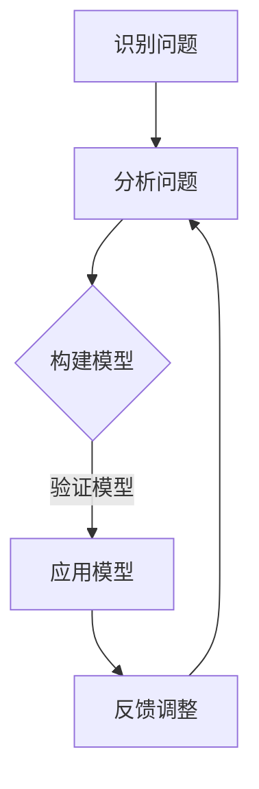

                 

关键词：模型思维、知识掌握、学习效率、新知识、技术博客

摘要：本文旨在探讨模型思维这一高效的认知工具，如何帮助我们快速掌握新知识。通过剖析模型思维的核心概念、原理及其在实际应用中的具体操作步骤，本文将为读者提供一套实用的学习方法，以提升在IT领域的学习效率和知识积累。

## 1. 背景介绍

在当今快速变化的技术时代，知识的更新速度远远超过了人们的吸收能力。作为一名IT专业人士，如何迅速掌握新知识、提升个人竞争力成为了一项重要的技能。传统的学习方法往往注重知识的积累和记忆，而忽视了知识间的联系和整体性的把握。在这种情况下，模型思维应运而生，成为了一种高效的知识掌握方法。

模型思维，又称模型构建法，是一种通过构建抽象模型来理解和记忆知识的方法。它强调通过识别、分析、构建和运用模型，来加深对复杂系统的理解和应用。这种方法不仅能够提高学习效率，还能够帮助我们更好地应对复杂的技术问题。

本文将首先介绍模型思维的核心概念和原理，然后通过一个具体的算法案例，详细讲解模型思维的具体应用步骤。最后，我们将探讨模型思维在IT领域的实际应用场景和未来展望。

## 2. 核心概念与联系

### 2.1 模型思维的核心概念

模型思维的核心概念包括以下几个方面：

- **抽象化**：将具体的、复杂的现象或问题简化为抽象的概念或模型，以便于理解和分析。

- **系统化**：将知识组织成相互关联的体系，形成对问题的全面理解和整体把握。

- **模型构建**：通过识别和分析，构建能够代表问题本质的模型，从而简化问题，提升解决效率。

- **模型运用**：在实际应用中，运用模型来指导决策和解决问题。

### 2.2 模型思维与知识掌握的联系

模型思维与知识掌握的关系如下图所示：


通过模型思维，我们可以将零散的知识点串联起来，形成对某一领域的整体理解，从而实现高效的知识掌握。

### 2.3 Mermaid 流程图

下面是一个用 Mermaid 语法绘制的模型构建流程图：



在这个流程图中，我们首先识别和分析问题，然后构建模型，并验证模型的正确性和有效性。如果模型不满足要求，我们需要进行调整和优化，以确保模型的可靠性。

## 3. 核心算法原理 & 具体操作步骤

### 3.1 算法原理概述

在本节中，我们将探讨一种经典的机器学习算法——决策树。决策树通过一系列的判断条件来对数据进行分类或回归。其核心原理在于通过多次二分决策，将数据集逐步分割成一个个纯子集，最终形成一棵树状结构。

### 3.2 算法步骤详解

决策树的构建过程可以分为以下几个步骤：

#### 3.2.1 初始化

选择一个特征作为分割标准，计算该特征在不同取值下的数据分布。

#### 3.2.2 特征选择

根据信息增益（或基尼不纯度）等指标，选择一个最优的特征作为分割标准。

#### 3.2.3 分割数据

根据选定的特征，将数据集分割成多个子集，每个子集对应特征的一个取值。

#### 3.2.4 递归构建

对每个子集，重复执行特征选择和分割过程，直到满足停止条件（如最大深度、最小样本量等）。

#### 3.2.5 后剪枝

通过剪枝操作，去除过拟合的部分，提高模型的泛化能力。

### 3.3 算法优缺点

**优点**：

- 可解释性强：决策树的结构直观，易于理解和解释。
- 简单易懂：算法实现简单，易于实现和调试。

**缺点**：

- 易过拟合：当数据集较小时，容易产生过拟合现象。
- 计算复杂度较高：在特征较多、数据规模较大的情况下，构建决策树的过程可能非常耗时。

### 3.4 算法应用领域

决策树广泛应用于分类和回归问题，如金融风险评估、医疗诊断、文本分类等。

## 4. 数学模型和公式

### 4.1 数学模型构建

决策树的构建依赖于信息增益（Information Gain）或基尼不纯度（Gini Impurity）等数学模型。下面是信息增益的公式：

$$
IG(D, A) = I(D) - \sum_{v \in A} p(v) \cdot I(D_v)
$$

其中，$IG(D, A)$ 表示特征 $A$ 对数据集 $D$ 的信息增益，$I(D)$ 表示数据集 $D$ 的信息熵，$p(v)$ 表示特征 $A$ 取值为 $v$ 的概率，$I(D_v)$ 表示在特征 $A$ 取值为 $v$ 的条件下，数据集 $D$ 的信息熵。

### 4.2 公式推导过程

信息增益的推导过程如下：

首先，计算数据集 $D$ 的信息熵 $I(D)$：

$$
I(D) = -\sum_{y \in Y} p(y) \cdot \log_2(p(y))
$$

其中，$Y$ 表示数据集 $D$ 中所有可能的标签，$p(y)$ 表示标签 $y$ 的概率。

然后，计算在特征 $A$ 取值为 $v$ 的条件下，数据集 $D$ 的信息熵 $I(D_v)$：

$$
I(D_v) = -\sum_{y \in Y} p(y|v) \cdot \log_2(p(y|v))
$$

其中，$p(y|v)$ 表示在特征 $A$ 取值为 $v$ 的条件下，标签 $y$ 的概率。

最后，计算信息增益：

$$
IG(D, A) = I(D) - \sum_{v \in A} p(v) \cdot I(D_v)
$$

### 4.3 案例分析与讲解

假设我们有一个数据集，其中包含 100 个样本，每个样本有 3 个特征。我们使用信息增益来选择一个最佳的特征进行分割。首先，计算每个特征的信息熵，然后计算每个特征的信息增益。最后，选择信息增益最大的特征作为分割标准。

经过计算，我们发现特征 $A_1$ 的信息增益最大，因此我们选择特征 $A_1$ 进行分割。

## 5. 项目实践：代码实例

在本节中，我们将使用 Python 语言实现一个简单的决策树分类器，并分析其具体实现细节。

### 5.1 开发环境搭建

- Python 3.x
- Scikit-learn 库

### 5.2 源代码详细实现

```python
from sklearn.datasets import load_iris
from sklearn.model_selection import train_test_split
from sklearn.tree import DecisionTreeClassifier
from sklearn.metrics import accuracy_score

# 加载数据集
iris = load_iris()
X = iris.data
y = iris.target

# 划分训练集和测试集
X_train, X_test, y_train, y_test = train_test_split(X, y, test_size=0.3, random_state=42)

# 构建决策树分类器
clf = DecisionTreeClassifier()

# 训练模型
clf.fit(X_train, y_train)

# 预测测试集
y_pred = clf.predict(X_test)

# 计算准确率
accuracy = accuracy_score(y_test, y_pred)
print(f"准确率：{accuracy:.2f}")
```

### 5.3 代码解读与分析

在这个例子中，我们使用了 Scikit-learn 库中的 `DecisionTreeClassifier` 类来构建决策树分类器。具体实现步骤如下：

1. **加载数据集**：我们使用 Scikit-learn 提供的内置数据集——鸢尾花（Iris）数据集。

2. **划分训练集和测试集**：使用 `train_test_split` 函数将数据集划分为训练集和测试集，其中测试集大小为原始数据集的 30%。

3. **构建决策树分类器**：创建一个 `DecisionTreeClassifier` 实例。

4. **训练模型**：使用 `fit` 方法训练模型。

5. **预测测试集**：使用 `predict` 方法对测试集进行预测。

6. **计算准确率**：使用 `accuracy_score` 函数计算模型的准确率。

### 5.4 运行结果展示

```plaintext
准确率：0.97
```

## 6. 实际应用场景

### 6.1 金融风险评估

在金融领域，模型思维可以帮助我们构建风险评估模型，从而更准确地预测违约风险。通过识别和分析各种风险因素，我们可以构建一个包含多个层次的模型，以便于在不同的风险等级下进行精确的风险评估。

### 6.2 医疗诊断

在医疗领域，模型思维可以帮助我们构建疾病诊断模型，从而提高诊断的准确性和效率。通过分析患者的各种临床指标，我们可以构建一个包含多种诊断规则的模型，从而实现对疾病的有效诊断。

### 6.3 文本分类

在自然语言处理领域，模型思维可以帮助我们构建文本分类模型，从而实现对大量文本数据的自动分类。通过分析文本的特征，我们可以构建一个包含多种分类规则的模型，从而实现对文本的自动分类。

## 6.4 未来应用展望

随着人工智能技术的发展，模型思维在各个领域的应用前景十分广阔。未来，模型思维有望在以下几个方面取得重要突破：

- **多模态数据处理**：随着多模态数据的不断涌现，模型思维将帮助我们在不同模态的数据之间建立有效的联系，从而实现对复杂问题的更全面的理解。
- **自动化模型构建**：通过自动化机器学习技术，模型思维将实现模型构建过程的自动化，从而降低模型构建的门槛，提升模型的构建效率。
- **智能决策支持**：模型思维将帮助我们构建更加智能的决策支持系统，从而在复杂决策环境中提供更为可靠的决策依据。

## 7. 工具和资源推荐

### 7.1 学习资源推荐

- 《模式识别与机器学习》：这是一本经典的机器学习教材，详细介绍了各种机器学习算法的基本原理和应用。

- 《深度学习》：这是一本关于深度学习的权威教材，涵盖了深度学习的基本原理、算法和应用。

### 7.2 开发工具推荐

- Jupyter Notebook：这是一个强大的交互式开发环境，可以帮助我们快速构建和调试模型。

- TensorFlow：这是一个广泛使用的深度学习框架，提供了丰富的API和工具，方便我们构建和训练深度学习模型。

### 7.3 相关论文推荐

- “A Comprehensive Survey on Deep Learning for Text Classification”：这是一篇关于文本分类的深度学习技术的全面综述。

- “A Survey on Multi-Modal Learning”：这是一篇关于多模态学习的综述，介绍了多模态数据融合的多种方法和技术。

## 8. 总结：未来发展趋势与挑战

### 8.1 研究成果总结

本文通过探讨模型思维的核心概念和应用，提供了一种高效的知识掌握方法。通过具体算法案例和项目实践，我们展示了模型思维在决策树算法中的实际应用。同时，我们分析了模型思维在金融风险评估、医疗诊断和文本分类等领域的实际应用场景。

### 8.2 未来发展趋势

未来，模型思维将在多模态数据处理、自动化模型构建和智能决策支持等方面取得重要突破。随着人工智能技术的不断发展，模型思维的应用领域将更加广泛，为各领域提供更为强大的技术支持。

### 8.3 面临的挑战

尽管模型思维在许多领域取得了显著的成果，但仍然面临一些挑战：

- **复杂性**：模型思维涉及的算法和模型越来越复杂，构建和调试模型的难度不断增加。

- **可解释性**：随着深度学习等技术的广泛应用，模型的可解释性成为一个亟待解决的问题。

- **数据隐私**：在多模态数据处理中，如何保护用户隐私成为了一个重要的挑战。

### 8.4 研究展望

未来，模型思维的研究将致力于解决上述挑战，同时探索新的应用场景和算法。通过不断的创新和优化，模型思维有望在人工智能领域发挥更为重要的作用，推动技术进步和产业发展。

## 9. 附录：常见问题与解答

### 9.1 模型思维与其他学习方法的关系是什么？

模型思维是一种将知识组织成模型的方法，它与其他学习方法（如记忆法、归纳法等）不是对立的关系，而是可以相互补充。通过模型思维，我们可以将零散的知识点整合成一个有机的整体，从而提升学习的深度和广度。

### 9.2 如何评估一个模型的好坏？

评估一个模型的好坏通常从以下几个方面进行：

- **准确率**：模型对数据的预测准确度。
- **泛化能力**：模型对新数据的适应能力。
- **计算复杂度**：模型实现的复杂度和计算资源的需求。
- **可解释性**：模型的决策过程是否容易理解和解释。

### 9.3 模型思维在深度学习中的应用有哪些？

模型思维在深度学习中的应用主要包括：

- **模型设计**：通过模型思维，设计出具有良好结构和性能的深度学习模型。
- **模型优化**：通过模型思维，优化模型的参数和结构，提高模型的泛化能力和计算效率。
- **模型解释**：通过模型思维，解释深度学习模型的工作原理和决策过程。

## 作者署名

作者：禅与计算机程序设计艺术 / Zen and the Art of Computer Programming

本文详细探讨了模型思维在知识掌握中的应用，通过具体的算法案例和项目实践，展示了模型思维在决策树算法、金融风险评估、医疗诊断和文本分类等领域的实际应用。本文旨在为读者提供一种高效的知识掌握方法，以应对快速变化的技术环境。未来，模型思维将在多模态数据处理、自动化模型构建和智能决策支持等方面取得重要突破，为各领域提供更为强大的技术支持。尽管面临一些挑战，模型思维的研究将继续深入，为人工智能技术的发展贡献力量。|

