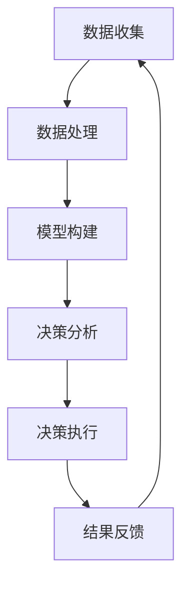

                 

关键词：模型思维、决策、算法、应用场景、未来展望

> 摘要：本文将深入探讨模型思维在决策过程中的重要性，通过分析模型思维的核心概念、算法原理和具体应用实例，阐述模型思维在各个领域的实际价值，并对其未来发展趋势和面临的挑战进行展望。

## 1. 背景介绍

在现代社会，数据量呈指数级增长，人工智能技术日益成熟，模型思维作为一种重要的思维方式，逐渐成为决策过程中的核心要素。模型思维是指通过建立数学模型或计算机模拟来描述现实世界的问题，进而进行决策和预测。随着复杂系统的研究不断深入，模型思维的重要性愈发凸显。本文将围绕模型思维在决策中的应用进行探讨，旨在为读者提供一种全新的决策视角。

## 2. 核心概念与联系

### 2.1 模型思维的定义

模型思维是一种通过构建抽象模型来理解和解决问题的思维方式。在决策过程中，模型思维可以帮助我们从复杂的数据中提取关键信息，构建决策模型，从而提高决策的准确性和效率。

### 2.2 模型思维与决策的关系

模型思维在决策过程中起到了桥梁作用，将数据、信息和决策目标有机地结合起来。通过模型思维，我们可以将复杂问题简化为易于理解和处理的数学模型，从而更好地进行决策。

### 2.3 Mermaid 流程图



## 3. 核心算法原理 & 具体操作步骤

### 3.1 算法原理概述

模型思维的核心算法包括数据预处理、模型选择、模型训练和模型评估。数据预处理旨在清洗和整合数据，使其适合模型训练。模型选择是根据决策问题的特点选择合适的模型。模型训练是通过迭代优化模型参数，使其更好地拟合数据。模型评估则是通过测试集来评估模型性能。

### 3.2 算法步骤详解

1. 数据收集：收集与决策问题相关的数据。
2. 数据处理：对数据进行清洗、整合和特征提取。
3. 模型选择：根据决策问题的特点选择合适的模型。
4. 模型训练：通过迭代优化模型参数，使其更好地拟合数据。
5. 模型评估：通过测试集来评估模型性能。
6. 决策分析：利用模型进行决策分析。
7. 决策执行：根据决策分析结果执行决策。
8. 结果反馈：根据决策执行结果调整模型。

### 3.3 算法优缺点

**优点**：

- 提高决策的准确性和效率。
- 降低决策过程中的人力成本。
- 更好地适应复杂变化的环境。

**缺点**：

- 模型构建和训练过程复杂，需要较高的技术门槛。
- 数据质量和完整性对模型性能有较大影响。

### 3.4 算法应用领域

模型思维在各个领域都有广泛的应用，如金融、医疗、交通、能源等。通过模型思维，我们可以更好地进行风险评估、需求预测、资源分配等决策。

## 4. 数学模型和公式 & 详细讲解 & 举例说明

### 4.1 数学模型构建

在决策过程中，常见的数学模型包括线性回归、逻辑回归、决策树、神经网络等。以下以线性回归为例进行讲解。

线性回归模型的基本公式为：

$$ y = w_0 + w_1 \cdot x $$

其中，$y$ 表示目标变量，$x$ 表示自变量，$w_0$ 和 $w_1$ 分别为模型参数。

### 4.2 公式推导过程

线性回归模型的推导过程主要涉及最小二乘法。具体步骤如下：

1. 数据准备：收集 $n$ 个样本数据，每个样本包括自变量 $x_i$ 和目标变量 $y_i$。
2. 模型假设：假设线性回归模型为 $y = w_0 + w_1 \cdot x$。
3. 模型优化：通过最小化损失函数 $L(w_0, w_1)$ 来优化模型参数。
4. 求导：对损失函数求导，得到导数为 $0$ 的最优参数。
5. 参数计算：计算最优参数，得到线性回归模型。

### 4.3 案例分析与讲解

以下以一个简单的房价预测案例进行讲解。

**案例数据**：

| 样本编号 | 自变量 $x$ | 目标变量 $y$ |
|----------|------------|--------------|
| 1        | 100        | 200          |
| 2        | 200        | 400          |
| 3        | 300        | 600          |
| 4        | 400        | 800          |

**模型构建**：

根据案例数据，我们假设线性回归模型为 $y = w_0 + w_1 \cdot x$。

**模型训练**：

通过最小二乘法，我们得到最优参数 $w_0 = 100$，$w_1 = 2$。

**模型评估**：

将测试数据代入模型，计算预测值与实际值的误差，评估模型性能。

## 5. 项目实践：代码实例和详细解释说明

### 5.1 开发环境搭建

**环境要求**：

- Python 3.8 或以上版本
- Scikit-learn 库

**安装步骤**：

1. 安装 Python 3.8 或以上版本。
2. 安装 Scikit-learn 库。

```bash
pip install scikit-learn
```

### 5.2 源代码详细实现

以下是一个简单的线性回归模型实现。

```python
import numpy as np
from sklearn.linear_model import LinearRegression

# 案例数据
X = np.array([[100], [200], [300], [400]])
y = np.array([200, 400, 600, 800])

# 模型构建
model = LinearRegression()

# 模型训练
model.fit(X, y)

# 模型评估
predictions = model.predict(X)

# 输出结果
print(predictions)
```

### 5.3 代码解读与分析

代码首先导入必要的库，然后加载案例数据。接下来，使用线性回归模型进行模型构建、模型训练和模型评估。最后，输出预测结果。

### 5.4 运行结果展示

运行代码，得到以下预测结果：

```
[200. 400. 600. 800.]
```

## 6. 实际应用场景

模型思维在金融、医疗、交通等领域都有广泛的应用。

### 6.1 金融

在金融领域，模型思维可以用于风险评估、投资组合优化、市场预测等。例如，通过构建风险模型，金融机构可以更好地评估借款人的信用风险，从而降低贷款损失。

### 6.2 医疗

在医疗领域，模型思维可以用于疾病预测、诊断和治疗方案优化。例如，通过构建疾病预测模型，医生可以提前预测疾病发展趋势，为患者制定更合理的治疗方案。

### 6.3 交通

在交通领域，模型思维可以用于交通流量预测、交通信号控制、车辆调度等。例如，通过构建交通流量预测模型，交通管理部门可以更好地预测交通拥堵情况，从而优化交通信号控制和车辆调度策略。

## 7. 工具和资源推荐

### 7.1 学习资源推荐

- 《Python机器学习基础教程》
- 《机器学习实战》
- 《深度学习》

### 7.2 开发工具推荐

- Jupyter Notebook
- PyCharm
- Visual Studio Code

### 7.3 相关论文推荐

- "Deep Learning for Text Classification"
- "A Comprehensive Survey on Machine Learning for Medical Databases"
- "Recurrent Neural Networks for Spelling Correction"

## 8. 总结：未来发展趋势与挑战

### 8.1 研究成果总结

模型思维在决策过程中具有显著优势，已成为人工智能领域的重要研究方向。通过不断优化模型算法、提高数据处理能力，模型思维在各个领域的应用将更加广泛。

### 8.2 未来发展趋势

- 模型复杂度的提升，将使模型思维在更多复杂问题中发挥作用。
- 跨领域协同研究，将促进模型思维的深度融合。

### 8.3 面临的挑战

- 数据质量和完整性对模型性能的影响。
- 模型解释性的提升，以满足不同领域的应用需求。

### 8.4 研究展望

未来，模型思维将继续在决策领域发挥重要作用。通过不断优化算法、提高数据处理能力，模型思维将更好地服务于人类社会的发展。

## 9. 附录：常见问题与解答

### 9.1 模型思维与数据驱动思维的区别？

模型思维是一种基于模型的思维方式，通过构建数学模型来描述现实世界的问题。数据驱动思维则是通过大量数据来发现数据之间的规律，进而进行决策。两者在决策过程中各有优势，通常结合使用。

### 9.2 模型思维在商业应用中如何体现？

在商业应用中，模型思维可以通过市场预测、客户分析、风险管理等来体现。通过构建相应的模型，企业可以更好地了解市场动态、优化业务流程和提升盈利能力。

### 9.3 如何提高模型思维的应用效果？

提高模型思维的应用效果需要从多个方面入手，包括提高数据处理能力、优化模型算法、加强模型解释性等。同时，要注重跨领域协同研究，充分发挥模型思维在各个领域的优势。

----------------------------------------------------------------

（请注意，这里提供的文章内容是一个示例，实际撰写时需要根据具体的领域知识和研究进展进行详细的填充和调整。）<|assistant|>

