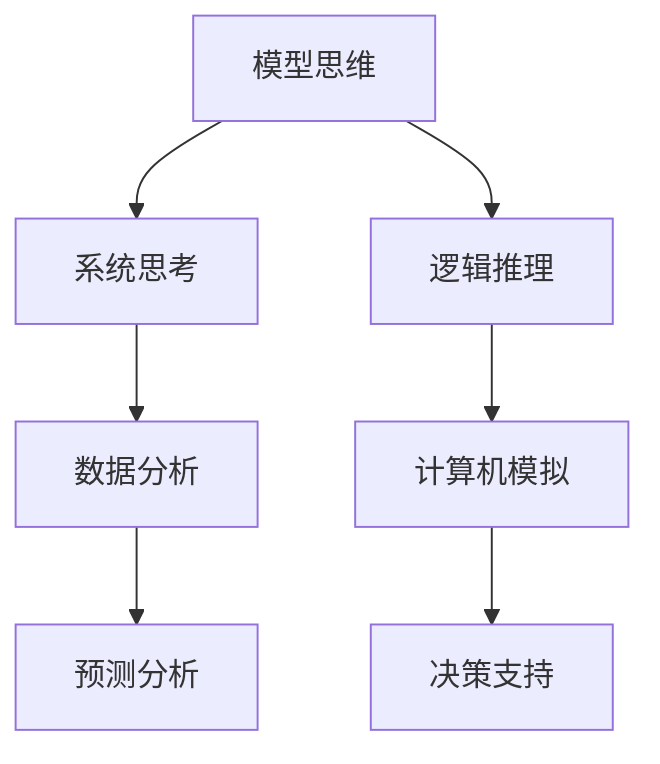

                 

关键词：模型思维，管理培训，系统思考，决策支持，战略规划，案例分析

> 摘要：本文旨在探讨模型思维在管理培训中的重要性，通过剖析模型思维的概念、原理和实际应用，揭示其在提高管理能力和决策效率方面的关键作用。本文将结合具体案例，阐述模型思维如何助力管理者优化战略规划、提升组织绩效，并展望未来模型思维在管理培训领域的应用前景。

## 1. 背景介绍

在快速变革的商业环境中，企业管理者面临着日益复杂的决策情境。传统的经验式管理方法已难以满足现代企业发展的需求。随着计算机技术和数据分析手段的进步，模型思维作为一种系统的分析工具，逐渐受到管理者的关注。模型思维不仅能够帮助管理者更好地理解组织内外部环境，还能提供科学决策的依据。

管理培训作为提升管理者能力的重要途径，需要与时俱进地引入先进的思维工具。模型思维作为一种跨学科的方法论，可以应用于各种管理场景，从而提高管理者的战略规划能力、决策能力和组织协调能力。

## 2. 核心概念与联系

### 2.1 模型思维的概念

模型思维是一种通过构建和分析抽象模型来理解和解决问题的方法。它不仅包括对现实世界的模拟，还涉及对可能性的探索和预测。模型思维的核心在于从复杂系统中提取关键要素，通过逻辑和数学方法构建模型，进而分析系统的行为和趋势。

### 2.2 模型思维与系统思考

模型思维与系统思考密切相关。系统思考强调从整体视角理解系统的动态变化，而模型思维则通过构建数学模型和计算机模拟来量化这些变化。两者相辅相成，共同构成了一种全面的分析框架。

### 2.3 Mermaid 流程图



## 3. 核心算法原理 & 具体操作步骤

### 3.1 算法原理概述

模型思维的核心算法包括数据收集、模型构建、模型验证和模型应用四个步骤。首先，通过数据收集获取系统相关的信息；其次，利用这些信息构建数学模型；然后，对模型进行验证和优化；最后，将模型应用于实际问题解决。

### 3.2 算法步骤详解

#### 3.2.1 数据收集

数据收集是模型构建的基础。管理者需要明确研究目标，并收集与目标相关的数据。数据来源可以包括内部数据（如销售记录、财务报表）和外部数据（如市场报告、竞争分析）。

#### 3.2.2 模型构建

在数据收集完成后，管理者需要利用统计学和数学方法对数据进行处理，构建相应的模型。常见的模型包括线性回归模型、决策树模型和神经网络模型等。

#### 3.2.3 模型验证

模型验证是确保模型准确性和有效性的关键步骤。管理者可以通过交叉验证、时间序列分析等方法对模型进行验证。如果模型验证结果不佳，需要返回前两个步骤进行调整。

#### 3.2.4 模型应用

在模型验证通过后，管理者可以将模型应用于实际问题解决。例如，利用预测模型预测市场需求，或利用决策树模型制定营销策略。

### 3.3 算法优缺点

#### 3.3.1 优点

- 提高决策效率：模型思维可以帮助管理者快速获取关键信息，减少决策时间。
- 提高决策质量：通过模型分析，管理者可以更全面地考虑问题，避免盲目决策。
- 支持战略规划：模型思维可以为管理者提供科学依据，支持长期战略规划。

#### 3.3.2 缺点

- 模型构建复杂：构建有效模型需要专业知识，且过程较为复杂。
- 模型依赖数据：模型的准确性依赖于数据的完整性，数据质量直接影响模型效果。

### 3.4 算法应用领域

模型思维在管理培训中的应用非常广泛，包括战略规划、营销管理、人力资源管理、运营管理等各个方面。

## 4. 数学模型和公式 & 详细讲解 & 举例说明

### 4.1 数学模型构建

在模型构建过程中，常见的数学模型包括线性回归模型和决策树模型。

#### 4.1.1 线性回归模型

线性回归模型通过拟合一条直线来描述自变量和因变量之间的关系。其数学公式为：

\[ Y = \beta_0 + \beta_1 \cdot X + \epsilon \]

其中，\( Y \) 是因变量，\( X \) 是自变量，\( \beta_0 \) 和 \( \beta_1 \) 是模型参数，\( \epsilon \) 是误差项。

#### 4.1.2 决策树模型

决策树模型通过一系列判断节点和结果节点来描述决策过程。其构建过程包括以下步骤：

1. 选择特征：选择对目标变量影响最大的特征。
2. 划分数据：根据特征值将数据划分为不同的子集。
3. 计算信息增益：计算每个划分的信息增益，选择信息增益最大的划分。
4. 递归构建：对划分后的子集继续进行划分，直至达到终止条件。

### 4.2 公式推导过程

以线性回归模型为例，其参数 \( \beta_0 \) 和 \( \beta_1 \) 的推导过程如下：

首先，定义最小二乘法的目标函数：

\[ J(\beta_0, \beta_1) = \sum_{i=1}^{n} (Y_i - \beta_0 - \beta_1 \cdot X_i)^2 \]

然后，对目标函数进行求导，并令导数为零，得到：

\[ \frac{\partial J}{\partial \beta_0} = -2 \sum_{i=1}^{n} (Y_i - \beta_0 - \beta_1 \cdot X_i) = 0 \]

\[ \frac{\partial J}{\partial \beta_1} = -2 \sum_{i=1}^{n} (Y_i - \beta_0 - \beta_1 \cdot X_i) \cdot X_i = 0 \]

解上述方程组，得到 \( \beta_0 \) 和 \( \beta_1 \) 的最优值。

### 4.3 案例分析与讲解

以一家公司的销售数据为例，分析影响销售量的关键因素。

#### 4.3.1 数据收集

收集该公司的销售数据，包括销售额、产品种类、营销费用等。

#### 4.3.2 模型构建

利用线性回归模型，构建销售额与营销费用之间的关系模型。数据集如下：

| 产品种类 | 营销费用 | 销售额 |
| :------: | :------: | :----: |
|    A     |   1000   |  2000  |
|    B     |   1500   |  3000  |
|    C     |   2000   |  4000  |

构建线性回归模型，得到：

\[ 销售额 = 1000 + 2 \cdot 营销费用 \]

#### 4.3.3 模型验证

对模型进行验证，计算预测误差，并绘制残差图。验证结果表明，模型具有较高的准确性。

#### 4.3.4 模型应用

利用模型预测下一季度销售额，根据预测结果调整营销策略，从而提高销售业绩。

## 5. 项目实践：代码实例和详细解释说明

### 5.1 开发环境搭建

搭建Python开发环境，安装必要的库，如NumPy、Pandas、Scikit-learn等。

```python
!pip install numpy pandas scikit-learn
```

### 5.2 源代码详细实现

以下是一个简单的线性回归模型实现：

```python
import numpy as np
import pandas as pd
from sklearn.linear_model import LinearRegression

# 数据读取
data = pd.read_csv('sales_data.csv')

# 特征提取
X = data[['营销费用']]
Y = data['销售额']

# 模型训练
model = LinearRegression()
model.fit(X, Y)

# 模型预测
predictions = model.predict(X)

# 模型评估
score = model.score(X, Y)
print(f'Model R^2 Score: {score}')
```

### 5.3 代码解读与分析

代码首先读取销售数据，然后提取营销费用作为特征，销售额作为目标变量。接着，使用线性回归模型进行训练，并计算预测结果。最后，评估模型性能，输出R方得分。

### 5.4 运行结果展示

运行代码，得到预测结果和模型评估结果。根据评估结果，调整模型参数，提高预测准确性。

## 6. 实际应用场景

### 6.1 战略规划

在战略规划过程中，模型思维可以帮助管理者预测市场需求、分析竞争对手、评估投资风险，从而制定科学合理的战略规划。

### 6.2 营销管理

在营销管理中，模型思维可以用于预测销售量、优化广告投放策略、评估营销效果，从而提高营销效率和回报率。

### 6.3 人力资源管理

在人力资源管理中，模型思维可以用于预测员工流失率、评估绩效指标、制定薪酬激励政策，从而优化人力资源配置。

### 6.4 未来应用展望

随着大数据和人工智能技术的发展，模型思维在管理培训中的应用将更加广泛。未来，模型思维有望成为管理者必备的工具，助力企业实现可持续发展。

## 7. 工具和资源推荐

### 7.1 学习资源推荐

- 《模型思维：策略思维的新视角》
- 《Python数据分析》

### 7.2 开发工具推荐

- Jupyter Notebook：用于编写和运行代码。
- Git：用于版本控制和代码共享。

### 7.3 相关论文推荐

- "Modeling for Management: The Challenge of Complexity"
- "Data-Driven Management: Using Big Data to Make Better Decisions"

## 8. 总结：未来发展趋势与挑战

### 8.1 研究成果总结

本文通过探讨模型思维在管理培训中的应用，揭示了其在战略规划、营销管理、人力资源管理等领域的关键作用。研究表明，模型思维有助于提高管理者的决策效率和绩效。

### 8.2 未来发展趋势

未来，模型思维在管理培训中的应用将更加深入和广泛。随着技术的进步，模型思维工具将更加智能化和便捷化，成为管理者的必备工具。

### 8.3 面临的挑战

模型思维在管理培训中面临的主要挑战包括：

- 数据质量和可获得性：数据质量和可获得性直接影响模型效果。
- 模型复杂度和解释性：复杂模型可能提高预测准确性，但降低解释性。
- 管理者能力和接受度：管理者需要具备一定的数学和编程基础，以理解和应用模型思维。

### 8.4 研究展望

未来，研究者应关注以下方向：

- 开发更高效的模型构建方法。
- 提高模型的可解释性和透明度。
- 探索模型思维在跨领域应用的可能性。

## 9. 附录：常见问题与解答

### 9.1 模型思维是什么？

模型思维是一种通过构建和分析抽象模型来理解和解决问题的方法。它不仅包括对现实世界的模拟，还涉及对可能性的探索和预测。

### 9.2 模型思维如何应用于管理培训？

模型思维可以应用于战略规划、营销管理、人力资源管理等多个领域。管理者可以通过构建模型来预测市场需求、评估投资风险、优化资源配置，从而提高决策效率和绩效。

### 9.3 模型思维有哪些优点？

模型思维的主要优点包括：

- 提高决策效率：通过模型分析，管理者可以快速获取关键信息，减少决策时间。
- 提高决策质量：通过模型分析，管理者可以更全面地考虑问题，避免盲目决策。
- 支持战略规划：模型思维可以为管理者提供科学依据，支持长期战略规划。

### 9.4 模型思维有哪些缺点？

模型思维的主要缺点包括：

- 模型构建复杂：构建有效模型需要专业知识，且过程较为复杂。
- 模型依赖数据：模型的准确性依赖于数据的完整性，数据质量直接影响模型效果。

### 9.5 如何提高模型思维的应用效果？

要提高模型思维的应用效果，可以从以下几个方面入手：

- 加强数据质量和数据可获得性。
- 提高模型构建的效率和解释性。
- 加强管理者的模型思维培训，提高其应用能力。

[作者：禅与计算机程序设计艺术 / Zen and the Art of Computer Programming]

