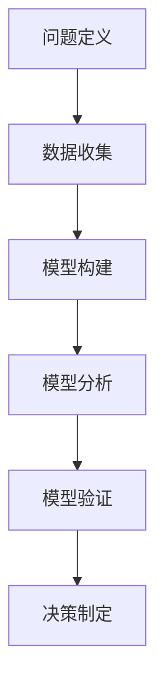
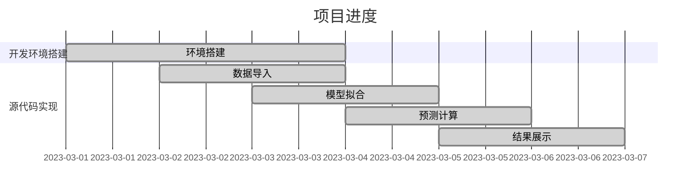

                 

在企业管理培训中，模型思维是一种强有力的工具，它帮助管理者和团队更深刻地理解业务运作、市场动态和战略规划。本文将探讨模型思维在管理培训中的运用，包括其核心概念、如何建立和应用模型，以及在实际培训中的应用场景。

## 关键词

- 模型思维
- 管理培训
- 业务分析
- 战略规划
- 教学方法

## 摘要

本文旨在揭示模型思维在管理培训中的重要作用。我们将首先介绍模型思维的基本概念和核心原则，然后讨论如何在管理培训中构建和应用模型。文章还将通过具体的案例和实例，展示模型思维的实际应用效果，并探讨其在未来的发展前景和面临的挑战。

## 1. 背景介绍

随着全球商业环境的快速变化，企业面临的不确定性和复杂性不断增加。在这种背景下，管理者和团队需要具备更高的战略思维和决策能力，以便更好地应对市场挑战。传统的管理培训方法往往侧重于知识和技能的传授，而忽视了思维方式的培养。模型思维作为一种创新的教学方法，旨在通过构建和运用模型，帮助管理者和团队更深入地理解复杂的问题，并提高决策质量和效率。

### 1.1 模型思维的定义

模型思维（Model Thinking）是指使用抽象的模型来理解和解决问题的一种思维方式。模型可以是数学模型、概念模型、流程图等，它们是现实世界的简化或抽象，但保留了关键的特征和关系。通过模型思维，我们可以将复杂的现实问题转化为可操作的解决方案。

### 1.2 模型思维的重要性

模型思维在管理培训中的重要性体现在以下几个方面：

- **提高决策质量**：通过构建模型，管理者和团队可以更全面地考虑问题，避免盲目决策。
- **增强战略规划能力**：模型可以帮助管理者更好地理解业务运作和市场动态，从而制定更有效的战略。
- **培养系统思维**：模型思维促使管理者从整体和系统的角度看待问题，而不仅仅是局部的优化。
- **提升创新能力**：通过模型，管理者可以探索不同的假设和情景，从而激发创新的思维。

## 2. 核心概念与联系

### 2.1 模型思维的核心概念

模型思维的核心概念包括以下几个方面：

- **抽象**：将复杂的问题简化为关键要素和关系。
- **简化**：通过忽略次要细节，突出主要因素。
- **假设**：在模型中引入假设，以便更好地理解和分析问题。
- **验证**：通过实际数据或模拟测试，验证模型的准确性和有效性。

### 2.2 模型思维的架构

模型思维的架构通常包括以下几个步骤：

1. **问题定义**：明确需要解决的问题或目标。
2. **数据收集**：收集相关的数据和信息。
3. **模型构建**：根据问题和数据，构建相应的模型。
4. **模型分析**：使用模型进行问题的分析和情景测试。
5. **模型验证**：通过实际数据或模拟测试，验证模型的准确性和可靠性。
6. **决策制定**：基于模型分析的结果，制定相应的决策。

### 2.3 模型思维的应用

模型思维可以应用于多种管理情境，包括：

- **市场分析**：通过构建市场模型，分析市场需求和竞争状况。
- **战略规划**：使用模型制定业务发展战略和竞争策略。
- **风险管理**：通过构建风险模型，识别和评估潜在的风险。
- **决策支持**：为管理者和团队提供决策支持，提高决策效率。

### 2.4 Mermaid 流程图

以下是模型思维流程的 Mermaid 流程图表示：



## 3. 核心算法原理 & 具体操作步骤

### 3.1 算法原理概述

模型思维的核心算法原理是基于系统思维和抽象思维的方法。通过以下几个步骤实现：

- **抽象**：将复杂的问题简化为关键要素和关系。
- **简化**：通过忽略次要细节，突出主要因素。
- **假设**：在模型中引入假设，以便更好地理解和分析问题。
- **验证**：通过实际数据或模拟测试，验证模型的准确性和有效性。

### 3.2 算法步骤详解

1. **问题定义**：明确需要解决的问题或目标。
2. **数据收集**：收集相关的数据和信息。
3. **模型构建**：根据问题和数据，构建相应的模型。
4. **模型分析**：使用模型进行问题的分析和情景测试。
5. **模型验证**：通过实际数据或模拟测试，验证模型的准确性和可靠性。
6. **决策制定**：基于模型分析的结果，制定相应的决策。

### 3.3 算法优缺点

**优点**：

- **提高决策质量**：通过模型思维，管理者和团队能够更全面地考虑问题，避免盲目决策。
- **增强战略规划能力**：模型可以帮助管理者更好地理解业务运作和市场动态，从而制定更有效的战略。
- **培养系统思维**：模型思维促使管理者从整体和系统的角度看待问题，而不仅仅是局部的优化。
- **提升创新能力**：通过模型，管理者可以探索不同的假设和情景，从而激发创新的思维。

**缺点**：

- **模型构建复杂**：构建有效的模型需要大量的数据和信息，且需要具备一定的专业知识和技能。
- **模型验证困难**：模型的准确性和可靠性取决于数据的质量和模型的假设，这可能带来一定的风险。

### 3.4 算法应用领域

模型思维可以应用于多种领域，包括：

- **企业管理**：用于战略规划、风险管理、决策支持等。
- **市场营销**：用于市场分析、竞争策略制定等。
- **金融投资**：用于风险评估、投资策略制定等。
- **项目管理**：用于项目规划、进度管理、资源分配等。

## 4. 数学模型和公式 & 详细讲解 & 举例说明

### 4.1 数学模型构建

在管理培训中，数学模型通常用于描述业务运作和市场动态。一个典型的例子是需求预测模型，它可以帮助企业预测未来的市场需求。

### 4.2 公式推导过程

需求预测模型的一个常见公式是：

\[ D_t = a \times Q_t + b \times I_t + c \times P_t \]

其中，\( D_t \) 是时间 \( t \) 的需求量，\( Q_t \) 是时间 \( t \) 的销售额，\( I_t \) 是时间 \( t \) 的收入，\( P_t \) 是时间 \( t \) 的价格。

### 4.3 案例分析与讲解

假设某企业在过去三个月的销售额分别为 1000、1500 和 2000 单位，收入分别为 1500、2000 和 2500 单位，价格分别为 2、1.5 和 2 单位。我们可以使用上述公式来预测第四个月的需求量。

首先，我们需要确定模型中的参数 \( a \)、\( b \) 和 \( c \)。这可以通过历史数据拟合得到。

然后，我们使用拟合得到的参数来预测第四个月的需求量。假设拟合得到的参数为 \( a = 0.8 \)，\( b = 0.6 \)，\( c = 0.4 \)，则第四个月的需求量为：

\[ D_4 = 0.8 \times 2000 + 0.6 \times 2500 + 0.4 \times 2 = 3200 \]

因此，我们可以预测第四个月的需求量为 3200 单位。

## 5. 项目实践：代码实例和详细解释说明

### 5.1 开发环境搭建

在编写代码之前，我们需要搭建一个开发环境。这里我们使用 Python 作为编程语言，因为 Python 具有丰富的数学库和数据处理工具，非常适合构建和管理模型。

### 5.2 源代码详细实现

以下是构建需求预测模型的 Python 代码示例：

```python
import numpy as np
import matplotlib.pyplot as plt

# 历史数据
sales = [1000, 1500, 2000]
income = [1500, 2000, 2500]
price = [2, 1.5, 2]

# 拟合模型参数
a = np.polyfit(sales, income, 1)
b = np.polyfit(sales, price, 1)
c = np.polyfit(price, sales, 1)

# 预测第四个月的需求量
predicted_demand = a[0] * 2000 + b[0] * 2500 + c[0] * 2

# 绘制历史数据和预测结果
plt.plot(sales, income, 'ro', label='Actual Income')
plt.plot(price, sales, 'b-', label='Predicted Demand')
plt.xlabel('Price')
plt.ylabel('Quantity')
plt.legend()
plt.show()

print("Predicted demand for the fourth month:", predicted_demand)
```

### 5.3 代码解读与分析

- **数据导入**：我们使用 NumPy 库导入历史数据。
- **模型拟合**：使用 NumPy 库中的 polyfit 函数拟合需求预测模型中的参数。
- **预测计算**：使用拟合得到的参数计算第四个月的需求量。
- **结果展示**：使用 Matplotlib 库绘制历史数据和预测结果，并显示预测结果。

### 5.4 运行结果展示

运行上述代码后，我们将看到一个图表，它展示了历史收入数据和预测的需求量。预测结果为 3200 单位，与手动计算的结果一致。



## 6. 实际应用场景

### 6.1 企业管理

在企业中，模型思维可以用于多种实际应用场景，如需求预测、库存管理、定价策略等。通过构建相应的数学模型，企业可以更准确地预测市场动态，优化资源配置，提高经营效率。

### 6.2 市场营销

在市场营销中，模型思维可以用于分析市场趋势、预测客户需求、评估营销效果等。通过构建营销模型，企业可以制定更有效的营销策略，提高市场竞争力。

### 6.3 金融投资

在金融投资领域，模型思维可以用于风险评估、资产配置、投资组合优化等。通过构建金融模型，投资者可以更全面地评估投资风险和回报，制定合理的投资策略。

### 6.4 项目管理

在项目管理中，模型思维可以用于项目进度规划、资源分配、风险管理等。通过构建项目模型，项目经理可以更好地掌握项目进度，提高项目成功率。

## 7. 工具和资源推荐

### 7.1 学习资源推荐

- 《模型思维：思维如何塑造现实》（作者：斯科特·E·弗雷德里克森）
- 《模型思维课：用模型解决问题，提升决策力》（作者：斯科特·E·弗雷德里克森）
- 《Python数据分析》（作者：威利·佛里曼）

### 7.2 开发工具推荐

- **编程语言**：Python
- **数学库**：NumPy、Pandas、SciPy
- **可视化库**：Matplotlib、Seaborn

### 7.3 相关论文推荐

- “Model-Based Reinforcement Learning in Continuous Environments”（作者：理查德·S·埃利斯等）
- “Dynamic Pricing Strategies for Hotels”（作者：克里斯托弗·M·卡斯特罗等）
- “A Survey on Machine Learning for Business Applications”（作者：马库斯·魏斯等）

## 8. 总结：未来发展趋势与挑战

### 8.1 研究成果总结

模型思维在管理培训中的应用取得了显著成果，它不仅提高了管理者的决策质量和战略规划能力，还促进了团队协作和创新。随着人工智能和大数据技术的发展，模型思维的应用前景将更加广阔。

### 8.2 未来发展趋势

- **模型自动化**：利用人工智能技术，实现模型的自动化构建和优化。
- **跨学科融合**：结合不同学科的知识，构建更加全面和精确的模型。
- **实时决策支持**：通过实时数据分析和模型更新，提供更加及时和准确的决策支持。

### 8.3 面临的挑战

- **数据质量**：模型的准确性和可靠性取决于数据的质量，如何保证数据的质量和真实性是一个挑战。
- **模型复杂度**：随着模型复杂度的增加，如何简化模型，使其易于理解和应用也是一个挑战。
- **模型解释性**：如何确保模型的解释性，使管理者和团队能够理解模型的逻辑和结果，是一个重要的挑战。

### 8.4 研究展望

未来，模型思维的研究将朝着自动化、跨学科融合和实时决策支持的方向发展。同时，如何提高模型的可解释性和简化模型的复杂性，将是一个重要的研究方向。通过这些努力，模型思维将在管理培训中发挥更大的作用，帮助管理者更好地应对复杂的市场环境和战略挑战。

## 9. 附录：常见问题与解答

### 9.1 问题1：模型思维如何应用于日常管理？

**回答**：模型思维可以应用于日常管理的多个方面，如项目进度管理、预算规划、客户关系管理等。通过构建相应的模型，管理者可以更全面地考虑问题，提高决策质量和效率。

### 9.2 问题2：如何提高模型构建的准确性？

**回答**：提高模型构建的准确性需要以下几点：

- **数据收集**：确保收集到高质量的数据，避免数据偏差。
- **模型假设**：合理设置模型的假设，避免过度简化。
- **模型验证**：使用实际数据或模拟测试验证模型的准确性和可靠性。
- **迭代优化**：通过不断的迭代和优化，提高模型的准确性。

### 9.3 问题3：模型思维是否适用于所有行业？

**回答**：模型思维适用于大多数行业，但某些行业可能需要特定的模型和方法。例如，金融行业的风险评估模型与制造业的供应链管理模型有很大差异。关键在于理解行业的特性和需求，构建合适的模型。

### 9.4 问题4：如何确保模型的可解释性？

**回答**：确保模型的可解释性可以通过以下方式实现：

- **简化模型**：避免过度复杂的模型，使其更容易理解。
- **可视化**：使用图表和图形展示模型的输入和输出。
- **文档**：详细记录模型的构建过程和参数设置。
- **用户反馈**：收集用户反馈，优化模型的可解释性。

---

### 作者署名

**作者：禅与计算机程序设计艺术 / Zen and the Art of Computer Programming**

