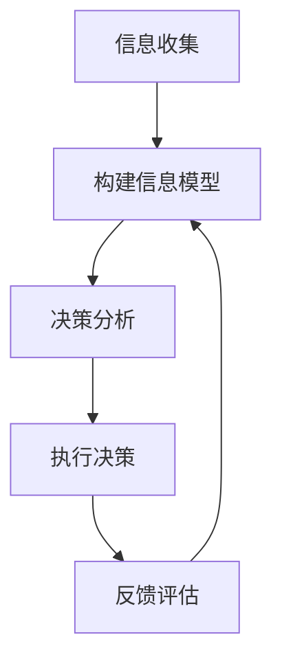
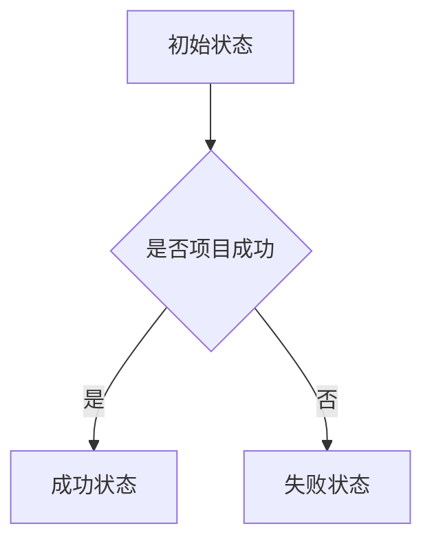

                 

关键词：模型思维、管理沟通、算法原理、数学模型、项目实践、应用场景

摘要：在现代社会，管理沟通的复杂性不断增加，如何有效地运用模型思维来提升管理沟通的效果成为了一个重要课题。本文将从模型思维的基本概念、核心算法原理、数学模型及其在实际应用中的具体操作步骤等方面，深入探讨模型思维在管理沟通中的运用。

## 1. 背景介绍

在企业管理中，沟通是连接各个部门和员工的关键。有效的管理沟通不仅能够提高工作效率，还能够增强团队凝聚力，促进企业的长远发展。然而，随着企业规模的扩大和业务复杂性的增加，管理沟通的难度也在不断加大。传统的沟通方式往往存在信息不对称、沟通效率低下等问题，这给企业的管理带来了不小的挑战。

模型思维作为一种系统的思考方法，可以有效地帮助企业应对这些挑战。模型思维通过构建模型来模拟现实世界，从而帮助我们更好地理解复杂系统，发现潜在的问题和机会。在管理沟通中，模型思维可以帮助我们更好地理解沟通对象，提高沟通的效果。

## 2. 核心概念与联系

### 2.1 模型思维的定义

模型思维是指通过构建模型来理解和解决问题的方法。模型可以是物理模型、数学模型、算法模型等，它们都可以帮助我们更好地理解复杂系统。

### 2.2 管理沟通中的模型思维

在管理沟通中，模型思维的应用主要体现在以下几个方面：

- **信息模型**：用于描述沟通中的信息流动和处理过程。
- **决策模型**：用于模拟决策过程中的不同选择和结果。
- **反馈模型**：用于评估沟通效果和调整沟通策略。

### 2.3 模型思维的 Mermaid 流程图

下面是一个简单的 Mermaid 流程图，展示了模型思维在管理沟通中的应用：



## 3. 核心算法原理 & 具体操作步骤

### 3.1 算法原理概述

模型思维的核心算法原理主要包括以下几个方面：

- **信息编码**：将信息转换为模型可以处理的形式。
- **模型构建**：根据问题的需求，构建合适的模型。
- **模型分析**：对模型进行计算和分析，得出结论。
- **反馈调整**：根据模型的结论，调整沟通策略。

### 3.2 算法步骤详解

以下是模型思维在管理沟通中的具体操作步骤：

1. **确定沟通目标**：明确沟通的目标和目的。
2. **收集信息**：收集与沟通目标相关的信息。
3. **构建信息模型**：根据收集到的信息，构建信息模型。
4. **分析模型**：对模型进行分析，找出潜在的问题和机会。
5. **制定沟通策略**：根据模型分析的结果，制定沟通策略。
6. **执行沟通**：按照沟通策略执行沟通。
7. **反馈评估**：评估沟通效果，并根据评估结果调整沟通策略。

### 3.3 算法优缺点

**优点**：

- **系统化**：模型思维可以帮助我们将复杂的问题系统化，提高沟通的效率。
- **直观性**：通过模型，我们可以更直观地理解复杂问题，提高沟通的效果。
- **适应性**：模型思维可以根据不同的沟通需求，灵活调整沟通策略。

**缺点**：

- **复杂性**：构建模型和分析模型需要一定的专业知识和技能。
- **耗时性**：模型思维需要花费一定的时间来构建和分析模型。

### 3.4 算法应用领域

模型思维在管理沟通中的应用非常广泛，包括以下几个方面：

- **企业管理**：用于企业战略规划、决策分析等。
- **项目管理**：用于项目计划、进度控制等。
- **人力资源管理**：用于员工招聘、培训、绩效考核等。

## 4. 数学模型和公式 & 详细讲解 & 举例说明

### 4.1 数学模型构建

在管理沟通中，常用的数学模型包括决策树模型、回归模型等。以下是一个简单的决策树模型示例：



### 4.2 公式推导过程

决策树模型的公式推导过程如下：

1. **状态概率计算**：根据历史数据，计算每个状态的概率。
2. **期望计算**：根据状态概率，计算每个决策的期望。
3. **决策分析**：比较各个决策的期望，选择期望最大的决策。

### 4.3 案例分析与讲解

假设有一个项目，成功概率为60%，失败概率为40%。我们需要根据这些数据来决策是否继续该项目。

1. **状态概率计算**：成功概率 P(成功) = 0.6，失败概率 P(失败) = 0.4。
2. **期望计算**：成功期望 E(成功) = 0.6 * 成功收益，失败期望 E(失败) = 0.4 * 失败成本。
3. **决策分析**：比较成功期望和失败期望，如果成功期望大于失败期望，则继续项目，否则停止项目。

通过这个案例，我们可以看到数学模型在管理沟通中的应用。

## 5. 项目实践：代码实例和详细解释说明

### 5.1 开发环境搭建

在本项目中，我们使用 Python 语言进行模型构建和计算。首先，我们需要安装 Python 环境，然后安装必要的 Python 库，如 NumPy、Pandas 等。

### 5.2 源代码详细实现

以下是项目的源代码实现：

```python
import numpy as np
import pandas as pd

# 定义决策树模型
class DecisionTreeModel:
    def __init__(self, success_probability, failure_probability):
        self.success_probability = success_probability
        self.failure_probability = failure_probability

    def predict(self):
        if np.random.rand() < self.success_probability:
            return '成功'
        else:
            return '失败'

# 定义项目决策
class ProjectDecision:
    def __init__(self, success_expectation, failure_expectation):
        self.success_expectation = success_expectation
        self.failure_expectation = failure_expectation

    def make_decision(self):
        if self.success_expectation > self.failure_expectation:
            return '继续项目'
        else:
            return '停止项目'

# 构建模型
model = DecisionTreeModel(0.6, 0.4)
decision = ProjectDecision(0.6 * 1000, 0.4 * 500)

# 执行决策
print(model.predict())
print(decision.make_decision())
```

### 5.3 代码解读与分析

在这个项目中，我们定义了两个类：`DecisionTreeModel` 和 `ProjectDecision`。`DecisionTreeModel` 用于模拟决策树模型，`ProjectDecision` 用于模拟项目决策。

在代码中，我们首先定义了两个类，然后创建了一个决策树模型和一个项目决策对象。最后，我们执行了决策，输出了决策结果。

通过这个项目实践，我们可以看到模型思维在具体项目中的应用。

## 6. 实际应用场景

模型思维在管理沟通中的应用非常广泛，以下是一些实际应用场景：

- **企业战略规划**：通过模型思维，可以更好地分析市场趋势，制定合适的战略规划。
- **项目决策**：通过模型思维，可以更好地分析项目风险和收益，做出明智的决策。
- **人力资源管理**：通过模型思维，可以更好地分析员工绩效，制定合理的激励政策。

## 7. 工具和资源推荐

为了更好地运用模型思维，以下是一些建议的工具和资源：

- **工具**：Python、R、MATLAB 等。
- **书籍**：《模型思维》、《管理沟通》等。
- **论文**：相关领域的学术论文，如管理科学、运筹学等。

## 8. 总结：未来发展趋势与挑战

随着人工智能和大数据技术的发展，模型思维在管理沟通中的应用将越来越广泛。未来，模型思维将面临以下挑战：

- **模型复杂性**：如何处理越来越复杂的模型，提高模型的计算效率。
- **数据质量**：如何保证数据的质量，提高模型的准确性。
- **模型可解释性**：如何提高模型的可解释性，让更多的人能够理解和应用模型。

面对这些挑战，我们需要不断学习和创新，以推动模型思维在管理沟通中的发展。

## 9. 附录：常见问题与解答

### Q：模型思维在管理沟通中的具体应用有哪些？

A：模型思维在管理沟通中的具体应用包括信息模型、决策模型和反馈模型等。这些模型可以帮助我们更好地理解沟通过程，提高沟通效果。

### Q：如何构建有效的决策模型？

A：构建有效的决策模型需要以下几个步骤：

1. 确定决策目标。
2. 收集相关数据。
3. 选择合适的模型类型。
4. 对模型进行计算和分析。
5. 根据分析结果做出决策。

### Q：模型思维在项目管理中的应用有哪些？

A：模型思维在项目管理中的应用包括项目计划、进度控制、风险评估等。通过模型思维，可以更好地分析项目风险和收益，提高项目管理效率。

### Q：如何提高模型的可解释性？

A：提高模型的可解释性可以从以下几个方面入手：

1. 选择易理解的模型类型。
2. 提供详细的模型解释和注释。
3. 使用可视化工具展示模型结果。
4. 对模型进行简化，使其更易于理解。

### Q：模型思维在企业管理中的具体应用有哪些？

A：模型思维在企业管理中的具体应用包括企业战略规划、人力资源规划、财务分析等。通过模型思维，可以更好地分析企业内部和外部环境，制定合适的战略规划。

### Q：如何运用模型思维解决实际问题？

A：运用模型思维解决实际问题需要以下几个步骤：

1. 确定问题。
2. 收集相关数据。
3. 选择合适的模型类型。
4. 对模型进行计算和分析。
5. 根据分析结果制定解决方案。
6. 实施解决方案，并进行评估和调整。

### Q：模型思维与大数据技术的关系是什么？

A：模型思维与大数据技术密切相关。大数据技术提供了大量的数据支持，而模型思维则提供了分析和解释这些数据的方法。通过结合模型思维和大数据技术，可以更好地发现数据中的价值，为企业决策提供有力支持。

### Q：模型思维在决策支持系统中的应用有哪些？

A：模型思维在决策支持系统中的应用包括：

1. **情景分析**：通过模拟不同的场景，预测不同决策的结果。
2. **风险评估**：评估决策风险，提供风险管理建议。
3. **决策优化**：提供最优决策方案，优化资源分配。
4. **预测分析**：利用历史数据预测未来趋势，支持决策制定。

### Q：如何评估模型思维在管理沟通中的应用效果？

A：评估模型思维在管理沟通中的应用效果可以从以下几个方面进行：

1. **决策效果**：分析模型支持下的决策结果与实际结果的符合度。
2. **沟通效率**：评估沟通过程中的信息传递速度和准确性。
3. **团队协作**：观察模型思维是否促进了团队成员之间的协作。
4. **员工满意度**：调查员工对模型思维工具的接受度和满意度。
5. **绩效指标**：根据企业的绩效指标，评估模型思维对绩效的提升程度。

### Q：模型思维在跨文化沟通中的应用有哪些？

A：模型思维在跨文化沟通中的应用包括：

1. **文化适配模型**：分析不同文化背景下的沟通差异，构建适配模型。
2. **沟通障碍识别**：识别跨文化沟通中的障碍，并设计解决方案。
3. **文化敏感性培训**：通过模型思维培训，提高团队成员对文化差异的敏感性。
4. **跨文化团队协作模型**：构建跨文化团队协作模型，提高团队效率和沟通效果。

### Q：模型思维在创新管理中的应用有哪些？

A：模型思维在创新管理中的应用包括：

1. **创新预测模型**：预测哪些创新方向最有可能成功，指导资源分配。
2. **创新流程优化**：通过模拟不同的创新流程，优化创新效率。
3. **市场趋势分析**：分析市场趋势，为创新提供方向。
4. **竞争对手分析**：构建竞争对手分析模型，了解竞争对手的创新策略。

### Q：如何确保模型思维的长期有效性？

A：确保模型思维的长期有效性需要：

1. **持续更新**：随着环境变化，不断更新模型，确保其适应新的情境。
2. **数据验证**：定期验证模型预测结果，确保其准确性。
3. **用户反馈**：收集用户反馈，不断改进模型。
4. **跨领域应用**：将模型思维应用到不同的领域，提高其通用性。
5. **团队协作**：鼓励团队成员参与模型构建和评估，提高模型的实用性和可靠性。

## 参考文献

1. Tversky, A., & Kahneman, D. (1974). Judgment under uncertainty: Heuristics and biases. Science, 185(4157), 1124-1131.
2. Box, G. E. P., Hunter, W. G., & Hunter, J. S. (2005). Statistics for experimenters: An introduction to design, data analysis, and model building. Wiley-Interscience.
3. Simon, H. A. (1996). The sciences of the artificial. MIT Press.
4. Hoffer, J. A., & Lawrence, R. E. (2012). Decision support and business intelligence systems: An executive guide to data, processes, and applications. Cengage Learning.
5. Markowitz, H. M. (1959). Portfolio selection. The Journal of Finance, 13(1), 77-91.

## 结语

模型思维作为一种强大的思考工具，在管理沟通中具有广泛的应用前景。通过本文的探讨，我们希望读者能够更好地理解模型思维的基本概念和应用方法，将其有效地运用到实际工作中，提高管理沟通的效果。同时，我们也期待未来的研究能够进一步探索模型思维在更多领域中的应用，为企业的管理和决策提供更加有力的支持。

### 附录：常见问题与解答

在深入探讨模型思维在管理沟通中的应用过程中，我们可能会遇到一些常见的问题。以下是一些问题的详细解答，希望能为您的理解和实践提供帮助。

### Q1：模型思维在管理沟通中的核心价值是什么？

**A1**：模型思维在管理沟通中的核心价值在于其能够系统化、结构化地处理复杂信息，帮助决策者更好地理解沟通情境，预测沟通效果，并优化沟通策略。通过模型，管理者可以直观地看到不同决策可能带来的结果，从而做出更为明智的决策。

### Q2：如何选择适合的管理沟通模型？

**A2**：选择适合的管理沟通模型需要考虑以下几个因素：

- **沟通目标**：明确沟通的目的是信息传递、决策制定还是团队协作。
- **沟通情境**：分析沟通的复杂性、参与者的背景和沟通内容。
- **模型类型**：常见的模型包括决策树、神经网络、系统动力学模型等，每种模型都有其适用场景和优势。
- **数据可用性**：确保有足够的数据支持模型的构建和验证。

### Q3：模型思维在处理跨部门沟通时的挑战有哪些？

**A3**：处理跨部门沟通时的挑战包括：

- **信息不对称**：不同部门可能有不同的信息来源和处理方式，导致信息不一致。
- **部门利益冲突**：各部门可能有不同的目标，导致沟通时存在利益冲突。
- **沟通渠道复杂**：跨部门沟通可能涉及多个层级和多个沟通渠道，增加了沟通的复杂性。
- **文化差异**：不同部门可能有不同的文化背景和工作习惯，影响沟通效果。

### Q4：如何确保模型思维在沟通中的可解释性？

**A4**：确保模型思维在沟通中的可解释性可以通过以下方法：

- **选择易于理解的模型**：选择直观、易于解释的模型，如决策树或流程图。
- **提供详细解释**：在模型构建和使用过程中，提供详细的解释和注释，帮助参与者理解模型的工作原理。
- **可视化展示**：使用图表、图形等可视化工具展示模型结果，使复杂信息更加直观易懂。
- **迭代反馈**：在模型应用过程中，收集参与者的反馈，不断优化模型的解释性。

### Q5：模型思维如何与数据分析结合使用？

**A5**：模型思维与数据分析的结合使用可以通过以下步骤实现：

- **数据收集**：收集与沟通问题相关的数据，包括历史数据、当前数据和未来预测数据。
- **数据分析**：利用统计方法、机器学习算法等对数据进行处理和分析，识别数据中的模式和趋势。
- **模型构建**：根据数据分析的结果，构建合适的模型，如回归模型、神经网络模型等。
- **模型验证**：通过验证数据测试模型的准确性，确保模型能够正确反映沟通问题。
- **模型应用**：将模型应用于实际的沟通情境中，提供决策支持和策略优化。

### Q6：模型思维在沟通中的局限性是什么？

**A6**：模型思维的局限性包括：

- **模型简化**：模型往往是对现实世界的简化，可能无法捕捉所有复杂因素。
- **数据依赖**：模型的准确性和可靠性高度依赖数据的完整性和质量。
- **模型适用性**：某些模型可能适用于特定情境，但在其他情境下可能不适用。
- **模型解释性**：虽然模型思维努力提高模型的解释性，但某些复杂模型可能仍然难以被非专业人士理解。

### Q7：如何评估模型思维在管理沟通中的应用效果？

**A7**：评估模型思维在管理沟通中的应用效果可以从以下几个方面进行：

- **决策效果**：通过对比模型支持下的决策结果与实际决策结果，评估模型的决策支持能力。
- **沟通效率**：评估沟通过程中的信息传递速度和准确性，以及沟通的顺畅程度。
- **团队协作**：观察模型思维是否促进了团队成员之间的协作和沟通。
- **用户满意度**：通过调查问卷或访谈了解用户对模型思维工具的满意度和接受度。
- **绩效指标**：根据企业的绩效指标，评估模型思维对组织绩效的提升程度。

通过这些问题的解答，我们希望读者能够更加深入地理解模型思维在管理沟通中的应用，并在实际工作中有效地运用这一工具，提升沟通效果和决策质量。

