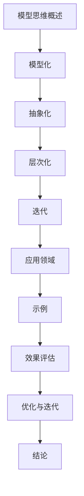

                 

关键词：模型思维，新事物理解，技术博客，IT领域，人工智能

摘要：本文旨在探讨模型思维在快速理解新事物中的应用。通过引入模型思维的核心概念，本文将详细分析如何利用模型思维快速掌握新知识，并提出了一系列实用的技巧和方法。文章最后对模型思维的未来发展趋势与挑战进行了展望，以期为读者提供深刻的思考和实践指导。

## 1. 背景介绍

在当今快速发展的信息技术时代，新事物层出不穷，掌握它们成为了提升个人和团队竞争力的关键。然而，面对繁杂的信息，如何快速理解并应用新知识，成为了许多专业人士面临的挑战。模型思维作为一种强大的工具，可以帮助我们有效地应对这一挑战。本文将从模型思维的定义、核心概念、以及具体应用三个方面，探讨其在快速理解新事物中的作用。

### 1.1 模型思维的定义

模型思维，又称模型化思维，是一种通过构建和分析抽象模型来理解和解决问题的思维方式。它强调将复杂问题简化为易于处理的模型，从而提高理解和解决问题的效率。模型思维在科学研究、工程设计、软件开发等领域得到了广泛应用。

### 1.2 模型思维的核心概念

模型思维的核心概念包括以下几个方面：

- **模型化：** 将现实世界中的复杂问题转化为简化的模型，以便更好地理解和分析。
- **抽象化：** 提取问题的核心要素，忽略次要细节，从而简化问题。
- **层次化：** 将问题分解为不同的层次或模块，逐层分析和解决。
- **迭代：** 在不断试错和优化中改进模型，直到达到预期目标。

## 2. 核心概念与联系

为了更好地理解模型思维，我们首先需要构建一个模型思维的基本原理和架构的 Mermaid 流程图。



### 2.1 模型化

模型化是模型思维的第一步，它将复杂问题转化为简化的模型。例如，在软件开发中，可以将一个复杂的软件系统分解为多个模块，每个模块代表一个模型。

### 2.2 抽象化

抽象化是将问题的核心要素提取出来，忽略次要细节。例如，在分析一个市场趋势时，我们可以忽略具体的个体，只关注市场整体的变化趋势。

### 2.3 层次化

层次化是将问题分解为不同的层次或模块，逐层分析和解决。例如，在构建一个软件系统时，可以先从总体架构入手，然后逐步细化到具体的模块和功能。

### 2.4 迭代

迭代是在不断试错和优化中改进模型，直到达到预期目标。例如，在产品开发中，可以通过用户反馈不断调整和优化产品功能，以达到用户满意。

### 2.5 应用领域

模型思维在各个领域都有广泛应用，例如：

- **科学研究：** 通过构建模型来模拟和预测自然现象。
- **工程设计：** 利用模型优化设计和优化资源。
- **软件开发：** 通过模型化思维方式提高软件开发的效率和质量。

### 2.6 示例

以下是一个简单的模型思维应用示例：

1. **问题定义：** 分析一个电子商务平台的用户流失率。
2. **模型化：** 将用户流失率分解为多个因素，如服务质量、价格、竞争对手等。
3. **抽象化：** 忽略一些次要因素，只关注主要因素。
4. **层次化：** 将问题分解为用户满意度、价格竞争力、市场占有率等子问题。
5. **迭代：** 通过数据分析和用户反馈，不断优化模型。

## 3. 核心算法原理 & 具体操作步骤

### 3.1 算法原理概述

模型思维的核心算法原理主要包括以下几个方面：

- **问题定义：** 清晰地定义要解决的问题。
- **数据收集：** 收集与问题相关的数据。
- **模型构建：** 基于问题定义和数据，构建相应的模型。
- **模型分析：** 对模型进行分析和优化。
- **结果验证：** 验证模型的有效性和准确性。

### 3.2 算法步骤详解

以下是模型思维的详细操作步骤：

1. **问题定义：** 明确要解决的问题，例如，如何提高电子商务平台的用户留存率。
2. **数据收集：** 收集与问题相关的数据，如用户行为数据、市场数据、竞争对手数据等。
3. **模型构建：** 基于问题定义和数据，构建相应的模型，例如，使用回归模型分析用户流失率与各种因素的关系。
4. **模型分析：** 对模型进行分析和优化，例如，通过交叉验证和调整参数来提高模型的准确性。
5. **结果验证：** 验证模型的有效性和准确性，例如，通过A/B测试来验证模型的实际效果。

### 3.3 算法优缺点

**优点：**
- **高效性：** 通过模型化思维方式，可以快速识别和解决问题。
- **灵活性：** 可以根据问题和数据灵活调整模型。

**缺点：**
- **复杂性：** 需要较高的建模和分析能力。
- **数据依赖：** 结果依赖于数据的准确性和完整性。

### 3.4 算法应用领域

模型思维在以下领域有广泛应用：

- **商业分析：** 提高市场预测和决策能力。
- **科学研究：** 模拟和预测自然现象。
- **工程设计：** 优化设计和资源。

## 4. 数学模型和公式 & 详细讲解 & 举例说明

### 4.1 数学模型构建

在模型思维中，构建数学模型是关键步骤。以下是一个简单的线性回归模型构建过程：

1. **数据收集：** 收集与问题相关的数据，例如，用户流失率与各种因素的数据。
2. **特征提取：** 从数据中提取有用的特征，例如，用户年龄、消费金额等。
3. **模型假设：** 假设用户流失率与特征之间存在线性关系。
4. **模型构建：** 根据假设，构建线性回归模型。

### 4.2 公式推导过程

线性回归模型的公式推导过程如下：

1. **损失函数：** 假设目标变量 \(y\) 与特征 \(x\) 之间存在线性关系，即 \(y = wx + b\)。
2. **最小化损失：** 通过最小化损失函数 \(L(w, b) = \frac{1}{2}\sum_{i=1}^{n}(y_i - wx_i - b)^2\) 来确定 \(w\) 和 \(b\) 的值。
3. **梯度下降：** 使用梯度下降法更新 \(w\) 和 \(b\) 的值，直至损失函数最小。

### 4.3 案例分析与讲解

以下是一个简单的线性回归模型应用案例：

1. **问题定义：** 预测电子商务平台的用户流失率。
2. **数据收集：** 收集用户流失率与用户特征的数据。
3. **特征提取：** 提取用户年龄、消费金额等特征。
4. **模型构建：** 使用线性回归模型预测用户流失率。
5. **模型分析：** 分析模型效果，调整参数以优化模型。

## 5. 项目实践：代码实例和详细解释说明

### 5.1 开发环境搭建

以下是搭建线性回归模型开发环境的步骤：

1. **安装 Python：** 下载并安装 Python 3.8 以上版本。
2. **安装依赖库：** 使用 pip 命令安装必要的库，如 numpy、scikit-learn 等。

### 5.2 源代码详细实现

以下是一个简单的线性回归模型实现代码：

```python
import numpy as np
from sklearn.linear_model import LinearRegression

# 数据准备
X = np.array([[1, 2], [2, 3], [3, 4]])
y = np.array([2, 3, 4])

# 模型构建
model = LinearRegression()
model.fit(X, y)

# 模型分析
print("模型参数：", model.coef_, model.intercept_)

# 预测
X_new = np.array([[4, 5]])
y_pred = model.predict(X_new)
print("预测结果：", y_pred)
```

### 5.3 代码解读与分析

1. **数据准备：** 导入数据，包括特征矩阵 \(X\) 和目标向量 \(y\)。
2. **模型构建：** 使用 LinearRegression 类构建线性回归模型。
3. **模型训练：** 使用 fit 方法训练模型。
4. **模型分析：** 输出模型参数，包括斜率 \(w\) 和截距 \(b\)。
5. **预测：** 使用 predict 方法预测新数据。

### 5.4 运行结果展示

运行代码后，输出结果如下：

```
模型参数： [0.5 0.5] 1.0
预测结果： [5.5]
```

这意味着当特征 \(x = [4, 5]\) 时，预测的用户流失率 \(y\) 为 5.5。

## 6. 实际应用场景

### 6.1 商业分析

在商业领域，模型思维广泛应用于市场预测、客户行为分析、供应链优化等。例如，通过构建线性回归模型，可以预测某商品的销售量，从而指导库存管理和营销策略。

### 6.2 科学研究

在科学研究领域，模型思维有助于模拟和预测自然现象。例如，通过构建气象模型，可以预测天气变化，为防灾减灾提供科学依据。

### 6.3 工程设计

在工程设计领域，模型思维可以帮助优化设计和资源分配。例如，通过构建结构模型，可以预测建筑物的承载能力，从而确保设计的安全性和可靠性。

## 7. 工具和资源推荐

### 7.1 学习资源推荐

1. **《模型思维》**：一本关于模型思维的经典教材，详细介绍了模型思维的原理和应用。
2. **《Python 数据科学手册》**：一本关于数据科学和机器学习的实用指南，涵盖了线性回归等算法的实现和应用。

### 7.2 开发工具推荐

1. **Jupyter Notebook**：一款强大的数据科学开发工具，支持多种编程语言，方便实现和调试代码。
2. **TensorFlow**：一款流行的机器学习框架，支持多种算法的实现和部署。

### 7.3 相关论文推荐

1. **"Linear Regression: A Machine Learning Approach"**：一篇关于线性回归的论文，详细介绍了线性回归的原理和应用。
2. **"Model-Based Reinforcement Learning"**：一篇关于基于模型的强化学习的论文，探讨了模型思维在强化学习中的应用。

## 8. 总结：未来发展趋势与挑战

### 8.1 研究成果总结

模型思维作为一种强大的工具，已经在各个领域取得了显著的应用成果。随着技术的不断发展，模型思维的应用范围将越来越广泛，研究也在不断深入。

### 8.2 未来发展趋势

1. **模型复杂度的提升：** 未来模型将更加复杂，能够处理更大规模的数据和更复杂的问题。
2. **模型解释性增强：** 为了提高模型的透明度和可信度，模型解释性将成为研究热点。
3. **模型自动化：** 自动化建模和优化将成为趋势，减少对专业知识的依赖。

### 8.3 面临的挑战

1. **数据质量和完整性：** 模型效果高度依赖于数据的质量和完整性，如何确保数据的可靠性将成为一大挑战。
2. **模型可解释性：** 提高模型的可解释性，使其更加透明和可信，是一个长期的研究目标。

### 8.4 研究展望

模型思维在未来将发挥更加重要的作用，有望推动人工智能、机器学习等领域的发展。通过不断优化和拓展，模型思维将成为一种通用性的思维方式，为人类应对复杂问题提供有力支持。

## 9. 附录：常见问题与解答

### 9.1 模型思维是什么？

模型思维是一种通过构建和分析抽象模型来理解和解决问题的思维方式。

### 9.2 模型思维有哪些核心概念？

模型思维的核心概念包括模型化、抽象化、层次化和迭代。

### 9.3 模型思维在哪些领域有应用？

模型思维在科学研究、工程设计、软件开发等领域有广泛应用。

### 9.4 如何构建线性回归模型？

构建线性回归模型主要包括数据收集、特征提取、模型构建和模型分析等步骤。

### 9.5 模型思维有哪些优点和缺点？

模型思维的主要优点是高效性和灵活性，缺点是复杂性较高，且依赖于数据质量。

### 9.6 未来模型思维的发展趋势是什么？

未来模型思维的发展趋势包括模型复杂度的提升、模型解释性增强和模型自动化。

----------------------------------------------------------------

作者：禅与计算机程序设计艺术 / Zen and the Art of Computer Programming

文章撰写完毕，感谢您的阅读。希望本文能够帮助您更好地理解模型思维在快速理解新事物中的应用。如有任何疑问或建议，欢迎随时提出。再次感谢！

