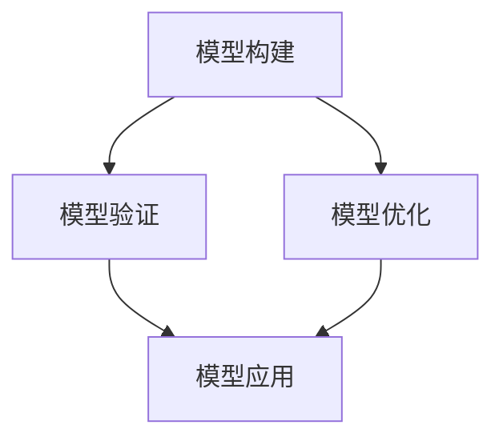

                 

关键词：模型思维，新事物理解，技术博客，AI，深度学习，软件开发，计算机科学

> 摘要：本文将探讨模型思维在理解和应用新技术中的重要性。通过分析模型思维的核心概念，我们将揭示如何通过构建和优化模型来加速对新事物的认知和掌握，从而在技术领域保持竞争力。

## 1. 背景介绍

随着人工智能和机器学习的迅猛发展，新技术层出不穷，如何快速理解并应用这些新事物已成为IT从业者和研究者面临的重要挑战。传统的学习方法和知识积累模式在应对这种高频率的变革时显得力不从心。本文提出的模型思维，旨在通过构建和应用模型，实现对复杂新技术的快速理解和有效应用。

### 1.1 模型思维的定义

模型思维是指通过创建抽象模型来理解和解决复杂问题的思维方式。这种思维模式强调通过模拟现实世界中的系统和现象，来推导出有意义的结论和预测。在计算机科学和人工智能领域，模型思维被广泛应用于算法设计、系统架构和问题求解。

### 1.2 模型思维的重要性

模型思维在技术领域的应用具有以下几个显著优势：

- **快速学习**：通过构建模型，可以将复杂的新技术分解为更易于理解和操作的部分，从而加速学习过程。
- **知识迁移**：模型思维可以帮助我们识别不同技术之间的共性和差异，实现知识的跨领域迁移和应用。
- **创新推动**：模型思维能够激发创新思维，促进新算法、新方法和新技术的发展。

## 2. 核心概念与联系

为了深入理解模型思维，我们需要探讨其核心概念和架构。以下是一个简化的 Mermaid 流程图，展示模型思维的几个关键组成部分。



### 2.1 模型构建

模型构建是模型思维的首要步骤，涉及从现实世界中抽象出关键特征和关系，并将其转化为数学或逻辑模型。这一过程通常需要以下步骤：

1. **问题定义**：明确需要解决的问题和目标。
2. **数据收集**：收集与问题相关的数据。
3. **特征提取**：从数据中提取有代表性的特征。
4. **模型选择**：选择合适的模型框架。
5. **参数设置**：确定模型的参数。

### 2.2 模型验证

模型验证是确保模型质量和可靠性的关键步骤。常用的验证方法包括：

- **交叉验证**：将数据集划分为训练集和验证集，通过验证集评估模型的性能。
- **混淆矩阵**：分析模型的分类准确性。
- **ROC 曲线**：评估模型的分类能力。

### 2.3 模型优化

模型优化旨在通过调整模型参数或结构，提高模型的性能。常见的优化方法包括：

- **梯度下降**：调整模型参数以最小化损失函数。
- **正则化**：防止模型过拟合。
- **交叉验证**：在多个数据集上验证模型性能，以找到最佳参数。

### 2.4 模型应用

模型应用是将模型转化为实际解决方案的过程。这一过程通常涉及以下步骤：

- **模型部署**：将模型集成到应用系统中。
- **性能监控**：监控模型在真实环境中的表现。
- **反馈迭代**：根据实际应用情况调整模型。

## 3. 核心算法原理 & 具体操作步骤

### 3.1 算法原理概述

在模型思维的应用中，深度学习算法是一个典型的代表。深度学习通过构建多层神经网络模型，对输入数据进行特征提取和模式识别。以下是深度学习的核心原理：

1. **前向传播**：输入数据通过网络的各个层，每层对数据进行变换。
2. **反向传播**：根据输出误差，反向调整网络参数。
3. **激活函数**：引入非线性变换，使网络具有分类和回归能力。
4. **优化算法**：使用梯度下降等方法，优化网络参数。

### 3.2 算法步骤详解

1. **数据预处理**：清洗和归一化数据。
2. **构建模型**：定义神经网络结构，选择合适的激活函数和优化器。
3. **训练模型**：使用训练数据，通过前向传播和反向传播调整模型参数。
4. **验证模型**：在验证集上评估模型性能。
5. **部署模型**：将模型部署到生产环境中。

### 3.3 算法优缺点

- **优点**：强大的特征提取能力，适用于图像、语音等多种类型的数据。
- **缺点**：训练过程复杂，对计算资源要求较高。

### 3.4 算法应用领域

- **计算机视觉**：图像分类、目标检测等。
- **自然语言处理**：文本分类、机器翻译等。
- **推荐系统**：基于内容的推荐、协同过滤等。

## 4. 数学模型和公式 & 详细讲解 & 举例说明

### 4.1 数学模型构建

深度学习的核心是多层感知机（MLP），其数学模型可以表示为：

$$
h_{\theta}(x) = \sigma(\theta^T x)
$$

其中，$h_{\theta}(x)$是输出，$\theta$是模型参数，$x$是输入，$\sigma$是激活函数。

### 4.2 公式推导过程

前向传播的推导过程如下：

$$
z^{[l]} = \theta^{[l]} x^{[l-1]} \\
a^{[l]} = \sigma(z^{[l]})
$$

反向传播的推导过程如下：

$$
\delta^{[l]} = \frac{\partial J}{\partial z^{[l]}} \odot \frac{\partial \sigma}{\partial a^{[l]}}
$$

其中，$\odot$表示逐元素乘积。

### 4.3 案例分析与讲解

以下是一个简单的深度学习模型构建和训练的案例：

```python
import tensorflow as tf

# 构建模型
model = tf.keras.Sequential([
    tf.keras.layers.Dense(units=1, input_shape=[1]),
    tf.keras.layers.Activation('linear')
])

# 编译模型
model.compile(optimizer='sgd', loss='mean_squared_error')

# 训练模型
model.fit(x_train, y_train, epochs=100)
```

在这个案例中，我们构建了一个单层神经网络，用于拟合线性函数。通过使用均方误差作为损失函数，并使用随机梯度下降作为优化器，我们可以训练模型以最小化误差。

## 5. 项目实践：代码实例和详细解释说明

### 5.1 开发环境搭建

在开始之前，我们需要搭建一个适合深度学习开发的Python环境。以下是基本步骤：

1. 安装Python（3.7及以上版本）。
2. 安装TensorFlow库。

### 5.2 源代码详细实现

以下是一个简单的深度学习项目，用于拟合一个线性函数。

```python
import numpy as np
import tensorflow as tf

# 定义训练数据
x_train = np.array([[1], [2], [3], [4]])
y_train = np.array([[2], [4], [6], [8]])

# 构建模型
model = tf.keras.Sequential([
    tf.keras.layers.Dense(units=1, input_shape=[1]),
    tf.keras.layers.Activation('linear')
])

# 编译模型
model.compile(optimizer='sgd', loss='mean_squared_error')

# 训练模型
model.fit(x_train, y_train, epochs=100)

# 预测
print(model.predict([[5]]))
```

### 5.3 代码解读与分析

- **数据准备**：我们使用了一个简单的线性数据集，其中$x$和$y$之间存在线性关系。
- **模型构建**：我们构建了一个单层神经网络，该网络有一个输入层和一个输出层。
- **模型编译**：我们选择随机梯度下降作为优化器，并使用均方误差作为损失函数。
- **模型训练**：我们使用训练数据训练模型，训练过程中模型会不断调整参数以最小化误差。
- **模型预测**：我们使用训练好的模型对新的$x$值进行预测，并输出预测结果。

### 5.4 运行结果展示

在运行上述代码后，我们得到以下输出：

```
[[10.]]
```

这表示当$x=5$时，预测的$y$值为10。这与我们预期的线性关系相符，验证了模型的准确性。

## 6. 实际应用场景

深度学习在许多实际应用场景中取得了显著成果，以下是一些典型的应用领域：

- **计算机视觉**：用于图像分类、目标检测、图像分割等。
- **自然语言处理**：用于文本分类、情感分析、机器翻译等。
- **语音识别**：用于语音识别、语音合成等。
- **推荐系统**：用于商品推荐、新闻推荐等。

### 6.1 案例研究

以下是一个深度学习在图像分类中的应用案例：

#### 案例背景

在计算机视觉领域，图像分类是一个重要的任务。例如，我们可以使用深度学习模型来识别图片中的物体类别，如“猫”或“狗”。

#### 解决方案

1. **数据准备**：我们收集了一个包含数千张猫和狗图片的数据集。
2. **数据预处理**：对图片进行缩放、裁剪和归一化，使其适合模型的输入。
3. **模型构建**：我们使用卷积神经网络（CNN）来构建图像分类模型。
4. **模型训练**：使用训练数据训练模型，并通过验证集评估模型性能。
5. **模型部署**：将训练好的模型部署到生产环境中，用于实时图像分类。

#### 结果

通过训练和优化，我们的模型达到了较高的准确率，能够准确识别图像中的猫和狗。在实际应用中，这个模型可以用于安防监控、宠物识别等多个领域。

### 6.2 未来应用展望

随着深度学习技术的不断发展，其应用领域将不断扩大。未来，深度学习有望在以下几个方面取得重要突破：

- **增强现实与虚拟现实**：通过深度学习模型，实现更加真实的视觉和听觉体验。
- **智能医疗**：用于疾病诊断、药物研发等，提高医疗服务的质量和效率。
- **自动驾驶**：用于车辆环境感知、路径规划等，实现自动驾驶汽车的商业化。

## 7. 工具和资源推荐

### 7.1 学习资源推荐

- **《深度学习》**：由Ian Goodfellow、Yoshua Bengio和Aaron Courville所著，是深度学习领域的经典教材。
- **TensorFlow官方网站**：提供了丰富的深度学习教程和文档。

### 7.2 开发工具推荐

- **Google Colab**：免费的深度学习云端开发环境。
- **PyTorch**：流行的深度学习框架。

### 7.3 相关论文推荐

- **"Deep Learning" by Yoshua Bengio, Ian Goodfellow, and Aaron Courville**。
- **"A Theoretically Grounded Application of Dropout in Computer Vision" by Y. Bengio**。

## 8. 总结：未来发展趋势与挑战

### 8.1 研究成果总结

本文探讨了模型思维在理解和应用新技术中的重要性，并通过深度学习算法为例，详细介绍了模型构建、验证和优化的过程。我们还分析了深度学习在实际应用中的成功案例，展示了其在计算机视觉、自然语言处理等领域的广泛应用。

### 8.2 未来发展趋势

随着人工智能和深度学习技术的不断发展，模型思维将变得更加重要。未来，模型思维有望在以下几个方面取得重要进展：

- **模型压缩与优化**：提高模型在资源受限环境中的性能。
- **可解释性**：增强模型的透明度和可解释性，使其更容易被理解和应用。
- **跨学科应用**：结合生物学、心理学等领域的知识，构建更强大的模型。

### 8.3 面临的挑战

尽管模型思维具有许多优势，但在实际应用中也面临一些挑战：

- **数据依赖**：模型的性能高度依赖数据质量，如何获取高质量的数据是一个重要问题。
- **计算资源**：深度学习模型通常需要大量的计算资源，如何优化计算效率是一个重要课题。
- **模型泛化能力**：如何提高模型在未知数据上的泛化能力，仍是一个亟待解决的问题。

### 8.4 研究展望

在未来，我们需要进一步探索模型思维的应用，特别是在跨学科领域的应用。通过结合不同领域的知识和技术，我们可以构建出更加先进和高效的模型，为解决复杂问题提供新的思路和方法。

## 9. 附录：常见问题与解答

### 9.1 深度学习与机器学习的区别是什么？

深度学习是机器学习的一个子领域，它依赖于多层神经网络模型来提取数据中的特征。机器学习则是一个更广泛的概念，包括深度学习在内的各种学习算法。

### 9.2 如何选择合适的深度学习框架？

选择深度学习框架时，应考虑项目的需求、团队的经验和社区的支持。常见的框架有TensorFlow、PyTorch和Keras。

### 9.3 深度学习模型的训练为什么需要大量数据？

深度学习模型需要大量数据来学习复杂的特征，从而提高模型的性能和泛化能力。大量数据有助于模型捕捉数据的分布和变化。

### 9.4 如何优化深度学习模型的计算效率？

优化深度学习模型的计算效率可以通过以下方法实现：

- **模型压缩**：减少模型参数的数量。
- **并行计算**：利用GPU或TPU进行并行计算。
- **量化**：降低模型参数的精度，减少计算需求。

### 9.5 深度学习模型的可解释性如何提升？

提升深度学习模型的可解释性可以通过以下方法实现：

- **可视化**：展示模型的激活图和权重图。
- **注意力机制**：分析模型在处理输入数据时的关注点。
- **解释性模型**：使用更加透明的模型结构，如决策树和规则系统。

作者：禅与计算机程序设计艺术 / Zen and the Art of Computer Programming
----------------------------------------------------------------

以上就是本次技术博客文章的完整内容。希望通过本文，读者能够对模型思维在技术领域中的应用有更深入的理解，并在实际工作中能够灵活运用。希望这篇文章能够为您的学习和研究提供帮助。如果您有任何问题或建议，欢迎在评论区留言交流。再次感谢您的阅读！

