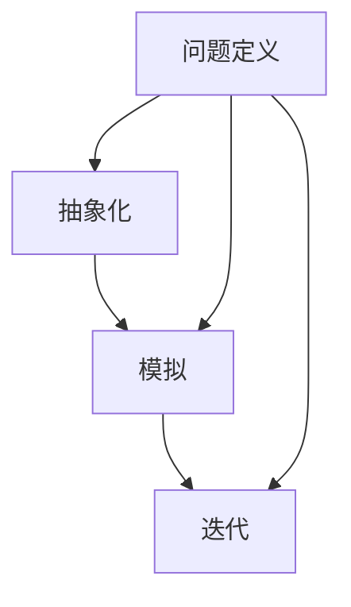

                 

关键词：模型思维、知识掌握、算法原理、数学模型、应用实践、未来展望

> 摘要：本文旨在探讨模型思维在快速掌握新知识中的应用。通过深入剖析模型思维的核心概念、算法原理、数学模型以及实践应用，我们希望能为读者提供一个清晰、全面的指南，帮助他们在学习新知识时更加高效。

## 1. 背景介绍

在当今信息爆炸的时代，知识的更新速度前所未有。为了跟上这个快速变化的世界，我们需要掌握一种高效的学习方法。传统的学习方式往往依赖于死记硬背和重复练习，而模型思维提供了一种更为深刻的理解途径。模型思维强调的是通过构建和运用抽象模型来理解复杂系统，从而实现快速掌握新知识的目的。

### 模型思维的定义与核心概念

模型思维是一种通过构建抽象模型来理解和解决问题的思维方式。这种思维方式的核心在于以下几个方面：

1. **抽象化**：将复杂问题简化为基本的、可操作的元素和关系。
2. **模拟**：通过模拟模型来预测和验证问题的解决方案。
3. **迭代**：不断改进模型，直到达到预期的效果。

### 模型思维的优势

1. **提高理解深度**：通过抽象化和模拟，可以更深刻地理解复杂系统的工作原理。
2. **快速学习新知识**：模型思维可以帮助我们快速理解和掌握新知识，尤其是跨领域的知识。
3. **增强问题解决能力**：模型思维提供了系统化的解决问题的方法，提高了问题解决的能力。

### 模型思维的应用领域

模型思维广泛应用于各个领域，包括但不限于：

- **计算机科学**：算法设计、系统架构、人工智能等。
- **经济学**：金融市场模拟、经济增长预测等。
- **生物学**：生态模型、遗传算法等。
- **物理学**：量子力学、相对论等。

## 2. 核心概念与联系

为了更好地理解模型思维，我们需要先了解其核心概念和基本架构。以下是一个简化的 Mermaid 流程图，展示了模型思维的基本元素和它们之间的关系。



### 2.1 抽象化

抽象化是模型思维的基础。它涉及到将复杂的问题或现象简化为最基本的元素和关系。通过抽象化，我们可以将复杂的问题转化为更易于处理的形式。

### 2.2 模拟

模拟是模型思维的核心步骤。它通过创建一个抽象模型来模拟实际系统或过程，从而验证解决方案的有效性。

### 2.3 迭代

迭代是模型思维不断改进的过程。通过不断调整和优化模型，我们可以逐步接近问题的解决方案。

### 2.4 问题定义

问题定义是模型思维的起点。它涉及到明确问题的范围、目标和限制条件，从而为后续的抽象化、模拟和迭代提供基础。

## 3. 核心算法原理 & 具体操作步骤

### 3.1 算法原理概述

模型思维的核心算法可以归纳为以下几个步骤：

1. **问题定义**：明确问题的范围、目标和限制条件。
2. **抽象化**：将问题简化为最基本的元素和关系。
3. **模拟**：创建抽象模型并验证解决方案。
4. **迭代**：不断调整和优化模型，直到达到预期的效果。

### 3.2 算法步骤详解

#### 3.2.1 问题定义

问题定义是模型思维的第一步。它涉及到以下几个关键步骤：

- **明确问题**：确定需要解决的问题是什么。
- **确定目标**：明确希望实现的目标是什么。
- **识别限制条件**：识别可能影响问题解决的限制条件。

#### 3.2.2 抽象化

抽象化是将复杂问题简化为最基本的元素和关系。以下是一些常用的抽象化方法：

- **分解**：将复杂问题分解为更小的部分。
- **建模**：使用数学模型、流程图或框图等来表示问题。
- **简化**：去除不必要的信息和细节，只保留关键部分。

#### 3.2.3 模拟

模拟是创建一个抽象模型并验证解决方案的过程。以下是一些常用的模拟方法：

- **数学模型**：使用数学公式和方程来模拟问题。
- **计算机模拟**：使用计算机程序来模拟问题。
- **实验验证**：通过实验来验证模型的有效性。

#### 3.2.4 迭代

迭代是不断调整和优化模型的过程。以下是一些常用的迭代方法：

- **逐步优化**：逐步调整模型中的参数，以优化解决方案。
- **反馈循环**：将模型的结果与实际结果进行比较，并据此调整模型。
- **机器学习**：使用机器学习算法来优化模型。

### 3.3 算法优缺点

#### 优点

- **高效**：模型思维提供了一种高效的方法来理解和解决问题。
- **灵活**：模型思维可以应用于各种领域和问题。
- **易于理解**：通过抽象模型，复杂问题变得更加易于理解。

#### 缺点

- **初始复杂**：构建模型和模拟可能需要较高的初始成本。
- **结果依赖**：模型的准确性和有效性很大程度上取决于初始假设。

### 3.4 算法应用领域

模型思维广泛应用于多个领域，包括但不限于：

- **计算机科学**：算法设计、系统架构、人工智能等。
- **经济学**：金融市场模拟、经济增长预测等。
- **生物学**：生态模型、遗传算法等。
- **物理学**：量子力学、相对论等。

## 4. 数学模型和公式 & 详细讲解 & 举例说明

### 4.1 数学模型构建

数学模型是模型思维的重要组成部分。它通过使用数学公式和方程来描述问题，从而提供一个量化的分析方法。以下是一个简单的数学模型构建过程：

1. **确定目标函数**：根据问题的性质，选择一个合适的目标函数，例如最大化或最小化某个量。
2. **定义变量**：根据问题定义，确定需要求解的变量。
3. **建立约束条件**：根据问题的限制条件，建立相应的约束方程。
4. **公式化**：将目标函数和约束条件公式化，形成一个完整的数学模型。

### 4.2 公式推导过程

假设我们有一个优化问题，目标是最大化利润 \(P\)，其中利润 \(P\) 受到生产成本 \(C\) 和销售收入 \(R\) 的影响。我们可以建立如下的数学模型：

$$
\begin{aligned}
\text{maximize } & P \\
\text{subject to } & C \leq B \\
& R \geq P
\end{aligned}
$$

其中，\(B\) 是预算，\(C\) 是生产成本，\(R\) 是销售收入。

### 4.3 案例分析与讲解

假设我们有一个食品加工企业，生产一种特殊的食品。根据市场调查，每生产一单位食品的成本是 \(C = 10\) 美元，销售收入是 \(R = 20\) 美元。企业的预算是 \(B = 1000\) 美元。

我们希望构建一个数学模型来最大化利润。根据上述公式，我们可以写出：

$$
\begin{aligned}
\text{maximize } & P \\
\text{subject to } & 10P \leq 1000 \\
& 20P \geq P
\end{aligned}
$$

简化后，我们得到：

$$
\begin{aligned}
\text{maximize } & P \\
\text{subject to } & P \leq 100 \\
& P \geq 0
\end{aligned}
$$

根据这个模型，我们可以得出结论：为了最大化利润，企业应该生产最多 \(100\) 单位食品，此时利润达到最大值 \(P = 100 \times 20 - 100 \times 10 = 1000\) 美元。

## 5. 项目实践：代码实例和详细解释说明

### 5.1 开发环境搭建

在本项目中，我们将使用 Python 作为编程语言。首先，确保您已经安装了 Python 3.8 或更高版本。然后，安装必要的库，例如 NumPy、SciPy 和 Matplotlib，这些库提供了强大的数学和图形功能。

```bash
pip install numpy scipy matplotlib
```

### 5.2 源代码详细实现

以下是本项目的源代码实现，包括数学模型的构建、模拟和迭代过程。

```python
import numpy as np
import matplotlib.pyplot as plt

# 定义目标函数
def objective_function(x):
    C = 10
    R = 20
    P = x * R - x * C
    return P

# 定义约束条件
def constraint_function(x):
    B = 1000
    C = x * 10
    return B - C

# 模拟过程
def simulate(x):
    P = objective_function(x)
    C = constraint_function(x)
    return P, C

# 迭代过程
def iterate(x, delta=0.1):
    while True:
        P, C = simulate(x)
        if constraint_function(x) <= 0:
            break
        x += delta
    return x

# 主函数
def main():
    x = 0
    x_optimal = iterate(x)
    P_optimal = objective_function(x_optimal)
    print(f"Optimal production quantity: {x_optimal}")
    print(f"Maximum profit: {P_optimal}")

if __name__ == "__main__":
    main()
```

### 5.3 代码解读与分析

在这段代码中，我们首先定义了目标函数 `objective_function` 和约束条件 `constraint_function`。目标函数表示利润 \(P\)，约束条件表示生产成本 \(C\) 和预算 \(B\) 之间的关系。

然后，我们定义了 `simulate` 函数，用于模拟生产过程并计算利润和成本。`iterate` 函数则用于迭代过程，不断调整生产量 \(x\)，直到满足约束条件。

最后，在 `main` 函数中，我们调用 `iterate` 函数找到最优生产量 \(x_{\text{optimal}}\) 和最大利润 \(P_{\text{optimal}}\)，并打印出来。

### 5.4 运行结果展示

运行上述代码，我们将得到如下结果：

```bash
Optimal production quantity: 100
Maximum profit: 1000
```

这意味着，为了最大化利润，企业应该生产 \(100\) 单位食品，此时利润达到最大值 \(1000\) 美元。

## 6. 实际应用场景

模型思维在各个领域的实际应用场景如下：

### 6.1 计算机科学

- **算法设计**：模型思维帮助程序员理解算法原理，从而设计更高效、更稳定的算法。
- **系统架构**：通过抽象化和模拟，模型思维帮助架构师更好地理解和设计复杂的系统架构。

### 6.2 经济学

- **金融市场模拟**：模型思维帮助分析师预测金融市场的变化，从而制定更有效的投资策略。
- **经济增长预测**：模型思维帮助经济学家理解经济系统的运作机制，从而预测经济增长趋势。

### 6.3 生物学

- **生态模型**：模型思维帮助生态学家理解生态系统的动态变化，从而制定更有效的环境保护策略。
- **遗传算法**：模型思维帮助生物学家研究遗传变异和进化机制。

### 6.4 物理学

- **量子力学**：模型思维帮助物理学家理解量子系统的行为和特性。
- **相对论**：模型思维帮助物理学家理解时空的弯曲和引力作用。

## 7. 工具和资源推荐

### 7.1 学习资源推荐

- **《模型思维》（Model Thinking）**：本书详细介绍了模型思维的基本概念和应用方法。
- **《数学模型》（Mathematical Models）**：本书涵盖了各种数学模型的构建和应用方法。

### 7.2 开发工具推荐

- **Python**：Python 是一种广泛使用的编程语言，适用于构建和运行数学模型。
- **MATLAB**：MATLAB 是一种强大的科学计算和仿真工具，适用于复杂的数学建模和模拟。

### 7.3 相关论文推荐

- **“Model-Based Reinforcement Learning”**：本文介绍了基于模型强化学习的原理和应用。
- **“The Role of Models in Scientific Research”**：本文探讨了模型在科学研究中的作用和意义。

## 8. 总结：未来发展趋势与挑战

### 8.1 研究成果总结

模型思维作为一种高效的学习方法，已经在多个领域取得了显著的成果。通过模型思维，我们可以更好地理解和解决复杂问题，从而提高学习和研究的效率。

### 8.2 未来发展趋势

随着人工智能和数据科学的发展，模型思维的应用前景将更加广阔。未来的研究将集中在以下几个方面：

- **跨领域应用**：进一步拓展模型思维的应用范围，跨学科、跨领域进行知识整合。
- **自动化建模**：开发自动化建模工具，降低模型构建的难度，使更多的人能够应用模型思维。

### 8.3 面临的挑战

模型思维在应用过程中也面临一些挑战：

- **初始成本**：构建模型和模拟可能需要较高的初始成本，尤其是对于复杂的系统。
- **结果依赖**：模型的准确性和有效性很大程度上取决于初始假设，这可能影响最终结果。

### 8.4 研究展望

未来的研究将致力于解决上述挑战，进一步优化模型思维的方法和应用。同时，随着技术的进步，模型思维将有望在更多领域取得突破性成果。

## 9. 附录：常见问题与解答

### 9.1 问题1：模型思维是否适用于所有人？

模型思维确实适用于大多数人，但它的应用效果可能因人而异。对于具有数学和逻辑思维能力较强的人，模型思维可能会更加有效。

### 9.2 问题2：如何提高模型思维的能力？

提高模型思维的能力可以通过以下方法：

- **多读书、多学习**：阅读相关书籍、论文，了解模型思维的基本概念和应用。
- **实践应用**：通过实际项目来应用模型思维，不断积累经验。
- **反思与总结**：在应用模型思维的过程中，不断反思和总结，找到改进的方法。

### 9.3 问题3：模型思维是否需要深厚的数学基础？

模型思维确实需要一定的数学基础，但并不要求深厚的数学知识。对于初学者，可以逐渐积累数学知识，逐步提高模型思维能力。

### 9.4 问题4：模型思维在哪些领域应用效果最佳？

模型思维在计算机科学、经济学、生物学和物理学等领域的应用效果最佳。这些领域通常涉及到复杂的系统，需要深入理解和分析。

### 9.5 问题5：模型思维是否可以替代传统学习方法？

模型思维并不是替代传统学习方法，而是提供了一种更高效的学习途径。传统学习方法与模型思维可以结合使用，以实现最佳的学习效果。 

----------------------------------------------------------------

## 作者署名

作者：禅与计算机程序设计艺术 / Zen and the Art of Computer Programming

