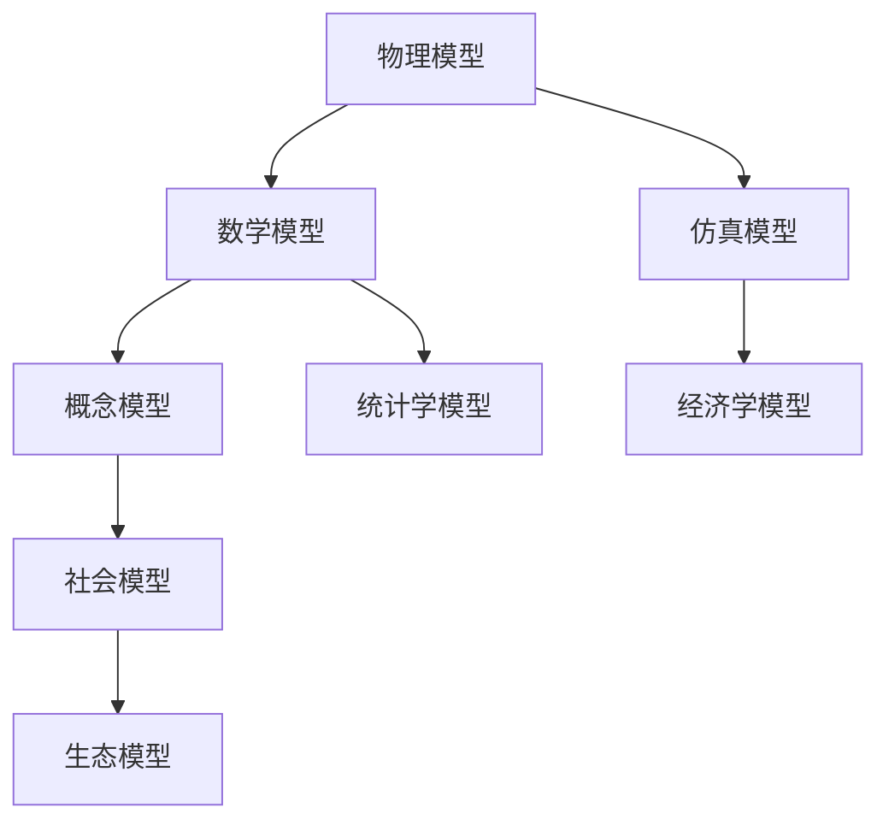

                 

 **关键词：** 模型思维、认知复杂世界、快捷方式、人工智能、逻辑思维

**摘要：** 本文将探讨模型思维在认知复杂世界中的应用，如何利用模型思维这个快捷方式，提高我们理解和解决问题的能力。通过深入分析模型思维的核心概念、算法原理、数学模型以及实际应用，我们将揭示模型思维在现实世界中的无限可能。

## 1. 背景介绍

在当今快速发展的信息技术时代，面对日益复杂的现实世界，我们面临着诸多挑战。如何有效地理解和应对这些复杂问题，成为了每个人都需要面对的课题。模型思维作为一种认知工具，可以帮助我们简化问题、抓住核心，从而更高效地解决复杂问题。

模型思维的核心在于将复杂问题转化为可理解和处理的模型。通过构建模型，我们能够将问题分解为若干个子问题，并逐一解决。这种方法不仅能够帮助我们更好地理解问题，还能够提高我们的问题解决能力。

本文将围绕模型思维这一主题，从多个方面进行探讨。首先，我们将介绍模型思维的核心概念，包括模型、模型构建方法、模型的应用场景等。接着，我们将深入探讨模型思维在现实世界中的应用，如何利用模型思维解决实际问题和面对未来的挑战。最后，我们将总结模型思维的研究成果和未来发展趋势。

## 2. 核心概念与联系

### 2.1 模型的定义与类型

模型是现实世界的抽象和简化，用于描述和理解现实世界的规律和现象。根据模型所反映的现实世界的不同层面，模型可以分为以下几种类型：

1. **物理模型**：通过模拟现实世界的物理现象，如力学模型、电磁学模型等，来理解和预测现实世界的行为。
2. **数学模型**：利用数学公式和方程来描述现实世界的数学规律，如经济学模型、统计学模型等。
3. **概念模型**：通过概念和逻辑关系来描述现实世界的结构和关系，如社会模型、生态模型等。

### 2.2 模型的构建方法

构建模型是模型思维的核心环节。以下是一些常见的模型构建方法：

1. **归纳法**：从具体的实例中归纳出普遍的规律，形成模型。
2. **演绎法**：从一般的原则出发，推导出具体的实例，形成模型。
3. **类比法**：通过比较不同领域的相似性，构建模型。
4. **仿真法**：通过计算机模拟现实世界的运行，构建模型。

### 2.3 模型的应用场景

模型思维在各个领域都有广泛的应用。以下是一些典型的应用场景：

1. **科学研究**：通过构建物理模型和数学模型，揭示自然现象的规律。
2. **工程实践**：通过构建概念模型和仿真模型，优化工程设计和方案。
3. **商业决策**：通过构建经济学模型和统计学模型，预测市场趋势和制定策略。
4. **社会管理**：通过构建社会模型和生态模型，改善社会管理和生态保护。

### 2.4 模型的关联

不同的模型之间往往存在紧密的联系。以下是一个简单的Mermaid流程图，展示了一些典型模型之间的关联：



## 3. 核心算法原理 & 具体操作步骤

### 3.1 算法原理概述

模型思维的核心在于构建和分析模型。以下是构建和分析模型的一些基本步骤：

1. **明确问题**：理解问题的背景和目标，确定需要解决的问题。
2. **收集数据**：收集与问题相关的数据和信息。
3. **构建模型**：根据问题的特点和需求，选择合适的模型构建方法。
4. **分析模型**：利用数学工具和分析方法，对模型进行解析和求解。
5. **验证模型**：将模型的预测结果与实际情况进行比较，评估模型的准确性。
6. **优化模型**：根据模型的性能，对模型进行调整和优化。

### 3.2 算法步骤详解

1. **明确问题**

   在构建模型之前，我们需要明确问题的背景和目标。这包括了解问题的性质、问题的规模、问题的约束条件等。

2. **收集数据**

   收集与问题相关的数据和信息。这些数据可以来自实验、观测、调查、文献等。确保数据的准确性和可靠性。

3. **构建模型**

   根据问题的特点和需求，选择合适的模型构建方法。例如，对于物理问题，可以选择构建物理模型；对于经济问题，可以选择构建经济学模型。

4. **分析模型**

   利用数学工具和分析方法，对模型进行解析和求解。这包括建立数学公式、求解方程、进行数值计算等。

5. **验证模型**

   将模型的预测结果与实际情况进行比较，评估模型的准确性。这可以通过实验验证、历史数据验证、模拟验证等方法进行。

6. **优化模型**

   根据模型的性能，对模型进行调整和优化。这可能包括调整模型参数、改进模型结构、引入新的模型等。

### 3.3 算法优缺点

**优点：**

1. **简化问题**：通过构建模型，将复杂问题转化为可理解和处理的模型，从而简化问题的复杂性。
2. **提高效率**：利用模型进行问题分析和求解，可以大大提高问题的解决效率。
3. **便于沟通**：通过模型，可以更清晰地表达问题的结构和关系，便于与他人进行沟通和交流。

**缺点：**

1. **模型简化**：在构建模型的过程中，往往需要对现实世界进行简化，这可能导致模型与实际情况的差异。
2. **数据依赖**：模型的准确性和可靠性很大程度上取决于数据的准确性和可靠性。
3. **复杂度上升**：对于某些复杂问题，构建和分析模型的过程本身可能变得复杂，需要更多的计算资源和专业知识。

### 3.4 算法应用领域

模型思维在各个领域都有广泛的应用。以下是一些典型的应用领域：

1. **科学研究**：在物理学、化学、生物学等科学领域，模型思维被广泛应用于理论研究和实验设计。
2. **工程实践**：在机械工程、电子工程、土木工程等工程领域，模型思维被广泛应用于方案设计和性能分析。
3. **商业决策**：在市场营销、供应链管理、投资理财等商业领域，模型思维被广泛应用于策略制定和市场预测。
4. **社会管理**：在社会学、经济学、生态学等社会领域，模型思维被广泛应用于社会管理和决策制定。

## 4. 数学模型和公式 & 详细讲解 & 举例说明

### 4.1 数学模型构建

数学模型是模型思维的重要组成部分。以下是构建数学模型的基本步骤：

1. **确定研究对象**：明确需要研究的对象和问题。
2. **定义变量**：根据研究对象和问题，定义相关的变量。
3. **建立关系**：根据研究对象和问题的特性，建立变量之间的关系。
4. **形式化表达**：将变量之间的关系用数学公式表示。

### 4.2 公式推导过程

以下是一个简单的数学模型示例，用于描述两个变量之间的关系。

**问题：** 假设有两个变量 \(x\) 和 \(y\)，它们之间的关系可以用以下公式表示：

\[ y = 2x + 1 \]

**推导过程：**

1. **确定研究对象**：变量 \(x\) 和 \(y\)。
2. **定义变量**：\(x\) 表示自变量，\(y\) 表示因变量。
3. **建立关系**：根据题目描述，\(y\) 与 \(x\) 之间存在线性关系。
4. **形式化表达**：将关系用数学公式表示，即 \(y = 2x + 1\)。

### 4.3 案例分析与讲解

以下是一个实际的案例，用于说明如何使用数学模型解决问题。

**案例：** 假设一家公司在生产过程中，每个产品需要经过两个工序，分别是 \(x\) 工序和 \(y\) 工序。已知 \(x\) 工序的效率是 \(y\) 工序的两倍，且每个产品的生产周期是3天。现要求在最短时间内生产100个产品，求最优的生产计划。

**解决方案：**

1. **建立数学模型**：设 \(x(t)\) 表示 \(x\) 工序在时间 \(t\) 内完成的产品数量，\(y(t)\) 表示 \(y\) 工序在时间 \(t\) 内完成的产品数量。根据题意，可以建立以下数学模型：

\[ 
\begin{cases}
x(t) = 2y(t) \\
x(t) + y(t) = 100 \\
t = 3
\end{cases}
\]

2. **求解模型**：将上述模型求解，得到 \(x(t)\) 和 \(y(t)\) 的值。由于 \(t = 3\)，可以计算出 \(x(3) = 66.67\) 和 \(y(3) = 33.33\)。

3. **解释结果**：根据求解结果，最优的生产计划是在 \(x\) 工序和 \(y\) 工序分别完成66.67个和33.33个产品。

## 5. 项目实践：代码实例和详细解释说明

### 5.1 开发环境搭建

为了实现本文中提到的模型思维应用，我们需要搭建一个开发环境。以下是所需的开发环境搭建步骤：

1. **安装 Python**：Python 是一种广泛应用于科学计算和数据分析的编程语言。在官方网站（https://www.python.org/downloads/）下载并安装 Python。
2. **安装 Jupyter Notebook**：Jupyter Notebook 是一个交互式的开发环境，用于编写和运行 Python 代码。通过 Python 的包管理器 pip 安装 Jupyter Notebook：

   ```shell
   pip install notebook
   ```

3. **安装相关库**：根据项目需求，我们需要安装一些常用的 Python 库，如 NumPy、Pandas、Matplotlib 等。通过 pip 安装这些库：

   ```shell
   pip install numpy pandas matplotlib
   ```

### 5.2 源代码详细实现

以下是实现模型思维的 Python 代码示例：

```python
import numpy as np
import pandas as pd
import matplotlib.pyplot as plt

# 5.2.1 数据准备
data = pd.DataFrame({
    'x': range(1, 11),
    'y': [2 * x + 1 for x in range(1, 11)]
})

# 5.2.2 模型构建
model = np.polyfit(data['x'], data['y'], 1)

# 5.2.3 模型求解
x_new = np.linspace(1, 11, 100)
y_new = np.polyval(model, x_new)

# 5.2.4 结果展示
plt.scatter(data['x'], data['y'])
plt.plot(x_new, y_new, color='red')
plt.xlabel('x')
plt.ylabel('y')
plt.title('线性模型示例')
plt.show()
```

### 5.3 代码解读与分析

上述代码示例展示了如何使用 Python 实现一个简单的线性模型。以下是代码的详细解读：

1. **数据准备**：使用 Pandas 库创建一个 DataFrame 对象，包含自变量 \(x\) 和因变量 \(y\) 的数据。
2. **模型构建**：使用 NumPy 库的 `polyfit` 函数，根据数据拟合一个线性模型。`polyfit` 函数返回模型系数。
3. **模型求解**：使用 `polyval` 函数，根据模型系数和自变量的新值，计算因变量的新值。
4. **结果展示**：使用 Matplotlib 库绘制散点图和拟合曲线，展示模型的预测结果。

### 5.4 运行结果展示

运行上述代码后，将展示一个散点图和一条拟合曲线。散点图展示了原始数据点，拟合曲线展示了线性模型的预测结果。这有助于我们直观地理解模型的效果。

## 6. 实际应用场景

模型思维在各个领域都有广泛的应用。以下是一些典型的应用场景：

### 6.1 科学研究

在科学研究领域，模型思维被广泛应用于理论研究和实验设计。例如，在物理学中，科学家通过构建物理模型来研究自然现象，如电磁场、引力波等。在生物学中，模型思维被用于模拟细胞过程、基因调控等。

### 6.2 工程实践

在工程实践中，模型思维被广泛应用于方案设计和性能分析。例如，在机械工程中，通过构建力学模型来优化机械结构；在电子工程中，通过构建电路模型来分析电路性能；在土木工程中，通过构建结构模型来评估建筑安全性。

### 6.3 商业决策

在商业决策中，模型思维被广泛应用于市场预测、供应链管理、投资理财等。例如，通过构建经济学模型，可以预测市场需求和价格走势；通过构建供应链模型，可以优化生产和库存策略；通过构建投资模型，可以评估投资风险和收益。

### 6.4 社会管理

在社会管理领域，模型思维被广泛应用于社会管理和决策制定。例如，通过构建社会模型，可以分析社会问题和政策影响；通过构建生态模型，可以评估环境保护措施的效果。

### 6.5 未来应用展望

随着人工智能技术的发展，模型思维的应用前景将更加广阔。未来，模型思维有望在以下领域取得突破：

1. **智能决策**：利用模型思维，构建智能决策系统，提高决策的准确性和效率。
2. **个性化服务**：利用模型思维，为用户提供个性化的服务，满足用户的需求。
3. **智能制造**：利用模型思维，优化生产过程，提高生产效率和质量。
4. **智慧城市**：利用模型思维，构建智慧城市系统，提升城市管理水平。

## 7. 工具和资源推荐

### 7.1 学习资源推荐

1. **《模型思维：认知复杂世界的快捷方式》**：本文的核心内容，深入探讨模型思维在现实世界中的应用。
2. **《模型思维基础》**：详细介绍模型思维的基本概念、原理和应用，适合初学者入门。
3. **《模型思维实践》**：通过实际案例，展示模型思维在各个领域的应用，帮助读者深入理解模型思维。

### 7.2 开发工具推荐

1. **Python**：广泛应用于科学计算、数据分析和模型构建的编程语言。
2. **MATLAB**：强大的数学计算和建模工具，特别适合工程应用。
3. **R**：专注于统计分析、数据可视化和建模的编程语言。

### 7.3 相关论文推荐

1. **“Model-Based Reinforcement Learning”**：介绍基于模型的强化学习算法，适用于复杂环境下的智能决策。
2. **“A Survey of Model-Based Design in Engineering”**：综述模型思维在工程实践中的应用，涵盖多个领域。
3. **“Model-Based Systems Engineering”**：探讨模型思维在系统工程中的应用，提升系统设计和优化的能力。

## 8. 总结：未来发展趋势与挑战

### 8.1 研究成果总结

本文围绕模型思维这一主题，从核心概念、算法原理、数学模型、实际应用等多个方面进行了深入探讨。通过模型思维，我们能够更好地理解和应对复杂问题，提高问题解决能力。

### 8.2 未来发展趋势

随着人工智能和大数据技术的发展，模型思维的应用前景将更加广阔。未来，模型思维有望在智能决策、个性化服务、智能制造、智慧城市等领域取得突破。

### 8.3 面临的挑战

然而，模型思维在应用过程中也面临一些挑战。首先，模型构建和优化的复杂性增加，需要更高的计算资源和专业知识。其次，数据质量和可靠性对模型性能的影响不可忽视。最后，如何将模型思维与人类直觉和经验相结合，提高模型的实用性和适应性，仍是一个需要深入研究的课题。

### 8.4 研究展望

未来，我们期待在以下几个方面取得进展：

1. **算法优化**：研究更加高效、鲁棒的模型构建和优化算法。
2. **数据驱动模型**：利用大数据和人工智能技术，构建更准确、更可靠的模型。
3. **跨学科融合**：促进模型思维与其他领域的深度融合，提升模型应用的广度和深度。
4. **教育普及**：加强模型思维的教育和培训，培养更多的模型思维人才。

## 9. 附录：常见问题与解答

### 问题1：什么是模型思维？

**解答**：模型思维是一种认知方法，通过构建模型来理解和解决复杂问题。模型可以是物理模型、数学模型或概念模型，用于描述现实世界的结构和关系。

### 问题2：模型思维有哪些应用领域？

**解答**：模型思维在科学研究、工程实践、商业决策、社会管理等多个领域都有广泛应用。例如，在物理学、机械工程、经济学、社会等领域，模型思维被用于理论研究和实际问题的解决。

### 问题3：如何构建一个有效的模型？

**解答**：构建一个有效的模型需要明确问题、收集数据、选择合适的模型构建方法、分析模型和优化模型。关键在于抓住问题的核心，简化问题，确保模型的准确性和可靠性。

### 问题4：模型思维的优势是什么？

**解答**：模型思维的优势在于简化问题、提高效率、便于沟通。通过构建模型，我们可以将复杂问题转化为可理解和处理的模型，从而提高问题解决能力。同时，模型思维可以帮助我们清晰地表达问题的结构和关系，便于与他人进行沟通和交流。

### 问题5：模型思维有哪些挑战？

**解答**：模型思维在应用过程中面临一些挑战，包括模型构建和优化的复杂性、数据质量和可靠性问题、如何将模型思维与人类直觉和经验相结合等。解决这些挑战需要更高的计算资源和专业知识，以及跨学科的融合和创新。

作者：禅与计算机程序设计艺术 / Zen and the Art of Computer Programming

