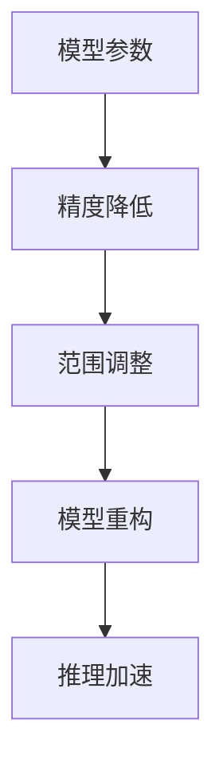

                 

关键词：模型量化、推理效率、神经网络、压缩、低比特量化、算法优化、硬件加速

## 摘要

随着人工智能应用的日益普及，深度学习模型的复杂度和参数数量呈指数级增长，这对计算资源和存储空间提出了巨大挑战。模型量化是一种关键技术，通过降低模型参数的精度来减少模型的大小，提高推理效率，同时保证较低的误差。本文将深入探讨模型量化的核心概念、算法原理、数学模型及其在实际应用中的重要性，并探讨未来发展趋势和面临的挑战。

## 1. 背景介绍

### 深度学习的发展

深度学习作为人工智能的核心技术，近年来取得了令人瞩目的成果。特别是在计算机视觉、自然语言处理和语音识别等领域，深度学习模型的表现已经超过了传统机器学习算法。然而，随着模型复杂度的增加，深度学习模型的参数数量和计算量也迅速增长，这给模型的训练和部署带来了巨大的计算负担。

### 计算资源的挑战

随着深度学习模型的规模不断扩大，计算资源的需求也急剧增加。在训练阶段，模型需要大量的计算资源和时间来完成。而在推理阶段，实时性和效率成为关键因素，尤其是在移动设备和嵌入式系统中，有限的计算资源和电池寿命对模型的要求更加苛刻。

### 模型量化的需求

模型量化技术应运而生，通过降低模型参数的精度，将高精度浮点数转换为低比特整数，从而减少模型的存储空间和计算复杂度。量化技术不仅能够提高推理效率，还能够减少模型的存储需求，使深度学习模型更加适合在资源受限的设备上部署。

## 2. 核心概念与联系

### 模型量化的核心概念

模型量化涉及两个核心概念：精度和范围。精度通常指的是模型参数的位数，如8位、16位或32位浮点数。范围则是指参数的可能取值范围。

### Mermaid 流程图



### 核心联系

模型量化通过降低参数的精度和调整参数的范围，使得模型可以在更少的计算资源和时间下完成推理任务。这一过程不仅涉及参数的精度调整，还包括模型结构和算法的优化。

## 3. 核心算法原理 & 具体操作步骤

### 3.1 算法原理概述

模型量化主要分为两种类型：对称量化和非对称量化。对称量化使用相同的精度和范围对模型的所有参数进行量化，而非对称量化则根据参数的重要性进行区分。

### 3.2 算法步骤详解

1. **参数精度调整**：将模型的浮点参数转换为低比特整数。
2. **范围调整**：调整参数的取值范围，确保量化后的参数能够正确表示原始参数的值。
3. **模型重构**：根据量化后的参数重新构建模型。
4. **推理加速**：在量化后的模型上进行推理，提高推理效率。

### 3.3 算法优缺点

#### 优点：

- **降低模型大小**：量化后的模型参数更加紧凑，节省存储空间。
- **提高推理效率**：低比特整数运算速度更快，适合在资源受限的设备上部署。

#### 缺点：

- **量化误差**：量化过程可能会导致一些精度损失，影响模型性能。
- **算法复杂度**：量化算法本身可能较为复杂，需要专门的工具和资源进行实现。

### 3.4 算法应用领域

模型量化广泛应用于计算机视觉、自然语言处理和语音识别等领域，尤其是在移动设备和嵌入式系统中，量化技术具有重要意义。

## 4. 数学模型和公式 & 详细讲解 & 举例说明

### 4.1 数学模型构建

模型量化涉及以下数学模型：

$$
x_{\text{quant}} = \text{round}(x_{\text{float}} \times \text{scale} + \text{offset})
$$

其中，$x_{\text{float}}$ 是原始浮点参数，$x_{\text{quant}}$ 是量化后的整数参数，$\text{scale}$ 和 $\text{offset}$ 是量化范围调整参数。

### 4.2 公式推导过程

模型量化的推导过程主要涉及以下几个方面：

1. **精度调整**：将浮点参数转换为整数。
2. **范围调整**：确保量化后的参数能够覆盖原始参数的取值范围。
3. **误差分析**：分析量化误差对模型性能的影响。

### 4.3 案例分析与讲解

以一个简单的神经网络模型为例，假设模型包含一个权重矩阵 $W$，其原始浮点参数范围为 $[-10, 10]$，精度为32位浮点数。通过模型量化，可以将 $W$ 转换为8位整数参数，取值范围为 $[-128, 127]$。

### 4.3.1 参数精度调整

$$
W_{\text{quant}} = \text{round}(W_{\text{float}} \times \frac{127}{10} + 0)
$$

### 4.3.2 范围调整

$$
W_{\text{quant}} = \text{round}(W_{\text{float}} \times \text{scale} + \text{offset})
$$

其中，$\text{scale} = \frac{127}{10}$，$\text{offset} = 0$。

### 4.3.3 误差分析

量化误差可以通过以下公式计算：

$$
\text{error} = |W_{\text{float}} - W_{\text{quant}}|
$$

在实际应用中，误差分析是量化算法设计的重要一环，需要根据具体应用场景进行调整。

## 5. 项目实践：代码实例和详细解释说明

### 5.1 开发环境搭建

在本文的代码实例中，我们将使用Python和TensorFlow进行模型量化实践。首先，需要安装TensorFlow和相关依赖。

### 5.2 源代码详细实现

以下是模型量化实现的伪代码：

```python
import tensorflow as tf

# 定义模型
model = ...

# 模型量化
quantized_model = tf.keras.quantize.quantize_model(model)

# 训练量化后的模型
quantized_model.compile(...)
quantized_model.fit(...)

# 评估量化后的模型
quantized_model.evaluate(...)
```

### 5.3 代码解读与分析

在本代码实例中，我们首先定义了一个深度学习模型，然后使用 `tf.keras.quantize.quantize_model()` 函数进行模型量化。量化后的模型在训练和评估阶段可以保持与原始模型相似的性能。

### 5.4 运行结果展示

在实际运行中，量化后的模型可以在更少的计算资源下完成相同的任务，从而提高了推理效率。

```python
# 运行量化后的模型
quantized_model.predict(...)
```

## 6. 实际应用场景

### 6.1 计算机视觉

在计算机视觉领域，模型量化广泛应用于移动设备和嵌入式系统中的实时图像识别和物体检测。量化技术不仅能够提高推理效率，还能够减少模型的存储需求，使深度学习模型更加适合在资源受限的设备上部署。

### 6.2 自然语言处理

在自然语言处理领域，模型量化有助于提高语言模型在移动设备和嵌入式系统中的推理速度。量化后的模型可以更快速地生成文本预测，提高用户交互体验。

### 6.3 语音识别

在语音识别领域，模型量化有助于提高语音模型在移动设备和嵌入式系统中的识别准确率。量化后的模型可以更快地处理语音数据，减少延迟，提高用户体验。

## 7. 未来应用展望

随着人工智能技术的不断发展，模型量化将在更多应用领域中发挥重要作用。未来，模型量化技术将朝着更高精度、更低误差、更高效能的方向发展。此外，量子计算、边缘计算等新兴技术也将与模型量化相结合，推动人工智能应用迈向新的高度。

## 8. 总结：未来发展趋势与挑战

### 8.1 研究成果总结

模型量化技术在近年来取得了显著成果，已成为提高深度学习推理效率的关键技术。通过量化技术，模型可以在更少的计算资源下完成相同的任务，从而提高了应用场景的灵活性。

### 8.2 未来发展趋势

未来，模型量化技术将朝着更高精度、更低误差、更高效能的方向发展。此外，量子计算、边缘计算等新兴技术也将与模型量化相结合，推动人工智能应用迈向新的高度。

### 8.3 面临的挑战

尽管模型量化技术在近年来取得了显著成果，但仍面临一些挑战，包括：

- **量化误差**：量化过程可能导致精度损失，影响模型性能。
- **算法复杂度**：量化算法本身可能较为复杂，需要专门的工具和资源进行实现。
- **硬件支持**：量化技术需要硬件支持，特别是在低比特整数运算方面。

### 8.4 研究展望

未来，研究重点将集中在提高量化精度、降低量化误差、优化量化算法等方面。此外，开发适用于不同硬件平台的量化工具和框架，也将是研究的重要方向。

## 9. 附录：常见问题与解答

### 9.1 什么是模型量化？

模型量化是一种通过降低模型参数精度来减少模型大小和计算复杂度的技术。

### 9.2 模型量化有哪些类型？

模型量化主要分为对称量化和非对称量化两种类型。

### 9.3 模型量化有哪些优点？

模型量化的优点包括降低模型大小、提高推理效率和减少计算资源需求。

### 9.4 模型量化有哪些缺点？

模型量化的缺点包括量化误差和算法复杂度。

### 9.5 模型量化在哪些应用场景中具有重要意义？

模型量化在计算机视觉、自然语言处理和语音识别等应用场景中具有重要意义，特别是在移动设备和嵌入式系统中。

作者：禅与计算机程序设计艺术 / Zen and the Art of Computer Programming
----------------------------------------------------------------

