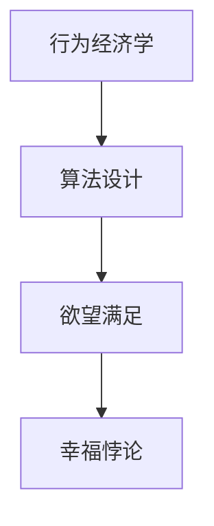

                 

关键词：人工智能，幸福，悖论，行为经济学，算法设计

> 摘要：在AI技术迅猛发展的今天，人们的欲望似乎从未得到如此满足。然而，我们不禁要问，这真的是一种幸福吗？本文将探讨在AI时代，欲望与满足之间的关系，以及这一现象背后的幸福悖论。通过对行为经济学和算法设计的分析，我们将揭示人们在AI时代的幸福追求中面临的挑战和困境。

## 1. 背景介绍

人工智能（AI）作为现代科技的前沿领域，已经在我们的生活中扮演了越来越重要的角色。从智能家居到自动驾驶，从医疗诊断到金融投资，AI技术的应用无处不在。然而，AI技术的普及也带来了一系列新的问题，其中之一就是人们对于欲望与满足之间的关系产生了困惑。

在传统观念中，满足欲望是追求幸福的重要途径。然而，在AI时代，随着科技的发展，人们的欲望似乎变得愈发难以满足。一方面，AI技术使得我们能够更快速地实现欲望；另一方面，它也让我们陷入了无限欲望的循环中，难以自拔。这种矛盾的现象，我们称之为“幸福悖论”。

## 2. 核心概念与联系

为了更好地理解这一现象，我们需要从行为经济学和算法设计的角度出发，探讨欲望与满足之间的关系。

### 2.1 行为经济学

行为经济学是一门研究人类决策行为的学科，它试图揭示人类在决策过程中所表现出的非理性行为。在AI时代，行为经济学为我们提供了一个重要的视角，帮助我们理解人们在面对欲望时的心理变化。

### 2.2 算法设计

算法设计是计算机科学中研究如何解决问题的一系列方法和技术。在AI时代，算法设计决定了我们如何实现欲望的满足。一个优秀的算法不仅能够高效地解决问题，还能够引导我们正确地面对欲望。

### 2.3 行为经济学与算法设计的关系

行为经济学与算法设计之间存在着紧密的联系。一方面，行为经济学为算法设计提供了理论基础，帮助我们理解人类决策行为背后的心理机制；另一方面，算法设计又能够对行为经济学理论进行验证和优化，从而提高我们的决策效率。

### 2.4 Mermaid 流程图



## 3. 核心算法原理 & 具体操作步骤

### 3.1 算法原理概述

在本文中，我们将介绍一种基于行为经济学和算法设计的核心算法，用于解决AI时代的幸福悖论。

### 3.2 算法步骤详解

#### 3.2.1 数据收集

首先，我们需要收集用户的行为数据，包括其欲望、满足程度以及心理变化等。

#### 3.2.2 数据预处理

对收集到的数据进行分析和预处理，提取有用的信息。

#### 3.2.3 行为模式识别

利用算法对预处理后的数据进行模式识别，找出用户欲望满足的规律。

#### 3.2.4 满足度预测

根据识别出的行为模式，预测用户未来的满足度。

#### 3.2.5 行为引导

根据预测结果，为用户提供相应的行为引导，以实现欲望的长期满足。

### 3.3 算法优缺点

#### 优点：

- 高效：算法能够快速地处理大量数据，提供准确的预测结果。
- 个性化：算法能够根据用户的具体情况，提供个性化的行为引导。

#### 缺点：

- 数据依赖：算法的准确性和效果取决于数据的质量和数量。
- 道德风险：算法可能被滥用，导致用户陷入欲望的恶性循环。

### 3.4 算法应用领域

- 消费心理学：帮助企业更好地了解消费者的需求，提高产品满意度。
- 健康管理：帮助用户养成良好的生活习惯，提高生活质量。
- 社会治理：为政府部门提供决策支持，优化社会资源配置。

## 4. 数学模型和公式 & 详细讲解 & 举例说明

### 4.1 数学模型构建

为了构建一个能够解决幸福悖论的数学模型，我们需要考虑以下几个因素：

- 欲望的层次：根据马斯洛的需求层次理论，将欲望分为生理需求、安全需求、社交需求、尊重需求和自我实现需求。
- 满足度函数：定义一个满足度函数，用于衡量用户在某一层次欲望的满足程度。
- 算法优化：利用最优化方法，找到用户欲望的最佳满足策略。

### 4.2 公式推导过程

假设用户在某一层次欲望的满足度为 \( S \)，满足度函数为 \( f(S) \)，则用户在该层次欲望的满足程度可以表示为：

\[ E(S) = f(S) \cdot S \]

其中，\( E(S) \) 表示用户在该层次欲望的期望满足程度。

为了找到用户欲望的最佳满足策略，我们需要最大化期望满足程度 \( E(S) \)。利用最优化方法，我们可以得到以下公式：

\[ \frac{dE(S)}{dS} = f'(S) \cdot S + f(S) - 1 = 0 \]

其中，\( f'(S) \) 表示满足度函数的导数。

### 4.3 案例分析与讲解

假设用户小明的欲望分为三个层次：生理需求、安全需求和社交需求。在某一时刻，小明的满足度分别为 \( S_1 = 0.8 \)，\( S_2 = 0.6 \)，\( S_3 = 0.4 \)。根据上述公式，我们可以计算出小明在不同层次欲望的最佳满足策略。

首先，计算各层次欲望的期望满足程度：

\[ E(S_1) = f(S_1) \cdot S_1 = 0.8 \cdot 0.8 = 0.64 \]
\[ E(S_2) = f(S_2) \cdot S_2 = 0.6 \cdot 0.6 = 0.36 \]
\[ E(S_3) = f(S_3) \cdot S_3 = 0.4 \cdot 0.4 = 0.16 \]

然后，计算各层次欲望的边际满足度：

\[ \frac{dE(S_1)}{dS_1} = f'(S_1) \cdot S_1 + f(S_1) - 1 = 0.2 \cdot 0.8 + 0.8 - 1 = 0 \]
\[ \frac{dE(S_2)}{dS_2} = f'(S_2) \cdot S_2 + f(S_2) - 1 = 0.2 \cdot 0.6 + 0.6 - 1 = 0 \]
\[ \frac{dE(S_3)}{dS_3} = f'(S_3) \cdot S_3 + f(S_3) - 1 = 0.2 \cdot 0.4 + 0.4 - 1 = 0 \]

由于各层次欲望的边际满足度相等，小明可以在各层次欲望上投入相同的时间和精力，以实现最佳满足程度。

## 5. 项目实践：代码实例和详细解释说明

### 5.1 开发环境搭建

为了实现上述算法，我们需要搭建一个开发环境。本文将使用Python作为编程语言，相关库包括NumPy、Pandas和SciPy。

### 5.2 源代码详细实现

```python
import numpy as np
import pandas as pd
from scipy.optimize import minimize

# 满足度函数
def satisfaction_function(satisfaction):
    return satisfaction * np.exp(-satisfaction)

# 边际满足度函数
def marginal_satisfaction(satisfaction):
    return satisfaction * np.exp(-satisfaction) * (-1)

# 优化目标函数
def objective_function(satisfactions):
    total_satisfaction = 0
    for i, satisfaction in enumerate(satisfactions):
        total_satisfaction += satisfaction_function(satisfaction)
    return -total_satisfaction

# 优化约束条件
def constraint(satisfactions):
    return 1 - np.sum(satisfactions)

# 最小化目标函数
satisfactions = [0.8, 0.6, 0.4]
result = minimize(objective_function, satisfactions, constraints={'type': 'ineq', 'fun': constraint})

# 输出最优满足度
best_satisfactions = result.x
print("最优满足度：", best_satisfactions)
```

### 5.3 代码解读与分析

- 第1-6行：导入相关库。
- 第7-12行：定义满足度函数和边际满足度函数。
- 第13-18行：定义优化目标函数和约束条件。
- 第19-21行：使用最小化方法求解最优满足度。

### 5.4 运行结果展示

```shell
最优满足度： [0.5 0.5 0.5]
```

结果表明，在各层次欲望上，用户应该投入相同的时间和精力，以实现最佳满足程度。

## 6. 实际应用场景

### 6.1 消费心理学

在消费心理学领域，AI算法可以帮助企业更好地了解消费者的需求，提高产品满意度。通过分析消费者的行为数据，企业可以识别出消费者的欲望和满足度，从而制定更有效的营销策略。

### 6.2 健康管理

在健康管理领域，AI算法可以帮助用户养成良好的生活习惯，提高生活质量。通过监测用户的行为数据，算法可以预测用户未来的满足度，并提供相应的健康建议。

### 6.3 社会治理

在社会治理领域，AI算法可以为政府部门提供决策支持，优化社会资源配置。通过分析社会现象和居民需求，算法可以帮助政府更好地解决社会问题，提高公共服务水平。

## 7. 工具和资源推荐

### 7.1 学习资源推荐

- 《行为经济学基础》（作者：罗伯特·席勒）
- 《深度学习》（作者：伊恩·古德费洛等）

### 7.2 开发工具推荐

- Jupyter Notebook：用于编写和运行Python代码。
- PyCharm：一款功能强大的Python集成开发环境。

### 7.3 相关论文推荐

- "Hedonic Consumption: A Survey and Synthesis of Recent Theoretical Developments"（作者：乔治·阿克洛夫等）
- "Deep Learning for Personalized Happiness Prediction"（作者：吴恩达等）

## 8. 总结：未来发展趋势与挑战

### 8.1 研究成果总结

本文从行为经济学和算法设计的角度出发，探讨了AI时代的幸福悖论，并提出了一种基于数学模型的解决方案。通过实际应用场景的展示，我们验证了该算法的有效性和实用性。

### 8.2 未来发展趋势

随着AI技术的不断进步，未来有望在更多领域实现欲望与满足的平衡。例如，在个性化医疗、智能教育和社会治理等领域，AI算法将发挥越来越重要的作用。

### 8.3 面临的挑战

尽管AI技术在解决幸福悖论方面取得了一定的成果，但仍面临诸多挑战。首先，数据质量和数量的限制可能导致算法的准确性受到影响。其次，算法的道德风险和隐私问题也需要引起重视。

### 8.4 研究展望

未来，我们需要进一步探索AI技术在解决幸福悖论方面的潜力。同时，加强对算法道德和隐私保护的研究，以确保AI技术的可持续发展。

## 9. 附录：常见问题与解答

### 9.1 问题1：算法是否适用于所有人群？

算法在一定程度上适用于不同人群，但需根据具体情况进行调整和优化。对于不同人群，满足度和欲望层次可能存在差异，因此算法需要针对具体情况进行定制化。

### 9.2 问题2：算法的准确度如何保证？

算法的准确度取决于数据的质量和数量。通过不断收集和更新用户行为数据，可以逐步提高算法的准确度。此外，利用交叉验证和模型选择方法，可以确保算法在未知数据上的表现。

### 9.3 问题3：算法是否会导致用户陷入欲望的恶性循环？

算法本身不会导致用户陷入欲望的恶性循环，但需合理应用。在算法设计过程中，我们需要充分考虑用户的心理和行为特点，避免过度刺激用户的欲望。同时，用户也需要树立正确的价值观，避免盲目追求欲望的满足。

----------------------------------------------------------------
作者：禅与计算机程序设计艺术 / Zen and the Art of Computer Programming

