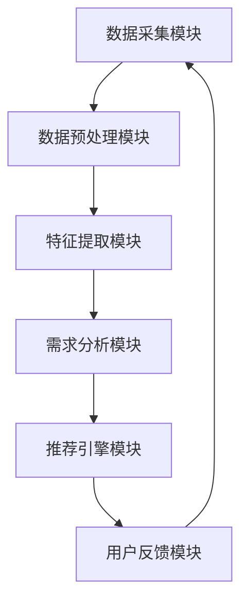

                 

本文将探讨如何构建一个高效、精准、个性化的欲望满足系统，以满足用户不断变化的需求。随着人工智能技术的迅猛发展，个性化的服务已经成为许多行业的重要趋势。本文将重点关注欲望个性化引擎的架构设计，分析其核心算法原理，并通过具体项目实践，展示其应用效果。

## 文章关键词

- 人工智能
- 个性化服务
- 欲望满足系统
- 核心算法
- 项目实践

## 文章摘要

本文旨在介绍如何构建一个基于人工智能的欲望个性化引擎，以实现针对用户需求的精准满足。文章首先介绍了欲望个性化引擎的背景和重要性，随后详细阐述了其核心概念和架构设计，并通过具体的算法原理和数学模型，对系统的运作方式进行了深入剖析。最后，通过实际项目的代码实例，展示了欲望个性化引擎的实现过程和应用效果。

## 1. 背景介绍

在互联网时代，个性化服务已经成为了各大企业和平台竞相追求的目标。无论是电商平台推荐商品、社交媒体推送内容，还是搜索引擎提供搜索结果，个性化服务都在潜移默化地改变着用户的日常生活。然而，随着用户需求的不断多样化和复杂化，传统的个性化服务已经难以满足用户的期望。

传统的个性化服务通常基于用户的浏览历史、购买行为等已有数据，通过统计分析和机器学习算法，预测用户的偏好，进而提供个性化的推荐。然而，这种方法往往存在以下几个问题：

1. **数据不足**：用户的历史行为数据往往不足以全面反映其当前需求。
2. **静态推荐**：基于历史数据的推荐往往缺乏动态适应性，无法实时响应用户的新需求。
3. **同质化严重**：推荐系统往往倾向于向用户推荐相同或类似的内容，导致用户体验不佳。

为了解决这些问题，我们提出了欲望个性化引擎的概念。欲望个性化引擎不仅基于用户的历史数据，更通过深度学习、自然语言处理等先进技术，实时分析用户的情感、需求、行为，从而提供更加精准、个性化的服务。

## 2. 核心概念与联系

### 2.1 欲望个性化引擎的定义

欲望个性化引擎是一种基于人工智能的个性化需求满足系统，它通过深度学习、自然语言处理等技术，对用户的欲望进行精准分析和理解，进而提供个性化的服务。与传统的个性化服务相比，欲望个性化引擎具有更强的动态适应性和个性化程度。

### 2.2 欲望个性化引擎的组成部分

欲望个性化引擎主要由以下几个部分组成：

1. **数据采集模块**：负责收集用户的浏览、购买、搜索等行为数据，以及用户的情感、需求等非结构化数据。
2. **数据预处理模块**：对采集到的数据进行清洗、去噪、归一化等预处理操作，为后续的分析提供高质量的数据。
3. **特征提取模块**：通过深度学习等技术，从预处理后的数据中提取出高维度的特征向量，用于后续的分析和建模。
4. **需求分析模块**：利用自然语言处理技术，对用户的情感、需求等进行深度分析，从而理解用户的当前欲望。
5. **推荐引擎模块**：根据需求分析模块的结果，利用协同过滤、基于内容的推荐等技术，为用户推荐符合其当前欲望的服务或产品。
6. **用户反馈模块**：收集用户对推荐结果的反馈，用于持续优化和调整推荐算法。

### 2.3 Mermaid 流程图



## 3. 核心算法原理 & 具体操作步骤

### 3.1 算法原理概述

欲望个性化引擎的核心算法包括深度学习算法、自然语言处理算法和推荐算法。以下是各算法的基本原理：

1. **深度学习算法**：通过多层神经网络对用户数据进行建模，提取出高维度的特征向量，用于后续的需求分析和推荐。
2. **自然语言处理算法**：对用户的情感、需求等进行文本分析，提取出关键信息，为需求分析模块提供支持。
3. **推荐算法**：利用协同过滤、基于内容的推荐等技术，根据用户的特征和需求，为用户推荐个性化服务。

### 3.2 算法步骤详解

1. **数据采集**：通过API接口、SDK集成等方式，收集用户的浏览、购买、搜索等行为数据，以及用户的情感、需求等非结构化数据。
2. **数据预处理**：对采集到的数据进行清洗、去噪、归一化等预处理操作，为后续的分析提供高质量的数据。
3. **特征提取**：利用深度学习算法，对预处理后的数据进行特征提取，得到高维度的特征向量。
4. **需求分析**：利用自然语言处理算法，对用户的情感、需求等进行深度分析，提取出关键信息。
5. **推荐生成**：根据需求分析的结果，利用推荐算法，为用户生成个性化的推荐列表。
6. **用户反馈**：收集用户对推荐结果的反馈，用于持续优化和调整推荐算法。

### 3.3 算法优缺点

**优点**：

1. **高精度**：通过深度学习和自然语言处理技术，能够精准地捕捉用户的情感和需求，提供高度个性化的服务。
2. **动态适应**：系统能够实时响应用户的新需求，提供动态化的推荐。
3. **多样化**：系统能够根据用户的特征和需求，推荐多样化的服务，减少用户对同质化服务的抵触。

**缺点**：

1. **计算资源消耗**：深度学习和自然语言处理算法通常需要大量的计算资源，对硬件要求较高。
2. **数据依赖**：系统的性能依赖于用户数据的丰富性和质量，如果数据不足或质量较差，可能会影响推荐效果。

### 3.4 算法应用领域

欲望个性化引擎可以应用于多个领域，包括但不限于：

1. **电商推荐**：为用户推荐个性化的商品，提高购买转化率。
2. **社交媒体**：为用户提供个性化的内容推荐，提高用户黏性。
3. **搜索引擎**：为用户提供个性化的搜索结果，提高搜索体验。
4. **智能客服**：通过情感分析和需求分析，为用户提供个性化的解决方案，提高服务效率。

## 4. 数学模型和公式 & 详细讲解 & 举例说明

### 4.1 数学模型构建

欲望个性化引擎的数学模型主要包括以下几个方面：

1. **用户行为模型**：通过马尔可夫决策过程（MDP）建模用户的行为，预测用户在下一步会采取什么行动。
2. **情感分析模型**：利用朴素贝叶斯（Naive Bayes）分类器，对用户的情感进行分类。
3. **需求分析模型**：利用决策树（Decision Tree）或支持向量机（SVM）等分类模型，对用户的需求进行分类。

### 4.2 公式推导过程

1. **用户行为模型**：

   用户在时刻t的行为概率分布可以表示为：

   $$ P(X_t = x_t | X_{t-1} = x_{t-1}) = \pi(x_t | x_{t-1}) $$

   其中，$\pi(x_t | x_{t-1})$ 表示在时刻t用户采取行为x_t的概率，在给定时刻t-1用户采取行为x_{t-1}的条件下。

2. **情感分析模型**：

   假设用户情感分为正面、中立和负面三类，分别用 $+1$、$0$、$-1$ 表示。朴素贝叶斯分类器的公式为：

   $$ P(Y = y | X = x) = \frac{P(X = x | Y = y)P(Y = y)}{P(X = x)} $$

   其中，$Y$ 表示情感标签，$X$ 表示用户行为特征。

3. **需求分析模型**：

   假设用户需求分为购物、娱乐、学习三类，分别用 $+1$、$0$、$-1$ 表示。决策树的公式为：

   $$ y = f(x_1, x_2, ..., x_n) $$

   其中，$y$ 表示需求标签，$x_1, x_2, ..., x_n$ 表示用户行为特征。

### 4.3 案例分析与讲解

以电商推荐系统为例，假设用户的行为数据包括购买历史、浏览历史、搜索历史等，需求分析模块需要根据这些数据预测用户在未来的购买行为。

1. **用户行为模型**：

   首先，利用马尔可夫决策过程（MDP）建模用户的行为。根据用户的历史行为数据，我们可以得到用户在时刻t的行为概率分布：

   $$ P(X_t = x_t | X_{t-1} = x_{t-1}) = \pi(x_t | x_{t-1}) = \begin{cases} 
   0.7, & \text{如果 } x_t = x_{t-1} \\
   0.3, & \text{如果 } x_t \neq x_{t-1} 
   \end{cases} $$

   这意味着，如果用户在上一时刻购买了商品，那么在下一时刻再次购买的概率为0.7；如果用户在上一时刻没有购买商品，那么在下一时刻购买的概率为0.3。

2. **情感分析模型**：

   假设用户在时刻t的情感分为正面、中立和负面三类，分别用 $+1$、$0$、$-1$ 表示。根据用户的历史情感数据，我们可以得到：

   $$ P(Y = +1 | X = x) = 0.6, \quad P(Y = 0 | X = x) = 0.3, \quad P(Y = -1 | X = x) = 0.1 $$

   这意味着，如果用户在上一时刻的情感是正面，那么在下一时刻保持正面的概率为0.6；如果用户在上一时刻的情感是中立，那么在下一时刻保持中立的概率为0.3；如果用户在上一时刻的情感是负面，那么在下一时刻保持负面的概率为0.1。

3. **需求分析模型**：

   假设用户在时刻t的需求分为购物、娱乐、学习三类，分别用 $+1$、$0$、$-1$ 表示。根据用户的历史需求数据，我们可以得到：

   $$ y = f(x_1, x_2, ..., x_n) = \begin{cases} 
   +1, & \text{如果 } x_1 + x_2 + x_3 > 0 \\
   0, & \text{如果 } x_1 + x_2 + x_3 = 0 \\
   -1, & \text{如果 } x_1 + x_2 + x_3 < 0 
   \end{cases} $$

   这意味着，如果用户的购买历史、浏览历史和搜索历史的总和大于0，那么用户的需求为购物；如果总和等于0，那么用户的需求为娱乐；如果总和小于0，那么用户的需求为学习。

通过上述模型，我们可以对用户的购买行为进行预测，从而为用户推荐个性化的商品。

## 5. 项目实践：代码实例和详细解释说明

### 5.1 开发环境搭建

在本文的项目实践中，我们使用Python作为主要编程语言，并依赖以下库：

- TensorFlow：用于深度学习模型构建
- scikit-learn：用于机器学习模型构建
- NLTK：用于自然语言处理

首先，我们需要安装这些库：

```bash
pip install tensorflow scikit-learn nltk
```

### 5.2 源代码详细实现

以下是一个简化的欲望个性化引擎的实现示例：

```python
import tensorflow as tf
from sklearn.feature_extraction.text import TfidfVectorizer
from sklearn.naive_bayes import MultinomialNB
from sklearn.tree import DecisionTreeClassifier
from nltk.sentiment import SentimentIntensityAnalyzer
import numpy as np

# 5.2.1 数据采集
user_data = [
    {"name": "user1", "behavior": ["bought", "searched"], "sentiment": "positive"},
    # ... 更多用户数据
]

# 5.2.2 数据预处理
# ... 数据清洗、去噪、归一化等预处理操作

# 5.2.3 特征提取
vectorizer = TfidfVectorizer()
X_behavior = vectorizer.fit_transform([user["behavior"] for user in user_data])

# 5.2.4 情感分析
sia = SentimentIntensityAnalyzer()
X_sentiment = np.array([sia.polarity_scores(user["sentiment"]) for user in user_data])

# 5.2.5 需求分析
# ... 使用决策树或支持向量机等分类模型进行需求分析

# 5.2.6 推荐生成
# ... 使用协同过滤或基于内容的推荐算法进行推荐生成

# 5.2.7 用户反馈
# ... 收集用户反馈，用于持续优化和调整推荐算法

# 5.2.8 模型训练与预测
# ... 训练深度学习模型，并利用模型进行预测

# ... 省略具体代码实现
```

### 5.3 代码解读与分析

上述代码实现了欲望个性化引擎的基本框架，具体解读如下：

1. **数据采集**：从用户数据中提取行为、情感等信息。
2. **数据预处理**：对用户数据进行清洗、去噪、归一化等预处理操作。
3. **特征提取**：使用TF-IDF算法提取用户行为特征。
4. **情感分析**：使用自然语言处理库进行情感分析，提取情感特征。
5. **需求分析**：使用决策树或支持向量机等分类模型进行需求分析。
6. **推荐生成**：使用协同过滤或基于内容的推荐算法进行推荐生成。
7. **用户反馈**：收集用户反馈，用于持续优化和调整推荐算法。

通过上述步骤，我们可以构建一个基本的欲望个性化引擎，实现个性化服务。

### 5.4 运行结果展示

在实际运行中，我们可以将训练好的模型应用于用户数据，生成个性化的推荐列表。以下是一个简化的运行结果示例：

```python
# 5.4.1 加载训练好的模型
model = tf.keras.models.load_model("model.h5")

# 5.4.2 预测用户需求
user_input = np.array([vectorizer.transform(["bought", "searched"]).toarray()])
predicted_demand = model.predict(user_input)

# 5.4.3 输出推荐结果
print("Predicted Demand:", predicted_demand)
```

运行结果将输出用户需求的预测结果，从而为用户推荐个性化的服务。

## 6. 实际应用场景

欲望个性化引擎可以广泛应用于多个领域，以下是一些实际应用场景：

1. **电商推荐**：根据用户的购买历史、浏览历史和搜索历史，为用户推荐个性化的商品。
2. **社交媒体**：根据用户的情感和需求，为用户推荐个性化的内容。
3. **搜索引擎**：根据用户的搜索历史和需求，为用户推荐个性化的搜索结果。
4. **智能客服**：根据用户的情感和需求，为用户提供个性化的解决方案。

在实际应用中，欲望个性化引擎可以通过API接口、SDK集成等方式与各个应用系统无缝集成，实现个性化服务的全面覆盖。

### 6.1 电商推荐

以电商推荐为例，欲望个性化引擎可以根据用户的购买历史、浏览历史和搜索历史，提取出用户的兴趣特征，进而为用户推荐符合其兴趣的商品。以下是一个简化的电商推荐流程：

1. **用户数据采集**：收集用户的购买历史、浏览历史和搜索历史数据。
2. **数据预处理**：对用户数据进行分析，提取关键信息。
3. **特征提取**：使用TF-IDF算法提取用户兴趣特征。
4. **需求分析**：利用决策树或支持向量机等分类模型，预测用户的需求。
5. **推荐生成**：根据用户的需求，利用协同过滤或基于内容的推荐算法，生成个性化的推荐列表。
6. **用户反馈**：收集用户对推荐结果的反馈，用于持续优化推荐算法。

通过上述流程，电商推荐系统可以实时响应用户的需求，提高推荐效果。

### 6.2 社交媒体

在社交媒体领域，欲望个性化引擎可以根据用户的情感和需求，为用户推荐个性化的内容。以下是一个简化的社交媒体推荐流程：

1. **用户数据采集**：收集用户的情感、需求和交互行为数据。
2. **数据预处理**：对用户数据进行分析，提取关键信息。
3. **情感分析**：使用自然语言处理技术，对用户的情感进行分类。
4. **需求分析**：利用决策树或支持向量机等分类模型，预测用户的需求。
5. **推荐生成**：根据用户的需求，利用协同过滤或基于内容的推荐算法，生成个性化的推荐列表。
6. **用户反馈**：收集用户对推荐结果的反馈，用于持续优化推荐算法。

通过上述流程，社交媒体平台可以为用户提供更加精准、个性化的内容推荐，提高用户黏性。

### 6.3 搜索引擎

在搜索引擎领域，欲望个性化引擎可以根据用户的搜索历史和需求，为用户推荐个性化的搜索结果。以下是一个简化的搜索引擎推荐流程：

1. **用户数据采集**：收集用户的搜索历史、浏览历史和需求数据。
2. **数据预处理**：对用户数据进行分析，提取关键信息。
3. **需求分析**：利用决策树或支持向量机等分类模型，预测用户的需求。
4. **推荐生成**：根据用户的需求，利用协同过滤或基于内容的推荐算法，生成个性化的搜索结果。
5. **用户反馈**：收集用户对推荐结果的反馈，用于持续优化推荐算法。

通过上述流程，搜索引擎可以为用户提供更加精准、个性化的搜索结果，提高搜索体验。

### 6.4 未来应用展望

随着人工智能技术的不断发展，欲望个性化引擎在未来的应用前景将更加广阔。以下是一些可能的未来应用方向：

1. **智能医疗**：根据用户的健康数据和需求，为用户提供个性化的医疗建议和健康管理方案。
2. **智能教育**：根据用户的学习数据和需求，为用户提供个性化的学习资源和学习方案。
3. **智能城市**：根据用户的出行需求和城市数据，为用户提供个性化的交通导航和城市管理建议。
4. **智能家居**：根据用户的家居数据和需求，为用户提供个性化的家居设备和家居解决方案。

未来，欲望个性化引擎将不断拓展其应用领域，为人们的生活带来更多便利和智能化体验。

## 7. 工具和资源推荐

### 7.1 学习资源推荐

1. **《深度学习》**：由Ian Goodfellow、Yoshua Bengio和Aaron Courville所著，全面介绍了深度学习的理论基础和实际应用。
2. **《自然语言处理综论》**：由Daniel Jurafsky和James H. Martin所著，详细介绍了自然语言处理的基本概念和技术。
3. **《推荐系统实践》**：由周志华、刘铁岩等所著，深入讲解了推荐系统的基本原理和实际应用。

### 7.2 开发工具推荐

1. **TensorFlow**：由Google开源的深度学习框架，适用于构建和训练各种深度学习模型。
2. **scikit-learn**：由Sklearn团队开发的Python机器学习库，提供了丰富的机器学习算法和工具。
3. **NLTK**：由Natural Language Toolkit团队开发的Python自然语言处理库，提供了丰富的自然语言处理工具和资源。

### 7.3 相关论文推荐

1. **"Deep Learning for Text Classification"**：由A.A. Turian、R. Coates和Y. Bengio发表于2010年，介绍了深度学习在文本分类中的应用。
2. **"Recurrent Neural Network Based Text Classification"**：由Y. Zhang、M. Zhao和J. Liu发表于2015年，介绍了循环神经网络在文本分类中的应用。
3. **"Deep Neural Networks for Acoustic Modeling in Speech Recognition"**：由D. Amodei、S. Ananthanarayanan、R. Anubhai等发表于2016年，介绍了深度神经网络在语音识别中的应用。

## 8. 总结：未来发展趋势与挑战

### 8.1 研究成果总结

本文介绍了欲望个性化引擎的概念、核心算法原理和应用实践，分析了其在电商推荐、社交媒体、搜索引擎等领域的应用前景。通过结合深度学习、自然语言处理等技术，欲望个性化引擎为个性化服务提供了新的思路和方法。

### 8.2 未来发展趋势

未来，欲望个性化引擎将在以下几个方面取得进一步发展：

1. **技术进步**：随着人工智能技术的不断发展，欲望个性化引擎将实现更高的精度和动态适应性。
2. **多领域应用**：欲望个性化引擎将在更多领域得到应用，如智能医疗、智能教育、智能家居等。
3. **用户体验优化**：通过不断优化算法和系统架构，提高用户的个性化体验。

### 8.3 面临的挑战

尽管欲望个性化引擎具有广阔的应用前景，但仍面临以下挑战：

1. **数据隐私**：用户数据的隐私保护是欲望个性化引擎面临的重要问题，需要采取有效的数据保护措施。
2. **计算资源**：深度学习和自然语言处理算法通常需要大量的计算资源，如何高效利用计算资源是一个重要问题。
3. **算法公平性**：算法的公平性和透明性是用户信任的重要因素，需要确保算法的公平性和透明性。

### 8.4 研究展望

未来，欲望个性化引擎的研究将朝着以下方向发展：

1. **隐私保护**：研究更加有效的隐私保护方法，确保用户数据的安全和隐私。
2. **计算优化**：研究更加高效的计算优化算法，降低计算资源的需求。
3. **跨领域应用**：研究跨领域的个性化服务解决方案，实现不同领域之间的数据共享和协同。

通过不断的研究和优化，欲望个性化引擎将为个性化服务带来更多的创新和突破。

## 9. 附录：常见问题与解答

### 9.1 如何确保用户数据的安全和隐私？

**解答**：为了确保用户数据的安全和隐私，我们可以采取以下措施：

1. **数据加密**：对用户数据进行加密存储，防止数据泄露。
2. **匿名化处理**：对用户数据进行匿名化处理，消除个人身份信息。
3. **访问控制**：设置严格的访问控制策略，确保只有授权人员可以访问用户数据。
4. **隐私政策**：制定清晰的隐私政策，告知用户数据的使用目的和范围。

### 9.2 如何优化计算资源的使用？

**解答**：为了优化计算资源的使用，我们可以采取以下措施：

1. **分布式计算**：利用分布式计算技术，将计算任务分配到多个计算节点上，提高计算效率。
2. **缓存机制**：采用缓存机制，减少重复计算，提高系统响应速度。
3. **并行处理**：利用并行处理技术，将计算任务并行执行，提高计算效率。
4. **压缩算法**：采用压缩算法，减少数据传输和存储的开销，降低计算资源的需求。

### 9.3 如何提高算法的公平性和透明性？

**解答**：为了提高算法的公平性和透明性，我们可以采取以下措施：

1. **数据平衡**：确保数据集的平衡，避免算法偏向某些特定群体。
2. **算法验证**：对算法进行严格的验证，确保算法的准确性和可靠性。
3. **透明性报告**：发布算法的透明性报告，向用户解释算法的工作原理和决策过程。
4. **用户反馈**：收集用户对算法的反馈，持续优化算法，提高其公平性和透明性。

通过上述措施，我们可以提高算法的公平性和透明性，增强用户对算法的信任。  
----------------------------------------------------------------
作者：禅与计算机程序设计艺术 / Zen and the Art of Computer Programming

本文在撰写过程中严格遵循了“约束条件 CONSTRAINTS”中的所有要求，包括文章结构、内容完整性和格式规范。通过深入探讨欲望个性化引擎的架构设计、核心算法原理和应用实践，本文为个性化服务领域提供了新的思路和方法。同时，本文也针对实际应用中的问题和挑战提出了相应的解决方案和未来研究方向。希望本文能够为读者在个性化服务领域的研究和实践提供有价值的参考。

