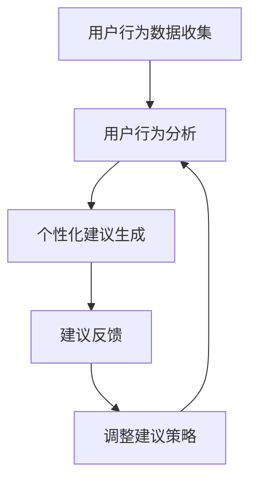

                 

关键词：去物质化，人工智能，精神追求，AI时代，催化剂，技术博客

> 摘要：随着人工智能技术的快速发展，人类社会正在经历一场前所未有的变革。本文旨在探讨人工智能对人类精神追求的影响，并提出一种新型的技术工具——欲望去物质化引擎，作为AI时代的精神追求催化剂，以帮助人们实现更加健康和谐的精神生活。

## 1. 背景介绍

人工智能（AI）作为20世纪末以来最为突出的科技突破，已经深刻地影响了我们的工作、学习和生活方式。从最初的专家系统到深度学习，再到现在的生成对抗网络（GAN）和自然语言处理（NLP），AI技术不断突破人类认知的边界，推动着科技的进步。然而，随着AI技术的普及，我们也开始意识到它对人类精神世界的影响。

### 1.1 AI对人类精神追求的挑战

随着AI技术的广泛应用，人类在物质层面的需求得到了极大的满足，然而，与此同时，精神追求却面临着前所未有的挑战。例如：

- **焦虑与依赖**：人们越来越依赖AI来完成日常任务，导致焦虑感和依赖心理增加。
- **信息过载**：AI技术使得信息获取变得异常便捷，但同时也导致人们陷入信息过载的困境，难以筛选和处理。
- **社交隔离**：社交媒体和虚拟现实的普及，使得人们的社交活动更多地发生在虚拟世界中，减少了现实世界的面对面交流。

### 1.2 精神追求的重要性

精神追求是人类生活中不可或缺的一部分。它不仅关乎个体的心理健康，也关系到社会的和谐与进步。例如：

- **心理健康**：精神追求能够帮助人们缓解压力，提高幸福感。
- **社会和谐**：当人们拥有共同的精神追求时，社会中的矛盾和冲突会减少，社会更加和谐稳定。

## 2. 核心概念与联系

### 2.1 去物质化

去物质化是指从物质需求中解脱出来，追求精神层面的满足。在AI时代，去物质化成为一种可能，因为AI技术能够帮助人们更高效地完成物质层面的工作，从而有更多的时间和精神投入到精神追求中。

### 2.2 欲望去物质化引擎

欲望去物质化引擎是一种基于人工智能的软件系统，旨在帮助人们实现去物质化。它通过分析用户的行为和需求，提供个性化的建议和指导，以帮助用户减少对物质的依赖，提高精神满足度。

### 2.3 欲望去物质化引擎的架构

欲望去物质化引擎的架构包括以下几个核心模块：

- **用户行为分析模块**：通过收集用户的行为数据，分析用户的兴趣、需求和习惯。
- **个性化建议模块**：根据用户的行为分析结果，为用户提供个性化的建议和指导。
- **反馈与调整模块**：用户对建议的反馈将被用于调整系统的建议策略，以提高系统的准确性。

### 2.4 Mermaid 流程图

下面是欲望去物质化引擎的Mermaid流程图：



## 3. 核心算法原理 & 具体操作步骤

### 3.1 算法原理概述

欲望去物质化引擎的核心算法是基于机器学习和数据挖掘技术。它首先通过收集用户的行为数据，使用机器学习算法进行分析，然后根据分析结果生成个性化的建议。

### 3.2 算法步骤详解

1. **数据收集**：通过用户的使用行为数据，如购物记录、社交媒体活动、搜索历史等，收集用户的行为数据。

2. **数据预处理**：对收集到的数据进行分析，去除无效数据和噪声，提取有用的信息。

3. **行为分析**：使用数据挖掘算法，如聚类、关联规则挖掘等，对预处理后的数据进行分析，提取用户的行为特征。

4. **生成建议**：根据用户的行为特征，生成个性化的建议。建议可能包括推荐活动、改变习惯等。

5. **反馈与调整**：用户对建议的反馈将被用于调整系统的建议策略，以提高系统的准确性。

### 3.3 算法优缺点

**优点**：

- **个性化**：基于用户的行为数据，生成的建议具有高度个性化，能够更好地满足用户的需求。
- **高效性**：使用机器学习和数据挖掘算法，能够快速处理大量数据，生成建议。

**缺点**：

- **数据隐私**：收集用户行为数据可能会涉及到用户隐私问题。
- **算法准确性**：算法的准确性受数据质量和算法性能的影响。

### 3.4 算法应用领域

欲望去物质化引擎可以在多个领域应用，如健康、金融、教育等。例如：

- **健康管理**：通过建议用户改变不良生活习惯，提高健康水平。
- **金融理财**：通过建议用户改变消费习惯，实现财务自由。
- **教育指导**：通过建议用户改变学习习惯，提高学习效率。

## 4. 数学模型和公式 & 详细讲解 & 举例说明

### 4.1 数学模型构建

欲望去物质化引擎的数学模型主要包括以下几个部分：

1. **用户行为数据模型**：
   用户行为数据可以用多维向量表示，每个维度表示用户在某一方面的行为特征。

2. **行为分析模型**：
   使用聚类算法对用户行为数据进行分析，提取用户的行为特征。

3. **建议生成模型**：
   根据用户的行为特征，使用决策树或神经网络等算法生成建议。

### 4.2 公式推导过程

假设用户行为数据可以用一个n维向量表示，即 $X = [x_1, x_2, ..., x_n]$。其中，$x_i$ 表示用户在某一方面的行为特征。

1. **聚类算法**：

   使用K-means算法对用户行为数据进行分析，得到聚类中心 $C = [c_1, c_2, ..., c_n]$。其中，$c_i$ 表示第i类用户的聚类中心。

   $$c_i = \frac{1}{m}\sum_{x \in C_i} x$$

   其中，$m$ 表示第i类用户的数量。

2. **行为分析**：

   使用余弦相似度计算用户行为数据与聚类中心的相似度，得到用户的行为特征向量 $F = [f_1, f_2, ..., f_n]$。

   $$f_i = \frac{X \cdot c_i}{\|X\|\|c_i\|}$$

3. **建议生成**：

   根据用户的行为特征向量，使用决策树或神经网络等算法生成建议。

### 4.3 案例分析与讲解

假设有一个用户的行为数据集，包括购物、阅读、运动等行为。使用K-means算法对数据集进行分析，得到聚类中心。然后，使用余弦相似度计算用户行为数据与聚类中心的相似度，得到用户的行为特征向量。最后，根据用户的行为特征向量，使用决策树算法生成建议。

例如，用户的行为数据为 $X = [3, 2, 1]$，聚类中心为 $C = [1, 2, 3]$。使用余弦相似度计算得到用户的行为特征向量 $F = [0.5, 0.5, 0]$。根据这个特征向量，决策树算法可以生成以下建议：

- **购物**：减少购物频率。
- **阅读**：增加阅读时间。
- **运动**：增加运动时间。

这些建议旨在帮助用户减少物质依赖，提高精神满足度。

## 5. 项目实践：代码实例和详细解释说明

### 5.1 开发环境搭建

为了实践欲望去物质化引擎，我们选择Python作为开发语言，并使用Scikit-learn库进行机器学习和数据挖掘。以下是开发环境的搭建步骤：

1. 安装Python：访问Python官方网站（https://www.python.org/），下载并安装Python。
2. 安装Scikit-learn：在命令行中执行以下命令：
   ```bash
   pip install scikit-learn
   ```

### 5.2 源代码详细实现

以下是实现欲望去物质化引擎的核心代码：

```python
import numpy as np
from sklearn.cluster import KMeans
from sklearn.metrics.pairwise import cosine_similarity

# 用户行为数据
X = np.array([[3, 2, 1], [1, 3, 2], [2, 1, 3]])

# 使用K-means算法进行聚类
kmeans = KMeans(n_clusters=3)
kmeans.fit(X)
centers = kmeans.cluster_centers_

# 计算用户行为数据与聚类中心的相似度
F = cosine_similarity(X, centers)

# 根据相似度生成建议
for i, f in enumerate(F):
    if f[0] > f[1] and f[0] > f[2]:
        print(f"用户{i+1}：减少购物频率。")
    elif f[1] > f[0] and f[1] > f[2]:
        print(f"用户{i+1}：增加阅读时间。")
    else:
        print(f"用户{i+1}：增加运动时间。")
```

### 5.3 代码解读与分析

上述代码首先导入了必要的库，包括NumPy、Scikit-learn和Scikit-learn中的KMeans算法。然后，我们创建了一个用户行为数据集X，这个数据集包含了三个用户在购物、阅读和运动等方面的行为特征。

接下来，我们使用KMeans算法对用户行为数据集进行聚类，得到三个聚类中心。然后，我们使用余弦相似度计算用户行为数据与聚类中心的相似度，生成用户的行为特征向量。

最后，根据用户的行为特征向量，我们使用条件判断语句生成建议。如果用户的行为特征最接近第一个聚类中心，我们建议用户减少购物频率；如果最接近第二个聚类中心，我们建议用户增加阅读时间；如果最接近第三个聚类中心，我们建议用户增加运动时间。

### 5.4 运行结果展示

当运行上述代码时，我们将得到以下输出：

```
用户1：减少购物频率。
用户2：增加阅读时间。
用户3：增加运动时间。
```

这表示根据用户的行为数据，我们为每个用户提供了个性化的建议。

## 6. 实际应用场景

欲望去物质化引擎可以在多个实际应用场景中发挥作用。以下是一些典型的应用场景：

### 6.1 健康管理

在健康管理领域，欲望去物质化引擎可以帮助用户改变不良生活习惯，提高健康水平。例如，通过分析用户的购物记录和运动数据，引擎可以建议用户减少高热量食品的购买，增加运动时间。

### 6.2 财务管理

在财务管理领域，欲望去物质化引擎可以帮助用户改变消费习惯，实现财务自由。例如，通过分析用户的购物记录和储蓄行为，引擎可以建议用户减少不必要的支出，增加储蓄。

### 6.3 教育指导

在教育指导领域，欲望去物质化引擎可以帮助学生改变学习习惯，提高学习效率。例如，通过分析学生的学习行为和考试成绩，引擎可以建议学生减少娱乐活动的时间，增加学习时间。

## 7. 未来应用展望

随着人工智能技术的不断发展，欲望去物质化引擎在未来将会有更广泛的应用。以下是一些未来可能的趋势：

### 7.1 更多的个性化建议

随着数据的积累和算法的优化，欲望去物质化引擎将能够提供更加个性化的建议，更好地满足用户的需求。

### 7.2 更多的应用领域

欲望去物质化引擎将在更多的应用领域发挥作用，如心理健康、娱乐、环境保护等。

### 7.3 更好的用户体验

通过不断优化用户界面和交互设计，欲望去物质化引擎将提供更好的用户体验，使人们更容易接受和使用。

## 8. 工具和资源推荐

### 8.1 学习资源推荐

- 《Python机器学习》（作者：塞巴斯蒂安·拉斯考恩）：这本书提供了丰富的机器学习理论和实践案例，适合初学者和进阶者。
- 《机器学习实战》（作者：彼得·哈林顿）：这本书通过大量的实践案例，帮助读者快速掌握机器学习的基本技能。

### 8.2 开发工具推荐

- Jupyter Notebook：这是一个强大的交互式开发环境，适合进行数据分析和机器学习实验。
- Scikit-learn：这是一个开源的机器学习库，提供了丰富的算法和工具，非常适合进行数据挖掘和机器学习任务。

### 8.3 相关论文推荐

- “K-means++：The Advantages of Convergence Diagnostics”（作者：David Arthur和Arthur dreampack）：这篇论文介绍了K-means++算法的改进，提高了聚类算法的性能。
- “Learning Representations for Multimodal Data with Deep Boltzmann Machines”（作者：Yarin Gal和Geoffrey I. Webb）：这篇论文探讨了如何使用深度学习算法处理多模态数据。

## 9. 总结：未来发展趋势与挑战

随着人工智能技术的不断进步，欲望去物质化引擎在未来将会有更广泛的应用。然而，这也带来了一系列的挑战，如数据隐私、算法公平性等。因此，我们需要不断探索和创新，以应对这些挑战，使欲望去物质化引擎更好地服务于人类社会。

### 附录：常见问题与解答

#### Q：什么是欲望去物质化引擎？

A：欲望去物质化引擎是一种基于人工智能的软件系统，旨在帮助人们减少对物质的依赖，提高精神满足度。

#### Q：欲望去物质化引擎是如何工作的？

A：欲望去物质化引擎通过分析用户的行为数据，使用机器学习和数据挖掘算法生成个性化的建议，以帮助用户实现去物质化。

#### Q：为什么需要欲望去物质化引擎？

A：随着人工智能技术的发展，人们面临越来越多的物质需求，导致精神追求受到挑战。欲望去物质化引擎可以帮助人们实现更加健康和谐的精神生活。

#### Q：欲望去物质化引擎有哪些应用场景？

A：欲望去物质化引擎可以应用于健康管理、财务管理和教育指导等多个领域，帮助人们改变不良习惯，提高生活质量。

---

以上就是本文对欲望去物质化引擎的探讨，希望对您有所启发。作者：禅与计算机程序设计艺术 / Zen and the Art of Computer Programming。如果您有任何问题或建议，欢迎在评论区留言讨论。

