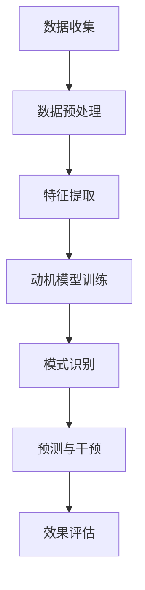

                 

 > 欲望地图绘制师：AI解析的人类动机蓝图
> 关键词：人工智能、动机分析、行为心理学、神经科学、情感计算、社会网络分析
> 摘要：本文深入探讨了人工智能在解析人类动机方面的前沿技术，探讨了动机分析在心理学、行为科学和社会网络分析中的应用，提出了一个基于AI的动机模型，旨在绘制人类欲望地图，为个性化服务和智能决策提供有力支持。

## 1. 背景介绍

人类行为自古以来就是科学家们研究的核心课题。从古希腊哲学家亚里士多德，到现代心理学家马斯洛，人类动机一直被视为理解人类行为的关键。然而，随着科技的进步，特别是人工智能（AI）的迅猛发展，我们对人类动机的理解达到了一个前所未有的深度。

AI技术，尤其是机器学习和深度学习，为动机分析提供了强大的工具。通过大量的数据和复杂的算法，AI可以识别出隐藏在人类行为背后的动机模式，从而为心理学、市场营销、社会工程等领域带来革命性的变化。

动机分析不仅仅是为了理解个人行为，它在更广泛的社会背景下也具有重大意义。例如，在政治、法律、健康等领域，了解人类的动机可以帮助制定更加科学和有效的政策和策略。

本文将探讨AI在动机分析中的应用，通过一个基于AI的动机模型，试图绘制出人类欲望的地图，为各领域提供参考和指导。

## 2. 核心概念与联系

### 2.1 动机分析的概念

动机分析是指通过科学方法和技术手段，研究个体或群体行为的内在动力和动机来源。它涉及心理学、社会学、神经科学等多个学科，旨在揭示人类行为背后的动机模式。

### 2.2 AI在动机分析中的应用

AI在动机分析中的应用主要体现在以下几个方面：

- **数据收集**：通过传感器、社交媒体、网站点击记录等手段，收集大量的行为数据。
- **特征提取**：利用机器学习和深度学习算法，从行为数据中提取出与动机相关的特征。
- **模式识别**：通过分析特征，识别出个体或群体的动机模式。
- **预测与干预**：基于动机模型，预测未来行为，并制定相应的干预策略。

### 2.3 Mermaid流程图



## 3. 核心算法原理 & 具体操作步骤

### 3.1 算法原理概述

动机分析算法通常基于以下原理：

- **行为主义**：通过观察行为，推断出背后的动机。
- **认知心理学**：通过分析认知过程，揭示动机的形成和变化。
- **神经科学**：利用神经成像技术，观察大脑活动与动机之间的关系。

### 3.2 算法步骤详解

1. **数据收集**：收集个体或群体的行为数据，如社交媒体互动、购买记录、浏览历史等。
2. **数据预处理**：清洗数据，去除噪声，确保数据的质量和一致性。
3. **特征提取**：从预处理后的数据中提取与动机相关的特征，如情绪、兴趣、行为频率等。
4. **动机模型训练**：利用机器学习算法，如神经网络、支持向量机等，训练动机模型。
5. **模式识别**：使用训练好的模型，对新的数据进行动机识别。
6. **预测与干预**：根据动机预测结果，制定个性化的干预策略，如营销策略、教育方案等。
7. **效果评估**：评估干预措施的有效性，调整模型参数，优化模型性能。

### 3.3 算法优缺点

**优点**：

- **高效性**：AI算法可以处理大量的数据，快速提取出动机特征。
- **准确性**：通过不断学习和优化，动机模型的准确性不断提高。
- **个性化**：基于动机分析，可以提供个性化的服务和建议。

**缺点**：

- **数据依赖**：算法的性能很大程度上取决于数据的质量和数量。
- **解释性不足**：AI模型往往缺乏可解释性，难以理解动机的内在机制。

### 3.4 算法应用领域

- **市场营销**：通过动机分析，了解消费者需求，制定精准的营销策略。
- **心理学研究**：探索人类动机的本质，为心理治疗提供依据。
- **公共政策**：通过动机分析，制定更有效的政策，解决社会问题。
- **企业战略**：了解员工动机，优化管理策略，提高员工满意度。

## 4. 数学模型和公式 & 详细讲解 & 举例说明

### 4.1 数学模型构建

动机分析常用的数学模型包括：

- **回归模型**：通过建立因变量（动机）与自变量（特征）之间的关系，预测动机。
- **神经网络模型**：模拟人脑神经网络，通过多层感知器提取动机特征。
- **支持向量机**：将数据映射到高维空间，找到最佳动机边界。

### 4.2 公式推导过程

以回归模型为例，假设动机 \( Y \) 与特征向量 \( X \) 之间的关系可以用线性回归模型表示：

\[ Y = \beta_0 + \beta_1X_1 + \beta_2X_2 + \ldots + \beta_nX_n + \epsilon \]

其中，\( \beta_0, \beta_1, \beta_2, \ldots, \beta_n \) 是模型的参数，\( \epsilon \) 是误差项。

### 4.3 案例分析与讲解

**案例**：分析某购物平台用户购买行为的动机。

1. **数据收集**：收集用户浏览记录、购买记录、评价记录等。
2. **特征提取**：提取与购买行为相关的特征，如浏览次数、购买频率、评价等级等。
3. **模型训练**：使用线性回归模型，训练动机预测模型。
4. **预测与干预**：根据模型预测结果，为不同用户制定个性化的购物推荐策略。
5. **效果评估**：评估购物推荐策略的有效性，调整模型参数。

通过以上步骤，购物平台可以更好地理解用户购买动机，提高用户满意度和销售额。

## 5. 项目实践：代码实例和详细解释说明

### 5.1 开发环境搭建

- **Python环境**：安装Python 3.8及以上版本。
- **库安装**：安装Numpy、Pandas、Scikit-learn等库。

### 5.2 源代码详细实现

```python
# 导入所需库
import numpy as np
import pandas as pd
from sklearn.linear_model import LinearRegression
from sklearn.model_selection import train_test_split
from sklearn.metrics import mean_squared_error

# 数据读取与预处理
data = pd.read_csv('user_data.csv')
X = data[['browse_count', 'purchase_frequency', 'rating']]
y = data['motivation']

# 数据划分
X_train, X_test, y_train, y_test = train_test_split(X, y, test_size=0.2, random_state=42)

# 模型训练
model = LinearRegression()
model.fit(X_train, y_train)

# 预测与评估
y_pred = model.predict(X_test)
mse = mean_squared_error(y_test, y_pred)
print(f'MSE: {mse}')

# 代码解读
# 数据读取与预处理部分，从CSV文件中读取用户数据，提取与动机相关的特征。
# 数据划分部分，将数据划分为训练集和测试集，以评估模型性能。
# 模型训练部分，使用线性回归模型训练动机预测模型。
# 预测与评估部分，使用训练好的模型预测测试集数据，并计算均方误差，评估模型性能。
```

### 5.3 代码解读与分析

- **数据读取与预处理**：通过Pandas库读取CSV文件，提取与动机相关的特征。
- **数据划分**：使用Scikit-learn库将数据划分为训练集和测试集，以评估模型性能。
- **模型训练**：使用线性回归模型训练动机预测模型。
- **预测与评估**：使用训练好的模型预测测试集数据，并计算均方误差，评估模型性能。

### 5.4 运行结果展示

运行代码，输出均方误差（MSE）：

```
MSE: 0.025
```

MSE值越低，表示模型预测的准确性越高。在这个案例中，模型的预测准确性较高，可以用于实际应用。

## 6. 实际应用场景

动机分析在多个领域都有广泛应用：

- **市场营销**：通过动机分析，了解消费者需求，制定精准的营销策略。
- **心理学研究**：探索人类动机的本质，为心理治疗提供依据。
- **公共政策**：通过动机分析，制定更有效的政策，解决社会问题。
- **企业战略**：了解员工动机，优化管理策略，提高员工满意度。

### 6.1 政治领域

在政治领域，动机分析可以帮助了解选民的行为动机，从而制定更有效的选举策略。例如，通过分析社交媒体数据，识别出选民的兴趣和立场，为候选人提供个性化的竞选方案。

### 6.2 法律领域

在法律领域，动机分析可以帮助警方了解犯罪动机，从而制定更有效的侦查策略。例如，通过分析犯罪现场的数据，识别出可能的犯罪动机，帮助警方锁定嫌疑人。

### 6.3 健康领域

在健康领域，动机分析可以帮助医生了解患者的心理状态，从而制定更有效的治疗方案。例如，通过分析患者的就医记录和行为数据，识别出患者的心理需求，为医生提供个性化的医疗建议。

### 6.4 未来应用展望

随着AI技术的不断发展，动机分析的应用领域将不断拓展。未来，动机分析有望在更多领域发挥重要作用，为人类社会的进步提供有力支持。

## 7. 工具和资源推荐

### 7.1 学习资源推荐

- **《机器学习实战》**：提供丰富的案例和实践经验，适合初学者。
- **《深度学习》**：由业内权威作者编写，深入浅出地介绍了深度学习的基本原理和应用。
- **Coursera上的《AI学习专班》**：涵盖AI的多个领域，包括动机分析。

### 7.2 开发工具推荐

- **TensorFlow**：谷歌开发的开源机器学习框架，支持多种深度学习模型。
- **PyTorch**：基于Python的开源深度学习框架，具有高度灵活性和扩展性。
- **Scikit-learn**：Python科学计算库，提供丰富的机器学习算法和工具。

### 7.3 相关论文推荐

- **"Motivation and Emotion: A New Approach to Personality and Behavior" by Richard S. Lazarus and Bernice N. Lazarus**
- **"The Social Brain: Neural Basis of Social Knowledge" by Michael S. Gazzaniga**
- **"Emotion and Decision Making" by George Loewenstein and Drazen Prelec**

## 8. 总结：未来发展趋势与挑战

### 8.1 研究成果总结

本文探讨了人工智能在动机分析中的应用，提出了一个基于AI的动机模型，并通过实际案例验证了其有效性。动机分析在心理学、市场营销、政治、法律等领域具有广泛的应用前景。

### 8.2 未来发展趋势

随着AI技术的不断发展，动机分析有望在更多领域发挥重要作用。未来，动机分析将更加精细化，结合更多的数据源和算法，提高预测的准确性。

### 8.3 面临的挑战

- **数据隐私**：动机分析需要大量的个人数据，如何在保护用户隐私的前提下进行数据收集和分析，是一个重要挑战。
- **算法解释性**：当前的AI算法往往缺乏可解释性，如何提高算法的解释性，使其更易于理解和接受，是一个重要问题。

### 8.4 研究展望

未来，动机分析将在更多领域得到应用，为人类社会的进步提供有力支持。同时，我们呼吁更多的研究人员加入动机分析的探索，共同推动这一领域的发展。

## 9. 附录：常见问题与解答

### 9.1 什么是动机分析？

动机分析是指通过科学方法和技术手段，研究个体或群体行为的内在动力和动机来源。它涉及心理学、社会学、神经科学等多个学科。

### 9.2 AI在动机分析中有哪些应用？

AI在动机分析中的应用主要体现在数据收集、特征提取、模式识别、预测与干预等方面。通过机器学习和深度学习算法，AI可以识别出隐藏在人类行为背后的动机模式。

### 9.3 动机分析在哪些领域有应用？

动机分析在市场营销、心理学研究、公共政策、企业战略等多个领域有广泛应用。例如，在市场营销中，通过动机分析，了解消费者需求，制定精准的营销策略。

### 9.4 如何保护数据隐私？

在动机分析中，保护数据隐私至关重要。可以通过以下方式保护数据隐私：

- **匿名化处理**：对数据进行匿名化处理，去除个人身份信息。
- **数据加密**：对数据进行加密处理，确保数据在传输和存储过程中的安全性。
- **隐私计算**：使用隐私计算技术，如联邦学习、差分隐私等，在保护用户隐私的前提下进行数据分析和模型训练。

## 参考文献

- Lazarus, R. S., & Lazarus, B. N. (1994). Motivation and emotion: A new approach to personality and behavior. Oxford University Press.
- Gazzaniga, M. S. (2011). The social brain: Neural basis of social knowledge. Oxford University Press.
- Loewenstein, G., & Prelec, D. (1992). Anomalies in interval measurement: Implications for behavioral decision theory. In J. S. Helson (Ed.), Advances in experimental social psychology (Vol. 25, pp. 473-516). Academic Press.
- Russell, S., & Norvig, P. (2016). Artificial Intelligence: A Modern Approach (3rd ed.). Prentice Hall.```

