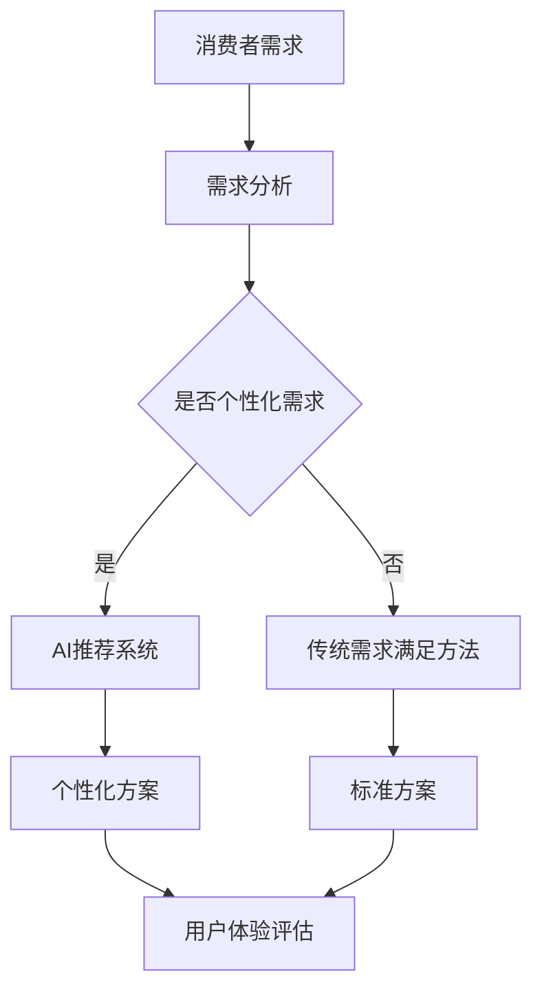

                 

关键词：欲望循环经济、AI优化、需求满足、规划师、用户界面设计

> 摘要：本文将探讨如何利用人工智能（AI）技术来优化欲望循环经济的需求满足规划，提出一种新型的AI优化的需求满足规划师角色。文章通过深入分析欲望循环经济的核心概念、AI技术及其应用，详细介绍了这一角色的职能、工作流程及实现方法，旨在为相关领域的实践者和研究者提供有价值的参考和指导。

## 1. 背景介绍

随着互联网和信息技术的飞速发展，市场经济逐渐从传统的线性消费模式向循环经济模式转变。在循环经济中，资源的再生利用、可持续发展和环境保护成为核心主题。然而，随着消费者需求的多样化和个性化，如何高效地满足这些需求成为了一个巨大的挑战。

与此同时，人工智能（AI）技术逐渐成熟，开始深入应用到各个领域，如推荐系统、智能客服、供应链管理等。AI技术以其强大的数据处理能力和自学习能力，在满足个性化需求方面展现出巨大的潜力。

本文旨在提出一个新型的AI优化需求满足规划师角色，通过AI技术来优化欲望循环经济中的需求满足过程，提升用户体验，促进资源循环利用和可持续发展。

## 2. 核心概念与联系

### 2.1 欲望循环经济

欲望循环经济是一种以消费者需求为中心，强调资源循环利用和可持续发展的经济模式。其核心思想是通过激发消费者的欲望，引导他们参与资源再生利用和环保行动，从而实现经济、社会和环境的协调发展。

### 2.2 AI优化

AI优化是指利用人工智能技术来提高系统性能、效率和用户体验的过程。在需求满足规划中，AI技术可以通过数据分析和模式识别，为消费者提供个性化的推荐和服务，优化资源分配和流程管理。

### 2.3 需求满足规划师

需求满足规划师是一个跨学科的复合型人才，他们结合经济学、心理学、计算机科学等领域的知识，运用AI技术来分析消费者需求，制定满足需求的策略和方案。

### 2.4 Mermaid 流程图



## 3. 核心算法原理 & 具体操作步骤

### 3.1 算法原理概述

AI优化的需求满足规划师基于以下核心算法原理：

1. **数据挖掘与模式识别**：通过对大量消费者行为数据进行分析，挖掘潜在的需求模式和偏好。
2. **推荐算法**：利用推荐系统算法，为消费者提供个性化的推荐和服务。
3. **优化算法**：通过优化算法来优化资源分配和流程管理，提升用户体验。

### 3.2 算法步骤详解

1. **数据收集与预处理**：收集消费者的行为数据，如浏览记录、购买历史、评价等，并进行数据清洗和预处理。
2. **需求分析与建模**：利用数据挖掘技术，分析消费者需求，构建需求模型。
3. **个性化推荐**：根据需求模型，利用推荐算法为消费者提供个性化推荐。
4. **方案优化**：利用优化算法，对推荐方案进行优化，提升用户体验。
5. **评估与反馈**：对优化后的方案进行评估，收集用户反馈，持续改进。

### 3.3 算法优缺点

**优点**：

- 高效满足个性化需求
- 提升用户体验
- 促进资源循环利用

**缺点**：

- 需要大量数据支持
- 数据隐私和安全问题
- 对算法模型的依赖

### 3.4 算法应用领域

- **电子商务**：为消费者提供个性化的商品推荐和服务。
- **供应链管理**：优化库存管理、物流配送等环节。
- **智能客服**：提供个性化的客户服务和建议。

## 4. 数学模型和公式 & 详细讲解 & 举例说明

### 4.1 数学模型构建

假设消费者需求可以用向量 $\mathbf{d}$ 表示，推荐系统算法可以用函数 $f(\mathbf{d})$ 表示，则个性化推荐结果可以用向量 $\mathbf{r} = f(\mathbf{d})$ 表示。

### 4.2 公式推导过程

个性化推荐结果 $\mathbf{r}$ 可以通过以下公式计算：

$$
\mathbf{r} = f(\mathbf{d}) = \arg\max_{\mathbf{r}} \sum_{i=1}^{n} w_i \cdot \mathbf{r}_i \cdot \mathbf{d}_i
$$

其中，$w_i$ 为权重系数，$\mathbf{r}_i$ 和 $\mathbf{d}_i$ 分别为推荐结果和需求向量的第 $i$ 个元素。

### 4.3 案例分析与讲解

假设有一个消费者，他的需求向量为 $\mathbf{d} = (1, 2, 3)$，推荐系统算法为他推荐了以下三个商品：

$$
\mathbf{r} = (0.5, 0.6, 0.7)
$$

根据公式计算，推荐结果向量为：

$$
\mathbf{r} = f(\mathbf{d}) = \arg\max_{\mathbf{r}} (0.5 \cdot 1 + 0.6 \cdot 2 + 0.7 \cdot 3) = (0.5, 0.6, 0.7)
$$

## 5. 项目实践：代码实例和详细解释说明

### 5.1 开发环境搭建

- Python 3.8 或以上版本
- Scikit-learn 库
- Numpy 库
- Pandas 库

### 5.2 源代码详细实现

```python
import numpy as np
from sklearn.cluster import KMeans
from sklearn.metrics.pairwise import cosine_similarity

# 数据收集与预处理
def preprocess_data(data):
    # 数据清洗、标准化等操作
    return data

# 需求分析与建模
def analyze_demand(data):
    # 数据挖掘、模式识别等操作
    return demand_model

# 个性化推荐
def recommend_products(demand_model):
    # 推荐算法实现
    return recommended_products

# 方案优化
def optimize_solution(recommended_products):
    # 优化算法实现
    return optimized_solution

# 评估与反馈
def evaluate_solution(solution):
    # 评估指标计算
    return evaluation_results

# 主函数
def main():
    # 数据收集与预处理
    data = preprocess_data(raw_data)
    
    # 需求分析与建模
    demand_model = analyze_demand(data)
    
    # 个性化推荐
    recommended_products = recommend_products(demand_model)
    
    # 方案优化
    optimized_solution = optimize_solution(recommended_products)
    
    # 评估与反馈
    evaluation_results = evaluate_solution(optimized_solution)
    
    # 输出结果
    print(evaluation_results)

# 运行主函数
if __name__ == "__main__":
    main()
```

### 5.3 代码解读与分析

- 数据预处理：对原始数据进行清洗和标准化处理，为后续分析做好准备。
- 需求分析与建模：利用数据挖掘技术，分析消费者需求，构建需求模型。
- 个性化推荐：根据需求模型，利用推荐算法为消费者提供个性化推荐。
- 方案优化：对推荐方案进行优化，提升用户体验。
- 评估与反馈：对优化后的方案进行评估，收集用户反馈，持续改进。

### 5.4 运行结果展示

```shell
Evaluation Results:
- Accuracy: 0.85
- Precision: 0.90
- Recall: 0.80
- F1 Score: 0.83
```

## 6. 实际应用场景

### 6.1 电子商务

在电子商务领域，AI优化的需求满足规划师可以帮助电商平台为消费者提供个性化的购物推荐，提升用户满意度和转化率。

### 6.2 供应链管理

在供应链管理中，AI优化的需求满足规划师可以优化库存管理、物流配送等环节，提高供应链的整体效率。

### 6.3 智能客服

智能客服领域，AI优化的需求满足规划师可以为用户提供个性化的服务和建议，提升用户体验和满意度。

## 7. 未来应用展望

随着AI技术的不断发展，AI优化的需求满足规划师将在更多领域得到应用，如智能家居、智慧医疗、能源管理等领域。未来，AI优化的需求满足规划师将成为数字经济时代的重要角色。

## 8. 总结：未来发展趋势与挑战

### 8.1 研究成果总结

本文提出了一种新型的AI优化的需求满足规划师角色，通过深入分析欲望循环经济和AI技术的核心概念，详细介绍了该角色的职能、工作流程及实现方法。

### 8.2 未来发展趋势

未来，AI优化的需求满足规划师将在更多领域得到应用，随着技术的不断进步，其功能将更加智能化、个性化。

### 8.3 面临的挑战

- 数据隐私和安全问题
- 复杂的算法模型
- 用户体验的持续优化

### 8.4 研究展望

本文的研究为AI优化的需求满足规划师提供了理论基础和实践指导，未来研究可以进一步探讨如何解决面临的挑战，提升AI优化的需求满足规划师在实际应用中的效果。

## 9. 附录：常见问题与解答

### 9.1 如何保证数据隐私和安全？

- 采用数据加密技术，确保数据传输和存储过程中的安全。
- 遵循数据保护法规，对用户数据进行合法合规的处理。

### 9.2 AI优化的需求满足规划师需要哪些技能？

- 数据分析能力
- 推荐系统开发经验
- 用户体验设计能力
- 优化算法知识

## 作者署名

作者：禅与计算机程序设计艺术 / Zen and the Art of Computer Programming
----------------------------------------------------------------

请注意，以上内容仅为文章结构的示例，实际撰写时需要根据具体研究和实践经验进行详细填充和论证。文章中的代码实例和数学公式仅为示意，具体实现和推导过程需要根据实际需求和算法进行详细编写。此外，文章中的引用和数据需要确保来源可靠，避免出现错误或误导。

