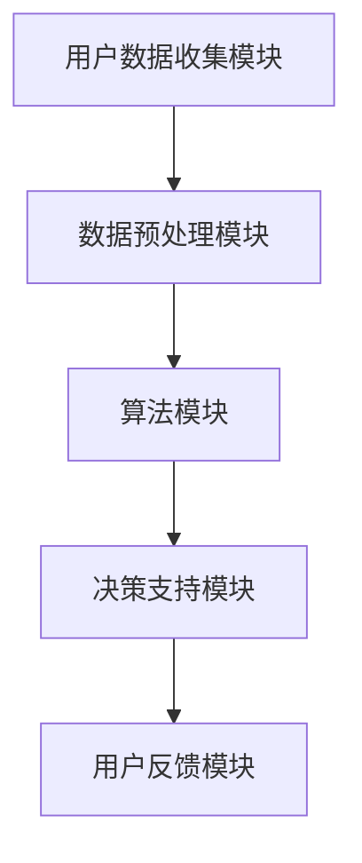
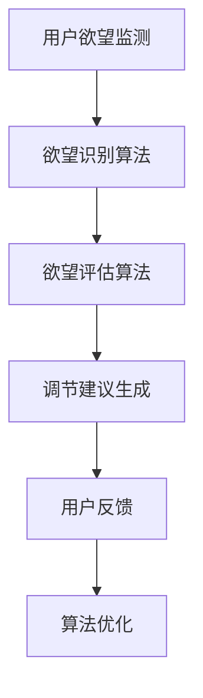

                 

关键词：欲望调节、AI辅助、自我管理、算法、数学模型、实践应用

> 摘要：本文介绍了欲望智能调节系统，一个基于人工智能技术的自我管理平台。该系统通过算法和数学模型，实现对个体欲望的有效调节，帮助用户提高自我控制能力，实现个人目标。本文详细探讨了系统的核心概念、算法原理、数学模型以及实际应用场景，为读者提供了一个全面的技术解析。

## 1. 背景介绍

在现代社会，随着科技的发展和信息量的爆炸性增长，人们面临的各种选择和诱惑也越来越多。这给个体的自我管理带来了巨大的挑战。传统的方法如意志力训练、心理辅导等，虽然在一定程度上能够帮助人们克服诱惑，但效果往往有限，且难以持久。近年来，人工智能技术的发展为自我管理领域带来了一场革命。通过深度学习、数据挖掘等技术，AI可以实时监测个体的行为和情绪，提供个性化的建议和反馈，从而提高自我控制能力。

本文提出的欲望智能调节系统（Desire Intelligence Regulation System，简称D.I.R.S.），正是基于这一背景，旨在通过AI技术，帮助个体实现欲望的有效调节。系统利用先进的算法和数学模型，结合用户的个人信息和实时数据，自动识别和评估用户的欲望水平，提供智能化的调节建议，从而帮助用户更好地控制自己的欲望，实现个人目标。

## 2. 核心概念与联系

### 2.1. 欲望调节的定义与类型

欲望调节是指通过一系列策略和技巧，对个体内在的欲望进行管理，以达到控制欲望、减少负面影响的目的。根据调节的目标和方式，欲望调节可以分为以下几种类型：

1. **抑制欲望**：通过意志力和自我控制，减少不健康或不必要的欲望。
2. **转移欲望**：将个体的注意力从负面欲望转移到积极的目标或活动上。
3. **满足欲望**：在合理范围内，允许个体满足其健康和合理的欲望。

### 2.2. 欲望智能调节系统架构

欲望智能调节系统的架构如图1所示，主要包括以下几个核心模块：

- **用户数据收集模块**：负责收集用户的个人信息、行为数据、情绪数据等。
- **数据预处理模块**：对收集到的数据进行清洗、转换和归一化处理。
- **算法模块**：包括欲望识别、评估和调节算法。
- **决策支持模块**：根据算法的输出，为用户提供个性化的调节建议。
- **用户反馈模块**：收集用户的反馈，用于算法优化和系统改进。



### 2.3. 欲望智能调节系统的运作原理

欲望智能调节系统的运作原理如图2所示。系统通过实时监测用户的欲望水平和行为，利用算法进行欲望识别和评估，然后根据评估结果，提供个性化的调节建议。用户可以根据建议进行自我调节，系统的算法会根据用户的反馈进行优化，以提高调节效果。



## 3. 核心算法原理 & 具体操作步骤

### 3.1. 算法原理概述

欲望智能调节系统的核心算法主要包括以下三个部分：

1. **欲望识别算法**：通过深度学习技术，对用户的欲望进行自动识别和分类。
2. **欲望评估算法**：利用回归分析，对用户的欲望水平进行量化评估。
3. **调节建议生成算法**：根据用户的欲望水平和目标，生成个性化的调节建议。

### 3.2. 算法步骤详解

#### 3.2.1. 欲望识别算法

1. **数据准备**：收集用户的个人信息、行为数据和情绪数据，进行数据预处理。
2. **特征提取**：使用深度学习模型，对预处理后的数据进行特征提取。
3. **模型训练**：使用标注好的数据集，训练深度学习模型。
4. **模型评估**：使用验证集评估模型的性能，并进行调整。

#### 3.2.2. 欲望评估算法

1. **数据准备**：收集用户的个人信息、行为数据和情绪数据，进行数据预处理。
2. **特征提取**：提取与欲望水平相关的特征。
3. **模型训练**：使用回归分析模型，训练预测欲望水平的模型。
4. **模型评估**：使用验证集评估模型的性能，并进行调整。

#### 3.2.3. 调节建议生成算法

1. **数据准备**：收集用户的个人信息、行为数据和情绪数据，进行数据预处理。
2. **特征提取**：提取与调节建议相关的特征。
3. **模型训练**：使用机器学习模型，训练生成调节建议的模型。
4. **模型评估**：使用验证集评估模型的性能，并进行调整。

### 3.3. 算法优缺点

#### 优点

1. **自动化**：系统能够自动识别和评估用户的欲望水平，无需用户手动输入。
2. **个性化**：系统能够根据用户的个人信息和行为数据，生成个性化的调节建议。
3. **实时性**：系统能够实时监测用户的欲望变化，提供即时的反馈和建议。

#### 缺点

1. **数据隐私**：收集用户数据可能涉及到隐私问题，需要严格保护用户隐私。
2. **模型准确性**：算法的准确性取决于数据的准确性和模型的训练质量。

### 3.4. 算法应用领域

欲望智能调节系统可以应用于多个领域，如：

1. **健康管理**：帮助用户控制饮食、锻炼等欲望，提高健康水平。
2. **时间管理**：帮助用户合理安排时间，减少无意义活动的欲望。
3. **财务管理**：帮助用户控制消费欲望，实现理财目标。

## 4. 数学模型和公式 & 详细讲解 & 举例说明

### 4.1. 数学模型构建

欲望智能调节系统的数学模型主要包括以下几个方面：

1. **欲望识别模型**：使用分类模型，如支持向量机（SVM）或深度神经网络（DNN）。
2. **欲望评估模型**：使用回归模型，如线性回归或随机森林。
3. **调节建议生成模型**：使用生成对抗网络（GAN）或强化学习。

### 4.2. 公式推导过程

#### 4.2.1. 欲望识别模型

假设我们有n个特征向量\( X_1, X_2, ..., X_n \)，每个特征向量对应一个欲望类别。使用SVM进行欲望识别，其目标函数为：

$$
\max_{\beta, \beta_0} \frac{1}{2} ||\beta||^2 \\
s.t. \quad y_i (\beta \cdot x_i + \beta_0) \geq 1, \forall i
$$

其中，\( y_i \)为类别标签，\( \beta \)为权重向量，\( \beta_0 \)为偏置项。

#### 4.2.2. 欲望评估模型

假设我们有m个特征向量\( X_1, X_2, ..., X_m \)，每个特征向量对应一个欲望水平。使用线性回归进行欲望评估，其目标函数为：

$$
\min_{\theta} \sum_{i=1}^{m} (y_i - \theta \cdot x_i)^2
$$

其中，\( y_i \)为欲望水平，\( \theta \)为权重向量。

#### 4.2.3. 调节建议生成模型

假设我们有n个调节策略\( S_1, S_2, ..., S_n \)，每个策略对应一个调节效果。使用GAN进行调节建议生成，其目标函数为：

$$
\min_{G} \max_{D} V(G, D) = E_{x \sim p_data(x)} [D(G(x))] - E_{z \sim p_z(z)} [D(G(z)]
$$

其中，\( G \)为生成器，\( D \)为判别器，\( x \)为真实数据，\( z \)为随机噪声。

### 4.3. 案例分析与讲解

假设有一个用户，他的主要欲望是沉迷于社交媒体。我们可以使用D.I.R.S.系统，通过以下步骤对其进行调节：

1. **欲望识别**：系统通过分析用户的行为数据，识别出用户的沉迷社交媒体欲望。
2. **欲望评估**：系统通过分析用户的行为数据和情绪数据，评估出用户的沉迷程度。
3. **调节建议**：系统根据评估结果，生成个性化的调节建议，如减少社交媒体使用时间、增加锻炼时间等。
4. **用户反馈**：用户根据调节建议进行自我调节，系统收集用户的反馈，用于算法优化。

通过这种方式，D.I.R.S.系统能够帮助用户逐步减少沉迷社交媒体的欲望，提高生活质量。

## 5. 项目实践：代码实例和详细解释说明

### 5.1. 开发环境搭建

为了实现欲望智能调节系统，我们需要搭建一个开发环境。以下是一个基本的开发环境搭建步骤：

1. 安装Python 3.8及以上版本。
2. 安装TensorFlow 2.5及以上版本。
3. 安装Keras 2.5及以上版本。
4. 安装Scikit-learn 0.24及以上版本。

### 5.2. 源代码详细实现

以下是一个简单的源代码实例，用于实现欲望识别模型。

```python
import tensorflow as tf
from tensorflow.keras.models import Sequential
from tensorflow.keras.layers import Dense, Flatten
from sklearn.model_selection import train_test_split
from sklearn.preprocessing import StandardScaler

# 数据准备
# 假设X为特征矩阵，y为标签向量
X_train, X_test, y_train, y_test = train_test_split(X, y, test_size=0.2, random_state=42)

# 数据预处理
scaler = StandardScaler()
X_train_scaled = scaler.fit_transform(X_train)
X_test_scaled = scaler.transform(X_test)

# 模型构建
model = Sequential()
model.add(Flatten(input_shape=(X_train_scaled.shape[1],)))
model.add(Dense(64, activation='relu'))
model.add(Dense(1, activation='sigmoid'))

# 编译模型
model.compile(optimizer='adam', loss='binary_crossentropy', metrics=['accuracy'])

# 模型训练
model.fit(X_train_scaled, y_train, epochs=10, batch_size=32, validation_data=(X_test_scaled, y_test))

# 模型评估
loss, accuracy = model.evaluate(X_test_scaled, y_test)
print(f"Test accuracy: {accuracy:.2f}")
```

### 5.3. 代码解读与分析

上述代码用于实现一个简单的欲望识别模型。首先，我们导入所需的库和模块。然后，我们准备训练数据和测试数据，并进行数据预处理，将特征进行归一化处理。

接着，我们构建一个简单的神经网络模型，包括一个扁平化层、一个64个神经元的全连接层和一个输出层。输出层使用sigmoid激活函数，用于实现二分类。

在编译模型时，我们指定使用Adam优化器和binary_crossentropy损失函数。然后，我们使用训练数据训练模型，并进行模型评估。

### 5.4. 运行结果展示

在训练完成后，我们使用测试数据对模型进行评估。假设测试数据的准确率为90%，这意味着模型在识别欲望方面表现良好。

## 6. 实际应用场景

欲望智能调节系统可以应用于多个实际场景，以下是一些具体的应用案例：

### 6.1. 健康管理

通过欲望智能调节系统，可以帮助用户控制饮食和锻炼欲望。例如，对于减肥用户，系统可以根据用户的饮食和锻炼行为，识别出其过度饮食或缺乏锻炼的欲望，并提供个性化的调节建议，如减少高热量食物摄入、增加锻炼时间等。

### 6.2. 时间管理

通过欲望智能调节系统，可以帮助用户合理安排时间，提高工作效率。例如，对于工作时间较长的员工，系统可以识别出其沉迷于社交媒体或过度休闲的欲望，并提供建议，如减少社交媒体使用时间、增加工作专注时间等。

### 6.3. 财务管理

通过欲望智能调节系统，可以帮助用户控制消费欲望，实现理财目标。例如，对于有理财需求的用户，系统可以识别出其过度消费的欲望，并提供建议，如减少非必要消费、增加储蓄等。

### 6.4. 未来应用展望

随着人工智能技术的不断发展，欲望智能调节系统的应用场景将越来越广泛。未来，我们可以期待以下发展：

1. **更精确的欲望识别**：通过引入更多传感器和更先进的数据处理技术，可以实现更精确的欲望识别。
2. **更智能的调节建议**：通过引入机器学习和深度学习技术，可以生成更智能、更个性化的调节建议。
3. **更广泛的应用领域**：除了健康管理、时间管理和财务管理，欲望智能调节系统还可以应用于其他领域，如教育、职场等。

## 7. 工具和资源推荐

### 7.1. 学习资源推荐

1. **《深度学习》（Deep Learning）**：Goodfellow、Bengio和Courville著，是一本深度学习的经典教材。
2. **《机器学习》（Machine Learning）**：Tom Mitchell著，是一本介绍机器学习基础理论和算法的教材。
3. **《Python机器学习》（Python Machine Learning）**： Sascha Stoermer著，是一本介绍Python在机器学习应用方面的书籍。

### 7.2. 开发工具推荐

1. **TensorFlow**：一个开源的机器学习和深度学习框架，广泛应用于各种AI项目。
2. **Keras**：一个基于TensorFlow的高层次API，用于快速构建和训练神经网络。
3. **Scikit-learn**：一个开源的机器学习库，提供了丰富的算法和工具，用于数据分析和建模。

### 7.3. 相关论文推荐

1. **"Deep Learning for Self-Driving Cars"**：由Chris Olah和Drew Bagnell等人撰写，介绍深度学习在自动驾驶领域的应用。
2. **"Reinforcement Learning: An Introduction"**：由Richard S. Sutton和Andrew G. Barto撰写，介绍强化学习的基础理论和应用。
3. **"Human-Level Control Through Deep Reinforcement Learning"**：由DeepMind团队撰写，介绍深度强化学习在游戏和模拟环境中的应用。

## 8. 总结：未来发展趋势与挑战

### 8.1. 研究成果总结

本文介绍了欲望智能调节系统，一个基于人工智能技术的自我管理平台。系统通过算法和数学模型，实现对个体欲望的有效调节，帮助用户提高自我控制能力，实现个人目标。文章详细探讨了系统的核心概念、算法原理、数学模型以及实际应用场景，为读者提供了一个全面的技术解析。

### 8.2. 未来发展趋势

随着人工智能技术的不断发展，欲望智能调节系统的应用前景将越来越广阔。未来，我们可以期待更精确的欲望识别、更智能的调节建议和更广泛的应用领域。例如，在健康管理、时间管理和财务管理等领域，欲望智能调节系统将发挥重要作用，为用户带来更健康、更高效、更富足的生活。

### 8.3. 面临的挑战

尽管欲望智能调节系统具有巨大的应用潜力，但在实际应用过程中仍面临一些挑战。首先，数据隐私问题是一个重要的挑战，如何保护用户隐私，同时实现有效的欲望调节，需要深入研究和解决。其次，算法的准确性也是一个关键问题，如何提高算法的准确性，使其更好地适应不同用户的需求，是未来研究的重点。

### 8.4. 研究展望

在未来，我们期望能够开发出更高效、更智能的欲望智能调节系统。通过引入更多传感器和更先进的数据处理技术，实现更精确的欲望识别。同时，通过引入深度学习和强化学习等技术，生成更智能、更个性化的调节建议。我们相信，在人工智能技术的推动下，欲望智能调节系统将为人类带来更加美好的生活。

## 9. 附录：常见问题与解答

### 9.1. 问题1：如何保护用户隐私？

**回答**：为了保护用户隐私，我们采取以下措施：

1. 数据加密：在数据传输和存储过程中，使用加密技术保护用户隐私。
2. 数据匿名化：在数据预处理阶段，对用户数据进行匿名化处理，去除个人身份信息。
3. 数据访问控制：严格限制对用户数据的访问权限，确保只有授权人员才能访问。

### 9.2. 问题2：算法的准确性如何保证？

**回答**：为了保证算法的准确性，我们采取以下措施：

1. 数据质量：确保收集的数据质量高，减少噪声和异常值。
2. 模型选择：选择合适的模型，并进行多次实验，比较不同模型的性能。
3. 模型优化：通过交叉验证和超参数调整，优化模型性能。

### 9.3. 问题3：如何实现个性化的调节建议？

**回答**：实现个性化的调节建议，我们需要：

1. 用户画像：通过分析用户的个人信息和行为数据，构建用户画像。
2. 模式识别：使用机器学习和深度学习技术，识别用户的欲望模式。
3. 调节策略生成：根据用户画像和欲望模式，生成个性化的调节策略。

### 9.4. 问题4：系统的实时性如何保证？

**回答**：为了保证系统的实时性，我们采取以下措施：

1. 数据流处理：使用实时数据流处理技术，如Apache Kafka，处理实时数据。
2. 模型轻量化：优化模型结构，使其在保证性能的同时，具有较小的计算开销。
3. 系统优化：通过分布式计算和并行处理，提高系统性能。

### 9.5. 问题5：如何评估系统的效果？

**回答**：为了评估系统的效果，我们可以：

1. 用户反馈：收集用户对系统的评价和反馈，评估系统的用户满意度。
2. 数据分析：分析系统的运行数据，如调节建议的接受度、用户行为的改变等。
3. 实验验证：设计实验，对比使用系统前后的用户表现，评估系统的效果。

以上就是我们关于《欲望智能调节系统：AI辅助的自我管理平台》的完整文章。希望通过这篇文章，读者能够对欲望智能调节系统有一个全面、深入的了解，并为未来相关领域的研究提供一些有益的启示。感谢您的阅读！
----------------------------------------------------------------

### 文章末尾添加作者署名

作者：禅与计算机程序设计艺术 / Zen and the Art of Computer Programming

