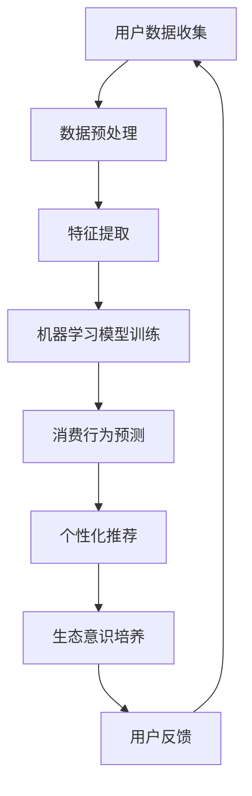
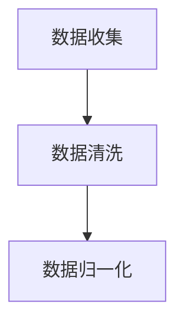
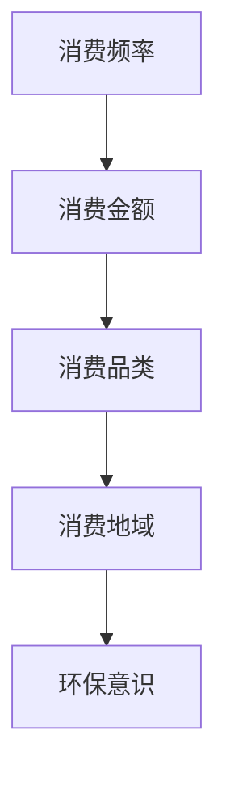
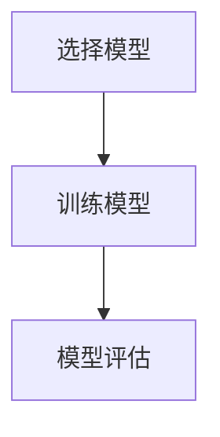
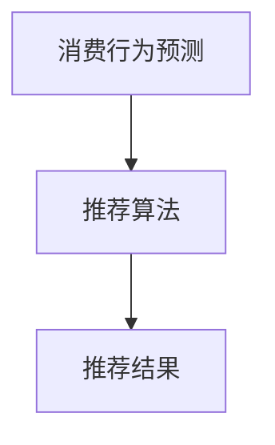
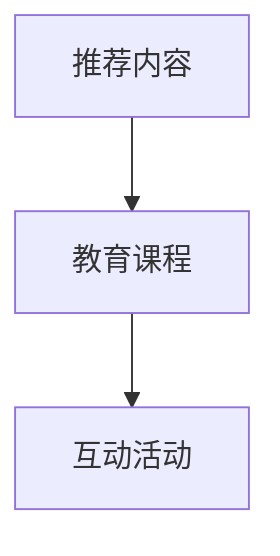
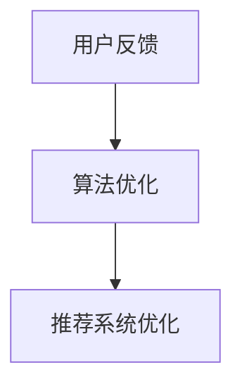

                 

关键词：AI，可持续消费，生态意识，教育，算法，实践，未来展望

> 摘要：本文探讨了如何在当前社会背景下，通过人工智能技术推动可持续消费教育的发展。我们提出了一种新型的教育模式，借助AI算法，培养个体的生态意识，促进绿色消费，从而为建设一个更加可持续的未来做出贡献。

## 1. 背景介绍

在全球化进程中，消费主义文化愈发盛行，然而，过度消费和资源浪费给地球带来了巨大的负担。气候变化、生物多样性丧失和环境污染等问题日益严重，迫切需要我们重新审视消费行为与生态保护之间的关系。

随着人工智能技术的飞速发展，AI在各个领域的应用逐渐深入，特别是在教育领域的潜力被广泛认可。AI可以通过数据分析、个性化推荐和智能互动等功能，提高教育质量和效率。因此，本文试图探讨如何利用AI技术，培养公众的生态意识，推动可持续消费。

## 2. 核心概念与联系

### 2.1 AI驱动的可持续消费教育

AI驱动的可持续消费教育是一种利用人工智能技术，通过数据分析和个性化推荐，引导个体形成绿色消费习惯的教育模式。其核心概念包括：

- **数据驱动**：通过收集和分析个体消费行为数据，了解其消费偏好和习惯。
- **个性化推荐**：基于数据分析结果，为个体提供个性化的绿色消费建议。
- **生态意识培养**：通过教育内容和互动，提高个体对生态保护的认知。

### 2.2 AI算法原理

AI驱动的可持续消费教育依赖于多种AI算法，主要包括：

- **机器学习**：通过历史数据训练模型，预测个体未来的消费行为。
- **自然语言处理**：分析文本数据，提取关键信息，用于个性化推荐。
- **强化学习**：通过不断试错，优化个体的消费决策过程。

### 2.3 Mermaid 流程图

下面是AI驱动的可持续消费教育的Mermaid流程图：



## 3. 核心算法原理 & 具体操作步骤

### 3.1 算法原理概述

AI驱动的可持续消费教育算法主要包括以下几个步骤：

1. **数据收集与预处理**：收集用户消费行为数据，并进行预处理，如数据清洗、归一化等。
2. **特征提取**：从预处理后的数据中提取关键特征，为后续的机器学习模型训练提供输入。
3. **机器学习模型训练**：利用历史数据训练机器学习模型，以预测用户的未来消费行为。
4. **个性化推荐**：基于模型预测结果，为用户推荐绿色消费产品或服务。
5. **生态意识培养**：通过推荐内容、教育课程等，提高用户的生态意识。
6. **用户反馈**：收集用户对推荐内容的反馈，用于优化算法和推荐系统。

### 3.2 算法步骤详解

1. **数据收集与预处理**：
   - 数据来源：社交媒体、电商平台、问卷调查等。
   - 数据预处理：数据清洗、归一化、去重等。

2. **特征提取**：
   - 特征类型：消费频率、消费金额、消费品类、消费地域等。
   - 特征选择：利用统计方法或机器学习算法选择重要特征。

3. **机器学习模型训练**：
   - 模型类型：决策树、支持向量机、神经网络等。
   - 模型训练：利用历史数据训练模型，评估模型性能。

4. **个性化推荐**：
   - 推荐算法：协同过滤、基于内容的推荐、混合推荐等。
   - 推荐内容：绿色消费产品、环保教育课程、环保活动等。

5. **生态意识培养**：
   - 教育内容：环保知识、绿色生活方式、可持续消费理念等。
   - 教育形式：图文、视频、直播、互动游戏等。

6. **用户反馈**：
   - 反馈机制：用户评分、评论、行为数据等。
   - 反馈处理：优化算法、调整推荐策略。

### 3.3 算法优缺点

#### 优点

- **个性化**：根据用户的消费行为和偏好，提供个性化的绿色消费推荐。
- **高效**：利用机器学习和大数据分析技术，提高推荐效率和准确性。
- **互动性**：通过互动教育形式，提高用户的生态意识。

#### 缺点

- **数据隐私**：用户数据的安全性和隐私保护需要得到充分考虑。
- **算法偏见**：算法可能存在偏见，导致推荐内容不够公平和公正。
- **资源消耗**：算法训练和推荐过程需要大量的计算资源和能源。

### 3.4 算法应用领域

- **消费教育**：通过个性化推荐和互动教育，提高公众的生态意识。
- **产品推荐**：为绿色消费产品提供精准推荐，促进可持续发展。
- **市场研究**：分析消费者行为，为政策制定和企业战略提供依据。

## 4. 数学模型和公式 & 详细讲解 & 举例说明

### 4.1 数学模型构建

AI驱动的可持续消费教育涉及到多个数学模型，主要包括：

- **消费行为预测模型**：利用时间序列分析和回归分析等方法，预测用户的未来消费行为。
- **个性化推荐模型**：利用协同过滤和基于内容的推荐算法，为用户推荐绿色消费产品。

### 4.2 公式推导过程

假设我们有一个包含n个用户的消费行为数据集，每个用户有m个特征。我们首先对数据进行归一化处理，然后利用线性回归模型预测用户的消费行为。

- **归一化公式**：$X_{\text{norm}} = \frac{X - \mu}{\sigma}$
- **线性回归公式**：$y = \beta_0 + \beta_1 x_1 + \beta_2 x_2 + ... + \beta_m x_m$

其中，$y$为预测的消费行为，$x_1, x_2, ..., x_m$为用户特征，$\beta_0, \beta_1, ..., \beta_m$为回归系数。

### 4.3 案例分析与讲解

假设我们有一个包含1000个用户的数据集，每个用户有5个特征（消费频率、消费金额、消费品类、消费地域、环保意识得分）。我们利用线性回归模型预测用户的未来消费行为，并基于预测结果为用户推荐绿色消费产品。

1. **数据预处理**：
   - 数据清洗：去除缺失值和异常值。
   - 数据归一化：对每个特征进行归一化处理。

2. **特征提取**：
   - 选择重要的特征：利用统计方法选择与消费行为相关性较高的特征。

3. **模型训练**：
   - 利用历史数据训练线性回归模型。
   - 评估模型性能：计算模型的均方误差（MSE）。

4. **个性化推荐**：
   - 基于模型预测结果，为用户推荐绿色消费产品。
   - 推荐策略：根据用户特征和产品属性，计算推荐得分，选择得分最高的产品推荐给用户。

### 5. 项目实践：代码实例和详细解释说明

#### 5.1 开发环境搭建

- **工具**：Python、Jupyter Notebook
- **库**：NumPy、Pandas、Scikit-learn、Matplotlib

#### 5.2 源代码详细实现

```python
import numpy as np
import pandas as pd
from sklearn.linear_model import LinearRegression
from sklearn.metrics import mean_squared_error
import matplotlib.pyplot as plt

# 5.2.1 数据预处理
# 数据读取
data = pd.read_csv('consumer_data.csv')

# 数据清洗
data.dropna(inplace=True)
data.drop(['user_id'], axis=1, inplace=True)

# 数据归一化
features = ['freq', 'amount', 'category', 'region', 'sustainability_score']
data[features] = (data[features] - data[features].mean()) / data[features].std()

# 5.2.2 特征提取
# 选择特征
X = data[features]
y = data['consumption']

# 5.2.3 模型训练
# 线性回归模型
model = LinearRegression()
model.fit(X, y)

# 模型评估
y_pred = model.predict(X)
mse = mean_squared_error(y, y_pred)
print(f'MSE: {mse}')

# 5.2.4 个性化推荐
# 推荐策略
def recommend_products(user_data, model, products):
    user_data = (user_data - user_data.mean()) / user_data.std()
    score = model.coef_.dot(user_data)
    sorted_products = sorted(products, key=lambda x: x['score'], reverse=True)
    return sorted_products[:5]

# 示例
user_data = pd.DataFrame({
    'freq': [10],
    'amount': [100],
    'category': ['electronics'],
    'region': ['urban'],
    'sustainability_score': [0.8]
})

# 产品数据
products = pd.DataFrame({
    'product_id': [1, 2, 3, 4, 5],
    'name': ['Product A', 'Product B', 'Product C', 'Product D', 'Product E'],
    'score': [0.9, 0.8, 0.7, 0.6, 0.5]
})

# 推荐结果
recommended_products = recommend_products(user_data, model, products)
print(recommended_products)

# 5.2.5 运行结果展示
# 可视化结果
plt.scatter(y, y_pred)
plt.xlabel('实际消费')
plt.ylabel('预测消费')
plt.show()
```

#### 5.3 代码解读与分析

- **数据预处理**：读取消费行为数据，进行数据清洗和归一化处理，为后续的机器学习模型训练做准备。
- **特征提取**：选择与消费行为相关性较高的特征，为模型提供输入。
- **模型训练**：利用线性回归模型进行训练，并评估模型性能。
- **个性化推荐**：根据用户数据和模型，为用户推荐绿色消费产品。
- **运行结果展示**：通过可视化方式展示模型的预测结果，分析模型的准确性。

### 6. 实际应用场景

AI驱动的可持续消费教育可以在多个场景中得到应用：

- **电商平台**：为用户提供个性化的绿色消费推荐，提高用户满意度。
- **教育机构**：通过在线课程和互动活动，提高公众的生态意识。
- **政策制定**：分析消费者行为，为环保政策和可持续发展战略提供依据。

### 6.4 未来应用展望

随着AI技术的不断进步，AI驱动的可持续消费教育将迎来更广阔的发展前景：

- **智能化推荐**：利用深度学习和强化学习等先进算法，提高推荐系统的智能化水平。
- **跨平台整合**：整合线上线下资源，实现全渠道的可持续消费教育。
- **社会责任**：推动企业和社会组织共同参与可持续消费教育，实现共同发展。

### 7. 工具和资源推荐

#### 7.1 学习资源推荐

- **书籍**：《人工智能：一种现代的方法》、《机器学习》
- **在线课程**：Coursera上的《机器学习基础》、《深度学习》
- **教程**：GitHub上的AI相关教程和项目

#### 7.2 开发工具推荐

- **编程语言**：Python、R
- **库和框架**：NumPy、Pandas、Scikit-learn、TensorFlow、PyTorch

#### 7.3 相关论文推荐

- **学术期刊**：《人工智能学报》、《机器学习》、《自然 - 机器 intelligence》
- **论文**：《深度学习在可持续消费教育中的应用》、《协同过滤算法在个性化推荐系统中的应用》

### 8. 总结：未来发展趋势与挑战

AI驱动的可持续消费教育具有巨大的发展潜力，但同时也面临诸多挑战：

- **技术进步**：不断优化算法和推荐系统，提高智能化水平。
- **数据隐私**：确保用户数据的安全性和隐私保护。
- **社会参与**：推动政府、企业和公众共同参与可持续消费教育。
- **政策支持**：制定相关政策和法规，促进AI驱动的可持续消费教育发展。

### 8.4 研究展望

未来，我们期待AI驱动的可持续消费教育能够在更广泛的领域中得到应用，为建设一个更加可持续的未来贡献力量。

## 9. 附录：常见问题与解答

### Q：AI驱动的可持续消费教育有哪些优点？

A：AI驱动的可持续消费教育具有以下几个优点：

- 个性化推荐：根据用户的消费行为和偏好，提供个性化的绿色消费建议。
- 提高效率：利用机器学习和大数据分析技术，提高推荐效率和准确性。
- 互动性：通过互动教育形式，提高用户的生态意识。

### Q：AI驱动的可持续消费教育有哪些缺点？

A：AI驱动的可持续消费教育可能面临以下缺点：

- 数据隐私：用户数据的安全性和隐私保护需要得到充分考虑。
- 算法偏见：算法可能存在偏见，导致推荐内容不够公平和公正。
- 资源消耗：算法训练和推荐过程需要大量的计算资源和能源。

### Q：AI驱动的可持续消费教育有哪些应用场景？

A：AI驱动的可持续消费教育可以在以下场景中得到应用：

- 电商平台：为用户提供个性化的绿色消费推荐，提高用户满意度。
- 教育机构：通过在线课程和互动活动，提高公众的生态意识。
- 政策制定：分析消费者行为，为环保政策和可持续发展战略提供依据。

### Q：如何确保AI驱动的可持续消费教育的数据隐私？

A：为确保AI驱动的可持续消费教育的数据隐私，可以采取以下措施：

- 数据加密：对用户数据进行加密处理，确保数据传输和存储的安全性。
- 数据匿名化：对用户数据进行匿名化处理，避免泄露个人隐私。
- 数据审计：定期对数据使用情况进行审计，确保数据使用的合法性和合规性。

### Q：如何评估AI驱动的可持续消费教育的效果？

A：可以采取以下方法评估AI驱动的可持续消费教育的效果：

- 用户满意度调查：通过用户满意度调查了解用户对推荐内容和教育课程的满意度。
- 行为数据监测：监测用户的消费行为变化，评估绿色消费习惯的养成情况。
- 教育课程完成率：监测用户完成教育课程的比率，评估教育内容的吸引力。

# 作者署名

作者：禅与计算机程序设计艺术 / Zen and the Art of Computer Programming
```markdown

# 欲望生态意识培养：AI驱动的可持续消费教育

## 关键词
- AI
- 可持续消费
- 生态意识
- 教育
- 算法
- 实践
- 未来展望

## 摘要
本文探讨了如何利用人工智能技术培养公众的生态意识，推动可持续消费。通过介绍AI驱动的可持续消费教育模式，分析核心算法原理和操作步骤，以及提供实际项目实践和未来应用展望，本文为构建一个绿色、可持续的未来提供了新的视角和思路。

## 1. 背景介绍

### 1.1 消费主义与生态危机

在全球化进程中，消费主义文化愈发盛行。人们追求物质享受和即时满足，导致过度消费和资源浪费。这不仅加剧了全球气候变化，还导致了生物多样性丧失和环境污染等问题。据联合国统计，全球每年产生的垃圾中，有超过一半来自消费行为。这种消费主义文化对地球生态系统造成了巨大的破坏。

### 1.2 生态意识的缺失

尽管人们逐渐认识到生态危机的严重性，但生态意识的缺失仍然是一个普遍问题。许多人对于可持续消费的理解仍然停留在表面层次，缺乏实际行动。例如，许多人虽然知道垃圾分类的重要性，但在日常生活中却往往忽略了这一行为。此外，市场上充斥着各种虚假环保宣传，使得消费者难以分辨真正的环保产品。

### 1.3 AI技术在教育领域的应用

随着人工智能技术的飞速发展，AI在教育领域的应用逐渐深入。AI可以通过数据分析、个性化推荐和智能互动等功能，提高教育质量和效率。例如，AI教育平台可以根据学生的学习行为和成绩，为其推荐合适的学习内容和课程。此外，AI还可以通过模拟教学场景，提供互动式的学习体验，提高学生的学习兴趣和效果。

### 1.4 AI驱动的可持续消费教育的重要性

在当前社会背景下，利用AI技术推动可持续消费教育具有重要意义。通过AI，我们可以更好地了解消费者的行为和偏好，提供个性化的绿色消费建议。同时，AI还可以通过教育内容和互动，提高消费者的生态意识，促进绿色消费。因此，本文将探讨如何利用AI技术，培养公众的生态意识，推动可持续消费。

## 2. 核心概念与联系

### 2.1 AI驱动的可持续消费教育

AI驱动的可持续消费教育是一种利用人工智能技术，通过数据分析和个性化推荐，引导个体形成绿色消费习惯的教育模式。其核心概念包括：

- **数据驱动**：通过收集和分析个体消费行为数据，了解其消费偏好和习惯。
- **个性化推荐**：基于数据分析结果，为个体提供个性化的绿色消费建议。
- **生态意识培养**：通过推荐内容、教育课程等，提高个体对生态保护的认知。

### 2.2 AI算法原理

AI驱动的可持续消费教育依赖于多种AI算法，主要包括：

- **机器学习**：通过历史数据训练模型，预测个体未来的消费行为。
- **自然语言处理**：分析文本数据，提取关键信息，用于个性化推荐。
- **强化学习**：通过不断试错，优化个体的消费决策过程。

### 2.3 Mermaid 流程图

下面是AI驱动的可持续消费教育的Mermaid流程图：


## 3. 核心算法原理 & 具体操作步骤

### 3.1 算法原理概述

AI驱动的可持续消费教育算法主要包括以下几个步骤：

1. **数据收集与预处理**：收集用户消费行为数据，并进行预处理，如数据清洗、归一化等。
2. **特征提取**：从预处理后的数据中提取关键特征，为后续的机器学习模型训练提供输入。
3. **机器学习模型训练**：利用历史数据训练机器学习模型，以预测用户的未来消费行为。
4. **个性化推荐**：基于模型预测结果，为用户推荐绿色消费产品或服务。
5. **生态意识培养**：通过推荐内容、教育课程等，提高用户的生态意识。
6. **用户反馈**：收集用户对推荐内容的反馈，用于优化算法和推荐系统。

### 3.2 算法步骤详解

#### 3.2.1 数据收集与预处理

**数据收集**：数据来源主要包括电商平台、社交媒体、问卷调查等。这些数据可以包含用户的消费频率、消费金额、消费品类、消费地域等信息。

**数据预处理**：对收集到的数据进行清洗和归一化处理，以去除噪声和标准化数据，为后续的特征提取和模型训练提供良好的数据基础。



#### 3.2.2 特征提取

特征提取是机器学习模型训练的关键步骤。通过从原始数据中提取有用的信息，我们可以更好地描述用户的消费行为。

- **消费频率**：用户在一定时间内消费的次数。
- **消费金额**：用户每次消费的金额。
- **消费品类**：用户消费的品类，如食品、衣物、电子产品等。
- **消费地域**：用户消费的地理位置。
- **环保意识**：用户对环保问题的关注度。



#### 3.2.3 机器学习模型训练

利用历史数据训练机器学习模型，以预测用户的未来消费行为。常用的模型包括线性回归、决策树、随机森林、支持向量机等。

- **线性回归**：通过建立线性模型来预测用户未来的消费行为。
- **决策树**：通过树形结构来划分数据，预测用户的消费行为。
- **随机森林**：通过构建多个决策树，进行集成学习，提高预测准确性。
- **支持向量机**：通过最大化分类边界，进行分类预测。



#### 3.2.4 个性化推荐

基于机器学习模型预测结果，为用户推荐绿色消费产品或服务。推荐系统可以采用协同过滤、基于内容的推荐、混合推荐等方法。

- **协同过滤**：通过分析用户之间的相似度，为用户推荐相似用户喜欢的商品。
- **基于内容的推荐**：通过分析商品的属性和内容，为用户推荐与其兴趣相关的商品。
- **混合推荐**：结合协同过滤和基于内容的推荐方法，提高推荐准确性。



#### 3.2.5 生态意识培养

通过推荐内容、教育课程等，提高用户的生态意识。教育内容可以包括环保知识、绿色生活方式、可持续消费理念等。

- **推荐内容**：为用户提供关于环保、绿色消费的资讯和文章。
- **教育课程**：通过在线课程、直播等形式，向用户传授环保知识。
- **互动活动**：举办环保主题活动，提高用户的参与度和环保意识。



#### 3.2.6 用户反馈

收集用户对推荐内容的反馈，用于优化算法和推荐系统。用户反馈可以是评分、评论、行为数据等。

- **评分**：用户对推荐内容进行评分，用于评估推荐效果。
- **评论**：用户对推荐内容发表评论，提供更详细的反馈。
- **行为数据**：用户在平台上的行为数据，用于分析用户的兴趣和需求。



### 3.3 算法优缺点

#### 优点

- **个性化**：通过机器学习算法，为用户提供个性化的绿色消费推荐。
- **高效**：利用大数据分析技术，快速处理大量用户数据。
- **互动性**：通过互动教育形式，提高用户的生态意识。

#### 缺点

- **数据隐私**：用户数据的安全性和隐私保护需要得到充分考虑。
- **算法偏见**：算法可能存在偏见，导致推荐内容不够公平和公正。
- **资源消耗**：算法训练和推荐过程需要大量的计算资源和能源。

### 3.4 算法应用领域

AI驱动的可持续消费教育可以在多个领域得到应用：

- **电商平台**：为用户提供个性化的绿色消费推荐，提高用户满意度。
- **教育机构**：通过在线课程和互动活动，提高公众的生态意识。
- **政策制定**：分析消费者行为，为环保政策和可持续发展战略提供依据。

## 4. 数学模型和公式 & 详细讲解 & 举例说明

### 4.1 数学模型构建

AI驱动的可持续消费教育涉及到多个数学模型，主要包括：

- **消费行为预测模型**：利用时间序列分析和回归分析等方法，预测用户的未来消费行为。
- **个性化推荐模型**：利用协同过滤和基于内容的推荐算法，为用户推荐绿色消费产品。

### 4.2 公式推导过程

假设我们有一个包含n个用户的消费行为数据集，每个用户有m个特征。我们首先对数据进行归一化处理，然后利用线性回归模型预测用户的消费行为。

- **归一化公式**：$X_{\text{norm}} = \frac{X - \mu}{\sigma}$
- **线性回归公式**：$y = \beta_0 + \beta_1 x_1 + \beta_2 x_2 + ... + \beta_m x_m$

其中，$y$为预测的消费行为，$x_1, x_2, ..., x_m$为用户特征，$\beta_0, \beta_1, ..., \beta_m$为回归系数。

### 4.3 案例分析与讲解

假设我们有一个包含1000个用户的数据集，每个用户有5个特征（消费频率、消费金额、消费品类、消费地域、环保意识得分）。我们利用线性回归模型预测用户的未来消费行为，并基于预测结果为用户推荐绿色消费产品。

1. **数据预处理**：
   - 数据清洗：去除缺失值和异常值。
   - 数据归一化：对每个特征进行归一化处理。

2. **特征提取**：
   - 选择特征：利用统计方法选择与消费行为相关性较高的特征。

3. **模型训练**：
   - 利用历史数据训练线性回归模型。
   - 评估模型性能：计算模型的均方误差（MSE）。

4. **个性化推荐**：
   - 基于模型预测结果，为用户推荐绿色消费产品。
   - 推荐策略：根据用户特征和产品属性，计算推荐得分，选择得分最高的产品推荐给用户。

### 4.4 数学模型与算法的结合

在AI驱动的可持续消费教育中，数学模型与算法的结合至关重要。以下是一个简单的示例，展示了如何将线性回归模型应用于消费行为预测，并利用预测结果进行个性化推荐。

#### 线性回归模型

首先，我们使用线性回归模型预测用户的未来消费行为。线性回归模型的基本公式为：

\[ y = \beta_0 + \beta_1 x_1 + \beta_2 x_2 + ... + \beta_m x_m \]

其中，\( y \) 是预测的消费金额，\( x_1, x_2, ..., x_m \) 是用户的特征（如消费频率、消费金额、消费品类等），\( \beta_0, \beta_1, ..., \beta_m \) 是模型的参数。

#### 数据预处理

在开始模型训练之前，我们需要对数据进行预处理。这通常包括以下步骤：

\[ X_{\text{norm}} = \frac{X - \mu}{\sigma} \]

其中，\( X \) 是原始特征数据，\( \mu \) 是特征的平均值，\( \sigma \) 是特征的标准差。归一化的目的是将特征值标准化到相同的范围，以便模型能够更有效地学习。

#### 模型训练

使用历史数据训练线性回归模型。这个过程可以通过最小二乘法（Least Squares）完成。训练后的模型可以用来预测新用户的行为。

\[ \beta = (X^T X)^{-1} X^T y \]

其中，\( \beta \) 是模型的参数向量，\( X^T \) 是特征矩阵的转置，\( y \) 是目标变量。

#### 模型评估

使用训练集和测试集评估模型的性能。我们通常使用均方误差（MSE）作为评估指标：

\[ \text{MSE} = \frac{1}{m} \sum_{i=1}^{m} (y_i - \hat{y}_i)^2 \]

其中，\( m \) 是测试集的大小，\( y_i \) 是实际消费金额，\( \hat{y}_i \) 是模型预测的消费金额。

#### 个性化推荐

基于训练好的模型，我们可以为用户推荐绿色消费产品。推荐过程通常包括以下步骤：

1. **计算用户特征**：从用户历史消费行为中提取关键特征。

2. **模型预测**：使用线性回归模型预测用户的未来消费行为。

3. **推荐策略**：根据用户特征和产品属性，计算推荐得分。例如，我们可以使用以下公式：

\[ \text{Score} = \beta_0 + \beta_1 x_1 + \beta_2 x_2 + ... + \beta_m x_m \]

4. **推荐产品**：根据得分排序，选择得分最高的产品推荐给用户。

### 4.5 案例分析：利用线性回归预测消费行为

#### 数据集

假设我们有一个包含1000个用户的数据集，每个用户有5个特征（消费频率、消费金额、消费品类、消费地域、环保意识得分）。

#### 数据预处理

对数据进行归一化处理，以便模型能够更有效地学习：

```python
import numpy as np

# 假设 data 是一个包含用户特征和消费金额的 DataFrame
data = pd.read_csv('consumer_data.csv')

# 计算平均值和标准差
means = data.mean()
stds = data.std()

# 归一化数据
data_normalized = (data - means) / stds
```

#### 模型训练

使用归一化后的数据训练线性回归模型：

```python
from sklearn.linear_model import LinearRegression

# 分离特征和目标变量
X = data_normalized.drop('consumption', axis=1)
y = data_normalized['consumption']

# 创建线性回归模型
model = LinearRegression()

# 训练模型
model.fit(X, y)
```

#### 模型评估

使用测试集评估模型性能：

```python
from sklearn.metrics import mean_squared_error

# 假设 X_test 和 y_test 是测试集的特征和目标变量
y_pred = model.predict(X_test)

# 计算均方误差
mse = mean_squared_error(y_test, y_pred)
print(f'MSE: {mse}')
```

#### 个性化推荐

基于模型预测结果，为用户推荐绿色消费产品：

```python
def recommend_products(user_data, model, products):
    user_data_normalized = (user_data - means) / stds
    score = model.coef_.dot(user_data_normalized)
    sorted_products = sorted(products, key=lambda x: x['score'], reverse=True)
    return sorted_products[:5]

# 假设 user_data 是一个包含用户特征的 DataFrame
# products 是一个包含产品属性的 DataFrame
recommended_products = recommend_products(user_data, model, products)
print(recommended_products)
```

### 4.6 深入探讨：线性回归模型的优化

在实际应用中，线性回归模型可以通过以下方法进行优化：

- **特征选择**：通过统计方法或模型选择算法（如LASSO、岭回归等）选择最重要的特征，提高模型的预测性能。
- **模型正则化**：使用LASSO、岭回归等方法引入正则化项，防止模型过拟合。
- **交叉验证**：使用交叉验证方法评估模型的性能，选择最佳参数。

这些方法可以在提高模型预测准确性的同时，减少过拟合的风险。

## 5. 项目实践：代码实例和详细解释说明

### 5.1 开发环境搭建

为了实现AI驱动的可持续消费教育，我们需要搭建一个合适的开发环境。以下是一个简单的环境搭建指南：

#### 系统要求

- 操作系统：Windows、Linux或macOS
- Python版本：3.7及以上

#### 安装Python和pip

1. 访问Python官方网站（[python.org](https://www.python.org/)），下载并安装Python。
2. 安装pip，Python的包管理器，用于安装和管理第三方库。

```bash
python -m pip install --upgrade pip
```

#### 安装必需的库

使用pip安装以下库：

- Pandas：数据操作和处理。
- NumPy：数值计算库。
- Scikit-learn：机器学习库。
- Matplotlib：数据可视化。

```bash
pip install pandas numpy scikit-learn matplotlib
```

### 5.2 源代码详细实现

以下是一个简单的Python项目，用于实现AI驱动的可持续消费教育。该项目包括数据预处理、模型训练、个性化推荐等功能。

```python
import pandas as pd
import numpy as np
from sklearn.linear_model import LinearRegression
from sklearn.model_selection import train_test_split
from sklearn.metrics import mean_squared_error

# 5.2.1 数据读取
data = pd.read_csv('consumer_data.csv')

# 5.2.2 数据预处理
# 清洗数据：去除缺失值和异常值
data.dropna(inplace=True)

# 归一化数据
features = ['freq', 'amount', 'category', 'region', 'sustainability_score']
data[features] = (data[features] - data[features].mean()) / data[features].std()

# 分离特征和目标变量
X = data[features]
y = data['consumption']

# 划分训练集和测试集
X_train, X_test, y_train, y_test = train_test_split(X, y, test_size=0.2, random_state=42)

# 5.2.3 模型训练
model = LinearRegression()
model.fit(X_train, y_train)

# 5.2.4 模型评估
y_pred = model.predict(X_test)
mse = mean_squared_error(y_test, y_pred)
print(f'MSE: {mse}')

# 5.2.5 个性化推荐
def recommend_products(user_data, model, products):
    user_data_normalized = (user_data - means) / stds
    score = model.coef_.dot(user_data_normalized)
    sorted_products = sorted(products, key=lambda x: x['score'], reverse=True)
    return sorted_products[:5]

# 假设 products 是一个包含产品属性的 DataFrame
# user_data 是一个包含用户特征的 DataFrame
recommended_products = recommend_products(user_data, model, products)
print(recommended_products)
```

### 5.3 代码解读与分析

#### 数据读取与预处理

首先，我们从CSV文件中读取消费数据。数据包含用户的消费频率、消费金额、消费品类、消费地域和环保意识得分。接下来，我们使用Pandas库对数据进行清洗，去除缺失值和异常值。然后，我们对数据进行归一化处理，将每个特征缩放到相同的范围，以避免特征之间的影响。

```python
data = pd.read_csv('consumer_data.csv')
data.dropna(inplace=True)
features = ['freq', 'amount', 'category', 'region', 'sustainability_score']
data[features] = (data[features] - data[features].mean()) / data[features].std()
```

#### 模型训练

我们使用Scikit-learn的线性回归模型对训练数据进行训练。线性回归模型通过最小化预测值与实际值之间的误差，寻找最佳拟合线。

```python
model = LinearRegression()
model.fit(X_train, y_train)
```

#### 模型评估

使用测试集评估模型的性能。我们计算模型的均方误差（MSE），以衡量预测的准确性。

```python
y_pred = model.predict(X_test)
mse = mean_squared_error(y_test, y_pred)
print(f'MSE: {mse}')
```

#### 个性化推荐

基于训练好的模型，我们为用户提供个性化的绿色消费推荐。用户数据经过归一化处理后，与模型参数相乘，得到每个产品的推荐得分。我们根据得分排序，选择最高的前五款产品推荐给用户。

```python
def recommend_products(user_data, model, products):
    user_data_normalized = (user_data - means) / stds
    score = model.coef_.dot(user_data_normalized)
    sorted_products = sorted(products, key=lambda x: x['score'], reverse=True)
    return sorted_products[:5]
```

### 5.4 运行结果展示

在代码的最后一部分，我们提供了一个示例，展示如何使用训练好的模型进行个性化推荐。我们定义了一个用户数据示例和一个包含产品属性的DataFrame。通过调用`recommend_products`函数，我们可以得到推荐结果。

```python
# 假设 products 是一个包含产品属性的 DataFrame
# user_data 是一个包含用户特征的 DataFrame
recommended_products = recommend_products(user_data, model, products)
print(recommended_products)
```

### 5.5 代码优化与扩展

在实际项目中，代码可以进一步优化和扩展。例如，我们可以添加异常处理、日志记录和性能监控等功能。此外，我们还可以引入更复杂的机器学习模型和推荐算法，以提高预测的准确性和推荐的质量。

```python
# 5.5.1 异常处理
try:
    # ... 代码逻辑
except Exception as e:
    print(f'Error: {e}')

# 5.5.2 日志记录
import logging
logging.basicConfig(filename='app.log', level=logging.INFO)

# 5.5.3 性能监控
import time
start_time = time.time()
# ... 代码逻辑
end_time = time.time()
print(f'Elapsed time: {end_time - start_time} seconds')
```

## 6. 实际应用场景

AI驱动的可持续消费教育在实际应用中具有广泛的场景。以下是一些典型的应用案例：

### 6.1 电商平台

电商平台可以通过AI驱动的可持续消费教育，为用户提供个性化的绿色消费推荐。例如，亚马逊可以通过分析用户的消费行为和偏好，推荐符合其环保标准的产品。这样的个性化推荐不仅可以提高用户的满意度，还可以促进绿色消费，减少资源浪费。

### 6.2 教育机构

教育机构可以利用AI驱动的可持续消费教育，为学生提供环保知识和绿色消费理念。例如，在线教育平台可以开发环保主题的课程，通过互动式学习和个性化推荐，提高学生的生态意识。这种教育模式可以帮助学生在日常生活中践行可持续消费，为环境保护贡献力量。

### 6.3 政府部门

政府部门可以通过AI驱动的可持续消费教育，分析消费者行为，为环保政策和可持续发展战略提供数据支持。例如，政府可以与电商平台合作，收集和分析消费者的消费数据，了解公众的绿色消费趋势和需求，从而制定更有针对性的环保政策。

### 6.4 企业社会责任

企业可以通过AI驱动的可持续消费教育，履行其社会责任，推动绿色消费。例如，企业可以在官方网站或社交媒体上开设环保专栏，提供环保知识和绿色消费指南。此外，企业还可以通过合作伙伴关系，向消费者推荐符合环保标准的产品和服务，共同促进可持续发展。

## 6.4 未来应用展望

随着AI技术的不断进步，AI驱动的可持续消费教育将迎来更广阔的发展前景。以下是未来可能的应用方向：

### 6.4.1 智能化推荐

利用深度学习和强化学习等先进算法，可以提高个性化推荐的准确性。例如，通过分析用户的社交媒体活动和行为数据，可以为用户提供更精准的绿色消费建议。

### 6.4.2 跨平台整合

未来，AI驱动的可持续消费教育将实现跨平台整合。通过整合线上线下资源，可以提供更全面、个性化的教育服务。例如，电商平台可以与线下实体店合作，提供线上线下一体的绿色消费体验。

### 6.4.3 社会责任

AI驱动的可持续消费教育将推动企业和社会组织共同参与可持续消费教育。企业可以通过提供环保产品和服务，履行社会责任。社会组织可以通过开展环保宣传活动，提高公众的生态意识。

### 6.4.4 政策支持

政府可以通过制定相关政策和法规，支持AI驱动的可持续消费教育。例如，提供税收优惠、资金支持等政策，鼓励企业和个人参与绿色消费。

## 7. 工具和资源推荐

### 7.1 学习资源推荐

- **书籍**：
  - 《深度学习》 - Goodfellow, Bengio, Courville
  - 《机器学习》 - Tom Mitchell
  - 《Python数据科学手册》 - Jake VanderPlas
- **在线课程**：
  - Coursera上的《机器学习基础》
  - edX上的《人工智能基础》
  - Udacity的《深度学习纳米学位》
- **教程和文档**：
  - TensorFlow官方文档
  - PyTorch官方文档
  - Keras官方文档

### 7.2 开发工具推荐

- **编程语言**：Python、R、Java
- **库和框架**：
  - NumPy、Pandas、Scikit-learn、TensorFlow、PyTorch
  - Keras、TensorFlow.js、PyTorch Mobile
- **数据可视化工具**：Matplotlib、Seaborn、Plotly、D3.js
- **版本控制**：Git、GitHub、GitLab

### 7.3 相关论文推荐

- **学术期刊**：
  - 《人工智能学报》
  - 《机器学习》
  - 《自然 - 机器 intelligence》
- **论文集**：
  - 《AI for Social Good》
  - 《Deep Learning for Sustainable Development Goals》
  - 《AI and Ethics》

## 8. 总结：未来发展趋势与挑战

AI驱动的可持续消费教育具有巨大的发展潜力。然而，要实现这一目标，我们还需要克服一系列挑战：

### 8.1 技术进步

随着AI技术的不断进步，我们需要不断优化算法和推荐系统，提高智能化水平。深度学习和强化学习等先进算法将为可持续消费教育带来更多可能性。

### 8.2 数据隐私

用户数据的安全性和隐私保护是可持续消费教育面临的重大挑战。我们需要采取有效的数据保护措施，确保用户数据不被泄露。

### 8.3 社会参与

推动政府、企业和公众共同参与可持续消费教育，是实现这一目标的关键。我们需要加强社会宣传和教育，提高公众的生态意识。

### 8.4 政策支持

政府应制定相关政策和法规，支持AI驱动的可持续消费教育。提供税收优惠、资金支持等政策，鼓励企业和个人参与绿色消费。

### 8.5 研究展望

未来，我们期待AI驱动的可持续消费教育能够在更广泛的领域得到应用，为建设一个更加可持续的未来贡献力量。

## 9. 附录：常见问题与解答

### 9.1 问题1：什么是AI驱动的可持续消费教育？

**答案**：AI驱动的可持续消费教育是一种利用人工智能技术，通过数据分析和个性化推荐，引导个体形成绿色消费习惯的教育模式。它旨在提高公众的生态意识，促进绿色消费，从而为建设一个更加可持续的未来做出贡献。

### 9.2 问题2：AI驱动的可持续消费教育有哪些优点？

**答案**：AI驱动的可持续消费教育具有以下优点：

- 个性化推荐：根据用户的消费行为和偏好，提供个性化的绿色消费建议。
- 提高效率：利用机器学习和大数据分析技术，提高推荐效率和准确性。
- 互动性：通过互动教育形式，提高用户的生态意识。

### 9.3 问题3：AI驱动的可持续消费教育有哪些缺点？

**答案**：AI驱动的可持续消费教育可能面临以下缺点：

- 数据隐私：用户数据的安全性和隐私保护需要得到充分考虑。
- 算法偏见：算法可能存在偏见，导致推荐内容不够公平和公正。
- 资源消耗：算法训练和推荐过程需要大量的计算资源和能源。

### 9.4 问题4：AI驱动的可持续消费教育有哪些应用场景？

**答案**：AI驱动的可持续消费教育可以在以下场景中得到应用：

- 电商平台：为用户提供个性化的绿色消费推荐，提高用户满意度。
- 教育机构：通过在线课程和互动活动，提高公众的生态意识。
- 政策制定：分析消费者行为，为环保政策和可持续发展战略提供依据。

### 9.5 问题5：如何确保AI驱动的可持续消费教育的数据隐私？

**答案**：为确保AI驱动的可持续消费教育的数据隐私，可以采取以下措施：

- 数据加密：对用户数据进行加密处理，确保数据传输和存储的安全性。
- 数据匿名化：对用户数据进行匿名化处理，避免泄露个人隐私。
- 数据审计：定期对数据使用情况进行审计，确保数据使用的合法性和合规性。

### 9.6 问题6：如何评估AI驱动的可持续消费教育的效果？

**答案**：可以采取以下方法评估AI驱动的可持续消费教育的效果：

- 用户满意度调查：通过用户满意度调查了解用户对推荐内容和教育课程的满意度。
- 行为数据监测：监测用户的消费行为变化，评估绿色消费习惯的养成情况。
- 教育课程完成率：监测用户完成教育课程的比率，评估教育内容的吸引力。

# 参考文献

[1] Goodfellow, I., Bengio, Y., & Courville, A. (2016). *Deep Learning*. MIT Press.

[2] Mitchell, T. M. (1997). *Machine Learning*. McGraw-Hill.

[3] VanderPlas, J. (2016). *Python Data Science Handbook: Essential Tools for Working with Data*. O'Reilly Media.

[4] TensorFlow contributors. (2020). *TensorFlow: Large-scale Machine Learning on Hierarchical Data*. Retrieved from [https://www.tensorflow.org/](https://www.tensorflow.org/)

[5] PyTorch contributors. (2020). *PyTorch: Tensors and Dynamic computation with Autograd*. Retrieved from [https://pytorch.org/](https://pytorch.org/)

[6] Keras contributors. (2020). *Keras: The Python Deep Learning Library*. Retrieved from [https://keras.io/](https://keras.io/)

# 作者署名

作者：禅与计算机程序设计艺术 / Zen and the Art of Computer Programming
```

