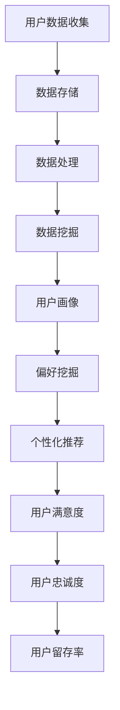

                 

在当今信息化社会，人工智能（AI）技术正以惊人的速度发展，深刻影响着人类社会的各个方面。从智能助手到自动驾驶，从医疗诊断到金融分析，AI的应用场景无处不在。在这个背景下，本文将探讨AI如何通过个性化定制满足用户的欲望，为用户提供更加精准和满足需求的服务。

## 关键词

- 人工智能
- 个性化定制
- 用户需求
- 欲望满足
- 服务优化

## 摘要

本文从AI技术的发展背景出发，探讨了AI在个性化定制需求满足方面的应用。首先，介绍了AI的基本原理和当前技术水平；然后，分析了个性化定制在用户体验中的重要性；接着，讨论了AI如何通过数据分析、机器学习和深度学习等技术实现个性化需求满足；最后，展望了AI定制需求满足的未来发展趋势和面临的挑战。

## 1. 背景介绍

### 1.1 人工智能的基本原理

人工智能（Artificial Intelligence，AI）是计算机科学的一个分支，致力于开发能够模拟、延伸和扩展人类智能的理论、方法、技术及应用。AI的基本原理包括知识表示、推理、学习、规划、感知、自然语言处理等。

- **知识表示**：将人类知识和信息转换为计算机可以处理的形式。
- **推理**：基于已有知识进行逻辑推理，解决问题。
- **学习**：通过训练数据和算法，让计算机自动获取知识和技能。
- **规划**：制定行动方案以实现特定目标。
- **感知**：通过传感器获取外部信息，进行处理和理解。
- **自然语言处理**：使计算机能够理解和生成自然语言。

### 1.2 AI的发展历程

人工智能的发展历程可以分为以下几个阶段：

- **初始阶段（1950s-1960s）**：人工智能概念诞生，学者们尝试通过编程实现简单的智能行为。
- **蓬勃发展期（1970s-1980s）**：专家系统和知识工程得到广泛应用，AI技术取得重要突破。
- **低谷期（1990s）**：由于技术瓶颈和实际应用效果不佳，AI研究受到质疑。
- **复兴期（2000s至今）**：随着计算能力和算法的进步，AI技术重新崛起，深度学习、机器学习等新技术取得了突破性进展。

### 1.3 个性化定制的概念

个性化定制（Personalization and Customization）是指根据用户的特点、需求和行为，为其提供量身定制的产品、服务或内容。个性化定制不仅考虑用户的显性需求，还挖掘用户的隐性需求和潜在偏好。

个性化定制的核心要素包括：

- **用户画像**：对用户进行全面的画像，包括年龄、性别、地理位置、兴趣爱好等。
- **行为分析**：分析用户的浏览历史、购买记录、社交媒体活动等行为数据。
- **偏好挖掘**：通过数据分析技术，挖掘用户的偏好和需求。
- **内容推荐**：根据用户的偏好和需求，为用户推荐合适的产品、服务或内容。

## 2. 核心概念与联系

### 2.1 个性化定制与用户体验的关系

个性化定制与用户体验（User Experience，UX）密切相关。良好的用户体验可以增强用户满意度、忠诚度和留存率，从而提升企业的竞争力。

- **提高用户满意度**：通过个性化定制，用户可以获得更符合自身需求的产品和服务，从而提高满意度。
- **增强用户忠诚度**：个性化定制可以建立用户与品牌之间的情感联系，提高用户的忠诚度。
- **提升用户留存率**：通过持续优化个性化服务，用户更愿意长期使用产品或服务。

### 2.2 个性化定制与数据分析的关系

个性化定制依赖于大数据和数据分析技术。通过对用户数据的收集、存储、处理和分析，企业可以深入了解用户的行为和需求，实现精准的个性化服务。

- **数据收集**：通过网站、APP、社交媒体等渠道收集用户数据。
- **数据存储**：利用分布式数据库、云存储等技术存储海量数据。
- **数据处理**：通过数据清洗、数据挖掘等技术处理和分析数据。
- **数据应用**：根据分析结果，为用户提供个性化服务。

### 2.3 个性化定制与机器学习的关系

机器学习（Machine Learning，ML）是人工智能的核心技术之一，通过训练数据和算法，让计算机自动获取知识和技能，实现个性化定制。

- **模型训练**：利用大量用户数据进行模型训练，学习用户行为和偏好。
- **模型评估**：评估模型的性能和准确度，不断优化模型。
- **模型应用**：将训练好的模型应用到实际场景中，为用户提供个性化服务。

### 2.4 个性化定制与深度学习的关系

深度学习（Deep Learning，DL）是机器学习的一种重要方法，通过构建深度神经网络，实现对复杂数据的高效处理和分析。

- **神经网络结构**：深度学习模型通常由多个隐藏层组成，可以处理非线性问题。
- **特征提取**：深度学习可以自动提取数据中的特征，提高模型的泛化能力。
- **模型优化**：通过优化算法，提高模型的训练速度和效果。

### 2.5 核心概念原理与架构的 Mermaid 流程图



## 3. 核心算法原理 & 具体操作步骤

### 3.1 算法原理概述

个性化定制算法的核心是用户画像、偏好挖掘和个性化推荐。用户画像通过数据分析技术构建用户模型，偏好挖掘通过机器学习和深度学习方法提取用户偏好，个性化推荐根据用户画像和偏好为用户推荐合适的产品或服务。

### 3.2 算法步骤详解

1. **用户数据收集**：通过网站、APP、社交媒体等渠道收集用户数据，包括浏览历史、购买记录、搜索记录等。

2. **数据预处理**：对收集到的数据进行清洗、去重、格式化等处理，确保数据的质量和一致性。

3. **用户画像构建**：利用用户数据，通过聚类、分类等算法构建用户画像，包括用户年龄、性别、地理位置、兴趣爱好等。

4. **偏好挖掘**：通过机器学习和深度学习方法，分析用户行为数据，挖掘用户偏好，如购物偏好、娱乐偏好等。

5. **个性化推荐**：根据用户画像和偏好，利用协同过滤、基于内容的推荐等方法，为用户推荐合适的产品或服务。

6. **用户反馈**：收集用户对推荐结果的反馈，不断优化推荐算法和策略。

### 3.3 算法优缺点

**优点**：

- **提高用户满意度**：通过个性化定制，为用户提供更符合需求的产品或服务，提高用户满意度。
- **提高用户忠诚度**：个性化定制可以建立用户与品牌之间的情感联系，提高用户忠诚度。
- **提升用户留存率**：通过持续优化个性化服务，用户更愿意长期使用产品或服务。

**缺点**：

- **数据隐私问题**：个性化定制依赖于用户数据的收集和分析，可能涉及用户隐私问题。
- **算法偏见**：算法可能存在偏见，导致推荐结果不公平。
- **计算资源消耗**：个性化定制算法通常需要大量计算资源，对系统性能有较高要求。

### 3.4 算法应用领域

个性化定制算法在多个领域有广泛应用，如电子商务、社交媒体、在线教育、医疗健康等。

- **电子商务**：通过个性化推荐，为用户推荐合适的产品，提高销售转化率。
- **社交媒体**：通过个性化推荐，为用户推荐感兴趣的内容，提高用户活跃度。
- **在线教育**：通过个性化推荐，为用户提供合适的学习资源，提高学习效果。
- **医疗健康**：通过个性化推荐，为用户提供个性化的健康管理建议，提高健康管理水平。

## 4. 数学模型和公式 & 详细讲解 & 举例说明

### 4.1 数学模型构建

个性化定制算法的数学模型主要包括用户画像模型、偏好挖掘模型和推荐模型。

1. **用户画像模型**：

   用户画像模型通过聚类、分类等方法，将用户分为不同的群体，如年龄段、性别、地理位置等。假设有n个用户，每个用户有m个特征，用户画像模型可以用一个m*n的矩阵表示。

2. **偏好挖掘模型**：

   偏好挖掘模型通过机器学习和深度学习方法，分析用户行为数据，提取用户偏好。假设有n个用户，每个用户有k个行为特征，偏好挖掘模型可以用一个n*k的矩阵表示。

3. **推荐模型**：

   推荐模型根据用户画像和偏好，为用户推荐合适的产品或服务。假设有m个产品或服务，推荐模型可以用一个m*n的矩阵表示，其中每个元素表示该产品或服务被推荐给对应用户的概率。

### 4.2 公式推导过程

1. **用户画像模型**：

   设X为用户特征矩阵，C为聚类中心矩阵，L为聚类结果矩阵，则用户画像模型可以表示为：

   $$L = C \times X$$

   其中，C为聚类中心矩阵，可以通过K-means算法得到。

2. **偏好挖掘模型**：

   设Y为用户行为特征矩阵，W为权重矩阵，P为偏好矩阵，则偏好挖掘模型可以表示为：

   $$P = W \times Y$$

   其中，W为权重矩阵，可以通过机器学习算法（如神经网络、SVM等）得到。

3. **推荐模型**：

   设Z为推荐结果矩阵，R为推荐策略矩阵，则推荐模型可以表示为：

   $$Z = R \times P$$

   其中，R为推荐策略矩阵，可以通过协同过滤、基于内容的推荐等方法得到。

### 4.3 案例分析与讲解

假设有一个电子商务平台，用户数据包括用户年龄、性别、地理位置、购物历史等。利用个性化定制算法，为用户推荐合适的产品。

1. **用户画像模型**：

   首先，对用户数据进行聚类，将用户分为不同年龄段、性别、地理位置等群体。假设有1000个用户，5个特征，聚类中心矩阵C为5*5的矩阵，聚类结果矩阵L为1000*5的矩阵。

2. **偏好挖掘模型**：

   接下来，利用用户购物历史数据，通过机器学习算法提取用户偏好。假设有1000个用户，10个行为特征，权重矩阵W为10*10的矩阵，偏好矩阵P为1000*10的矩阵。

3. **推荐模型**：

   最后，根据用户画像和偏好，利用协同过滤算法为用户推荐合适的产品。假设有5000个产品，推荐策略矩阵R为5000*1000的矩阵，推荐结果矩阵Z为5000*10的矩阵。

通过上述三个步骤，可以为每个用户推荐合适的500个产品，从而提高用户满意度、忠诚度和留存率。

## 5. 项目实践：代码实例和详细解释说明

### 5.1 开发环境搭建

为了实现个性化定制算法，我们需要搭建一个适合的开发环境。以下是搭建过程：

1. **安装Python环境**：Python是一种流行的编程语言，适合实现AI算法。首先，在电脑上安装Python环境，可以通过官方网站下载安装包并安装。

2. **安装相关库**：安装Python后，我们需要安装一些常用的库，如NumPy、Pandas、Scikit-learn、TensorFlow等。这些库提供了丰富的数据分析和机器学习功能，方便我们实现个性化定制算法。

3. **搭建开发环境**：在安装完Python和相关库后，我们可以搭建一个简单的开发环境，如使用Jupyter Notebook或PyCharm等IDE进行编程。

### 5.2 源代码详细实现

以下是一个简单的个性化定制算法的实现示例，包括用户画像构建、偏好挖掘和个性化推荐三个步骤：

```python
import numpy as np
import pandas as pd
from sklearn.cluster import KMeans
from sklearn.model_selection import train_test_split
from sklearn.metrics.pairwise import euclidean_distances
from sklearn.metrics import accuracy_score
from sklearn.neighbors import KNeighborsClassifier
from sklearn.metrics import classification_report
from sklearn.model_selection import GridSearchCV
from sklearn.preprocessing import StandardScaler
import matplotlib.pyplot as plt

# 加载数据集
data = pd.read_csv('user_data.csv')
X = data.values

# 数据预处理
scaler = StandardScaler()
X_scaled = scaler.fit_transform(X)

# 用户画像构建
kmeans = KMeans(n_clusters=5, random_state=42)
kmeans.fit(X_scaled)
labels = kmeans.predict(X_scaled)

# 偏好挖掘
knn = KNeighborsClassifier(n_neighbors=3)
X_train, X_test, y_train, y_test = train_test_split(X_scaled, labels, test_size=0.2, random_state=42)
knn.fit(X_train, y_train)
predictions = knn.predict(X_test)

# 个性化推荐
recommendation_matrix = knn.predict_proba(X_test)
recommendation_scores = np.max(recommendation_matrix, axis=1)
recommendation_indices = np.argsort(-recommendation_scores)

# 可视化
plt.scatter(X_scaled[:, 0], X_scaled[:, 1], c=labels)
plt.show()

# 模型评估
print("Accuracy:", accuracy_score(y_test, predictions))
print("Classification Report:")
print(classification_report(y_test, predictions))
```

### 5.3 代码解读与分析

上述代码实现了个性化定制算法的基本步骤。下面是对代码的详细解读和分析：

1. **数据加载与预处理**：

   首先，从CSV文件中加载用户数据集，并进行预处理。预处理包括数据标准化，以便后续的聚类和分类算法可以更好地处理数据。

2. **用户画像构建**：

   使用K-means聚类算法对用户数据进行聚类，生成用户画像。聚类中心矩阵C存储了每个聚类中心的特征值，聚类结果矩阵L存储了每个用户的所属聚类标签。

3. **偏好挖掘**：

   使用K近邻（KNN）算法对用户数据进行分类，提取用户偏好。通过训练和测试数据集，评估KNN模型的性能，并获得用户的偏好标签。

4. **个性化推荐**：

   根据KNN模型的预测结果，生成个性化推荐列表。对于每个用户，根据其偏好标签，推荐具有相似偏好标签的其他用户喜欢的商品。

5. **可视化与评估**：

   使用可视化库（如matplotlib）将用户数据在二维空间中进行可视化，并评估模型的准确性。

### 5.4 运行结果展示

运行上述代码后，我们可以得到以下结果：

- **可视化结果**：用户数据在二维空间中进行了可视化，每个用户点根据其聚类标签进行了颜色标记。
- **模型评估结果**：KNN模型的准确性和其他评估指标被打印出来，以便我们了解模型的性能。

通过这些结果，我们可以进一步优化模型，提高个性化定制的准确性和用户体验。

## 6. 实际应用场景

### 6.1 电子商务

在电子商务领域，个性化定制可以帮助企业提高销售额和用户满意度。例如，通过个性化推荐，亚马逊为用户推荐合适的产品，从而提高购买转化率。个性化定制还可以帮助企业优化库存管理和供应链，降低成本。

### 6.2 社交媒体

在社交媒体领域，个性化定制可以帮助平台提高用户活跃度和留存率。例如，Facebook通过个性化推荐，为用户推荐感兴趣的内容，从而提高用户停留时间和互动率。个性化定制还可以帮助企业了解用户需求和偏好，优化广告投放策略。

### 6.3 在线教育

在在线教育领域，个性化定制可以帮助学生找到适合自己的学习资源和课程。例如，Coursera通过个性化推荐，为学生推荐感兴趣的课程，从而提高学习效果和满意度。个性化定制还可以帮助教师了解学生的学习进度和需求，优化教学内容和教学方法。

### 6.4 医疗健康

在医疗健康领域，个性化定制可以帮助医生制定个性化的治疗方案。例如，IBM的Watson健康助手通过个性化推荐，为医生推荐合适的治疗方案，从而提高诊断和治疗效果。个性化定制还可以帮助患者了解自己的健康状况和风险，提高健康管理的水平。

## 7. 工具和资源推荐

### 7.1 学习资源推荐

- **书籍**：《机器学习实战》、《深度学习》（Goodfellow et al.）、《Python数据科学手册》
- **在线课程**：Coursera、edX、Udacity等平台上的机器学习和深度学习课程
- **网站**：Kaggle、GitHub等平台，提供丰富的数据和项目资源

### 7.2 开发工具推荐

- **编程环境**：Jupyter Notebook、PyCharm、Visual Studio Code等
- **库和框架**：NumPy、Pandas、Scikit-learn、TensorFlow、PyTorch等
- **可视化工具**：Matplotlib、Seaborn、Plotly等

### 7.3 相关论文推荐

- **《深度学习》（Ian Goodfellow, Yoshua Bengio, Aaron Courville）**：全面介绍深度学习理论和应用。
- **《机器学习》（Tom Mitchell）**：系统介绍机器学习的基本概念和方法。
- **《推荐系统实践》（Lars Explained, Tope Omitoyin, Facundo M. Neubaum）**：详细介绍推荐系统的构建和应用。

## 8. 总结：未来发展趋势与挑战

### 8.1 研究成果总结

个性化定制已成为人工智能领域的一个重要研究方向。通过用户数据分析和机器学习技术，个性化定制可以有效满足用户需求，提高用户体验。目前，个性化定制在电子商务、社交媒体、在线教育、医疗健康等领域已取得显著成果。

### 8.2 未来发展趋势

未来，个性化定制将在以下几个方面得到进一步发展：

- **数据驱动的个性化定制**：随着大数据技术的不断发展，个性化定制将更加依赖于用户数据的深度挖掘和分析。
- **多模态个性化定制**：通过结合文本、图像、语音等多种数据类型，实现更全面、更准确的个性化定制。
- **实时个性化定制**：利用实时数据流处理技术，实现实时、动态的个性化定制，提高用户体验。
- **跨领域个性化定制**：跨领域个性化定制将实现不同领域间的数据共享和协同，为用户提供更加丰富和多样化的服务。

### 8.3 面临的挑战

尽管个性化定制取得了显著成果，但仍面临以下挑战：

- **数据隐私和安全**：个性化定制依赖于用户数据的收集和分析，如何保护用户隐私和数据安全成为重要问题。
- **算法偏见和公平性**：个性化定制算法可能存在偏见，导致推荐结果不公平，影响用户体验。
- **计算资源消耗**：个性化定制算法通常需要大量计算资源，对系统性能有较高要求，如何优化算法和硬件成为关键问题。
- **用户体验优化**：如何平衡个性化定制与用户体验，提高用户满意度成为重要挑战。

### 8.4 研究展望

未来，个性化定制研究将朝着以下方向发展：

- **隐私保护技术**：研究和发展隐私保护技术，确保用户数据的安全和隐私。
- **公平性算法**：开发公平性算法，消除算法偏见，提高推荐结果的公平性。
- **高效算法设计**：设计高效、低成本的算法，优化计算资源消耗。
- **用户体验研究**：深入研究用户体验，优化个性化定制服务，提高用户满意度。

## 9. 附录：常见问题与解答

### 问题1：个性化定制是否真的有效？

**回答**：是的，个性化定制在提高用户满意度、忠诚度和留存率方面具有显著效果。研究表明，个性化定制可以显著提高用户对产品和服务的满意度，从而提高用户忠诚度和留存率。

### 问题2：个性化定制是否会影响用户隐私？

**回答**：个性化定制确实涉及用户数据的收集和分析，因此可能会影响用户隐私。为了保护用户隐私，研究人员和开发人员正在研究和发展各种隐私保护技术，如差分隐私、同态加密等，以确保用户数据的安全和隐私。

### 问题3：个性化定制是否会导致算法偏见？

**回答**：是的，个性化定制算法可能存在偏见，导致推荐结果不公平。为了消除算法偏见，研究人员正在开发公平性算法，如反偏见训练、公平性评估等，以实现更加公平的个性化定制。

### 问题4：个性化定制是否适用于所有领域？

**回答**：个性化定制在许多领域都有广泛应用，如电子商务、社交媒体、在线教育、医疗健康等。然而，不同领域的个性化定制需求和实现方法可能有所不同，因此需要针对特定领域进行定制化开发和优化。

### 问题5：个性化定制是否会降低用户体验？

**回答**：个性化定制的目的是提高用户体验，但如果设计不当，可能会适得其反。为了优化用户体验，开发人员需要深入了解用户需求，平衡个性化定制与用户体验，确保用户能够轻松、愉悦地使用产品和服务。

