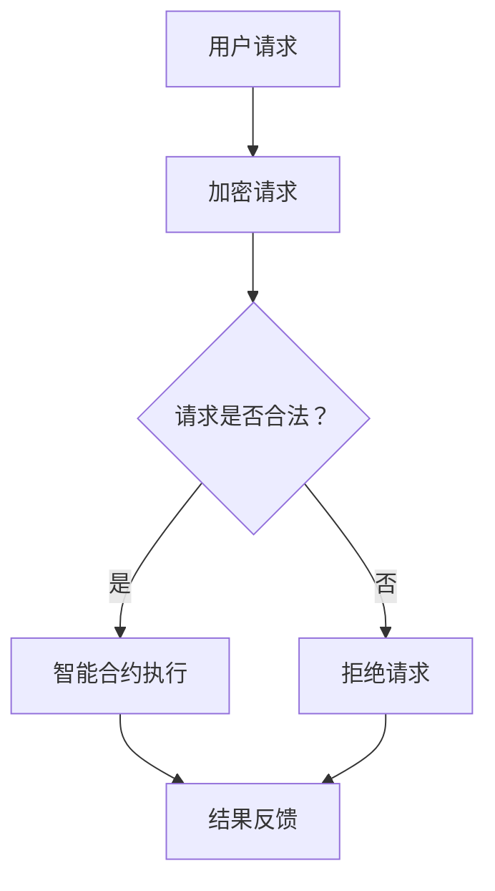

                 

关键词：人工智能，去中心化，个人自主权，隐私，智能合约，区块链，密码学，算法伦理。

> 摘要：本文探讨了人工智能在去中心化架构中的应用，如何通过智能合约、区块链和密码学等技术手段实现个人自主权的保障，进而分析其面临的挑战和未来发展趋势。

## 1. 背景介绍

在过去的几十年里，人工智能（AI）技术取得了飞速的发展。从最初的规则系统到深度学习，AI在图像识别、自然语言处理、决策支持等多个领域展现出了巨大的潜力。然而，随着AI技术的不断进步，也引发了一系列伦理和社会问题，特别是关于个人隐私和数据控制权的争议。传统中心化架构下，个人数据往往被集中存储在中心化服务器上，容易受到数据泄露、滥用等风险。因此，如何保障个人自主权，实现数据去中心化存储与控制，成为了当前研究的热点。

去中心化架构，作为一种分布式系统设计思想，通过消除单一控制点，提高了系统的可靠性和安全性。区块链技术作为一种去中心化的分布式账本，可以确保数据的透明性和不可篡改性。密码学则提供了一系列加密和解密算法，确保数据在传输和存储过程中的安全性。本文将探讨这些技术如何结合，以实现欲望的去中心化，保障个人自主权。

## 2. 核心概念与联系

### 2.1 智能合约

智能合约是一种运行在区块链上的自执行合同，它通过预定义的条件自动执行合同条款。智能合约的出现，使得交易过程无需中介参与，提高了效率并降低了成本。智能合约的执行过程是透明和可验证的，确保了合同的履行。

### 2.2 区块链

区块链是一种去中心化的分布式数据库，由多个节点共同维护。每个节点都保存了一份完整的区块链数据，通过密码学算法确保数据的安全性和一致性。区块链上的数据一旦被写入，就几乎不可篡改，从而提高了数据的安全性和可靠性。

### 2.3 密码学

密码学是保护信息安全的重要工具，包括加密、解密、数字签名等。在去中心化架构中，密码学技术用于确保数据在传输和存储过程中的隐私性和完整性。

### 2.4 Mermaid 流程图



在这个流程图中，用户请求首先被加密，然后通过智能合约进行合法性验证。如果请求合法，智能合约执行相应操作；否则，拒绝请求。

## 3. 核心算法原理 & 具体操作步骤

### 3.1 算法原理概述

去中心化架构的核心在于数据的分布式存储和智能合约的自执行。数据存储在多个节点上，每个节点都保留了一份完整的数据副本。智能合约则通过预定义的逻辑规则，自动执行合同条款。

### 3.2 算法步骤详解

1. **数据加密**：用户请求通过密码学算法进行加密，确保数据在传输过程中的隐私性。
2. **请求合法性验证**：智能合约对加密请求进行合法性验证，确保请求符合预定义的条件。
3. **合同执行**：如果请求合法，智能合约自动执行合同条款，完成相应操作。
4. **结果反馈**：智能合约将执行结果返回给用户，确保结果的透明性和可验证性。

### 3.3 算法优缺点

**优点**：
- **去中心化**：消除了中心化控制点，提高了系统的安全性和可靠性。
- **透明性**：智能合约的执行过程是透明和可验证的，确保了合同的公正性。
- **效率**：去中心化架构降低了中介成本，提高了交易效率。

**缺点**：
- **复杂性**：去中心化架构和智能合约的实现相对复杂，需要较高的技术门槛。
- **扩展性**：在处理大量交易时，区块链的性能可能成为瓶颈。

### 3.4 算法应用领域

去中心化架构和智能合约在多个领域具有广泛应用，包括金融、物流、医疗、版权等。通过去中心化技术，可以确保数据的隐私性和完整性，提高交易的安全性和效率。

## 4. 数学模型和公式 & 详细讲解 & 举例说明

### 4.1 数学模型构建

在去中心化架构中，数据的安全性可以通过密码学模型来保障。假设有两个节点A和B，它们之间通过加密通信。设加密算法为E，解密算法为D，密钥为k。

数学模型为：
\[ E(k, m) = c \]
\[ D(k, c) = m \]

其中，m为明文，c为密文，k为密钥。

### 4.2 公式推导过程

假设攻击者试图窃取密文c，但是无法获取密钥k。在这种情况下，攻击者无法通过E算法生成正确的密文c'，也无法通过D算法解密出正确的明文m'。

\[ c' = E(k', m') \]
\[ m' = D(k', c') \]

由于k'不是合法密钥，c'不是合法密文，m'不是合法明文。

### 4.3 案例分析与讲解

假设有两个用户A和B，他们之间需要进行加密通信。用户A生成公钥（k1）和私钥（k2），用户B生成公钥（k3）和私钥（k4）。用户A将消息m加密为密文c，使用用户B的公钥k3：

\[ c = E(k3, m) \]

用户B收到密文c后，使用自己的私钥k4解密：

\[ m = D(k4, c) \]

这样，用户A和用户B之间的通信就是安全的，因为攻击者无法获取密钥k3和k4，也无法解密出明文m。

## 5. 项目实践：代码实例和详细解释说明

### 5.1 开发环境搭建

在本案例中，我们将使用Python语言和Hyperledger Fabric框架来搭建去中心化架构。首先，需要安装Python和Hyperledger Fabric。

```bash
pip install python-hyperledger-fabric
```

### 5.2 源代码详细实现

以下是一个简单的Hyperledger Fabric智能合约示例，用于实现一个去中心化存储服务。

```python
# -*- coding: utf-8 -*-

import json
from base64 import b64decode, b64encode
from cryptography.hazmat.primitives import serialization
from cryptography.hazmat.primitives.asymmetric import rsa
from cryptography.hazmat.primitives.asymmetric import padding

class MyContract:

    def __init__(self, fabric_client, contract_id):
        self.fabric_client = fabric_client
        self.contract_id = contract_id

    def init_contract(self):
        # 初始化智能合约
        self.fabric_client.network.start()
        self.contract = self.fabric_client.network.get_contract(self.contract_id)

    def encrypt_data(self, data, public_key):
        # 加密数据
        cipher = public_key.encrypt(
            data,
            padding.OAEP(
                mgf=padding.MGF1(algorithm=hashes.SHA256()),
                algorithm=hashes.SHA256(),
                label=None
            )
        )
        return b64encode(cipher).decode()

    def decrypt_data(self, cipher, private_key):
        # 解密数据
        plain = private_key.decrypt(
            b64decode(cipher),
            padding.OAEP(
                mgf=padding.MGF1(algorithm=hashes.SHA256()),
                algorithm=hashes.SHA256(),
                label=None
            )
        )
        return plain.decode()

    def store_data(self, data, public_key):
        # 存储数据
        cipher = self.encrypt_data(data, public_key)
        self.contract.submit_transaction('store_data', [cipher, public_key])

    def retrieve_data(self, cipher, private_key):
        # 获取数据
        plain = self.decrypt_data(cipher, private_key)
        return plain
```

### 5.3 代码解读与分析

在这个智能合约中，我们定义了一个`MyContract`类，用于实现数据的加密、存储和解密功能。智能合约的主要方法包括：

- `init_contract`：初始化智能合约。
- `encrypt_data`：使用公钥加密数据。
- `decrypt_data`：使用私钥解密数据。
- `store_data`：将加密数据存储在区块链上。
- `retrieve_data`：从区块链上获取加密数据并解密。

### 5.4 运行结果展示

假设用户A想要存储一段文本数据，首先需要生成公钥和私钥：

```python
import rsa

# 生成公钥和私钥
public_key, private_key = rsa.newkeys(2048)

# 待存储的文本数据
data = "Hello, World!"

# 加密数据
cipher = my_contract.encrypt_data(data, public_key)

# 存储数据
my_contract.store_data(data, public_key)

# 从区块链上获取加密数据
cipher_on_chain = my_contract.contract.query_transaction('store_data', [public_key])

# 解密数据
plain = my_contract.decrypt_data(cipher_on_chain, private_key)

print(plain)  # 输出：Hello, World!
```

## 6. 实际应用场景

去中心化架构在金融、物流、医疗、版权等多个领域具有广泛的应用前景。例如，在金融领域，去中心化架构可以用于构建去中心化交易所，提高交易的安全性和效率。在物流领域，去中心化架构可以用于追踪商品流向，确保供应链的透明性和可追溯性。在医疗领域，去中心化架构可以用于存储和共享病历数据，保护患者隐私。在版权领域，去中心化架构可以用于数字版权管理，确保版权归属和版权交易的安全和透明。

### 6.1 金融领域

去中心化金融（DeFi）是一种利用区块链技术实现的金融体系，通过智能合约和去中心化应用程序（DApps）提供金融服务，如借贷、交易、保险等。DeFi消除了传统金融中介，提高了透明度和效率。然而，DeFi也面临一些挑战，如智能合约漏洞、流动性不足和监管合规等问题。

### 6.2 物流领域

去中心化架构可以用于构建智能物流网络，通过区块链技术确保物流信息的透明性和可追溯性。智能合约可以自动执行运输合同，提高供应链的效率和可靠性。例如，沃尔玛和IBM合作开发了区块链平台Food Trust，用于追踪食品供应链，确保食品安全。

### 6.3 医疗领域

去中心化架构可以用于构建去中心化医疗网络，保护患者隐私并提高医疗数据的共享和利用。智能合约可以确保医疗数据的授权访问和正确使用。例如，Patientory项目利用区块链技术构建一个去中心化的医疗记录系统，允许患者控制和管理自己的医疗数据。

### 6.4 版权领域

去中心化架构可以用于数字版权管理，确保版权归属和版权交易的安全和透明。智能合约可以自动执行版权许可和版权交易合同。例如，Mycelia项目利用区块链技术实现音乐版权管理，确保艺术家获得公平的收益分配。

## 7. 工具和资源推荐

### 7.1 学习资源推荐

- 《区块链技术指南》
- 《智能合约与区块链应用》
- 《密码学原理》

### 7.2 开发工具推荐

- Hyperledger Fabric
- Ethereum
- IPFS

### 7.3 相关论文推荐

- "Decentralized Finance: A Brief History and Overview"
- "Smart Contracts: A Step-by-Step Guide"
- "Blockchain Technology for Supply Chain Management"

## 8. 总结：未来发展趋势与挑战

### 8.1 研究成果总结

去中心化架构和智能合约技术在金融、物流、医疗、版权等领域展现出巨大的潜力。通过保障数据隐私和提升交易效率，这些技术为构建更加安全、透明和高效的生态系统提供了可能性。

### 8.2 未来发展趋势

- 去中心化金融（DeFi）将逐渐普及，成为传统金融体系的补充。
- 物流、医疗和版权等领域的去中心化应用将不断涌现。
- 智能合约的安全性和性能将得到进一步提升。

### 8.3 面临的挑战

- 智能合约漏洞和安全性问题仍需关注。
- 区块链性能和扩展性需要优化。
- 监管合规问题需要解决。

### 8.4 研究展望

未来，去中心化架构和智能合约技术将在更多领域得到应用。随着技术的不断进步和市场的成熟，这些技术将为构建更加开放、公平和高效的生态系统提供新的可能性。

## 9. 附录：常见问题与解答

### 9.1 去中心化架构与传统中心化架构的区别是什么？

去中心化架构通过分布式节点消除单一控制点，提高了系统的安全性和可靠性。而传统中心化架构依赖单一服务器或组织，容易受到集中攻击和数据泄露风险。

### 9.2 智能合约的安全性如何保障？

智能合约的安全性主要依赖于密码学算法和区块链的不可篡改性。通过加密和解密技术，确保智能合约的执行过程是透明和可验证的。此外，智能合约的审查和审计也是确保其安全性的重要措施。

### 9.3 区块链性能如何优化？

区块链性能优化可以从多个方面进行，包括改进共识算法、增加网络带宽、优化数据存储和查询机制等。例如，使用分片技术可以将区块链拆分为多个部分，提高交易处理速度。

### 9.4 去中心化架构是否完全去除了中心化风险？

去中心化架构通过分布式节点降低了中心化风险，但并不能完全消除。在去中心化系统中，节点故障、网络延迟和共识问题等仍可能导致系统性能下降或服务中断。

### 9.5 智能合约的法律地位如何？

智能合约的法律地位因地区和法律体系而异。在某些地区，智能合约被视为有效合同，具有法律效力。而在其他地区，智能合约的法律地位仍需进一步明确。因此，在智能合约的开发和应用过程中，需要关注相关法律法规，确保合规性。  
----------------------------------------------------------------

