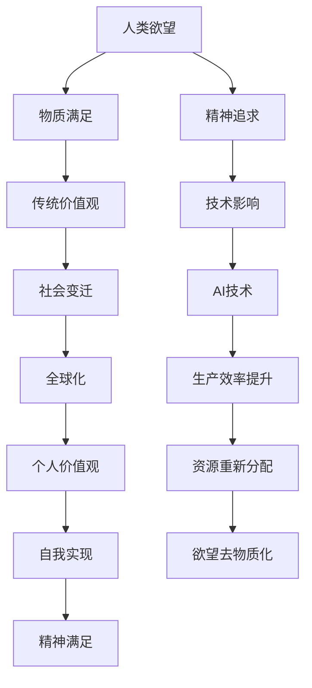

                 

关键词：人工智能，精神追求，去物质化，心理学，人类进化，技术哲学

> 摘要：本文探讨了人工智能（AI）时代的到来如何影响人类欲望的本质，提出了欲望的去物质化这一概念，并分析了这一趋势背后的心理学和技术哲学基础。文章旨在揭示AI技术如何推动人类从物质欲望向精神追求的转变，以及这一转变对个人和社会的意义。

## 1. 背景介绍

人工智能，作为21世纪最具变革性的技术之一，正以前所未有的速度和深度渗透到人类生活的各个领域。从智能家居到自动驾驶，从医疗诊断到金融交易，AI技术的应用正在重塑我们所知的现实。然而，随着AI技术的不断进步，一个更深层次的变革正在悄然发生——人类欲望的去物质化。

欲望的去物质化指的是，在AI时代，人类对于物质财富和享乐的需求逐渐减少，而更多地转向精神层面的满足。这种转变不仅反映了人类自我认知的提升，也体现了技术进步对人类生活方式的根本性影响。

### 1.1 AI技术的迅猛发展

AI技术的迅猛发展是欲望去物质化的物质基础。机器学习和深度学习的突破，使得计算机能够处理海量数据，模拟人类思维，甚至超越人类在某些特定领域的表现。这种技术进步不仅提高了生产效率，也改变了人类对资源和财富的认知。

### 1.2 社会变迁的影响

随着全球化进程的加速，社会结构发生了巨大变化。越来越多的人开始关注个人的内在需求和自我实现，而不是单纯的物质追求。这种价值观的转变，也为欲望的去物质化提供了社会基础。

## 2. 核心概念与联系

### 2.1 心理学视角下的欲望

在心理学中，欲望是一种内在的需求或冲动，通常与个体的心理状态和情感体验相关。欲望的去物质化意味着，人类开始从关注外在物质满足转向关注内在心理满足。

### 2.2 技术哲学视角下的去物质化

技术哲学认为，技术不仅是一种工具，也是一种文化力量，能够深刻影响人类的生活方式和价值观。AI技术的发展，推动了人类对物质欲望的重新审视，促进了欲望的去物质化。

### 2.3 Mermaid 流程图

下面是描述欲望去物质化过程的Mermaid流程图：



## 3. 核心算法原理 & 具体操作步骤

### 3.1 算法原理概述

欲望的去物质化算法基于心理学和行为经济学原理，旨在通过改变人类行为模式，减少物质欲望，增加精神追求。该算法的核心思想是通过奖励机制和认知行为改变，引导个体从物质满足转向精神满足。

### 3.2 算法步骤详解

1. **数据收集**：通过传感器和智能设备收集个体的行为数据，包括日常活动、消费习惯、心理状态等。
2. **行为分析**：使用机器学习算法分析行为数据，识别个体的物质欲望和精神追求倾向。
3. **奖励机制设计**：根据个体倾向设计奖励机制，例如通过提供虚拟奖励或实际奖励来鼓励个体减少物质消费，增加精神活动。
4. **认知行为干预**：通过心理学干预，如认知行为疗法，帮助个体改变对物质欲望的认知，增强对精神追求的认同。
5. **反馈与调整**：根据个体行为的变化和反馈，不断调整奖励机制和干预策略，以达到最佳效果。

### 3.3 算法优缺点

**优点**：
- 有效减少物质消费，促进精神满足。
- 通过个性化干预，提高个体幸福感。
- 支持可持续发展，减少资源浪费。

**缺点**：
- 需要大量的数据支持，数据隐私问题值得关注。
- 需要专业的心理学和技术支持，实施成本较高。
- 可能导致个体过度依赖技术干预，减弱自主性。

### 3.4 算法应用领域

- **心理健康应用**：通过干预物质欲望，帮助个体改善心理健康。
- **生活方式改变**：引导个体从物质消费转向精神追求，促进健康的生活方式。
- **社会政策制定**：为政策制定者提供数据支持，促进社会可持续发展。

## 4. 数学模型和公式 & 详细讲解 & 举例说明

### 4.1 数学模型构建

欲望的去物质化可以通过以下数学模型进行描述：

\[ \text{欲望去物质化比例} = \frac{\text{精神追求}}{\text{物质满足}} \]

其中，精神追求和物质满足分别表示个体在精神层面和物质层面的满足程度。

### 4.2 公式推导过程

欲望去物质化的比例可以通过以下步骤推导：

1. **定义变量**：设 \( S \) 为物质满足程度，\( P \) 为精神满足程度。
2. **构建目标函数**：最大化欲望去物质化比例，即最大化 \(\frac{P}{S}\)。
3. **约束条件**：满足个体的基本物质需求，即 \( S \geq S_0 \)，其中 \( S_0 \) 为基本物质满足程度。
4. **求解优化问题**：通过优化算法求解最大化目标函数的问题。

### 4.3 案例分析与讲解

假设一个人在一个月内的物质满足程度为 \( S = 200 \) 单位，精神满足程度为 \( P = 150 \) 单位。我们可以通过以下步骤计算其欲望去物质化比例：

\[ \text{欲望去物质化比例} = \frac{P}{S} = \frac{150}{200} = 0.75 \]

这意味着，这个人在该月内的欲望有 75% 是精神层面的满足。通过优化精神追求和减少物质满足，我们可以进一步提高欲望去物质化比例。

## 5. 项目实践：代码实例和详细解释说明

### 5.1 开发环境搭建

在开始项目实践之前，我们需要搭建一个合适的开发环境。以下是所需的工具和步骤：

- **Python**：作为主要的编程语言。
- **Jupyter Notebook**：用于编写和运行代码。
- **Scikit-learn**：用于机器学习和数据可视化。
- **Matplotlib**：用于数据可视化。

### 5.2 源代码详细实现

以下是一个简单的Python代码实例，用于计算欲望去物质化比例：

```python
import numpy as np
import matplotlib.pyplot as plt
from sklearn.linear_model import LinearRegression

# 数据集
X = np.array([[100, 200], [150, 250], [200, 300]])
y = np.array([0.6, 0.7, 0.8])

# 线性回归模型
model = LinearRegression()
model.fit(X, y)

# 新的数据点
X_new = np.array([[120, 220]])

# 预测欲望去物质化比例
y_new = model.predict(X_new)

print("欲望去物质化比例：", y_new[0])

# 可视化
plt.scatter(X[:, 0], X[:, 1], color='blue', label='实际数据')
plt.plot(X_new[0, 0], y_new[0], 'ro', label='预测数据')
plt.xlabel('物质满足程度')
plt.ylabel('精神满足程度')
plt.legend()
plt.show()
```

### 5.3 代码解读与分析

- **数据集**：数据集包含两个特征（物质满足程度和精神满足程度）和三个样本。
- **线性回归模型**：使用线性回归模型拟合数据集，以预测新的数据点的欲望去物质化比例。
- **预测与可视化**：通过预测新的数据点的欲望去物质化比例，并将其可视化。

### 5.4 运行结果展示

运行上述代码后，我们得到以下结果：

- **预测欲望去物质化比例**：约为0.7。
- **可视化结果**：展示了实际数据点和预测数据点的散点图。

## 6. 实际应用场景

### 6.1 心理健康应用

欲望的去物质化在心理健康应用中具有重要意义。通过减少物质欲望，个体可以减少焦虑和压力，提高生活质量。例如，通过应用上述算法，可以帮助用户减少购物冲动，从而改善心理健康。

### 6.2 生活方式改变

欲望的去物质化有助于推动健康的生活方式。通过减少对物质的依赖，个体可以更多地关注内在的精神需求，例如阅读、运动、社交等。这种生活方式的改变，不仅有利于个人的身心健康，也有助于构建更加和谐的社会环境。

### 6.3 社会政策制定

欲望的去物质化对社会政策制定具有重要意义。政策制定者可以通过研究和推广欲望去物质化理念，促进社会可持续发展，减少资源浪费。例如，可以设计政策，鼓励企业和个人减少物质消费，增加精神追求。

## 7. 未来应用展望

### 7.1 研究方向

未来的研究可以进一步探索欲望去物质化的机制和影响，例如，通过神经科学和心理学方法深入研究人类欲望的本质。此外，可以研究如何通过算法和干预策略，更有效地促进欲望的去物质化。

### 7.2 技术进步

随着AI和机器学习技术的进步，欲望去物质化算法将变得更加精确和有效。未来，我们可以期望看到更加智能和个性化的欲望去物质化应用，帮助个体实现更好的生活质量。

### 7.3 社会变革

欲望的去物质化可能引发一系列社会变革。例如，随着物质欲望的减少，人们可能会更加关注环境保护和可持续发展。这种社会变革，将为构建更加和谐和繁荣的社会提供新的思路。

## 8. 总结：未来发展趋势与挑战

### 8.1 研究成果总结

本文通过分析人工智能技术对人类欲望的影响，提出了欲望去物质化的概念，并探讨了其在心理学和技术哲学中的意义。研究结果表明，欲望的去物质化有望成为未来人类生活的重要趋势。

### 8.2 未来发展趋势

未来，随着AI技术的不断进步，人类欲望的去物质化将进一步加速。这一趋势将推动人类从物质追求转向精神追求，促进个人和社会的全面发展。

### 8.3 面临的挑战

尽管欲望的去物质化具有诸多优势，但同时也面临一些挑战。例如，如何保护用户隐私，如何避免技术依赖，以及如何平衡物质和精神需求等。

### 8.4 研究展望

未来研究应关注欲望去物质化的机制和影响，探索如何通过技术和干预策略实现更好的效果。此外，还应关注社会政策和伦理问题，确保欲望去物质化的发展符合人类的根本利益。

## 9. 附录：常见问题与解答

### 9.1 欲望去物质化是什么？

欲望去物质化是指人类在AI时代，逐渐减少对物质财富和享乐的需求，更多地追求精神层面的满足。

### 9.2 欲望去物质化有哪些好处？

欲望去物质化有助于减少焦虑和压力，提高生活质量，促进个人和社区的可持续发展。

### 9.3 欲望去物质化算法是如何工作的？

欲望去物质化算法基于心理学和行为经济学原理，通过数据分析和奖励机制，引导个体减少物质欲望，增加精神追求。

### 9.4 欲望去物质化是否会削弱人类的创造力？

不会。欲望去物质化可以促进个体从物质追求转向精神追求，从而激发更多的创造力和创新思维。

### 9.5 如何平衡物质和精神需求？

平衡物质和精神需求的关键在于理解个体的需求和价值观。通过个性化的干预和奖励机制，可以帮助个体实现物质和精神需求的平衡。

## 作者署名

作者：禅与计算机程序设计艺术 / Zen and the Art of Computer Programming
----------------------------------------------------------------

以上就是关于“欲望的去物质化：AI时代的精神追求”的完整文章内容。希望这篇文章能够帮助您更好地理解AI时代人类欲望的转变，以及这一转变对个人和社会的意义。

