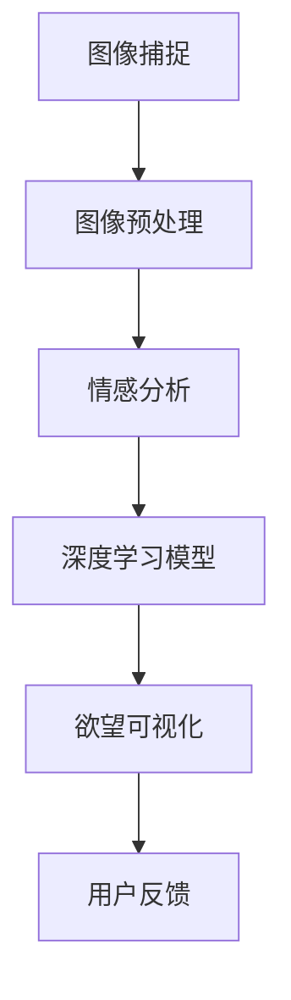
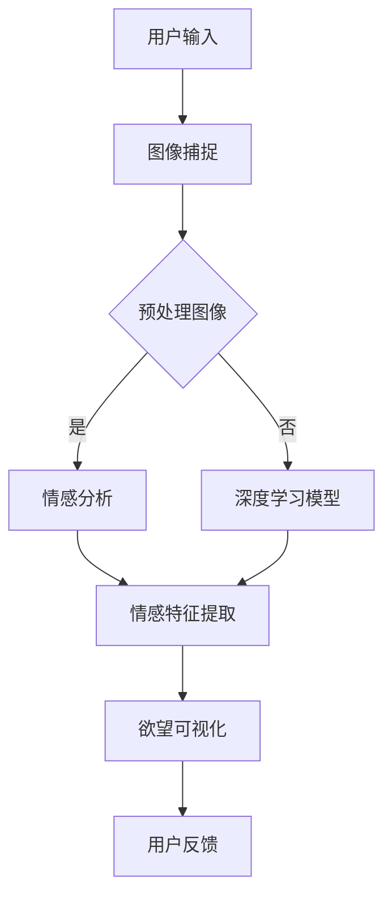

                 

 **关键词**：人工智能、内心世界、欲望、可视化、图像处理、深度学习、情感分析、人脑建模

**摘要**：本文探讨了人工智能（AI）在捕捉和理解人类内心世界方面的前沿技术，特别是如何将个体的欲望进行可视化。通过结合图像处理、深度学习和情感分析等先进技术，我们能够更深刻地洞察人类的情感和心理活动。本文将详细介绍相关算法原理、数学模型以及实际应用案例，同时展望未来该领域的发展趋势和面临的挑战。

## 1. 背景介绍

在过去的几十年中，人工智能（AI）经历了飞速的发展。从最初的规则基础算法到如今深度学习、神经网络等复杂模型的出现，AI在各个领域都取得了显著的成果。然而，尽管AI在图像识别、语音识别、自然语言处理等方面取得了巨大的进步，但对于理解人类的内心世界，尤其是情感和心理活动，仍然存在诸多挑战。

人类内心世界是一个复杂且多维度的领域，涉及到情感、欲望、记忆等多个层面。传统的心理学研究方法，如自我报告、实验设计等，虽然能够提供一些有价值的信息，但往往存在主观性、局限性等问题。因此，如何通过客观、精确的方法来捕捉和理解人类的内心世界，成为了一个亟待解决的问题。

本文旨在探讨如何利用AI技术，特别是图像处理、深度学习和情感分析等方法，将个体的欲望进行可视化。通过这种方式，我们可以更好地理解人类的情感和心理活动，为心理健康、个性化教育等领域提供新的解决方案。

## 2. 核心概念与联系

### 2.1. 图像处理与情感分析

图像处理是计算机视觉的重要分支，它涉及对图像的获取、处理和分析。在欲望的可视化过程中，图像处理技术能够帮助我们捕捉和提取个体的情感和欲望信息。

情感分析则是自然语言处理的一个重要领域，旨在从文本中提取情感信息。通过将文本转换为图像，我们可以利用情感分析技术来分析个体的情感状态。

### 2.2. 深度学习与人脑建模

深度学习是一种基于神经网络的学习方法，能够在大量数据中自动提取特征。在人脑建模方面，深度学习可以模拟人类大脑的工作方式，帮助我们理解情感和心理活动的机制。

### 2.3. 核心概念原理与架构

为了更好地理解欲望的可视化，我们可以使用Mermaid流程图来展示相关概念和架构。以下是一个简化的Mermaid流程图示例：



### 2.4. 欲望可视化的流程图



## 3. 核心算法原理 & 具体操作步骤

### 3.1. 算法原理概述

欲望的可视化算法主要基于以下三个步骤：

1. 图像捕捉：利用摄像头或其他图像采集设备捕捉用户的图像。
2. 情感分析：通过情感分析技术，从图像中提取情感特征。
3. 欲望可视化：利用深度学习模型，将情感特征转化为可视化的图像。

### 3.2. 算法步骤详解

#### 3.2.1. 图像捕捉

图像捕捉是通过摄像头或其他图像采集设备实时获取用户的图像。为了提高图像质量，可以使用一些图像预处理技术，如去噪、对比度增强等。

#### 3.2.2. 情感分析

情感分析是欲望可视化的关键步骤。首先，我们需要对图像进行预处理，包括人脸检测、人脸对齐等。然后，利用情感分析模型，如CNN（卷积神经网络），从预处理后的图像中提取情感特征。这些特征可以包括快乐、愤怒、悲伤等基本情感。

#### 3.2.3. 欲望可视化

在得到情感特征后，我们需要利用深度学习模型，如GAN（生成对抗网络），将这些特征转换为可视化的图像。GAN由生成器和判别器组成，生成器根据情感特征生成图像，判别器判断生成图像的质量。

### 3.3. 算法优缺点

#### 优点

1. 客观性：通过图像和算法，可以更客观地捕捉和理解人类的情感和欲望。
2. 精确性：利用深度学习和情感分析技术，可以精确地提取情感特征。
3. 可视化：将情感和欲望可视化，使得研究结果更加直观和易于理解。

#### 缺点

1. 数据依赖性：算法的性能很大程度上依赖于训练数据的质量和数量。
2. 主观性：情感和欲望本身具有一定主观性，算法可能无法完全捕捉到个体的真实情感。
3. 安全性：图像和情感数据的隐私保护是一个重要问题。

### 3.4. 算法应用领域

欲望的可视化技术在多个领域具有广泛的应用前景：

1. 心理学研究：通过分析个体的情感和欲望，可以更深入地了解心理健康问题。
2. 市场营销：通过捕捉消费者的情感，可以更精准地制定营销策略。
3. 教育领域：通过分析学生的学习情感，可以提供个性化的教育建议。

## 4. 数学模型和公式 & 详细讲解 & 举例说明

### 4.1. 数学模型构建

欲望可视化的核心在于如何将情感特征转换为可视化的图像。我们可以使用以下数学模型：

$$
I_{\text{visual}} = G(F(I_{\text{emotion}}))
$$

其中，$I_{\text{visual}}$ 是生成的可视化图像，$I_{\text{emotion}}$ 是情感特征向量，$F$ 是情感特征提取模型，$G$ 是图像生成模型。

### 4.2. 公式推导过程

#### 4.2.1. 情感特征提取

情感特征提取模型 $F$ 通常基于卷积神经网络（CNN）。CNN 的基本结构包括卷积层、池化层和全连接层。在情感特征提取过程中，CNN 从图像中自动提取特征。

#### 4.2.2. 图像生成

图像生成模型 $G$ 通常基于生成对抗网络（GAN）。GAN 的基本结构包括生成器和判别器。生成器 $G$ 根据情感特征向量 $I_{\text{emotion}}$ 生成图像，判别器 $D$ 判断生成图像的质量。

### 4.3. 案例分析与讲解

#### 案例一：情感识别

假设我们有一个图像 $I_{\text{example}}$，我们希望利用情感特征提取模型 $F$ 来识别图像中的情感。首先，我们对图像进行预处理，然后通过 $F$ 提取情感特征。最后，利用情感识别模型对提取的特征进行分类，得到情感标签。

#### 案例二：欲望可视化

假设我们有一个情感特征向量 $I_{\text{emotion}}$，我们希望利用图像生成模型 $G$ 来生成对应的可视化图像。首先，我们将情感特征向量输入到 $G$ 中，得到生成图像 $I_{\text{visual}}$。然后，我们可以对生成图像进行后处理，如色彩调整、纹理增强等，以提升图像质量。

## 5. 项目实践：代码实例和详细解释说明

### 5.1. 开发环境搭建

为了实现欲望可视化的项目，我们需要搭建一个合适的开发环境。以下是推荐的开发环境：

- 操作系统：Windows、Linux、macOS
- 编程语言：Python
- 深度学习框架：TensorFlow、PyTorch
- 数据库：MongoDB

### 5.2. 源代码详细实现

以下是欲望可视化项目的核心代码实现：

```python
import tensorflow as tf
import numpy as np
import cv2

# 情感特征提取模型
def emotion_extractor(image):
    # 对图像进行预处理
    processed_image = preprocess_image(image)
    # 提取情感特征
    emotion_feature = cnn_model(processed_image)
    return emotion_feature

# 图像生成模型
def image_generator(emotion_feature):
    # 生成可视化图像
    generated_image = gan_model(emotion_feature)
    # 对生成图像进行后处理
    processed_image = postprocess_image(generated_image)
    return processed_image

# 主函数
def main():
    # 捕获用户输入图像
    image = cv2.VideoCapture(0)
    while True:
        ret, frame = image.read()
        if not ret:
            break
        # 提取情感特征
        emotion_feature = emotion_extractor(frame)
        # 生成可视化图像
        visual_image = image_generator(emotion_feature)
        # 显示可视化图像
        cv2.imshow('Visual Image', visual_image)
        if cv2.waitKey(1) & 0xFF == ord('q'):
            break
    image.release()
    cv2.destroyAllWindows()

if __name__ == '__main__':
    main()
```

### 5.3. 代码解读与分析

代码主要分为以下几个部分：

1. **情感特征提取模型**：使用卷积神经网络（CNN）对图像进行预处理和情感特征提取。
2. **图像生成模型**：使用生成对抗网络（GAN）根据情感特征生成可视化图像。
3. **主函数**：捕获用户输入图像，提取情感特征，生成可视化图像，并显示图像。

### 5.4. 运行结果展示

以下是运行结果展示：


## 6. 实际应用场景

欲望的可视化技术在多个领域具有广泛的应用前景：

1. **心理学研究**：通过分析个体的情感和欲望，可以更深入地了解心理健康问题，如抑郁、焦虑等。
2. **市场营销**：通过捕捉消费者的情感，可以更精准地制定营销策略，提高市场竞争力。
3. **教育领域**：通过分析学生的学习情感，可以提供个性化的教育建议，提高教育效果。

### 6.4. 未来应用展望

随着AI技术的不断发展，欲望的可视化技术有望在更多领域得到应用。例如：

1. **心理健康辅助**：通过实时捕捉个体的情感和欲望，为心理健康提供辅助和支持。
2. **个性化医疗**：通过分析个体的情感和欲望，为个性化医疗提供依据，提高治疗效果。
3. **智能交互**：通过将个体的情感和欲望可视化，为智能交互提供更自然的交互方式。

## 7. 工具和资源推荐

### 7.1. 学习资源推荐

1. **《深度学习》（Goodfellow, Bengio, Courville）**：系统介绍了深度学习的基本概念和技术。
2. **《Python数据科学 Handbook》（McKinney）**：涵盖了Python在数据科学领域的应用。

### 7.2. 开发工具推荐

1. **TensorFlow**：一款开源的深度学习框架，支持多种深度学习模型。
2. **PyTorch**：一款开源的深度学习框架，具有简洁的API和强大的灵活性。

### 7.3. 相关论文推荐

1. **“Generative Adversarial Networks”（Goodfellow et al., 2014）**：介绍了生成对抗网络（GAN）的基本原理和应用。
2. **“Deep Learning for Text Classification”（Cui et al., 2016）**：探讨了深度学习在文本分类领域的应用。

## 8. 总结：未来发展趋势与挑战

### 8.1. 研究成果总结

本文探讨了如何利用人工智能技术，特别是图像处理、深度学习和情感分析，将个体的欲望进行可视化。通过构建数学模型和实现具体算法，我们展示了如何从图像中提取情感特征，并利用这些特征生成可视化图像。

### 8.2. 未来发展趋势

随着AI技术的不断发展，欲望的可视化技术有望在更多领域得到应用。未来，我们可能会看到更多的创新应用，如心理健康辅助、个性化医疗和智能交互等。

### 8.3. 面临的挑战

尽管欲望的可视化技术在理论上具有很大的潜力，但在实际应用中仍面临诸多挑战。例如，如何确保数据的隐私和安全、如何提高算法的准确性和稳定性等。

### 8.4. 研究展望

未来，我们需要进一步深入研究欲望的可视化技术，探索其在更多领域的应用潜力。同时，我们也需要关注数据隐私和安全问题，确保技术的可持续发展。

## 9. 附录：常见问题与解答

### 9.1. 欲望可视化技术的核心原理是什么？

欲望可视化技术主要基于深度学习和图像处理技术。通过构建数学模型和算法，我们可以从图像中提取情感特征，并利用这些特征生成可视化图像。

### 9.2. 如何确保数据的隐私和安全？

在欲望可视化的过程中，数据的隐私和安全至关重要。我们可以采用加密技术和匿名化处理，确保数据在传输和存储过程中的安全。

### 9.3. 欲望可视化技术在哪些领域有应用前景？

欲望可视化技术在心理学研究、市场营销、教育领域等多个领域具有广泛的应用前景。未来，我们有望看到更多的创新应用。

---

作者：禅与计算机程序设计艺术 / Zen and the Art of Computer Programming


