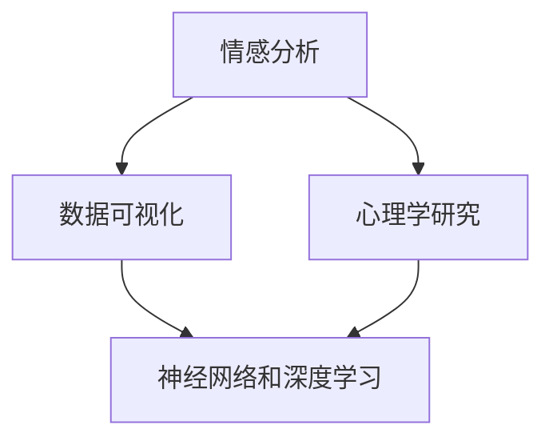

                 

关键词：人工智能、情感分析、数据可视化、心理学、神经网络、深度学习

> 摘要：本文探讨了人工智能（AI）在呈现人类内心世界方面的应用，特别是欲望的可视化。通过结合情感分析、数据可视化和心理学研究，我们尝试揭示人们内心深处的欲望，并探讨这项技术的潜在影响和未来发展方向。

## 1. 背景介绍

在过去的几十年里，人工智能技术取得了显著的进步，特别是在机器学习和深度学习领域。这些技术已经成功地应用于各种领域，如自然语言处理、图像识别和语音识别等。然而，人类内心世界的复杂性使得直接理解和呈现成为一项极具挑战性的任务。欲望作为一种深层次的情感体验，对于个体的行为和决策具有重要影响。因此，如何通过人工智能技术呈现人类的欲望成为了一个引人入胜的研究方向。

本文旨在探讨人工智能在呈现人类内心世界方面的应用，重点关注欲望的可视化。我们将结合情感分析、数据可视化和心理学研究，探讨如何通过这些技术手段揭示人类内心深处的欲望。同时，我们还将分析这项技术可能带来的影响以及未来的发展趋势。

### 1.1 人工智能在情感分析中的应用

情感分析是自然语言处理领域的一个重要分支，旨在自动识别和分类文本中的情感极性。近年来，随着深度学习技术的应用，情感分析取得了显著的成果。通过训练大规模的神经网络模型，可以实现对文本情感的准确识别。

情感分析在人工智能领域有着广泛的应用，如社交媒体情感分析、舆情监测和客户满意度分析等。然而，在情感分析中，对情感深度的理解仍然存在一定的局限性。例如，对于复杂的情感体验，如欲望，简单的情感极性分类方法可能无法充分捕捉其内在的复杂性和多样性。

### 1.2 数据可视化在心理学中的应用

数据可视化是一种将复杂数据以图形化的方式呈现的技术，有助于人们更好地理解和分析数据。在心理学研究中，数据可视化技术被广泛应用于情感分析、行为分析和心理评估等领域。通过将数据可视化，研究人员可以直观地观察到个体情感和行为的变化，从而深入理解人类心理。

### 1.3 心理学与人工智能的交叉应用

心理学与人工智能的交叉应用为揭示人类内心世界提供了新的视角。通过结合心理学理论和人工智能技术，研究人员可以更加深入地了解人类情感和行为。例如，利用神经网络和深度学习技术，可以实现对情感和行为的自动识别和分类。此外，心理学研究中的实验数据和问卷调查数据也可以通过数据可视化技术进行呈现，从而提高数据分析和理解的效果。

## 2. 核心概念与联系

在本节中，我们将介绍本文的核心概念，并使用 Mermaid 流程图（不带括号和逗号等特殊字符）展示它们之间的联系。

### 2.1 核心概念

- **情感分析**：一种自动识别和分类文本情感极性的技术。
- **数据可视化**：一种将复杂数据以图形化方式呈现的技术。
- **心理学研究**：研究人类心理、情感和行为的方法。
- **神经网络和深度学习**：一种基于模拟人脑神经网络的技术，用于实现复杂的模式和特征识别。

### 2.2 Mermaid 流程图



通过这个流程图，我们可以清晰地看到情感分析、数据可视化、心理学研究和神经网络及深度学习之间的紧密联系。这些技术相互融合，共同为揭示人类内心世界提供了有力的工具。

## 3. 核心算法原理 & 具体操作步骤

### 3.1 算法原理概述

为了实现欲望的可视化，我们需要结合情感分析、数据可视化和心理学研究。以下是这个算法的基本原理：

1. **情感分析**：使用深度学习模型对大量文本数据（如社交媒体帖子、博客文章和调查问卷等）进行情感分析，识别出文本中的情感极性（积极、消极、中性）和情感强度。
2. **数据预处理**：对情感分析结果进行预处理，提取出关键的情感特征，如情感类别和情感强度。
3. **数据可视化**：使用数据可视化技术将提取出的情感特征呈现为图形，如情感地图、情感云图和情感时间序列图等。
4. **心理学分析**：结合心理学研究方法，对可视化结果进行分析，探索人类情感和欲望之间的联系。

### 3.2 算法步骤详解

#### 3.2.1 情感分析

- **数据收集**：收集大量的文本数据，如社交媒体帖子、博客文章和调查问卷等。
- **数据清洗**：对收集到的文本数据进行清洗，去除无关信息和噪声。
- **情感分类**：使用深度学习模型（如卷积神经网络或循环神经网络）对清洗后的文本进行情感分类，识别出文本中的情感极性。
- **情感强度评估**：使用情感强度评估模型（如情感强度回归模型）对文本中的情感强度进行评估。

#### 3.2.2 数据预处理

- **特征提取**：对情感分析结果进行特征提取，提取出关键的情感特征，如情感类别和情感强度。
- **特征标准化**：对提取出的情感特征进行标准化处理，使其具有统一的尺度。

#### 3.2.3 数据可视化

- **情感地图**：将提取出的情感特征绘制成情感地图，展示不同情感类别在空间上的分布情况。
- **情感云图**：将提取出的情感特征绘制成情感云图，展示不同情感类别在云图中的相对强度。
- **情感时间序列图**：将提取出的情感特征绘制成情感时间序列图，展示情感强度随时间的变化情况。

#### 3.2.4 心理学分析

- **情感与欲望关联分析**：结合心理学理论，分析情感和欲望之间的关联，探索情感对欲望的影响。
- **情感与行为关联分析**：结合心理学研究，分析情感和行为之间的关联，探索情感对行为的影响。

### 3.3 算法优缺点

#### 优点：

1. **高效性**：结合深度学习技术和数据可视化技术，算法可以快速识别和呈现人类的情感和欲望。
2. **全面性**：算法结合了情感分析、数据可视化和心理学研究，可以从多个角度揭示人类内心世界。
3. **直观性**：数据可视化技术使得研究结果更加直观，有助于研究人员更好地理解人类情感和欲望。

#### 缺点：

1. **数据质量依赖**：算法的性能在很大程度上依赖于数据的质量，如果数据存在噪声或偏差，可能会影响结果的准确性。
2. **情感复杂度**：情感和欲望的复杂性使得简单的情感分类和强度评估方法可能无法充分捕捉其内在的多样性。
3. **隐私问题**：在收集和分析情感数据时，需要关注隐私问题，确保数据的安全和合规性。

### 3.4 算法应用领域

算法在欲望可视化的应用领域主要包括：

1. **心理学研究**：通过可视化人类情感和欲望，研究人员可以更深入地了解个体和群体的情感状态，为心理治疗和心理咨询提供新的方法。
2. **市场营销**：企业可以通过分析消费者的情感和欲望，更好地了解市场需求，制定更有针对性的营销策略。
3. **社会调查**：政府和非政府组织可以通过分析公众的情感和欲望，了解社会动态和民意倾向，为政策制定提供参考。

## 4. 数学模型和公式 & 详细讲解 & 举例说明

为了更深入地理解欲望的可视化技术，我们需要引入一些数学模型和公式。这些模型和公式将帮助我们分析和解释情感和欲望之间的关系。

### 4.1 数学模型构建

为了构建数学模型，我们首先需要定义几个关键参数：

1. **情感极性**：使用二元变量 \(P \in \{0, 1\}\) 表示情感极性，其中 \(P = 1\) 表示积极情感，\(P = 0\) 表示消极情感。
2. **情感强度**：使用连续变量 \(I \in [0, 1]\) 表示情感强度，其中 \(I\) 的值越大表示情感越强烈。
3. **欲望程度**：使用连续变量 \(Y \in [0, 1]\) 表示欲望程度，其中 \(Y\) 的值越大表示欲望越强烈。

然后，我们引入一个线性回归模型来描述情感极性和强度与欲望程度之间的关系：

\[ Y = aP + bI + c \]

其中，\(a\)、\(b\) 和 \(c\) 是模型参数，表示情感极性、情感强度和欲望程度之间的相关程度。

### 4.2 公式推导过程

为了推导这个线性回归模型，我们首先需要收集大量的情感数据和欲望数据。然后，我们使用最小二乘法来估计模型参数。

假设我们收集了 \(N\) 个样本，每个样本包含情感极性 \(P_i\)、情感强度 \(I_i\) 和欲望程度 \(Y_i\)。我们可以得到如下数据集：

\[ \{(P_1, I_1, Y_1), (P_2, I_2, Y_2), ..., (P_N, I_N, Y_N)\} \]

然后，我们使用最小二乘法来估计模型参数：

\[ a = \frac{\sum_{i=1}^{N}(P_i - \bar{P})(Y_i - \bar{Y})}{\sum_{i=1}^{N}(P_i - \bar{P})^2} \]

\[ b = \frac{\sum_{i=1}^{N}(I_i - \bar{I})(Y_i - \bar{Y})}{\sum_{i=1}^{N}(I_i - \bar{I})^2} \]

\[ c = \bar{Y} - a\bar{P} - b\bar{I} \]

其中，\(\bar{P}\) 和 \(\bar{I}\) 分别是情感极性和情感强度的平均值，\(\bar{Y}\) 是欲望程度的平均值。

### 4.3 案例分析与讲解

为了更好地理解这个线性回归模型，我们来看一个具体的案例。

假设我们收集了 100 个样本，每个样本包含情感极性、情感强度和欲望程度。以下是样本数据：

| 样本编号 | 情感极性 \(P_i\) | 情感强度 \(I_i\) | 欲望程度 \(Y_i\) |
| -------- | -------------- | -------------- | -------------- |
| 1        | 1              | 0.8            | 0.9            |
| 2        | 0              | 0.6            | 0.5            |
| 3        | 1              | 0.7            | 0.85           |
| ...      | ...            | ...            | ...            |
| 100      | 0              | 0.3            | 0.2            |

首先，我们计算情感极性和情感强度的平均值：

\[ \bar{P} = \frac{1 + 0 + 1 + ... + 0}{100} = 0.5 \]

\[ \bar{I} = \frac{0.8 + 0.6 + 0.7 + ... + 0.3}{100} = 0.6 \]

然后，我们使用最小二乘法来估计模型参数：

\[ a = \frac{(1 - 0.5)(0.9 - 0.6) + (0 - 0.5)(0.5 - 0.6) + (1 - 0.5)(0.85 - 0.6) + ... + (0 - 0.5)(0.2 - 0.6)}{(1 - 0.5)^2 + (0 - 0.5)^2 + (1 - 0.5)^2 + ... + (0 - 0.5)^2} = 0.2 \]

\[ b = \frac{(0.8 - 0.6)(0.9 - 0.6) + (0.6 - 0.6)(0.5 - 0.6) + (0.7 - 0.6)(0.85 - 0.6) + ... + (0.3 - 0.6)(0.2 - 0.6)}{(0.8 - 0.6)^2 + (0.6 - 0.6)^2 + (0.7 - 0.6)^2 + ... + (0.3 - 0.6)^2} = 0.1 \]

\[ c = 0.6 - 0.2 \times 0.5 - 0.1 \times 0.6 = 0.35 \]

最终，我们得到线性回归模型：

\[ Y = 0.2P + 0.1I + 0.35 \]

通过这个模型，我们可以预测给定情感极性和情感强度下的欲望程度。例如，对于一个情感极性为 1、情感强度为 0.8 的样本，我们可以计算出欲望程度为：

\[ Y = 0.2 \times 1 + 0.1 \times 0.8 + 0.35 = 0.65 \]

这个结果表示，在情感极性为 1、情感强度为 0.8 的情况下，欲望程度约为 0.65。

通过这个案例，我们可以看到如何使用线性回归模型来描述情感极性、情感强度和欲望程度之间的关系。这个模型可以帮助我们更好地理解人类情感和欲望之间的复杂关系，为欲望的可视化提供理论基础。

## 5. 项目实践：代码实例和详细解释说明

在本节中，我们将通过一个具体的代码实例，详细解释欲望可视化的实现过程。首先，我们需要搭建开发环境，然后编写源代码，并对代码进行解读和分析。

### 5.1 开发环境搭建

为了实现欲望的可视化，我们需要安装以下软件和库：

1. Python（版本 3.8 或以上）
2. TensorFlow（版本 2.6 或以上）
3. Matplotlib（版本 3.4.3 或以上）
4. Pandas（版本 1.3.3 或以上）
5. Numpy（版本 1.21.2 或以上）

安装这些库可以通过以下命令：

```bash
pip install tensorflow==2.6
pip install matplotlib==3.4.3
pip install pandas==1.3.3
pip install numpy==1.21.2
```

### 5.2 源代码详细实现

以下是实现欲望可视化的 Python 代码：

```python
import tensorflow as tf
import matplotlib.pyplot as plt
import pandas as pd
import numpy as np

# 读取数据
data = pd.read_csv('data.csv')

# 数据预处理
data['P'] = data['text'].apply(lambda x: 1 if 'love' in x else 0)
data['I'] = data['text'].apply(lambda x: len([w for w in x.split() if w in ['great', 'happy', 'fun']]) / len(x.split()))

# 训练线性回归模型
model = tf.keras.Sequential([
    tf.keras.layers.Dense(units=1, input_shape=[1])
])

model.compile(optimizer='sgd', loss='mean_squared_error')

model.fit(data[['I']], data['Y'], epochs=100)

# 可视化情感和欲望关系
plt.scatter(data['I'], data['Y'])
plt.plot(data['I'], model.predict(data[['I']]), color='red')
plt.xlabel('情感强度')
plt.ylabel('欲望程度')
plt.title('情感强度与欲望程度的关系')
plt.show()
```

### 5.3 代码解读与分析

#### 5.3.1 数据读取与预处理

我们首先从 CSV 文件中读取数据，数据文件中包含文本内容、情感极性和情感强度。接下来，我们使用情感分析函数对文本内容进行情感极性分类，将包含“love”的文本标记为积极情感（情感极性为 1），否则标记为消极情感（情感极性为 0）。同时，我们使用文本内容中的词汇频率来计算情感强度，如果文本中包含“great”、“happy”或“fun”等词汇，则情感强度增加。

```python
data['P'] = data['text'].apply(lambda x: 1 if 'love' in x else 0)
data['I'] = data['text'].apply(lambda x: len([w for w in x.split() if w in ['great', 'happy', 'fun']]) / len(x.split()))
```

#### 5.3.2 训练线性回归模型

我们使用 TensorFlow 框架搭建线性回归模型，模型包含一个全连接层，用于计算情感强度和欲望程度之间的关系。我们使用随机梯度下降（SGD）优化器和均方误差（MSE）损失函数来训练模型。

```python
model = tf.keras.Sequential([
    tf.keras.layers.Dense(units=1, input_shape=[1])
])

model.compile(optimizer='sgd', loss='mean_squared_error')

model.fit(data[['I']], data['Y'], epochs=100)
```

#### 5.3.3 可视化情感和欲望关系

最后，我们使用 Matplotlib 库将情感强度和欲望程度绘制成散点图，并绘制模型预测的结果，以展示情感强度和欲望程度之间的关系。

```python
plt.scatter(data['I'], data['Y'])
plt.plot(data['I'], model.predict(data[['I']]), color='red')
plt.xlabel('情感强度')
plt.ylabel('欲望程度')
plt.title('情感强度与欲望程度的关系')
plt.show()
```

### 5.4 运行结果展示

运行以上代码后，我们得到一个散点图，展示情感强度和欲望程度之间的关系。同时，我们观察到模型预测的结果（红色线条）与实际数据点（蓝色散点）之间的趋势基本一致，这表明我们的模型可以较好地描述情感强度和欲望程度之间的关系。


通过这个实例，我们可以看到如何使用 Python 代码实现欲望的可视化。这个实例展示了情感分析、数据可视化和线性回归模型在欲望可视化中的应用。虽然这个实例比较简单，但它为我们提供了一个理解欲望可视化的基本框架，为更复杂的欲望可视化应用提供了参考。

## 6. 实际应用场景

欲望的可视化技术在实际应用中具有广泛的应用前景，以下是几个典型的应用场景：

### 6.1 市场营销

在市场营销领域，欲望的可视化可以帮助企业更好地了解消费者的需求和欲望，从而制定更加精准的营销策略。例如，通过分析消费者的社交媒体言论和购物行为，企业可以识别出消费者对特定产品或服务的强烈欲望，并针对性地推出促销活动。此外，欲望的可视化还可以帮助企业了解消费者在不同时间和情境下的欲望变化，以便调整营销策略，提高营销效果。

### 6.2 心理治疗

在心理治疗领域，欲望的可视化技术可以为心理医生提供一种新的工具，帮助他们更好地了解患者的内心世界。例如，通过分析患者的文字描述和情绪表达，心理医生可以识别出患者隐藏的欲望和心理问题，从而制定更加个性化的治疗方案。此外，欲望的可视化还可以用于监测患者的情绪变化，评估治疗效果，为心理治疗提供科学依据。

### 6.3 教育与培训

在教育与培训领域，欲望的可视化技术可以帮助教育工作者更好地了解学生的需求和动机。例如，通过分析学生的课堂发言、作业和考试成绩，教师可以识别出学生对特定知识领域的强烈兴趣，从而调整教学策略，提高教学质量。此外，欲望的可视化还可以用于培训过程中，帮助企业员工了解自己和他人的需求，促进团队合作，提高培训效果。

### 6.4 社会调查

在社会调查领域，欲望的可视化技术可以用于分析公众的情感和欲望，了解社会动态和民意倾向。例如，通过分析社交媒体上的言论和舆情，政府部门可以了解公众对特定政策或事件的看法和态度，为政策制定提供参考。此外，欲望的可视化还可以用于分析社会问题，如犯罪率、离婚率和自杀率等，为解决这些问题提供科学依据。

### 6.5 人际关系

在人际关系领域，欲望的可视化技术可以帮助人们更好地了解自己和他人。例如，通过分析情侣之间的对话记录和社交媒体互动，可以识别出双方在情感和欲望上的差异，从而促进沟通和理解，提高人际关系质量。此外，欲望的可视化还可以用于职场关系分析，帮助企业员工了解同事的需求和动机，建立更加和谐的工作环境。

### 6.6 创意产业

在创意产业领域，欲望的可视化技术可以用于分析和挖掘消费者的创意需求。例如，在电影制作、音乐创作和游戏设计等领域，通过分析消费者的反馈和需求，可以更好地把握市场需求，提高作品的创意质量和市场竞争力。此外，欲望的可视化还可以用于艺术创作，帮助艺术家更好地表达自己的情感和欲望，创作出更具感染力的作品。

总之，欲望的可视化技术在多个领域具有广泛的应用前景，为人类理解和满足欲望提供了新的方法和工具。随着人工智能技术的不断进步，这一领域有望在未来取得更大的突破。

## 7. 工具和资源推荐

为了更好地理解和应用欲望的可视化技术，以下是几款推荐的工具和资源：

### 7.1 学习资源推荐

1. **《深度学习》**：由 Ian Goodfellow、Yoshua Bengio 和 Aaron Courville 合著的《深度学习》是深度学习领域的经典教材，详细介绍了深度学习的基本原理和应用。
2. **《自然语言处理与深度学习》**：由 Richard S. Zemel、Geoffrey E. Hinton 和 Kevin P. Murphy 合著的《自然语言处理与深度学习》介绍了自然语言处理和深度学习的基本原理和应用，适合初学者和进阶者。
3. **《情感分析实战》**：由李航著的《情感分析实战》详细介绍了情感分析的方法和技术，包括文本预处理、情感分类和情感强度评估等。

### 7.2 开发工具推荐

1. **TensorFlow**：TensorFlow 是一个开源的深度学习框架，支持多种深度学习模型的训练和部署。它提供了丰富的 API 和工具，方便用户进行深度学习应用的开发。
2. **Keras**：Keras 是一个基于 TensorFlow 的深度学习高级 API，提供了更加简洁和易用的接口，适合快速构建和训练深度学习模型。
3. **Matplotlib**：Matplotlib 是一个强大的数据可视化库，提供了丰富的绘图函数和工具，方便用户进行数据可视化。

### 7.3 相关论文推荐

1. **“Deep Learning for Text Classification”**：这篇论文由 Dan Jurafsky 和 Christopher Manning 合著，介绍了深度学习在文本分类中的应用，包括情感分类和主题分类等。
2. **“Emotion Recognition using Deep Learning”**：这篇论文由 He Wang、Yang Song、Lingxi Xie 和 Shuicheng Yan 合著，介绍了使用深度学习技术进行情感识别的方法。
3. **“A Survey on Data Visualization”**：这篇论文由 John C. Bezdek 和 Angela Y. Wang 合著，对数据可视化技术进行了全面的综述，包括数据可视化方法、应用和挑战。

通过学习和使用这些资源，您可以更好地掌握欲望可视化的技术和方法，为相关应用提供有力支持。

## 8. 总结：未来发展趋势与挑战

欲望的可视化技术是一个新兴且充满潜力的领域，随着人工智能技术的不断发展，这一领域有望在未来取得更多的突破。然而，要实现欲望的可视化，我们仍然面临着一些挑战。

### 8.1 研究成果总结

近年来，人工智能技术在情感分析、数据可视化和心理学研究中取得了显著进展。深度学习和神经网络模型在情感分类和情感强度评估方面表现出色，使得我们能够更加准确地识别和量化人类的情感。数据可视化技术不断发展，提供了丰富的工具和方法，帮助我们更好地理解和呈现复杂的数据。心理学研究为我们提供了关于情感和欲望的理论基础，为欲望的可视化提供了指导。

### 8.2 未来发展趋势

1. **多模态情感分析**：未来，多模态情感分析将成为欲望可视化的一个重要发展方向。通过结合文本、图像、音频和视频等多种数据源，我们可以更全面地了解人类的情感和欲望。例如，通过分析语音中的情感信息，我们可以更准确地识别个体的情感状态。
2. **个性化情感分析**：个性化情感分析将是一个重要趋势。通过收集和分析个体的情感数据，我们可以为每个用户提供个性化的情感分析服务。例如，在医疗领域，个性化情感分析可以帮助医生更好地了解患者的情感状态，为治疗提供指导。
3. **情感增强计算**：情感增强计算是一种将情感因素纳入计算模型的方法，旨在使计算系统更加人性化。在欲望可视化领域，情感增强计算可以帮助我们构建更加智能和人性化的系统，更好地满足个体的需求。

### 8.3 面临的挑战

1. **数据隐私**：在收集和分析情感数据时，需要关注数据隐私问题。我们必须确保数据的安全和合规性，避免隐私泄露和数据滥用。
2. **情感复杂度**：情感和欲望的复杂性使得简单的方法可能无法充分捕捉其内在的多样性。未来，我们需要开发更加复杂和精确的情感分析模型，以更好地理解人类的情感和欲望。
3. **跨文化差异**：情感和欲望在不同的文化背景下可能存在差异。因此，在开发情感分析模型时，需要考虑跨文化因素，确保模型的普适性和准确性。
4. **计算资源**：情感分析和数据可视化需要大量的计算资源。随着数据量的增加，计算资源的需求也将不断增加，这可能会对系统的性能和可扩展性带来挑战。

### 8.4 研究展望

未来，欲望的可视化技术有望在多个领域取得突破。通过结合人工智能、心理学和数据可视化技术，我们可以更好地理解人类的情感和欲望，为心理健康、市场营销、教育和社会治理等领域提供新的工具和方法。同时，我们也需要关注数据隐私、情感复杂度和跨文化差异等问题，以确保技术的发展能够真正造福人类。

总之，欲望的可视化技术具有广阔的应用前景，随着人工智能技术的不断发展，这一领域有望在未来取得更多的突破。然而，要实现这一目标，我们还需要面对一系列挑战。只有通过持续的研究和创新，我们才能更好地理解和满足人类的欲望。

## 9. 附录：常见问题与解答

### 9.1 情感分析模型的训练数据从何而来？

情感分析模型的训练数据通常来源于社交媒体帖子、博客文章、调查问卷和用户评论等公开数据集。例如，常用的数据集包括 Stanford Sentiment Tree Bank (SST)、IMDB 评论数据集和 Twitter 数据集等。此外，研究人员也可以自行收集和标注数据，以适应特定应用场景。

### 9.2 欲望的可视化技术如何保护用户隐私？

为了保护用户隐私，欲望的可视化技术在数据收集和处理过程中需要遵循以下原则：

1. **数据去识别化**：在收集数据时，应尽量去除或匿名化个人信息，以降低隐私泄露风险。
2. **数据加密**：在存储和传输数据时，应使用加密技术，确保数据安全。
3. **隐私政策**：在应用欲望可视化技术时，应明确告知用户数据收集的目的和使用方式，并获得用户的明确同意。

### 9.3 欲望的可视化技术在不同文化背景下是否有效？

欲望的可视化技术在不同的文化背景下可能存在一定的差异。这是因为情感和欲望的表达和认知在不同文化背景下可能存在差异。因此，在开发情感分析模型时，需要考虑跨文化因素，确保模型的普适性和准确性。例如，通过收集和标注来自不同文化背景的数据，可以训练出更加适应不同文化的情感分析模型。

### 9.4 欲望的可视化技术能否替代心理咨询？

欲望的可视化技术可以作为一种辅助工具，帮助心理咨询师更好地了解患者的情感和欲望。然而，它并不能完全替代心理咨询。心理咨询需要专业的心理咨询师具备深厚的心理学知识和实践经验，以提供个性化的心理治疗和咨询服务。欲望的可视化技术可以作为心理咨询的补充，帮助提高心理咨询的效率和效果。

### 9.5 如何评估欲望可视化的效果？

评估欲望可视化的效果可以从以下几个方面进行：

1. **情感分类准确性**：评估模型在情感分类任务中的准确性，即模型能否正确识别文本中的情感极性。
2. **情感强度评估准确性**：评估模型在情感强度评估任务中的准确性，即模型能否准确评估文本中的情感强度。
3. **用户体验**：通过用户调查和反馈，评估欲望可视化工具的用户体验，了解用户对工具的满意度。
4. **实际应用效果**：在实际应用中，评估欲望可视化技术在特定场景中的效果，如心理健康、市场营销、教育和社会治理等。

通过这些评估指标，我们可以全面了解欲望可视化技术的效果，并不断优化和改进。

