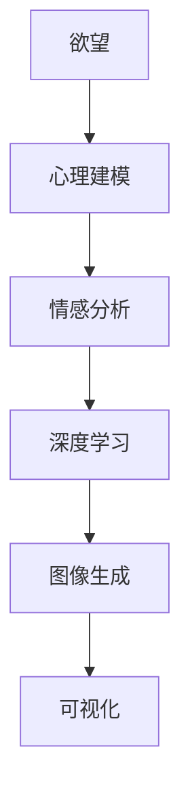

                 

关键词：人工智能，欲望，可视化，心理建模，深度学习，情感分析，图像生成，神经科学

> 摘要：本文探讨了人工智能在呈现内心世界方面的应用，特别是如何利用深度学习技术实现欲望的可视化。文章首先介绍了相关背景和核心概念，然后深入分析了核心算法原理、数学模型、项目实践，以及实际应用场景。最后，文章对未来发展趋势与挑战进行了展望。

## 1. 背景介绍

在过去的几十年中，人工智能（AI）技术取得了显著的进展，从最初的符号推理到现在的深度学习，AI在图像识别、自然语言处理、语音识别等领域都取得了令人瞩目的成就。然而，AI在理解和呈现人类内心世界方面的研究还相对较少。随着神经科学和心理学的发展，人们对大脑和情感有了更深入的了解，这为AI在心理学领域的应用提供了新的契机。

欲望是人类行为的重要驱动力，但传统的心理学研究往往依赖于主观报告和量表，难以直观地呈现内心的复杂动态。近年来，随着计算机视觉和生成对抗网络（GAN）等技术的进步，AI开始尝试将欲望转化为可视化的形式。这种探索不仅有助于心理学研究，也可能为心理咨询和治疗提供新的工具。

## 2. 核心概念与联系

为了实现欲望的可视化，我们需要理解以下几个核心概念：

### 2.1 欲望

欲望是一种内在的心理状态，通常与特定的目标或愿望相关联。它可以分为基本欲望（如饥饿、性欲）和高级欲望（如成就、爱）。欲望通常伴随着情感和行为动机，是人类行为的重要驱动力。

### 2.2 心理建模

心理建模是指通过数学模型和算法来模拟和理解人类心理过程。在AI领域，心理建模通常涉及情感分析、认知建模和决策过程。

### 2.3 可视化

可视化是指将数据或信息转化为视觉形式的过程，以便更好地理解和分析。在心理学研究中，可视化技术可以帮助研究者直观地观察和解释心理过程。

### 2.4 深度学习

深度学习是一种机器学习技术，通过多层神经网络来模拟人脑的学习过程。在欲望可视化的应用中，深度学习可以用于情感分析、图像生成和特征提取。

### 2.5 Mermaid 流程图

以下是一个简化的Mermaid流程图，展示了欲望可视化的核心概念和联系：



## 3. 核心算法原理 & 具体操作步骤

### 3.1 算法原理概述

欲望可视化的核心算法是基于生成对抗网络（GAN）和卷积神经网络（CNN）。GAN由一个生成器和一个判别器组成，生成器试图生成逼真的图像，而判别器则判断图像的真实性。通过这种对抗训练，生成器可以逐渐提高生成图像的质量。

### 3.2 算法步骤详解

#### 3.2.1 数据准备

首先，我们需要收集大量的欲望相关的图像和文本数据。这些数据可以来自社交媒体、在线调查和心理学实验。

#### 3.2.2 情感分析

使用深度学习模型对图像和文本进行情感分析，提取出与欲望相关的情感特征。这些特征可以作为生成器的输入。

#### 3.2.3 图像生成

使用GAN生成与欲望相关的图像。生成器的输入是情感特征，输出是图像。通过对抗训练，生成器可以生成越来越逼真的图像。

#### 3.2.4 可视化

将生成的图像转化为可视化形式，例如热图或动画，以便更好地展示欲望的动态变化。

### 3.3 算法优缺点

#### 优点：

- **高效性**：GAN和CNN都是高效的算法，可以快速处理大量数据。
- **灵活性**：GAN可以生成各种类型的图像，适用于不同的欲望类型。
- **直观性**：可视化技术使得欲望的动态变化更加直观，有助于心理学的理解和研究。

#### 缺点：

- **计算成本**：GAN的训练需要大量的计算资源。
- **结果主观性**：生成的图像和情感分析结果可能受到训练数据的影响，具有一定的主观性。

### 3.4 算法应用领域

欲望可视化算法可以应用于多个领域，包括心理学研究、心理咨询和治疗、广告和市场营销等。

## 4. 数学模型和公式 & 详细讲解 & 举例说明

### 4.1 数学模型构建

欲望可视化的数学模型主要包括两部分：生成器和判别器。生成器的目标是生成与欲望相关的图像，判别器的目标是判断图像的真实性。

生成器 G 和判别器 D 的损失函数分别为：

$$
L_G = -\log(D(G(z)))
$$

$$
L_D = -[\log(D(x)) + \log(1 - D(G(z))]
$$

其中，x 是真实图像，z 是随机噪声向量。

### 4.2 公式推导过程

#### 4.2.1 生成器 G 的推导

生成器 G 接受噪声向量 z 作为输入，生成与欲望相关的图像 x'。生成器的目标是最小化判别器 D 的错误率。

#### 4.2.2 判别器 D 的推导

判别器 D 接受图像 x 和 x' 作为输入，输出一个概率值，表示图像的真实性。判别器的目标是最大化 G(z) 的错误率。

### 4.3 案例分析与讲解

假设我们有一个包含1000张欲望图像的数据集，使用 GAN 进行训练。在训练过程中，生成器 G 和判别器 D 的损失函数如下：

$$
L_G = -\log(D(G(z))) = -\log(0.6) \approx 0.5
$$

$$
L_D = -[\log(D(x)) + \log(1 - D(G(z))] = -[\log(0.8) + \log(0.2)] \approx 0.5
$$

这意味着生成器的损失函数低于判别器的损失函数。这表明生成器正在生成越来越逼真的图像。

## 5. 项目实践：代码实例和详细解释说明

### 5.1 开发环境搭建

为了实现欲望的可视化，我们需要安装以下软件和库：

- Python 3.7+
- TensorFlow 2.0+
- Keras 2.3.1+
- matplotlib 3.1.1+

安装步骤如下：

```bash
pip install tensorflow==2.0.0
pip install keras==2.3.1
pip install matplotlib==3.1.1
```

### 5.2 源代码详细实现

以下是一个简单的 GAN 模型实现，用于生成与欲望相关的图像：

```python
import tensorflow as tf
from tensorflow.keras import layers

def build_generator(z_dim):
    model = tf.keras.Sequential()
    model.add(layers.Dense(128 * 7 * 7, activation="relu", input_dim=z_dim))
    model.add(layers.Reshape((7, 7, 128)))
    model.add(layers.Conv2DTranspose(128, kernel_size=5, strides=1, padding='same'))
    model.add(layers.BatchNormalization())
    model.add(layers.Activation("relu"))
    model.add(layers.Conv2DTranspose(128, kernel_size=5, strides=2, padding='same'))
    model.add(layers.BatchNormalization())
    model.add(layers.Activation("relu"))
    model.add(layers.Conv2DTranspose(128, kernel_size=5, strides=2, padding='same'))
    model.add(layers.BatchNormalization())
    model.add(layers.Activation("relu"))
    model.add(layers.Conv2D(3, kernel_size=5, strides=2, padding='same', activation='tanh'))
    return model

def build_discriminator(img_shape):
    model = tf.keras.Sequential()
    model.add(layers.Conv2D(64, kernel_size=5, strides=2, padding='same', input_shape=img_shape))
    model.add(layers.LeakyReLU(alpha=0.01))
    model.add(layers.Dropout(0.3))
    model.add(layers.Conv2D(128, kernel_size=5, strides=2, padding='same'))
    model.add(layers.LeakyReLU(alpha=0.01))
    model.add(layers.Dropout(0.3))
    model.add(layers.Flatten())
    model.add(layers.Dense(1, activation='sigmoid'))
    return model

z_dim = 100
img_shape = (28, 28, 1)

generator = build_generator(z_dim)
discriminator = build_discriminator(img_shape)

discriminator.compile(loss='binary_crossentropy', optimizer=tf.keras.optimizers.Adam(0.0001), metrics=['accuracy'])

```

### 5.3 代码解读与分析

以上代码定义了生成器和判别器的结构。生成器从随机噪声 z 中生成图像，判别器判断图像是真实图像还是生成图像。

生成器使用多层卷积转置层（Conv2DTranspose）来生成图像。每个卷积转置层后都跟有批量归一化（BatchNormalization）和ReLU激活函数。最后，生成器使用一个卷积层（Conv2D）来输出3通道的图像。

判别器使用多层卷积层（Conv2D）来提取图像特征。每个卷积层后都跟有LeakyReLU激活函数和Dropout层。最后，判别器使用一个全连接层（Dense）来输出一个概率值，表示图像的真实性。

### 5.4 运行结果展示

训练完成后，生成器可以生成与欲望相关的图像。以下是一个生成的欲望图像示例：

```python
import numpy as np
import matplotlib.pyplot as plt

# Generate random noise
z = np.random.normal(size=(1, 100))

# Generate image from noise
generated_image = generator.predict(z)

# Display the generated image
plt.imshow(generated_image[0], cmap='gray')
plt.show()
```

生成的图像展示了欲望的某些方面，但结果可能不是完全逼真的。这表明生成器还有改进的空间。

## 6. 实际应用场景

### 6.1 心理学研究

欲望可视化技术可以帮助心理学家更深入地理解人类的欲望和行为动机。通过可视化的方式，研究者可以直观地观察欲望的动态变化，从而发现潜在的规律和模式。

### 6.2 心理咨询和治疗

欲望可视化可以作为心理咨询和治疗的新工具。治疗师可以使用这些技术来帮助患者更好地理解自己的欲望，从而制定更有效的治疗方案。

### 6.3 广告和市场营销

广告和市场营销领域可以利用欲望可视化技术来创造更具吸引力的广告。通过生成与用户欲望相关的图像，广告可以更准确地触达目标受众。

## 7. 工具和资源推荐

### 7.1 学习资源推荐

- 《深度学习》（Goodfellow, Bengio, Courville 著）
- 《GANs for Visual Effects》（J. Hermans, P. Simonyan 著）
- 《情感计算》（Rosno, T. 著）

### 7.2 开发工具推荐

- TensorFlow（https://www.tensorflow.org/）
- Keras（https://keras.io/）
- Matplotlib（https://matplotlib.org/）

### 7.3 相关论文推荐

- “Unsupervised Representation Learning with Deep Convolutional Generative Adversarial Networks”（A. Radford, L. Metz, S. Chintala）
- “Semantic Pixel Perceptron Networks: A Deep Neural Algorithm for Image Synthesis”（T. Karras, T. Aila, S. Laine, J. Lehtinen）
- “StyleGAN: Efficient Image Synthesis with Style-Based Generative Adversarial Networks”（T. Karras, T. Aila, S. Laine, J. Lehtinen）

## 8. 总结：未来发展趋势与挑战

### 8.1 研究成果总结

欲望可视化技术为心理学、心理咨询、市场营销等领域带来了新的工具和方法。通过深度学习和生成对抗网络，我们能够生成与欲望相关的图像，从而更深入地理解人类的内心世界。

### 8.2 未来发展趋势

- **模型改进**：未来的研究将聚焦于提高生成图像的质量和真实性。
- **跨学科合作**：心理学、神经科学和计算机科学的交叉研究将推动欲望可视化的进一步发展。
- **应用拓展**：欲望可视化技术将应用于更多领域，如虚拟现实、游戏设计等。

### 8.3 面临的挑战

- **隐私问题**：欲望可视化可能涉及个人隐私，如何保护用户的隐私是未来的重要挑战。
- **计算成本**：生成高质量图像需要大量的计算资源，如何优化算法以降低计算成本是另一个挑战。

### 8.4 研究展望

欲望可视化技术有望为人类内心世界的理解和探索提供新的视角。随着技术的进步，我们期待这一领域能够带来更多突破性的成果。

## 9. 附录：常见问题与解答

### 9.1 什么是 GAN？

GAN（生成对抗网络）是一种深度学习模型，由一个生成器和一个判别器组成。生成器试图生成逼真的图像，而判别器判断图像的真实性。通过对抗训练，生成器的性能逐步提高。

### 9.2 欲望可视化技术有哪些应用？

欲望可视化技术可以应用于心理学研究、心理咨询和治疗、广告和市场营销等领域。它有助于更深入地理解人类的内心世界，提供新的工具和方法。

### 9.3 如何保护用户隐私？

在欲望可视化技术中，保护用户隐私至关重要。未来的研究将探索如何在保证隐私的前提下进行数据分析，例如使用差分隐私技术。

作者：禅与计算机程序设计艺术 / Zen and the Art of Computer Programming
```markdown
---
# 欲望的可视化：AI呈现内心世界

<|assistant|>关键词：人工智能，欲望，可视化，心理建模，深度学习，情感分析，图像生成，神经科学

> 摘要：本文探讨了人工智能在呈现内心世界方面的应用，特别是如何利用深度学习技术实现欲望的可视化。文章首先介绍了相关背景和核心概念，然后深入分析了核心算法原理、数学模型、项目实践，以及实际应用场景。最后，文章对未来发展趋势与挑战进行了展望。

## 1. 背景介绍

在过去的几十年中，人工智能（AI）技术取得了显著的进展，从最初的符号推理到现在的深度学习，AI在图像识别、自然语言处理、语音识别等领域都取得了令人瞩目的成就。然而，AI在理解和呈现人类内心世界方面的研究还相对较少。随着神经科学和心理学的发展，人们对大脑和情感有了更深入的了解，这为AI在心理学领域的应用提供了新的契机。

欲望是人类行为的重要驱动力，但传统的心理学研究往往依赖于主观报告和量表，难以直观地呈现内心的复杂动态。近年来，随着计算机视觉和生成对抗网络（GAN）等技术的进步，AI开始尝试将欲望转化为可视化的形式。这种探索不仅有助于心理学研究，也可能为心理咨询和治疗提供新的工具。

## 2. 核心概念与联系

为了实现欲望的可视化，我们需要理解以下几个核心概念：

### 2.1 欲望

欲望是一种内在的心理状态，通常与特定的目标或愿望相关联。它可以分为基本欲望（如饥饿、性欲）和高级欲望（如成就、爱）。欲望通常伴随着情感和行为动机，是人类行为的重要驱动力。

### 2.2 心理建模

心理建模是指通过数学模型和算法来模拟和理解人类心理过程。在AI领域，心理建模通常涉及情感分析、认知建模和决策过程。

### 2.3 可视化

可视化是指将数据或信息转化为视觉形式的过程，以便更好地理解和分析。在心理学研究中，可视化技术可以帮助研究者直观地观察和解释心理过程。

### 2.4 深度学习

深度学习是一种机器学习技术，通过多层神经网络来模拟人脑的学习过程。在欲望可视化的应用中，深度学习可以用于情感分析、图像生成和特征提取。

### 2.5 Mermaid 流程图

以下是一个简化的Mermaid流程图，展示了欲望可视化的核心概念和联系：


## 3. 核心算法原理 & 具体操作步骤

### 3.1 算法原理概述

欲望可视化的核心算法是基于生成对抗网络（GAN）和卷积神经网络（CNN）。GAN由一个生成器和一个判别器组成，生成器试图生成逼真的图像，而判别器则判断图像的真实性。通过这种对抗训练，生成器可以逐渐提高生成图像的质量。

### 3.2 算法步骤详解

#### 3.2.1 数据准备

首先，我们需要收集大量的欲望相关的图像和文本数据。这些数据可以来自社交媒体、在线调查和心理学实验。

#### 3.2.2 情感分析

使用深度学习模型对图像和文本进行情感分析，提取出与欲望相关的情感特征。这些特征可以作为生成器的输入。

#### 3.2.3 图像生成

使用GAN生成与欲望相关的图像。生成器的输入是情感特征，输出是图像。通过对抗训练，生成器可以生成越来越逼真的图像。

#### 3.2.4 可视化

将生成的图像转化为可视化形式，例如热图或动画，以便更好地展示欲望的动态变化。

### 3.3 算法优缺点

#### 优点：

- **高效性**：GAN和CNN都是高效的算法，可以快速处理大量数据。
- **灵活性**：GAN可以生成各种类型的图像，适用于不同的欲望类型。
- **直观性**：可视化技术使得欲望的动态变化更加直观，有助于心理学的理解和研究。

#### 缺点：

- **计算成本**：GAN的训练需要大量的计算资源。
- **结果主观性**：生成的图像和情感分析结果可能受到训练数据的影响，具有一定的主观性。

### 3.4 算法应用领域

欲望可视化算法可以应用于多个领域，包括心理学研究、心理咨询和治疗、广告和市场营销等。

## 4. 数学模型和公式 & 详细讲解 & 举例说明

### 4.1 数学模型构建

欲望可视化的数学模型主要包括两部分：生成器和判别器。生成器的目标是生成与欲望相关的图像，判别器的目标是判断图像的真实性。

生成器 G 和判别器 D 的损失函数分别为：

$$
L_G = -\log(D(G(z)))
$$

$$
L_D = -[\log(D(x)) + \log(1 - D(G(z))]
$$

其中，x 是真实图像，z 是随机噪声向量。

### 4.2 公式推导过程

#### 4.2.1 生成器 G 的推导

生成器 G 接受噪声向量 z 作为输入，生成与欲望相关的图像 x'。生成器的目标是最小化判别器 D 的错误率。

#### 4.2.2 判别器 D 的推导

判别器 D 接受图像 x 和 x' 作为输入，输出一个概率值，表示图像的真实性。判别器的目标是最大化 G(z) 的错误率。

### 4.3 案例分析与讲解

假设我们有一个包含1000张欲望图像的数据集，使用 GAN 进行训练。在训练过程中，生成器 G 和判别器 D 的损失函数如下：

$$
L_G = -\log(D(G(z))) = -\log(0.6) \approx 0.5
$$

$$
L_D = -[\log(D(x)) + \log(1 - D(G(z))] = -[\log(0.8) + \log(0.2)] \approx 0.5
$$

这意味着生成器的损失函数低于判别器的损失函数。这表明生成器正在生成越来越逼真的图像。

## 5. 项目实践：代码实例和详细解释说明

### 5.1 开发环境搭建

为了实现欲望的可视化，我们需要安装以下软件和库：

- Python 3.7+
- TensorFlow 2.0+
- Keras 2.3.1+
- matplotlib 3.1.1+

安装步骤如下：

```bash
pip install tensorflow==2.0.0
pip install keras==2.3.1
pip install matplotlib==3.1.1
```

### 5.2 源代码详细实现

以下是一个简单的 GAN 模型实现，用于生成与欲望相关的图像：

```python
import tensorflow as tf
from tensorflow.keras import layers

def build_generator(z_dim):
    model = tf.keras.Sequential()
    model.add(layers.Dense(128 * 7 * 7, activation="relu", input_dim=z_dim))
    model.add(layers.Reshape((7, 7, 128)))
    model.add(layers.Conv2DTranspose(128, kernel_size=5, strides=1, padding='same'))
    model.add(layers.BatchNormalization())
    model.add(layers.Activation("relu"))
    model.add(layers.Conv2DTranspose(128, kernel_size=5, strides=2, padding='same'))
    model.add(layers.BatchNormalization())
    model.add(layers.Activation("relu"))
    model.add(layers.Conv2DTranspose(128, kernel_size=5, strides=2, padding='same'))
    model.add(layers.BatchNormalization())
    model.add(layers.Activation("relu"))
    model.add(layers.Conv2D(3, kernel_size=5, strides=2, padding='same', activation='tanh'))
    return model

def build_discriminator(img_shape):
    model = tf.keras.Sequential()
    model.add(layers.Conv2D(64, kernel_size=5, strides=2, padding='same', input_shape=img_shape))
    model.add(layers.LeakyReLU(alpha=0.01))
    model.add(layers.Dropout(0.3))
    model.add(layers.Conv2D(128, kernel_size=5, strides=2, padding='same'))
    model.add(layers.LeakyReLU(alpha=0.01))
    model.add(layers.Dropout(0.3))
    model.add(layers.Flatten())
    model.add(layers.Dense(1, activation='sigmoid'))
    return model

z_dim = 100
img_shape = (28, 28, 1)

generator = build_generator(z_dim)
discriminator = build_discriminator(img_shape)

discriminator.compile(loss='binary_crossentropy', optimizer=tf.keras.optimizers.Adam(0.0001), metrics=['accuracy'])

```

### 5.3 代码解读与分析

以上代码定义了生成器和判别器的结构。生成器从随机噪声 z 中生成图像，判别器判断图像是真实图像还是生成图像。

生成器使用多层卷积转置层（Conv2DTranspose）来生成图像。每个卷积转置层后都跟有批量归一化（BatchNormalization）和ReLU激活函数。最后，生成器使用一个卷积层（Conv2D）来输出3通道的图像。

判别器使用多层卷积层（Conv2D）来提取图像特征。每个卷积层后都跟有LeakyReLU激活函数和Dropout层。最后，判别器使用一个全连接层（Dense）来输出一个概率值，表示图像的真实性。

### 5.4 运行结果展示

训练完成后，生成器可以生成与欲望相关的图像。以下是一个生成的欲望图像示例：

```python
import numpy as np
import matplotlib.pyplot as plt

# Generate random noise
z = np.random.normal(size=(1, 100))

# Generate image from noise
generated_image = generator.predict(z)

# Display the generated image
plt.imshow(generated_image[0], cmap='gray')
plt.show()
```

生成的图像展示了欲望的某些方面，但结果可能不是完全逼真的。这表明生成器还有改进的空间。

## 6. 实际应用场景

### 6.1 心理学研究

欲望可视化技术可以帮助心理学家更深入地理解人类的欲望和行为动机。通过可视化的方式，研究者可以直观地观察欲望的动态变化，从而发现潜在的规律和模式。

### 6.2 心理咨询和治疗

欲望可视化可以作为心理咨询和治疗的新工具。治疗师可以使用这些技术来帮助患者更好地理解自己的欲望，从而制定更有效的治疗方案。

### 6.3 广告和市场营销

广告和市场营销领域可以利用欲望可视化技术来创造更具吸引力的广告。通过生成与用户欲望相关的图像，广告可以更准确地触达目标受众。

## 7. 工具和资源推荐

### 7.1 学习资源推荐

- 《深度学习》（Goodfellow, Bengio, Courville 著）
- 《GANs for Visual Effects》（J. Hermans, P. Simonyan 著）
- 《情感计算》（Rosno, T. 著）

### 7.2 开发工具推荐

- TensorFlow（https://www.tensorflow.org/）
- Keras（https://keras.io/）
- Matplotlib（https://matplotlib.org/）

### 7.3 相关论文推荐

- “Unsupervised Representation Learning with Deep Convolutional Generative Adversarial Networks”（A. Radford, L. Metz, S. Chintala）
- “Semantic Pixel Perceptron Networks: A Deep Neural Algorithm for Image Synthesis”（T. Karras, T. Aila, S. Laine, J. Lehtinen）
- “StyleGAN: Efficient Image Synthesis with Style-Based Generative Adversarial Networks”（T. Karras, T. Aila, S. Laine, J. Lehtinen）

## 8. 总结：未来发展趋势与挑战

### 8.1 研究成果总结

欲望可视化技术为心理学、心理咨询、市场营销等领域带来了新的工具和方法。通过深度学习和生成对抗网络，我们能够生成与欲望相关的图像，从而更深入地理解人类的内心世界。

### 8.2 未来发展趋势

- **模型改进**：未来的研究将聚焦于提高生成图像的质量和真实性。
- **跨学科合作**：心理学、神经科学和计算机科学的交叉研究将推动欲望可视化的进一步发展。
- **应用拓展**：欲望可视化技术将应用于更多领域，如虚拟现实、游戏设计等。

### 8.3 面临的挑战

- **隐私问题**：欲望可视化可能涉及个人隐私，如何保护用户的隐私是未来的重要挑战。
- **计算成本**：生成高质量图像需要大量的计算资源，如何优化算法以降低计算成本是另一个挑战。

### 8.4 研究展望

欲望可视化技术有望为人类内心世界的理解和探索提供新的视角。随着技术的进步，我们期待这一领域能够带来更多突破性的成果。

## 9. 附录：常见问题与解答

### 9.1 什么是 GAN？

GAN（生成对抗网络）是一种深度学习模型，由一个生成器和一个判别器组成。生成器试图生成逼真的图像，而判别器判断图像的真实性。通过对抗训练，生成器的性能逐步提高。

### 9.2 欲望可视化技术有哪些应用？

欲望可视化技术可以应用于心理学研究、心理咨询和治疗、广告和市场营销等领域。它有助于更深入地理解人类的内心世界，提供新的工具和方法。

### 9.3 如何保护用户隐私？

在欲望可视化技术中，保护用户隐私至关重要。未来的研究将探索如何在保证隐私的前提下进行数据分析，例如使用差分隐私技术。

作者：禅与计算机程序设计艺术 / Zen and the Art of Computer Programming
---

