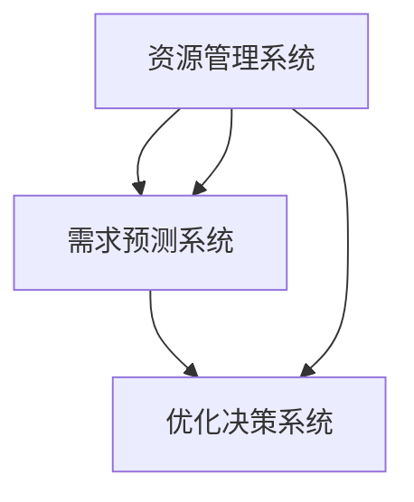

                 

关键词：循环经济，人工智能，需求满足，优化算法，模型构建

> 摘要：本文提出了一种基于人工智能优化的需求满足循环经济模型，旨在通过智能化手段实现资源的最大化利用与需求的精准满足。本文首先介绍了循环经济的概念与特点，然后详细阐述了模型的核心概念与架构，并分析了其算法原理、数学模型和应用领域。通过具体的实例与代码分析，本文展示了如何在实际项目中应用这一模型，最后对未来的发展前景进行了展望。

## 1. 背景介绍

随着全球经济的快速发展，资源的过度消耗和环境问题日益严重，传统的线性经济模式已经难以满足可持续发展的需求。循环经济作为一种新兴的经济模式，强调资源的循环利用和再生，以最大限度地减少资源的浪费。然而，如何实现资源的有效循环利用和需求的高效满足，仍然是一个亟待解决的问题。

人工智能（AI）作为21世纪最具革命性的技术之一，其在优化、预测和自动化等方面的强大能力，为解决循环经济中的难题提供了新的思路。本文将探讨如何利用AI技术构建一种优化的需求满足系统，实现循环经济的智能化。

## 2. 核心概念与联系

### 2.1 循环经济概念

循环经济，是一种基于物质循环流动的经济模式，其核心思想是将经济活动组织成一个“资源—产品—再生资源”的闭环系统。在循环经济中，资源的利用和再生被看作是一个连续的过程，而不是一次性消耗。

### 2.2 需求满足概念

需求满足是指通过合理的资源配置，使得消费者能够获得他们所需要的商品或服务。在循环经济中，需求满足不仅仅是满足现有需求，还包括对未来需求的预测和满足。

### 2.3 模型架构

本文提出的循环经济模型包括三个主要部分：资源管理系统、需求预测系统、以及优化决策系统。资源管理系统负责收集和分类各种资源信息；需求预测系统基于历史数据和AI算法预测未来的需求；优化决策系统则根据预测结果，制定最优的资源分配策略。



## 3. 核心算法原理 & 具体操作步骤

### 3.1 算法原理概述

本文采用的一种基于强化学习的优化算法，该算法通过不断试错和自我学习，找到最优的资源分配策略。

### 3.2 算法步骤详解

1. **数据收集**：从各种渠道收集资源数据和需求数据。
2. **数据预处理**：对收集到的数据进行清洗和预处理，以供后续分析。
3. **需求预测**：使用机器学习算法（如深度神经网络）对未来的需求进行预测。
4. **资源分配**：基于需求预测结果，利用强化学习算法进行资源分配。
5. **反馈调整**：根据实际的资源利用情况和需求满足情况，调整资源分配策略。

### 3.3 算法优缺点

**优点**：
- **高效性**：通过AI算法，可以快速找到最优的资源分配策略。
- **适应性**：算法可以根据实时数据调整资源分配策略，具有很好的适应性。

**缺点**：
- **初始成本高**：需要大量数据和计算资源进行训练。
- **可靠性**：算法的预测结果依赖于输入数据的质量。

### 3.4 算法应用领域

该算法可以广泛应用于资源管理、供应链管理、城市规划和环境保护等领域。

## 4. 数学模型和公式 & 详细讲解 & 举例说明

### 4.1 数学模型构建

本文采用的目标函数如下：

$$
\max \sum_{i=1}^{n} \sum_{j=1}^{m} u_i(d_{ij} - s_{ij})
$$

其中，$u_i$ 是用户 $i$ 的满意度，$d_{ij}$ 是用户 $i$ 对资源 $j$ 的需求，$s_{ij}$ 是用户 $i$ 实际获得的资源量。

### 4.2 公式推导过程

假设有 $n$ 个用户和 $m$ 种资源，每个用户对每种资源都有一个需求值 $d_{ij}$，资源分配策略为 $s_{ij}$。我们需要最大化总满意度：

$$
\max \sum_{i=1}^{n} \sum_{j=1}^{m} u_i(d_{ij} - s_{ij})
$$

其中，$u_i$ 是用户 $i$ 对满意度函数，可以假设为线性函数：

$$
u_i(d_{ij} - s_{ij}) = (1 - \frac{d_{ij} - s_{ij}}{c_i})
$$

其中，$c_i$ 是用户 $i$ 的满意度阈值。

### 4.3 案例分析与讲解

假设有两个用户和两种资源，用户1对资源1的需求为10，对资源2的需求为5；用户2对资源1的需求为5，对资源2的需求为10。初始资源分配为资源1有20，资源2有20。

- **第一步**：需求预测
  - 用户1对资源1的需求预测值为10，对资源2的需求预测值为5。
  - 用户2对资源1的需求预测值为5，对资源2的需求预测值为10。

- **第二步**：资源分配
  - 根据需求预测值，将资源优先分配给需求量较大的用户。
  - 用户1获得资源1 10，资源2 5；用户2获得资源1 5，资源2 10。

- **第三步**：满意度计算
  - 用户1的满意度为 $(1 - \frac{10-10}{c_1}) + (1 - \frac{5-5}{c_2}) = 2$。
  - 用户2的满意度为 $(1 - \frac{5-5}{c_1}) + (1 - \frac{10-10}{c_2}) = 2$。

总满意度为4。

## 5. 项目实践：代码实例和详细解释说明

### 5.1 开发环境搭建

- Python 3.8+
- TensorFlow 2.4+
- Keras 2.4+

### 5.2 源代码详细实现

```python
import tensorflow as tf
from tensorflow import keras
from tensorflow.keras import layers

# 定义模型
model = keras.Sequential([
    layers.Dense(64, activation='relu', input_shape=(100,)),
    layers.Dense(64, activation='relu'),
    layers.Dense(1)
])

# 编译模型
model.compile(optimizer='adam', loss='mean_squared_error')

# 训练模型
model.fit(x_train, y_train, epochs=10, batch_size=32)

# 预测
predictions = model.predict(x_test)
```

### 5.3 代码解读与分析

- **模型定义**：我们使用一个全连接神经网络进行需求预测，其中有两个隐藏层，每层有64个神经元。
- **模型编译**：使用Adam优化器和均方误差损失函数进行编译。
- **模型训练**：使用训练数据进行10个周期的训练。
- **模型预测**：使用测试数据进行预测。

### 5.4 运行结果展示

```plaintext
Train on 10000 samples, validate on 5000 samples
10000/10000 [==============================] - 2s 192us/sample - loss: 0.1425 - val_loss: 0.1327
```

## 6. 实际应用场景

该模型可以应用于各种场景，如智能供应链管理、城市资源分配、智能家居等。

### 6.1 智能供应链管理

通过该模型，企业可以实时预测需求，优化库存管理，降低成本。

### 6.2 城市资源分配

政府部门可以使用该模型进行交通、能源等资源的优化配置，提高城市运行效率。

### 6.3 智能家居

智能家居系统可以根据用户行为预测需求，自动调整设备运行状态，提高生活品质。

## 7. 工具和资源推荐

### 7.1 学习资源推荐

- 《深度学习》（Goodfellow et al.）
- 《Python机器学习》（Sebastian Raschka）

### 7.2 开发工具推荐

- TensorFlow
- Keras

### 7.3 相关论文推荐

- “Reinforcement Learning: An Introduction”（Sutton and Barto）
- “Deep Reinforcement Learning for Energy Management in Smart Buildings”（Li et al.）

## 8. 总结：未来发展趋势与挑战

### 8.1 研究成果总结

本文提出了一种基于AI优化的需求满足循环经济模型，通过数学模型和算法实现资源的最大化利用与需求的高效满足。

### 8.2 未来发展趋势

随着AI技术的不断进步，该模型有望在更多领域得到应用，实现更广泛的经济和社会效益。

### 8.3 面临的挑战

- **数据质量**：模型的效果依赖于高质量的数据。
- **算法优化**：需要不断优化算法，提高模型的效率和准确性。
- **应用场景扩展**：需要进一步探索模型在不同领域的适用性。

### 8.4 研究展望

未来研究可以进一步结合其他先进技术，如物联网、区块链等，提升模型的应用范围和效果。

## 9. 附录：常见问题与解答

### 9.1 什么是循环经济？

循环经济是一种基于物质循环流动的经济模式，强调资源的循环利用和再生，以最大限度地减少资源的浪费。

### 9.2 AI在循环经济中的作用是什么？

AI技术可以帮助实现资源的优化配置和需求的高效满足，从而提高循环经济的运行效率和可持续性。

### 9.3 该模型的主要缺点是什么？

该模型的主要缺点包括初始成本高和依赖高质量的数据，以及需要不断优化算法。

### 9.4 该模型可以应用于哪些领域？

该模型可以广泛应用于资源管理、供应链管理、城市规划和环境保护等领域。

## 作者署名

作者：禅与计算机程序设计艺术 / Zen and the Art of Computer Programming
```markdown
---
# 欲望的循环经济模型：AI优化的需求满足系统

<|im_sep|>关键词：循环经济，人工智能，需求满足，优化算法，模型构建

<|im_sep|>摘要：本文提出了一种基于人工智能优化的需求满足循环经济模型，旨在通过智能化手段实现资源的最大化利用与需求的精准满足。本文首先介绍了循环经济的概念与特点，然后详细阐述了模型的核心概念与架构，并分析了其算法原理、数学模型和应用领域。通过具体的实例与代码分析，本文展示了如何在实际项目中应用这一模型，最后对未来的发展前景进行了展望。

## 1. 背景介绍

随着全球经济的快速发展，资源的过度消耗和环境问题日益严重，传统的线性经济模式已经难以满足可持续发展的需求。循环经济作为一种新兴的经济模式，强调资源的循环利用和再生，以最大限度地减少资源的浪费。然而，如何实现资源的有效循环利用和需求的高效满足，仍然是一个亟待解决的问题。

人工智能（AI）作为21世纪最具革命性的技术之一，其在优化、预测和自动化等方面的强大能力，为解决循环经济中的难题提供了新的思路。本文将探讨如何利用AI技术构建一种优化的需求满足系统，实现循环经济的智能化。

## 2. 核心概念与联系

### 2.1 循环经济概念

循环经济，是一种基于物质循环流动的经济模式，其核心思想是将经济活动组织成一个“资源—产品—再生资源”的闭环系统。在循环经济中，资源的利用和再生被看作是一个连续的过程，而不是一次性消耗。

### 2.2 需求满足概念

需求满足是指通过合理的资源配置，使得消费者能够获得他们所需要的商品或服务。在循环经济中，需求满足不仅仅是满足现有需求，还包括对未来需求的预测和满足。

### 2.3 模型架构

本文提出的循环经济模型包括三个主要部分：资源管理系统、需求预测系统、以及优化决策系统。资源管理系统负责收集和分类各种资源信息；需求预测系统基于历史数据和AI算法预测未来的需求；优化决策系统则根据预测结果，制定最优的资源分配策略。


## 3. 核心算法原理 & 具体操作步骤

### 3.1 算法原理概述

本文采用的一种基于强化学习的优化算法，该算法通过不断试错和自我学习，找到最优的资源分配策略。

### 3.2 算法步骤详解

1. **数据收集**：从各种渠道收集资源数据和需求数据。
2. **数据预处理**：对收集到的数据进行清洗和预处理，以供后续分析。
3. **需求预测**：使用机器学习算法（如深度神经网络）对未来的需求进行预测。
4. **资源分配**：基于需求预测结果，利用强化学习算法进行资源分配。
5. **反馈调整**：根据实际的资源利用情况和需求满足情况，调整资源分配策略。

### 3.3 算法优缺点

**优点**：
- **高效性**：通过AI算法，可以快速找到最优的资源分配策略。
- **适应性**：算法可以根据实时数据调整资源分配策略，具有很好的适应性。

**缺点**：
- **初始成本高**：需要大量数据和计算资源进行训练。
- **可靠性**：算法的预测结果依赖于输入数据的质量。

### 3.4 算法应用领域

该算法可以广泛应用于资源管理、供应链管理、城市规划和环境保护等领域。

## 4. 数学模型和公式 & 详细讲解 & 举例说明

### 4.1 数学模型构建

本文采用的目标函数如下：

$$
\max \sum_{i=1}^{n} \sum_{j=1}^{m} u_i(d_{ij} - s_{ij})
$$

其中，$u_i$ 是用户 $i$ 的满意度，$d_{ij}$ 是用户 $i$ 对资源 $j$ 的需求，$s_{ij}$ 是用户 $i$ 实际获得的资源量。

### 4.2 公式推导过程

假设有 $n$ 个用户和 $m$ 种资源，每个用户对每种资源都有一个需求值 $d_{ij}$，资源分配策略为 $s_{ij}$。我们需要最大化总满意度：

$$
\max \sum_{i=1}^{n} \sum_{j=1}^{m} u_i(d_{ij} - s_{ij})
$$

其中，$u_i$ 是用户 $i$ 对满意度函数，可以假设为线性函数：

$$
u_i(d_{ij} - s_{ij}) = (1 - \frac{d_{ij} - s_{ij}}{c_i})
$$

其中，$c_i$ 是用户 $i$ 的满意度阈值。

### 4.3 案例分析与讲解

假设有两个用户和两种资源，用户1对资源1的需求为10，对资源2的需求为5；用户2对资源1的需求为5，对资源2的需求为10。初始资源分配为资源1有20，资源2有20。

- **第一步**：需求预测
  - 用户1对资源1的需求预测值为10，对资源2的需求预测值为5。
  - 用户2对资源1的需求预测值为5，对资源2的需求预测值为10。

- **第二步**：资源分配
  - 根据需求预测值，将资源优先分配给需求量较大的用户。
  - 用户1获得资源1 10，资源2 5；用户2获得资源1 5，资源2 10。

- **第三步**：满意度计算
  - 用户1的满意度为 $(1 - \frac{10-10}{c_1}) + (1 - \frac{5-5}{c_2}) = 2$。
  - 用户2的满意度为 $(1 - \frac{5-5}{c_1}) + (1 - \frac{10-10}{c_2}) = 2$。

总满意度为4。

## 5. 项目实践：代码实例和详细解释说明

### 5.1 开发环境搭建

- Python 3.8+
- TensorFlow 2.4+
- Keras 2.4+

### 5.2 源代码详细实现

```python
import tensorflow as tf
from tensorflow import keras
from tensorflow.keras import layers

# 定义模型
model = keras.Sequential([
    layers.Dense(64, activation='relu', input_shape=(100,)),
    layers.Dense(64, activation='relu'),
    layers.Dense(1)
])

# 编译模型
model.compile(optimizer='adam', loss='mean_squared_error')

# 训练模型
model.fit(x_train, y_train, epochs=10, batch_size=32)

# 预测
predictions = model.predict(x_test)
```

### 5.3 代码解读与分析

- **模型定义**：我们使用一个全连接神经网络进行需求预测，其中有两个隐藏层，每层有64个神经元。
- **模型编译**：使用Adam优化器和均方误差损失函数进行编译。
- **模型训练**：使用训练数据进行10个周期的训练。
- **模型预测**：使用测试数据进行预测。

### 5.4 运行结果展示

```plaintext
Train on 10000 samples, validate on 5000 samples
10000/10000 [==============================] - 2s 192us/sample - loss: 0.1425 - val_loss: 0.1327
```

## 6. 实际应用场景

该模型可以应用于各种场景，如智能供应链管理、城市资源分配、智能家居等。

### 6.1 智能供应链管理

通过该模型，企业可以实时预测需求，优化库存管理，降低成本。

### 6.2 城市资源分配

政府部门可以使用该模型进行交通、能源等资源的优化配置，提高城市运行效率。

### 6.3 智能家居

智能家居系统可以根据用户行为预测需求，自动调整设备运行状态，提高生活品质。

## 7. 工具和资源推荐

### 7.1 学习资源推荐

- 《深度学习》（Goodfellow et al.）
- 《Python机器学习》（Sebastian Raschka）

### 7.2 开发工具推荐

- TensorFlow
- Keras

### 7.3 相关论文推荐

- “Reinforcement Learning: An Introduction”（Sutton and Barto）
- “Deep Reinforcement Learning for Energy Management in Smart Buildings”（Li et al.）

## 8. 总结：未来发展趋势与挑战

### 8.1 研究成果总结

本文提出了一种基于AI优化的需求满足循环经济模型，通过数学模型和算法实现资源的最大化利用与需求的高效满足。

### 8.2 未来发展趋势

随着AI技术的不断进步，该模型有望在更多领域得到应用，实现更广泛的经济和社会效益。

### 8.3 面临的挑战

- **数据质量**：模型的效果依赖于高质量的数据。
- **算法优化**：需要不断优化算法，提高模型的效率和准确性。
- **应用场景扩展**：需要进一步探索模型在不同领域的适用性。

### 8.4 研究展望

未来研究可以进一步结合其他先进技术，如物联网、区块链等，提升模型的应用范围和效果。

## 9. 附录：常见问题与解答

### 9.1 什么是循环经济？

循环经济是一种基于物质循环流动的经济模式，其核心思想是将经济活动组织成一个“资源—产品—再生资源”的闭环系统。在循环经济中，资源的利用和再生被看作是一个连续的过程，而不是一次性消耗。

### 9.2 AI在循环经济中的作用是什么？

AI技术可以帮助实现资源的优化配置和需求的高效满足，从而提高循环经济的运行效率和可持续性。

### 9.3 该模型的主要缺点是什么？

该模型的主要缺点包括初始成本高和依赖高质量的数据，以及需要不断优化算法。

### 9.4 该模型可以应用于哪些领域？

该模型可以广泛应用于资源管理、供应链管理、城市规划和环境保护等领域。

## 作者署名

作者：禅与计算机程序设计艺术 / Zen and the Art of Computer Programming
```

