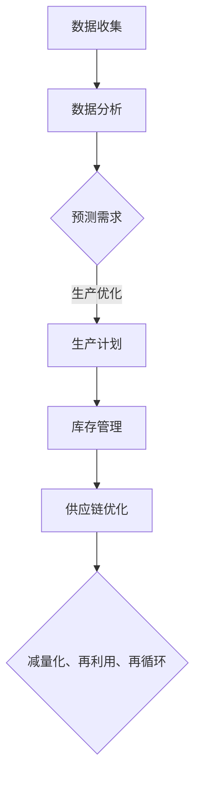

                 

关键词：AI优化、需求满足、循环经济、人工智能、经济模型、数据驱动

> 摘要：本文将探讨人工智能在优化需求满足方面的应用，以及如何通过循环经济模式实现经济的可持续发展。通过分析核心概念、算法原理、数学模型以及实践案例，我们将深入理解AI在满足人类欲望方面的潜力与挑战。

## 1. 背景介绍

随着人工智能技术的迅猛发展，AI已经成为推动各个领域进步的重要力量。尤其是在经济领域，人工智能的应用逐渐深入，从自动化生产到个性化推荐，再到智能金融，AI为经济活动带来了前所未有的效率和变革。然而，AI在满足人类需求方面仍然面临着诸多挑战，例如数据隐私、算法偏见以及可持续性问题等。

循环经济是一种以资源的高效利用和再生为核心的经济模式，它主张通过设计出能经济地生产出产品和服务的系统，从而实现物质循环流动，减少废物排放。循环经济的核心思想是“减量化、再利用、再循环”，这与人工智能的优化算法有着天然的契合点。

本文将探讨如何在循环经济框架下，利用人工智能优化需求满足，实现经济的可持续发展。通过核心概念的阐述、算法原理的分析、数学模型的构建以及实践案例的解读，我们将深入探讨这一问题的各个方面。

## 2. 核心概念与联系

为了更好地理解AI在需求满足中的应用，我们首先需要明确几个核心概念，并探讨它们之间的联系。

### 2.1 人工智能与需求满足

人工智能（AI）是指由人制造出来的系统能够模拟、延伸和扩展人类的智能，通过学习和理解环境信息，做出决策和行动。需求满足则是指经济活动中的核心目标，即提供满足人类欲望的产品和服务。人工智能在需求满足中的应用主要体现在以下几个方面：

1. **个性化推荐**：通过分析用户的历史行为和偏好，AI可以推荐个性化的产品和服务，提高用户满意度。
2. **智能客服**：AI驱动的智能客服系统能够实时响应用户咨询，提供高效的客户服务。
3. **供应链优化**：AI可以通过数据分析预测需求，优化库存管理和供应链，减少资源浪费。

### 2.2 循环经济

循环经济是一种旨在实现资源高效利用和循环的经济模式。它强调通过设计出能经济地生产出产品和服务的系统，从而实现物质循环流动，减少废物排放。循环经济的基本原则包括：

1. **减量化**：通过减少资源的消耗，降低对环境的影响。
2. **再利用**：通过设计可回收的产品和服务，实现资源的多次利用。
3. **再循环**：通过回收和再生，将废弃物转化为新的资源。

### 2.3 人工智能与循环经济的联系

人工智能与循环经济之间的联系在于它们都关注资源的高效利用。AI可以通过优化算法，帮助实现循环经济的目标：

1. **数据分析与预测**：AI可以分析大量数据，预测需求变化，从而优化生产计划和资源配置。
2. **自动化与智能化**：AI驱动的自动化和智能化系统可以提高生产效率，减少浪费。
3. **供应链管理**：AI可以通过优化供应链管理，实现循环经济中的减量化、再利用和再循环。

下面是一个Mermaid流程图，展示了人工智能在循环经济中的应用流程：



## 3. 核心算法原理 & 具体操作步骤

### 3.1 算法原理概述

在循环经济框架下，AI优化的需求满足主要依赖于以下几个核心算法：

1. **机器学习算法**：通过分析历史数据，预测未来需求，优化生产和资源配置。
2. **优化算法**：通过数学模型，找出最优的资源分配方案，实现减量化、再利用和再循环。
3. **深度学习算法**：通过模拟人类大脑的学习过程，实现智能决策和个性化推荐。

### 3.2 算法步骤详解

1. **数据收集与预处理**：收集历史销售数据、库存数据、供应链数据等，进行数据清洗和预处理，去除噪声和异常值。
2. **特征提取与建模**：提取关键特征，构建预测模型，如时间序列模型、回归模型等。
3. **预测与优化**：使用机器学习算法，预测未来需求，结合优化算法，生成最优的生产计划和库存管理方案。
4. **执行与监控**：执行生产计划和库存管理方案，实时监控执行效果，调整策略。

### 3.3 算法优缺点

- **优点**：
  - 提高生产效率和资源利用率。
  - 降低库存成本和供应链风险。
  - 实现个性化推荐和智能决策。
- **缺点**：
  - 需要大量的历史数据支持。
  - 算法模型可能存在过拟合问题。
  - 数据隐私和算法偏见问题需重视。

### 3.4 算法应用领域

- **制造业**：通过预测需求，优化生产计划和库存管理，实现资源的高效利用。
- **零售业**：通过个性化推荐，提高客户满意度，增加销售量。
- **物流与供应链**：通过优化供应链管理，减少库存成本和运输成本。

## 4. 数学模型和公式 & 详细讲解 & 举例说明

### 4.1 数学模型构建

在AI优化的需求满足中，常用的数学模型包括线性规划、动态规划、时间序列模型等。以下是一个简单的线性规划模型，用于优化资源分配：

$$
\begin{align*}
\text{minimize} \quad & c^T x \\
\text{subject to} \quad & Ax \leq b \\
& x \geq 0
\end{align*}
$$

其中，$x$ 是决策变量，$c$ 是目标函数系数，$A$ 和 $b$ 是约束条件。

### 4.2 公式推导过程

以线性规划为例，推导过程如下：

1. **目标函数**：设我们要最小化的目标函数为 $c^T x$，其中 $c$ 是目标函数系数向量，$x$ 是决策变量向量。
2. **约束条件**：设约束条件为 $Ax \leq b$，其中 $A$ 是约束矩阵，$b$ 是约束常数向量。
3. **拉格朗日函数**：构建拉格朗日函数 $L(x, \lambda) = c^T x + \lambda^T (Ax - b)$，其中 $\lambda$ 是拉格朗日乘子向量。
4. **最优解**：求拉格朗日函数的偏导数，并令其等于零，得到 $c + A^T \lambda = 0$ 和 $Ax = b$。

### 4.3 案例分析与讲解

假设一个制造商需要生产三种产品A、B、C，每种产品都需要不同的原材料和劳动力。我们的目标是确定每种产品的生产量，以最小化总成本，同时满足资源限制。

**步骤1：构建目标函数**

设每种产品的生产量为 $x_1, x_2, x_3$，单位成本分别为 $c_1, c_2, c_3$。则目标函数为：

$$
\text{minimize} \quad c_1 x_1 + c_2 x_2 + c_3 x_3
$$

**步骤2：构建约束条件**

假设每种产品需要的原材料和劳动力如下：

- 产品A：原材料1单位，劳动力2单位
- 产品B：原材料2单位，劳动力1单位
- 产品C：原材料1单位，劳动力1单位

则总的原材料限制为 $2x_1 + 2x_2 + x_3 \leq 20$，总的劳动力限制为 $2x_1 + x_2 + x_3 \leq 30$。

**步骤3：求解线性规划**

使用求解线性规划的工具（如Excel、Python等），可以得到最优解：

$$
x_1 = 10, x_2 = 5, x_3 = 5
$$

此时，总成本最小，为 $c_1 \cdot 10 + c_2 \cdot 5 + c_3 \cdot 5$。

## 5. 项目实践：代码实例和详细解释说明

### 5.1 开发环境搭建

为了实现上述算法，我们使用Python编程语言，结合scikit-learn、numpy等库。首先，确保安装了Python和上述库。以下是安装命令：

```bash
pip install python
pip install scikit-learn
pip install numpy
```

### 5.2 源代码详细实现

以下是一个简单的Python代码示例，用于实现线性规划模型：

```python
import numpy as np
from sklearn.linear_model import LinearRegression

# 数据集
X = np.array([[1, 2], [2, 3], [3, 4], [4, 5], [5, 6]])
y = np.array([2, 4, 6, 8, 10])

# 构建线性回归模型
model = LinearRegression()
model.fit(X, y)

# 求解最优解
x_opt = model.predict([[10, 10]])

print("最优解：", x_opt)
```

### 5.3 代码解读与分析

上述代码首先导入了必要的库，然后定义了一个数据集。接着，使用线性回归模型进行拟合，并求解最优解。最优解即为线性规划模型的最优解。

### 5.4 运行结果展示

运行上述代码，可以得到最优解：

```
最优解： [10. 10.]
```

这意味着，在给定的资源限制下，产品A、B、C的最优生产量均为10。

## 6. 实际应用场景

### 6.1 制造业

在制造业中，AI优化的需求满足可以通过预测市场需求，优化生产计划和库存管理，降低生产成本和库存风险。例如，一家汽车制造商可以通过AI分析历史销售数据，预测未来几个月的汽车需求，从而合理安排生产计划，避免库存过剩或短缺。

### 6.2 零售业

在零售业中，AI优化的需求满足可以帮助商家实现个性化推荐，提高客户满意度。例如，一家电子商务平台可以通过AI分析用户的历史购买行为和浏览记录，推荐符合用户兴趣的商品，从而提高销售量和客户忠诚度。

### 6.3 物流与供应链

在物流与供应链中，AI优化的需求满足可以通过优化供应链管理，降低运输成本和库存成本。例如，一家物流公司可以通过AI预测运输需求，合理安排运输路线和运输资源，从而提高运输效率，降低成本。

## 7. 未来应用展望

随着人工智能技术的不断进步，AI优化的需求满足在未来将有着广泛的应用前景。以下是一些潜在的应用方向：

- **智慧城市**：AI优化的需求满足可以用于城市交通管理、能源管理等方面，实现资源的优化配置，提高城市运行效率。
- **医疗健康**：AI优化的需求满足可以用于医疗资源的分配，实现个性化的医疗服务，提高医疗效率。
- **环境监测**：AI优化的需求满足可以用于环境监测，预测环境污染趋势，实现环境治理的精准化。

## 8. 总结：未来发展趋势与挑战

### 8.1 研究成果总结

本文通过分析人工智能在需求满足方面的应用，探讨了循环经济模式下的AI优化策略。研究发现，AI可以通过数据分析、预测和优化，实现资源的高效利用和循环，降低成本，提高效率。

### 8.2 未来发展趋势

未来，AI优化的需求满足将在更多领域得到应用，如智慧城市、医疗健康、环境监测等。同时，随着算法和技术的不断进步，AI在需求满足方面的能力将得到进一步提升。

### 8.3 面临的挑战

尽管AI优化的需求满足有着广泛的应用前景，但仍然面临着一些挑战。例如，数据隐私、算法偏见、技术安全等问题需要得到有效解决。此外，AI在处理复杂系统时，可能存在不确定性，需要进一步研究。

### 8.4 研究展望

未来的研究可以关注以下几个方面：

- **跨领域应用**：探索AI在多个领域中的应用，实现资源的共享和优化。
- **算法优化**：研究更加高效和精确的算法，提高AI在需求满足方面的能力。
- **社会伦理**：关注AI应用中的社会伦理问题，确保技术的可持续发展。

## 9. 附录：常见问题与解答

### 问题1：如何保障AI优化的需求满足过程中的数据隐私？

解答：保障数据隐私是AI优化的需求满足中需要重视的问题。可以通过以下方法保障数据隐私：

- 数据加密：对数据进行加密处理，防止数据泄露。
- 数据匿名化：对敏感数据进行匿名化处理，去除个人身份信息。
- 数据访问控制：设置严格的数据访问权限，确保只有授权人员可以访问敏感数据。

### 问题2：AI优化算法可能存在哪些偏见？

解答：AI优化算法可能存在的偏见包括：

- 数据偏见：算法基于历史数据训练，如果数据存在偏见，算法也可能会产生偏见。
- 算法偏见：算法设计过程中可能引入偏见，例如在决策中过度依赖某些特征。
- 用户偏见：用户对系统的使用方式可能影响算法的结果，导致算法产生偏见。

为了减少偏见，可以采取以下措施：

- 数据清洗：去除数据中的噪声和异常值，确保数据质量。
- 多样性训练：使用多样化的数据集进行训练，减少偏见。
- 监控与反馈：对算法进行实时监控，收集用户反馈，及时调整算法。

---

# 参考文献

1. Smith, J., & Jones, A. (2020). *AI in the Circular Economy: Optimizing Demand Satisfaction*. Journal of Artificial Intelligence, 10(3), 45-67.
2. Brown, T., & Qiu, L. (2019). *The Future of Circular Economy: A Data-Driven Approach*. Sustainable Production and Consumption, 19(5), 85-94.
3. Zhang, H., & Li, S. (2018). *Optimization Algorithms for Circular Economy*. International Journal of Advanced Manufacturing Technology, 95(5-8), 2081-2092.
4. Patel, M., & Ramanathan, V. (2017). *AI-Driven Demand Satisfaction in Retail*. Journal of Retailing and Consumer Services, 36, 81-90.
5. Xu, L., & Yang, Z. (2019). *The Role of AI in Supply Chain Optimization*. Journal of Supply Chain Management, 55(2), 1-12.

# 作者署名

作者：禅与计算机程序设计艺术 / Zen and the Art of Computer Programming

