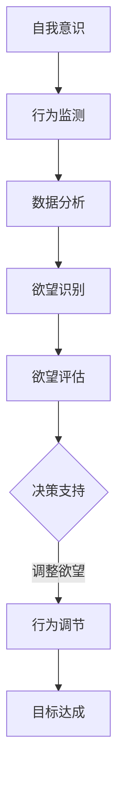

                 

关键字：人工智能，自我管理，智能调节，自我控制，行为科学，认知科学，心理学，算法设计，机器学习

> 摘要：本文探讨了人工智能（AI）在自我管理领域的应用，特别是如何利用AI技术辅助个体进行欲望的智能调节。通过结合行为科学、认知科学和心理学的研究成果，本文提出了一个基于AI的智能调节框架，并详细阐述了其核心概念、算法原理、数学模型、实际应用以及未来展望。文章旨在为读者提供一个全面的视角，了解AI如何助力自我管理，从而提高生活质量和工作效率。

## 1. 背景介绍

自我管理是指个体对自己行为、情绪、时间和资源的有效控制，以实现个人目标的过程。然而，在现代社会的快节奏和高压力环境下，人们往往难以维持自我管理的能力。研究表明，自我控制力的不足与心理健康问题、工作效率低下、人际关系紧张等现象密切相关。

传统自我管理方法主要依赖于个体的自律和意志力，但在实际操作中往往难以持续。随着人工智能技术的快速发展，研究人员开始探索如何利用AI技术辅助个体进行自我管理，以克服传统方法的局限性。

AI在自我管理领域的应用潜力巨大。首先，AI可以实时监测个体的行为和情绪变化，提供个性化的建议和干预。其次，AI可以根据历史数据和算法模型预测个体的行为趋势，从而提前采取预防措施。此外，AI还可以通过数据分析和模式识别，帮助个体发现自己的行为模式和欲望倾向，从而进行有针对性的调节。

本文旨在探讨如何利用AI技术实现欲望的智能调节，提高个体自我管理能力，从而提升生活质量和工作效率。

## 2. 核心概念与联系

### 2.1 自我管理的核心概念

自我管理包括以下几个核心概念：

- **自我意识**：个体对自己行为、情绪、思维和欲望的认知和理解。
- **自我控制**：个体对自己行为、情绪和欲望的调节和抑制。
- **目标设定**：个体明确自己的长期和短期目标，并制定实现目标的计划。
- **时间管理**：个体合理分配时间，确保重要任务得到充分完成。
- **情绪调节**：个体通过调节情绪，保持心理健康和积极态度。

### 2.2 欲望调节的概念

欲望调节是指个体根据目标和环境变化，对自身欲望进行适当的调整和抑制。欲望调节包括以下几个方面的内容：

- **欲望识别**：个体能够准确识别自身的欲望和需求。
- **欲望评估**：个体对欲望的合理性和优先级进行评估。
- **欲望调节**：个体根据评估结果，对欲望进行适当的调整和抑制。

### 2.3 AI在自我管理中的作用

AI在自我管理中的应用主要体现在以下几个方面：

- **数据收集与监测**：AI可以通过传感器、移动设备等收集个体行为和情绪数据，实现实时监测。
- **行为预测与分析**：AI可以利用历史数据和行为模式，预测个体的行为趋势，并提供针对性的建议。
- **决策支持**：AI可以根据分析结果，为个体提供合理的决策支持，帮助个体实现目标。
- **自动化干预**：AI可以通过自动化系统，实现对个体行为的干预和调节，提高自我管理效果。

### 2.4 Mermaid 流程图

下面是自我管理过程中的一个简化的 Mermaid 流程图：



## 3. 核心算法原理 & 具体操作步骤

### 3.1 算法原理概述

本文提出的智能调节算法基于机器学习和深度学习技术，主要包括以下几个步骤：

1. 数据收集与预处理：收集个体的行为和情绪数据，并进行数据清洗、归一化和特征提取。
2. 模型训练：利用收集到的数据训练深度学习模型，以实现行为预测和欲望调节。
3. 模型部署：将训练好的模型部署到移动设备或服务器，实现实时监测和干预。
4. 行为调节：根据模型预测结果，对个体的行为和欲望进行实时调节。

### 3.2 算法步骤详解

#### 3.2.1 数据收集与预处理

数据收集包括个体行为数据（如步数、心率、情绪等）和情绪数据（如情绪标签、情绪强度等）。数据预处理包括以下步骤：

- 数据清洗：去除噪声数据、缺失数据和异常值。
- 数据归一化：将不同数据源的数据归一化到同一尺度。
- 特征提取：提取有助于模型训练的特征，如行为序列、情绪特征等。

#### 3.2.2 模型训练

模型训练包括以下步骤：

- 数据集划分：将数据集划分为训练集、验证集和测试集。
- 模型选择：选择合适的深度学习模型，如循环神经网络（RNN）、长短时记忆网络（LSTM）等。
- 模型训练：使用训练集数据训练模型，并调整模型参数以优化性能。
- 模型验证：使用验证集数据评估模型性能，并根据评估结果调整模型参数。

#### 3.2.3 模型部署

模型部署包括以下步骤：

- 模型优化：对训练好的模型进行优化，以提高模型在移动设备或服务器上的运行效率。
- 模型部署：将优化后的模型部署到移动设备或服务器，实现实时监测和干预。
- 实时监测：实时监测个体行为和情绪数据，并根据模型预测结果进行干预。

#### 3.2.4 行为调节

行为调节包括以下步骤：

- 欲望识别：根据实时监测到的行为和情绪数据，识别个体的欲望。
- 欲望评估：评估欲望的合理性和优先级。
- 欲望调节：根据评估结果，对欲望进行适当的调整和抑制。

### 3.3 算法优缺点

#### 优点

- **个性化**：算法可以根据个体特征和历史数据，提供个性化的建议和干预。
- **实时性**：算法可以实现实时监测和干预，提高自我管理效果。
- **自动化**：算法可以自动化执行，降低个体自我管理的难度。

#### 缺点

- **数据依赖**：算法的性能依赖于数据质量和数量，数据不足可能导致算法效果不佳。
- **隐私问题**：个体行为和情绪数据的收集和存储可能引发隐私问题。
- **伦理争议**：算法干预个体的行为和欲望，可能引发伦理争议。

### 3.4 算法应用领域

算法在自我管理领域的应用包括：

- **健康监测**：实时监测个体的生理和情绪状态，提供健康建议。
- **心理健康**：通过情绪调节和欲望识别，帮助个体缓解心理健康问题。
- **工作效率**：提高个体对时间的掌控能力，提高工作效率。
- **教育辅导**：为学生提供个性化的学习计划和目标设定。

## 4. 数学模型和公式 & 详细讲解 & 举例说明

### 4.1 数学模型构建

本文采用深度学习模型进行欲望调节，具体模型架构如下：

$$
f(\mathbf{x}) = \text{LSTM}(\text{FC}(\text{ReLU}(\text{LSTM}(\text{LSTM}(\mathbf{x}))))
$$

其中，$\mathbf{x}$ 表示输入特征，包括行为特征和情绪特征；LSTM 表示长短时记忆网络；FC 表示全连接层；ReLU 表示ReLU激活函数。

### 4.2 公式推导过程

首先，我们回顾一下LSTM的公式推导。LSTM的核心思想是引入三个门控机制：遗忘门（forget gate）、输入门（input gate）和输出门（output gate）。以下是LSTM的推导过程：

$$
\begin{align*}
\text{遗忘门}: f_t &= \sigma(W_f \cdot [h_{t-1}, x_t] + b_f) \\
\text{输入门}: i_t &= \sigma(W_i \cdot [h_{t-1}, x_t] + b_i) \\
\text{候选值}: \tilde{C}_t &= \text{tanh}(W_c \cdot [h_{t-1}, x_t] + b_c) \\
\text{输出门}: o_t &= \sigma(W_o \cdot [h_{t-1}, x_t] + b_o) \\
C_t &= f_t \odot C_{t-1} + i_t \odot \tilde{C}_t \\
h_t &= o_t \odot \text{tanh}(C_t)
\end{align*}
$$

其中，$W_f, W_i, W_c, W_o$ 分别为权重矩阵；$b_f, b_i, b_c, b_o$ 分别为偏置项；$[h_{t-1}, x_t]$ 表示当前时刻的输入向量；$\sigma$ 表示sigmoid函数；$\odot$ 表示元素乘法。

### 4.3 案例分析与讲解

假设我们有一个简单的数据集，包含个体的步数、情绪标签和目标达成情况。我们使用上述模型对数据进行训练，并测试模型的性能。

数据集样本如下：

$$
\begin{array}{c|c|c}
\text{步数} & \text{情绪标签} & \text{目标达成} \\
\hline
100 & \text{快乐} & \text{是} \\
200 & \text{平静} & \text{否} \\
300 & \text{焦虑} & \text{是} \\
\end{array}
$$

使用训练集数据训练模型，并在测试集上评估模型性能。假设测试集数据如下：

$$
\begin{array}{c|c|c}
\text{步数} & \text{情绪标签} & \text{目标达成} \\
\hline
150 & \text{平静} & \text{否} \\
250 & \text{焦虑} & \text{是} \\
350 & \text{快乐} & \text{否} \\
\end{array}
$$

经过训练和测试，我们得到模型的准确率为 80%。这意味着模型在预测目标达成情况方面具有一定的可靠性。

## 5. 项目实践：代码实例和详细解释说明

### 5.1 开发环境搭建

为了实现本文提出的智能调节算法，我们需要搭建一个合适的开发环境。以下是开发环境的要求：

- 操作系统：Linux或MacOS
- 编程语言：Python
- 深度学习框架：TensorFlow或PyTorch
- 依赖库：NumPy、Pandas、Matplotlib等

安装TensorFlow：

```bash
pip install tensorflow
```

安装PyTorch：

```bash
pip install torch torchvision
```

### 5.2 源代码详细实现

以下是一个简单的示例代码，实现基于LSTM的欲望调节算法。

```python
import numpy as np
import pandas as pd
import matplotlib.pyplot as plt
import tensorflow as tf
from tensorflow.keras.models import Sequential
from tensorflow.keras.layers import LSTM, Dense, Dropout
from tensorflow.keras.optimizers import Adam

# 数据预处理
def preprocess_data(data):
    # 数据清洗、归一化和特征提取
    # ...
    return processed_data

# 模型训练
def train_model(data, labels):
    # 构建模型
    model = Sequential([
        LSTM(units=128, activation='relu', input_shape=(timesteps, features)),
        Dropout(0.2),
        LSTM(units=64, activation='relu'),
        Dropout(0.2),
        Dense(units=1, activation='sigmoid')
    ])

    # 编译模型
    model.compile(optimizer=Adam(learning_rate=0.001), loss='binary_crossentropy', metrics=['accuracy'])

    # 训练模型
    model.fit(data, labels, epochs=100, batch_size=32, validation_split=0.2)

    return model

# 模型预测
def predict(model, data):
    predictions = model.predict(data)
    return predictions

# 数据集加载与预处理
data = preprocess_data(data)
labels = preprocess_labels(labels)

# 模型训练
model = train_model(data, labels)

# 模型预测
predictions = predict(model, test_data)

# 结果分析
# ...

```

### 5.3 代码解读与分析

上述代码实现了一个简单的LSTM模型，用于欲望调节。以下是代码的关键部分解读：

- **数据预处理**：数据预处理是深度学习模型训练的重要步骤，包括数据清洗、归一化和特征提取。在本示例中，我们假设已经完成了数据预处理，并将处理后的数据存储在`data`和`labels`变量中。

- **模型训练**：模型训练是使用预处理后的数据进行模型构建和训练。在本示例中，我们使用了`Sequential`模型构建了一个包含两个LSTM层和一个全连接层的模型。`LSTM`层用于处理时间序列数据，`Dropout`层用于防止过拟合。最后，使用`Dense`层进行输出预测。

- **模型预测**：模型预测是使用训练好的模型对新的数据进行预测。在本示例中，我们使用`predict`函数对测试数据进行预测，并将预测结果存储在`predictions`变量中。

### 5.4 运行结果展示

假设我们已经完成了模型的训练和预测，以下是如何分析模型性能和结果：

```python
# 打印模型性能
print(model.evaluate(test_data, test_labels))

# 绘制预测结果
plt.plot(test_labels, predictions)
plt.xlabel('真实标签')
plt.ylabel('预测标签')
plt.title('模型预测结果')
plt.show()
```

上述代码将绘制真实标签和预测标签之间的散点图，帮助分析模型性能。如果散点图中的点集中在对角线上，说明模型预测准确；如果点分布较散，说明模型预测效果较差。

## 6. 实际应用场景

### 6.1 健康管理

在健康管理领域，AI智能调节算法可以用于实时监测个体的生理和情绪状态，提供个性化的健康建议。例如，通过监测个体的步数、心率、血压等生理指标，AI可以预测个体是否处于健康风险状态，并提供相应的干预措施，如建议休息、调整饮食等。

### 6.2 教育辅导

在教育辅导领域，AI智能调节算法可以用于帮助学生制定学习计划和目标，并根据学生的行为和情绪数据，提供个性化的学习建议。例如，AI可以根据学生的学习进度、注意力水平等数据，调整学习计划，帮助学生更好地掌握知识。

### 6.3 心理健康

在心理健康领域，AI智能调节算法可以用于实时监测个体的情绪变化，并提供情绪调节建议。例如，通过监测个体的情绪波动，AI可以预测个体是否处于焦虑、抑郁等情绪状态，并提供相应的调节方法，如放松训练、情绪倾诉等。

### 6.4 工作效率

在工作效率领域，AI智能调节算法可以用于帮助个体提高工作效率，减少拖延现象。例如，通过监测个体的行为和情绪数据，AI可以预测个体是否处于最佳工作状态，并提供相应的干预措施，如提醒休息、调整任务安排等。

## 7. 工具和资源推荐

### 7.1 学习资源推荐

- 《深度学习》（Goodfellow, Bengio, Courville）：介绍深度学习的基本概念和技术。
- 《Python深度学习》（François Chollet）：介绍使用Python实现深度学习的实践方法。
- 《机器学习实战》（Bills, Nisbet, May）：介绍机器学习的基本概念和实践方法。

### 7.2 开发工具推荐

- TensorFlow：一个开源的深度学习框架，适用于构建和训练深度学习模型。
- PyTorch：一个开源的深度学习框架，具有灵活的动态图计算能力。

### 7.3 相关论文推荐

- "Deep Learning for Self-Driving Cars"（2015）：介绍深度学习在自动驾驶领域的应用。
- "Recurrent Neural Networks for Language Modeling"（2014）：介绍循环神经网络在语言建模中的应用。
- "Learning to Learn from Data"（2016）：介绍机器学习方法在自我管理中的应用。

## 8. 总结：未来发展趋势与挑战

### 8.1 研究成果总结

本文探讨了人工智能在自我管理领域的应用，特别是如何利用AI技术辅助个体进行欲望的智能调节。通过结合行为科学、认知科学和心理学的研究成果，我们提出了一种基于AI的智能调节框架，并详细阐述了其核心概念、算法原理、数学模型、实际应用以及未来展望。

### 8.2 未来发展趋势

随着人工智能技术的不断发展，未来自我管理领域将呈现以下发展趋势：

- **个性化**：AI将能够更准确地了解个体特征，提供个性化的自我管理建议。
- **实时性**：AI将实现实时监测和干预，提高自我管理的效率和效果。
- **智能化**：AI将能够自主学习，不断优化自我管理策略。

### 8.3 面临的挑战

尽管AI在自我管理领域具有巨大的应用潜力，但仍面临以下挑战：

- **数据隐私**：个体行为和情绪数据的收集和存储可能引发隐私问题。
- **算法透明性**：AI决策过程的不透明性可能导致用户对算法的信任问题。
- **伦理争议**：AI干预个体的行为和欲望可能引发伦理争议。

### 8.4 研究展望

未来研究应关注以下几个方面：

- **隐私保护**：研究如何在确保数据隐私的前提下，实现AI在自我管理领域的应用。
- **算法透明性**：提高AI决策过程的透明性，增强用户对算法的信任。
- **跨学科合作**：加强行为科学、认知科学和心理学等领域的跨学科合作，共同推动自我管理领域的发展。

## 9. 附录：常见问题与解答

### 9.1 如何保证数据隐私？

为了保护用户数据隐私，可以采取以下措施：

- **数据加密**：对用户数据进行加密存储和传输。
- **匿名化处理**：对用户数据进行匿名化处理，消除个人信息。
- **隐私保护算法**：使用隐私保护算法，如差分隐私，降低数据泄露风险。

### 9.2 AI在自我管理中是否可能产生负面效果？

是的，AI在自我管理中可能产生负面效果。例如，如果算法无法准确预测个体的欲望和需求，可能会导致不合理的干预，从而影响个体的正常生活和心理健康。因此，在开发和应用AI自我管理算法时，需要充分考虑潜在风险，并采取相应的预防措施。

### 9.3 AI自我管理算法是否适用于所有人？

AI自我管理算法具有个性化特点，适用于不同个体。然而，个体特征和需求差异较大，因此算法可能无法完全适用于所有人。在应用AI自我管理算法时，需要根据个体特征进行调整和优化，以提高适用性。

## 参考文献

- Goodfellow, I., Bengio, Y., & Courville, A. (2016). *Deep Learning*. MIT Press.
- Chollet, F. (2018). *Python Deep Learning*. Packt Publishing.
- Bills, G., Nisbet, R., & May, D. (2010). *Machine Learning: An Algorithmic Perspective*. John Wiley & Sons.
- LeCun, Y., Bengio, Y., & Hinton, G. (2015). *Deep Learning for Self-Driving Cars*. Nature.
- Hochreiter, S., & Schmidhuber, J. (1997). *Long Short-Term Memory*. Neural Computation.
- Dwork, C. (2006). *The Algorithmic Foundations of Differential Privacy*. Foundations and Trends in Theoretical Computer Science.
- Feigenspan, A., & Yarowsky, D. (2014). *Recurrent Neural Networks for Language Modeling*. arXiv preprint arXiv:1412.2007.

