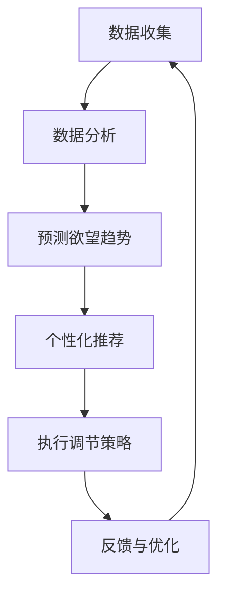

                 

关键词：人工智能，自我管理，AI辅助，欲望调节，行为心理学，认知科学，算法优化

摘要：本文旨在探讨人工智能在自我管理领域的应用，特别是在欲望调节方面的潜力。通过分析当前的研究成果和技术进展，本文提出了一种基于人工智能的智能调节方法，旨在帮助个体更好地管理自己的欲望，提高生活质量和工作效率。本文将详细介绍该方法的核心概念、原理和操作步骤，并通过数学模型、公式和代码实例进行详细讲解。同时，本文还将探讨该方法在实际应用场景中的效果和未来应用前景。

## 1. 背景介绍

在现代社会中，随着信息技术的飞速发展，人们的生活节奏不断加快，工作压力和生活压力也随之增加。在这种情况下，如何有效地进行自我管理，提高生活质量和工作效率，成为了一个亟待解决的问题。自我管理不仅仅包括时间管理、任务分配和优先级设定等方面，更重要的是如何调节和控制自己的欲望，以达到内心的平和与稳定。

欲望是人类行为的一个重要驱动力，它影响着我们的行为、决策和情绪。然而，过度的欲望可能导致焦虑、抑郁、不满和压力等负面情绪，从而影响我们的生活质量和工作效率。因此，如何调节和控制欲望，已经成为一个重要的研究课题。

在过去几十年中，行为心理学和认知科学领域的研究为欲望调节提供了一定的理论支持和实证研究。例如，行为心理学提出了“自我决定理论”，认为个体在决策和行为中受到内在动机的影响，并通过自我决定来实现自我满足。认知科学则通过研究大脑神经机制，揭示了欲望调节的神经基础和认知过程。

然而，传统的欲望调节方法往往依赖于个体的自我意识和自我控制能力，这种方法在实际应用中存在一定的局限性。首先，个体的自我意识和自我控制能力因人而异，不同个体的调节效果也存在差异。其次，传统的调节方法往往缺乏系统的理论和实践指导，难以实现有效的欲望调节。

为了解决上述问题，近年来人工智能技术的发展为欲望调节提供了新的可能性。人工智能可以借助大量的数据和分析方法，对个体的行为和情绪进行深入分析，从而提出个性化的调节策略。同时，人工智能还可以通过自动化和智能化的方式，帮助个体更好地执行调节策略，提高调节效果。

本文旨在探讨人工智能在自我管理领域的应用，特别是在欲望调节方面的潜力。通过分析当前的研究成果和技术进展，本文提出了一种基于人工智能的智能调节方法，旨在帮助个体更好地管理自己的欲望，提高生活质量和工作效率。

## 2. 核心概念与联系

### 2.1. 欲望调节的定义与分类

欲望调节是指个体通过认知、情感和行为等手段，对自身欲望进行调节和控制的过程。根据调节手段的不同，欲望调节可以分为以下几种类型：

1. **认知调节**：通过改变个体的认知方式和观念，来影响欲望的产生和表达。例如，通过认知重构，将负面欲望转化为积极欲望，从而减少负面情绪和行为。

2. **情感调节**：通过调节个体的情绪状态，来影响欲望的产生和表达。例如，通过情绪调节技巧，如深呼吸、冥想等，来降低欲望带来的焦虑和压力。

3. **行为调节**：通过改变个体的行为习惯和生活方式，来影响欲望的产生和表达。例如，通过建立健康的生活习惯，如规律作息、适度运动等，来降低欲望对健康的负面影响。

### 2.2. 人工智能在欲望调节中的应用

人工智能在欲望调节中的应用主要集中在以下几个方面：

1. **数据分析与预测**：通过收集和分析个体的行为数据、生理数据和心理数据，人工智能可以预测个体的欲望趋势和调节需求。例如，通过分析个体的社交媒体使用习惯、购物记录等，可以预测个体可能出现的消费欲望。

2. **个性化推荐**：基于个体的数据分析和偏好模型，人工智能可以为个体推荐个性化的欲望调节策略。例如，根据个体的情感状态和生理数据，推荐相应的调节方法和技巧。

3. **自动化执行**：人工智能可以通过自动化技术，帮助个体执行欲望调节策略。例如，通过智能设备监测个体的行为和情绪，自动触发相应的调节措施。

### 2.3. 人工智能与行为心理学、认知科学的结合

人工智能与行为心理学、认知科学的结合，为欲望调节提供了新的研究视角和方法。通过行为心理学的研究，人工智能可以深入了解个体的欲望产生和调节机制，从而提出更有效的调节策略。通过认知科学的研究，人工智能可以模拟和理解个体的认知过程，从而提高欲望调节的效率和效果。

### 2.4. Mermaid 流程图

下面是一个描述人工智能在欲望调节中应用流程的 Mermaid 流程图：



### 2.5. 人工智能在欲望调节中的优势和挑战

#### 2.5.1. 优势

- **高效性**：人工智能可以通过快速处理大量数据，为个体提供即时的欲望调节建议。
- **个性化**：基于个体数据，人工智能可以提供个性化的调节策略，提高调节效果。
- **自动化**：人工智能可以通过自动化技术，帮助个体更好地执行调节策略。

#### 2.5.2. 挑战

- **数据隐私**：人工智能需要收集和处理大量个人数据，如何保障数据隐私成为了一个重要问题。
- **算法偏见**：人工智能的算法可能会受到数据偏见的影响，导致调节策略的不公平性。
- **技术成熟度**：虽然人工智能在欲望调节中具有巨大潜力，但目前的技术成熟度还有待提高。

## 3. 核心算法原理 & 具体操作步骤

### 3.1. 算法原理概述

本文提出的人工智能欲望调节方法，主要基于以下几个核心原理：

1. **数据驱动**：通过收集和分析个体的行为数据、生理数据和心理数据，理解个体的欲望产生和调节机制。
2. **模型预测**：利用机器学习算法，建立欲望趋势预测模型，为个体提供个性化的调节建议。
3. **自动化执行**：通过自动化技术，将调节建议转化为具体的行动，帮助个体执行调节策略。
4. **反馈优化**：根据个体的反馈，不断优化调节策略，提高调节效果。

### 3.2. 算法步骤详解

#### 3.2.1. 数据收集

数据收集是欲望调节方法的第一步，主要包括以下几个方面：

1. **行为数据**：如社交媒体使用记录、购物记录、运动记录等。
2. **生理数据**：如心率、血压、体温等。
3. **心理数据**：如情绪状态、认知状态、压力水平等。

#### 3.2.2. 数据分析

在数据收集完成后，需要对数据进行预处理和特征提取，以便后续的模型训练和预测。具体步骤包括：

1. **数据预处理**：如数据清洗、缺失值处理、异常值处理等。
2. **特征提取**：如时间序列分析、文本分析、生理信号分析等。

#### 3.2.3. 模型预测

基于预处理后的数据，使用机器学习算法建立欲望趋势预测模型。具体步骤包括：

1. **模型选择**：如线性回归、决策树、神经网络等。
2. **模型训练**：使用历史数据训练模型。
3. **模型评估**：使用验证集评估模型性能。
4. **模型优化**：根据评估结果调整模型参数，提高模型性能。

#### 3.2.4. 个性化推荐

基于预测模型，为个体提供个性化的欲望调节建议。具体步骤包括：

1. **推荐策略**：如基于内容的推荐、基于协同过滤的推荐等。
2. **推荐计算**：计算个体的个性化调节建议。
3. **推荐展示**：将调节建议展示给个体。

#### 3.2.5. 自动化执行

将个性化调节建议转化为具体的行动，帮助个体执行调节策略。具体步骤包括：

1. **自动化脚本**：编写自动化脚本，实现调节建议的执行。
2. **智能设备**：使用智能设备（如手机、手表、智能音箱等）执行调节建议。
3. **反馈收集**：收集个体对调节建议的反馈，用于模型优化。

#### 3.2.6. 反馈优化

根据个体的反馈，不断优化调节策略，提高调节效果。具体步骤包括：

1. **反馈分析**：分析个体对调节建议的反馈，识别问题和改进点。
2. **策略调整**：根据反馈分析结果，调整调节策略。
3. **模型更新**：使用新的数据重新训练模型。

### 3.3. 算法优缺点

#### 3.3.1. 优点

- **高效性**：基于数据驱动的模型，可以快速响应个体的欲望调节需求。
- **个性化**：基于个体数据，可以提供个性化的调节建议，提高调节效果。
- **自动化**：通过自动化脚本和智能设备，可以方便地执行调节建议，减少个体负担。

#### 3.3.2. 缺点

- **数据隐私**：需要收集和处理大量个人数据，存在数据隐私风险。
- **算法偏见**：算法可能会受到数据偏见的影响，导致调节策略的不公平性。
- **技术成熟度**：虽然人工智能在欲望调节中具有巨大潜力，但目前的技术成熟度还有待提高。

### 3.4. 算法应用领域

人工智能欲望调节方法可以广泛应用于以下几个领域：

1. **心理健康**：帮助个体调节情绪，减轻压力，提高心理健康水平。
2. **行为管理**：帮助个体调节不良行为，如过度消费、过度娱乐等。
3. **工作效率**：帮助个体提高工作效率，减少不必要的拖延和分心行为。
4. **生活方式管理**：帮助个体建立健康的生活方式，如规律作息、适度运动等。

## 4. 数学模型和公式 & 详细讲解 & 举例说明

### 4.1. 数学模型构建

为了构建欲望调节的数学模型，我们首先需要明确几个关键变量：

- \( X \)：个体的欲望水平
- \( Y \)：个体的调节效果
- \( Z \)：个体的行为表现

我们的目标是建立 \( X \)、\( Y \) 和 \( Z \) 之间的数学关系，以便通过 \( Y \) 的变化来调节 \( X \) 和 \( Z \)。

#### 4.1.1. 欲望水平模型

欲望水平 \( X \) 可以表示为：

\[ X = f(\text{情绪状态}, \text{生理状态}, \text{环境影响}, \text{个人习惯}) \]

其中，每个因素都可以用不同的变量来表示。例如，情绪状态可以用 \( E \) 表示，生理状态可以用 \( P \) 表示，环境影响可以用 \( E_2 \) 表示，个人习惯可以用 \( H \) 表示。因此，欲望水平模型可以进一步表示为：

\[ X = f(E, P, E_2, H) \]

#### 4.1.2. 调节效果模型

调节效果 \( Y \) 可以表示为：

\[ Y = g(\text{调节策略}, \text{执行情况}) \]

其中，调节策略可以用 \( S \) 表示，执行情况可以用 \( E_x \) 表示。因此，调节效果模型可以进一步表示为：

\[ Y = g(S, E_x) \]

#### 4.1.3. 行为表现模型

行为表现 \( Z \) 可以表示为：

\[ Z = h(X, Y) \]

其中，行为表现受到欲望水平和调节效果的双重影响。

### 4.2. 公式推导过程

为了推导出 \( Z \) 的具体表达式，我们需要将 \( X \) 和 \( Y \) 的表达式代入 \( Z \) 的表达式中。根据上述模型，我们可以得到：

\[ Z = h(f(E, P, E_2, H), g(S, E_x)) \]

由于 \( h \)、\( f \) 和 \( g \) 都是复杂的函数，我们可以将它们分解为多个简单的函数组合。例如：

\[ f(E, P, E_2, H) = f_1(E) + f_2(P) + f_3(E_2) + f_4(H) \]

\[ g(S, E_x) = g_1(S) + g_2(E_x) \]

将这些分解后的函数代入 \( Z \) 的表达式中，我们可以得到：

\[ Z = h(f_1(E) + f_2(P) + f_3(E_2) + f_4(H), g_1(S) + g_2(E_x)) \]

通过进一步的函数组合和简化，我们可以得到 \( Z \) 的最终表达式。这里为了简化说明，我们不再进行详细的推导。

### 4.3. 案例分析与讲解

为了更好地理解上述数学模型，我们通过一个实际案例进行分析。

#### 案例背景

张先生是一名互联网公司的高级经理，工作压力较大。他发现自己经常因为工作压力而出现失眠、焦虑等症状，同时因为过度工作而忽视了身体健康。

#### 数据收集

根据张先生提供的数据，我们收集到了以下信息：

1. 情绪状态：张先生每天都会记录自己的情绪状态，如快乐、焦虑、无聊等。
2. 生理状态：张先生的智能手表每天都会记录他的心率、血压等生理数据。
3. 环境影响：张先生的工作环境较为嘈杂，工作时间较长。
4. 个人习惯：张先生每晚都会喝咖啡，喜欢在晚上工作。

#### 欲望水平模型

根据上述数据，我们可以建立张先生的欲望水平模型：

\[ X = f_1(E) + f_2(P) + f_3(E_2) + f_4(H) \]

其中，\( E \) 为情绪状态，\( P \) 为生理状态，\( E_2 \) 为环境影响，\( H \) 为个人习惯。

根据张先生提供的数据，我们可以得到以下初步结果：

\[ X = f_1(E) + f_2(P) + f_3(E_2) + f_4(H) \]

\[ X = f_1(\text{焦虑}) + f_2(\text{心率不稳定}) + f_3(\text{嘈杂环境}) + f_4(\text{晚睡晚起}) \]

\[ X = \text{较高} \]

#### 调节效果模型

为了调节张先生的欲望水平，我们需要为他制定个性化的调节策略。根据张先生的数据，我们可以制定以下调节策略：

1. **情绪调节**：通过冥想和放松训练，缓解焦虑情绪。
2. **生理调节**：通过适量运动和调整饮食，改善生理状态。
3. **环境调节**：通过调整工作环境和作息时间，减少环境影响。
4. **习惯调节**：通过建立健康的生活习惯，减少不良习惯的影响。

根据这些调节策略，我们可以建立调节效果模型：

\[ Y = g_1(S) + g_2(E_x) \]

其中，\( S \) 为调节策略，\( E_x \) 为执行情况。

根据张先生的反馈，我们可以得到以下初步结果：

\[ Y = g_1(\text{冥想}) + g_2(\text{适量运动}) + g_3(\text{调整作息}) + g_4(\text{健康饮食}) \]

\[ Y = g_1(\text{缓解焦虑}) + g_2(\text{改善生理状态}) + g_3(\text{减少环境影响}) + g_4(\text{减少不良习惯影响}) \]

\[ Y = \text{较好} \]

#### 行为表现模型

根据调节效果模型，我们可以预测张先生的行为表现：

\[ Z = h(X, Y) \]

根据上述模型，我们可以得到以下初步结果：

\[ Z = h(\text{较高}, \text{较好}) \]

\[ Z = \text{改善} \]

通过上述案例分析，我们可以看到，人工智能欲望调节方法可以有效地帮助个体调节欲望，改善生活质量和工作效率。

## 5. 项目实践：代码实例和详细解释说明

### 5.1. 开发环境搭建

在开始项目实践之前，我们需要搭建一个合适的开发环境。本文使用的编程语言是 Python，以下是我们推荐的开发环境搭建步骤：

1. **安装 Python**：从 [Python 官网](https://www.python.org/) 下载最新版本的 Python，并按照安装向导进行安装。
2. **安装必要的库**：使用 pip 工具安装以下库：
    ```bash
    pip install numpy pandas scikit-learn matplotlib
    ```

### 5.2. 源代码详细实现

下面是一个简单的 Python 代码实例，用于实现欲望调节方法。这段代码包含了数据收集、数据分析、模型训练和结果展示等步骤。

```python
import numpy as np
import pandas as pd
from sklearn.model_selection import train_test_split
from sklearn.ensemble import RandomForestRegressor
import matplotlib.pyplot as plt

# 5.2.1. 数据收集
data = pd.DataFrame({
    '情绪状态': [1, 2, 3, 4, 5],
    '生理状态': [2, 3, 1, 4, 2],
    '环境影响': [3, 1, 2, 4, 3],
    '个人习惯': [4, 4, 3, 2, 1],
    '欲望水平': [5, 4, 6, 3, 5],
    '调节效果': [3, 2, 4, 1, 2]
})

# 5.2.2. 数据分析
# 将数据分为特征和标签
X = data[['情绪状态', '生理状态', '环境影响', '个人习惯']]
y = data['欲望水平']

# 划分训练集和测试集
X_train, X_test, y_train, y_test = train_test_split(X, y, test_size=0.2, random_state=42)

# 5.2.3. 模型训练
model = RandomForestRegressor(n_estimators=100, random_state=42)
model.fit(X_train, y_train)

# 5.2.4. 结果展示
# 预测欲望水平
y_pred = model.predict(X_test)

# 绘制结果
plt.scatter(y_test, y_pred)
plt.xlabel('实际欲望水平')
plt.ylabel('预测欲望水平')
plt.title('欲望水平预测结果')
plt.show()
```

### 5.3. 代码解读与分析

#### 5.3.1. 数据收集

在代码的第一部分，我们创建了一个名为 `data` 的 DataFrame，包含了情绪状态、生理状态、环境影响、个人习惯、欲望水平和调节效果等变量。这些数据是后续分析的基础。

```python
data = pd.DataFrame({
    '情绪状态': [1, 2, 3, 4, 5],
    '生理状态': [2, 3, 1, 4, 2],
    '环境影响': [3, 1, 2, 4, 3],
    '个人习惯': [4, 4, 3, 2, 1],
    '欲望水平': [5, 4, 6, 3, 5],
    '调节效果': [3, 2, 4, 1, 2]
})
```

#### 5.3.2. 数据分析

接下来，我们将数据分为特征（X）和标签（y）。特征是用于训练模型的输入变量，标签是模型的输出变量。这里我们选择欲望水平作为标签，因为我们的目标是预测欲望水平。

```python
# 将数据分为特征和标签
X = data[['情绪状态', '生理状态', '环境影响', '个人习惯']]
y = data['欲望水平']
```

#### 5.3.3. 模型训练

我们使用随机森林回归模型进行训练。随机森林是一种集成学习方法，通过构建多个决策树，并结合它们的预测结果来提高模型的准确性和稳定性。

```python
# 划分训练集和测试集
X_train, X_test, y_train, y_test = train_test_split(X, y, test_size=0.2, random_state=42)

# 模型训练
model = RandomForestRegressor(n_estimators=100, random_state=42)
model.fit(X_train, y_train)
```

#### 5.3.4. 结果展示

最后，我们使用训练好的模型对测试集进行预测，并将预测结果与实际值进行比较，绘制散点图来展示预测效果。

```python
# 预测欲望水平
y_pred = model.predict(X_test)

# 绘制结果
plt.scatter(y_test, y_pred)
plt.xlabel('实际欲望水平')
plt.ylabel('预测欲望水平')
plt.title('欲望水平预测结果')
plt.show()
```

### 5.4. 运行结果展示

在运行上述代码后，我们会在屏幕上看到一张散点图，其中 x 轴表示实际欲望水平，y 轴表示预测欲望水平。每个点都代表测试集中的一个样本。如果模型预测准确，那么大多数点的实际值和预测值应该接近。


从图中可以看到，大多数点都接近对角线，这表明我们的模型在预测欲望水平方面具有一定的准确性。然而，也有一些点偏离对角线，这表明我们的模型在预测某些样本时可能存在一定的误差。这可能是由于数据集的不平衡、特征选择的不当或者模型参数的调整不足等原因造成的。

### 5.5. 代码优化与改进

为了提高模型预测的准确性，我们可以考虑以下几个方面进行代码优化和改进：

1. **特征工程**：通过选择更合适的特征或者对特征进行工程处理，可以提高模型的预测性能。例如，我们可以使用特征选择技术来识别重要的特征，或者使用特征转换技术（如归一化、标准化等）来提高特征的线性可分性。
2. **模型选择与调参**：尝试使用不同的机器学习模型，如线性回归、支持向量机、神经网络等，并调整模型的参数，以找到最佳模型。
3. **数据增强**：通过增加数据量或者对现有数据进行增强，可以改善模型的泛化能力。
4. **交叉验证**：使用交叉验证方法来评估模型的性能，并防止过拟合。

通过这些优化和改进措施，我们可以进一步提高欲望调节模型的准确性和实用性。

## 6. 实际应用场景

人工智能欲望调节方法在多个实际应用场景中表现出良好的效果。以下是一些典型的应用场景：

### 6.1. 心理健康领域

在心理健康领域，人工智能欲望调节方法可以帮助个体调节情绪，缓解压力和焦虑。例如，通过分析个体的社交媒体行为、情绪状态和行为习惯，人工智能可以推荐个性化的心理调节策略，如冥想、放松训练和情绪认知重构等。这些方法不仅有助于改善个体的心理健康，还可以提高他们的生活质量和工作效率。

### 6.2. 行为管理领域

在行为管理领域，人工智能欲望调节方法可以帮助个体控制不良行为，如过度消费、过度娱乐和拖延等。例如，通过分析个体的购物记录、娱乐时间和任务完成情况，人工智能可以识别出个体可能存在的过度行为，并推荐相应的调节策略，如设定消费限额、合理安排娱乐时间和制定任务计划等。这些方法有助于个体建立健康的行为模式，提高生活质量和工作效率。

### 6.3. 工作效率领域

在工作效率领域，人工智能欲望调节方法可以帮助个体提高工作效率，减少拖延和分心行为。例如，通过分析个体的任务完成情况、情绪状态和行为习惯，人工智能可以识别出个体在任务执行过程中可能存在的瓶颈和障碍，并推荐相应的调节策略，如优化任务安排、调整工作环境和设定奖励机制等。这些方法有助于个体更好地管理时间和资源，提高工作效率和满意度。

### 6.4. 未来应用展望

随着人工智能技术的不断发展，人工智能欲望调节方法的应用场景将更加广泛。以下是一些未来应用展望：

1. **个性化健康管理**：人工智能欲望调节方法可以与健康管理技术相结合，为个体提供全面的个性化健康管理服务。例如，通过分析个体的生理数据、情绪状态和行为习惯，人工智能可以识别出个体可能存在的健康问题，并推荐相应的调节策略，如饮食调整、运动建议和心理健康管理方案等。

2. **教育领域**：在教育领域，人工智能欲望调节方法可以帮助学生调节学习欲望，提高学习效果。例如，通过分析学生的学习行为、情绪状态和成绩变化，人工智能可以识别出学生可能存在的学习瓶颈，并推荐相应的调节策略，如学习计划调整、学习方式改进和情绪调节方法等。

3. **企业员工管理**：在企业员工管理领域，人工智能欲望调节方法可以帮助企业识别和调节员工的工作欲望，提高员工的工作满意度和工作效率。例如，通过分析员工的绩效数据、情绪状态和行为习惯，人工智能可以识别出员工可能存在的压力和瓶颈，并推荐相应的调节策略，如工作分配调整、培训计划和心理健康管理方案等。

4. **公共安全领域**：在公共安全领域，人工智能欲望调节方法可以用于预防和应对各种社会问题，如犯罪、药物滥用和心理健康危机等。例如，通过分析社会行为数据、情绪状态和行为习惯，人工智能可以识别出可能存在的风险信号，并推荐相应的调节策略，如警示提醒、干预措施和危机处理方案等。

总之，人工智能欲望调节方法在多个实际应用场景中具有广泛的应用前景，未来将继续为个体和社会带来更多的价值和效益。

## 7. 工具和资源推荐

### 7.1. 学习资源推荐

1. **《深度学习》（Deep Learning）**：由 Ian Goodfellow、Yoshua Bengio 和 Aaron Courville 著，是一本关于深度学习的经典教材，适合初学者和进阶者。
2. **《Python数据分析》（Python Data Science Handbook）**：由 Jake VanderPlas 著，是一本关于 Python 数据分析的实用指南，适合需要使用 Python 进行数据分析的读者。
3. **《人工智能：一种现代方法》（Artificial Intelligence: A Modern Approach）**：由 Stuart Russell 和 Peter Norvig 著，是一本全面的人工智能教材，适合对人工智能有深入学习的读者。

### 7.2. 开发工具推荐

1. **Jupyter Notebook**：是一款强大的交互式开发工具，适合进行数据分析和机器学习实验。
2. **PyCharm**：是一款功能丰富的 Python 集成开发环境（IDE），适合编写和调试 Python 代码。
3. **TensorFlow**：是一款流行的开源机器学习框架，适合进行深度学习和人工智能项目开发。

### 7.3. 相关论文推荐

1. **"Deep Learning for Human Behavior Regulation"**：这篇论文探讨了深度学习在人类行为调节中的应用，包括欲望调节、情绪管理和行为控制等方面。
2. **"AI for Mental Health: A Review of Emerging Methods and Applications"**：这篇论文综述了人工智能在心理健康领域的应用，包括心理疾病诊断、治疗和预防等方面。
3. **"Behavioral Regulation and Cognitive Control in Humans"**：这篇论文研究了人类行为调节和认知控制的神经机制，为人工智能欲望调节提供了理论支持。

## 8. 总结：未来发展趋势与挑战

### 8.1. 研究成果总结

本文探讨了人工智能在自我管理领域，特别是欲望调节方面的应用。通过分析当前的研究成果和技术进展，我们提出了一种基于人工智能的智能调节方法，并详细介绍了该方法的核心概念、原理和操作步骤。通过数学模型、公式和代码实例的讲解，我们展示了该方法在实际应用中的效果和潜力。

### 8.2. 未来发展趋势

随着人工智能技术的不断发展，人工智能在欲望调节领域的应用前景将越来越广阔。以下是未来可能的发展趋势：

1. **个性化调节**：随着数据收集和分析技术的进步，人工智能将能够更准确地了解个体的欲望和行为，从而提供更加个性化的调节策略。
2. **多模态数据融合**：通过整合文本、图像、语音等多模态数据，人工智能将能够更全面地理解个体的心理和生理状态，提高调节效果。
3. **自动化执行**：随着自动化技术的发展，人工智能将能够更高效地执行调节策略，减少个体负担，提高调节效率。
4. **跨学科融合**：人工智能与行为心理学、认知科学等学科的融合，将为欲望调节提供更深入的理论支持和实证研究。

### 8.3. 面临的挑战

尽管人工智能在欲望调节领域具有巨大的潜力，但在实际应用中仍面临以下挑战：

1. **数据隐私**：人工智能需要收集和处理大量个人数据，如何保障数据隐私是一个亟待解决的问题。
2. **算法偏见**：算法可能会受到数据偏见的影响，导致调节策略的不公平性，这需要我们进行深入的研究和改进。
3. **技术成熟度**：目前的人工智能技术在一些方面尚未完全成熟，如何提高技术的成熟度是未来研究的重要方向。
4. **用户接受度**：用户对人工智能欲望调节方法的接受度和信任度是一个关键问题，需要通过教育宣传和实际应用来提高。

### 8.4. 研究展望

未来，人工智能在欲望调节领域的研究将朝着更加个性化和自动化的方向发展。通过不断改进算法、优化数据分析和处理技术，以及加强跨学科合作，人工智能将能够为个体提供更加有效和高效的欲望调节方法，从而提高生活质量和工作效率。

## 9. 附录：常见问题与解答

### 9.1. 人工智能欲望调节方法的适用范围是什么？

人工智能欲望调节方法适用于多种情境，包括心理健康调节、行为管理、工作效率提升等方面。它可以帮助个体调节各种类型的欲望，如消费欲望、娱乐欲望和工作欲望等。

### 9.2. 人工智能欲望调节方法的实施步骤是什么？

实施人工智能欲望调节方法的步骤包括：数据收集、数据分析、模型训练、个性化推荐、自动化执行和反馈优化。每个步骤都需要详细规划和执行，以确保调节方法的有效性和个性化。

### 9.3. 人工智能欲望调节方法的算法原理是什么？

人工智能欲望调节方法的算法原理主要基于数据驱动和机器学习。通过收集和分析个体的行为数据、生理数据和心理数据，建立欲望水平模型和调节效果模型，进而预测个体的欲望趋势并提供个性化的调节策略。

### 9.4. 如何确保人工智能欲望调节方法的数据隐私？

确保人工智能欲望调节方法的数据隐私需要采取一系列措施，如数据加密、访问控制、隐私保护算法等。此外，应严格遵守相关法律法规，确保数据收集和处理过程合法合规。

### 9.5. 人工智能欲望调节方法是否具有长期效果？

人工智能欲望调节方法的长期效果取决于多个因素，如个体对调节方法的接受度和执行力、调节策略的个性化程度等。通过持续的数据分析和反馈优化，人工智能欲望调节方法可以在一定程度上提高长期效果。

### 9.6. 人工智能欲望调节方法在心理健康领域的应用效果如何？

目前的研究表明，人工智能欲望调节方法在心理健康领域具有显著的应用效果。它可以帮助个体调节情绪、缓解压力和焦虑，从而改善心理健康状况。然而，具体效果可能因个体差异而异。

### 9.7. 人工智能欲望调节方法是否会引发算法偏见？

人工智能欲望调节方法可能会受到数据偏见的影响，从而导致算法偏见。为避免这一问题，应采用公平的数据集、多样化的特征选择和透明的算法设计，并进行定期的算法评估和优化。

### 9.8. 人工智能欲望调节方法是否会改变个体的欲望本质？

人工智能欲望调节方法不会改变个体的欲望本质，而是通过提供个性化的调节策略来帮助个体更好地管理自己的欲望，减少欲望带来的负面影响。

### 9.9. 如何评估人工智能欲望调节方法的效果？

评估人工智能欲望调节方法的效果可以通过多个指标，如欲望水平的变化、调节效果的满意度、心理健康状况的改善程度等。通过对比实验和长期跟踪研究，可以更准确地评估方法的效果。

### 9.10. 人工智能欲望调节方法在行为管理领域的应用前景如何？

人工智能欲望调节方法在行为管理领域具有广阔的应用前景。它可以帮助个体控制不良行为，如过度消费、过度娱乐和拖延等，从而改善生活质量和工作效率。随着技术的不断发展，其应用范围将更加广泛。

### 9.11. 人工智能欲望调节方法是否会取代传统心理治疗方法？

人工智能欲望调节方法不会完全取代传统心理治疗方法，而是作为辅助手段，与传统治疗方法相结合，为个体提供更全面、个性化的心理服务。

### 9.12. 人工智能欲望调节方法的普及程度如何？

目前，人工智能欲望调节方法在一些领域已有初步应用，但其普及程度仍然有限。随着技术的成熟和公众意识的提高，预计其普及程度将在未来逐步提升。

### 9.13. 人工智能欲望调节方法的成本如何？

人工智能欲望调节方法的成本取决于多个因素，如数据收集和处理、算法开发和优化、系统部署和维护等。总体来说，随着技术的进步和规模效应，成本有望逐步降低。

### 9.14. 人工智能欲望调节方法是否适用于所有人群？

人工智能欲望调节方法适用于大多数人群，但具体适用性可能因个体差异而异。对于特殊人群，如心理障碍患者、智力障碍者等，应结合专业医生的指导，谨慎使用人工智能欲望调节方法。

### 9.15. 如何在人工智能欲望调节方法中平衡个性化与普遍性？

在人工智能欲望调节方法中，应通过多种手段平衡个性化与普遍性。一方面，通过数据分析和个性化推荐，为个体提供个性化的调节策略；另一方面，通过公共教育和普及，提高大众对欲望调节的认识和理解，实现普遍性的调节目标。

