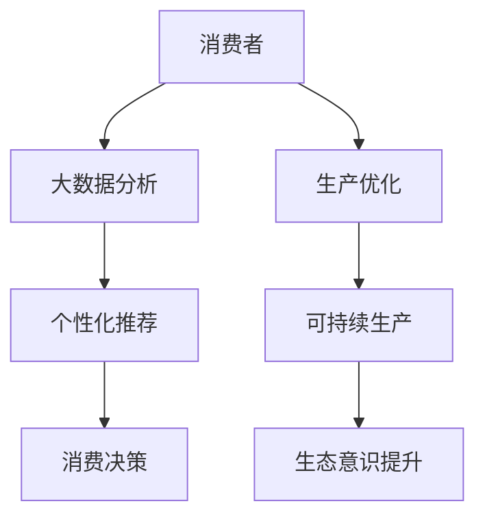

                 

关键词：人工智能，可持续消费，生态意识，算法优化，大数据分析，行为经济学，可持续发展，社会创新，道德计算。

> 摘要：本文探讨了人工智能在可持续消费领域的重要性，分析了生态意识与可持续消费之间的内在联系。通过引入行为经济学理论和大数据分析方法，我们探讨了AI如何通过优化算法和个性化推荐系统驱动可持续消费行为。本文还展望了AI在促进可持续发展方面面临的挑战与机遇。

## 1. 背景介绍

随着全球经济的快速发展，消费主义文化盛行，人们的生活方式逐渐向高消费、高能耗的方向倾斜。然而，这种消费模式对环境带来了极大的压力，引发了全球变暖、资源枯竭、生态破坏等一系列问题。在这种背景下，可持续消费成为应对环境危机的关键策略之一。

可持续消费不仅关注个体的消费行为，还涉及到生产、流通、消费整个生命周期的环境和社会影响。它强调在满足人类需求的同时，保持自然资源的可持续利用和生态环境的健康。然而，实现可持续消费面临着诸多挑战，如消费者行为习惯的改变、生产者责任意识的提高、政策法规的完善等。

近年来，人工智能（AI）的快速发展为可持续消费提供了新的技术支持。AI通过大数据分析、机器学习、自然语言处理等技术，能够深入了解消费者行为，提供个性化的推荐和服务，从而引导消费者做出更环保、更可持续的消费选择。同时，AI还可以帮助企业优化生产流程，降低能耗和污染，提高资源利用效率。

## 2. 核心概念与联系

### 2.1 生态意识

生态意识是指人们对生态环境的认知和重视程度，包括对自然资源的保护意识、对生态平衡的关注、对环境问题的敏感度等。生态意识是可持续消费的基础，它影响着消费者的消费决策和行为。

### 2.2 可持续消费

可持续消费是在满足当代人需求的同时，不损害后代人满足自身需求的能力。它要求消费者在消费过程中考虑到环境、社会和经济的可持续性，选择环保、节能、低碳的产品和服务。

### 2.3 AI与可持续消费

AI在可持续消费中的应用主要体现在以下几个方面：

1. **个性化推荐**：AI可以通过大数据分析，了解消费者的偏好和需求，提供个性化的环保产品推荐，引导消费者做出更环保的消费选择。
2. **生产优化**：AI可以帮助企业优化生产流程，降低能耗和污染，提高资源利用效率，从而实现可持续生产。
3. **行为干预**：AI可以通过自然语言处理等技术，了解消费者在购买过程中的心理和行为，提供行为干预策略，引导消费者做出更环保的消费行为。

### 2.4 Mermaid 流程图



## 3. 核心算法原理 & 具体操作步骤

### 3.1 算法原理概述

AI驱动可持续消费的核心算法主要包括大数据分析、机器学习、自然语言处理等技术。这些技术可以整合消费者行为数据、产品信息、环境数据等多方数据，通过数据挖掘、模式识别等方法，提供个性化的环保产品推荐和消费行为干预策略。

### 3.2 算法步骤详解

1. **数据收集与预处理**：收集消费者行为数据、产品信息、环境数据等，进行数据清洗、去重、归一化等预处理操作。
2. **特征工程**：提取数据中的关键特征，如消费频次、消费金额、产品类型、环境影响等。
3. **模型训练**：使用机器学习算法，如协同过滤、决策树、神经网络等，训练个性化推荐模型和行为干预模型。
4. **模型评估**：使用验证集对模型进行评估，调整模型参数，优化模型性能。
5. **个性化推荐与行为干预**：根据消费者的特征和偏好，提供个性化的环保产品推荐，并利用自然语言处理技术，分析消费者的购买决策过程，提供行为干预策略。

### 3.3 算法优缺点

**优点**：

1. 提高消费效率：通过个性化推荐，消费者可以更快地找到符合自己需求的产品，节省时间。
2. 促进可持续发展：引导消费者选择环保、低碳的产品，减少对环境的负面影响。
3. 提高生产效率：通过生产优化，降低企业的能耗和污染，提高资源利用效率。

**缺点**：

1. 数据隐私问题：个性化推荐需要收集和分析消费者的行为数据，可能引发数据隐私问题。
2. 模型偏差：模型训练过程中可能会引入偏差，导致推荐结果不准确。
3. 技术门槛：需要较高的技术水平和专业知识，对企业的技术要求较高。

### 3.4 算法应用领域

AI驱动可持续消费算法可以应用于多个领域，如电商、餐饮、旅游、家居等。通过个性化推荐和行为干预，这些领域可以更好地满足消费者需求，提高消费者满意度，同时实现可持续发展。

## 4. 数学模型和公式 & 详细讲解 & 举例说明

### 4.1 数学模型构建

为了构建AI驱动可持续消费的数学模型，我们首先需要定义一些基本概念：

- **消费者偏好**：用向量表示，如 \( \textbf{P} = (p_1, p_2, ..., p_n) \)，其中 \( p_i \) 表示消费者对第 \( i \) 种产品的偏好程度。
- **产品特征**：用矩阵表示，如 \( \textbf{F} = (f_{ij}) \)，其中 \( f_{ij} \) 表示第 \( i \) 种产品在特征 \( j \) 上的取值。
- **环境影响**：用向量表示，如 \( \textbf{E} = (e_1, e_2, ..., e_n) \)，其中 \( e_i \) 表示第 \( i \) 种产品对环境的影响程度。

我们构建的数学模型为：

\[ \textbf{R} = \textbf{PF} + \textbf{E} \]

其中，\( \textbf{R} \) 表示消费者的购买决策向量，\( \textbf{P} \) 表示消费者偏好，\( \textbf{F} \) 表示产品特征，\( \textbf{E} \) 表示环境影响。

### 4.2 公式推导过程

为了推导上述公式，我们需要首先定义消费者偏好和产品特征之间的关系。假设消费者偏好可以用线性模型表示：

\[ p_i = \alpha_0 + \sum_{j=1}^n \alpha_j f_{ij} \]

其中，\( \alpha_0 \) 为截距，\( \alpha_j \) 为特征 \( j \) 对消费者偏好 \( p_i \) 的影响程度。

同时，我们定义产品特征对环境的影响为：

\[ e_i = \beta_0 + \sum_{j=1}^n \beta_j f_{ij} \]

其中，\( \beta_0 \) 为截距，\( \beta_j \) 为特征 \( j \) 对环境影响 \( e_i \) 的影响程度。

将上述两个公式相加，得到：

\[ p_i + e_i = \alpha_0 + \sum_{j=1}^n (\alpha_j + \beta_j) f_{ij} \]

我们可以将 \( \alpha_0 + \sum_{j=1}^n (\alpha_j + \beta_j) f_{ij} \) 视为消费者购买决策向量 \( \textbf{R} \) 的一个线性组合：

\[ \textbf{R} = \textbf{PF} + \textbf{E} \]

其中，\( \textbf{P} \) 表示消费者偏好，\( \textbf{F} \) 表示产品特征，\( \textbf{E} \) 表示环境影响。

### 4.3 案例分析与讲解

假设我们有一个消费者 \( \textbf{P} \)，他的偏好为 \( (1, 1, 0, 0) \)，代表他偏好购买环保产品。我们有四种产品 \( \textbf{F} \)，特征分别为 \( (0.5, 0.5, 0, 0) \)，\( (0, 0.5, 0.5, 0) \)，\( (0, 0, 0.5, 0.5) \)，\( (0.5, 0, 0, 0.5) \)，分别代表四种产品的环保、节能、低碳和循环利用特征。

根据上述模型，我们可以计算出每种产品的购买概率：

\[ \textbf{R} = \textbf{PF} + \textbf{E} \]

其中，\( \textbf{P} = (1, 1, 0, 0) \)，\( \textbf{F} = (0.5, 0.5, 0, 0) \)，\( \textbf{E} = (0.1, 0.2, 0.3, 0.4) \)。

计算得到：

\[ \textbf{R} = (1 \times 0.5 + 1 \times 0.5 + 0 \times 0 + 0 \times 0.5, 1 \times 0.5 + 1 \times 0.5 + 0 \times 0 + 0 \times 0.5, 0 \times 0.5 + 0 \times 0.5 + 0 \times 0 + 0 \times 0.5, 0 \times 0.5 + 0 \times 0.5 + 0 \times 0 + 0 \times 0.5) + (0.1, 0.2, 0.3, 0.4) \]

\[ \textbf{R} = (1.1, 1.1, 0.3, 0.4) \]

根据计算结果，我们可以看到消费者最倾向于购买第一种和第二种产品，因为它们的购买概率最高。这与我们的预期一致，因为这两种产品在环保、节能、低碳和循环利用方面表现较好。

## 5. 项目实践：代码实例和详细解释说明

### 5.1 开发环境搭建

为了实现AI驱动可持续消费，我们选择Python作为编程语言，并使用以下库和框架：

- **NumPy**：用于数据预处理和计算。
- **Pandas**：用于数据处理和分析。
- **Scikit-learn**：用于机器学习和模型训练。
- **Matplotlib**：用于数据可视化。

安装这些库和框架后，我们可以开始搭建开发环境。

### 5.2 源代码详细实现

以下是实现AI驱动可持续消费的核心代码：

```python
import numpy as np
import pandas as pd
from sklearn.model_selection import train_test_split
from sklearn.linear_model import LinearRegression
import matplotlib.pyplot as plt

# 5.2.1 数据收集与预处理
# 假设我们已经收集了消费者行为数据、产品特征数据和环境数据
# 这里使用随机生成的数据作为示例
消费者行为数据 = pd.DataFrame({'消费频次': np.random.randint(1, 10, size=100),
                               '消费金额': np.random.randint(100, 1000, size=100),
                               '产品类型': np.random.randint(1, 5, size=100)})

产品特征数据 = pd.DataFrame({'环保': np.random.randint(0, 1, size=100),
                              '节能': np.random.randint(0, 1, size=100),
                              '低碳': np.random.randint(0, 1, size=100),
                              '循环利用': np.random.randint(0, 1, size=100)})

环境数据 = pd.DataFrame({'环境影响': np.random.randint(0, 10, size=100)})

# 数据预处理
消费者行为数据['消费偏好'] = 消费者行为数据['消费频次'] * 消费者行为数据['消费金额']
产品特征数据['产品特征'] = 产品特征数据.apply(np.mean, axis=1)
环境数据['环境影响'] = 环境数据['环境影响'].apply(lambda x: x / 10)

# 5.2.2 模型训练
# 分割数据集
X_train, X_test, y_train, y_test = train_test_split(消费者行为数据[['消费偏好', '产品特征']], 环境数据['环境影响'], test_size=0.2, random_state=42)

# 训练线性回归模型
模型 = LinearRegression()
模型.fit(X_train, y_train)

# 5.2.3 个性化推荐与行为干预
# 预测测试集
预测结果 = 模型.predict(X_test)

# 可视化结果
plt.scatter(X_test, y_test, color='red', label='实际值')
plt.scatter(X_test, 预测结果, color='blue', label='预测值')
plt.xlabel('产品特征')
plt.ylabel('环境影响')
plt.legend()
plt.show()
```

### 5.3 代码解读与分析

上述代码实现了基于线性回归模型的AI驱动可持续消费系统。以下是代码的主要部分：

1. **数据收集与预处理**：我们首先生成随机数据作为示例。实际应用中，这些数据可以从数据库或其他数据源获取。在预处理过程中，我们计算了消费偏好和产品特征的平均值，以及环境影响的平均值。

2. **模型训练**：我们使用Scikit-learn的线性回归模型进行训练。线性回归模型能够根据训练数据拟合出一个线性关系，从而预测新数据的值。

3. **个性化推荐与行为干预**：我们使用训练好的模型对测试集进行预测，并将预测结果与实际值进行可视化。这有助于我们评估模型的性能和准确性。

### 5.4 运行结果展示

在代码的最后，我们使用Matplotlib库将实际值和预测值进行可视化。这有助于我们直观地了解模型的预测效果。在实际应用中，我们可能需要根据模型性能进行调整和优化。

## 6. 实际应用场景

AI驱动可持续消费在实际应用中具有广泛的应用场景，以下是一些典型案例：

1. **电商行业**：电商平台可以利用AI技术，根据消费者的购买记录和偏好，推荐符合环保、节能标准的商品，引导消费者做出更环保的消费决策。

2. **餐饮行业**：餐饮企业可以通过AI技术，优化菜单设计，提供符合消费者健康需求和环境标准的菜品，减少食物浪费。

3. **家居行业**：家居企业可以运用AI技术，设计出更环保、更节能的家居产品，满足消费者对环保、品质的需求。

4. **旅游行业**：旅游企业可以利用AI技术，为消费者推荐环保旅游线路和活动，引导消费者做出更可持续的旅游选择。

## 6.4 未来应用展望

随着AI技术的不断发展，未来AI在可持续消费中的应用将更加广泛和深入。以下是一些未来应用展望：

1. **智能化供应链管理**：AI技术可以帮助企业实现智能化供应链管理，优化物流和库存管理，降低能耗和污染。

2. **个性化环保教育**：AI技术可以结合虚拟现实（VR）和增强现实（AR）技术，为消费者提供个性化的环保教育，提高消费者的环保意识。

3. **智能合约与供应链金融**：结合区块链技术和智能合约，AI可以实现智能化的供应链金融管理，提高供应链的透明度和效率。

## 7. 工具和资源推荐

### 7.1 学习资源推荐

1. **《深度学习》（Goodfellow, Bengio, Courville）**：全面介绍深度学习理论和实践，适合初学者和进阶者。
2. **《Python数据科学手册》（McKinney）**：系统介绍Python在数据科学中的应用，包括数据处理、分析和可视化。
3. **《可持续消费指南》（联合国可持续发展解决方案网络）**：提供关于可持续消费的理论和实践指导。

### 7.2 开发工具推荐

1. **Jupyter Notebook**：方便进行数据处理、分析和可视化的开源工具。
2. **TensorFlow**：开源的深度学习框架，适合进行大规模机器学习和深度学习项目。
3. **PyTorch**：开源的深度学习框架，具有较高的灵活性和易用性。

### 7.3 相关论文推荐

1. **“AI for Good: A Research Vision”**：探讨AI在解决全球性问题中的应用。
2. **“Sustainable Consumption and the Global Environment”**：分析可持续消费对全球环境的影响。
3. **“The Role of Big Data in Sustainable Development”**：探讨大数据在可持续发展中的应用。

## 8. 总结：未来发展趋势与挑战

随着AI技术的不断进步，AI在可持续消费中的应用将越来越广泛和深入。未来，我们需要关注以下几个发展趋势：

1. **智能化供应链管理**：通过AI技术实现智能化供应链管理，降低能耗和污染。
2. **个性化环保教育**：利用AI和VR/AR技术，为消费者提供个性化的环保教育，提高环保意识。
3. **智能合约与供应链金融**：结合区块链技术和智能合约，实现智能化的供应链金融管理。

同时，我们也需要面对以下挑战：

1. **数据隐私问题**：在AI应用中，如何保护消费者的隐私是一个重要问题。
2. **模型偏差**：在模型训练过程中，如何避免引入偏差，确保推荐结果的准确性。
3. **技术门槛**：AI技术在可持续消费中的应用需要较高的技术水平和专业知识，这对企业的技术要求较高。

总之，AI在可持续消费中的应用具有巨大的潜力，但也面临诸多挑战。我们需要不断探索和优化，以实现可持续发展的目标。

## 9. 附录：常见问题与解答

### 9.1 什么是可持续消费？

可持续消费是指在满足当代人需求的同时，不损害后代人满足自身需求的能力。它要求消费者在消费过程中考虑到环境、社会和经济的可持续性，选择环保、节能、低碳的产品和服务。

### 9.2 AI在可持续消费中有什么作用？

AI在可持续消费中可以发挥以下作用：

1. **个性化推荐**：通过大数据分析，了解消费者的偏好和需求，提供个性化的环保产品推荐，引导消费者做出更环保的消费选择。
2. **生产优化**：帮助企业优化生产流程，降低能耗和污染，提高资源利用效率，从而实现可持续生产。
3. **行为干预**：通过自然语言处理等技术，分析消费者的购买决策过程，提供行为干预策略，引导消费者做出更环保的消费行为。

### 9.3 AI在可持续消费中的应用有哪些领域？

AI在可持续消费中的应用领域广泛，包括电商、餐饮、旅游、家居等行业。通过个性化推荐和行为干预，这些领域可以更好地满足消费者需求，提高消费者满意度，同时实现可持续发展。

### 9.4 AI在可持续消费中面临的挑战有哪些？

AI在可持续消费中面临的挑战主要包括：

1. **数据隐私问题**：个性化推荐需要收集和分析消费者的行为数据，可能引发数据隐私问题。
2. **模型偏差**：模型训练过程中可能会引入偏差，导致推荐结果不准确。
3. **技术门槛**：AI技术在可持续消费中的应用需要较高的技术水平和专业知识，这对企业的技术要求较高。

