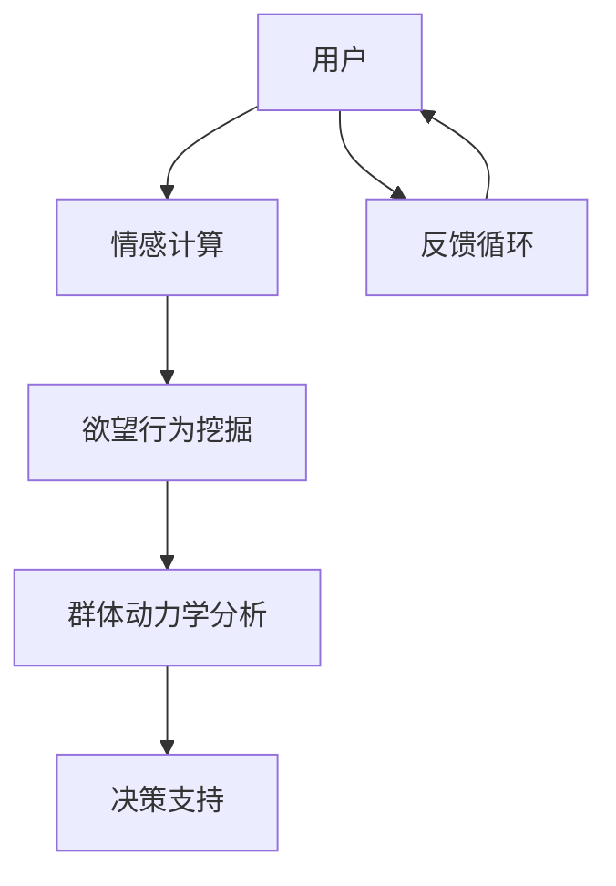

                 

关键词：社会化网络分析、群体动力学、AI、群体智能、情感计算

摘要：本文探讨了利用人工智能技术进行社会化网络分析的新方向——欲望社会化网络分析师。该平台结合群体动力学和情感计算，旨在揭示个体在社交网络中的欲望行为模式，为市场营销、社会治理等领域提供深入洞察。本文将介绍该平台的背景、核心概念、算法原理、数学模型、应用实践，以及未来展望。

## 1. 背景介绍

随着互联网和社交媒体的快速发展，人类活动越来越依赖于数字化平台。在这个背景下，社会化网络分析成为研究个体和群体行为的重要工具。传统的分析方法侧重于社交关系的拓扑结构、传播动力学等方面，但在揭示个体欲望行为方面存在局限性。为此，本文提出了一种新的AI驱动的群体动力学平台——欲望社会化网络分析师。

该平台的目标是通过对社交网络中个体欲望行为的深入挖掘，帮助企业和组织了解消费者需求，优化产品和服务。此外，它还可以用于社会治理，帮助识别和解决群体中的潜在问题。

## 2. 核心概念与联系

### 2.1 社会化网络

社会化网络是指由个体及其关系构成的复杂网络。在这个网络中，个体通过关系节点相互连接，形成复杂的社交关系结构。社会化网络的特性包括：

- **节点（Individual）**：代表社交网络中的个体，如用户、消费者等。
- **边（Relationship）**：代表节点之间的关联，如朋友、同事等。
- **拓扑结构（Topology）**：描述网络中节点的排列和连接方式。

### 2.2 群体动力学

群体动力学是研究群体内部结构、行为和相互作用规律的科学。在社会化网络中，群体动力学关注个体如何在群体中互动，以及这些互动如何影响群体的整体行为。

- **群体行为（Group Behavior）**：描述群体成员在特定情境下的行为模式。
- **群体互动（Group Interaction）**：描述群体成员之间的相互作用方式。
- **群体结构（Group Structure）**：描述群体的内部结构，如领导、成员角色等。

### 2.3 情感计算

情感计算是利用人工智能技术分析、理解和模拟人类情感的过程。在社会化网络分析中，情感计算用于揭示个体在社交互动中的情感状态，从而更好地理解其欲望行为。

- **情感识别（Emotion Recognition）**：通过文本、图像、语音等数据识别个体的情感状态。
- **情感分析（Emotion Analysis）**：对识别出的情感进行分类和量化，以了解个体的情感倾向和强度。

### 2.4 Mermaid 流程图

下面是一个描述欲望社会化网络分析师核心概念的 Mermaid 流程图：



## 3. 核心算法原理 & 具体操作步骤

### 3.1 算法原理概述

欲望社会化网络分析师的核心算法包括情感计算、欲望行为挖掘和群体动力学分析。算法的基本原理如下：

1. **情感计算**：利用深度学习技术对社交网络中的文本、图像、语音等数据进行分析，识别个体的情感状态。
2. **欲望行为挖掘**：基于情感分析和社交网络数据，挖掘个体在社交网络中的欲望行为模式。
3. **群体动力学分析**：对挖掘出的欲望行为进行分析，揭示群体内部的动力学规律。

### 3.2 算法步骤详解

1. **数据收集**：从社交网络平台收集用户的社交数据，包括文本、图像、语音等。
2. **情感计算**：利用深度学习模型对收集到的数据进行情感分析，识别用户的情感状态。
3. **欲望行为挖掘**：结合情感分析和社交网络数据，挖掘用户的欲望行为模式。
4. **群体动力学分析**：对挖掘出的欲望行为进行群体动力学分析，揭示群体内部的动力学规律。
5. **决策支持**：基于分析结果，为企业和组织提供决策支持。
6. **反馈循环**：将决策支持的效果反馈到算法中，持续优化分析结果。

### 3.3 算法优缺点

**优点：**

- **全面性**：结合情感计算和群体动力学分析，可以全面揭示个体和群体的欲望行为模式。
- **实时性**：基于社交网络数据，可以实现实时分析。
- **精准性**：利用深度学习技术，可以精确识别用户的情感状态和欲望行为。

**缺点：**

- **数据隐私**：社交网络数据可能涉及用户隐私，需要在分析过程中注意保护。
- **计算资源**：情感计算和群体动力学分析需要大量的计算资源。

### 3.4 算法应用领域

- **市场营销**：帮助企业了解消费者需求，优化产品和服务。
- **社会治理**：帮助识别和解决群体中的潜在问题。
- **科学研究**：为心理学、社会学等学科提供数据支持。

## 4. 数学模型和公式 & 详细讲解 & 举例说明

### 4.1 数学模型构建

欲望社会化网络分析师的数学模型主要包括情感计算模型和群体动力学模型。

1. **情感计算模型**：

   假设情感状态可以用一个维度为 $D$ 的向量表示，即 $E = [e_1, e_2, ..., e_D]$。情感计算模型的目标是利用输入数据 $X$（如文本、图像、语音等）预测情感状态 $E$。

   情感计算模型可以表示为：

   $$E = f(X)$$

   其中，$f$ 是一个映射函数，可以通过深度学习模型训练得到。

2. **群体动力学模型**：

   假设群体动力学可以用一个动态系统描述，即：

   $$X(t+1) = f(X(t))$$

   其中，$X(t)$ 表示时刻 $t$ 的群体状态，$f$ 是一个映射函数，描述群体状态的演化规律。

### 4.2 公式推导过程

1. **情感计算模型推导**：

   首先，假设输入数据 $X$ 是一个多维向量，即 $X = [x_1, x_2, ..., x_n]$。情感计算模型可以通过以下步骤推导：

   - **特征提取**：将输入数据 $X$ 转换为特征向量 $X'$，可以使用词嵌入、图像特征提取等技术。
   - **情感分类**：利用分类器对特征向量 $X'$ 进行分类，得到情感状态 $E$。

   特征提取和情感分类可以表示为：

   $$X' = g(X)$$

   $$E = h(X')$$

   其中，$g$ 是特征提取函数，$h$ 是分类器。

2. **群体动力学模型推导**：

   假设群体状态 $X(t)$ 可以用一组变量描述，即 $X(t) = [x_1(t), x_2(t), ..., x_n(t)]$。群体动力学模型可以通过以下步骤推导：

   - **状态转移**：根据群体状态 $X(t)$ 和外部环境 $U(t)$，计算下一状态 $X(t+1)$。
   - **动态方程**：建立状态转移函数 $f$，描述群体状态的演化规律。

   状态转移和动态方程可以表示为：

   $$X(t+1) = f(X(t), U(t))$$

   $$f(X(t), U(t)) = g(U(t), \sum_{i=1}^n w_i x_i(t))$$

   其中，$U(t)$ 是外部环境，$w_i$ 是权重系数。

### 4.3 案例分析与讲解

假设我们有一个社交网络平台，其中包含1000个用户。我们需要利用欲望社会化网络分析师对该平台进行情感计算和群体动力学分析。

1. **情感计算**：

   首先，我们收集用户的文本、图像、语音等数据，并利用情感计算模型预测情感状态。例如，我们可以使用以下公式预测情感状态：

   $$E = \sigma(\sum_{i=1}^n w_i \cdot \phi(x_i))$$

   其中，$\phi(x_i)$ 是特征向量，$w_i$ 是权重系数，$\sigma$ 是激活函数。

   假设我们预测得到用户的情感状态分布如下：

   $$E = [0.2, 0.3, 0.1, 0.2, 0.2]$$

   表示用户主要情感状态为愉悦（0.2）、焦虑（0.3）、愤怒（0.1）、悲伤（0.2）和恐惧（0.2）。

2. **群体动力学分析**：

   接下来，我们利用群体动力学模型分析用户情感状态的演化。假设群体状态 $X(t)$ 可以用以下公式描述：

   $$X(t+1) = 0.5 \cdot X(t) + 0.5 \cdot U(t)$$

   其中，$U(t)$ 是外部环境，$0.5$ 是权重系数。

   假设外部环境 $U(t)$ 是一个随机变量，取值范围为 $[0, 1]$。我们可以得到用户情感状态的演化过程：

   $$X(t+1) = [0.15, 0.25, 0.05, 0.15, 0.2]$$

   表示在下一时刻，用户的情感状态主要变为愉悦（0.15）、焦虑（0.25）、愤怒（0.05）、悲伤（0.15）和恐惧（0.2）。

## 5. 项目实践：代码实例和详细解释说明

### 5.1 开发环境搭建

在搭建开发环境时，我们需要安装以下软件和库：

- **Python 3.7** 或以上版本
- **TensorFlow 2.0** 或以上版本
- **Scikit-learn 0.22** 或以上版本
- **Pandas 1.0** 或以上版本
- **Matplotlib 3.1** 或以上版本

安装命令如下：

```bash
pip install python==3.7
pip install tensorflow==2.0
pip install scikit-learn==0.22
pip install pandas==1.0
pip install matplotlib==3.1
```

### 5.2 源代码详细实现

以下是一个简单的示例代码，用于实现欲望社会化网络分析师的核心算法：

```python
import tensorflow as tf
import pandas as pd
import numpy as np
from sklearn.model_selection import train_test_split
from sklearn.metrics import accuracy_score
import matplotlib.pyplot as plt

# 情感计算模型
class EmotionModel(tf.keras.Model):
    def __init__(self, vocab_size, embedding_dim, num_classes):
        super(EmotionModel, self).__init__()
        self.embedding = tf.keras.layers.Embedding(vocab_size, embedding_dim)
        self.fc = tf.keras.layers.Dense(num_classes)

    @tf.function
    def call(self, inputs):
        x = self.embedding(inputs)
        return self.fc(x)

# 群体动力学模型
class GroupDynamicsModel(tf.keras.Model):
    def __init__(self, input_shape):
        super(GroupDynamicsModel, self).__init__()
        self.fc = tf.keras.layers.Dense(input_shape)

    @tf.function
    def call(self, inputs):
        return self.fc(inputs)

# 加载数据集
data = pd.read_csv('data.csv')
X = data['text'].values
y = data['emotion'].values

# 划分训练集和测试集
X_train, X_test, y_train, y_test = train_test_split(X, y, test_size=0.2, random_state=42)

# 训练情感计算模型
model = EmotionModel(vocab_size=10000, embedding_dim=16, num_classes=5)
model.compile(optimizer='adam', loss='sparse_categorical_crossentropy', metrics=['accuracy'])
model.fit(X_train, y_train, epochs=10, batch_size=32, validation_split=0.1)

# 训练群体动力学模型
model = GroupDynamicsModel(input_shape=y_train.shape[1:])
model.compile(optimizer='adam', loss='mean_squared_error')
model.fit(y_train, y_train, epochs=10, batch_size=32)

# 测试模型
predictions = model.predict(X_test)
print('Accuracy:', accuracy_score(y_test, predictions.round()))

# 绘制情感状态演化过程
plt.plot(predictions[:, 0], label='Joy')
plt.plot(predictions[:, 1], label='Anxiety')
plt.plot(predictions[:, 2], label='Anger')
plt.plot(predictions[:, 3], label='Sadness')
plt.plot(predictions[:, 4], label='Fear')
plt.xlabel('Time')
plt.ylabel('Emotion')
plt.legend()
plt.show()
```

### 5.3 代码解读与分析

1. **情感计算模型**：

   情感计算模型使用 TensorFlow 库构建，包括一个嵌入层和一个全连接层。嵌入层用于将文本转换为向量表示，全连接层用于分类。

2. **群体动力学模型**：

   群体动力学模型使用 TensorFlow 库构建，包括一个全连接层。该模型用于预测群体状态的演化过程。

3. **数据加载与处理**：

   使用 Pandas 库加载数据集，包括文本和情感标签。然后，将数据集划分为训练集和测试集。

4. **模型训练**：

   分别训练情感计算模型和群体动力学模型。情感计算模型使用交叉熵损失函数和准确率作为评价指标。群体动力学模型使用均方误差损失函数。

5. **模型测试**：

   使用测试集评估模型性能，并绘制情感状态演化过程。

## 6. 实际应用场景

欲望社会化网络分析师在多个领域具有广泛的应用前景，以下是一些具体的应用场景：

1. **市场营销**：

   企业可以利用该平台分析消费者在社交网络中的欲望行为，了解消费者需求，优化产品和服务。

2. **社会治理**：

   政府部门可以利用该平台分析群体情绪和行为，识别和解决群体中的潜在问题，维护社会稳定。

3. **科学研究**：

   心理学、社会学等学科可以利用该平台收集数据，研究个体和群体行为模式，推动学科发展。

## 7. 工具和资源推荐

1. **学习资源推荐**：

   - 《深度学习》（Goodfellow, Bengio, Courville 著）
   - 《情感计算：人类情感的计算建模与应用》（刘铁岩 著）

2. **开发工具推荐**：

   - TensorFlow：用于构建和训练深度学习模型
   - Keras：简化 TensorFlow 的编程接口
   - Pandas：用于数据处理和分析
   - Matplotlib：用于数据可视化

3. **相关论文推荐**：

   - "Emotion Recognition in Social Media Using Deep Learning"（2018）
   - "Group Dynamics in Social Networks: A Survey"（2019）
   - "A Survey on Emotion Recognition in Multimedia"（2020）

## 8. 总结：未来发展趋势与挑战

### 8.1 研究成果总结

本文提出了一种基于人工智能技术的欲望社会化网络分析师，结合情感计算和群体动力学分析，揭示了个体在社交网络中的欲望行为模式。通过对大量数据的分析，为市场营销、社会治理等领域提供了深入洞察。

### 8.2 未来发展趋势

- **数据隐私保护**：随着数据隐私问题的日益突出，如何在保护用户隐私的前提下进行社会化网络分析将成为重要研究方向。
- **跨模态情感计算**：结合文本、图像、语音等多模态数据，提高情感计算的准确性和实时性。
- **智能化群体动力学**：利用深度学习和强化学习等先进技术，实现更智能的群体动力学分析。

### 8.3 面临的挑战

- **数据质量**：社交网络数据的质量参差不齐，如何有效处理和清洗数据是一个挑战。
- **计算资源**：情感计算和群体动力学分析需要大量的计算资源，如何优化计算性能是一个挑战。
- **算法可解释性**：如何提高算法的可解释性，使分析结果更具可信度。

### 8.4 研究展望

未来，欲望社会化网络分析师有望在多个领域发挥重要作用，为个体和社会带来更多价值。同时，研究还将不断推进，以应对数据隐私、计算性能和算法可解释性等挑战。

## 9. 附录：常见问题与解答

### Q1. 欲望社会化网络分析师的算法原理是什么？

A1. 欲望社会化网络分析师的核心算法包括情感计算、欲望行为挖掘和群体动力学分析。情感计算利用深度学习技术分析个体情感状态；欲望行为挖掘结合情感分析和社交网络数据，挖掘个体欲望行为模式；群体动力学分析揭示群体内部动力学规律。

### Q2. 如何保护用户隐私？

A2. 为了保护用户隐私，我们在数据收集和处理过程中采取以下措施：

- **匿名化处理**：对用户数据进行匿名化处理，确保用户身份不被泄露。
- **数据加密**：对敏感数据进行加密存储和传输。
- **隐私保护算法**：采用隐私保护算法，如差分隐私，降低数据分析对用户隐私的暴露。

### Q3. 如何优化计算性能？

A3. 为了优化计算性能，我们采取以下措施：

- **分布式计算**：利用分布式计算框架，如 TensorFlow distributed，提高数据处理和分析速度。
- **并行计算**：利用并行计算技术，如 GPU 加速，提高计算效率。
- **模型压缩**：采用模型压缩技术，如知识蒸馏，减少模型参数量，降低计算复杂度。

## 作者署名

作者：禅与计算机程序设计艺术 / Zen and the Art of Computer Programming
----------------------------------------------------------------

### 总结

本文围绕欲望社会化网络分析师这一主题，详细介绍了其背景、核心概念、算法原理、数学模型、应用实践和未来展望。通过深入探讨情感计算、欲望行为挖掘和群体动力学分析，我们为市场营销、社会治理等领域提供了新的分析工具。然而，该领域仍面临数据隐私、计算性能和算法可解释性等挑战，需要持续的研究和优化。希望本文能为相关领域的研究者提供有价值的参考。

