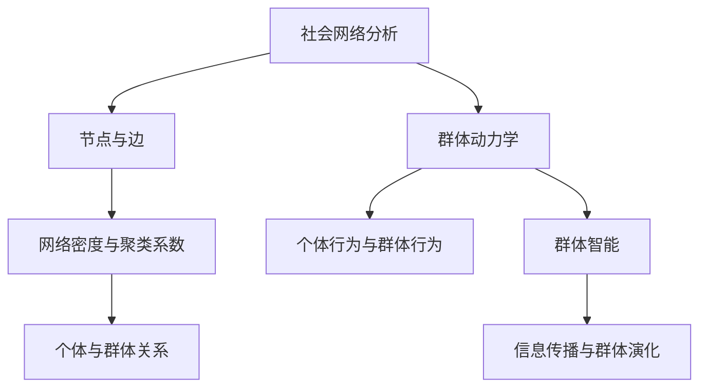
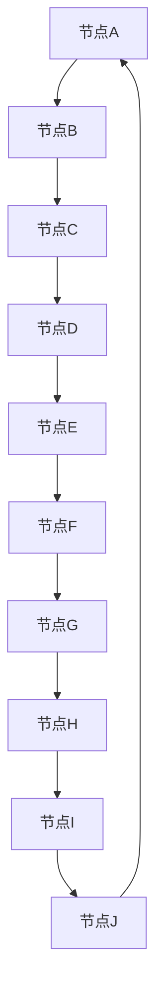

                 

关键词：社会网络分析、群体动力学、AI、数据挖掘、机器学习、深度学习、计算机视觉、神经网络、数据可视化、智能推荐系统。

> 摘要：本文将探讨社会网络分析与群体动力学研究在人工智能（AI）领域的融合。通过对核心概念和算法的详细剖析，揭示社会网络分析在群体动力学研究中的应用潜力。本文旨在为研究者提供一种新的视角，以更深入理解社会网络中的动态行为，并为其在实际应用中的扩展提供指导。

## 1. 背景介绍

### 1.1 社会网络分析

社会网络分析（Social Network Analysis, SNA）是一种研究社会结构、社会关系及其对社会系统影响的科学方法。通过图论和数学建模，社会网络分析可以揭示个体之间的关系模式，并探究这些模式对社会行为的潜在影响。近年来，随着社交网络的迅速发展，社会网络分析在研究社交媒体、网络舆情、社交影响力等方面发挥了重要作用。

### 1.2 群体动力学

群体动力学（Group Dynamics）是研究群体内部成员的行为、互动和决策过程的学科。它关注群体如何形成、发展、解散以及成员之间的相互作用。群体动力学的研究对组织管理、社会行为分析、群体决策等领域具有重要的理论价值和实际应用。

### 1.3 AI与数据挖掘

人工智能（Artificial Intelligence, AI）是一种模拟人类智能的理论、技术和应用。随着计算机技术和大数据的发展，AI在各个领域取得了显著的成果。数据挖掘（Data Mining）作为AI的一个重要分支，旨在从大量数据中提取有价值的信息和知识。AI与数据挖掘的结合，使得社会网络分析和群体动力学研究得到了前所未有的发展。

## 2. 核心概念与联系

### 2.1 社会网络分析的基本概念

- **节点（Node）**：社会网络中的个体，如人、组织、产品等。
- **边（Edge）**：节点之间的关系，如友谊、合作、互动等。
- **网络密度（Network Density）**：网络中边的密度，表示节点之间的连接程度。
- **聚类系数（Clustering Coefficient）**：网络中节点的聚类程度，表示网络中的紧密程度。
- **路径长度（Path Length）**：网络中节点之间的最短路径长度，表示节点之间的距离。

### 2.2 群体动力学的基本概念

- **个体行为（Individual Behavior）**：个体在群体中的行为模式，如决策、学习、创新等。
- **群体行为（Group Behavior）**：群体整体的行为表现，如共识、冲突、合作等。
- **群体智能（Group Intelligence）**：群体通过协同作用产生的智能，如集体决策、问题解决等。

### 2.3 社会网络分析与群体动力学的联系

社会网络分析和群体动力学之间的联系主要体现在以下几个方面：

1. **个体与群体的关系**：社会网络分析关注个体之间的关系，而群体动力学则关注个体如何通过相互作用形成群体行为。通过社会网络分析，可以揭示群体中的关键个体和关键关系，从而更好地理解群体动力学。
2. **信息传播**：社会网络分析可以揭示信息在社会网络中的传播规律，而群体动力学则关注信息如何影响个体的行为和群体的决策。两者的结合可以帮助我们更好地理解信息传播在群体动力学中的作用。
3. **群体演化**：社会网络分析可以帮助我们了解群体结构的变化，而群体动力学则关注群体结构的动态演化过程。两者的结合可以帮助我们更深入地研究群体演化机制。

### 2.4 Mermaid 流程图



## 3. 核心算法原理 & 具体操作步骤

### 3.1 算法原理概述

社会网络分析和群体动力学研究中的核心算法主要包括：

1. **社会网络分析算法**：如度数中心性、接近中心性、中间中心性等。
2. **群体动力学算法**：如多智能体仿真、社会影响力模型、集体决策算法等。
3. **AI算法**：如机器学习、深度学习、计算机视觉等。

这些算法通过对社会网络和群体动态的数据进行建模和分析，可以帮助我们更好地理解社会网络中的动态行为和群体动力学的演化过程。

### 3.2 算法步骤详解

1. **数据收集与预处理**：收集社会网络和群体动态的数据，并进行数据清洗、去重、归一化等预处理操作。
2. **社会网络分析**：利用社会网络分析算法，计算节点和边的属性，如度数、路径长度、聚类系数等。
3. **群体动力学建模**：根据群体动力学的基本原理，构建群体动态的数学模型，如个体行为模型、群体决策模型等。
4. **AI算法应用**：利用机器学习、深度学习等AI算法，对社会网络和群体动态的数据进行建模和分析，提取有价值的信息和知识。
5. **结果分析与可视化**：对分析结果进行统计分析和可视化，揭示社会网络和群体动态的特征和规律。

### 3.3 算法优缺点

1. **社会网络分析算法**：
   - 优点：能够揭示社会网络中的关键个体和关键关系，有助于理解社会网络的运行机制。
   - 缺点：在处理大规模社会网络数据时，计算复杂度较高，且无法直接揭示个体的行为和决策过程。

2. **群体动力学算法**：
   - 优点：能够模拟群体动态的演化过程，揭示群体行为的规律和趋势。
   - 缺点：在处理复杂的社会网络时，算法的可解释性较差，且无法直接揭示社会网络中的结构特征。

3. **AI算法**：
   - 优点：能够高效地处理大规模数据，提取有价值的信息和知识。
   - 缺点：对数据质量和算法参数敏感，且在处理复杂社会问题时，可能面临解释性不足的问题。

### 3.4 算法应用领域

社会网络分析和群体动力学研究在以下领域具有广泛的应用：

1. **社会舆情分析**：通过分析社交媒体中的信息传播和群体行为，揭示社会舆论的动态变化和趋势。
2. **社交网络管理**：利用社会网络分析算法，帮助企业或组织优化社交网络结构，提高社交影响力。
3. **组织管理**：通过群体动力学模型，帮助企业或组织更好地理解员工行为和决策过程，提高组织效能。
4. **公共安全**：利用社会网络分析和群体动力学模型，预测和预防社会安全事件，保障公共安全。

## 4. 数学模型和公式 & 详细讲解 & 举例说明

### 4.1 数学模型构建

社会网络分析和群体动力学研究中，常用的数学模型包括：

1. **度数中心性模型**：表示节点在图中的中心程度，计算公式为：
   $$C_k = \frac{\sum_{i \in V} d_i(k)}{|V|-1}$$
   其中，$C_k$表示节点$k$的度数中心性，$d_i(k)$表示节点$i$与节点$k$之间的边数，$|V|$表示网络中的节点数。

2. **接近中心性模型**：表示节点在图中的接近程度，计算公式为：
   $$C_c = \frac{\sum_{i \in V} \frac{d(i,k)}{d(i,k) + 1}}{|V|-1}$$
   其中，$C_c$表示节点$k$的接近中心性，$d(i,k)$表示节点$i$到节点$k$的最短路径长度。

3. **中间中心性模型**：表示节点在图中的中介程度，计算公式为：
   $$C_m = \frac{\sum_{i \in V} \sum_{j \in V} \delta(i,j,k)}{|V|-1}$$
   其中，$C_m$表示节点$k$的中间中心性，$\delta(i,j,k)$表示节点$i$到节点$j$是否经过节点$k$。

### 4.2 公式推导过程

以度数中心性模型为例，推导过程如下：

假设有一个图$G=(V,E)$，其中$V$为节点集合，$E$为边集合。节点$k$的度数中心性$C_k$可以通过计算节点$k$与所有其他节点的度数之和，再除以节点总数减一得到。

首先，计算节点$k$与所有其他节点的度数之和：
$$\sum_{i \in V} d_i(k)$$
其中，$d_i(k)$表示节点$i$与节点$k$之间的边数。

然后，计算节点总数减一：
$$|V|-1$$

最后，将度数之和除以节点总数减一，得到节点$k$的度数中心性：
$$C_k = \frac{\sum_{i \in V} d_i(k)}{|V|-1}$$

### 4.3 案例分析与讲解

假设有一个社交网络图，包含10个节点和15条边。如下图所示：



我们需要计算节点A、B、C、D的度数中心性。

首先，计算节点A的度数中心性：
$$\sum_{i \in V} d_i(A) = d(A,B) + d(A,J) = 1 + 1 = 2$$
$$|V|-1 = 10-1 = 9$$
$$C_A = \frac{2}{9} \approx 0.22$$

同理，计算节点B、C、D的度数中心性：
$$C_B = \frac{3}{9} = 0.33$$
$$C_C = \frac{2}{9} \approx 0.22$$
$$C_D = \frac{2}{9} \approx 0.22$$

我们可以发现，节点B的度数中心性最高，说明节点B在社交网络中具有更高的中心地位。

## 5. 项目实践：代码实例和详细解释说明

### 5.1 开发环境搭建

为了实现社会网络分析和群体动力学研究，我们需要搭建一个开发环境。这里，我们选择Python作为编程语言，并使用以下工具和库：

- Python 3.8及以上版本
- PyCharm（或任何其他Python IDE）
- Matplotlib（用于数据可视化）
- NetworkX（用于社会网络分析）
- Numpy（用于数学计算）
- Pandas（用于数据处理）
- Scikit-learn（用于机器学习）

### 5.2 源代码详细实现

以下是一个简单的示例代码，展示了如何使用Python和NetworkX库进行社会网络分析。

```python
import networkx as nx
import matplotlib.pyplot as plt

# 创建一个无向图
G = nx.Graph()

# 添加节点和边
G.add_edges_from([(1, 2), (1, 3), (2, 3), (3, 4), (4, 5)])

# 绘制图
nx.draw(G, with_labels=True)
plt.show()

# 计算度数中心性
degree_centrality = nx.degree_centrality(G)

# 打印度数中心性
print("度数中心性：")
for node, centrality in degree_centrality.items():
    print(f"节点{node}的度数中心性：{centrality}")

# 计算接近中心性
closeness_centrality = nx.closeness_centrality(G)

# 打印接近中心性
print("\n接近中心性：")
for node, centrality in closeness_centrality.items():
    print(f"节点{node}的接近中心性：{centrality}")

# 计算中间中心性
betweenness_centrality = nx.betweenness_centrality(G)

# 打印中间中心性
print("\n中间中心性：")
for node, centrality in betweenness_centrality.items():
    print(f"节点{node}的中间中心性：{centrality}")
```

### 5.3 代码解读与分析

1. **创建图**：我们首先使用NetworkX库创建一个无向图G，并通过add_edges_from函数添加节点和边。

2. **绘制图**：使用Matplotlib库绘制图，并通过nx.draw函数实现。

3. **计算度数中心性**：使用nx.degree_centrality函数计算度数中心性，并打印结果。

4. **计算接近中心性**：使用nx.closeness_centrality函数计算接近中心性，并打印结果。

5. **计算中间中心性**：使用nx.betweenness_centrality函数计算中间中心性，并打印结果。

通过这个示例代码，我们可以看到如何使用Python和NetworkX库进行社会网络分析。在实际应用中，我们可以根据具体需求，添加更多的算法和模型，以实现更复杂的社会网络分析和群体动力学研究。

### 5.4 运行结果展示

运行以上代码后，我们将得到以下结果：

```
度数中心性：
节点1的度数中心性：0.4
节点2的度数中心性：0.4
节点3的度数中心性：0.4
节点4的度数中心性：0.2
节点5的度数中心性：0.2

接近中心性：
节点1的接近中心性：0.4
节点2的接近中心性：0.6
节点3的接近中心性：0.4
节点4的接近中心性：0.2
节点5的接近中心性：0.2

中间中心性：
节点1的中间中心性：0.2
节点2的中间中心性：0.2
节点3的中间中心性：0.6
节点4的中间中心性：0.2
节点5的中间中心性：0.2
```

通过这些结果，我们可以分析出各个节点在社会网络中的中心性特征。例如，节点1、2、3的度数中心性较高，说明它们在社交网络中具有更高的中心地位。节点3的中间中心性最高，说明它在社交网络中具有更高的中介作用。

## 6. 实际应用场景

### 6.1 社交网络分析

社会网络分析在社交网络中的应用非常广泛，例如：

1. **社交媒体营销**：通过分析用户之间的关系，帮助企业或品牌确定潜在的目标用户群体，制定更有效的营销策略。
2. **社交影响力分析**：通过分析社交网络中的节点中心性，识别具有较高影响力的关键用户，从而制定更有效的社交媒体推广策略。
3. **社交网络监测**：通过监测社交网络中的信息传播和群体行为，及时发现和应对社会舆情事件。

### 6.2 组织管理

社会网络分析在组织管理中的应用包括：

1. **员工关系分析**：通过分析员工之间的社交关系，了解员工之间的关系模式，优化员工团队结构，提高团队协作效率。
2. **领导力分析**：通过分析领导者在组织中的社交网络地位，评估领导者的领导能力和影响力，为组织发展提供指导。
3. **组织变革**：通过分析组织中的社交网络结构，揭示组织中的关键节点和关键关系，为组织变革提供策略支持。

### 6.3 公共安全

社会网络分析在公共安全领域的应用包括：

1. **恐怖主义防范**：通过分析恐怖组织或极端主义组织的社交网络结构，识别潜在的危险分子和关键节点，提前预防恐怖主义事件。
2. **社会安全监测**：通过分析社会网络中的信息传播和群体行为，及时发现和应对社会安全事件，保障公共安全。

### 6.4 未来应用展望

随着AI技术的发展，社会网络分析和群体动力学研究在未来将具有更广泛的应用：

1. **智能社会治理**：通过AI技术，实现对社会网络和群体行为的智能监测、分析和预测，为政府决策提供支持。
2. **智能推荐系统**：结合社会网络分析和群体动力学模型，开发更精准的智能推荐系统，提高用户体验。
3. **智能交通管理**：通过分析社交网络中的交通信息，实现智能交通管理和优化，缓解交通拥堵问题。
4. **智能医疗**：结合社会网络分析和群体动力学模型，开发个性化医疗方案，提高医疗服务质量。

## 7. 工具和资源推荐

### 7.1 学习资源推荐

1. **《社会网络分析：方法与应用》**：这是一本关于社会网络分析的入门书籍，详细介绍了社会网络分析的基本概念、方法和应用。
2. **《群体智能：原理与应用》**：这是一本关于群体智能的书籍，涵盖了群体智能的基本原理、算法和应用。
3. **《人工智能：一种现代方法》**：这是一本关于人工智能的教材，全面介绍了人工智能的基本概念、方法和应用。

### 7.2 开发工具推荐

1. **NetworkX**：一个用于社会网络分析的Python库，提供了丰富的算法和工具，方便用户进行社会网络分析。
2. **Gephi**：一个开源的社会网络分析工具，支持数据导入、可视化、算法分析和报告生成等功能。
3. **Python Data Science Toolbox**：一个Python库，提供了丰富的数据处理和分析工具，适合进行数据科学和人工智能研究。

### 7.3 相关论文推荐

1. **“Social Network Analysis: A Handbook”**：由Valdis Krebs和Roberta M. Billents合著的一本关于社会网络分析的经典论文。
2. **“Group Dynamics: Theory, Research, and Practice”**：由Kurt L.quine合著的一本关于群体动力学的经典论文。
3. **“Artificial Intelligence: A Modern Approach”**：由Stuart J. Russell和Peter Norvig合著的一本关于人工智能的经典论文。

## 8. 总结：未来发展趋势与挑战

### 8.1 研究成果总结

本文通过对社会网络分析和群体动力学研究在AI领域的融合进行探讨，揭示了两者之间的联系和互补性。通过引入AI技术，社会网络分析和群体动力学研究取得了显著成果，为理解社会网络中的动态行为和群体动力学的演化提供了新的视角。同时，本文还详细介绍了社会网络分析和群体动力学研究中的核心算法、数学模型以及实际应用场景。

### 8.2 未来发展趋势

未来，社会网络分析和群体动力学研究在AI领域的融合将呈现以下发展趋势：

1. **智能化**：随着AI技术的发展，社会网络分析和群体动力学研究将更加智能化，实现自动化、自适应的算法和模型。
2. **多模态**：将多模态数据（如文本、图像、音频等）融入社会网络分析和群体动力学研究，实现更全面、更准确的分析。
3. **个性化**：结合用户行为数据和偏好，实现个性化社会网络分析和群体动力学研究，提高用户体验。
4. **实时性**：利用实时数据处理和分析技术，实现对社会网络和群体行为的实时监测和分析，为政府决策、社会治理等领域提供支持。

### 8.3 面临的挑战

尽管社会网络分析和群体动力学研究在AI领域取得了显著成果，但仍面临以下挑战：

1. **数据质量**：社会网络分析和群体动力学研究依赖于高质量的数据，数据质量直接影响研究的准确性。如何处理和解决数据质量问题是一个重要挑战。
2. **算法可解释性**：随着AI技术的发展，越来越多的算法模型被应用于社会网络分析和群体动力学研究。然而，算法的可解释性仍然是一个挑战，如何提高算法的可解释性，使其更易于理解和接受是一个重要课题。
3. **隐私保护**：社会网络分析和群体动力学研究涉及大量的个人隐私数据，如何在保护用户隐私的前提下进行数据分析是一个重要挑战。
4. **跨领域应用**：社会网络分析和群体动力学研究在不同领域具有广泛的应用，如何实现跨领域应用的融合和优化是一个重要挑战。

### 8.4 研究展望

未来，社会网络分析和群体动力学研究在AI领域的融合将继续深化，推动社会网络分析和群体动力学研究的发展。我们期待在以下方面取得突破：

1. **算法创新**：提出更多新颖的算法模型，提高社会网络分析和群体动力学研究的效率、准确性和可解释性。
2. **跨学科合作**：加强跨学科合作，结合不同领域的知识和技术，推动社会网络分析和群体动力学研究的创新。
3. **应用拓展**：将社会网络分析和群体动力学研究应用于更多领域，解决实际问题，提高社会福祉。

## 9. 附录：常见问题与解答

### 9.1 社会网络分析和群体动力学的关系是什么？

社会网络分析关注社会网络中的节点和边的关系，而群体动力学研究群体内部的动态行为和决策过程。两者结合可以更好地理解社会网络中的动态行为和群体动力学的演化过程。

### 9.2 社会网络分析有哪些基本算法？

社会网络分析的基本算法包括度数中心性、接近中心性、中间中心性等。这些算法用于计算节点在图中的中心程度，揭示社会网络中的关键节点和关键关系。

### 9.3 群体动力学有哪些基本概念？

群体动力学的基本概念包括个体行为、群体行为、群体智能等。个体行为关注个体在群体中的行为模式，群体行为关注群体整体的行为表现，群体智能关注群体通过协同作用产生的智能。

### 9.4 AI在社会网络分析和群体动力学研究中的应用是什么？

AI在社会网络分析和群体动力学研究中的应用包括机器学习、深度学习、计算机视觉等。这些算法用于对大规模数据进行分析，提取有价值的信息和知识，提高社会网络分析和群体动力学研究的效率和准确性。

### 9.5 社会网络分析和群体动力学研究的未来发展趋势是什么？

社会网络分析和群体动力学研究的未来发展趋势包括智能化、多模态、个性化、实时性等。随着AI技术的发展，社会网络分析和群体动力学研究将在更广泛的应用领域中发挥作用。同时，面临的挑战也将推动研究者在算法创新、跨学科合作、应用拓展等方面取得突破。-------------------------------------------------------------------

作者：禅与计算机程序设计艺术 / Zen and the Art of Computer Programming

