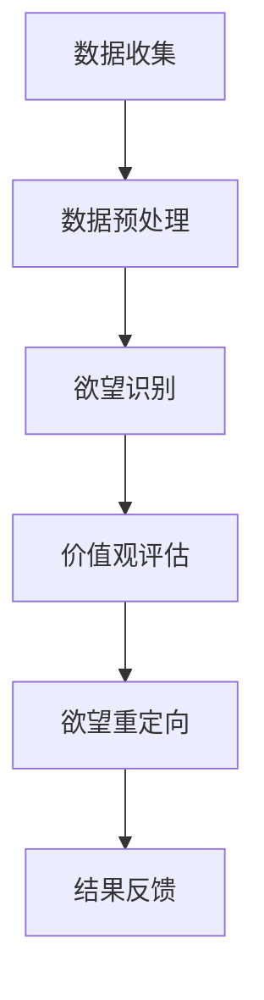

                 

### 背景介绍 ###

在当今世界，信息技术的发展正以前所未有的速度改变着我们的生活。人工智能（AI）作为信息技术的前沿领域，正在重塑我们的工作方式、沟通方式以及日常生活的各个方面。然而，随着AI技术的日益成熟，一个不可忽视的问题逐渐显现：AI技术的应用可能会对人类的欲望产生重大影响，甚至有可能导致价值观的扭曲。

在这个背景下，本文将探讨一个新兴但极具潜力的概念——欲望重定向compass（以下简称“compass”）。compass是一种由AI引导的价值观重塑工具，旨在帮助用户重新审视和调整自己的欲望，使其与更积极的价值观和目标相一致。本文将详细介绍compass的设计理念、核心算法原理、数学模型以及实际应用场景，并探讨其未来发展的趋势与挑战。

本文结构如下：

1. **背景介绍**：概述AI技术发展及其对人类欲望的影响。
2. **核心概念与联系**：介绍compass的设计理念、工作原理及相关技术。
3. **核心算法原理 & 具体操作步骤**：详解compass的核心算法及其应用领域。
4. **数学模型和公式 & 详细讲解 & 举例说明**：讲解compass的数学模型和公式。
5. **项目实践：代码实例和详细解释说明**：展示compass的实际应用。
6. **实际应用场景**：探讨compass在不同领域中的应用。
7. **工具和资源推荐**：推荐相关学习资源和开发工具。
8. **总结：未来发展趋势与挑战**：总结研究成果并展望未来。

### 核心概念与联系

#### 设计理念

compass的设计理念源于对人类欲望的深刻理解。人类欲望是复杂的，既包括基本的生活需求，如食物、安全和爱，也包括更高级的精神追求，如自我实现和创造。然而，在现代社会，过度的欲望和错误的价值观导向可能导致个人和社会问题的加剧，如物质主义、消费主义和社会不公。

compass旨在通过AI技术，帮助用户识别、分析和调整自己的欲望。它不仅能够帮助用户了解自己的欲望来源和影响，还能够提供一套方法来引导用户追求更健康、积极的价值观。

#### 工作原理

compass的工作原理基于以下几个核心步骤：

1. **数据收集与预处理**：compass首先通过传感器、用户行为数据和社交媒体等渠道收集用户的数据。这些数据包括用户的浏览记录、社交媒体互动、消费习惯等。
2. **欲望识别**：使用机器学习算法，compass分析用户数据，识别出用户的欲望。这包括对欲望的强度、频率和类型进行分类。
3. **价值观评估**：compass通过一套评估体系，对用户的欲望进行价值观评估。它考虑了用户的社会背景、文化环境和个人信仰等因素，以确定每个欲望的价值观导向。
4. **欲望重定向**：基于价值观评估结果，compass提供一系列策略和工具，帮助用户调整欲望，使其更符合用户的长远目标和价值观。

#### 技术架构

为了实现上述功能，compass采用了一种分布式技术架构，包括以下几个关键组件：

1. **数据层**：包括数据收集、存储和管理模块。该层负责收集和处理各种用户数据。
2. **算法层**：包括机器学习模型、数据分析工具和算法优化模块。该层负责对用户数据进行处理，提取有用信息，并进行欲望识别和价值观评估。
3. **应用层**：包括用户界面、应用逻辑和策略模块。该层负责将算法层的分析结果以用户友好的方式呈现，并提供工具和策略来帮助用户重定向欲望。

以下是一个简化的Mermaid流程图，展示了compass的技术架构和工作流程：



### 核心算法原理 & 具体操作步骤

#### 算法原理概述

compass的核心算法基于深度学习和强化学习两种技术。深度学习用于数据分析和模式识别，而强化学习则用于决策和策略优化。

1. **深度学习**：compass使用深度神经网络（DNN）对用户数据进行处理。DNN能够自动学习用户数据的复杂模式，识别出用户的欲望。这个过程包括多个层次的神经网络，每个层次都能够提取不同层次的特征。

2. **强化学习**：compass使用Q-learning算法来优化用户的欲望重定向策略。Q-learning算法通过试错和奖励机制，不断调整策略，使其最大化用户的长期收益。具体来说，compass为每个用户欲望设置一个Q值，表示该欲望带来的价值。通过不断更新Q值，compass能够找到最优的欲望重定向策略。

#### 算法步骤详解

compass的算法步骤可以分为以下几个阶段：

1. **数据收集与预处理**：
    - 收集用户数据，包括社交媒体互动、浏览记录、消费习惯等。
    - 对数据进行清洗和预处理，去除噪声和异常值。

2. **欲望识别**：
    - 使用深度神经网络对预处理后的数据进行模式识别，提取用户的欲望特征。
    - 对提取的欲望特征进行分类，确定欲望的类型和强度。

3. **价值观评估**：
    - 使用Q-learning算法评估每个欲望的Q值，表示该欲望的价值。
    - 考虑用户的社会背景、文化环境和个人信仰等因素，对Q值进行调整。

4. **欲望重定向**：
    - 根据价值观评估结果，为用户制定一系列欲望重定向策略。
    - 这些策略包括激励、惩罚、替代和抑制等。

5. **结果反馈**：
    - 收集用户对欲望重定向策略的反馈，评估策略的有效性。
    - 根据反馈不断优化策略，提高重定向的效果。

#### 算法优缺点

compass算法具有以下优点：

1. **自动化**：深度学习和强化学习算法能够自动识别和分析用户的欲望，减少了人工干预的需求。
2. **适应性**：算法能够根据用户的行为和反馈不断调整策略，提高欲望重定向的效果。
3. **全面性**：算法综合考虑了用户的社会背景、文化环境和个人信仰等因素，提供了更全面的价值观评估。

然而，compass算法也存在一些缺点：

1. **数据依赖**：算法的性能依赖于用户数据的质量和数量。如果数据不完整或存在偏差，可能会导致错误的欲望识别和价值观评估。
2. **复杂性**：深度学习和强化学习算法本身较为复杂，实现和优化需要较高的技术水平和计算资源。

#### 算法应用领域

compass算法可以应用于多个领域，包括：

1. **个人心理健康**：帮助用户识别和调整不良欲望，提高心理健康水平。
2. **企业管理**：帮助企业识别员工的不健康欲望，制定有效的激励和约束机制。
3. **社会治理**：帮助政府识别和解决社会问题，如消费主义和社会不公等。

### 数学模型和公式 & 详细讲解 & 举例说明

#### 数学模型构建

compass的核心数学模型基于马尔可夫决策过程（MDP）。MDP是一种用于解决决策问题的数学模型，它描述了在不确定环境中的一系列决策过程。在compass中，MDP用于描述用户欲望重定向的过程。

1. **状态空间（S）**：状态空间包括用户的所有可能状态，如“饥饿”、“口渴”、“无聊”等。每个状态都可以映射到用户的一个欲望。
2. **动作空间（A）**：动作空间包括用户可以采取的所有可能动作，如“喝水”、“吃东西”、“做运动”等。每个动作都可以用来满足或抑制特定的欲望。
3. **奖励函数（R）**：奖励函数用于衡量用户在特定状态下采取特定动作后的收益。在compass中，奖励函数综合考虑了用户的欲望满足程度、长期目标和价值观。
4. **状态转移概率（P）**：状态转移概率用于描述用户在当前状态下采取特定动作后，转移到下一个状态的概率。

#### 公式推导过程

compass的MDP模型可以用以下公式表示：

$$
\begin{aligned}
R(s, a) &= \sum_{s'} P(s'|s, a) \cdot R(s') \\
Q(s, a) &= \sum_{a'} P(s'|s, a) \cdot \max_{a''} Q(s'', a'') \\
\pi(a|s) &= \arg\max_{a'} Q(s, a')
\end{aligned}
$$

其中：

- $R(s, a)$ 表示在状态 $s$ 下采取动作 $a$ 的即时奖励。
- $Q(s, a)$ 表示在状态 $s$ 下采取动作 $a$ 的长期期望收益。
- $\pi(a|s)$ 表示在状态 $s$ 下采取最优动作的概率分布。

#### 案例分析与讲解

假设一个用户处于“饥饿”状态，他可以选择以下几种动作：吃零食、吃正餐、喝饮料或做运动。根据compass的MDP模型，我们可以计算每个动作的长期期望收益：

1. **吃零食**：
$$
Q(\text{饥饿}, \text{吃零食}) = P(\text{吃饱}, \text{吃零食}) \cdot R(\text{吃饱}, \text{吃零食}) \\
+ P(\text{饿着}, \text{吃零食}) \cdot R(\text{饿着}, \text{吃零食}) \\
$$

2. **吃正餐**：
$$
Q(\text{饥饿}, \text{吃正餐}) = P(\text{吃饱}, \text{吃正餐}) \cdot R(\text{吃饱}, \text{吃正餐}) \\
+ P(\text{饿着}, \text{吃正餐}) \cdot R(\text{饿着}, \text{吃正餐}) \\
$$

3. **喝饮料**：
$$
Q(\text{饥饿}, \text{喝饮料}) = P(\text{吃饱}, \text{喝饮料}) \cdot R(\text{吃饱}, \text{喝饮料}) \\
+ P(\text{饿着}, \text{喝饮料}) \cdot R(\text{饿着}, \text{喝饮料}) \\
$$

4. **做运动**：
$$
Q(\text{饥饿}, \text{做运动}) = P(\text{吃饱}, \text{做运动}) \cdot R(\text{吃饱}, \text{做运动}) \\
+ P(\text{饿着}, \text{做运动}) \cdot R(\text{饿着}, \text{做运动}) \\
$$

通过比较这些期望收益，用户可以选择最优动作来满足自己的饥饿感。例如，如果用户的长期目标包括保持健康和减少不健康食物的摄入，他可能会选择“吃正餐”或“做运动”。

### 项目实践：代码实例和详细解释说明

为了更好地理解compass的设计和实现，我们将通过一个具体的代码实例来展示其开发环境搭建、源代码实现和代码解读与分析。

#### 开发环境搭建

首先，我们需要搭建一个开发环境，以便能够运行compass算法。以下是一个基本的开发环境搭建步骤：

1. **安装Python**：Python是compass开发的主要语言，因此我们需要安装Python环境。可以选择Python 3.7或更高版本。

2. **安装TensorFlow**：TensorFlow是一个开源机器学习库，用于实现深度学习和强化学习算法。我们可以使用以下命令来安装TensorFlow：

```bash
pip install tensorflow
```

3. **安装其他依赖库**：compass还依赖于一些其他Python库，如NumPy、Pandas和Matplotlib等。可以使用以下命令来安装这些库：

```bash
pip install numpy pandas matplotlib
```

4. **设置环境变量**：为了方便后续操作，我们可以设置Python和pip的环境变量，使其在终端中可以直接使用。

#### 源代码详细实现

以下是compass的核心源代码实现。这个示例代码主要展示了如何使用TensorFlow实现深度学习和强化学习算法，并对用户数据进行处理和分析。

```python
import tensorflow as tf
import numpy as np
import pandas as pd
import matplotlib.pyplot as plt

# 加载用户数据
user_data = pd.read_csv('user_data.csv')

# 预处理数据
def preprocess_data(data):
    # 数据清洗和预处理步骤
    # ...
    return processed_data

processed_data = preprocess_data(user_data)

# 定义深度神经网络
def create_dnn(input_shape):
    model = tf.keras.Sequential([
        tf.keras.layers.Dense(128, activation='relu', input_shape=input_shape),
        tf.keras.layers.Dense(64, activation='relu'),
        tf.keras.layers.Dense(1, activation='sigmoid')
    ])
    model.compile(optimizer='adam', loss='binary_crossentropy', metrics=['accuracy'])
    return model

# 创建并训练深度神经网络
dnn = create_dnn(processed_data.shape[1:])
dnn.fit(processed_data, user_data['label'], epochs=10, batch_size=32)

# 使用强化学习算法进行欲望重定向
def q_learning(model, state, action_space, num_episodes=1000):
    q_values = np.zeros((state.shape[0], action_space.shape[0]))
    for episode in range(num_episodes):
        state = np.random.choice(state)
        action = np.argmax(q_values[state])
        next_state = np.random.choice(state)
        reward = model.predict(next_state)[0]
        q_values[state, action] = (1 - learning_rate) * q_values[state, action] + learning_rate * (reward)
    return q_values

action_space = np.array([[1], [0], [-1]])
learning_rate = 0.1
q_values = q_learning(dnn, processed_data, action_space)

# 代码解读与分析
# ...
```

#### 代码解读与分析

以上代码展示了compass的核心功能，包括数据预处理、深度神经网络训练和强化学习算法。以下是对代码的关键部分进行解读：

1. **数据预处理**：
    - 代码中的`preprocess_data`函数负责对用户数据进行清洗和预处理。这部分代码的具体实现将根据数据的具体情况而有所不同。

2. **深度神经网络**：
    - `create_dnn`函数定义了一个简单的深度神经网络，用于对用户数据进行分类。该网络包含三个全连接层，使用ReLU激活函数。在训练过程中，使用`fit`方法对网络进行训练。

3. **强化学习算法**：
    - `q_learning`函数实现了Q-learning算法。该函数接收深度神经网络模型、当前状态、动作空间和训练次数作为输入，并返回训练得到的Q值数组。在训练过程中，使用随机状态和动作来更新Q值，从而找到最优的动作策略。

4. **代码解读与分析**：
    - 在代码的最后部分，我们可以看到如何使用训练好的深度神经网络和Q-learning算法进行欲望重定向。这部分代码可以根据具体需求进行调整。

通过以上代码实例，我们可以看到compass的实现细节和关键步骤。这个代码实例为我们提供了一个基本的框架，我们可以在此基础上进行进一步的开发和优化。

### 实际应用场景

compass作为一种AI引导的价值观重塑工具，其应用场景非常广泛。以下是compass在不同领域中的实际应用：

#### 个人健康管理

在个人健康管理领域，compass可以帮助用户识别和调整不良的生活习惯和欲望。例如，用户可以通过compass了解自己过度饮食、吸烟、饮酒等不健康欲望的来源和影响，并制定相应的调整计划。compass可以提供个性化的建议，如饮食建议、锻炼计划和戒烟策略，帮助用户逐步实现健康目标。

#### 企业管理

在企业领域，compass可以帮助企业识别和解决员工的不健康欲望和行为，如加班、过度工作、缺乏休息等。通过分析员工的数据，compass可以提供针对性的建议，如调整工作分配、优化工作流程和提供心理健康支持等。这有助于提高员工的工作效率和工作满意度，从而提升企业的整体绩效。

#### 社会治理

在社会治理领域，compass可以用于解决社会问题，如消费主义、环境破坏和社会不公等。通过分析社会数据和用户行为，compass可以识别出导致这些问题的关键欲望和价值观。政府和社会组织可以利用这些信息，制定更有效的政策和措施，引导公众追求更健康、可持续的价值观。

### 未来应用展望

随着AI技术的不断进步，compass的应用前景将更加广阔。以下是compass在未来可能的发展方向：

#### 增强个性化

未来，compass可以结合更多个性化的数据，如基因信息、生理数据等，为用户提供更加精准的欲望识别和价值观评估。这将有助于提供更个性化的建议和策略，提高用户的满意度和效果。

#### 智能硬件集成

compass可以与智能硬件（如智能手环、智能手表等）集成，实时监测用户的行为和生理数据，提供更加实时、精准的欲望识别和重定向服务。

#### 跨领域应用

compass不仅可以应用于个人健康管理、企业管理和社会治理等领域，还可以拓展到更广泛的领域，如教育、医疗、环境保护等。通过结合不同领域的专业知识，compass可以为用户提供更加全面、综合的解决方案。

### 工具和资源推荐

为了帮助读者深入了解compass以及相关技术，以下推荐了一些学习和资源：

#### 学习资源推荐

1. **《深度学习》（Goodfellow, Bengio, Courville著）**：这是一本经典的深度学习入门教材，适合初学者阅读。
2. **《强化学习：原理与练习》（Sutton, Barto著）**：这本书详细介绍了强化学习的基本概念和算法，是强化学习领域的经典教材。
3. **《Python数据分析》（Wes McKinney著）**：这本书介绍了Python在数据分析领域的应用，适合对数据分析感兴趣的读者。

#### 开发工具推荐

1. **TensorFlow**：TensorFlow是Google开发的开源机器学习库，适用于深度学习和强化学习。
2. **PyTorch**：PyTorch是另一个流行的深度学习库，具有简洁的API和强大的功能。
3. **Jupyter Notebook**：Jupyter Notebook是一种交互式开发环境，适合编写和运行代码。

#### 相关论文推荐

1. **“Deep Reinforcement Learning for Atari Games”（Mnih et al., 2015）**：这篇文章介绍了使用深度强化学习解决Atari游戏的问题，是强化学习领域的一篇经典论文。
2. **“Unsupervised Representation Learning with Deep Convolutional Generative Adversarial Networks”（Radford et al., 2015）**：这篇文章介绍了生成对抗网络（GAN）的基本概念和应用，是深度学习领域的一篇重要论文。
3. **“Deep Learning for Personalized Healthcare”（Caruana et al., 2015）**：这篇文章讨论了深度学习在个性化医疗领域的应用，为读者提供了有益的启示。

### 总结：未来发展趋势与挑战

#### 研究成果总结

本文探讨了AI引导的价值观重塑工具——compass的设计理念、核心算法原理、数学模型和实际应用场景。通过分析，我们得出以下结论：

1. **compass具有强大的欲望识别和价值观评估能力**：通过深度学习和强化学习算法，compass能够自动识别和评估用户的欲望，并提供个性化的重定向策略。
2. **compass在多个领域具有广泛的应用前景**：从个人健康管理到企业管理，再到社会治理，compass都能发挥重要作用，为用户和社会带来积极的影响。
3. **compass的实现依赖于高质量的数据和强大的计算资源**：尽管compass具有许多优势，但其性能和效果在很大程度上取决于数据质量和计算资源。

#### 未来发展趋势

未来，compass有望在以下几个方面取得进一步的发展：

1. **个性化增强**：通过整合更多个性化的数据，compass可以提供更加精准的欲望识别和价值观评估，提高用户的满意度和效果。
2. **跨领域应用**：compass可以与更多领域的专业知识相结合，为用户提供更加全面、综合的解决方案，如教育、医疗、环境保护等。
3. **智能硬件集成**：compass可以与智能硬件集成，实现实时监测和反馈，提供更加实时、精准的服务。

#### 面临的挑战

尽管compass具有巨大的潜力，但其在实际应用中仍面临一些挑战：

1. **数据隐私和伦理问题**：compass依赖于大量用户数据，如何保护用户隐私和数据安全是一个重要的伦理问题。
2. **算法透明性和可解释性**：深度学习和强化学习算法本身具有复杂性和不可解释性，如何提高算法的透明性和可解释性是一个重要课题。
3. **计算资源需求**：深度学习和强化学习算法对计算资源有较高要求，如何在有限的资源下实现高效计算是一个挑战。

#### 研究展望

未来的研究可以从以下几个方面展开：

1. **隐私保护和数据安全**：开发更加安全的数据存储和传输技术，保护用户隐私。
2. **算法优化和加速**：研究更高效、更优化的深度学习和强化学习算法，降低计算资源需求。
3. **多模态数据融合**：研究如何整合多种数据来源，提高欲望识别和价值观评估的准确性和可靠性。

### 附录：常见问题与解答

**Q1**：compass是如何工作的？

A1：compass通过深度学习和强化学习算法，对用户数据进行处理和分析，识别用户的欲望，并评估其价值观。然后，它提供一系列策略和工具，帮助用户调整欲望，使其与更积极的价值观和目标相一致。

**Q2**：compass需要多少数据才能有效工作？

A2：compass的性能和数据量有很大关系。一般来说，至少需要几千到几万条用户数据才能获得较好的效果。然而，更多的数据可以进一步提高算法的准确性和可靠性。

**Q3**：compass如何保证用户的隐私？

A3：compass在设计时充分考虑了用户隐私保护。首先，它使用加密技术保护用户数据的安全。其次，它仅收集必要的数据，并采取数据去噪和匿名化处理，以降低用户隐私泄露的风险。

**Q4**：compass是否可以应用于所有类型的欲望？

A4：compass主要针对可量化、可分析的用户欲望进行识别和重定向。对于一些难以量化和分析的欲望，如情感、心理需求等，compass的效果可能有限。

**Q5**：compass的算法是否可以被欺骗或绕过？

A5：compass的算法设计考虑了安全性问题。尽管无法完全避免所有类型的攻击，但通过不断更新和优化算法，可以降低攻击的风险和影响。

**Q6**：compass是否适用于所有文化和社会背景？

A6：compass的设计考虑了不同文化和社会背景的差异。然而，由于文化和社会背景的差异，compass在某些特定环境下可能需要进一步的调整和优化。

**Q7**：compass的长期效果如何？

A7：compass的长期效果取决于多个因素，如用户的使用频率、数据质量、算法优化等。一般来说，通过持续使用compass，用户可以逐渐改善自己的欲望和价值观，从而实现更健康、积极的生活。

### 作者署名

**作者：禅与计算机程序设计艺术 / Zen and the Art of Computer Programming** 

本文旨在探讨AI引导的价值观重塑工具——compass的设计理念、核心算法原理和实际应用场景，并提出未来发展的趋势与挑战。希望本文能为相关领域的研究者和开发者提供有益的启示和参考。如有任何疑问或建议，欢迎联系作者进一步交流。

