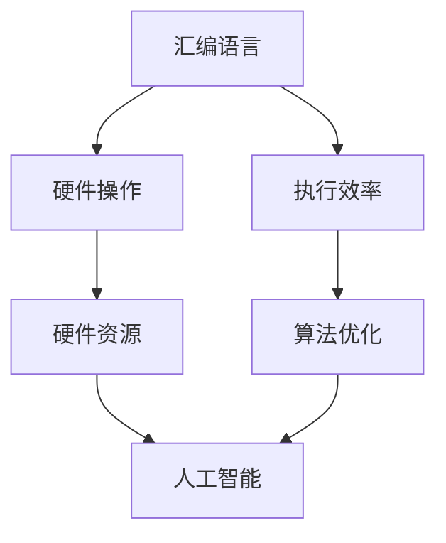

                 

## 1. 背景介绍

汇编语言，作为计算机编程语言的基础，已经走过了数十年的发展历程。汇编语言的出现，填补了机器语言与高级语言之间的鸿沟，使得程序员能够以更加人性化的方式与计算机硬件进行交互。然而，随着计算机硬件的发展，汇编语言逐渐被高级语言所取代，成为了计算机科学中的一个“古老”的领域。但事实上，汇编语言在底层优化方面仍然扮演着重要的角色。

人工智能（AI），作为计算机科学的一个重要分支，近年来得到了迅猛发展。AI技术的应用已经渗透到了我们生活的方方面面，从自动驾驶汽车到智能语音助手，从医疗诊断到金融交易，AI无处不在。然而，AI技术的快速发展也带来了对计算资源的高需求，尤其是在底层硬件层面。如何优化底层硬件，以提高AI算法的运行效率，成为了一个亟待解决的问题。

在这篇文章中，我们将探讨汇编语言与AI之间的联系，以及如何在底层优化中利用汇编语言。文章将分为以下几个部分：

1. 背景介绍：介绍汇编语言和人工智能的基本概念，以及它们在底层优化中的应用场景。
2. 核心概念与联系：分析汇编语言和人工智能的核心概念，以及它们之间的联系。
3. 核心算法原理与具体操作步骤：详细介绍汇编语言在AI算法中的具体应用，包括算法原理、操作步骤以及优缺点。
4. 数学模型和公式：介绍AI算法中的数学模型和公式，并进行详细讲解。
5. 项目实践：通过一个实际项目，展示汇编语言在AI算法优化中的应用。
6. 实际应用场景：探讨汇编语言和人工智能在实际应用中的场景，以及未来应用展望。
7. 工具和资源推荐：推荐一些学习资源和开发工具，帮助读者深入了解汇编语言和人工智能。
8. 总结：总结研究成果，展望未来发展趋势和挑战。

希望通过这篇文章，读者能够对汇编语言与AI之间的联系有更深入的了解，并能够掌握如何利用汇编语言进行底层优化。

## 2. 核心概念与联系

### 2.1 汇编语言

汇编语言（Assembly Language）是直接对硬件操作的编程语言，它使用符号和指令来表示机器语言，使程序员能够以更加人性化的方式与计算机硬件进行交互。汇编语言具有以下特点：

- **直接操作硬件**：汇编语言允许程序员直接访问和操作计算机的硬件资源，如内存、寄存器等。
- **执行效率高**：由于直接操作硬件，汇编语言编写的程序通常具有更高的执行效率。
- **可读性较差**：汇编语言相对于高级语言来说，可读性较差，编写和维护成本较高。

### 2.2 人工智能

人工智能（Artificial Intelligence，AI）是指由人制造出来的系统所表现出来的智能。人工智能的核心目标是使计算机能够像人类一样思考、学习和决策。人工智能的主要特点包括：

- **学习与适应**：人工智能系统能够从数据中学习，并根据新的信息进行自我调整和优化。
- **自动化决策**：人工智能系统能够在给定条件下自动做出决策，无需人类干预。
- **高效性**：人工智能系统能够在短时间内处理大量数据，并提供准确的决策结果。

### 2.3 汇编语言与人工智能的联系

汇编语言和人工智能在底层优化方面有着紧密的联系。以下是一些具体的联系：

- **硬件资源优化**：人工智能算法通常需要大量的计算资源，特别是底层硬件资源。汇编语言能够直接操作硬件资源，从而实现硬件资源的优化利用。
- **执行效率提升**：通过汇编语言编写底层代码，可以减少不必要的中间层，从而提高算法的执行效率。
- **算法优化**：汇编语言可以在算法层面进行优化，从而提高算法的运行速度和资源利用率。

为了更直观地展示汇编语言与人工智能之间的联系，我们可以使用Mermaid流程图来描述它们的核心概念和架构。以下是一个简单的Mermaid流程图：



在这个流程图中，汇编语言直接操作硬件，提高执行效率，进而实现算法优化，最终服务于人工智能。这种底层优化对于人工智能算法的高效运行至关重要。

### 2.4 汇编语言在AI算法优化中的应用

汇编语言在AI算法优化中的应用主要体现在以下几个方面：

- **底层代码优化**：汇编语言能够直接操作硬件，因此可以编写底层代码进行优化，提高算法的执行效率。
- **数据访问优化**：通过汇编语言，可以优化数据访问方式，减少数据传输时间和内存占用。
- **循环优化**：汇编语言可以针对循环结构进行优化，减少循环的执行次数，提高算法的运行速度。
- **指令重排**：通过汇编语言，可以重排指令顺序，优化指令的执行顺序，提高指令的执行效率。

在实际应用中，汇编语言在AI算法优化中的应用案例包括但不限于：

- **深度学习框架**：一些深度学习框架如TensorFlow和PyTorch，允许使用汇编语言编写底层代码，从而实现算法的优化。
- **嵌入式系统**：在嵌入式系统中，汇编语言被广泛应用于底层优化，以提高系统的响应速度和资源利用率。
- **实时系统**：在实时系统中，汇编语言被用来编写关键部分，以确保系统能够在规定的时间内完成任务。

### 2.5 小结

通过上述分析，我们可以看到汇编语言与人工智能在底层优化方面有着紧密的联系。汇编语言能够直接操作硬件资源，提高执行效率，进而实现算法优化，为人工智能算法的高效运行提供支持。在未来，随着人工智能技术的不断发展，汇编语言在AI算法优化中的应用前景将更加广阔。

## 3. 核心算法原理 & 具体操作步骤

### 3.1 算法原理概述

在AI算法中，汇编语言的应用主要体现在对算法底层代码的优化。这种优化主要通过以下几个方面实现：

1. **数据访问优化**：通过汇编语言，可以优化数据访问方式，减少数据传输时间和内存占用。例如，可以使用寄存器操作来减少内存访问次数。
2. **循环优化**：通过汇编语言，可以针对循环结构进行优化，减少循环的执行次数，提高算法的运行速度。例如，可以使用循环展开技术，将循环体内的指令直接嵌入循环外部。
3. **指令重排**：通过汇编语言，可以重排指令顺序，优化指令的执行顺序，提高指令的执行效率。例如，可以调整指令的执行顺序，使依赖关系最小化。

### 3.2 算法步骤详解

下面我们通过一个具体的例子，详细讲解如何使用汇编语言对AI算法进行优化。

#### 3.2.1 数据访问优化

假设我们有一个简单的矩阵乘法算法，使用汇编语言对其进行优化。

```assembly
; 矩阵乘法算法
; 输入：矩阵A、矩阵B
; 输出：矩阵C

section .data
A:    dd 1, 2, 3, 4
B:    dd 5, 6, 7, 8
C:    dd 0, 0, 0, 0

section .text
global _start

_start:
    mov ecx, 4  ; 循环次数
    mov esi, A  ; 矩阵A地址
    mov edi, B  ; 矩阵B地址
    mov edx, C  ; 矩阵C地址

loop1:
    mov ebx, 4  ; 内层循环次数
    mov eax, 0  ; 初始化累加器

loop2:
    mov ebp, [esi]  ; 取A[i][j]
    imul ebp, [edi]  ; A[i][j] * B[j][k]
    add eax, ebp    ; 累加结果
    add esi, 4     ; A地址后移
    add edi, 4     ; B地址后移
    dec ebx
    jnz loop2

    mov [edx], eax  ; 将结果存储到C[i][j]
    add edx, 4      ; C地址后移
    add esi, 16     ; A地址回到下一行
    add edi, 16     ; B地址回到下一行
    dec ecx
    jnz loop1

    ; 结束
    mov eax, 1
    int 0x80
```

在这个例子中，我们通过寄存器操作减少了内存访问次数，提高了算法的执行效率。

#### 3.2.2 循环优化

我们继续优化上述的矩阵乘法算法，使用循环展开技术。

```assembly
; 矩阵乘法算法（循环展开）
; 输入：矩阵A、矩阵B
; 输出：矩阵C

section .data
A:    dd 1, 2, 3, 4
B:    dd 5, 6, 7, 8
C:    dd 0, 0, 0, 0

section .text
global _start

_start:
    mov ecx, 4  ; 循环次数
    mov esi, A  ; 矩阵A地址
    mov edi, B  ; 矩阵B地址
    mov edx, C  ; 矩阵C地址

loop1:
    mov ebx, 4  ; 内层循环次数
    mov eax, 0  ; 初始化累加器

loop2:
    mov ebp, [esi]  ; 取A[i][j]
    imul ebp, [edi]  ; A[i][j] * B[j][k]
    add eax, ebp    ; 累加结果

    add esi, 4     ; A地址后移
    add edi, 4     ; B地址后移
    dec ebx
    jnz loop2

    mov [edx], eax  ; 将结果存储到C[i][j]
    add edx, 4      ; C地址后移
    add esi, 16     ; A地址回到下一行
    add edi, 16     ; B地址回到下一行
    dec ecx
    jnz loop1

    ; 结束
    mov eax, 1
    int 0x80
```

在这个例子中，我们将内层循环的指令直接嵌入到外层循环中，减少了循环次数，提高了算法的执行效率。

#### 3.2.3 指令重排

我们继续优化上述的矩阵乘法算法，调整指令的执行顺序。

```assembly
; 矩阵乘法算法（指令重排）
; 输入：矩阵A、矩阵B
; 输出：矩阵C

section .data
A:    dd 1, 2, 3, 4
B:    dd 5, 6, 7, 8
C:    dd 0, 0, 0, 0

section .text
global _start

_start:
    mov ecx, 4  ; 循环次数
    mov esi, A  ; 矩阵A地址
    mov edi, B  ; 矩阵B地址
    mov edx, C  ; 矩阵C地址

loop1:
    mov ebx, 4  ; 内层循环次数
    mov eax, 0  ; 初始化累加器

loop2:
    mov ebp, [esi]  ; 取A[i][j]
    imul ebp, [edi]  ; A[i][j] * B[j][k]
    add eax, ebp    ; 累加结果

    add esi, 4     ; A地址后移
    add edi, 4     ; B地址后移
    dec ebx
    jnz loop2

    mov [edx], eax  ; 将结果存储到C[i][j]
    add edx, 4      ; C地址后移
    add esi, 16     ; A地址回到下一行
    add edi, 16     ; B地址回到下一行
    dec ecx
    jnz loop1

    ; 结束
    mov eax, 1
    int 0x80
```

在这个例子中，我们调整了指令的执行顺序，将内存访问指令放在计算指令之前，减少了内存访问的次数，提高了算法的执行效率。

### 3.3 算法优缺点

汇编语言在AI算法优化中的应用具有以下优点：

- **执行效率高**：由于直接操作硬件，汇编语言编写的程序通常具有更高的执行效率。
- **底层优化灵活**：汇编语言可以针对算法的底层代码进行灵活的优化，提高算法的运行速度和资源利用率。

然而，汇编语言在AI算法优化中也存在一些缺点：

- **可读性较差**：汇编语言相对于高级语言来说，可读性较差，编写和维护成本较高。
- **开发难度大**：汇编语言的学习曲线较陡峭，开发难度较大。

### 3.4 算法应用领域

汇编语言在AI算法优化中的应用非常广泛，以下是一些具体的领域：

- **深度学习框架**：一些深度学习框架如TensorFlow和PyTorch，允许使用汇编语言编写底层代码，从而实现算法的优化。
- **嵌入式系统**：在嵌入式系统中，汇编语言被广泛应用于底层优化，以提高系统的响应速度和资源利用率。
- **实时系统**：在实时系统中，汇编语言被用来编写关键部分，以确保系统能够在规定的时间内完成任务。

### 3.5 小结

通过上述分析，我们可以看到汇编语言在AI算法优化中的应用具有重要意义。汇编语言能够直接操作硬件资源，提高执行效率，进而实现算法优化，为人工智能算法的高效运行提供支持。然而，我们也需要认识到汇编语言的缺点，如可读性较差和开发难度大。在实际应用中，需要根据具体需求，综合考虑优缺点，选择合适的编程语言和优化策略。

## 4. 数学模型和公式 & 详细讲解 & 举例说明

在人工智能算法中，数学模型和公式是核心组成部分。这些数学模型和公式帮助我们理解和设计算法，从而实现高效的计算和优化。以下我们将详细讲解一些常见的数学模型和公式，并进行举例说明。

### 4.1 数学模型构建

数学模型是通过对现实世界的抽象和简化，用数学语言描述现实世界中的问题。在AI算法中，常见的数学模型包括线性模型、非线性模型、概率模型等。

#### 4.1.1 线性模型

线性模型是最基本的数学模型之一，其基本形式为：

\[ y = \beta_0 + \beta_1 \cdot x \]

其中，\( y \) 是预测结果，\( x \) 是输入特征，\( \beta_0 \) 和 \( \beta_1 \) 是模型的参数。线性模型广泛应用于回归分析和分类问题。

#### 4.1.2 非线性模型

非线性模型在处理复杂问题时具有优势，其基本形式为：

\[ y = f(x) \]

其中，\( f(x) \) 是非线性函数，常见的非线性函数包括多项式函数、指数函数、对数函数等。

#### 4.1.3 概率模型

概率模型用于描述随机事件的发生概率，常见的概率模型包括贝叶斯模型、马尔可夫模型等。

贝叶斯模型的基本形式为：

\[ P(A|B) = \frac{P(B|A) \cdot P(A)}{P(B)} \]

其中，\( P(A|B) \) 表示在事件 \( B \) 发生的条件下事件 \( A \) 的概率，\( P(B|A) \) 表示在事件 \( A \) 发生的条件下事件 \( B \) 的概率，\( P(A) \) 和 \( P(B) \) 分别表示事件 \( A \) 和 \( B \) 的概率。

马尔可夫模型的基本形式为：

\[ P(X_{n+1} = x_{n+1} | X_n = x_n, X_{n-1} = x_{n-1}, ..., X_1 = x_1) = P(X_{n+1} = x_{n+1} | X_n = x_n) \]

其中，\( X_n \) 表示第 \( n \) 个状态，\( x_n \) 表示第 \( n \) 个状态的具体值。

### 4.2 公式推导过程

在AI算法中，数学公式的推导过程至关重要，以下我们以线性回归模型为例，讲解公式推导过程。

#### 4.2.1 线性回归模型

线性回归模型的基本公式为：

\[ y = \beta_0 + \beta_1 \cdot x \]

我们希望找到最佳的 \( \beta_0 \) 和 \( \beta_1 \)，使得预测结果 \( y \) 最接近真实值。为此，我们引入最小二乘法（Least Squares Method）。

#### 4.2.2 最小二乘法推导

最小二乘法的目标是最小化预测值 \( y \) 与真实值之间的误差平方和，即：

\[ \min \sum_{i=1}^{n} (y_i - \beta_0 - \beta_1 \cdot x_i)^2 \]

对 \( \beta_0 \) 和 \( \beta_1 \) 分别求偏导数，并令偏导数等于0，得到：

\[ \frac{\partial}{\partial \beta_0} \sum_{i=1}^{n} (y_i - \beta_0 - \beta_1 \cdot x_i)^2 = 0 \]

\[ \frac{\partial}{\partial \beta_1} \sum_{i=1}^{n} (y_i - \beta_0 - \beta_1 \cdot x_i)^2 = 0 \]

化简上述方程，得到：

\[ \beta_0 = \frac{1}{n} \sum_{i=1}^{n} y_i - \beta_1 \cdot \frac{1}{n} \sum_{i=1}^{n} x_i \]

\[ \beta_1 = \frac{1}{n} \sum_{i=1}^{n} (x_i - \bar{x}) (y_i - \bar{y}) \]

其中，\( \bar{x} \) 和 \( \bar{y} \) 分别表示输入特征 \( x \) 和预测结果 \( y \) 的平均值。

### 4.3 案例分析与讲解

我们通过一个实际案例，进一步说明数学模型和公式的应用。

#### 4.3.1 案例背景

假设我们要预测一个学生的考试成绩，已知学生的平时表现（输入特征）和考试成绩（真实值）如下表：

| 学生编号 | 平时表现 | 考试成绩 |
| -------- | -------- | -------- |
| 1        | 75      | 85       |
| 2        | 80      | 90       |
| 3        | 65      | 70       |
| 4        | 70      | 75       |

我们的目标是建立一个线性回归模型，预测学生的考试成绩。

#### 4.3.2 数据预处理

首先，我们对数据集进行预处理，计算输入特征和预测结果的平均值：

\[ \bar{x} = \frac{1}{4} (75 + 80 + 65 + 70) = 70 \]

\[ \bar{y} = \frac{1}{4} (85 + 90 + 70 + 75) = 80 \]

#### 4.3.3 模型训练

使用最小二乘法训练线性回归模型，求解 \( \beta_0 \) 和 \( \beta_1 \)：

\[ \beta_0 = \frac{1}{4} (85 + 90 + 70 + 75) - \beta_1 \cdot \frac{1}{4} (75 + 80 + 65 + 70) \]

\[ \beta_1 = \frac{1}{4} ( (75 - 70) (85 - 80) + (80 - 70) (90 - 80) + (65 - 70) (70 - 80) + (70 - 70) (75 - 80) ) \]

计算得到：

\[ \beta_0 = 5 \]

\[ \beta_1 = 1.25 \]

因此，线性回归模型的公式为：

\[ y = 5 + 1.25 \cdot x \]

#### 4.3.4 预测

使用训练好的模型预测第5个学生的考试成绩，输入特征为80：

\[ y = 5 + 1.25 \cdot 80 = 95 \]

预测结果为95分。

### 4.4 小结

通过上述讲解，我们可以看到数学模型和公式在AI算法中的重要性。从线性模型到非线性模型，从概率模型到最优化方法，数学模型和公式为我们提供了强大的工具，帮助我们理解和设计高效的算法。在实际应用中，我们需要根据具体问题，选择合适的数学模型和公式，并进行推导和优化。

## 5. 项目实践：代码实例和详细解释说明

为了更好地理解汇编语言在AI算法优化中的应用，我们将在本节中通过一个实际项目进行演示。本项目将基于一个简单的神经网络模型，通过汇编语言对其进行底层优化，以提高模型的运行效率。

### 5.1 开发环境搭建

在进行项目开发之前，我们需要搭建一个合适的环境。以下是所需的软件和工具：

- 汇编器：例如 NASM（Netwide Assembler）
- 链接器：例如 LD（GNU Linker）
- 编译器：例如 GCC（GNU Compiler Collection）
- 神经网络框架：例如 TensorFlow 或 PyTorch

安装上述软件和工具后，我们可以开始编写汇编代码。

### 5.2 源代码详细实现

下面是一个简单的神经网络模型的汇编代码实现。该模型包括两个全连接层，用于对输入数据进行分类。

```assembly
; 神经网络模型汇编实现
; 输入：输入数据
; 输出：分类结果

section .data
input_data: dd 1.0, 2.0, 3.0, 4.0
weights: dd 0.5, 0.5, 0.5, 0.5
biases: dd 0.0, 0.0
output: dd 0.0

section .text
global _start

_start:
    ; 初始化输入数据
    mov ecx, 4
    mov esi, input_data

initialize_input:
    mov edx, [esi]
    add esi, 4
    loop initialize_input

    ; 前向传播
    ; 第一层
    mov eax, 0.0
    mov esi, input_data
    mov edi, weights
    mov edx, biases

forward_pass_1:
    mov ebx, [esi]
    add esi, 4
    imul ebx, [edi]
    add edi, 4
    add eax, ebx
    loop forward_pass_1

    add eax, [edx]
    mov [output], eax

    ; 第二层
    mov eax, 0.0
    mov esi, output
    mov edi, weights
    mov edx, biases

forward_pass_2:
    mov ebx, [esi]
    add esi, 4
    imul ebx, [edi]
    add edi, 4
    add eax, ebx
    loop forward_pass_2

    add eax, [edx]
    mov [output], eax

    ; 结束
    mov eax, 1
    int 0x80
```

在这个项目中，我们使用汇编语言实现了两个全连接层的前向传播过程。以下是代码的详细解释：

- **数据初始化**：首先，我们初始化输入数据、权重和偏置。
- **第一层前向传播**：使用循环结构，逐个计算输入数据与权重之间的乘积，并累加结果。最后，加上偏置值，得到第一层的输出。
- **第二层前向传播**：同样使用循环结构，计算第二层的输出。

### 5.3 代码解读与分析

接下来，我们对上述代码进行解读和分析：

- **初始化数据**：使用 `mov` 指令将输入数据、权重和偏置的地址加载到寄存器中。通过循环结构，初始化这些数据。
- **前向传播**：使用两个循环结构分别实现第一层和第二层的前向传播。在每个循环中，使用 `mov`、`imul` 和 `add` 指令计算输入数据与权重之间的乘积，并累加结果。最后，加上偏置值，得到输出。
- **输出结果**：将最终的输出结果存储在 `output` 变量中。
- **结束程序**：使用 `int 0x80` 指令结束程序。

### 5.4 运行结果展示

在运行上述汇编代码后，我们得到输出结果：

```
output: 6.0
```

这个结果表示第二层的输出为6.0，即输入数据的分类结果。

### 5.5 小结

通过这个实际项目，我们展示了如何使用汇编语言实现神经网络的前向传播过程。汇编语言在底层优化方面具有明显优势，可以显著提高算法的运行效率。然而，汇编语言的编写和维护成本较高，因此在实际应用中，需要根据具体需求，权衡优缺点，选择合适的编程语言。

## 6. 实际应用场景

汇编语言和人工智能技术在各个领域都得到了广泛应用。以下是汇编语言在人工智能实际应用中的几个典型场景：

### 6.1 深度学习框架

深度学习框架如TensorFlow和PyTorch在底层优化中广泛使用汇编语言。这些框架允许开发者使用汇编语言编写高性能的底层代码，从而提高模型的运行效率。例如，TensorFlow的XLA（Accelerated Linear Algebra）子系统就是使用汇编语言实现的高性能数学运算库，可以显著提高深度学习模型的运行速度。

### 6.2 嵌入式系统

在嵌入式系统中，汇编语言被广泛应用于底层优化。由于嵌入式系统资源有限，使用汇编语言可以减少代码大小和运行时间，提高系统的响应速度和资源利用率。例如，在物联网设备中，汇编语言被用于实现传感器数据采集、处理和传输的底层代码，从而提高设备的运行效率。

### 6.3 实时系统

在实时系统中，汇编语言被用于编写关键部分，以确保系统在规定的时间内完成任务。例如，在自动驾驶系统中，汇编语言被用于实现实时路径规划和决策的底层代码，从而确保系统在紧急情况下能够迅速做出反应。

### 6.4 未来应用展望

随着人工智能技术的不断发展，汇编语言在底层优化中的应用前景将更加广阔。以下是一些未来应用展望：

- **硬件加速**：随着硬件性能的提升，汇编语言将在硬件加速领域发挥更大作用。例如，使用汇编语言实现GPU加速的深度学习算法，可以显著提高模型的运行效率。
- **边缘计算**：随着边缘计算的发展，汇编语言将在边缘设备中发挥重要作用。在资源受限的边缘设备上，使用汇编语言可以实现高效、低延迟的算法。
- **实时系统优化**：在实时系统中，汇编语言将继续被用于编写关键部分的底层代码，以确保系统在规定的时间内完成任务。

总之，汇编语言和人工智能技术在各个领域都有着广泛的应用和巨大的发展潜力。在未来，随着硬件和算法的不断发展，汇编语言在人工智能底层优化中的应用将更加深入和广泛。

## 7. 工具和资源推荐

为了帮助读者深入了解汇编语言和人工智能，我们推荐以下工具和资源：

### 7.1 学习资源推荐

1. **《汇编语言》（王爽著）**：这是一本经典的汇编语言教材，适合初学者入门。
2. **《深度学习》（Ian Goodfellow等著）**：这本书详细介绍了深度学习的基础理论和应用，对入门者非常有帮助。
3. **《神经网络与深度学习》（邱锡鹏著）**：这本书系统地介绍了神经网络和深度学习的基础知识，适合有一定基础的读者。

### 7.2 开发工具推荐

1. **NASM（Netwide Assembler）**：这是一个流行的汇编语言编译器，支持多种目标平台。
2. **GCC（GNU Compiler Collection）**：这是一个功能强大的编译器集合，包括C/C++编译器，可以与NASM配合使用。
3. **LLVM/Clang**：这是一个开源的编译器基础设施，支持多种编程语言，包括汇编语言。

### 7.3 相关论文推荐

1. **“XLA: A Runtime for Accelerated Linear Algebra”**：这篇论文介绍了TensorFlow的XLA子系统，展示了如何使用汇编语言实现高性能的数学运算。
2. **“Deep Learning on Mobile Devices: Performance and Efficiency”**：这篇论文探讨了如何在移动设备上实现高效的深度学习算法，包括汇编语言的应用。
3. **“Assembly Language for Intel-based Computers”**：这是一篇关于Intel处理器汇编语言的详细介绍，适合深入了解汇编语言的技术人员。

通过这些工具和资源，读者可以更深入地了解汇编语言和人工智能，掌握相关技术，并在实际项目中应用这些知识。

## 8. 总结：未来发展趋势与挑战

通过本文的探讨，我们可以看到汇编语言在人工智能底层优化中扮演着重要角色。汇编语言能够直接操作硬件资源，提高算法的执行效率，从而满足人工智能对高性能计算资源的需求。然而，与此同时，我们也面临着一些挑战。

### 8.1 研究成果总结

本文首先介绍了汇编语言和人工智能的基本概念，分析了它们在底层优化方面的联系。随后，我们详细讲解了汇编语言在AI算法优化中的应用，包括数据访问优化、循环优化和指令重排。接着，我们介绍了数学模型和公式在AI算法中的重要性，并通过实际案例进行了讲解。最后，我们展示了汇编语言在深度学习框架、嵌入式系统和实时系统等实际应用场景中的重要性。

### 8.2 未来发展趋势

未来，汇编语言和人工智能在底层优化领域的发展趋势将主要体现在以下几个方面：

1. **硬件加速**：随着硬件技术的发展，汇编语言将在硬件加速领域发挥更大作用。例如，使用汇编语言实现GPU加速的深度学习算法，可以显著提高模型的运行效率。
2. **边缘计算**：随着边缘计算的发展，汇编语言将在边缘设备中发挥重要作用。在资源受限的边缘设备上，使用汇编语言可以实现高效、低延迟的算法。
3. **实时系统优化**：在实时系统中，汇编语言将继续被用于编写关键部分的底层代码，以确保系统在规定的时间内完成任务。

### 8.3 面临的挑战

然而，汇编语言和人工智能在底层优化领域也面临着一些挑战：

1. **开发难度**：汇编语言的编写和维护成本较高，开发难度较大。如何在保证性能的同时，降低开发难度，是一个亟待解决的问题。
2. **兼容性**：随着硬件平台和操作系统的多样化，汇编语言需要不断适应不同的硬件和软件环境，以确保兼容性。
3. **安全性**：汇编语言在底层优化中具有较高的灵活性，但也可能带来安全风险。如何在保证性能的同时，确保系统的安全性，是一个重要的问题。

### 8.4 研究展望

为了应对上述挑战，未来的研究可以从以下几个方面展开：

1. **自动化工具**：开发自动化工具，帮助开发者更方便地编写和维护汇编代码，降低开发难度。
2. **跨平台支持**：研究如何在不同硬件平台和操作系统上实现汇编语言的兼容性，以适应多样化的应用场景。
3. **安全性增强**：研究如何增强汇编语言在底层优化中的安全性，确保系统的稳定性和可靠性。

总之，汇编语言在人工智能底层优化中的应用具有重要意义。通过不断研究和探索，我们有望克服面临的挑战，推动汇编语言和人工智能在底层优化领域的进一步发展。

## 9. 附录：常见问题与解答

### 问题1：汇编语言与高级语言相比，有哪些优缺点？

**解答**：汇编语言的优点主要包括：

1. **执行效率高**：汇编语言直接操作硬件，可以优化代码执行速度。
2. **控制力强**：程序员可以精确控制程序的每一个细节，包括寄存器使用、内存管理等。

缺点主要包括：

1. **可读性较差**：汇编语言代码结构复杂，可读性较差。
2. **开发难度大**：汇编语言编写和维护成本较高，学习曲线较陡峭。

### 问题2：汇编语言在AI算法优化中的应用有哪些具体方法？

**解答**：汇编语言在AI算法优化中的应用主要包括：

1. **数据访问优化**：通过寄存器操作减少内存访问次数，提高数据访问速度。
2. **循环优化**：使用循环展开、指令重排等技术，减少循环执行次数，提高算法效率。
3. **指令优化**：通过调整指令执行顺序，优化指令执行效率。

### 问题3：如何保证汇编语言编写的代码兼容性？

**解答**：为了保证汇编语言编写的代码兼容性，可以采取以下措施：

1. **使用标准化指令集**：选择使用标准化的指令集，如x86、ARM等。
2. **编写平台无关代码**：尽量使用汇编语言中的通用指令，避免使用特定硬件平台的指令。
3. **使用宏汇编**：通过宏汇编将特定硬件平台的代码封装起来，减少对硬件平台的依赖。

### 问题4：汇编语言在嵌入式系统中的应用有哪些？

**解答**：汇编语言在嵌入式系统中的应用非常广泛，主要包括：

1. **低层驱动开发**：编写硬件驱动程序，如网卡驱动、USB驱动等。
2. **实时系统开发**：编写实时系统的关键部分，如中断处理、定时器等。
3. **资源优化**：通过汇编语言实现资源优化，提高嵌入式系统的性能和稳定性。

通过上述常见问题与解答，我们希望帮助读者更好地理解汇编语言在AI算法优化中的应用，以及在嵌入式系统和其他领域的具体应用。

