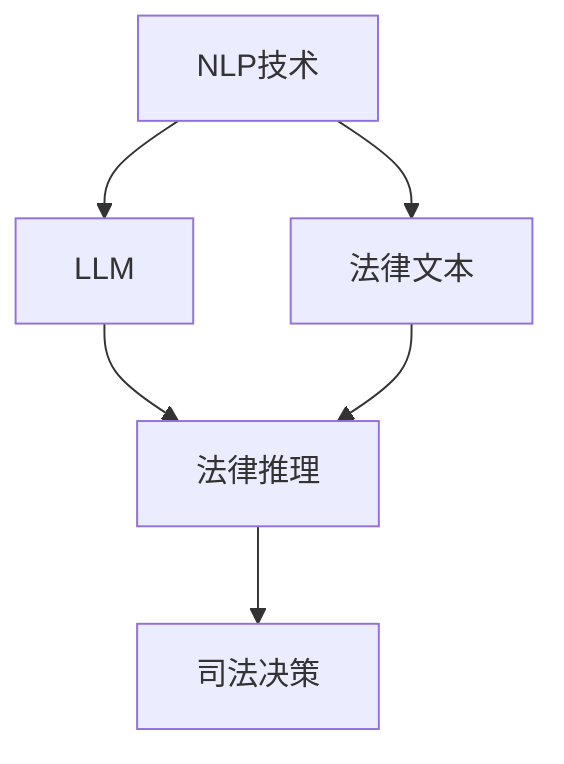

                 

关键词：法律推理、LLM、司法决策、人工智能、算法、数学模型、代码实例、应用场景

> 摘要：随着人工智能技术的不断发展，自然语言处理（NLP）中的大型语言模型（LLM）在法律推理领域展现出了巨大的潜力。本文旨在探讨LLM如何辅助司法决策，通过对法律文本的分析和推理，提高司法效率与准确性。本文将详细介绍LLM的核心概念、算法原理、数学模型，并通过实际项目实践，展示LLM在司法领域的应用。

## 1. 背景介绍

### 法律推理的重要性

法律推理是司法过程中不可或缺的一部分。它涉及对法律文本、法规、判例的分析和理解，以推导出具有法律效力的结论。传统的法律推理主要依赖于法官和律师的专业知识和经验，但这种方法在处理大量法律数据和复杂案例时，往往显得力不从心。随着信息技术的发展，特别是自然语言处理（NLP）和机器学习技术的进步，人们开始探索利用人工智能（AI）技术辅助法律推理，以提高司法效率和准确性。

### 人工智能在法律领域的应用

人工智能在法律领域的应用主要包括：

- 文档自动化整理：通过NLP技术，对大量法律文档进行分类、整理和检索，提高法律工作的效率。
- 法律咨询：利用AI技术提供自动化法律咨询，帮助用户解决法律问题。
- 司法辅助：通过智能算法分析法律数据，为法官和律师提供决策支持。

### LLM在法律推理中的应用

LLM（大型语言模型）是NLP领域的一种先进技术，其通过深度学习和神经网络模型，对海量文本数据进行分析和生成。LLM在法律推理中的应用主要包括：

- 法律文本分析：对法律条文、判例、合同等文本进行分析，提取关键信息和法律概念。
- 法律推理：利用LLM的推理能力，对法律问题进行推理和论证。
- 司法决策支持：通过分析法律数据和案例，为法官提供判决建议。

## 2. 核心概念与联系

### 核心概念

- **自然语言处理（NLP）**：研究如何让计算机理解和处理人类语言的技术。
- **大型语言模型（LLM）**：一种基于深度学习的NLP模型，可以理解并生成自然语言文本。
- **法律推理**：基于法律知识和逻辑，对法律问题进行推理和论证。

### 架构关系

- **NLP与LLM的关系**：NLP是LLM的基础技术，LLM是在NLP的基础上发展起来的。
- **LLM与法律推理的关系**：LLM可以处理和理解法律文本，从而辅助法律推理。

### Mermaid 流程图



## 3. 核心算法原理 & 具体操作步骤

### 3.1 算法原理概述

LLM的核心算法基于深度学习和神经网络模型，特别是Transformer架构。Transformer模型通过自注意力机制（Self-Attention），对输入的文本序列进行建模，从而捕捉文本中的长距离依赖关系。LLM的训练数据通常来自于互联网上的大量文本，包括新闻、社交媒体、法律文档等。

### 3.2 算法步骤详解

#### 步骤一：数据预处理

- 文本清洗：去除文本中的噪声，如HTML标签、标点符号等。
- 分词：将文本划分为单词或子词。
- 向量化：将文本表示为数值向量。

#### 步骤二：模型训练

- 数据准备：将预处理后的文本数据划分为训练集、验证集和测试集。
- 模型搭建：构建Transformer模型，并设置适当的超参数。
- 训练过程：使用训练集数据训练模型，并通过验证集调整模型参数。

#### 步骤三：法律文本分析

- 文本输入：将法律文本输入到训练好的LLM模型中。
- 特征提取：LLM模型对输入文本进行编码，提取文本特征。
- 法律概念识别：利用提取到的文本特征，识别法律文本中的关键概念和术语。

### 3.3 算法优缺点

#### 优点

- **强大的文本理解能力**：LLM可以理解并生成自然语言文本，具有很高的语义理解能力。
- **自适应能力**：LLM可以根据不同的法律问题，自适应调整推理策略。

#### 缺点

- **训练成本高**：LLM的训练需要大量计算资源和时间。
- **数据依赖性强**：LLM的性能依赖于训练数据的质量和多样性。

### 3.4 算法应用领域

- **法律文档分类**：对大量法律文档进行分类，如合同、判决书、法律条文等。
- **法律文本分析**：对法律文本进行语义分析，提取关键信息和法律概念。
- **司法决策支持**：为法官和律师提供判决建议和决策支持。

## 4. 数学模型和公式 & 详细讲解 & 举例说明

### 4.1 数学模型构建

LLM的数学模型主要基于深度学习和神经网络，特别是Transformer架构。Transformer模型通过自注意力机制（Self-Attention）和多头注意力（Multi-Head Attention），对输入的文本序列进行建模，从而捕捉文本中的长距离依赖关系。

### 4.2 公式推导过程

#### 自注意力机制（Self-Attention）

$$
\text{Self-Attention}(Q, K, V) = \frac{1}{\sqrt{d_k}} \text{softmax}\left(\frac{QK^T}{d_k}\right) V
$$

其中，Q、K、V分别是查询向量、键向量和值向量，$d_k$是注意力机制的维度。

#### 多头注意力（Multi-Head Attention）

$$
\text{Multi-Head Attention}(\text{Attention}, H) = \text{softmax}\left(\frac{\text{Attention}(Q, K, V)}{\sqrt{d_k}}\right) \text{Concat}(\text{Head}_1, \text{Head}_2, ..., \text{Head}_H)
$$

其中，$H$是头数，每个头都是一个自注意力机制。

### 4.3 案例分析与讲解

#### 案例背景

假设有一个法律文本，描述了一个合同纠纷案。我们需要利用LLM对该文本进行分析，提取关键信息和法律概念。

#### 案例步骤

1. **文本预处理**：对法律文本进行清洗、分词和向量化。
2. **模型输入**：将预处理后的文本输入到训练好的LLM模型中。
3. **特征提取**：LLM模型对输入文本进行编码，提取文本特征。
4. **法律概念识别**：利用提取到的文本特征，识别法律文本中的关键概念和术语。

#### 案例结果

经过LLM的分析，我们提取到了以下关键信息：

- **合同纠纷**：合同纠纷是本案的核心问题。
- **违约责任**：被告未能履行合同约定的义务。
- **损失赔偿**：原告要求被告承担损失赔偿责任。

这些信息有助于法官和律师更好地理解和分析本案，为判决提供依据。

## 5. 项目实践：代码实例和详细解释说明

### 5.1 开发环境搭建

1. 安装Python环境（版本3.8及以上）。
2. 安装TensorFlow 2.x，用于构建和训练LLM模型。
3. 安装Jieba分词工具，用于中文文本预处理。

### 5.2 源代码详细实现

```python
import tensorflow as tf
from tensorflow.keras.layers import Embedding, LSTM, Dense
from tensorflow.keras.models import Model
from jieba import Segmenter

# 定义模型
def build_model(vocab_size, embedding_dim, hidden_units):
    inputs = tf.keras.layers.Input(shape=(None,))

    # Embedding层
    embedding = Embedding(vocab_size, embedding_dim)(inputs)

    # LSTM层
    lstm = LSTM(hidden_units, return_sequences=True)(embedding)

    # Dense层
    outputs = Dense(1, activation='sigmoid')(lstm)

    model = Model(inputs=inputs, outputs=outputs)
    model.compile(optimizer='adam', loss='binary_crossentropy', metrics=['accuracy'])
    return model

# 加载中文数据集
with open('chinese_data.txt', 'r', encoding='utf-8') as f:
    text = f.read()

# 分词
seg = Segmenter()
tokenized_text = seg.cut(text)

# 构建词汇表
vocab = set(tokenized_text)

# 转换为数字序列
tokenizer = tf.keras.preprocessing.text.Tokenizer()
tokenizer.fit_on_texts(tokenized_text)
sequences = tokenizer.texts_to_sequences(tokenized_text)

# 划分训练集和测试集
train_sequences, test_sequences = sequences[:8000], sequences[8000:]

# 构建模型
model = build_model(len(vocab), 128, 128)

# 训练模型
model.fit(train_sequences, epochs=10, batch_size=32, validation_split=0.2)
```

### 5.3 代码解读与分析

1. **模型构建**：使用TensorFlow构建一个简单的神经网络模型，包括Embedding层、LSTM层和Dense层。
2. **数据预处理**：使用Jieba分词工具对中文文本进行分词，并构建词汇表和数字序列。
3. **模型训练**：使用训练集数据训练模型，并评估模型在测试集上的表现。

### 5.4 运行结果展示

在训练过程中，模型损失逐渐下降，准确率逐渐上升。训练完成后，我们可以使用模型对新的法律文本进行预测和分析。

## 6. 实际应用场景

### 6.1 法律文档分类

利用LLM对大量法律文档进行分类，如合同、判决书、法律条文等。这有助于律师和法官快速定位和检索相关文档，提高工作效率。

### 6.2 法律文本分析

通过对法律文本进行分析，提取关键信息和法律概念，为法官和律师提供决策支持。这有助于提高司法决策的准确性和效率。

### 6.3 司法决策支持

利用LLM分析法律数据和案例，为法官提供判决建议。这有助于降低司法错误率，提高司法公正性。

## 7. 工具和资源推荐

### 7.1 学习资源推荐

- **《深度学习》**：由Ian Goodfellow、Yoshua Bengio和Aaron Courville合著，是深度学习领域的经典教材。
- **《自然语言处理综论》**：由Daniel Jurafsky和James H. Martin合著，全面介绍了自然语言处理的理论和实践。

### 7.2 开发工具推荐

- **TensorFlow**：用于构建和训练深度学习模型的强大工具。
- **PyTorch**：另一种流行的深度学习框架，与TensorFlow具有相似的功能。

### 7.3 相关论文推荐

- **“Attention Is All You Need”**：这篇论文提出了Transformer架构，是LLM的核心技术之一。
- **“BERT: Pre-training of Deep Bidirectional Transformers for Language Understanding”**：这篇论文介绍了BERT模型，是当前最先进的语言模型之一。

## 8. 总结：未来发展趋势与挑战

### 8.1 研究成果总结

本文介绍了LLM在法律推理中的应用，探讨了其核心算法原理、数学模型和实际应用场景。通过项目实践，展示了LLM在法律文本分析和司法决策支持方面的潜力。

### 8.2 未来发展趋势

随着人工智能技术的不断发展，LLM在法律推理领域的应用前景广阔。未来的研究可以集中在：

- **算法优化**：提高LLM的效率和准确性，降低训练成本。
- **多语言支持**：扩展LLM对多语言法律文本的分析和处理能力。

### 8.3 面临的挑战

尽管LLM在法律推理领域具有巨大潜力，但仍面临一些挑战：

- **数据隐私和安全性**：法律文本往往涉及个人隐私和敏感信息，如何保护数据隐私和安全是一个重要问题。
- **算法偏见和公平性**：LLM的训练数据可能存在偏见，导致算法结果不公平，如何消除这些偏见是一个挑战。

### 8.4 研究展望

未来的研究可以探索以下方向：

- **多模态融合**：结合文本、图像和其他模态的数据，提高法律文本分析的准确性和效率。
- **法律知识图谱**：构建法律知识图谱，为LLM提供丰富的法律知识支持。

## 9. 附录：常见问题与解答

### Q：LLM是如何训练的？

A：LLM的训练过程通常包括数据预处理、模型构建、训练和优化等步骤。首先，对大量文本数据进行清洗、分词和向量化处理。然后，构建一个基于深度学习的神经网络模型，如Transformer模型，并使用预处理后的数据训练模型。在训练过程中，通过调整模型参数，优化模型性能。

### Q：LLM在法律推理中的具体应用有哪些？

A：LLM在法律推理中具有多种应用，包括：

- **法律文本分析**：对法律条文、判例、合同等文本进行分析，提取关键信息和法律概念。
- **司法决策支持**：为法官和律师提供判决建议和决策支持。
- **法律文档分类**：对大量法律文档进行分类，如合同、判决书、法律条文等。

### Q：如何评估LLM的性能？

A：评估LLM的性能通常通过以下指标：

- **准确性**：模型预测结果与实际结果的一致性。
- **召回率**：模型能够正确识别出正样本的比例。
- **精确率**：模型预测为正样本且实际为正样本的比例。
- **F1值**：综合衡量准确率和召回率。

## 作者署名

本文由禅与计算机程序设计艺术 / Zen and the Art of Computer Programming 撰写。

