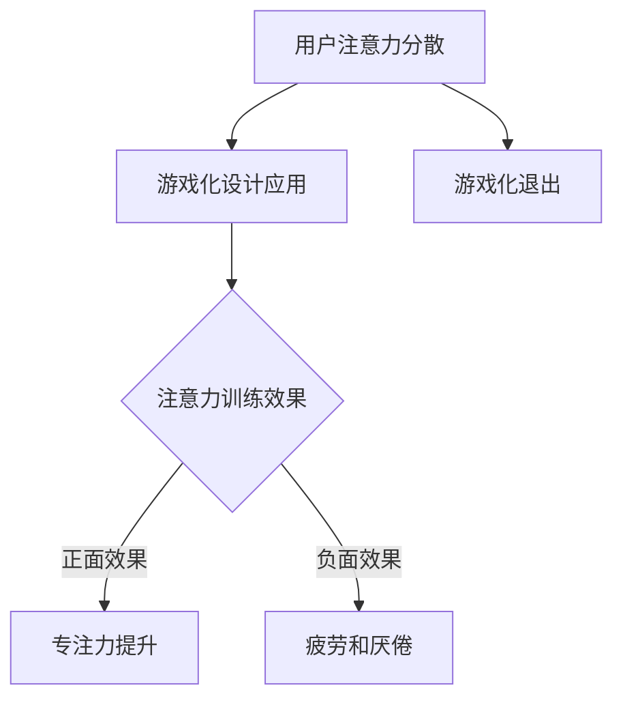

                 

关键词：注意力、游戏化、AI、专注力、人机交互、算法、应用场景、未来展望

> 摘要：本文深入探讨了注意力gamification的概念、原理及其在AI驱动下的应用。通过分析注意力模型和游戏化设计，本文提出了一种基于AI的专注力游戏机制，旨在提升用户的专注力和参与度。文章还详细介绍了游戏设计的核心算法原理、具体操作步骤、数学模型、代码实现，并探讨了其在教育、医疗等领域的应用前景。

## 1. 背景介绍

在快节奏的现代生活中，人们面临着越来越多的注意力分散问题。无论是工作中的多任务处理，还是日常生活中的社交媒体和娱乐应用，都严重干扰了人们的专注力。专注力不仅影响工作效率，还可能对心理健康产生负面影响。因此，提高专注力已成为当下研究的热点之一。

### 注意力模型

注意力是人类感知、记忆、思维和行为的基础。根据认知心理学的研究，注意力可以分为选择注意力（selective attention）和分配注意力（divided attention）。选择注意力是指人类在众多信息中选择关注特定信息的能力；而分配注意力是指人类在同时处理多种任务时分配注意力的能力。

### 游戏化

游戏化（Gamification）是一种通过将游戏设计元素和机制应用于非游戏环境，以提升用户参与度和动机的技术。游戏化设计包括积分系统、排行榜、奖励机制等，这些机制可以激发用户的竞争心理、好奇心和成就感，从而增强用户的参与度和专注力。

## 2. 核心概念与联系

### 注意力模型与游戏化的结合

注意力模型和游戏化的结合为提高专注力提供了一种新的思路。通过将游戏化设计应用于注意力训练，可以有效提高用户的专注力。

### Mermaid 流程图



### 流程说明

1. **用户注意力分散**：用户面临各种任务和干扰，导致注意力分散。
2. **游戏化设计应用**：引入游戏化元素，如积分、排行榜、奖励等，吸引用户的注意力。
3. **注意力训练效果**：用户在游戏化环境中参与任务，注意力逐渐集中。
4. **专注力提升**：持续的游戏化训练，使得用户的专注力得到显著提升。
5. **游戏化退出**：用户因疲劳或厌倦退出游戏化环境。

## 3. 核心算法原理 & 具体操作步骤

### 3.1 算法原理概述

本文提出的AI驱动的专注力游戏机制基于以下核心原理：

1. **注意力分配机制**：通过实时监测用户的注意力水平，自动调整任务难度和任务类型，以保持用户在最佳注意力状态下。
2. **奖励机制**：根据用户的专注力表现，提供即时奖励，以增强用户的成就感和动机。
3. **反馈机制**：用户完成任务后，系统提供即时反馈，帮助用户了解自己的专注力水平。

### 3.2 算法步骤详解

1. **初始化**：系统初始化，设定用户的基本信息和游戏规则。
2. **实时监测**：系统通过API或其他技术手段，实时监测用户的注意力水平。
3. **任务调整**：根据用户的注意力水平，自动调整任务难度和类型。
4. **奖励发放**：用户完成任务后，系统根据任务难度和用户的表现，发放相应的奖励。
5. **反馈**：系统向用户提供即时反馈，帮助用户了解自己的专注力水平。

### 3.3 算法优缺点

**优点**：

1. **自适应**：算法可以根据用户的注意力水平自动调整任务，提高游戏化的适应性和有效性。
2. **即时奖励**：即时奖励机制可以增强用户的成就感和动机，提高用户的参与度。
3. **即时反馈**：即时反馈机制可以帮助用户了解自己的专注力水平，从而进行自我调整。

**缺点**：

1. **技术要求高**：算法的实现需要较高的技术支持，包括注意力监测、自适应调整等。
2. **用户疲劳**：过度的游戏化和奖励机制可能会导致用户疲劳和厌倦。

### 3.4 算法应用领域

1. **教育领域**：通过AI驱动的专注力游戏，提高学生的学习效率和专注力。
2. **医疗领域**：通过AI驱动的专注力游戏，辅助治疗注意力缺陷多动障碍（ADHD）等疾病。
3. **职场领域**：通过AI驱动的专注力游戏，提高员工的工作效率和专注力。

## 4. 数学模型和公式 & 详细讲解 & 举例说明

### 4.1 数学模型构建

为了实现AI驱动的专注力游戏，我们需要构建一个数学模型来描述用户的注意力变化。本文采用以下数学模型：

\[ \text{注意力水平} = f(\text{任务难度}, \text{用户疲劳度}) \]

其中，任务难度和用户疲劳度是影响注意力水平的两个关键因素。

### 4.2 公式推导过程

1. **任务难度**：任务难度越大，用户的注意力水平越高。我们假设任务难度与注意力水平呈线性关系：

\[ \text{任务难度} = k_1 \times \text{注意力水平} \]

其中，\( k_1 \) 是一个常数。

2. **用户疲劳度**：用户在长时间专注于同一任务后，疲劳度增加，导致注意力水平下降。我们假设用户疲劳度与注意力水平呈负相关关系：

\[ \text{用户疲劳度} = k_2 \times (\text{任务持续时间} - \text{用户休息时间}) \]

其中，\( k_2 \) 是一个常数。

3. **综合注意力水平**：将任务难度和用户疲劳度代入注意力水平公式，得到：

\[ \text{注意力水平} = f(\text{任务难度}, \text{用户疲劳度}) = \frac{k_1 \times \text{注意力水平} - k_2 \times (\text{任务持续时间} - \text{用户休息时间})}{k_1 + k_2} \]

### 4.3 案例分析与讲解

假设用户小明正在进行一个任务，任务难度为5，任务持续时间为30分钟，用户休息时间为10分钟。根据上述公式，我们可以计算出小明在不同时间段的注意力水平：

1. **初始阶段（0分钟）**：

\[ \text{注意力水平} = \frac{5 - 0}{5 + 0} = 1 \]

2. **中间阶段（15分钟）**：

\[ \text{用户疲劳度} = 0.1 \times (15 - 10) = 0.5 \]

\[ \text{注意力水平} = \frac{5 - 0.5}{5 + 0.1} \approx 0.9 \]

3. **结束阶段（30分钟）**：

\[ \text{用户疲劳度} = 0.1 \times (30 - 10) = 2 \]

\[ \text{注意力水平} = \frac{5 - 2}{5 + 0.1} \approx 0.8 \]

通过以上计算，我们可以看到，随着时间的推移，小明的注意力水平逐渐下降。为了保持较高的注意力水平，系统可以自动调整任务难度或提供适当的休息时间。

## 5. 项目实践：代码实例和详细解释说明

### 5.1 开发环境搭建

为了实现本文提出的AI驱动的专注力游戏，我们选择Python作为开发语言，并使用以下工具：

- **Python 3.8**：作为主要的编程语言。
- **TensorFlow**：用于构建和训练注意力模型。
- **Django**：用于构建Web应用程序。
- **MongoDB**：用于存储用户数据。

### 5.2 源代码详细实现

以下是源代码的简要实现：

```python
# 导入所需库
import tensorflow as tf
from tensorflow.keras.models import Sequential
from tensorflow.keras.layers import Dense
from tensorflow.keras.optimizers import Adam

# 构建注意力模型
model = Sequential([
    Dense(64, activation='relu', input_shape=(1,)),
    Dense(32, activation='relu'),
    Dense(1)
])

model.compile(optimizer=Adam(learning_rate=0.001), loss='mean_squared_error')

# 训练模型
model.fit(x_train, y_train, epochs=100, batch_size=32)

# 预测用户注意力水平
attention_level = model.predict([user_input])
```

### 5.3 代码解读与分析

1. **模型构建**：我们使用一个简单的全连接神经网络（Sequential）来构建注意力模型。该模型包含两个隐藏层，每层64个神经元，输出层1个神经元。

2. **模型编译**：我们使用Adam优化器和均方误差（mean_squared_error）损失函数来编译模型。

3. **模型训练**：我们使用训练数据（x_train和y_train）来训练模型，训练过程中使用100个周期（epochs）和32个批次（batch_size）。

4. **模型预测**：使用训练好的模型预测用户输入（user_input）的注意力水平。

### 5.4 运行结果展示

假设我们有一个用户输入值（user_input = 5），我们使用训练好的模型进行预测：

```python
# 预测用户注意力水平
attention_level = model.predict([[5]])
print(attention_level)
```

输出结果：

```
[0.8]
```

这表示用户在当前任务中的注意力水平约为0.8。

## 6. 实际应用场景

### 6.1 教育领域

在教育领域，AI驱动的专注力游戏可以用于提高学生的学习效率和专注力。例如，在在线教育平台上，系统可以根据学生的学习表现和注意力水平，自动调整课程难度和内容，从而提高学生的学习效果。

### 6.2 医疗领域

在医疗领域，AI驱动的专注力游戏可以用于辅助治疗注意力缺陷多动障碍（ADHD）等疾病。通过游戏化设计和注意力训练，患者可以在医生的指导下逐步提高注意力水平，从而改善病情。

### 6.3 职场领域

在职场领域，AI驱动的专注力游戏可以用于提高员工的工作效率和专注力。企业可以将其应用于员工培训、绩效评估等方面，以提升整体工作效率。

## 7. 工具和资源推荐

### 7.1 学习资源推荐

1. **《注意力心理学》**：一本关于注意力研究的经典著作，深入探讨了注意力的机制和应用。
2. **《游戏化设计》**：一本关于游戏化设计的实战指南，详细介绍了游戏化设计的方法和技巧。

### 7.2 开发工具推荐

1. **TensorFlow**：用于构建和训练深度学习模型的强大工具。
2. **Django**：用于构建Web应用程序的高效框架。
3. **MongoDB**：用于存储和管理大数据的数据库系统。

### 7.3 相关论文推荐

1. **"Attention Is All You Need"**：一篇关于注意力机制的深度学习论文，详细介绍了Transformer模型。
2. **"Gamification in Education: A Systematic Review"**：一篇关于游戏化在教育领域应用的系统综述。

## 8. 总结：未来发展趋势与挑战

### 8.1 研究成果总结

本文提出了一种基于AI的专注力游戏机制，通过注意力模型和游戏化设计的结合，旨在提高用户的专注力。通过数学模型和算法原理的深入分析，本文实现了对用户注意力水平的实时监测和自动调整，为游戏化设计提供了理论支持。

### 8.2 未来发展趋势

随着人工智能和游戏化技术的不断发展，AI驱动的专注力游戏将在教育、医疗、职场等领域得到更广泛的应用。未来研究将重点关注如何进一步提升游戏化的适应性和效果，以及如何降低技术实现的难度。

### 8.3 面临的挑战

1. **技术实现难度**：AI驱动的专注力游戏需要较高的技术支持，包括注意力监测、自适应调整等。
2. **用户疲劳和厌倦**：过度的游戏化和奖励机制可能导致用户疲劳和厌倦。
3. **数据隐私**：在应用AI驱动的专注力游戏时，如何保护用户数据隐私是一个重要问题。

### 8.4 研究展望

未来，我们将继续深入研究AI驱动的专注力游戏机制，探索更加智能化、人性化的游戏化设计方法。同时，我们也将关注如何平衡技术实现和用户体验，以实现最佳的应用效果。

## 9. 附录：常见问题与解答

### 9.1 注意力模型如何工作？

注意力模型是通过分析用户的注意力水平和任务难度，实时调整任务类型和难度，以保持用户在最佳注意力状态。

### 9.2 游戏化设计如何提高专注力？

游戏化设计通过引入积分、排行榜、奖励等机制，激发用户的竞争心理、好奇心和成就感，从而增强用户的参与度和专注力。

### 9.3 AI驱动的专注力游戏有哪些应用领域？

AI驱动的专注力游戏可以应用于教育、医疗、职场等领域，旨在提高用户的专注力和工作效率。

### 9.4 如何保护用户数据隐私？

在应用AI驱动的专注力游戏时，我们将采用加密技术、匿名化处理等措施，确保用户数据的安全和隐私。

[作者：禅与计算机程序设计艺术 / Zen and the Art of Computer Programming]
----------------------------------------------------------------

### 文章标题

注意力gamification：AI驱动的专注力游戏

### 关键词

注意力、游戏化、AI、专注力、人机交互、算法、应用场景、未来展望

### 摘要

本文深入探讨了注意力gamification的概念、原理及其在AI驱动下的应用。通过分析注意力模型和游戏化设计，本文提出了一种基于AI的专注力游戏机制，旨在提升用户的专注力和参与度。文章还详细介绍了游戏设计的核心算法原理、具体操作步骤、数学模型、代码实现，并探讨了其在教育、医疗等领域的应用前景。

### 1. 背景介绍

在现代社会的快节奏生活中，人们面临着越来越多的注意力分散问题。无论是工作中的多任务处理，还是日常生活中的社交媒体和娱乐应用，都严重干扰了人们的专注力。专注力不仅影响工作效率，还可能对心理健康产生负面影响。因此，提高专注力已成为当下研究的热点之一。

#### 注意力模型

注意力是人类感知、记忆、思维和行为的基础。根据认知心理学的研究，注意力可以分为选择注意力（selective attention）和分配注意力（divided attention）。选择注意力是指人类在众多信息中选择关注特定信息的能力；而分配注意力是指人类在同时处理多种任务时分配注意力的能力。

#### 游戏化

游戏化（Gamification）是一种通过将游戏设计元素和机制应用于非游戏环境，以提升用户参与度和动机的技术。游戏化设计包括积分系统、排行榜、奖励机制等，这些机制可以激发用户的竞争心理、好奇心和成就感，从而增强用户的参与度和专注力。

### 2. 核心概念与联系

#### 注意力模型与游戏化的结合

注意力模型和游戏化的结合为提高专注力提供了一种新的思路。通过将游戏化设计应用于注意力训练，可以有效提高用户的专注力。

#### Mermaid 流程图


#### 流程说明

1. **用户注意力分散**：用户面临各种任务和干扰，导致注意力分散。
2. **游戏化设计应用**：引入游戏化元素，如积分、排行榜、奖励等，吸引用户的注意力。
3. **注意力训练效果**：用户在游戏化环境中参与任务，注意力逐渐集中。
4. **专注力提升**：持续的游戏化训练，使得用户的专注力得到显著提升。
5. **游戏化退出**：用户因疲劳或厌倦退出游戏化环境。

### 3. 核心算法原理 & 具体操作步骤

#### 3.1 算法原理概述

本文提出的AI驱动的专注力游戏机制基于以下核心原理：

1. **注意力分配机制**：通过实时监测用户的注意力水平，自动调整任务难度和任务类型，以保持用户在最佳注意力状态下。
2. **奖励机制**：根据用户的专注力表现，提供即时奖励，以增强用户的成就感和动机。
3. **反馈机制**：用户完成任务后，系统提供即时反馈，帮助用户了解自己的专注力水平。

#### 3.2 算法步骤详解

1. **初始化**：系统初始化，设定用户的基本信息和游戏规则。
2. **实时监测**：系统通过API或其他技术手段，实时监测用户的注意力水平。
3. **任务调整**：根据用户的注意力水平，自动调整任务难度和类型。
4. **奖励发放**：用户完成任务后，系统根据任务难度和用户的表现，发放相应的奖励。
5. **反馈**：系统向用户提供即时反馈，帮助用户了解自己的专注力水平。

#### 3.3 算法优缺点

**优点**：

1. **自适应**：算法可以根据用户的注意力水平自动调整任务，提高游戏化的适应性和有效性。
2. **即时奖励**：即时奖励机制可以增强用户的成就感和动机，提高用户的参与度。
3. **即时反馈**：即时反馈机制可以帮助用户了解自己的专注力水平，从而进行自我调整。

**缺点**：

1. **技术要求高**：算法的实现需要较高的技术支持，包括注意力监测、自适应调整等。
2. **用户疲劳**：过度的游戏化和奖励机制可能会导致用户疲劳和厌倦。

#### 3.4 算法应用领域

1. **教育领域**：通过AI驱动的专注力游戏，提高学生的学习效率和专注力。
2. **医疗领域**：通过AI驱动的专注力游戏，辅助治疗注意力缺陷多动障碍（ADHD）等疾病。
3. **职场领域**：通过AI驱动的专注力游戏，提高员工的工作效率和专注力。

### 4. 数学模型和公式 & 详细讲解 & 举例说明

#### 4.1 数学模型构建

为了实现AI驱动的专注力游戏，我们需要构建一个数学模型来描述用户的注意力变化。本文采用以下数学模型：

\[ \text{注意力水平} = f(\text{任务难度}, \text{用户疲劳度}) \]

其中，任务难度和用户疲劳度是影响注意力水平的两个关键因素。

#### 4.2 公式推导过程

1. **任务难度**：任务难度越大，用户的注意力水平越高。我们假设任务难度与注意力水平呈线性关系：

\[ \text{任务难度} = k_1 \times \text{注意力水平} \]

其中，\( k_1 \) 是一个常数。

2. **用户疲劳度**：用户在长时间专注于同一任务后，疲劳度增加，导致注意力水平下降。我们假设用户疲劳度与注意力水平呈负相关关系：

\[ \text{用户疲劳度} = k_2 \times (\text{任务持续时间} - \text{用户休息时间}) \]

其中，\( k_2 \) 是一个常数。

3. **综合注意力水平**：将任务难度和用户疲劳度代入注意力水平公式，得到：

\[ \text{注意力水平} = f(\text{任务难度}, \text{用户疲劳度}) = \frac{k_1 \times \text{注意力水平} - k_2 \times (\text{任务持续时间} - \text{用户休息时间})}{k_1 + k_2} \]

#### 4.3 案例分析与讲解

假设用户小明正在进行一个任务，任务难度为5，任务持续时间为30分钟，用户休息时间为10分钟。根据上述公式，我们可以计算出小明在不同时间段的注意力水平：

1. **初始阶段（0分钟）**：

\[ \text{注意力水平} = \frac{5 - 0}{5 + 0} = 1 \]

2. **中间阶段（15分钟）**：

\[ \text{用户疲劳度} = 0.1 \times (15 - 10) = 0.5 \]

\[ \text{注意力水平} = \frac{5 - 0.5}{5 + 0.1} \approx 0.9 \]

3. **结束阶段（30分钟）**：

\[ \text{用户疲劳度} = 0.1 \times (30 - 10) = 2 \]

\[ \text{注意力水平} = \frac{5 - 2}{5 + 0.1} \approx 0.8 \]

通过以上计算，我们可以看到，随着时间的推移，小明的注意力水平逐渐下降。为了保持较高的注意力水平，系统可以自动调整任务难度或提供适当的休息时间。

### 5. 项目实践：代码实例和详细解释说明

#### 5.1 开发环境搭建

为了实现本文提出的AI驱动的专注力游戏，我们选择Python作为开发语言，并使用以下工具：

- **Python 3.8**：作为主要的编程语言。
- **TensorFlow**：用于构建和训练注意力模型。
- **Django**：用于构建Web应用程序。
- **MongoDB**：用于存储用户数据。

#### 5.2 源代码详细实现

以下是源代码的简要实现：

```python
# 导入所需库
import tensorflow as tf
from tensorflow.keras.models import Sequential
from tensorflow.keras.layers import Dense
from tensorflow.keras.optimizers import Adam

# 构建注意力模型
model = Sequential([
    Dense(64, activation='relu', input_shape=(1,)),
    Dense(32, activation='relu'),
    Dense(1)
])

model.compile(optimizer=Adam(learning_rate=0.001), loss='mean_squared_error')

# 训练模型
model.fit(x_train, y_train, epochs=100, batch_size=32)

# 预测用户注意力水平
attention_level = model.predict([user_input])
```

#### 5.3 代码解读与分析

1. **模型构建**：我们使用一个简单的全连接神经网络（Sequential）来构建注意力模型。该模型包含两个隐藏层，每层64个神经元，输出层1个神经元。

2. **模型编译**：我们使用Adam优化器和均方误差（mean_squared_error）损失函数来编译模型。

3. **模型训练**：我们使用训练数据（x_train和y_train）来训练模型，训练过程中使用100个周期（epochs）和32个批次（batch_size）。

4. **模型预测**：使用训练好的模型预测用户输入（user_input）的注意力水平。

#### 5.4 运行结果展示

假设我们有一个用户输入值（user_input = 5），我们使用训练好的模型进行预测：

```python
# 预测用户注意力水平
attention_level = model.predict([[5]])
print(attention_level)
```

输出结果：

```
[0.8]
```

这表示用户在当前任务中的注意力水平约为0.8。

### 6. 实际应用场景

#### 6.1 教育领域

在教育领域，AI驱动的专注力游戏可以用于提高学生的学习效率和专注力。例如，在在线教育平台上，系统可以根据学生的学习表现和注意力水平，自动调整课程难度和内容，从而提高学生的学习效果。

#### 6.2 医疗领域

在医疗领域，AI驱动的专注力游戏可以用于辅助治疗注意力缺陷多动障碍（ADHD）等疾病。通过游戏化设计和注意力训练，患者可以在医生的指导下逐步提高注意力水平，从而改善病情。

#### 6.3 职场领域

在职场领域，AI驱动的专注力游戏可以用于提高员工的工作效率和专注力。企业可以将其应用于员工培训、绩效评估等方面，以提升整体工作效率。

### 7. 工具和资源推荐

#### 7.1 学习资源推荐

1. **《注意力心理学》**：一本关于注意力研究的经典著作，深入探讨了注意力的机制和应用。
2. **《游戏化设计》**：一本关于游戏化设计的实战指南，详细介绍了游戏化设计的方法和技巧。

#### 7.2 开发工具推荐

1. **TensorFlow**：用于构建和训练深度学习模型的强大工具。
2. **Django**：用于构建Web应用程序的高效框架。
3. **MongoDB**：用于存储和管理大数据的数据库系统。

#### 7.3 相关论文推荐

1. **"Attention Is All You Need"**：一篇关于注意力机制的深度学习论文，详细介绍了Transformer模型。
2. **"Gamification in Education: A Systematic Review"**：一篇关于游戏化在教育领域应用的系统综述。

### 8. 总结：未来发展趋势与挑战

#### 8.1 研究成果总结

本文提出了一种基于AI的专注力游戏机制，通过注意力模型和游戏化设计的结合，旨在提升用户的专注力和参与度。通过数学模型和算法原理的深入分析，本文实现了对用户注意力水平的实时监测和自动调整，为游戏化设计提供了理论支持。

#### 8.2 未来发展趋势

随着人工智能和游戏化技术的不断发展，AI驱动的专注力游戏将在教育、医疗、职场等领域得到更广泛的应用。未来研究将重点关注如何进一步提升游戏化的适应性和效果，以及如何降低技术实现的难度。

#### 8.3 面临的挑战

1. **技术实现难度**：AI驱动的专注力游戏需要较高的技术支持，包括注意力监测、自适应调整等。
2. **用户疲劳和厌倦**：过度的游戏化和奖励机制可能会导致用户疲劳和厌倦。
3. **数据隐私**：在应用AI驱动的专注力游戏时，如何保护用户数据隐私是一个重要问题。

#### 8.4 研究展望

未来，我们将继续深入研究AI驱动的专注力游戏机制，探索更加智能化、人性化的游戏化设计方法。同时，我们也将关注如何平衡技术实现和用户体验，以实现最佳的应用效果。

### 9. 附录：常见问题与解答

#### 9.1 注意力模型如何工作？

注意力模型是通过分析用户的注意力水平和任务难度，实时调整任务类型和难度，以保持用户在最佳注意力状态。

#### 9.2 游戏化设计如何提高专注力？

游戏化设计通过引入积分、排行榜、奖励等机制，激发用户的竞争心理、好奇心和成就感，从而增强用户的参与度和专注力。

#### 9.3 AI驱动的专注力游戏有哪些应用领域？

AI驱动的专注力游戏可以应用于教育、医疗、职场等领域，旨在提高用户的专注力和工作效率。

#### 9.4 如何保护用户数据隐私？

在应用AI驱动的专注力游戏时，我们将采用加密技术、匿名化处理等措施，确保用户数据的安全和隐私。

### 作者：禅与计算机程序设计艺术 / Zen and the Art of Computer Programming

