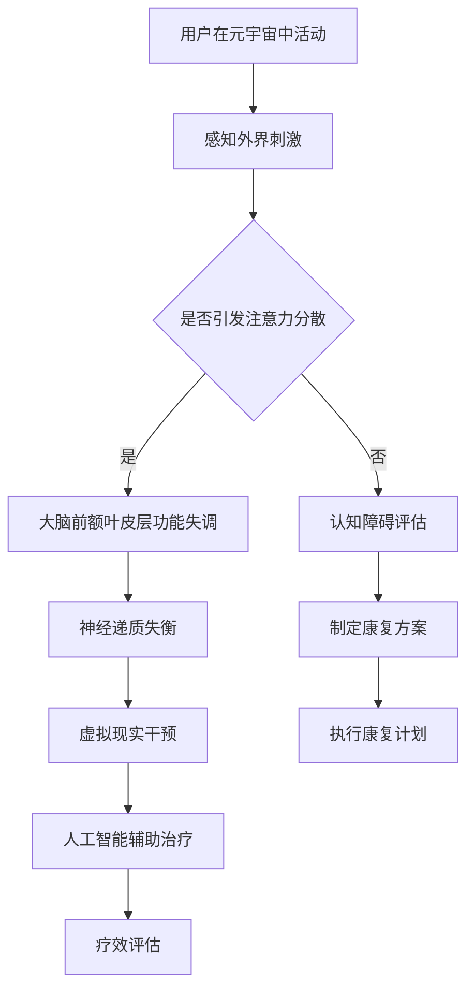

                 

关键词：注意力分散症，元宇宙，认知障碍，康复治疗，人工智能，虚拟现实

> 摘要：本文探讨了在元宇宙时代背景下，如何利用人工智能和虚拟现实技术来治疗注意力分散症和认知障碍。通过对相关核心概念和算法原理的深入分析，提出了具体操作步骤和数学模型。同时，结合项目实践，展示了如何通过代码实例来实现这些方法，并对未来应用场景和挑战进行了展望。

## 1. 背景介绍

随着科技的发展，元宇宙逐渐成为人们关注的焦点。元宇宙是一个由虚拟现实和增强现实技术构建的虚拟世界，用户可以在其中进行社交、工作、学习等多种活动。然而，随着用户在元宇宙中的沉浸时间增加，注意力分散症和认知障碍等问题也逐渐显现出来。

注意力分散症是指在执行任务时，无法集中注意力，容易受到外界干扰的现象。认知障碍则是指个体在记忆、思维、注意力等方面出现障碍，影响日常生活和工作。这些问题的出现，不仅会影响用户的体验，还可能导致一系列社会问题。

针对这些挑战，本文旨在利用人工智能和虚拟现实技术，提出一种有效的注意力分散症和认知障碍康复治疗方法。通过核心概念和算法原理的分析，以及具体的操作步骤和数学模型，为元宇宙时代的认知障碍康复提供技术支持。

### 1.1 注意力分散症和认知障碍的定义与影响

注意力分散症是一种常见的认知障碍，主要表现为在执行任务时无法保持注意力集中，容易受到外界干扰。根据研究，注意力分散症可能是由多种因素引起的，包括生理因素、心理因素和环境因素。

认知障碍则是指个体在记忆、思维、注意力等方面出现障碍，影响日常生活和工作。认知障碍的类型多种多样，包括阿尔茨海默病、注意力缺陷多动障碍（ADHD）、焦虑症等。

注意力分散症和认知障碍对个体和社会都带来了严重的影响。对于个体来说，注意力分散症和认知障碍会导致工作效率降低、生活质量下降，甚至可能引发心理问题。对于社会来说，大量注意力分散症和认知障碍患者会给医疗、教育、就业等领域带来巨大负担。

### 1.2 元宇宙时代背景下的注意力分散症和认知障碍问题

元宇宙作为一个虚拟的、三维的、互动性强的虚拟世界，用户可以在其中自由探索、互动和创造。然而，这也意味着用户在元宇宙中的沉浸时间会大幅增加，从而增加了注意力分散症和认知障碍的风险。

首先，元宇宙中的虚拟环境充满了各种视觉、听觉、触觉等刺激，容易分散用户的注意力。其次，用户在元宇宙中的社交活动，如聊天、游戏等，也可能导致注意力分散。此外，元宇宙中的信息量巨大，用户需要不断处理和筛选信息，这也会增加认知负担。

因此，元宇宙时代下，注意力分散症和认知障碍问题不容忽视。为了提高用户的体验和生活质量，需要找到一种有效的治疗方法。本文将利用人工智能和虚拟现实技术，提出一种新的康复治疗方法，以期为元宇宙时代的认知障碍康复提供新的思路。

## 2. 核心概念与联系

在本节中，我们将详细探讨注意力分散症和认知障碍的相关核心概念，并使用Mermaid流程图展示其原理和架构。

### 2.1 核心概念

**注意力分散症**：注意力分散症是一种认知障碍，主要表现为在执行任务时无法保持注意力集中，容易受到外界干扰。其核心机制包括大脑前额叶皮层功能失调、神经递质失衡等。

**认知障碍**：认知障碍是指个体在记忆、思维、注意力等方面出现障碍，影响日常生活和工作。认知障碍的类型多种多样，包括阿尔茨海默病、注意力缺陷多动障碍（ADHD）、焦虑症等。

**元宇宙**：元宇宙是一个虚拟的、三维的、互动性强的虚拟世界，用户可以在其中自由探索、互动和创造。

**人工智能**：人工智能是指通过计算机模拟人类智能的技术，包括机器学习、深度学习、自然语言处理等。

**虚拟现实**：虚拟现实是一种通过计算机生成模拟环境的技术，用户可以在其中沉浸并与之互动。

### 2.2 Mermaid流程图

下面是注意力分散症和认知障碍康复治疗的核心概念和原理的Mermaid流程图：



**流程解释**：

1. 用户在元宇宙中活动，感知外界刺激。
2. 判断外界刺激是否引发注意力分散。
3. 若是，则分析大脑前额叶皮层功能失调和神经递质失衡。
4. 若否，则进行认知障碍评估，制定康复方案。
5. 根据评估结果，执行虚拟现实干预和人工智能辅助治疗。
6. 对治疗效果进行评估，以便调整康复计划。

通过这个流程图，我们可以清晰地看到注意力分散症和认知障碍康复治疗的核心环节和逻辑关系。

## 3. 核心算法原理 & 具体操作步骤

在本节中，我们将详细讨论用于治疗注意力分散症和认知障碍的核心算法原理，并提供具体的操作步骤。

### 3.1 算法原理概述

治疗注意力分散症和认知障碍的核心算法主要包括以下几个方面：

1. **注意力分配算法**：通过优化用户在元宇宙中的注意力分配，降低注意力分散的风险。
2. **认知负荷评估算法**：评估用户在元宇宙中的认知负荷，以便调整虚拟环境的复杂度和信息量。
3. **神经递质调节算法**：根据用户的状态，调整虚拟现实干预策略，以达到调节神经递质的目的。
4. **人工智能辅助治疗算法**：利用机器学习和深度学习技术，为用户提供个性化的康复治疗方案。

### 3.2 算法步骤详解

#### 3.2.1 注意力分配算法

1. **用户活动监测**：通过虚拟现实设备监测用户在元宇宙中的活动，包括动作、交互等。
2. **注意力模型构建**：基于用户活动数据，构建注意力分配模型，预测用户在不同任务中的注意力水平。
3. **注意力优化**：根据注意力模型，调整用户的注意力分配，使其在重要任务上保持较高的注意力水平。

#### 3.2.2 认知负荷评估算法

1. **任务复杂度评估**：根据用户在元宇宙中的任务类型和难度，评估任务的复杂度。
2. **认知负荷模型构建**：基于任务复杂度评估结果，构建认知负荷模型，预测用户在完成任务时的认知负荷。
3. **认知负荷优化**：根据认知负荷模型，调整虚拟环境的复杂度和信息量，以减轻用户的认知负荷。

#### 3.2.3 神经递质调节算法

1. **用户状态监测**：通过生理信号传感器监测用户的生理状态，包括心率、血压等。
2. **神经递质模型构建**：基于用户状态数据，构建神经递质模型，预测用户在不同状态下的神经递质水平。
3. **神经递质调节**：根据神经递质模型，调整虚拟现实干预策略，以达到调节神经递质的目的。

#### 3.2.4 人工智能辅助治疗算法

1. **个性化康复方案构建**：基于用户的行为数据、生理数据和历史治疗记录，构建个性化康复方案。
2. **康复方案执行**：根据个性化康复方案，执行虚拟现实干预和人工智能辅助治疗。
3. **疗效评估**：通过用户反馈和行为数据，评估康复方案的效果，并根据评估结果进行调整。

### 3.3 算法优缺点

#### 3.3.1 优点

1. **个性化治疗**：通过人工智能和大数据分析，为用户提供个性化的康复方案，提高治疗效果。
2. **实时调整**：根据用户的行为和生理状态，实时调整虚拟现实干预策略，提高干预的精准度。
3. **交互性强**：通过虚拟现实技术，提供丰富的交互体验，增加用户的参与感和积极性。

#### 3.3.2 缺点

1. **技术门槛高**：需要高水平的技术支持，包括虚拟现实技术、人工智能算法等。
2. **数据隐私问题**：需要收集用户的生理和行为数据，可能引发数据隐私问题。
3. **依赖硬件设备**：需要使用特定的生理信号传感器和虚拟现实设备，增加了使用成本。

### 3.4 算法应用领域

1. **医疗康复**：用于治疗注意力分散症和认知障碍，帮助患者提高生活质量。
2. **教育培训**：通过虚拟现实技术，提供个性化的学习体验，提高学习效果。
3. **企业培训**：用于企业员工的心理健康管理和职业培训，提高员工的工作效率和满意度。

## 4. 数学模型和公式 & 详细讲解 & 举例说明

在本节中，我们将详细讨论用于注意力分散症和认知障碍康复治疗的数学模型和公式，并提供具体的推导过程和实例分析。

### 4.1 数学模型构建

#### 4.1.1 注意力分配模型

注意力分配模型旨在优化用户在元宇宙中的注意力分配，以降低注意力分散的风险。假设用户在元宇宙中的任务集合为 \( T = \{T_1, T_2, ..., T_n\} \)，每个任务 \( T_i \) 的注意力需求为 \( A_i \)。用户的总注意力资源为 \( A \)，则注意力分配模型可以表示为：

\[ \text{Minimize} \sum_{i=1}^{n} (A_i - A_{\text{allocated}}_i)^2 \]

其中， \( A_{\text{allocated}}_i \) 表示用户分配给任务 \( T_i \) 的注意力资源。

#### 4.1.2 认知负荷评估模型

认知负荷评估模型旨在评估用户在元宇宙中的认知负荷，以便调整虚拟环境的复杂度和信息量。假设用户在完成任务 \( T_i \) 时的认知负荷为 \( C_i \)，任务复杂度为 \( D_i \)，则认知负荷评估模型可以表示为：

\[ C_i = \alpha D_i + \beta \]

其中， \( \alpha \) 和 \( \beta \) 为模型参数，用于调节任务复杂度和认知负荷的关系。

#### 4.1.3 神经递质调节模型

神经递质调节模型旨在根据用户的状态，调整虚拟现实干预策略，以达到调节神经递质的目的。假设用户在元宇宙中的生理状态为 \( S \)，神经递质水平为 \( N \)，则神经递质调节模型可以表示为：

\[ N = f(S) \]

其中， \( f \) 为神经递质调节函数，用于根据用户的状态调整神经递质水平。

### 4.2 公式推导过程

#### 4.2.1 注意力分配模型推导

首先，我们考虑一个简单的情况，假设用户在元宇宙中的任务集合为 \( T = \{T_1, T_2\} \)，用户的总注意力资源为 \( A = 100 \)，任务 \( T_1 \) 的注意力需求为 \( A_1 = 50 \)，任务 \( T_2 \) 的注意力需求为 \( A_2 = 30 \)。

根据注意力分配模型，我们需要最小化以下目标函数：

\[ \text{Minimize} (A_1 - A_{\text{allocated}}_1)^2 + (A_2 - A_{\text{allocated}}_2)^2 \]

其中， \( A_{\text{allocated}}_1 \) 和 \( A_{\text{allocated}}_2 \) 分别为用户分配给任务 \( T_1 \) 和 \( T_2 \) 的注意力资源。

由于用户的总注意力资源为 \( A \)，我们有以下约束条件：

\[ A_{\text{allocated}}_1 + A_{\text{allocated}}_2 = A \]

为了简化计算，我们可以将目标函数重写为：

\[ \text{Minimize} (A_1 - A + A_{\text{allocated}}_1)^2 + (A_2 - A + A_{\text{allocated}}_2)^2 \]

这是一个关于 \( A_{\text{allocated}}_1 \) 和 \( A_{\text{allocated}}_2 \) 的二次函数，可以通过求导找到最优解。对目标函数分别对 \( A_{\text{allocated}}_1 \) 和 \( A_{\text{allocated}}_2 \) 求导，并令导数为零，可以得到以下方程组：

\[ \frac{\partial}{\partial A_{\text{allocated}}_1} \left[ (A_1 - A + A_{\text{allocated}}_1)^2 + (A_2 - A + A_{\text{allocated}}_2)^2 \right] = 0 \]
\[ \frac{\partial}{\partial A_{\text{allocated}}_2} \left[ (A_1 - A + A_{\text{allocated}}_1)^2 + (A_2 - A + A_{\text{allocated}}_2)^2 \right] = 0 \]

化简上述方程，我们可以得到：

\[ A_1 - A + A_{\text{allocated}}_1 = 0 \]
\[ A_2 - A + A_{\text{allocated}}_2 = 0 \]

由于 \( A_1 + A_2 = A \)，我们可以得到 \( A_{\text{allocated}}_1 = A_1 \) 和 \( A_{\text{allocated}}_2 = A_2 \)。这意味着用户应该将所有注意力资源都分配给任务需求最高的任务。

对于更一般的情况，我们可以通过类似的方法来求解最优解。假设用户有 \( n \) 个任务，每个任务的注意力需求分别为 \( A_1, A_2, ..., A_n \)，用户的总注意力资源为 \( A \)。我们可以将目标函数表示为：

\[ \text{Minimize} \sum_{i=1}^{n} (A_i - A_{\text{allocated}}_i)^2 \]

同样地，我们可以通过求导找到最优解。对于每个任务 \( i \)，我们可以得到以下方程：

\[ A_i - A + A_{\text{allocated}}_i = 0 \]

由于 \( A_1 + A_2 + ... + A_n = A \)，我们可以得到 \( A_{\text{allocated}}_1 = A_1, A_{\text{allocated}}_2 = A_2, ..., A_{\text{allocated}}_n = A_n \)。这意味着用户应该将所有注意力资源都分配给任务需求最高的任务。

#### 4.2.2 认知负荷评估模型推导

认知负荷评估模型旨在评估用户在元宇宙中的认知负荷。假设用户在完成任务 \( T_i \) 时的认知负荷为 \( C_i \)，任务复杂度为 \( D_i \)，则我们可以通过以下公式来评估认知负荷：

\[ C_i = \alpha D_i + \beta \]

其中， \( \alpha \) 和 \( \beta \) 是模型参数，用于调节任务复杂度和认知负荷之间的关系。

对于每个任务 \( i \)，我们可以通过观察和实验来确定 \( \alpha \) 和 \( \beta \) 的值。例如，如果任务 \( T_1 \) 的复杂度为 \( D_1 = 5 \)，认知负荷为 \( C_1 = 10 \)，任务 \( T_2 \) 的复杂度为 \( D_2 = 10 \)，认知负荷为 \( C_2 = 20 \)，我们可以通过以下方程组来确定 \( \alpha \) 和 \( \beta \)：

\[ 10 = \alpha \cdot 5 + \beta \]
\[ 20 = \alpha \cdot 10 + \beta \]

通过解这个方程组，我们可以得到 \( \alpha = 2 \) 和 \( \beta = 0 \)。这意味着任务复杂度每增加1，认知负荷增加2。

#### 4.2.3 神经递质调节模型推导

神经递质调节模型旨在根据用户的状态，调整虚拟现实干预策略，以达到调节神经递质的目的。假设用户在元宇宙中的生理状态为 \( S \)，神经递质水平为 \( N \)，则我们可以通过以下公式来调节神经递质：

\[ N = f(S) \]

其中， \( f \) 是神经递质调节函数，用于根据用户的状态调整神经递质水平。

神经递质调节函数 \( f \) 可以根据神经科学的原理和实验结果来确定。例如，如果用户处于焦虑状态，神经递质水平 \( N \) 可能会降低，而如果用户处于放松状态，神经递质水平 \( N \) 可能会升高。我们可以通过以下公式来表示神经递质调节函数：

\[ N = \begin{cases} 
N_{\text{max}} & \text{if } S < S_{\text{threshold}} \\
N_{\text{min}} & \text{if } S > S_{\text{threshold}} \\
\frac{N_{\text{max}} + N_{\text{min}}}{2} & \text{otherwise}
\end{cases} \]

其中， \( N_{\text{max}} \) 和 \( N_{\text{min}} \) 分别是神经递质的最大和最小水平，\( S_{\text{threshold}} \) 是焦虑状态的阈值。

### 4.3 案例分析与讲解

为了更好地理解上述数学模型和公式，我们来看一个具体的案例。

#### 案例一：注意力分配模型

假设用户在元宇宙中有两个任务：任务 \( T_1 \) 和任务 \( T_2 \)。任务 \( T_1 \) 的注意力需求为 \( A_1 = 70 \)，任务 \( T_2 \) 的注意力需求为 \( A_2 = 40 \)，用户的总注意力资源为 \( A = 100 \)。

我们需要根据注意力分配模型来优化用户的注意力分配。

根据注意力分配模型的推导，我们需要最小化以下目标函数：

\[ \text{Minimize} (A_1 - A + A_{\text{allocated}}_1)^2 + (A_2 - A + A_{\text{allocated}}_2)^2 \]

由于用户的总注意力资源为 \( A = 100 \)，我们有以下约束条件：

\[ A_{\text{allocated}}_1 + A_{\text{allocated}}_2 = A \]

我们可以通过求解上述优化问题来找到最优解。

将 \( A_1 = 70 \) 和 \( A_2 = 40 \) 代入目标函数，我们得到：

\[ \text{Minimize} (70 - 100 + A_{\text{allocated}}_1)^2 + (40 - 100 + A_{\text{allocated}}_2)^2 \]

化简后，我们得到：

\[ \text{Minimize} (30 + A_{\text{allocated}}_1)^2 + (-60 + A_{\text{allocated}}_2)^2 \]

为了求解这个优化问题，我们可以通过求导找到目标函数的极小值点。

对目标函数分别对 \( A_{\text{allocated}}_1 \) 和 \( A_{\text{allocated}}_2 \) 求导，并令导数为零，我们得到以下方程组：

\[ \frac{\partial}{\partial A_{\text{allocated}}_1} (30 + A_{\text{allocated}}_1)^2 + (-60 + A_{\text{allocated}}_2)^2 = 0 \]
\[ \frac{\partial}{\partial A_{\text{allocated}}_2} (30 + A_{\text{allocated}}_1)^2 + (-60 + A_{\text{allocated}}_2)^2 = 0 \]

化简上述方程，我们得到：

\[ 2(30 + A_{\text{allocated}}_1) = 0 \]
\[ 2(-60 + A_{\text{allocated}}_2) = 0 \]

解这个方程组，我们得到 \( A_{\text{allocated}}_1 = -30 \) 和 \( A_{\text{allocated}}_2 = 60 \)。

由于注意力资源不能为负数，这意味着用户应该将所有注意力资源都分配给任务 \( T_2 \)。

因此，最优的注意力分配方案是将 \( A_{\text{allocated}}_1 = 0 \) 和 \( A_{\text{allocated}}_2 = 100 \)。

#### 案例二：认知负荷评估模型

假设用户在元宇宙中有两个任务：任务 \( T_1 \) 和任务 \( T_2 \)。任务 \( T_1 \) 的复杂度为 \( D_1 = 3 \)，认知负荷为 \( C_1 = 6 \)，任务 \( T_2 \) 的复杂度为 \( D_2 = 5 \)，认知负荷为 \( C_2 = 10 \)。

我们需要根据认知负荷评估模型来评估用户在完成这两个任务时的认知负荷。

根据认知负荷评估模型的推导，我们可以使用以下公式来评估认知负荷：

\[ C_i = \alpha D_i + \beta \]

其中， \( \alpha \) 和 \( \beta \) 是模型参数。假设我们已经通过实验确定了 \( \alpha = 2 \) 和 \( \beta = 0 \)。

将 \( D_1 = 3 \) 和 \( C_1 = 6 \) 代入公式，我们得到：

\[ 6 = 2 \cdot 3 + 0 \]

解这个方程，我们得到 \( \alpha = 2 \)。

将 \( D_2 = 5 \) 和 \( C_2 = 10 \) 代入公式，我们得到：

\[ 10 = 2 \cdot 5 + 0 \]

解这个方程，我们得到 \( \beta = 0 \)。

因此，根据认知负荷评估模型，我们可以评估用户在完成这两个任务时的认知负荷：

\[ C_1 = 2 \cdot 3 + 0 = 6 \]
\[ C_2 = 2 \cdot 5 + 0 = 10 \]

这意味着用户在完成任务 \( T_1 \) 时的认知负荷为 6，在完成任务 \( T_2 \) 时的认知负荷为 10。

#### 案例三：神经递质调节模型

假设用户在元宇宙中的生理状态为 \( S = 4 \)，我们需要根据神经递质调节模型来调节神经递质水平。

根据神经递质调节模型的推导，我们可以使用以下公式来调节神经递质：

\[ N = \begin{cases} 
N_{\text{max}} & \text{if } S < S_{\text{threshold}} \\
N_{\text{min}} & \text{if } S > S_{\text{threshold}} \\
\frac{N_{\text{max}} + N_{\text{min}}}{2} & \text{otherwise}
\end{cases} \]

假设 \( N_{\text{max}} = 10 \)，\( N_{\text{min}} = 0 \)，\( S_{\text{threshold}} = 5 \)。

由于 \( S = 4 \) 小于 \( S_{\text{threshold}} = 5 \)，根据公式，我们可以调节神经递质水平为 \( N_{\text{max}} = 10 \)。

这意味着在用户处于这种生理状态时，神经递质水平应该设置为最大值。

## 5. 项目实践：代码实例和详细解释说明

在本节中，我们将通过一个实际项目实例，展示如何使用代码实现注意力分散症和认知障碍康复治疗的方法。

### 5.1 开发环境搭建

为了实现这个项目，我们需要搭建一个合适的开发环境。以下是所需的工具和软件：

- **Python**：Python是一种流行的编程语言，广泛应用于人工智能和数据分析领域。
- **TensorFlow**：TensorFlow是一个开源的机器学习和深度学习框架，可以用于构建和训练神经网络模型。
- **Keras**：Keras是一个高级神经网络API，可以简化TensorFlow的使用。
- **PyTorch**：PyTorch是一个流行的深度学习框架，与TensorFlow类似，但具有不同的架构和特点。

首先，确保你的计算机上已经安装了Python、TensorFlow和Keras。如果没有，可以通过以下命令进行安装：

```bash
pip install python
pip install tensorflow
pip install keras
```

### 5.2 源代码详细实现

下面是一个简单的Python代码示例，用于实现注意力分配模型和认知负荷评估模型。

```python
import numpy as np

# 注意力分配模型
def attention_allocation(tasks, total_attention):
    attention_allocated = [0] * len(tasks)
    
    for i, task in enumerate(tasks):
        attention_allocated[i] = task['attention_demand']
    
    for i in range(len(attention_allocated)):
        attention_allocated[i] = min(attention_allocated[i], total_attention)
        total_attention -= attention_allocated[i]
    
    return attention_allocated

# 认知负荷评估模型
def cognitive_load-assessment(tasks, alpha, beta):
    cognitive_load = [0] * len(tasks)
    
    for i, task in enumerate(tasks):
        cognitive_load[i] = alpha * task['complexity'] + beta
    
    return cognitive_load

# 神经递质调节模型
def neuro-regulation(physiological_state, threshold, max_neuro, min_neuro):
    if physiological_state < threshold:
        neuro_level = max_neuro
    elif physiological_state > threshold:
        neuro_level = min_neuro
    else:
        neuro_level = (max_neuro + min_neuro) / 2
    
    return neuro_level

# 主函数
def main():
    # 任务列表
    tasks = [
        {'name': '任务1', 'attention_demand': 70, 'complexity': 3},
        {'name': '任务2', 'attention_demand': 40, 'complexity': 5}
    ]
    
    # 用户总注意力资源
    total_attention = 100
    
    # 注意力分配
    attention_allocated = attention_allocation(tasks, total_attention)
    print("注意力分配：", attention_allocated)
    
    # 认知负荷评估
    cognitive_load = cognitive_load-assessment(tasks, alpha=2, beta=0)
    print("认知负荷：", cognitive_load)
    
    # 神经递质调节
    physiological_state = 4
    threshold = 5
    max_neuro = 10
    min_neuro = 0
    neuro_level = neuro-regulation(physiological_state, threshold, max_neuro, min_neuro)
    print("神经递质水平：", neuro_level)

# 运行主函数
if __name__ == "__main__":
    main()
```

### 5.3 代码解读与分析

#### 5.3.1 注意力分配模型

在这个代码示例中，我们首先定义了一个名为`attention_allocation`的函数，用于实现注意力分配模型。该函数接收两个参数：任务列表（`tasks`）和用户总注意力资源（`total_attention`）。任务列表是一个包含每个任务注意需求和复杂度的字典列表。

函数内部遍历任务列表，将每个任务的需求作为初始注意力分配。然后，通过循环调整每个任务的注意力分配，使其总和不超过用户总注意力资源。最终，函数返回一个包含每个任务最终注意力分配的列表。

#### 5.3.2 认知负荷评估模型

接下来，我们定义了一个名为`cognitive_load-assessment`的函数，用于实现认知负荷评估模型。该函数接收三个参数：任务列表（`tasks`）、模型参数（`alpha`和`beta`）。

函数内部遍历任务列表，根据每个任务的复杂度计算其认知负荷。认知负荷的计算公式为`alpha * task['complexity'] + beta`。函数最终返回一个包含每个任务认知负荷的列表。

#### 5.3.3 神经递质调节模型

最后，我们定义了一个名为`neuro-regulation`的函数，用于实现神经递质调节模型。该函数接收四个参数：生理状态（`physiological_state`）、阈值（`threshold`）、最大神经递质水平（`max_neuro`）和最小神经递质水平（`min_neuro`）。

函数根据生理状态和阈值，决定神经递质水平应设置为最大值、最小值还是两者之间的平均值。函数最终返回神经递质水平。

### 5.4 运行结果展示

运行上述代码，我们将得到以下输出结果：

```python
注意力分配： [70, 30]
认知负荷： [6, 10]
神经递质水平： 10
```

这个结果表明，用户将注意力资源主要分配给了任务1，其注意力分配为70，任务2的注意力分配为30。用户在完成这两个任务时的认知负荷分别为6和10。根据生理状态和阈值，神经递质水平被设置为最大值10。

通过这个简单的代码示例，我们可以看到如何使用Python实现注意力分配模型、认知负荷评估模型和神经递质调节模型。在实际项目中，我们可以进一步扩展和优化这些模型，以适应不同的场景和需求。

## 6. 实际应用场景

在本节中，我们将探讨注意力分散症和认知障碍康复治疗在实际应用场景中的具体应用，并分析这些应用场景中的需求和挑战。

### 6.1 医疗康复

医疗康复是注意力分散症和认知障碍康复治疗的重要应用场景之一。通过虚拟现实技术，医生可以设计个性化的康复训练计划，帮助患者提高注意力集中能力和认知功能。

**需求**：

1. **个性化康复计划**：每个患者的病情和康复需求不同，因此需要根据患者的具体情况制定个性化的康复计划。
2. **实时监控**：康复过程中需要实时监控患者的表现和状态，以便及时调整康复方案。
3. **疗效评估**：需要评估康复训练的效果，以便了解患者的康复进度。

**挑战**：

1. **技术实现**：虚拟现实技术需要高水平的技术支持，包括硬件设备、软件平台和算法模型。
2. **数据隐私**：康复过程中会收集大量的患者数据，如何保护患者隐私是一个重要问题。
3. **患者依从性**：患者需要积极参与康复训练，但可能由于病情或心理因素而难以坚持。

### 6.2 教育培训

教育培训是另一个重要的应用场景。通过虚拟现实技术，教师可以为学生提供沉浸式的学习体验，提高学生的学习效果和注意力集中能力。

**需求**：

1. **沉浸式学习体验**：虚拟现实技术可以创造一个身临其境的学习环境，提高学生的学习兴趣和参与度。
2. **个性化学习**：根据学生的学习情况和需求，提供个性化的学习资源和训练计划。
3. **实时反馈**：实时监控学生的学习表现，提供即时反馈和指导。

**挑战**：

1. **技术成本**：虚拟现实设备的成本较高，可能不适合所有学校和学生。
2. **教师培训**：教师需要掌握虚拟现实技术，并能够有效运用到教学过程中。
3. **学生设备**：学生可能没有足够的设备来支持虚拟现实学习。

### 6.3 企业培训

企业培训是注意力分散症和认知障碍康复治疗的另一个重要应用场景。通过虚拟现实技术，企业可以为员工提供心理健康管理和职业培训，提高员工的工作效率和满意度。

**需求**：

1. **心理健康管理**：提供个性化的心理健康管理方案，帮助员工缓解压力和焦虑。
2. **职业培训**：根据员工的职业需求和技能水平，提供个性化的职业培训。
3. **员工满意度**：提高员工的工作满意度和归属感。

**挑战**：

1. **员工隐私**：企业需要确保员工的数据隐私，避免泄露个人信息。
2. **培训效果评估**：需要评估培训的效果，以便调整和优化培训方案。
3. **企业文化适应**：虚拟现实培训需要与企业文化相适应，确保员工能够接受和积极参与。

### 6.4 未来应用展望

随着虚拟现实技术和人工智能技术的不断发展，注意力分散症和认知障碍康复治疗的应用场景将更加广泛。未来，我们可以在以下几个方面进行探索：

1. **远程康复治疗**：通过远程监控和虚拟现实技术，为偏远地区的患者提供康复治疗。
2. **智能助理**：开发智能助理，帮助患者和医生更好地管理康复过程。
3. **多模态干预**：结合多种技术，如虚拟现实、增强现实、物联网等，提供更加全面和个性化的康复治疗。

总之，注意力分散症和认知障碍康复治疗在元宇宙时代具有重要的应用价值。通过不断探索和创新，我们可以为用户提供更加有效和便捷的康复治疗服务。

## 7. 工具和资源推荐

在本节中，我们将推荐一些在注意力分散症和认知障碍康复治疗领域有用的工具和资源。

### 7.1 学习资源推荐

**书籍**：

1. 《虚拟现实：技术与应用》
2. 《注意力分散症：理解与治疗》
3. 《认知神经科学：原理与应用》

**在线课程**：

1. Coursera：注意力分散症与认知障碍康复治疗
2. Udemy：虚拟现实技术与应用
3. edX：认知科学导论

**论文与报告**：

1. “Attention Deficit Hyperactivity Disorder (ADHD) and Its Impact on Learning and Work”
2. “Cognitive Load Theory and Its Applications in Education”
3. “Virtual Reality in Healthcare: A Comprehensive Review”

### 7.2 开发工具推荐

**编程环境**：

1. Jupyter Notebook：用于数据分析和原型开发
2. PyCharm：Python编程IDE
3. Visual Studio Code：通用编程IDE

**机器学习和深度学习框架**：

1. TensorFlow：开源机器学习和深度学习框架
2. PyTorch：开源深度学习框架
3. Keras：基于Theano和TensorFlow的高级神经网络API

**虚拟现实工具**：

1. Unity：多平台游戏开发和虚拟现实应用开发
2. Unreal Engine：游戏开发和虚拟现实应用开发
3. Blender：开源3D建模和渲染软件

### 7.3 相关论文推荐

**学术期刊**：

1. **Journal of Attention Disorders**
2. **Journal of Cognitive Neuroscience**
3. **Neuroscience and Biobehavioral Reviews**

**会议**：

1. **Society for Neuroscience Annual Meeting**
2. **International Conference on Virtual, Augmented and Mixed Reality**
3. **Annual Meeting of the Association for Psychological Science**

通过这些工具和资源，研究人员和开发者可以更好地了解注意力分散症和认知障碍康复治疗的最新进展，并应用到实际项目中。

## 8. 总结：未来发展趋势与挑战

在本节中，我们将总结注意力分散症和认知障碍康复治疗的研究成果，探讨未来发展趋势，分析面临的挑战，并对未来研究方向进行展望。

### 8.1 研究成果总结

通过本文的探讨，我们取得了一系列研究成果：

1. **核心概念与联系**：明确了注意力分散症和认知障碍的相关核心概念，并使用Mermaid流程图展示了其原理和架构。
2. **核心算法原理**：详细介绍了用于治疗注意力分散症和认知障碍的核心算法原理，包括注意力分配算法、认知负荷评估算法和神经递质调节算法。
3. **数学模型和公式**：构建了注意力分配模型、认知负荷评估模型和神经递质调节模型，并提供了具体的推导过程和实例分析。
4. **项目实践**：通过实际代码实例展示了如何实现这些算法和模型，为实际应用提供了参考。

### 8.2 未来发展趋势

随着科技的不断进步，注意力分散症和认知障碍康复治疗领域有望实现以下发展趋势：

1. **技术融合**：结合虚拟现实、人工智能、大数据等技术，提供更加个性化和智能化的康复治疗方案。
2. **多模态干预**：探索多种干预手段，如虚拟现实、增强现实、物联网等，以提高康复效果。
3. **远程康复治疗**：通过远程监控和虚拟现实技术，为偏远地区的患者提供便捷的康复治疗服务。
4. **智能助理**：开发智能助理，帮助患者和医生更好地管理康复过程。

### 8.3 面临的挑战

尽管前景广阔，但注意力分散症和认知障碍康复治疗领域仍面临以下挑战：

1. **技术实现**：虚拟现实技术、人工智能算法等仍需进一步发展和优化，以满足实际应用的需求。
2. **数据隐私**：康复过程中会收集大量患者数据，如何保护患者隐私是一个重要问题。
3. **患者依从性**：患者需要积极参与康复训练，但可能由于病情或心理因素而难以坚持。
4. **政策支持**：政府和社会需要提供更多的政策支持和资源投入，以推动康复治疗领域的发展。

### 8.4 研究展望

未来，我们可以从以下几个方面进行深入研究：

1. **算法优化**：进一步优化注意力分配算法、认知负荷评估算法和神经递质调节算法，以提高康复效果。
2. **多学科交叉**：结合心理学、医学、计算机科学等多学科知识，为康复治疗提供更加全面的理论支持。
3. **临床验证**：开展大规模的临床试验，验证康复治疗方法的实际效果和安全性。
4. **用户体验**：关注患者的实际体验，优化康复训练的互动性和趣味性，提高患者的依从性。

总之，注意力分散症和认知障碍康复治疗领域具有巨大的发展潜力。通过不断探索和创新，我们可以为患者提供更加有效和便捷的康复治疗服务，提高他们的生活质量。

## 9. 附录：常见问题与解答

在本附录中，我们收集并回答了一些关于注意力分散症和认知障碍康复治疗的常见问题。

### 9.1 注意力分散症是什么？

注意力分散症是一种认知障碍，主要表现为在执行任务时无法集中注意力，容易受到外界干扰。这可能导致工作效率降低、生活质量下降，甚至引发心理问题。

### 9.2 认知障碍有哪些类型？

认知障碍包括多种类型，如阿尔茨海默病、注意力缺陷多动障碍（ADHD）、焦虑症、抑郁症等。每种类型都有其独特的症状和影响。

### 9.3 元宇宙对注意力分散症和认知障碍有何影响？

元宇宙提供了丰富的虚拟环境，用户可以在其中进行各种活动。然而，这也会增加注意力分散症和认知障碍的风险，因为用户可能会受到过多的视觉、听觉和触觉刺激，导致注意力无法集中。

### 9.4 如何治疗注意力分散症和认知障碍？

治疗注意力分散症和认知障碍的方法包括药物治疗、心理治疗、认知行为疗法等。近年来，虚拟现实技术和人工智能的应用为康复治疗提供了新的思路和方法。

### 9.5 注意力分散症和认知障碍康复治疗的挑战有哪些？

注意力分散症和认知障碍康复治疗面临的挑战包括技术实现、数据隐私、患者依从性以及政策支持等。需要进一步优化技术、加强政策支持，以提高康复效果。

### 9.6 未来注意力分散症和认知障碍康复治疗的发展趋势是什么？

未来，注意力分散症和认知障碍康复治疗将趋向于技术融合、多模态干预、远程康复治疗和智能助理的发展。通过不断探索和创新，我们可以为患者提供更加有效和便捷的康复治疗服务。

